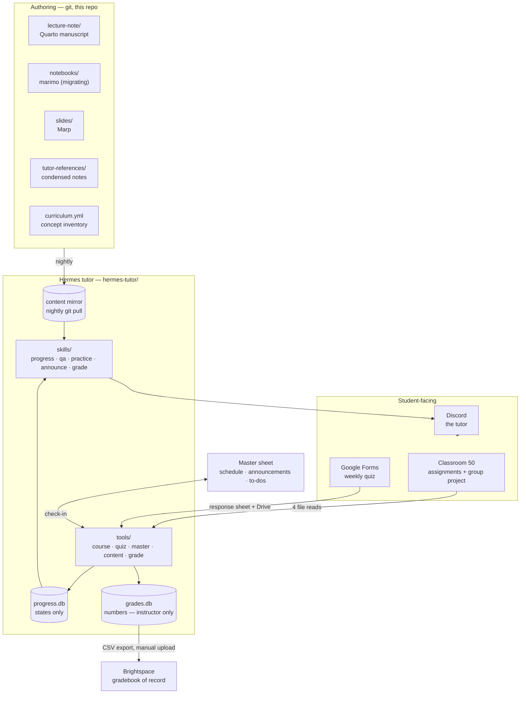

# SSIE 641 — the course system

How the Fall 2026 course actually runs: which system owns which fact, how data
moves between them, and what the tutor bot is and is not allowed to know.

Two repositories and three external services. This file is the map; the
detail lives in the linked documents.

| | repo / service | owns |
|---|---|---|
| authoring | `skojaku/adv-net-sci` (this repo) | lecture notes, slides, worksheets, assignment sources, curriculum |
| agent | `~/Documents/projects/hermes-tutor` | the tutor's tools, skills, and local mirrors |
| submissions | [Classroom 50](https://classroom50.org) — `sk-classroom/classroom50` | assignment repos, autograding, the gradebook |
| quizzes | Google Forms + Sheets | weekly in-class quiz, answers and photos |
| coordination | Google Sheets — *the master sheet* | schedule, announcements, deadlines, instructor to-dos |
| of record | Brightspace | the official gradebook the university reads |

---

## 1. The shape of it



One rule explains most of the design: **every system is read from exactly one
place, and Brightspace is only ever written to.** Brightspace's session cookie
has to be refreshed by hand, so anything that depends on reading it breaks
silently in week 6.

---

## 2. Who owns what

### Classroom 50 owns the graded artifact

GitHub retires GitHub Classroom on **2026-08-28**. Classroom 50 is the Fifty
Foundation's successor and GitHub's named partner for the transition.

It has no server and no database. A classroom is four files in
`sk-classroom/classroom50`:

| file | holds | public? |
|---|---|---|
| `classroom.json` | name, term, org, backing GitHub teams | **yes** (Pages) |
| `assignments.json` | slug, name, `due`, `mode`, tests, threshold | **yes** (Pages) |
| `roster.csv` | `username,first_name,last_name,email,section,github_id,role` | no |
| `scores.json` | the gradebook: per assignment, per student, every submission | no |

Enrollment is **GitHub team membership**, not the CSV — the CSV is display
metadata that carries the real names the Brightspace export needs.

`scores.json` is rebuilt on a **nightly cron at 04:17 UTC**, not per
submission, so the gradebook can be ~24h stale. For "did my last push pass",
read the student's own repo Release (`result.json`), which the autograder
writes on the push itself. This distinction is load-bearing: telling a student
who fixed their code an hour ago that they are failing is the single worst
failure mode this bot has.

Operational detail: [`hermes-tutor/docs/classroom50-notes.md`](https://github.com/skojaku/adv-net-sci).

### Google Forms owns the weekly quiz

Classroom 50 cannot give quizzes — it grades repositories, and its assignment
config is published to public GitHub Pages, so any fixed answer key is
world-readable. Forms has native Quiz mode with answer keys, and its
file-upload question forces a sign-in, so every response carries a verified
`@binghamton.edu` address — the join key to `roster.csv` and from there to a
GitHub login.

Multiple choice is graded by Forms. The photograph of the handwritten work is
graded from the image by a vision model through OpenRouter. Students may
retake as often as they like; the highest attempt counts and every attempt is
kept.

Detail: [`hermes-tutor/docs/quiz-pipeline.md`](https://github.com/skojaku/adv-net-sci).

### The master sheet owns coordination

A Google Spreadsheet the instructor edits by hand, and the bot reads on a
schedule. This exists so that changing a deadline, cancelling a class, or
queueing an announcement never requires opening a terminal or touching the
server.

| tab | columns | who writes |
|---|---|---|
| `schedule` | date, module, topic, room, status | instructor |
| `deadlines` | item, kind, due, source, visible_from | instructor |
| `announcements` | id, publish_at, audience, channel, body, status | instructor drafts, bot marks posted |
| `identity` | email, github_login, discord_id, team | instructor fixes by hand |
| `instructor_todo` | item, due, done | both |
| `quiz_sessions` | date, form_id, response_sheet_id, rubric, photo_points | instructor |

`status` on an announcement is the approval gate: the bot posts only rows
marked `approved`, and writes back `posted` with a timestamp. Nothing goes to
students because the bot decided it was time.

### Brightspace owns nothing

It is a sink. `export-brightspace` writes a grade-import CSV keyed on the
roster name; the instructor uploads it whenever convenient. The bot never
reads it and never tells a student to check it.

---

## 3. The privacy boundary

The requirement: **a student must never be able to elicit another student's
grade.** The threat is not a hostile query, it is an agent that loaded a file
containing the whole class into its context and then answered a question
carelessly. Prompt instructions are not a control here. File layout is.

So the mirror is split in two:

```
data/progress.db   states only:  not-accepted | accepted | submitted | passing
                   deadlines, repo urls, team membership.  NO numbers.
data/grades.db     every numeric score: assignment points, quiz points,
                   the Brightspace export.  Instructor path only.
```

| caller | may open | may ask about |
|---|---|---|
| student (Discord) | `progress.db` | themselves only, resolved by Discord id |
| instructor | both | anyone |

Three properties make this hold:

1. **The student-facing CLI cannot open `grades.db`.** Not "is told not to" —
   the path is not in that entry point.
2. **Every student query projects to one student.** `progress.py status <who>`
   returns a single row, so a whole-class payload never enters the context in
   the first place.
3. **Class-wide commands are gated.** `remaining`, `roster`, and every
   `gradebook.py` subcommand require `COURSE_INSTRUCTOR_TOKEN`, which is not
   set in the Discord gateway's environment.

What this does *not* protect against: the instructor asking about student A in
a public channel and the bot answering there. That is a human control, stated
in the announce skill.

The group project is the one place where a score is legitimately shared — every
member of a team gets the same number, and teammates may see each other's team
membership. Nothing else crosses.

---

## 4. Assignments

### The Studio (individual)

Not a problem set. The student runs a **marimo notebook driven by a pi agent
tutor** — authored in [`tutor-prototype/`](tutor-prototype/) — and submits the
lecture note that session produced. One Studio per module: *Studio 02 — The
Small-World Puzzle*, and so on.

The session is a one-on-one dialogue: the tutor asks the student to predict,
explain, calculate, and photograph pen-and-paper work, and builds the notebook
with them one cell at a time. What is turned in is `notebook.py`, the verbatim
session log, and a session summary.

**What is graded is the process, not the code.** Needing hints is not
penalized; the log is read for how the student reasoned. This is why the
assignment cannot be autograded on output correctness the way the Fall 2025
assignments were — grading reads the session record.

It is two public repositories under `sk-classroom`, and a student's clone of
the second one is where their work is committed:

| repo | what |
|---|---|
| [`pi-studio`](https://github.com/sk-classroom/pi-studio) | the pi package: `nb_*` toolkit, chapter orchestration, checkpoint ceremony, verbatim logging, referee. Installed by pi from the module's `.pi/settings.json`, pinned by tag |
| [`advnetsci-studio-m02-small-world`](https://github.com/sk-classroom/advnetsci-studio-m02-small-world) | the module: curriculum, premade cells, assets, launcher |

Both are exports of this repo — publish with `tools/publish_studio.sh`, never
by committing to them directly.

Distribution and submission: Classroom 50, `mode: individual`. The tutor runs
on the course gateway's three aliases (`tutor`, `vision`, `referee`), so a
student needs one issued key and no account of their own.

### The mini-project (group)

Done in class, in teams, from a template the instructor distributes through
GitHub. Submitted through Classroom 50 as a **group assignment**.

Classroom 50 supports this directly, and its semantics are exactly what this
needs:

- Create with `--mode group --max-group-size N` (N between 2 and 100).
  `max_group_size` is **required** for group mode and must be omitted for
  individual mode.
- The first teammate to accept creates the shared repo and becomes its
  *founder*; the repo is named after their username. They then add teammates
  with `gh student invite`.
- The assignment is graded **once, in the founder's repo**. `collect-scores`
  reads that repo's collaborators, intersects them with the classroom team,
  and **credits every one of them the same score**. That is the "same score for
  everyone on the team" requirement, met without any bookkeeping.
- `scores.json` records a group entry with `member_usernames`, so who was on
  which team is recoverable from the gradebook itself — no separate roster of
  teams to maintain.

Four constraints worth knowing before creating it:

1. **The mode is locked after creation.** Individual and group cannot be
   swapped later. Decide before running `assignment add`.
2. **`max_group_size` is advisory, not enforced.** `gh student invite` refuses
   to exceed it, but the GitHub UI bypasses that. It is a coordination hint.
3. **Custom team names are not supported.** Teams are identified by the
   founder's username. Renaming a group repo is not recommended.
4. **A solo submission emits a warning, not an error.** If a group repo
   resolves to just the founder, collection emits `::warning::` — worth
   checking after the first in-class session, since "the team submitted but
   only one person got credit" is the failure that will actually happen.

Verified against the Classroom 50 schemas and wiki on 2026-08-15.

### Does the course still need Classroom 50?

Yes. It is the only piece that gives every student a repository with history,
runs the autograder, and — for the mini-project — credits a whole team from one
submission. Google Forms could collect a file, but not a repo, not a diff, and
not a team. The alternative is collecting notebooks by email, which is worse in
every dimension including the one that matters most, which is being able to see
*when* the work happened.

---

## 5. Authoring

| what | format | notes |
|---|---|---|
| lecture notes | Quarto manuscript, `lecture-note/` | prose stays as-is |
| lecture note **code** | marimo, `notebooks/` | **migration in progress** — not finished |
| slides | **Marp**, `slides/` | see `slides/DECK_BUILD_GUIDE.md`, `SLIDE_RUBRIC.md` |
| figures | TikZ / Altair / seaborn, built by `tools/build_figures.sh` | SVGs are generated, not committed |
| worksheets | LaTeX, `lecture-note/m0X-*/pen-and-paper/` | done before the lecture |
| tutor references | `tutor-references/m0X-{concept,code}.md` | condensed for the bot |
| concept inventory | `curriculum.yml` | stable ids `m05.c12` |

Nothing generated is committed. Build figures before rendering anything.

The marimo migration is the open piece: notes' prose is final, the executable
code is moving from Quarto code blocks into marimo notebooks, module by module.

---

## 6. The tutor

Hermes Agent with a `tutor` profile, four skills, and a small set of CLI tools.
It replaces "Chibi" (`discord-qa-agent`, ~18,600 lines on the DigitalOcean
droplet) — routing, tool calling, sessions, memory, cron and the Discord
gateway are things Hermes already ships.

### What it does

1. **Progress** — what a student has left, what is due, what to do next.
2. **Q&A** — answers grounded in this repo's own lecture notes, not general
   knowledge.
3. **Practice** — generates problems against the concept inventory, grades
   attempts.
4. **Announcements** — class-wide notices and individual nudges, from the
   master sheet, with the instructor approving.
5. **Grading support** — image-based grading of quiz photos and worksheets
   against a rubric.
6. **Reminders to the instructor** — the `instructor_todo` tab, surfaced.

### What it deliberately does not do

- **No attendance.** Removed with Chibi. Attendance is handled in class.
- **No "stump the LLM" challenge.** The Discord game is retired.
- **No LLM quiz-question generation as an assignment.** The graded artifact is
  the Studio notebook now.
- **No reading Brightspace.**
- **No numeric grades to students in a shared channel.**

### Tools

| tool | does |
|---|---|
| `course.py` | Classroom 50 sync, assignments, roster, status, remaining |
| `quiz.py` | Google Forms pull, photo grading, best-attempt scoring |
| `master.py` | master sheet check-in: schedule, announcements, to-dos |
| `content.py` | nightly repo mirror + offline index, release gating |
| `grade.py` | image + rubric → score, via OpenRouter |
| `sync.py` | runs all of the above in the right order, idempotently |

### Offline by design

The bot answers from a **local mirror of this repo**, refreshed nightly. No web
access is needed to answer a question about the course, which removes a whole
class of failure (rate limits, a slow fetch mid-conversation, and answering
from the internet's idea of network science instead of this course's).

The mirror is also **release-gated**: content for a module whose date has not
arrived is not in the index the bot reads. Week 3 cannot leak week 10.

### Models

| job | model | why |
|---|---|---|
| conversation | via OpenRouter, configured per profile | cheap, fast, replaceable |
| photo grading | `anthropic/claude-opus-5` via OpenRouter | a weak vision model misreads a digit and marks correct work wrong; a wrong mark costs a retake, an email, and trust |

Model choice for the conversational path is not cosmetic: during testing a
flash-tier model reported "accepted indicates the assignment is complete" —
exactly backwards. The fix was to ship a `state_legend` inside every payload so
the semantics travel with the data rather than living only in the skill.

---

## 7. Cadence

| job | when | what |
|---|---|---|
| `content.py sync` | nightly, 03:00 ET | git pull this repo, rebuild the index |
| Classroom 50 `collect-scores` | nightly, 04:17 UTC | *theirs* — rebuilds `scores.json` |
| `course.py sync` | nightly, 01:00 ET + on demand | four file reads into `progress.db` / `grades.db` |
| `quiz.py pull` | after each class | Forms responses + photo grading |
| `master.py check` | every 2 hours | approved announcements, due to-dos |
| `export-brightspace` | weekly, manual upload | CSV of assignment + quiz scores |

Scheduled as `hermes cron` jobs, not crontab, so the approval that a recurring
announcement carries happens once at setup time.

---

## 8. Deployment

Everything is built and exercised on the Mac first. The droplet
(`digitalocean`, Ubuntu, 1 vCPU / 1 GB) currently runs Chibi and nothing else
of this stack.

The move is a path change and an env file, by design: every tool resolves its
roots from `COURSE_HOME`, `COURSE_REPO`, and `COURSE_DB` rather than a
hard-coded home directory. See `hermes-tutor/docs/deploy.md`.

---

## 9. Open items

- [ ] Fall 2026 Classroom 50 roster is empty; assignments not created.
- [ ] Brightspace class list not yet exported (needed for the email invite).
- [ ] `export-brightspace` column headers unverified against a real import.
- [ ] Discord gateway not connected: no bot token, no channel ids.
- [ ] marimo migration of the lecture-note code is unfinished.
- [ ] Mini-project template not written.
- [ ] One quiz form per session, or one form all semester with a session
      dropdown?
- [ ] Quiz scores to Brightspace per session, or one column at the end?

---

*Written 2026-08-15. Classroom 50 facts verified against its schemas and wiki
on that date.*
