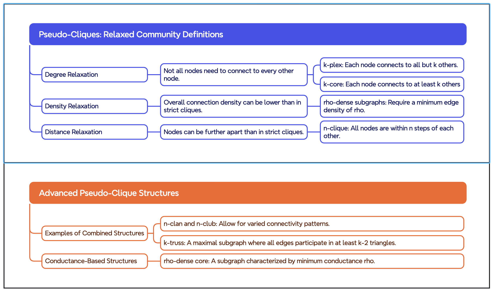

<style>
img[alt~="center"] {
  display: block;
  margin: 0 auto;
}
</style>

Check list
- [ ] Microphone turned on
- [ ] Zoom room open
- [ ] Recording on
- [ ] Mouse cursor visible
- [ ] Sound Volume on


---

# Advanced Topics in Network Science

Lecture 05: Clustering
Sadamori Kojaku

---


---


---


---


---

# Module 5: Clustering 🧩

## What to Learn

- What is community structure in networks? 🌐
- How to operationalize community structure? 🔬
- How to find communities in networks? 🔍
- Limitations of community detection 🚧

---

# Pen and Paper Activity ✍️

[Network Ahoy!](http://estebanmoro.org/pdf/netsci_for_kids/networks_ahoy.pdf) 🚢


---

# What is Community? 🐦

- Groups with similar connection patterns
- May reflect network formation mechanisms
  - E.g., Birds of a feather flock together 🐦 (Homophily)
- Underpins dynamics on networks
  - E.g., Information spreads within communities faster than between communities


---

# How to Find Communities?

- Pattern matching approach
- Optimization approach
- Probabilistic approach

- [Pen and paper exercise](../../lecture-note/m05-clustering/pen-and-paper/pseudo-cliques.pdf)

---

# Pattern Matching 🧩

- Define communities by specific connectivity patterns and search for them
- Example: **Cliques**
  - A subgraph where every node is connected to every other node
  - An idealized community structure 🏆


---

# Pseudo-Cliques: Relaxing Perfection ‍

- Real communities often don't form perfect cliques
- Need more flexible definitions

---



---

# Degree-Based Relaxations 🎓

1. $k$-plex:
   - Each node connects to all but k others in the group

2. $k$-core:
   - Each node connects to at least k others in the group
   - There is an efficient algorithm to find the $k$-core of a network
   - Useful for extracting the dense part of a network.


---

# Density-Based Relaxations 🌐

ρ-dense subgraphs:
- Minimum edge density of ρ within the group
- Formula: density ≥ ρ

$$
\text{density} = \frac{\text{number of edges}}{\text{maximum possible edges}} = \frac{|E|}{n(n-1)/2}
$$

Useful for finding dense, but not necessarily fully connected, groups

---

# Distance-Based Relaxations 🏃‍♀️

$n$-clique:
- All nodes are within $n$ steps of each other
- Allows for "long-range" communities

Variants:
- $n$-clan: diameter ≤ $n$
- $n$-club: diameter ≤ $n$, maximal subgraph


---

# Optimization Approach 🔍

Define a quality function for a given partition of nodes into communities, and search for the partition that maximizes it.

- Graph Cut
- Balanced Cut
- Modularity

---

# Graph Cut 🔪

- Minimize edges between communities

$$
\text{Cut}(V1, V2) = \sum_{i \in V1} \sum_{j \in V2} A_{ij}
$$

- Limitation: Can lead to trivial solutions


---

# Balanced Cut ⚖️

- Ratio Cut: Normalizes by node count
$$
\text{RatioCut}(V_1, V_2) = \frac{\text{Cut}(V_1, V_2)}{|V_1| \times |V_2|}
$$

- Normalized Cut: Normalizes by edge count

$$
\text{NormalizedCut}(V_1, V_2) = \frac{\text{Cut}(V_1, V_2)}{|E_1| \times |E_2|}
$$

---

# Assortativity 🤝

- Tendency of nodes to connect to others with similar attributes
- Attributes ~ Gender, Race, Age etc.
- How can we measure this?


---


---

# Modularity

$$
Q = \frac{1}{2m} \sum_{i,j} \left[ A_{ij} - \frac{k_i k_j}{2m} \right] \delta(c_i, c_j)
$$

where:
- $m$: total number of edges
- $A_{ij}$: adjacency matrix
- $k_i, k_j$: degrees of nodes $i$ and $j$
- $c_i, c_j$: community assignments of nodes $i$ and $j$

$$
\delta(c_i, c_j) = \begin{cases} 1 & \text{if } c_i = c_j \\ 0 & \text{otherwise} \end{cases}
$$

---

# Modularity Maximization in Action

1. [Two communities](https://skojaku.github.io/adv-net-sci/vis/community-detection/index.html?scoreType=modularity&numCommunities=2&randomness=1&dataFile=two-cliques.json)
2. [Four communities](https://skojaku.github.io/adv-net-sci/vis/community-detection/index.html?scoreType=modularity&numCommunities=4&randomness=1&dataFile=two-cliques.json)
3. [Karate club network](https://skojaku.github.io/adv-net-sci/vis/community-detection/index.html?scoreType=modularity&numCommunities=4&randomness=0.5&dataFile=net_karate.json)
4. [Inbalanaced network](https://skojaku.github.io/adv-net-sci/vis/community-detection/index.html?scoreType=modularity&numCommunities=3&randomness=0.9&dataFile=two-cliques-big-clique.json)
5. [Random network](https://skojaku.github.io/adv-net-sci/vis/community-detection/index.html?scoreType=modularity&numCommunities=3&randomness=0.8&dataFile=random-net.json)

---

# Limitation of Modularity

- Resolution limit
- Favors equal-sized communities
- There can be many very different but almost equally good solutions


---

# Modularity in Python 🐍

Using igraph library:

```python
import igraph as ig

# Load famous Zachary's Karate Club network
g = ig.Graph.Famous("Zachary")

# Detect communities using Leiden algorithm
communities = g.community_leiden(
    objective_function="modularity",
    resolution=1.0
)

# Print modularity score
print(f"Modularity: {communities.modularity}")

# Visualize
ig.plot(communities)
```

---

# Stochastic Block Model (SBM) 🎲

- Probabilistic generative model for networks
- Nodes assigned to blocks (communities)
- Edge probability depends on block membership

$$
P(A_{ij} = 1 | c_i = k, c_j = \ell) = p_{k\ell}
$$

where:
- $A_{ij}$: adjacency matrix
- $c_i, c_j$: block assignments of nodes $i$ and $j$
- $p_{k\ell}$: probability of edge between blocks $k$ and $\ell$


---

# SBM: Inference 🔍
- Parameters of SBM
  - Block probability $p_{k\ell}$
  - Block membership $c_i$ of each node $i$
- Communities are the most likely block assignments for the given network
- How?
  1. Start with random assignments, $c_i$
  2. Update $p_{k\ell}$ by maximizing the likelihood $\log P(A|c_i, p_{k\ell})$
  3. Update $c_i$ by maximizing the likelihood $\log P(A|c_i, p_{k\ell})$
  4. Repeat ii and iii until convergence


---


```python
import graph_tool.all as gt

# Load network (assuming g_gt is loaded)

# Fit SBM
state = gt.minimize_blockmodel_dl(
    g_gt,
    state_args={
        "deg_corr": False,  # Classic SBM
        "B_min": 2,  # Min number of blocks
        "B_max": 10  # Max number of blocks
    }
)

# Get block assignments
b = state.get_blocks()

# Visualize
gt.graph_draw(g_gt, vertex_fill_color=b)
```

---

# SBM: Extensions (1) 🌟

**Degree-corrected SBM (dcSBM)**
  - SBM tends to group nodes with similar degrees into the same community
  - dcSBM conditions on node degree. Often produces better communities.


---

# SBM: Extensions (2) 🌟

**Hierarchical SBM**
  - Models communities within communities
  - Can capture nested community structure


---


# SBM: Inference 🔍

1. Maximum Likelihood Estimation (MLE; that's what we did)
2. Bayesian Inference
3. Spectral Methods
4. Belief Propagation

Challenges:
- **Model selection (number of blocks):** Bayesian approach can help
- **Cost:** MLE and the spectral methods are pretty fast (albeit less optimal in the presence of noise). Belief Propagation is faster and more accurate provided that the network is tree-like.
- **Degeneracy:** Bayesian approach can provide a consensus of many good solutions

---

# Which one should we use?

- Benchmark results:
  - [Paper](https://arxiv.org/abs/0805.4770)
  - [Paper](https://journals.aps.org/pre/abstract/10.1103/PhysRevE.103.022316)
  - [Paper](https://arxiv.org/abs/2306.13400)
  - ...


---

# Further Reading

- [Metadata of nodes are not the ground truth communities](https://www.science.org/doi/full/10.1126/sciadv.1602548)
- [No free lunch theorem for community detection](https://www.science.org/doi/full/10.1126/sciadv.1602548)
- [Descriptive vs Inferential Approaches](https://arxiv.org/abs/2112.00183)
- [Equivalence of SBM and Modularity](https://journals.aps.org/pre/abstract/10.1103/PhysRevE.94.052315)
- [Modularity is an optimal method for SBM networks](https://journals.aps.org/prl/abstract/10.1103/PhysRevLett.108.188701)
- [node2vec is an optimal community detection method](https://journals.aps.org/prl/abstract/10.1103/PhysRevLett.108.188701)


---

# Key Takeaways 🗝️

- Community detection: powerful but limited
- Multiple approaches: pattern, optimization, probabilistic
- Consider assumptions and limitations
- No one-size-fits-all solution
- Next up: M06 Centrality 🎯
