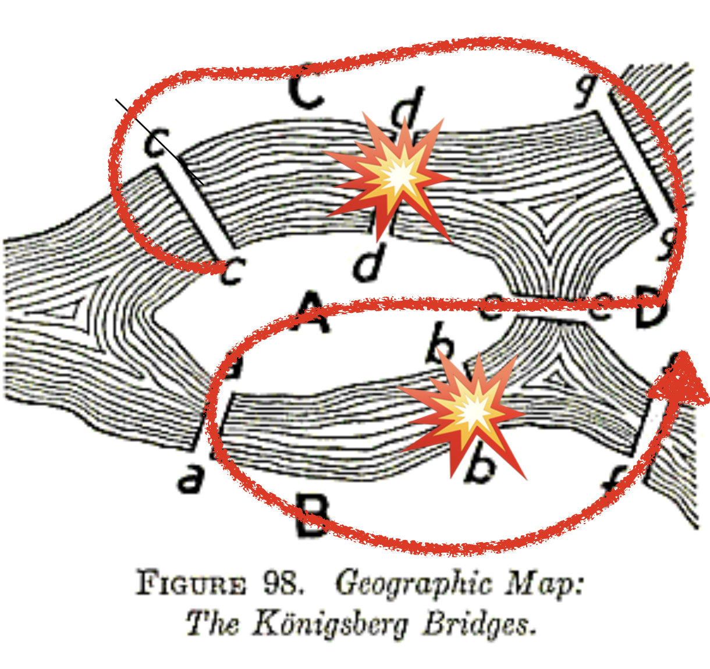

# Euler Tour Concepts

## What to learn in this module

In this module, we will learn a historical example that leads to the genesis of graph theory in mathematics and modern network science. Through this example, we will learn:
- How to describe a network using mathematical language
- How to code a network in Python
- Keywords: **network**, **degree**, **Euler walk**

## A puzzle

Back in 18th century, there was a city called *Königsberg* situated on the Pregel River in a historical region of Germany. The city had two large islands connected to each other and the mainland by seven bridges.
The citizens of Königsberg pondered a puzzle during their Sunday walks:

::: {.callout-note title="Problem"}
How could one walk through the city and cross each bridge exactly once?
:::

{#fig-seven-bridges fig-alt="The seven bridges of Königsberg"}

: The seven bridges of Königsberg {#fig-seven-bridges}

Leonard Euler worked out the solution to this puzzle in 1736. He first simplified the city into *a network of landmasses connected by bridges*, by noting that the landareas, the positions of the islands and the bridges are nothing to do with the puzzle, and that the only thing that matters is the connections between the landmasses.

{#fig-euler-graph fig-alt="Euler's graph of the bridges of Knigsberg"}

: Euler's graph of the bridges of Knigsberg {#fig-euler-graph}

## Pen-and-paper worksheet

Let's follow the worksheet to solve the puzzle step by step.

- [Worksheet](http://estebanmoro.org/pdf/netsci_for_kids/the_konisberg_bridges.pdf) [@esteban-moro-worksheet]

## Euler's solution

Euler consider two cases:
- a node has an even number of edges, or
- a node has an odd number of edges.

When a node has an even number $2k$ of edges, one can enter and leave the node $k$ times by crossing different edges.

When a node has an odd number $2k+1$ of edges, one can enter and leave the node $k$ times by crossing different edges but leave one last edge to cross. The only way to cross this last edge is that one starts or ends at the node.

Based up on the above reasoning, Euler leads to the following necessary (and later shown as sufficient) conditions:

::: {.callout-note title="Euler's path"}

There exists a walk that crosses all edges exactly once if and only if all nodes have even number of edges, or exactly two nodes have an odd number of edges.
:::

Back to the Konigsberg bridge problem, every node has an odd number of edges, meaning that there is no way to cross all edges exactly once. What a sad story for the citizens of Konigsberg. But the problem was solved during World War II, where Koingberg was bombarded by Soviet Union, losing two of the seven bridges 🫠.

{#fig-markdown-fig fig-alt="Two bridges were bombed by Soviet Union, which allows the Euler path to exist."}

: Two bridges were bombed by Soviet Union, which allows the Euler path to exist. {#fig-markdown-fig}

## References

::: {#refs}
:::