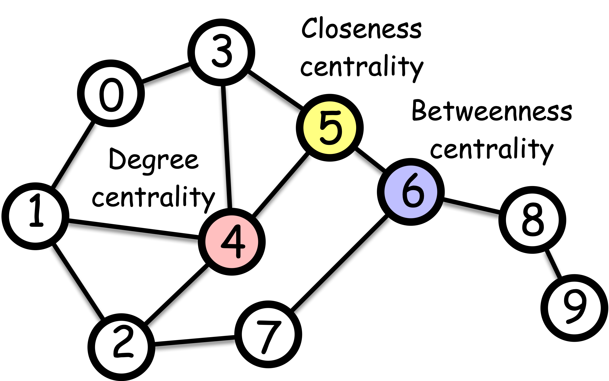

```{python}
#| echo: false
#| include: false

import igraph as ig
import matplotlib.pyplot as plt
import numpy as np

# Create the graph
edges = [(0,1), (0,3), (1,2), (1,3), (1,4), (2,4), (2,7), (3,4), (3,5), (4,5), (5,6), (6,8), (8,9)]
g = ig.Graph(edges=edges, directed=False)
g.vs["label"] = range(g.vcount())
layout = g.layout("fr")

# Plotting function
def plot_centrality(g, scores, title):
    fig, ax = plt.subplots(figsize=(4, 3))
    cmap = plt.cm.magma

    # Handle cases where all scores are the same
    min_score, max_score = np.min(scores), np.max(scores)
    if min_score == max_score:
        normalized_scores = np.ones_like(scores)
    else:
        normalized_scores = (np.array(scores) - min_score) / (max_score - min_score)

    vertex_color = [cmap(s) for s in normalized_scores]

    ig.plot(
        g,
        target=ax,
        layout=layout,
        vertex_size=20,
        vertex_color=vertex_color,
        vertex_label_color="black",
        vertex_label_dist=0,
        vertex_label_size=10
    )

    ax.set_title(title, fontsize=12)

    # Add a colorbar
    sm = plt.cm.ScalarMappable(cmap=cmap, norm=plt.Normalize(vmin=min_score, vmax=max_score))
    sm.set_array([])
    cbar = plt.colorbar(sm, ax=ax, shrink=0.8)
    cbar.set_label("Centrality", rotation=270, labelpad=15)

    #return fig
```

## What is centrality?

Have you ever wondered who the most popular person in your school is? Or which idea is the most important in a subject? Or maybe which movie everyone's talking about right now?
These questions are all about finding out what's important in a network of people, ideas, or things. In network science, we call this *centrality*.

Centrality or *importance* is a question of how important a node is in a network.
But the notion of *importance* is somewhat vague.
In what sense we say a node is important?

::: {.callout-note title="Exercise"}

Try out the pen and paper exercise below to get a sense of centrality: [School exercises](./pen-and-paper/exercise.pdf)

:::

{width="50%" fig-align="center"}

## Distance-based centrality


Let's talk about an ancient Roman monument called the *Milliarium Aureum*, also known as the *Golden Milestone*.
It was the starting point for measuring distances on all major roads in the Roman Empire.
Emperor Augustus built it when Rome changed from a republic to an empire.
The monument not only marked the distances but also represent a centralization of power, where Rome transitioned from a Republic to an Empire.
Perhaps the Romans understood the importance of being central in terms of distance, and this concept can be applied to define *centrality* in networks.

This family of centrality measures is based on shortest path distances between nodes. They consider a node important if it has short distances to other nodes or if it lies on many shortest paths.


### Closeness centrality

**Closeness centrality** measures how close a node is to all other nodes in the network. A node is central if it is close to all other nodes, which is operationally defined as

$$
c_i = \frac{N - 1}{\sum_{j = 1}^N \text{shortest path length from } j \text{ to } i}
$$

```{python}
#| echo: false
#| fig-cap: "Closeness Centrality Visualization. Nodes with higher centrality (brighter colors) are closer to all other nodes on average."
#| label: fig-closeness

scores = g.closeness()
plot_centrality(g, scores, "Closeness Centrality")
```

where $N$ is the number of nodes in the network. The numerator, $N - 1$, is the normalization factor to make the centrality have a maximum value of 1.

::: {.column-margin}

Question: What would be a graph where a node has the maximum closeness centrality of value 1?

::: {.callout collapse="true"}
## Click to see the answer

The simplest example is a star graph, where one node is connected to all other nodes. The node at the center has the highest closeness centrality.


:::
:::

### Harmonic centrality

The closeness centrality falls short for disconnected networks. This is because the shortest distance between two nodes in different connected components is infinite, making the closeness centrality of all nodes in the disconnected components zero.

A remedy is **Harmonic centrality** which adjusts closeness centrality [@beauchamp1965improved] which is defined as

$$
c_i = \sum_{j\neq i} \frac{1}{\text{shortest path length from } j \text{ to } i}
$$

```{python}
#| echo: false
#| fig-cap: "Harmonic Centrality Visualization. A variant of closeness that works well with disconnected components."
#| label: fig-harmonic

scores = g.harmonic_centrality()
plot_centrality(g, scores, "Harmonic Centrality")
```

The distance between two nodes in different connected components has zero contribution to the harmonic centrality, making it a useful measure for disconnected networks.

### Eccentricity centrality

While the closeness and harmonic centralities focus on "average" distance, eccentricity centrality focuses on the farthest distance from a node to any other node. It is defined as

$$
c_i = \frac{1}{\max_{j} \text{shortest path length from } i \text{ to } j}
$$

```{python}
#| echo: false
#| fig-cap: "Eccentricity Centrality Visualization. High-centrality nodes (brighter colors) have the smallest maximum distance to any other node."
#| label: fig-eccentricity

scores = g.eccentricity()
# Eccentricity is a distance, so lower is better. We plot 1/eccentricity for centrality.
plot_centrality(g, [1/e if e > 0 else 0 for e in scores], "Eccentricity Centrality (1/eccentricity)")
```


::: {.column-margin}
::: {.callout-note title="When is eccentricity centrality useful?"}
Unlike closeness or harmonic centrality, eccentricity centrality optimizes for the worst-case scenario, making it ideal when equity and maximum response times are critical. For example, placing emergency services or facilities to ensure no location is too far from help, designing robust communication or transportation networks that remain connected even if parts fail, and positioning distribution centers to guarantee reasonable delivery times to the most remote customers.

:::
:::

### Betweenness centrality

**Betweenness centrality** considers that a node is important if it lies on many shortest paths between other nodes.

$$
c_i = \sum_{j < k} \frac{\sigma_{jk}(i)}{\sigma_{jk}}
$$

```{python}
#| echo: false
#| fig-cap: "Betweenness Centrality Visualization. Brighter nodes lie on a larger number of shortest paths between other nodes."
#| label: fig-betweenness

scores = g.betweenness()
plot_centrality(g, scores, "Betweenness Centrality")
```

where $\sigma_{jk}$ is the number of shortest paths between nodes $j$ and $k$, and $\sigma_{jk}(i)$ is the number of shortest paths between nodes $j$ and $k$ that pass through node $i$.

## Walk-based centrality

"A man is known by the company he keeps" is a quote from Aesop who lived in the ancient Greece, a further back in time from the Roman Empire.
It suggests that a person's character is reflected by the people this person is friends with.
This idea can be applied to define the *centrality* of a node in a network.

This family of centrality measures considers that a node is important if it is connected to other important nodes, or if it receives many "walks" or "votes" from other nodes in the network. These measures often use recursive definitions and are computed using linear algebra techniques.

::: {.column-margin}
**Aesop** was an ancient Greek storyteller believed to have lived around the 6th century BCE. He is famous for his fables—short stories that use animals and everyday situations to teach moral lessons.


](https://www.heritage-history.com/books/winter/aesop/zpage010.gif)
:::


### Eigenvector centrality

**Eigenvector centrality** considers that a node is important if it is connected to other important nodes. Yes, it sounds like circular! But it is actually computable! Let us define it more precisely by the following equation.

$$
\lambda c_i = \sum_{j} A_{ij} c_j
$$

where $\lambda$ is a constant. It suggests that the centrality of a node ($c_i$), when multiplied by a constant $\lambda$, is the sum of the centralities of its neighbors ($A_{ij} c_j$; note that $A_{ij}=1$ if $j$ is a neighbor, and otherwise $A_{ij}=0$).
Using vector notation, we can rewrite the equation as

$$
\lambda
\begin{bmatrix}
c_1 \\
c_2 \\
\vdots \\
c_n
\end{bmatrix} =
\begin{bmatrix}
A_{11} & A_{12} & \cdots & A_{1n} \\
A_{21} & A_{22} & \cdots & A_{2n} \\
\vdots & \vdots & \ddots & \vdots \\
A_{n1} & A_{n2} & \cdots & A_{nn}
\end{bmatrix}
\begin{bmatrix}
c_1 \\
c_2 \\
\vdots \\
c_n
\end{bmatrix}
$$

or equivalently,

$$
\lambda \mathbf{c} = \mathbf{A} \mathbf{c}
$$

Okay, but how do we solve this? Well, this is the standard eigenvector equation! The solution $\mathbf{c}$ is an eigenvector of the adjacency matrix $\mathbf{A}$, and $\lambda$ is its corresponding eigenvalue. But here's the tricky part - a matrix can have multiple eigenvectors. So which one should we choose?

Let's think about what we want again. We want our centrality measure to be positive. It wouldn't make much sense to have negative importance! So, we're looking for an eigenvector where all the elements are positive. And a good news is that there's a special eigenvector that fits the bill perfectly.
The Perron-Frobenius theorem guarantees that the eigenvector associated with the largest eigenvalue always has all positive elements.

```{python}
#| echo: false
#| fig-cap: "Eigenvector Centrality Visualization. Brighter nodes are connected to other highly central nodes."
#| label: fig-eigenvector

scores = g.eigenvector_centrality()
plot_centrality(g, scores, "Eigenvector Centrality")
```

::: {.column-margin}
**Perron-Frobenius theorem**: For a regular matrix $\mathbf{A}$ with and non-negative entries ($A_{ij} \geq 0$), there exists a unique largest eigenvalue $r > 0$ such that its corresponding eigenvector $\mathbf{v}$ has all positive entries: $v_i > 0$ for all $i$.
:::

Thus, the eigenvector centrality is the eigenvector of the adjacency matrix associated with the largest eigenvalue.

#### How is it computed? Power iteration

You do not need a full eigendecomposition to get the leading eigenvector, and the algorithm that gets it is worth knowing because it *is* the intuition.

Start with any positive vector — say, give every node a score of 1. Then repeat:

$$
{\bf c} \leftarrow \frac{{\bf A}{\bf c}}{\|{\bf A}{\bf c}\|}
$$

Each multiplication by ${\bf A}$ replaces every node's score with the sum of its neighbors' scores; the normalization just stops the numbers from exploding. This is called **power iteration**, and it converges to the leading eigenvector.

Why does it work? Write the starting vector in the eigenvector basis, ${\bf c}^{(0)} = \sum_i a_i {\bf v}_i$. Applying ${\bf A}$ $t$ times gives

$$
{\bf A}^t {\bf c}^{(0)} = \sum_i a_i \lambda_i^t {\bf v}_i = \lambda_1^t \left( a_1 {\bf v}_1 + \sum_{i \geq 2} a_i \left(\frac{\lambda_i}{\lambda_1}\right)^t {\bf v}_i \right).
$$

Since $|\lambda_i / \lambda_1| < 1$ for every $i \geq 2$, every term except the first decays geometrically. After enough iterations only ${\bf v}_1$ survives. The convergence rate is governed by the ratio $|\lambda_2|/|\lambda_1|$ — the closer those two eigenvalues, the slower it converges.

::: {.column-margin}
Read this in terms of Module 1: ${\bf A}^t$ counts walks of length $t$. So power iteration is literally saying "a node is important if many walks of length $t$ end there", and eigenvector centrality is the limit of that statement as $t \rightarrow \infty$. In Module 7 the same iteration reappears as a random walk converging to its stationary distribution.
:::

### Hyperlink-Induced Topic Search (HITS) centrality

**HITS centrality** extends eigenvector centrality to directed networks. It introduces two notions of importance: *hub* and *authority*. A node is an important hub if it points to many important *authorities*. A node is an important authority if it is pointed by many important *hubs*.

::: {.callout-important title="Notation: edge direction"}
In a directed network we write $A_{ij} = 1$ when there is an edge **from $i$ to $j$**, and $A_{ij} = 0$ otherwise. Consequently:

- $\sum_j A_{ij} (\cdot)_j$ sums over the nodes that $i$ **points to**. This is $i$'s out-degree, $d^{\text{out}}_i = \sum_j A_{ij}$.
- $\sum_j A_{ji} (\cdot)_j$ sums over the nodes that **point to** $i$. This is $i$'s in-degree, $d^{\text{in}}_i = \sum_j A_{ji}$.

Getting this convention right is the whole game in HITS and PageRank, so keep it in view.
:::

Let's put on a math hat to concretely define the hub and authority centralities.
We introduce two vectors, $x_i$ and $y_i$, to denote the hub and authority centralities of node $i$, respectively. Following the idea of eigenvector centrality, node $i$ is a good hub when the nodes **it points to** are good authorities, and a good authority when the nodes **pointing to it** are good hubs:

$$
\underbrace{x_i = \lambda_x \sum_j A_{ij} y_j}_{\text{hub: sum over what } i \text{ points to}}, \quad \underbrace{y_i = \lambda_y \sum_j A_{ji} x_j}_{\text{authority: sum over what points to } i}
$$

Or equivalently,

$$
\mathbf{x} = \lambda_x \mathbf{A} \mathbf{y}, \quad \mathbf{y} = \lambda_y \mathbf{A}^T \mathbf{x}
$$

Substituting $\mathbf{y} = \lambda_y \mathbf{A}^T \mathbf{x}$ into the first equation, and $\mathbf{x} = \lambda_x \mathbf{A}\mathbf{y}$ into the second, we get

$$
\mathbf{x} = \lambda_x \lambda_y \mathbf{A} \mathbf{A}^T \mathbf{x}, \quad \mathbf{y} = \lambda_x \lambda_y \mathbf{A}^T \mathbf{A} \mathbf{y}
$$

Again, we obtain eigenvector equations. The hub centrality $\mathbf{x}$ is the principal eigenvector of $\mathbf{A} \mathbf{A}^T$, and the authority centrality $\mathbf{y}$ is the principal eigenvector of $\mathbf{A}^T \mathbf{A}$.

::: {.column-margin}
A useful sanity check: $(\mathbf{A}\mathbf{A}^T)_{ij}$ counts how many nodes **both** $i$ and $j$ point to, so hubs are similar when they cite the same sources. $(\mathbf{A}^T\mathbf{A})_{ij}$ counts how many nodes point to **both** $i$ and $j$, so authorities are similar when they are cited together. This is co-citation and bibliographic coupling, respectively.
:::

::: {.column-margin}

If the original network is *undirected*, is the HITS centrality equivalent to the eigenvector centrality? If so or not, explain why.

::: {.callout collapse="true" title="Click to see the answer"}
If the graph is undirected, the hub and authority centralities are equivalent. And the solution is given by the eigenvector of $\mathbf{A} \mathbf{A}^T$. Now, let us consider the eigenvector equation for the adjacency matrix $\mathbf{A}$.

$$
\mathbf{c} = \lambda \mathbf{A} \mathbf{c}
$$

By multiplying $\mathbf{A}$ on the both sides, we get

$$
\begin{aligned}
\mathbf{A} \mathbf{c} &= \lambda \mathbf{A} \mathbf{A} \mathbf{c} \\
\iff \mathbf{A}^\top \mathbf{A} \mathbf{c} &= \lambda \mathbf{A}^\top \mathbf{c} \\
\iff \mathbf{A}^\top \mathbf{A} \mathbf{c} &= \lambda^2 \mathbf{c}
\end{aligned}
$$

where we used the fact that $\mathbf{A}$ is symmetric. It suggests that the eigenvector of $\mathbf{A}^\top \mathbf{A}$ is the same as that of $\mathbf{A}$, and that the eigenvalue of $\mathbf{A}^\top \mathbf{A}$ is the square of that of $\mathbf{A}$.
Thus, the eigenvector centrality is equivalent to the HITS centrality if the network is undirected.

:::
:::

### Katz centrality

**Katz centrality** addresses a limitation of eigenvector centrality, which tends to pay too much attention to a small number of nodes that are well connected to the network while under-emphasizing the importance of the rest of the nodes. The solution is to add a little bit of score to all nodes.

$$
c_i = \beta + \lambda \sum_{j} A_{ij} c_j
$$

The equation can be solved by

$$
\mathbf{c} = \beta \mathbf{1} + \lambda \mathbf{A} \mathbf{c}
$$

where $\mathbf{1}$ is the vector of ones. By rewriting the equation, we get

$$
\left( \mathbf{I} - \lambda \mathbf{A} \right) \mathbf{c} = \beta \mathbf{1}
$$

By taking the inverse of $\mathbf{I} - \lambda \mathbf{A}$, we get

$$
\mathbf{c} = \beta \left( \mathbf{I} - \lambda \mathbf{A} \right)^{-1} \mathbf{1}
$$

#### What Katz centrality is really counting

That matrix inverse has a revealing expansion. For a scalar, $1/(1-x) = 1 + x + x^2 + \cdots$; the same identity holds for matrices when the series converges:

$$
\left( \mathbf{I} - \lambda \mathbf{A} \right)^{-1} = \mathbf{I} + \lambda \mathbf{A} + \lambda^2 \mathbf{A}^2 + \lambda^3 \mathbf{A}^3 + \cdots
$$

Recall from Module 1 that $\left(\mathbf{A}^t\right)_{ij}$ is the number of walks of length $t$ from $i$ to $j$. So Katz centrality is

$$
c_i = \beta \sum_{t=0}^{\infty} \lambda^t \left(\text{number of walks of length } t \text{ ending at } i\right).
$$

**Katz centrality counts every walk arriving at a node, discounting a walk of length $t$ by $\lambda^t$.** Short walks — close neighbors — count heavily; long walks contribute progressively less. The parameter $\lambda$ sets how far influence travels: small $\lambda$ makes the measure behave almost like degree centrality, large $\lambda$ pushes it toward eigenvector centrality.

#### The condition on $\lambda$

The geometric series converges only when its terms shrink, which for matrices means

$$
\lambda < \frac{1}{\lambda_{\max}(\mathbf{A})}
$$

where $\lambda_{\max}(\mathbf{A})$ is the largest eigenvalue of the adjacency matrix — the same eigenvalue that appeared in eigenvector centrality.

::: {.callout-warning title="This is not a technicality"}
Choose $\lambda$ above $1/\lambda_{\max}$ and the walk counts grow faster than the discount shrinks. The sum diverges, $\mathbf{I} - \lambda \mathbf{A}$ stops being invertible in a useful way, and you get meaningless (often negative) scores. In practice one computes $\lambda_{\max}$ first and then picks $\lambda$ as a fraction of $1/\lambda_{\max}$, such as $0.9/\lambda_{\max}$.

Note what happens at the boundary: as $\lambda \rightarrow 1/\lambda_{\max}$ the longest walks come to dominate and Katz centrality converges to eigenvector centrality. The two measures are the two ends of a single dial.
:::

```{python}
#| echo: false
#| fig-cap: "Katz Centrality Visualization. A measure of influence that accounts for both direct and indirect connections."
#| label: fig-katz
import numpy as np

# Get adjacency matrix
A = np.array(g.get_adjacency().data)
n = g.vcount()
I = np.identity(n)

# Set parameters for Katz centrality
# Alpha must be less than 1 / largest eigenvalue of A
eigenvalues = np.linalg.eigvals(A)
alpha = 0.9 / np.max(np.abs(eigenvalues))
beta = 1.0

# Calculate Katz centrality scores
scores = np.linalg.inv(I - alpha * A.T) @ np.ones(n) * beta

plot_centrality(g, scores.tolist(), "Katz Centrality")
```

### PageRank

**PageRank** is the celebrated idea behind Google Search and can be seen as a cousin of Katz centrality.

$$
c_i = \underbrace{(1-\beta) \sum_j A_{ji}\frac{c_j}{d^{\text{out}}_j}}_{\text{Random walk from neighbors}} + \underbrace{\beta \cdot \frac{1}{N}}_{\text{teleportation}}
$$

```{python}
#| echo: false
#| fig-cap: "PageRank Centrality Visualization. Brighter nodes have a higher probability of being visited by a random walker."
#| label: fig-pagerank

scores = g.pagerank()
plot_centrality(g, scores, "PageRank")
```

where $d^{\text{out}}_j$ is the out-degree of node $j$ (the number of edges pointing out from node $j$).
The term $c_j/d^{\text{out}}_j$ represents that the score of node $j$ is divided by the number of nodes to which node $j$ points. In the Web, this is like a web page distributes its score to the web pages it points to. It is based on an idea of traffic, where the viewers of a web page are evenly transferred to the linked web pages. A web page is important if it has a high traffic of viewers.


::: {.column-margin}
See the following video for more details on PageRank:

<iframe width="220" height="158" src="https://www.youtube.com/embed/v7n7wZhHJj8?si=qVfcEBCc-DEiiZ9w" title="YouTube video player" frameborder="0" allow="accelerometer; autoplay; clipboard-write; encrypted-media; gyroscope; picture-in-picture; web-share" referrerpolicy="strict-origin-when-cross-origin" allowfullscreen></iframe>

:::


### Personalized PageRank

**Personalized PageRank** extends the standard PageRank algorithm by contextualizing the importance of nodes from a specific perspective in a network.
To understand this, imagine you have a network of movies connected by similarity (sharing genres, actors, directors, etc.). Standard PageRank would rank movies based on their overall centrality in this similarity network. But suppose a student just watched "The Matrix" and wants to find similar movies. Personalized PageRank would start random walks from "The Matrix" and measure which movies are most reachable from it, effectively finding movies that are similar to "The Matrix" rather than just globally popular movies.

Put it more formarmally, suppose a random walker starting from a node $\ell$. The walker moves to the neighboring nodes just like in PageRank, but with a probability $\beta$, it goes back to the starting node $\ell$ at every step.

Thus,
$$
c_i = \underbrace{(1-\beta) \sum_j A_{ji}\frac{c_j}{d^{\text{out}}_j}}_{\text{Random walk from neighbors}} + \underbrace{\beta \cdot p_{\ell}}_{\text{Teleport to the starting node}}
$$

where $p_{\ell}$ is a one-hot vector that is 1 at the $\ell$-th position and 0 elsewhere.
The first term represents
This equation can be solved numerically by taking the power iteration like we do for the PageRank. Alternatively, we can solve it by solving the linear system of equations.

::: {.column-margin}

Personalized PageRank can also be interpreted as the sum of probabilities of reaching each node from a focal set of nodes, where the probability decreases exponentially with distance.
Let $p_{\ell i}^{(k)}$ be the probability of reaching node $i$ from node $\ell$ in $k$ steps. Then,
the personalized PageRank is given by

$$
c_i = \sum_{k=0}^{\infty} \beta (1-\beta)^k p_{\ell i}^{(k)}
$$

where ther term $\beta (1-\beta)^k$ is the probability of reaching a node that is exactly $k$ steps away.
Think of it as a "weight" that decreases with distance. As $i$ gets further away from the starting node $\ell$.
In other words, centrality of node $i$ tends to be higher if it is closer to the starting node $\ell$.

:::

::: {.column-margin}

PageRank and Personalized PageRank have been one of the most influential ideas in network science.
There are many variants and extensions of these ideas. Here are some of my favorites:

1. [@lambiotte2012ranking] proposes a teleportation method that corrects the bias coming from the degree of the starting node of PageRank.

2. [@wu2017second] proposes a second-order random walk-based proximity measure that considers the importance of a node in the context of a ranking problem.

3. [@tong2006fast] proposes a random walk with restart that considers the importance of a node in the context of a ranking problem.


:::


## Degree-based centrality

The simplest approach to measuring centrality is to count the connections of each node. This gives us *degree centrality*, which considers a node important if it has many direct connections.
**Degree centrality** is just the count of the number of edges connected to a node (i.e., the number of neighbors, or *degree* in network science terminology). The most important node is thus the one with the highest degree.

$$
c_i = d_i = \sum_{j} A_{ij}
$$

```{python}
#| echo: false
#| fig-cap: "Degree Centrality Visualization. The simplest measure: brighter nodes have more direct connections."
#| label: fig-degree

scores = g.degree()
plot_centrality(g, scores, "Degree Centrality")
```

where $A_{ij}$ is the adjacency matrix of the network, and $d_i$ is the degree of node $i$.

Degree centrality is a no brainer measure of centrality. Interestingly, degree centralities are often strongly correlated with other centrality measures, such as the eigenvector centrality, pagerank, along with distance-based centralities (e.g., closeness centrality). Of course, degree centrality is a crude importance measure as it only focuses on the direct connections of a node and ignores who these connections are to.

## Bridges and brokers

The centralities above mostly reward being *well connected*. Betweenness rewards something different, and the difference is worth dwelling on.

Picture two dense friend groups joined by a single person who has one friend in each. That person has degree 2 — nearly the lowest in the network. By degree, eigenvector or PageRank they are a nobody. By betweenness they are the single most important node in the network, because *every* path between the two groups runs through them.

Such nodes are called **bridges** or **brokers**, and they are the reason betweenness earns its keep:

- **Remove a broker and the network splits.** This is precisely the vulnerability Module 3 studies, and it is invisible to degree-based attack strategies.
- **Brokers control flow.** Information, resources, or a disease passing between groups must go through them, which is leverage — in sociology this is the source of Ronald Burt's "structural holes" theory of social capital.
- **Brokers are structurally uncomfortable.** They belong to two worlds without being central in either. High betweenness with low degree is a distinctive and informative signature.

This is also why Girvan-Newman (Module 5) detects communities by deleting *edges* with the highest betweenness: the edges that bridge groups carry the most shortest paths, so removing them peels the communities apart.

## Choosing a centrality

There is no best centrality, only a centrality that matches the question. Decide what "important" means for your problem first, then pick.

| If you want to find...            | Ask...                                        | Use                          |
| --------------------------------- | --------------------------------------------- | ---------------------------- |
| **Popular** nodes                 | Who has the most direct connections?          | Degree                       |
| **Efficient** nodes               | Who can reach everyone else quickly?          | Closeness, Harmonic          |
| **Fair** locations                | Who is not too far from *anyone*?             | Eccentricity                 |
| **Critical** nodes                | Who, if removed, breaks the flow?             | Betweenness                  |
| **Influential** nodes             | Who is connected to other influential nodes?  | Eigenvector, Katz, PageRank  |
| Nodes relevant to a **specific** node | Who is close to *this* node in particular? | Personalized PageRank        |

A worked example: to place a new hospital you want eccentricity or closeness (nobody should be far from care). To decide which substation to armor you want betweenness (which failure severs the grid). To decide whom to vaccinate you want degree or PageRank (who spreads fastest). Three different "most important" nodes in the same network.

### What does it cost to compute?

Practical choice is also constrained by computation. For a network with $N$ nodes and $M$ edges:

| Centrality             | Time complexity     | Notes                                                        |
| ---------------------- | ------------------- | ------------------------------------------------------------ |
| Degree                 | $O(M)$              | One pass over the edges. Essentially free.                    |
| Closeness / Harmonic   | $O(NM)$             | A BFS from every node. Expensive but parallel.                |
| Betweenness            | $O(NM)$             | Brandes' algorithm. The practical bottleneck on large graphs. |
| Eigenvector / PageRank | $O(M)$ per iteration | Power iteration; iterations needed depend on the spectral gap. |

The pattern is that shortest-path measures scale badly because they need all-pairs information, while walk-based measures scale well because they only ever need one matrix-vector product at a time. On a million-node network, PageRank is routine and exact betweenness is not — which is why approximate betweenness by sampling source nodes is common practice.

### Centralities usually agree — until they don't

In most real networks the various centralities correlate strongly, and degree correlates with almost everything. That is genuinely useful: if a cheap measure gives nearly the same ranking as an expensive one, use the cheap one.

But the correlation is a property of the network, not a law. Two extreme cases make the point:

- **A star graph.** The center has the maximum possible degree, closeness *and* betweenness — every measure agrees it is the most important node, and every leaf is equally unimportant. Total agreement.
- **A path graph.** Every internal node has degree 2, so degree centrality is flat and uninformative. Betweenness, however, peaks sharply in the middle and falls to zero at the ends. Total disagreement.

The lesson is that centralities diverge precisely where the structure is interesting — around bridges, bottlenecks and peripheries. When two measures disagree strongly on a real network, that disagreement is telling you about its structure.

## Where centrality gets used

- **Robustness and infrastructure**: identifying which nodes to protect, or which an adversary would attack (Module 3).
- **Epidemiology**: finding super-spreaders and choosing vaccination targets. Note that the friendship paradox (Module 4) gives a way to find high-centrality nodes *without* mapping the network.
- **Social dynamics**: locating leaders, influencers, and the brokers who connect otherwise separate communities.
- **Web search**: PageRank and HITS were built for exactly this, and ranking is still where walk-based centrality is most visible.
- **Economics and finance**: detecting systemically important institutions, and finding chokepoints in supply chains.
- **Neuroscience and biology**: hub regions in brain connectomes; essential proteins in interaction networks, which tend to be high-degree.

