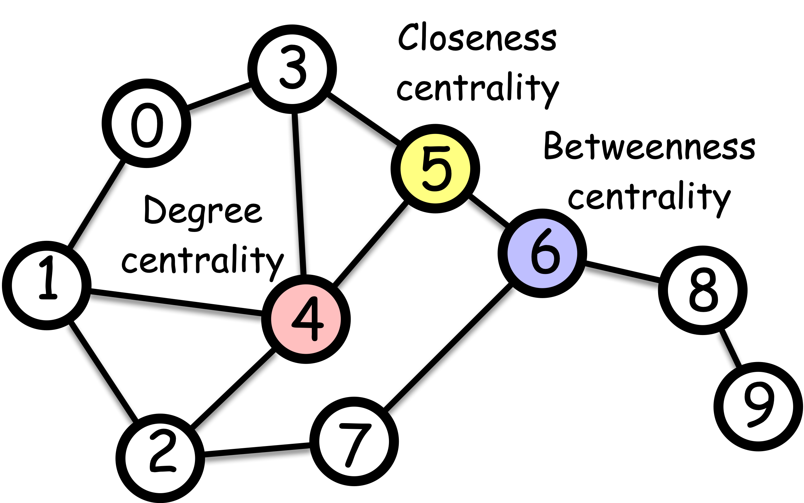

---
jupytext:
  formats: md:myst
  text_representation:
    extension: .md
    format_name: myst
kernelspec:
  display_name: Python 3
  language: python
  name: python3
---

# What is centrality?

Have you ever wondered who the most popular person in your school is? Or which idea is the most important in a subject? Or maybe which movie everyone's talking about right now?
These questions are all about finding out what's important in a network of people, ideas, or things. In network science, we call this *centrality.*

Centrality or *importance* is a question of how important a node is in a network.
But the notion of *importance* is somewhat vague.
In what sense we say a node is important?
Answering this question needs a specific *context*, and there are many contexts in which the *importance* is defined.



## Different centrality measures

Here we will focus on several popular centrality measures. Let us denote by $c_i$ the centrality of node $i$ throughout this section.
Here is a preview of the centrality measures we will cover in this section

| Centrality          | Category            | Description                                                                 |
|-------------------------|---------------------|-----------------------------------------------------------------------------|
| Degree Centrality       | Degree              | Counts the number of edges connected to a node.                             |
| Closeness Centrality    | Shortest Path  | Measures how close a node is to all other nodes in the network.             |
| Eccentricity Centrality | Shortest Path  | Based on the maximum shortest path distance from a node to any other node.  |
| Harmonic Centrality     | Shortest Path  | Adjusts closeness centrality to work even in disconnected networks.         |
| Betweenness Centrality  | Shortest Path  | Measures the extent to which a node lies on paths between other nodes.      |
| Eigenvector Centrality  | Walk           | Measures a node's influence based on the influence of its neighbors.        |
| HITS (Hub and Authority) Centrality | Walk  | Measures the importance of nodes as hubs and authorities in a network.      |
| Katz Centrality         | Walk           | Considers the total number of walks between nodes, with a damping factor.   |
| PageRank                | Walk           | Measures the importance of nodes based on the structure of incoming links.  |


### Degree centrality

Perhaps the simplest form of cnetrality is *degree centrality*. It is just the count of the number of edges connected to a node (i.e., the number of neighbors, or *degree* in network science terminology). The most important node is thus the one with the highest degree.

$$
c_i = d_i = \sum_{j} A_{ij}
$$

where $A_{ij}$ is the adjacency matrix of the network, and $d_i$ is the degree of node $i$.

### Centrality based on shortest path


Let's talk about an ancient Roman monument called the *Milliarium Aureum*, also known as the *Golden Milestone*.
It was the starting point for measuring distances on all major roads in the Roman Empire.
Emperor Augustus built it when Rome changed from a republic to an empire.
The monument not only marked the distances but also represent a centralization of power, where Rome transitioned from a Republic to an Empire.
Perhaps the Romans understood the importance of being central in terms of distance, and this concept can be applied to define *centrality* in networks.

### Closeness centrality
**Closenes centrality** is a measure of how close a node is to all other nodes in the network. A node is central if it is close to all other nodes, which is operationally defined as

$$
c_i = \frac{N - 1}{\sum_{j = 1}^N \text{shortest path length from } j \text{ to } i}
$$

where $N$ is the number of nodes in the network. The numerator, $N - 1$, is the normalization factor to make the centrality have a maximum value of 1.


```{admonition} Exercise
:class: tip

Create a graph where a node has the maximum closeness centrality of value 1.


```{dropdown} Click to see the answer

The simplest example is a star graph, where one node is connected to all other nodes. The node at the center has the highest closeness centrality.


```


### Harmonic centrality

**Harmonic Centrality** is a measure that adjusts closeness centrality to work even in disconnected networks. The problem with closeness centrality is that it cannot handle disconnected networks. When a network is disconnected, some nodes can't reach others, making their distance infinite. This causes all centrality values to become zero, which isn't very helpful!

To fix this, Beauchamp {footcite:p}`beauchamp1965improved` came up with a clever solution called *harmonic centrality*. It works even when the network is disconnected.

$$
c_i = \sum_{j\neq i} \frac{1}{\text{shortest path length from } j \text{ to } i}
$$

### Eccentricity centrality

**Eccentricity centrality** is baesd on the farthest distance from a node to any other node. The eccentricity centrality is defined as

$$
c_i = \frac{1}{\max_{j} \text{shortest path length from } i \text{ to } j}
$$


These centrality measures provide different perspectives on the importance of nodes based on their accessibility and reachability within the network.

A central node should be close to all other nodes.

Closeness centrality captures the notion of "centrality" in the network. Namely, a node is *central* if it is close to all other nodes.

$$
c_i = \frac{N - 1}{\sum_{j = 1}^N \text{shortest path length from } j \text{ to } i}
$$

where $N$ is the number of nodes in the network. The numerator, $N$, is the normalization factor to make the centrality to have the maximum value of 1.


### Eccentricity centrality

Eccentricity centrality is based on the shortest path distance between nodes, just like the closeness centrality, but it is based on the *maximum* distance as opposed to the average distance like in the closeness centrality.

$$
c_i = \frac{1}{\max_{j} \text{shortest path length from } i \text{ to } j}
$$


### Betweenness centrality

Another notion of centrality is *betweenness centrality*. It considers that a node is important if it lies on many shortest paths between other nodes.

$$
c_i = \sum_{j < k} \frac{\sigma_{jk}(i)}{\sigma_{jk}}
$$

where $\sigma_{jk}$ is the number of shortest paths between nodes $j$ and $k$, and $\sigma_{jk}(i)$ is the number of shortest paths between nodes $j$ and $k$ that pass through node $i$.

```{footbibliography}
```