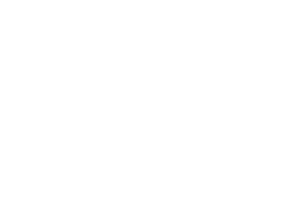
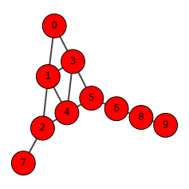
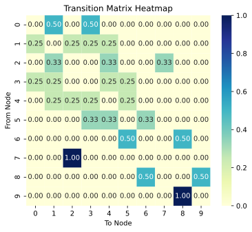
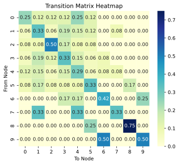
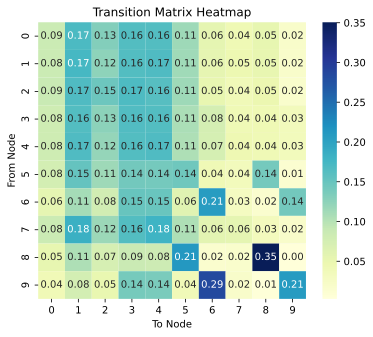
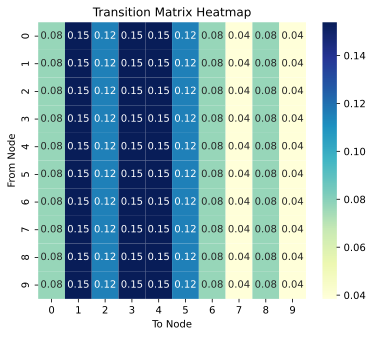
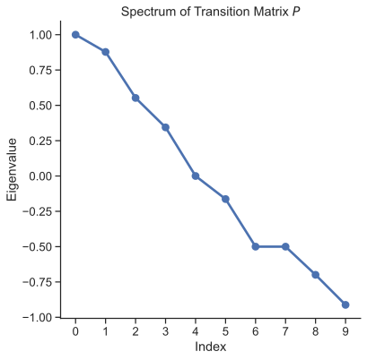
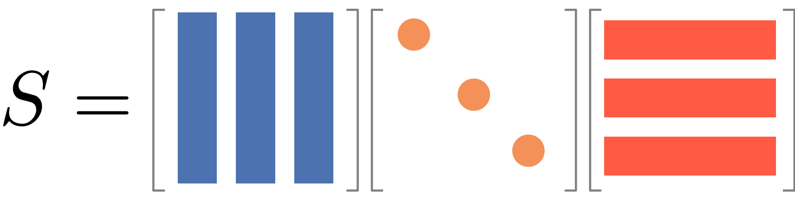

## What is a random walk?

Suppose you walk in a city. You are drunk and your feet have no idea where to go. You just take a step wherever your feet take you. At every intersection, you make a random decision and take a step. This is the core idea of a random walk.

While your feet are taking you to a random street, after making many steps and looking back, you will realize that you have been to certain places more frequently than others. If you were to map the frequency of your visits to each street, you will end up with a distribution that tells you about salient structure of the street network.

::: {.column-margin title="Real-World Random Walk Examples"}
Random walks appear everywhere in daily life:

- **Netflix browsing**: You click on a movie, then another recommended movie, then another... Your viewing pattern follows a random walk through the recommendation network!
- **Wikipedia surfing**: Starting from "Coffee", you click links to "Brazil" → "Soccer" → "Mathematics" → "Physics"... Each click is a step in a random walk through knowledge.
- **Stock market movements**: Daily price changes can be modeled as random walks, where each day's price depends on the previous day plus some random fluctuation.

:::

## Introduction through Games: Ladder Lottery

To make random walk concepts tangible, let's start with a fun game that perfectly illustrates random walk principles:

::: {.callout-note title="Ladder Lottery"}

Ladder Lottery is a fun East Asian game, also known as "鬼腳圖" (Guijiaotu) in Chinese, "阿弥陀籤" (Amida-kuzi) in Japanese, "사다리타기" (Sadaritagi) in Korean, and "Ladder Lottery" in English. The game is played as follows:
1. A player is given a board with a set of vertical lines.
2. The player chooses a line and starts to move along the line
3. When hitting a horizontal line, the player must move along the horizontal line and then continue to move along the next vertical line.
4. The player wins if the player can hit a marked line at the bottom of the board.
5. You cannot see the horizontal lines in advance!

Play the [Ladder Lottery Game! 🎮✨]( https://skojaku.github.io/adv-net-sci/assets/vis/amida-kuji.html?) and try to answer the following questions:

1. Is there a strategy to maximize the probability of winning?
2. How does the probability of winning change as the number of horizontal lines increases?

:::

The Ladder Lottery game is actually a perfect introduction to random walks! In this game, **states** are the vertical lines, **transitions** happen when you encounter horizontal connections, **randomness** comes from not knowing where the horizontal lines are placed, and **long-term behavior** determines your probability of winning. This simple game illustrates many key concepts we'll explore in random walks on networks.

A random walk in undirected networks follows this process:
1. Start at a node $i$
2. Randomly choose an edge to traverse to a neighbor node $j$
3. Repeat step 2 until you have taken $T$ steps

::: {.column-margin}
In directed networks, a random walker can only move along the edge direction, and it can be that the random walker is stuck in a so-called "dead end" that does not have any outgoing edges.
:::

When studying random walks, we want to understand several key aspects: **short-term behavior** (where does the walker go in the first few steps?), **long-term behavior** (after many steps, where does the walker spend most of its time?), **structural insights** (what does the walker's behavior tell us about the network?), and **applications** (how can we use random walks for centrality and community detection?).

::: {.callout-note title="Interactive Exploration"}

Play with the [Random Walk Simulator! 🎮✨](vis/random-walks/index.html) and try to answer the following questions:

1. When the random walker makes many steps, where does it tend to visit most frequently?
2. When the walker makes only a few steps, where does it tend to visit?
3. Does the behavior of the walker inform us about centrality of the nodes?
4. Does the behavior of the walker inform us about communities in the network?

:::

### Pen and Paper Exercises

Before diving into the mathematical details and coding, it's important to work through some fundamental concepts by hand.

- [✍️ Pen and paper exercises](pen-and-paper/exercise.pdf)

These exercises will help you:
- Understand the basic mechanics of random walks
- Calculate transition probabilities manually
- Explore simple examples of stationary distributions
- Connect random walk concepts to network properties

## Transition Probabilities

::: {.column-margin}
Let's see how this works with a more complex example. Consider a network with 10 nodes:

{#fig-m07-fig-00}

Let us consider the following graph.

{#fig-m07-fig-01}

The transition matrix is given by:

{#fig-m07-fig-02}

:::

A random walk is characterized by the transition probabilities between nodes. The transition probability from node $i$ to node $j$ is:

$$
P_{ij} = \frac{A_{ij}}{k_i}
$$

where $A_{ij}$ is the adjacency matrix element and $k_i$ is the degree of node $i$.

We can represent all transition probabilities in a transition probability matrix $\mathbf{P}$:

$$
\mathbf{P} = \begin{pmatrix}
p_{11} & p_{12} & \cdots & p_{1N} \\
p_{21} & p_{22} & \cdots & p_{2N} \\
\vdots & \vdots & \ddots & \vdots \\
p_{N1} & p_{N2} & \cdots & p_{NN}
\end{pmatrix}
$$

This matrix $\mathbf{P}$ encapsulates the entire random walk process. We can use it to calculate the probability of visiting each node after any number of steps:

- After one step: $P_{ij} = p_{ij}$
- After two steps: $\left(\mathbf{P}^{2}\right)_{ij} = \sum_{k} P_{ik} P_{kj}$
- After $T$ steps: $\left(\mathbf{P}^{T}\right)_{ij}$

Let's understand why $\mathbf{P}^2$ represents the transition probabilities after two steps.

First, recall that $\mathbf{P}_{ij}$ is the probability of moving from node $i$ to node $j$ in one step. Now, consider a two-step walk from $i$ to $j$. We can express this as:

$(\mathbf{P}^2)_{ij} = \sum_k \mathbf{P}_{ik} \mathbf{P}_{kj}$

This equation encapsulates a key idea: to go from $i$ to $j$ in two steps, we must pass through some intermediate node $k$. Let's break this down step by step:

1. The probability of the first step ($i$ to $k$) is $\mathbf{P}_{ik}$.
2. The probability of the second step ($k$ to $j$) is $\mathbf{P}_{kj}$.
3. The probability of this specific path ($i$ → $k$ → $j$) is the product $\mathbf{P}_{ik} \mathbf{P}_{kj}$.
4. We sum over all possible intermediate nodes $k$ to get the total probability.

And we can extend this reasoning for any number of steps $t$. In summary, for any number of steps $t$, $\left( \mathbf{P}^t \right)_{ij}$ gives the probability of being at node $j$ after $t$ steps, starting from node $i$.

## Stationary Distribution

::: {.column-margin}

Let's compute $\mathbf{P}^2$ for our larger network to see what happens after 2 steps:

{#fig-m07-fig-03}

This is after 10 steps.

{#fig-m07-fig-04}

This is after 1000 steps.

{#fig-long-term-P}

:::

Stationary distribution is the probability distribtion of the walker after infinite steps, representing the long-term behavior of the walker.

Assuming that a stationary distribution exists (i.e., which is always true for undirected networks),
the random walker at the stationary state must satisfy the following balance condition:

$$
x(t+1) = x(t) \; \text{for a large } t,
$$
where $x(t)$ is the probability distribution of the walker at time $t$, represented as a column vector, where

$$
x(t) =
\begin{pmatrix}
x_{i}(t) \\
x_{j}(t) \\
\vdots \\
x_{N}(t)
\end{pmatrix}
$$

where $x_{i}(t)$ is the probability of being at node $i$ at time $t$. The balance condition means that the system becomes time invariant, meaning that the probability of being at node $i$ at time $t$ is the same as the probability of being at node $i$ at time $t+1$.

What does $x(t)$ look like in the stationary state? To understand this, let us represent $x(t)$ using $P$ and an initial distribution $x(0)$, i.e.,

$$
x(t) = x^\top(t-1) P = x^\top(0) P^t.
$$

To see how $P^t$ looks like, see the figure on the right column.
Notice that each column of $P^t$ has the same values across all rows. Remind also that $P_{ij}$ represents the transition probability from node $i$ (row) to node $j$ (column).
This means that a random walker at time $t$, not matter where it was at time $t-1$, it will have the same probability of being at any node at time $t$!

Now, why $P^t$ has this peculiar property? This is because of the spectral property of matrix, $P$.

First of all, we can rewrite the balance condition as the following eigenvalue equation:
$$
\pi = \pi P
$$
where $\pi=\lim_{t\to\infty} x(t)$ is the stationary distribution. This means that the stationary distribution vector $\pi$ is parallel to the left eigenvector of $P$.

::: {.callout-note}
Note that $\pi$ is **parallel** to but not necessarily equal to the left eigenvector of $P$, as $\pi$ is a probability whose sum is 1 while the left eigenvector has unit norm (i.e., the sum of the squared elements is 1).
:::

The left-eigenvector associated with the stationary distribution $\pi$ is in fact associated with the largest eigenvalue of $P$, as per the Perron-Frobenius theorem.
An intuition behind this is that the number of walkers in a graph remains invariant after a transition, which is evident from the fact $\sum_{j} P_{ij}=1$ (if it's greater than 1, the number of walkers increases and explodes to infinity).
In language of spectra of matrices, this means that the eigenvalue is not rescaled by the transition matrix, which mathematically corresponds to having eigenvalue 1.

::: {.column-margin}

{#fig-spectrum}

:::

The other eigenvalues are less than one in magnitude and describes the short-term behavior of random walks, which we will discuss in the next section.

### When does a stationary distribution exist?

We said "assuming a stationary distribution exists (which is always true for undirected networks)". That parenthetical hides two conditions worth stating, because both fail in networks you will actually meet.

**Irreducibility.** The walker must be able to reach every node from every node. If the network is disconnected, a walker starting in one component never visits the others, and there is no single stationary distribution — there is one per component. This is why we usually extract the giant component (Module 1) before doing anything.

**Aperiodicity.** The walker must not be trapped in a rigid rhythm. Consider a **bipartite** network — nodes split into two sides, edges only between sides. A walker starting on the left is on the right after one step, back on the left after two, and so on forever. The distribution oscillates with period 2 and never settles, even though the network is perfectly connected.

::: {.callout-note title="Ergodicity"}
A random walk with both properties is called **ergodic**, and only then are we guaranteed a unique stationary distribution reached from *any* starting point.

The fix for periodicity is easy: add a small chance of staying put (a "lazy" walk), or add teleportation as PageRank does. Either one destroys the rigid alternation.
:::

You can see both conditions in the spectrum. Disconnection shows up as eigenvalue 1 appearing more than once — one copy per component. Periodicity shows up as an eigenvalue at exactly $-1$, the mode that flips sign at every step and therefore never decays.

### Reversibility

Undirected random walks have a symmetry that makes much of the theory work. In the stationary state, the probability of being at $i$ and stepping to $j$ equals the probability of being at $j$ and stepping to $i$:

$$
\pi_i P_{ij} = \frac{k_i}{2m}\cdot\frac{A_{ij}}{k_i} = \frac{A_{ij}}{2m} = \frac{k_j}{2m}\cdot\frac{A_{ji}}{k_j} = \pi_j P_{ji}
$$

This is called **detailed balance**, and a walk satisfying it is **reversible**: a recording of the walk played backwards is statistically indistinguishable from one played forwards.

Reversibility is what lets us symmetrize $\mathbf{P}$ in the next section — the trick that makes the spectral analysis possible at all. Random walks on *directed* networks are generally not reversible, which is exactly why they are harder.

## Spectral Analysis and Mixing Time

Now, let's turn our attention to the short-term dynamics of random walks. These are governed by the non-dominant (non-principal) eigenvectors of the transition probability matrix $P$. To analyze this behavior, we'll need to use some concepts from linear algebra.

The short-term behavior of random walks is described as:

$$
x(t) = P^t  x(0)
$$

Thus, it is determined by the initial distribution $x(0)$ and the power of the transition probability matrix $P^t$. In long term, $P^t$ approaches to that for the stationary distribution $\pi$. Here we focus on the ehavior before the equilibrium is reached.

To understand the short-term behavior, we represent $P$ as:
$$
P = \mathbf{D}^{-\frac{1}{2}} \overline{\mathbf{A}} \mathbf{D}^{\frac{1}{2}}
$$

where $\overline{\mathbf{A}}$ is a symmetric matrix and $\mathbf{D}^{-\frac{1}{2}}$ is a diagonal matrix. These are defined respectively as follows.

- **Diagonal degree matrix, $\mathbf{D}$**: we define a diagonal matrix whose diagonal elements are the degrees of the nodes, i.e.,
$$
\mathbf{D} = \begin{pmatrix}
d_1 & 0 & \cdots & 0 \\
0 & d_2 & \cdots & 0 \\
\vdots & \vdots & \ddots & \vdots \\
0 & 0 & \cdots & d_N
\end{pmatrix}
$$
where $d_i$ is the degree of node $i$.

- **Normalized adjacency matrix, $\overline{\mathbf{A}}$**: we define a normalized adjacency matrix whose elements are the normalized adjacency matrix, i.e.,
$$
\overline{\mathbf{A}} = \mathbf{D}^{-\frac{1}{2}} \mathbf{A} \mathbf{D}^{-\frac{1}{2}}
$$
where $\mathbf{A}$ is the adjacency matrix. It is normalized in the sense that each entry is normalized by the squared root of the degree of the nodes.

The key property we will leverage is that the normalized adjacency matrix is diagonalizable, i.e.,
$$
\overline{\mathbf{A}} = \mathbf{Q} \mathbf{\Lambda} \mathbf{Q}^T
$$

where $\mathbf{Q}$ is an orthogonal matrix and $\mathbf{\Lambda}$ is a diagonal matrix.
The transition matrix $\mathbf{P}$ can be written as:
$$
\mathbf{P} = \mathbf{Q}_L \mathbf{\Lambda}^t \mathbf{Q}_R^T
$$

::: {.column-margin}

::: {#fig-diagonalizable}

A visual representation of diagonalizable matrix.
:::

Symmetric matrices are diagonalizable. And $\overline{\mathbf{A}}$ is symmetric as far as the undirected network is considered.
:::

where
$$
\mathbf{Q}_L = \mathbf{D}^{-\frac{1}{2}} \mathbf{Q}, \quad \mathbf{Q}_R = \mathbf{D}^{\frac{1}{2}} \mathbf{Q}.
$$
Importantly, $\mathbf{Q}$ is an orthogonal matrix, i.e., $\mathbf{Q} \mathbf{Q}^T = \mathbf{I}$.
Putting all together, we can compute $\mathbf{P}^t$ as:

$$
\mathbf{P}^t = \mathbf{Q}_L \mathbf{\Lambda}^t \mathbf{Q}_R^T
$$

::: {.column-margin}
This could be understood by thinking of $\mathbf{P}^2$, i.e.,

$$
\begin{aligned}
\mathbf{P}^2 & = \mathbf{Q}_L \mathbf{\Lambda} \underbrace{\mathbf{Q}_R^T \mathbf{Q}_L}_{= \mathbf{I}} \mathbf{\Lambda} \mathbf{Q}_R^T \\
& = \mathbf{Q}_L \mathbf{\Lambda}^2 \mathbf{Q}_R^T \\
\end{aligned}
$$
:::

::: {#fig-diagonalizable-sum}

A visual representation of the short term behavior of random walks.
We can see that $x(t)$ can be edcomposed into the row of $\mathbf{Q}_R$ scaled by a dot-product of the initial distribution $x(0)$ and the column of $\mathbf{Q}_L$, along with the eigenvalues of the normalized adjacency matrix $\overline{\mathbf{A}}$.
In this view, the short term distribution $x(t)$ is more strongly influenced by the second largest eigenvalue $\lambda_2$ followed by the other remaining eigenvalues.

:::

Armed with this result, let us understand the short-term behavior of random walks.
A key property is the *mixing time*, which is the time it takes for the random walk to reach the stationary distribution.
Formally, the **mixing time** $t_{\text{mix}}$ is defined as
$$
t_{\text{mix}} = \min\{t : \max_{\mathbf{x}(0)} \|\mathbf{x}(t) - \boldsymbol{\pi}\|_{1} \leq \epsilon\}
$$

It is not trivial to connect with this definition to the spectral properties of $\overline{\mathbf{A}}$.
But, since the transition matrix $\mathbf{P}$ is determined by the eigenvalues and eigenvectors of the normalizsed adjacency matrix $\overline{\mathbf{A}}$, the mixing time is determined by the eigenvalues of $\overline{\mathbf{A}}$, in particular the second largest eigenvalue $\lambda_2$, which dominates in $\mathbf{P}^t$ following the principal eigenvector $\pi$. In fact, the mixing time is bounded by the second largest eigenvalue.

$$
t_{\text{mix}} < \frac{1}{1-\lambda_2} \log \left( \frac{1}{\epsilon \min_{i} \pi_i} \right)
$$

::: {.column-margin}
An alternative represention is to use the second smallest eigenvalue $\mu$ of the normalized Laplacian matrix:

$$
t_{\text{mix}} \leq \frac{1}{\mu}
$$

where $\mu = 1-\lambda_2$.
:::

## How long does it take to get somewhere?

The stationary distribution answers "where does the walker end up in the long run?" and mixing time answers "how long until we can stop caring where it started?". A third family of questions is about *specific* trips, and it gives us a set of distance-like quantities that are often more useful than shortest paths.

### Return time

Start at node $i$ and walk until you come back. How long does that take on average?

The answer follows from the stationary distribution with no extra work. If the walker spends a fraction $\pi_i$ of its time at node $i$, then it visits $i$ once every $1/\pi_i$ steps on average:

$$
\mathbb{E}[\text{return time to } i] = \frac{1}{\pi_i} = \frac{2m}{k_i}
$$

A hub with $k_i = 100$ in a network with $m = 1000$ edges is revisited every 20 steps; a leaf with $k_i = 1$ waits 2000 steps.

### Hitting time and commute time

The **hitting time** $h_{ij}$ is the expected number of steps to reach $j$ for the first time, starting from $i$.

The crucial and surprising property is that **hitting time is not symmetric**: $h_{ij} \neq h_{ji}$ in general. Walking from a leaf to a hub is quick — most steps lead toward well-connected regions. Walking from the hub back to that specific leaf takes far longer, because the hub has a hundred other places to go. Asymmetry is not a defect; it reflects a real feature of the network that shortest-path distance, which is always symmetric, cannot express.

If you want symmetry, take the round trip. The **commute time** is

$$
C_{ij} = h_{ij} + h_{ji}
$$

which *is* symmetric and behaves much more like a distance. Two nodes have small commute time when they are connected by *many* short routes, not merely one — so unlike shortest-path distance, commute time rewards redundancy of connection.

::: {.callout-note title="Random walks are electrical circuits"}
Replace every edge with a 1-ohm resistor and the analogy is exact: commute time is proportional to the **effective resistance** between the two nodes,

$$
C_{ij} = 2m \cdot R_{ij}.
$$

Resistors in parallel reduce resistance, which is the electrical statement of "many routes make nodes close". This correspondence lets you import a century of circuit theory into network analysis, and it explains why commute time is a better similarity measure than shortest path for recommendation and link prediction.
:::

### Cover time

The **cover time** is the expected number of steps to visit *every* node at least once. It matters whenever a walk is being used to explore or sample an unknown network — crawling the web, sampling users of a social platform — because it bounds how long you must run before you can hope to have seen everything. Cover time grows roughly like $N \log N$ on well-connected networks and much worse on networks with bottlenecks.

## Variants of the walk

The simple random walk — uniform choice among neighbors — is a starting point, not the only option. Each variant below changes the transition probabilities and therefore changes what the walk reveals.

**Biased random walks.** Instead of choosing uniformly, weight the choice. A degree-biased walk favors (or avoids) high-degree neighbors; the stationary distribution shifts accordingly, and you can even design a bias that makes it *uniform*, which is useful for unbiased sampling. An attribute-biased walk prefers neighbors similar to the current node.

**Random walk with restart (teleportation).** At each step, with probability $\alpha$ jump back to the starting node instead of following an edge. This keeps the walk near its origin, and its stationary distribution is a measure of proximity to that origin. You have already seen this: it is personalized PageRank from Module 6, viewed as a process rather than an equation.

**Second-order walks.** Let the next step depend on the *previous* node as well as the current one, so the walker can be discouraged from backtracking or encouraged to stay local. This breaks the Markov property in the node state, and it is exactly the machinery node2vec uses in Module 8.

**Self-avoiding walks.** Forbid revisiting any node. This sounds like a small change but is a much harder object: the walker can get stuck with nowhere to go, and the process is not Markovian at all. Self-avoiding walks are important in polymer physics and in certain sampling algorithms.

**Walks on directed networks.** Transition probabilities become asymmetric, $\pi_i \propto k_i$ no longer holds, and the walk can reach a **dead end** — a node with no outgoing edges — where it simply stops. Teleportation is the standard remedy, which is precisely why PageRank needs it.

## Centrality from random walks

If the stationary distribution ranks nodes by how often a walker visits them, it is already a centrality — and for undirected networks it is just degree centrality in disguise, since $\pi_i \propto k_i$. Walk-based thinking becomes genuinely new when we look at *trajectories* rather than the endpoint.

**Random walk betweenness.** Shortest-path betweenness (Module 6) assumes that whatever flows through the network knows the optimal route. Rumors, money and infections do not. Random walk betweenness instead counts how often a random walk from $s$ to $t$ passes through node $i$, averaged over all pairs $(s,t)$. Nodes that lie on many *plausible* routes score highly, even when they are on no shortest path at all. It is also more stable: adding one edge can reroute many shortest paths at once, but it barely perturbs a diffusive flow.

**Random walk closeness.** Replace shortest-path distance with expected hitting time and you get a closeness measure that accounts for the number of routes, not just the shortest one.

::: {.column-margin}
The pattern is general and worth remembering: for almost every shortest-path-based quantity there is a random-walk counterpart. The shortest-path version asks "what is the best route?"; the random-walk version asks "what happens if nobody knows the best route?" Which one you want depends entirely on what is flowing.
:::

## Community Detection through Random Walks

Random walks can reveal community structure in networks. Before reaching the steady state, walkers tend to remain within their starting community, then gradually diffuse to other communities. This temporal behavior provides insights into the network's modular structure.

### Random Walk Interpretation of Modularity

Modularity can be interpreted through random walks [@delvenne2010stability]:

$$
Q = \sum_{ij} \left(\pi_i P_{ij} - \pi_i \pi_j \right) \delta(c_i, c_j)
$$

where:
- $\pi_i = \frac{d_i}{2m}$ is the stationary distribution of the random walk
- $P_{ij}$ is the transition probability between nodes $i$ and $j$
- $\delta(c_i, c_j)$ is 1 if nodes $i$ and $j$ are in the same community, 0 otherwise

The expression suggests that:
1. The first term, $\pi_i P_{ij} \delta(c_i, c_j)$, represents the probability that a walker is at node $i$ and moves to node $j$ within the same community **by one step**.
2. The second term, $\pi_i \pi_j$, represents the probability that a walker is at node $i$ and moves to another node $j$ within the same community **after long steps**.

High modularity indicates walkers are more likely to stay within communities in the short term than in the long term.

::: {.column-margin}
[@delvenne2010stability] extends the modularity to the case of multi-step random walks, which can identify communities across different resolution scales.
:::

### Infomap: Information-Theoretic Community Detection

While modularity provides one approach to community detection through random walks, **Infomap** offers an information-theoretic perspective [@rosvall2008maps; @rosvall2009map].

Infomap asks: *How can we most efficiently describe the path of a random walker through a network?* The key insight is that if a network has strong community structure, a random walker will spend most of its time within communities, making short jumps between communities. This pattern can be *compressed efficiently* using a two-level code:

1. **Module code**: A unique identifier for each community
2. **Exit code**: A special symbol indicating when the walker leaves a community
3. **Node code**: Identifiers for nodes within each community

By compressing the trajectory of random walks, Infomap can find a community structure that minimizes the average bits needed to describe the random walk.

::: {#fig-infomap}

Infomap finds community detection by compressing the trajectory of random walks. (a) shows a random walker's trajectory through a network, while (d) demonstrates the hierarchical encoding scheme that minimizes description length by assigning short, reusable codewords to nodes within modules (colored regions) and special transition codes (pentagons/triangles) for movements between modules, with the optimal community structure being the partition that minimizes the average bits needed to describe the random walk

:::

### Walktrap

Infomap compresses a trajectory. **Walktrap** [@pons2005computing] uses the same trapping intuition more directly, as a similarity measure.

The idea: run short random walks of a fixed length $t$ from every node. If two nodes are in the same community, a walker starting at either one ends up in roughly the same places, so their $t$-step distributions look alike. Define the distance between nodes $i$ and $j$ as the difference between their $t$-step distributions (scaled by degree), then agglomerate nodes bottom-up, always merging the pair that increases this distance least.

The choice of $t$ matters, and it sets the scale. Small $t$ sees only local structure; large $t$ washes everything out toward the stationary distribution, which knows nothing about communities. Somewhere in between the walk is long enough to explore a community but too short to escape it — and that is where communities become visible.

## Structure shapes how a walk behaves

Everything above depends on the network the walker is placed on. Four cases are worth having in mind:

- **Regular networks** (a lattice, a ring): the stationary distribution is uniform, since all degrees are equal. Mixing is slow, because the walker can only diffuse outward one step at a time — it takes on the order of $N^2$ steps to cross a ring of $N$ nodes.
- **Small-world networks**: the shortcuts from Module 2 dramatically speed up mixing. A few long-range edges let the walker jump across the network instead of crawling around it, which is the dynamical counterpart of the short path lengths we measured there.
- **Scale-free networks**: hubs dominate the stationary distribution, since $\pi_i \propto k_i$. Mixing is fast — almost every walk passes through a hub within a couple of steps, and from a hub anywhere is reachable. Hitting times are strongly asymmetric, as discussed above.
- **Networks with community structure**: mixing is slow, and slow for an informative reason. The walker is trapped inside its community for a long time before escaping, which shows up as a small spectral gap. This is the property Infomap and Walktrap exploit — the "defect" *is* the signal.

## Why this module is the hinge of the course

Random walks are worth this much attention because they unify things we developed separately:

- **Centrality** (Module 6). PageRank *is* a random walk with teleportation; its stationary distribution is the ranking. Eigenvector centrality is what power iteration converges to, and power iteration is a walk. Degree centrality is the stationary distribution of the simple walk.
- **Community structure** (Module 5). Modularity is the difference between one-step and long-run co-location probabilities. Infomap and Walktrap define communities purely as regions where walks linger.
- **Distance**. Commute time and effective resistance give a notion of proximity that counts *all* routes rather than the shortest, often working better than shortest-path distance in practice.
- **Embedding** (Module 8). DeepWalk and node2vec turn walks into "sentences" and feed them to a language model. The embedding you get is determined by what the walk explores.
- **Spreading processes**. Diffusion and epidemic models are random walks with extra rules, so mixing time and spectral gap govern how fast a contagion spreads.

One process, five chapters. That is the payoff.
