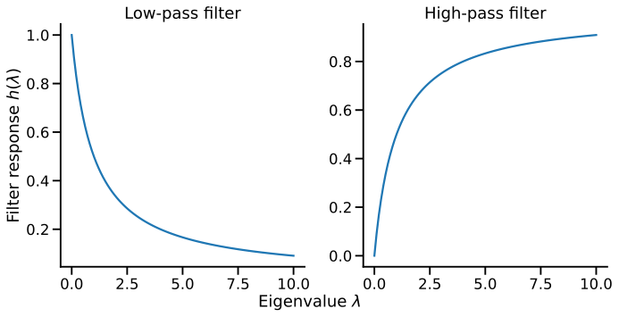

## Analogy between image and graph data
We can think of a convolution of an image from the perspective of networks.
In the convolution of an image, a pixel is convolved with its *neighbors*. We can regard each pixel as a node, and each node is connected to its neighboring nodes (pixels) that are involved in the convolution.

Building on this analogy, we can extend the idea of convolution to general graph data.
Each node has a pixel value(s) (e.g., feature vector), which is convolved with the values of its neighbors in the graph.
This is the key idea of graph convolutional networks.
But, there is a key difference: while the number of neighbors for an image is homogeneous, the number of neighbors for a node in a graph can be heterogeneous. Each pixel has the same number of neighbors (except for the boundary pixels), but nodes in a graph can have very different numbers of neighbors. This makes it non-trivial to define the "kernel" for graph convolution.

There is a second difference, less obvious but just as constraining. In an image, "the pixel above" is a well-defined position, and the same kernel weight always applies to it. In a graph, a node's neighbors arrive as an unordered *set*. If we relabel the nodes — feed the same network in with the rows of ${\bf A}$ shuffled — nothing about the network has changed, so nothing about our answer should change either.

::: {.callout-important title="Key Concept: Permutation invariance and equivariance"}
Let ${\bf P}$ be a permutation matrix that relabels nodes. A function $f$ on graphs is:

- **Permutation invariant** if $f({\bf P}{\bf A}{\bf P}^\top, {\bf P}{\bf X}) = f({\bf A}, {\bf X})$. The output does not move at all. This is what we need for **graph-level** predictions — "is this molecule toxic?" cannot depend on the order we happened to list the atoms in.
- **Permutation equivariant** if $f({\bf P}{\bf A}{\bf P}^\top, {\bf P}{\bf X}) = {\bf P} f({\bf A}, {\bf X})$. The output is relabeled the same way as the input. This is what we need for **node-level** predictions — if node 3 becomes node 7, its prediction should move with it.
:::

This is not a technicality; it dictates the architecture. It is why every layer we build below aggregates neighbors with an operation that ignores order — sum, mean, max — and never with anything that depends on which neighbor came "first". It is also why an MLP applied to a flattened adjacency matrix, which would in principle be more expressive, is useless in practice: it has to learn from data that all $N!$ relabelings mean the same thing.

## Spectral filter on graphs
Just like we can define a convolution on images in the frequency domain, we can also define a ''frequency domain'' for graphs.

Consider a network of $N$ nodes, where each node has a feature variable ${\mathbf x}_i \in \mathbb{R}$. We are interested in:

$$
J = \frac{1}{2}\sum_{i=1}^N\sum_{j=1}^N A_{ij}(x_i - x_j)^2,
$$

where $A_{ij}$ is the adjacency matrix of the graph. The quantity $J$ represents *the total variation* of $x$ between connected nodes; a small $J$ means that connected nodes have similar $x$ (low variation; low frequency), while a large $J$ means that connected nodes have very different $x$ (high variation; high frequency).

We can rewrite $J$ as

$$
J = \frac{1}{2}\sum_{i=1}^N\sum_{j=1}^N A_{ij}(x_i - x_j)^2 = {\bf x}^\top {\bf L} {\bf x},
$$

where ${\bf L}$ is the **(unnormalized) Laplacian matrix** of the graph given by

$$
L_{ij} = \begin{cases}
-1 & \text{if } i \text{ and } j \text{ are connected} \\
k_i & \text{if } i = j \\
0 & \text{otherwise}
\end{cases}.
$$

and ${\bf x} = [x_1,x_2,\ldots, x_N]^\top$ is a column vector of feature variables. Equivalently, ${\bf L} = {\bf D} - {\bf A}$, where ${\bf D}$ is the diagonal degree matrix with $D_{ii} = k_i$.

::: {.callout-important title="Notation: two Laplacians"}
We will need **two** Laplacians in this module, and mixing them up breaks every formula that follows. Keep them distinct:

$$
\underbrace{{\bf L} = {\bf D} - {\bf A}}_{\text{unnormalized}}, \qquad \underbrace{{\bf L}_{\text{sym}} = {\bf D}^{-\frac{1}{2}} {\bf L} {\bf D}^{-\frac{1}{2}} = {\bf I} - {\bf D}^{-\frac{1}{2}} {\bf A} {\bf D}^{-\frac{1}{2}}}_{\text{symmetric normalized}}
$$

${\bf L}$ is what appears in the total-variation identity ${\bf x}^\top {\bf L} {\bf x}$ above, because that identity counts raw squared differences across edges. ${\bf L}_{\text{sym}}$ is what the convolution machinery below uses, because its eigenvalues are confined to $[0, 2]$ regardless of the network — which is what lets us rescale them into a fixed range. Both are symmetric and positive semi-definite, and both have smallest eigenvalue $0$ with a constant-like eigenvector.
:::

::: {.callout-note title="Detailed derivation"}

The above derivation shows that the total variation of $x$ between connected nodes is proportional to ${\bf x}^\top {\bf L} {\bf x}$.

$$
\begin{aligned}
J &= \frac{1}{2}\sum_{i=1}^N\sum_{j=1}^N A_{ij}(x_i - x_j)^2 \\
&= \frac{1}{2}\sum_{i=1}^N\sum_{j=1}^N \underbrace{A_{ij}\left( x_i^2 +x_j^2\right)}_{\text{symmetric}} - \sum_{i=1}^N\sum_{j=1}^N A_{ij}x_ix_j \\
&= \sum_{i=1}^Nx_i^2\underbrace{\sum_{j=1}^N A_{ij}}_{\text{degree of node } i, k_i} - \sum_{i=1}^N\sum_{j=1}^N A_{ij}x_ix_j \\
&= \sum_{i=1}^Nx_i^2 k_i - \sum_{i=1}^N\sum_{j=1}^N A_{ij}x_ix_j \\
&= \underbrace{[x_1,x_2,\ldots, x_N]}_{{\bf x}} \underbrace{\begin{bmatrix} k_1 & 0 & \cdots & 0 \\ 0 & k_2 & \cdots & 0 \\ \vdots & \vdots & \ddots & \vdots \\ 0 & 0 & \cdots & k_N \end{bmatrix}}_{{\bf D}} \underbrace{\begin{bmatrix} x_1 \\ x_2 \\ \vdots \\ x_N \end{bmatrix}}_{{\bf x}} - 2\underbrace{\sum_{i=1}^N\sum_{j=1}^N A_{ij}}_{{\bf x}^\top {\mathbf A} {\bf x}} {\bf x} \\
&= {\bf x}^\top {\bf D} {\bf x} - {\bf x}^\top {\mathbf A} {\bf x} \\
&= {\bf x}^\top {\bf L} {\bf x},
\end{aligned}
$$
:::

Let us showcase the analogy between the Fourier transform and the Laplacian matrix.
In the Fourier transform, a signal is decomposed into sinusoidal basis functions. Similarly, for a graph, we can decompose the variation $J$ into eigenvector bases.

$$
J = \sum_{i=1}^N \lambda_i  {\bf x}^\top {\mathbf u}_i {\mathbf u}_i^\top {\bf x} = \sum_{i=1}^N \lambda_i  ||{\bf x}^\top {\mathbf u}_i||^2.
$$

where ${\mathbf u}_i$ is the eigenvector corresponding to the eigenvalue $\lambda_i$.
^\top {\mathbf u}_i)$ is a dot-product between the feature vector ${\bf x}$ and the eigenvector ${\mathbf u}_i$, which measures how much ${\bf x}$ *coheres* with eigenvector ${\mathbf u}_i$, similar to how Fourier coefficients measure coherency with sinusoids.
- Each $||{\bf x}^\top {\mathbf u}_i||^2$ is the ''strength'' of ${\bf x}$ with respect to the eigenvector ${\mathbf u}_i$, and the total variation $J$ is a weighted sum of these strengths.

Some eigenvectors correspond to low-frequency components, while others correspond to high-frequency components. For example, the total variation $J$ for an eigenvector ${\mathbf u}_i$ is given by

$$
J = \frac{1}{2} \sum_{j}\sum_{\ell} A_{j\ell}(u_{ij} - u_{i\ell})^2 = {\mathbf u}_i^\top {\mathbf L} {\mathbf u}_i = \lambda_i.
$$

This equation provides key insight into the meaning of eigenvalues:

1. For an eigenvector ${\mathbf u}_i$, its eigenvalue $\lambda_i$ measures the total variation for ${\mathbf u}_i$.
2. Large eigenvalues mean large differences between neighbors (high frequency), while small eigenvalues mean small differences (low frequency).

Thus, if ${\bf x}$ aligns well with ${\mathbf u}_i$ with a large $\lambda_i$, then ${\bf x}$ has a strong high-frequency component; if ${\bf x}$ aligns well with ${\mathbf u}_i$ with a small $\lambda_i$, then ${\bf x}$ has strong low-frequency component.

### Spectral Filtering

Eigenvalues $\lambda_i$ can be thought of as a *filter* that controls which frequency components pass through. Instead of using the filter associated with the Laplacian matrix, we can design a filter $h(\lambda_i)$ to control which frequency components pass through. This leads to the idea of *spectral filtering*. Two common filters are:

1. **Low-pass Filter**:
   $$h_{\text{low}}(\lambda) = \frac{1}{1 + \alpha\lambda}$$
   - Preserves low frequencies (small λ)
   - Suppresses high frequencies (large λ)
   - Results in smoother signals

2. **High-pass Filter**:
   $$h_{\text{high}}(\lambda) = \frac{\alpha\lambda}{1 + \alpha\lambda}$$
   - Preserves high frequencies
   - Suppresses low frequencies
   - Emphasizes differences between neighbors

{#fig-m09-fig-00}

# Graph Convolutional Networks
We have seen that spectral filters give us a principled way to think about "convolution" on irregular graph structures, and controlling the frequency components brings out different aspects of the data. We now go one step further: instead of designing filters by hand, we can learn them from data for specific tasks.

## Spectral Graph Convolutional Networks

A simplest form of learnable spectral filter is given by

$$
{\bf L}_{\text{learn}} = \sum_{k=1}^K \theta_k {\mathbf u}_k {\mathbf u}_k^\top,
$$

where ${\mathbf u}_k$ are the eigenvectors and $\theta_k$ are the learnable parameters. The variable $K$ is the number of eigenvectors used (i.e., the rank of the filter). The weight $\theta_k$ is learned to maximize the performance of the task at hand.

Building on this idea, [@bruna2014spectral] added a nonlinearity to the filter and proposed a spectral convolutional neural network (GCN) by

$$
{\bf x}^{(\ell+1)} = h\left( L_{\text{learn}} {\bf x}^{(\ell)}\right),
$$

where $h$ is an activation function, and ${\bf x}^{(\ell)}$ is the feature vector of the $\ell$-th convolution. They further extend this idea to convolve on multidimensional feature vectors, ${\bf X} \in \mathbb{R}^{N \times f_{\text{in}}}$ to produce new feature vectors of different dimensionality, ${\bf X}' \in \mathbb{R}^{N \times f_{\text{out}}}$.

$$
\begin{aligned}
{\bf X}^{(\ell+1)}_i &= h\left( \sum_j L_{\text{learn}}^{(i,j)} {\bf X}^{(\ell)}_j\right),\quad \text{where} \quad L^{(i,j)}_{\text{learn}} = \sum_{k=1}^K \theta_{k, (i,j)} {\mathbf u}_k {\mathbf u}_k^\top,
\end{aligned}
$$

Notice that the learnable filter $L_{\text{learn}}^{(i,j)}$ is defined for each pair of input $i$ and output $j$ dimensions.

::: {.column-margin}
Many GCNs simple when it comes to implementation despite the complicated formula. And this is one of my ways to learn GNNs. Check out the [Appendix for the Python implementation](appendix.md).

:::

## From Spectral to Spatial

Spectral GCNs are mathematically elegant but have two main limitations:
1. **Computational Limitation**: Computing the spectra of the Laplacian is expensive ${\cal O}(N^3)$ and prohibitive for large graphs
2. **Spatial Locality**: The learned filters are not spatially localized. A node can be influenced by all other nodes in the graph.

These two limitations motivate the development of spatial GCNs.

### ChebNet

ChebNet [@defferrard2016convolutional] is one of the earliest spatial GCNs that bridges the gap between spectral and spatial domains.
The key idea is to leverage Chebyshev polynomials to approximate ${\bf L}_{\text{learn}}$ by

$$
{\bf L}_{\text{learn}} \approx \sum_{k=0}^{K-1} \theta_k T_k(\tilde{{\bf L}}), \quad \text{where} \quad \tilde{{\bf L}} = \frac{2}{\lambda_{\text{max}}}{\bf L}_{\text{sym}} - {\bf I},
$$

where ${\bf L}_{\text{sym}} = {\bf I} - {\bf D}^{-1/2}{\bf A}{\bf D}^{-1/2}$ is the **symmetric normalized** Laplacian from the notation box above, $\lambda_{\text{max}}$ is its largest eigenvalue, and $\tilde{{\bf L}}$ is that matrix rescaled so its eigenvalues lie in $[-1,1]$ — the interval on which Chebyshev polynomials are well behaved. The Chebyshev polynomials $T_k(\tilde{{\bf L}})$ transforms the eigenvalues $\tilde{{\bf L}}$ to the following recursively:

$$
\begin{aligned}
T_0(\tilde{{\bf L}}) &= {\bf I} \\
T_1(\tilde{{\bf L}}) &= \tilde{{\bf L}} \\
T_k(\tilde{{\bf L}}) &= 2\tilde{{\bf L}} T_{k-1}(\tilde{{\bf L}}) - T_{k-2}(\tilde{{\bf L}})
\end{aligned}
$$

We then replace ${\bf L}_{\text{learn}}$ in the original spectral GCN with the Chebyshev polynomial approximation:

$$
{\bf x}^{(\ell+1)} = h\left( \sum_{k=0}^{K-1} \theta_k T_k(\tilde{{\bf L}}){\bf x}^{(\ell)}\right),
$$

where:
- $T_k(\tilde{{\bf L}})$ applies the k-th Chebyshev polynomial to the scaled Laplacian matrix
- $\theta_k$ are the learnable parameters
- K is the order of the polynomial (typically small, e.g., K=3)

### Graph Convolutional Networks by Kipf and Welling

While ChebNet offers a principled way to approximate spectral convolutions, Kipf and Welling (2017) [@kipf2017semi] proposed an even simpler and highly effective variant called **Graph Convolutional Networks (GCN)**.

### First-order Approximation

The key departure is to use the first-order approximation of the Chebyshev polynomials, i.e., to keep only $T_0$ and $T_1$. Two simplifications make this collapse neatly. First, we take $\lambda_{\text{max}} \approx 2$, which is exactly the upper bound on the spectrum of ${\bf L}_{\text{sym}}$ noted earlier, so $\tilde{{\bf L}} = \frac{2}{\lambda_{\text{max}}}{\bf L}_{\text{sym}} - {\bf I} \approx {\bf L}_{\text{sym}} - {\bf I}_N$. Second, ${\bf L}_{\text{sym}} - {\bf I}_N = -{\bf D}^{-1/2}{\bf A}{\bf D}^{-1/2}$ by definition. Putting the two together:

$$
g_{\theta'} * x \approx \theta'_0x + \theta'_1({\bf L}_{\text{sym}} - {\bf I}_N)x = \theta'_0x - \theta'_1{\bf D}^{-\frac{1}{2}}{\bf A}{\bf D}^{-\frac{1}{2}}x
$$

This is crude approximation but it leads to a much simpler form, leaving only two learnable parameters, instead of $K$ parameters in the original ChebNet.

::: {.column-margin}
Note that ${\bf L}_{\text{sym}}$, not the unnormalized ${\bf L} = {\bf D} - {\bf A}$, is what appears here. With the unnormalized Laplacian the second equality would be false, since ${\bf L} - {\bf I}_N = {\bf D} - {\bf A} - {\bf I}_N \neq -{\bf D}^{-1/2}{\bf A}{\bf D}^{-1/2}$.
:::

Additionally, they further simplify the formula by using the same $\theta$ for both remaining parameters (i.e., $\theta_0 = \theta$ and $\theta_1 = -\theta$). The result is the following convolutional filter:

$$
g_{\theta} * x \approx \theta(I_N + D^{-\frac{1}{2}}AD^{-\frac{1}{2}})x
$$

While this is a very simple filter, one can stack multiple layers of convolutions to perform high-order graph convolutions.

### Deep GCNs can suffer from vanishing and exploding gradients

GCN models can be deep, and when they are too deep, they start suffering from an ill-posed problem called *gradient vanishing/exploding*, where the gradients of the loss function becomes too small or too large to update the model parameters. It is a common problem in deep learning.

The graph convolution has its own version of this. The operator ${\bf I}_N + {\bf D}^{-1/2}{\bf A}{\bf D}^{-1/2}$ has eigenvalues in $[0, 2]$. Applying it once is harmless, but a deep model applies it over and over: a mode with eigenvalue near $0$ is crushed toward nothing, while a mode with eigenvalue near $2$ is amplified as $2^\ell$ over $\ell$ layers. Repeated multiplication therefore drives the signal — and with it the gradient — either to zero or to infinity.

To facilitate the training of deep GCNs, the authors introduce a very simple trick called *renormalization*. The idea is to add self-connections to the graph:

$$
\tilde{A} = A + I_N, \quad \text{and} \quad \tilde{D}_{ii} = \sum_j \tilde{A}_{ij}
$$

And use $\tilde{A}$ and $\tilde{D}$ to form the convolutional filter.

Altogether, this leads to the following layer-wise propagation rule:

$$X^{(\ell+1)} = \sigma(\tilde{D}^{-\frac{1}{2}}\tilde{A}\tilde{D}^{-\frac{1}{2}}X^{(\ell)}W^{(\ell)})$$

where:
- $X^{(\ell)}$ is the matrix of node features at layer $\ell$
- $W^{(\ell)}$ is the layer's trainable weight matrix
- $\sigma$ is a nonlinear activation function (e.g., ReLU)

These simplifications offer several advantages:
- **Efficiency**: Linear complexity in number of edges
- **Localization**: Each layer only aggregates information from immediate neighbors
- **Depth**: Fewer parameters allow building deeper models
- **Performance**: Despite (or perhaps due to) its simplicity, it often outperforms more complex models

### Deep GCNs can also suffer from over-smoothing

Renormalization fixes the gradients, but it does not fix a second, more conceptual problem with depth: **over-smoothing**.

Look again at what one GCN layer does, ignoring the weights and the nonlinearity. It replaces each node's feature with an average over its closed neighborhood. That is a *low-pass filter* — exactly the $h_{\text{low}}(\lambda)$ we designed at the start of this module. Applying a low-pass filter once removes some high-frequency variation; applying it $\ell$ times removes $\ell$ rounds of it.

In the spectral picture the effect is precise. Write the node signal in the Laplacian eigenbasis. Each layer multiplies the component along ${\bf u}_i$ by a factor that shrinks with the eigenvalue $\lambda_i$. Only the smoothest mode — the one with $\lambda = 0$, which is constant within each connected component — survives untouched. As $\ell \rightarrow \infty$ every other mode is suppressed, and every node in a component converges to the *same* representation.

::: {.callout-warning title="Over-smoothing"}
**Over-smoothing** is the collapse of node representations toward a single vector as depth increases. Past a few layers nodes become indistinguishable and node classification accuracy *falls*. This is why most GCNs in practice are only 2-3 layers deep — an odd fact if you come from computer vision, where more depth reliably helps.
:::

Note that this is a different failure from vanishing gradients. Vanishing gradients are an *optimization* problem: the model cannot be trained. Over-smoothing is a *representational* problem: even trained perfectly, the model has thrown away what distinguishes one node from another.

Several remedies are used in practice:

- **Skip (residual) connections**: add the previous layer's representation back, ${\bf H}^{(\ell+1)} \leftarrow {\bf H}^{(\ell+1)} + {\bf H}^{(\ell)}$, so a node always retains some of its own earlier signal.
- **Jumping knowledge**: keep the representations from *all* layers and let the model choose among them, instead of using only the last.
- **Dropout and DropEdge**: randomly drop units, or randomly drop edges each epoch, which slows the averaging.
- **Normalization**: PairNorm and related graph-specific normalizations explicitly prevent node representations from collapsing onto each other.
- **Just stay shallow**: often the most effective option.

::: {.callout-note title="Exercise"}

Let's implement a simple GCN model for node classification.
[Coding Exercise](../../../notebooks/exercise-m09-graph-neural-net.ipynb)
:::

## The message passing framework

Before meeting more architectures, it helps to name the pattern they all share. Look again at the GCN layer, ignoring the matrix notation: each node collects its neighbors' representations, combines them into one, and uses that to update itself. Every GNN in this module — and essentially every GNN in the literature — is a choice of how to do those three things.

::: {.callout-important title="Key Concept: Message passing"}
One layer of a GNN updates node $v$ as

$$
{\bf h}_v^{(\ell+1)} = \text{UPDATE}\left( {\bf h}_v^{(\ell)},\; \text{AGGREGATE}\left( \left\{ \text{MESSAGE}\left({\bf h}_v^{(\ell)}, {\bf h}_u^{(\ell)}, {\bf e}_{vu}\right) : u \in {\cal N}(v) \right\} \right) \right)
$$

- **MESSAGE** builds what each neighbor $u$ sends to $v$, optionally using the edge ${\bf e}_{vu}$.
- **AGGREGATE** combines the incoming messages into a single vector. It takes a **multiset** as input and must be order-independent — this is where permutation equivariance is enforced.
- **UPDATE** combines the aggregated message with the node's own current state.
:::

Reading the architectures through this lens:

| | MESSAGE | AGGREGATE | UPDATE |
|---|---|---|---|
| **GCN** | ${\bf h}_u$ scaled by $1/\sqrt{\tilde k_v \tilde k_u}$ | sum | linear map, then $\sigma$ |
| **GraphSAGE** | ${\bf h}_u$, from a *sample* of neighbors | mean / max / LSTM | concatenate with ${\bf h}_v$, linear, normalize |
| **GAT** | ${\bf h}_u$ | attention-weighted sum, weights learned | linear map, then $\sigma$ |
| **GIN** | ${\bf h}_u$ | sum | $(1+\epsilon){\bf h}_v + \text{sum}$, then MLP |

Two consequences follow immediately from this form.

**Depth equals reach.** After $\ell$ layers a node's representation depends on exactly its $\ell$-hop neighborhood, and nothing further. A 2-layer GNN cannot see anything 3 hops away. This is why the receptive field grows with depth — and, given over-smoothing, why the useful range of depths is so narrow.

**Features and structure are learned jointly.** A GNN consumes two inputs: the graph ${\bf A}$ and the node features ${\bf X}$. If the features are informative the model can lean on them; if they are uninformative (all-ones, or a one-hot node ID) the model has nothing but topology and degenerates into a structural method. This is worth checking before blaming an architecture: on a network with no meaningful node attributes, a GNN often does no better than the embeddings of Module 8.

# Popular Graph Neural Networks

In this note, we will introduce three popular GNNs: GraphSAGE, Graph Attention Networks (GAT), and Graph Isomorphism Network (GIN).

## GraphSAGE: Sample and Aggregate

GraphSAGE [@hamilton2017graphsage] introduced a different GCN that can be ***generalized to unseen nodes*** (they called it "inductive"). While previous approaches like ChebNet and GCN operate on the entire graph, GraphSAGE proposes an inductive framework that generates embeddings by sampling and aggregating features from a node's neighborhood.

### Key Ideas

GraphSAGE involves two key ideas: (1) sampling and (2) aggregation.

### Neighborhood Sampling

The key idea is the *neighborhood sampling*. Instead of using all neighbors, GraphSAGE samples a fixed-size set of neighbors for each node. This controls memory complexity, a key limitation of the previous GNNs.

Another key advantage of neighborhood sampling is that it enables GraphSAGE to handle dynamic, growing networks. Consider a citation network where new papers (nodes) are continuously added. Traditional GCNs would need to recompute filters for the entire network with each new addition. In contrast, GraphSAGE can immediately generate embeddings for new nodes by simply sampling their neighbors, without any retraining or recomputation.

### Aggregation

Another key idea is the *aggregation*. GraphSAGE makes a distinction between self-information and neighborhood information. While previous GNNs treat them equally and aggregate them, GraphSAGE treats them differently. Specifically, GraphSAGE introduces an additional step: it concatenates the self-information and the neighborhood information as the input of the convolution.

$$
Z_v = \text{CONCAT}(X_v, X_{\mathcal{N}(v)})
$$

where $X_v$ is the feature of the node itself and $X_{\mathcal{N}(v)}$ is the aggregation of the features of its neighbors. GraphSAGE introduces different ways to aggregate information from neighbors:

   $$X_{\mathcal{N}(v)} = \text{AGGREGATE}_k(\{X_u, \forall u \in \mathcal{N}(v)\})$$

   Common aggregation functions include:
   - Mean aggregator: $\text{AGGREGATE} = \text{mean}(\{h_u, \forall u \in \mathcal{N}(v)\})$
   - Max-pooling: $\text{AGGREGATE} = \max(\{\sigma(W_{\text{pool}}h_u + b), \forall u \in \mathcal{N}(v)\})$
   - LSTM aggregator: Apply LSTM to randomly permuted neighbors

The concatenated feature $Z_v$ is normalized by the L2 norm.

$$
\hat{Z}_v = \frac{Z_v}{\|Z_v\|_2}
$$

and then fed into the convolution.

$$
X_v^k = \sigma(W^k \hat{Z}_v + b^k)
$$

## Graph Attention Networks (GAT): Differentiate Individual Neighbors

A key innovation of GraphSAGE is to treat the self and neighborhood information differently. But should all neighbors be treated equally? Graph Attention Networks (GAT) address this by letting the model learn which neighbors to pay attention to.

### Attention Mechanism

The core idea is beautifully simple: instead of using fixed weights like GCN, let's learn attention weights $\alpha_{ij}$ that determine how much node $i$ should attend to node $j$. These weights are computed dynamically based on node features:

$$
\alpha_{ij} = \frac{\exp(e_{ij})}{\sum_{k \in \mathcal{N}(i)} \exp(e_{ik})}
$$

where $e_{ij}$ represents the importance of the edge between node $i$ and node $j$. Variable $e_{ij}$ is a *learnable* parameter and can be negative, and the exponential function is applied to transform it to a non-negative value, with the normalization term $\sum_{k \in \mathcal{N}(i)} \exp(e_{ik})$ to ensure the weights sum to 1.

How to compute $e_{ij}$? One simple choice is to use a neural network with a shared weight matrix $W$ and a LeakyReLU activation function. Specifically:

1. Let's focus on computing $e_{ij}$ for node $i$ and its neighbor $j$.
2. We use a **single** shared weight matrix ${\bf W}$ to transform the features of **both** node $i$ and node $j$. The same ${\bf W}$ is reused in the update step below — there is no second weight matrix.
   $$
   \mathbf{\tilde h}_i  = {\bf W}\mathbf{h}_i, \quad \mathbf{\tilde h}_j  = {\bf W}\mathbf{h}_j
   $$
3. We concatenate the transformed features and apply a LeakyReLU activation function.

$$
e_{ij} = \text{LeakyReLU}\left(\mathbf{a}^T[\mathbf{\tilde h}_i \, \| \, \mathbf{\tilde h}_j]\right) = \text{LeakyReLU}\left(\mathbf{a}^T[{\bf W}\mathbf{h}_i \, \| \, {\bf W}\mathbf{h}_j]\right)
$$

where $\|$ denotes concatenation and $\mathbf{a}$ is a trainable parameter vector that scores the concatenated pair.

Once we have these attention weights, the node update is straightforward - just a weighted sum of neighbor features, using the same ${\bf W}$:

$$\mathbf{h}'_i = \sigma\left(\sum_{j \in \mathcal{N}(i) \cup \{i\}} \alpha_{ij}{\bf W}\mathbf{h}_j\right)$$

To stabilize training, GAT uses $K$ independent attention heads, each with its own ${\bf W}^k$ and $\mathbf{a}^k$. In intermediate layers their outputs are concatenated:

$$\mathbf{h}'_i = \parallel_{k=1}^K \sigma\left(\sum_{j \in \mathcal{N}(i) \cup \{i\}} \alpha_{ij}^k{\bf W}^k\mathbf{h}_j\right)$$

In the **final** layer concatenation no longer makes sense (the output dimension is fixed by the task), so the heads are averaged instead:

$$\mathbf{h}'_i = \sigma\left(\frac{1}{K}\sum_{k=1}^K \sum_{j \in \mathcal{N}(i) \cup \{i\}} \alpha_{ij}^k{\bf W}^k\mathbf{h}_j\right)$$

## Graph Isomorphism Network (GIN): Differentiate the Aggregation

Graph Isomorphism Networks (GIN) is another popular GNN that born out of a question: what is the maximum discriminative power achievable by Graph Neural Networks? The answer lies in its theoretical connection to **the Weisfeiler-Lehman (WL) test**, a powerful algorithm for graph isomorphism testing.

### Weisfeiler-Lehman Test

Are two graphs structurally identical? Graph isomorphism testing determines if two graphs are structurally identical, with applications in graph classification, clustering, and other tasks.

While the general problem has no known polynomial-time solution, the WL test is an efficient heuristic that works well in practice. The WL test iteratively refines node labels by hashing the multiset of neighboring labels

The WL test works as follows:

1. Assign all nodes the same initial label.
2. For each node, collect the labels of all its neighbors and *aggregate them* into a hash (e.g., new label). For example, the top node gets {0} from its neighbors, resulting in a collection {0,0}. A new label is created via a hash function $h$ that maps {0, {0, 0}} to a new label 1.
3. Repeat the process for a fixed number of iterations or until convergence.
å
After these iterations:
- Nodes with the same label are structurally identical, meaning that they are indistinguishable unless we label them differently.
- Two graphs are structurally identical if and only if they have the same node labels after the WL test.

The WL test is a heuristic and can fail on some graphs. For example, it cannot distinguish regular graphs with the same number of nodes and edges.

::: {.column-margin}
The WL test above is called the 1-WL test. There are higher-order WL tests that can distinguish more graphs, which are the basis of advanced GNNs.
Check out [this note](https://www.moldesk.net/blog/weisfeiler-lehman-isomorphism-test/)
:::

### GIN

GIN [@xu2018how] is a GNN that is based on the WL test.
The key idea is to focus on the parallel between the WL test and the GNN update rule.
- In the WL test, we iteratively collect the labels of neighbors and aggregate them through a *hash function*.
- In the GraphSAGE and GAT, the labels are the nodes' features, and the aggregation is some arithmetic operations such as mean or max.

The key difference is that the hash function in the WL test always distinguishes different sets of neighbors' labels, while the aggregation in GraphSAGE and GAT does not always do so. For example, if all nodes have the same feature (e.g., all 1), the aggregation by the mean or max will result in the same value for all nodes, whereas the hash function in the WL test can still distinguish different sets of neighbors' labels by *the count of each label*.

The resulting convolution update rule is:

$$
h_v^{(k+1)} = \text{MLP}^{(k)}\left((1 + \epsilon^{(k)}) \cdot h_v^{(k)} + \sum_{u \in \mathcal{N}(v)} h_u^{(k)}\right)
$$

where $\text{MLP}^{(k)}$ is a multi-layer perceptron (MLP) with $k$ layers, and $\epsilon^{(k)}$ is a fixed or trainable parameter.
# What are GNNs used for?

So far we have built layers without saying what comes out the other end. Three task levels cover almost everything, and they differ in how node representations are turned into a prediction.

## Node-level tasks

Attach a classifier to each node's final representation.

**Node classification** predicts a label per node: which topic a paper belongs to, whether an account is fraudulent, what function a protein performs. Training is usually **semi-supervised** — labels exist for a small fraction of nodes, the loss is computed only on those, but message passing lets unlabelled nodes contribute their features and structure anyway. This is a genuine advantage over methods that need labels everywhere.

**Node regression** is the same with a continuous target.

## Edge-level tasks

Here the prediction concerns a *pair*, so we combine two node representations into an edge score:

$$
\hat{y}_{uv} = \text{score}({\bf h}_u, {\bf h}_v)
$$

where the score can be a dot product, a distance, or a small MLP on the concatenation.

**Link prediction** asks whether an edge exists or will appear — friend recommendation, drug-target interaction, knowledge graph completion. Note the evaluation subtlety carried over from Module 8: real networks are sparse, so non-edges vastly outnumber edges, and a model predicting "no edge" everywhere scores well on accuracy. Use AUC or precision@k, and sample negatives deliberately.

**Edge classification** predicts the *type* of a relationship rather than its existence.

## Graph-level tasks

Now the prediction concerns an entire graph — is this molecule soluble, is this program malicious — so we must compress $N$ node vectors into one graph vector. That step is called **readout** or **pooling**, and it must be permutation invariant:

$$
{\bf h}_G = \text{READOUT}\left(\left\{ {\bf h}_v : v \in V \right\}\right)
$$

**Global pooling** is the simple answer: sum, mean, or max over all nodes. Sum keeps size information (a bigger molecule gives a bigger vector); mean discards it and is more robust when graph sizes vary a lot. The choice matters more than it looks.

**Hierarchical pooling** is the more ambitious answer: instead of collapsing everything at once, progressively coarsen the graph, merging clusters of nodes into super-nodes over several rounds, mirroring the pooling layers of a CNN. Methods like DiffPool learn which nodes to merge. This preserves multi-scale structure that global pooling destroys, at a substantial cost in complexity.

# Training GNNs at scale

One practical matter deserves attention because it has no analogue in ordinary deep learning.

With images you build a mini-batch by picking 32 images; they are independent, so this is trivial. Nodes in a graph are *not* independent — computing one node's representation requires its neighbors, whose representations require *their* neighbors. With $\ell$ layers, a single node's prediction depends on its entire $\ell$-hop neighborhood.

**Full-batch training** sidesteps the problem by loading the whole graph and updating all nodes at once. It is exact and simple, and it fails as soon as the graph exceeds memory.

The alternatives all trade exactness for feasibility:

- **Node-wise sampling** (GraphSAGE): sample a fixed number of neighbors per layer, capping the neighborhood explosion. This is the sampling we already met, seen from the training side.
- **Layer-wise sampling**: sample a fixed set of nodes for each layer instead of per node, which avoids the exponential blow-up of independent per-node sampling.
- **Subgraph sampling** (Cluster-GCN, GraphSAINT): partition the graph into subgraphs and treat each as a mini-batch. Cheap and effective, but it deletes the edges between partitions, which biases training.

::: {.column-margin}
This is why the "neighborhood explosion" is such a recurring phrase in the GNN literature. With average degree 10 and 3 layers, one node pulls in roughly 1,000 others. On a graph with hubs of degree 10,000, one unlucky node pulls in the entire network.
:::

# Beyond message passing: Graph Transformers

Message passing has a built-in restriction: information moves one hop per layer, so distant nodes communicate only through depth — and depth brings over-smoothing. **Graph Transformers** attack this by letting every node attend to every other node directly, as in the Transformers used for text.

That solves the distance problem and creates two new ones.

**Where did the structure go?** If every node attends to every other, the model no longer knows which nodes are actually connected — we have thrown the graph away. The fix is **positional encodings**: give each node a feature vector describing where it sits in the graph. The standard choices are the leading Laplacian eigenvectors (the spectral embedding of Module 8) or random-walk return probabilities (Module 7). Both give a node a coordinate that reflects the topology, which attention can then use.

**Cost.** All-pairs attention is $O(N^2)$, which is fine for molecules with 50 atoms and hopeless for a social network with millions of nodes. Practical variants restrict attention to a sampled or local subset.

# What is still hard

Four open problems, each an active research area:

- **Scale.** Billion-node graphs strain memory and defeat exact training; sampling introduces bias whose effects are poorly understood.
- **Theory.** We know message passing is bounded by 1-WL, but generalization is largely unexplained: why do 2-layer models with modest capacity work as well as they do?
- **Dynamics.** Most models assume a fixed graph. Real networks add and remove nodes and edges continuously, and temporal GNNs are far less settled than static ones.
- **Robustness, fairness and privacy.** GNN predictions can be flipped by a handful of adversarially added edges. Message passing propagates the majority group's signal into minority nodes, which can encode and amplify bias. And because a node's prediction depends on its neighbors' data, a GNN can leak information about people who never supplied their own.

# Where this module sits in the course

It is worth closing by noticing how little of this module was actually new.

- The **GCN layer** is a low-pass filter on the graph Laplacian — the spectral machinery of Module 8, with the filter learned instead of designed.
- **Message passing** is a learned diffusion process. Replace the learnable functions with fixed averaging and you have the random walk of Module 7.
- **Node classification** works because connected nodes tend to share labels — which is homophily, the community structure of Module 5.
- **Neighborhood sampling** is necessary because of hubs, whose existence is the degree heterogeneity of Module 4.
- **Over-smoothing** is a statement about the spectral gap, the same quantity that controls mixing time in Module 7 and bottlenecks in Module 8.

Graph neural networks are not a separate subject bolted onto the end of the course. They are what happens when the structures we spent eight modules measuring become the substrate for learning.
