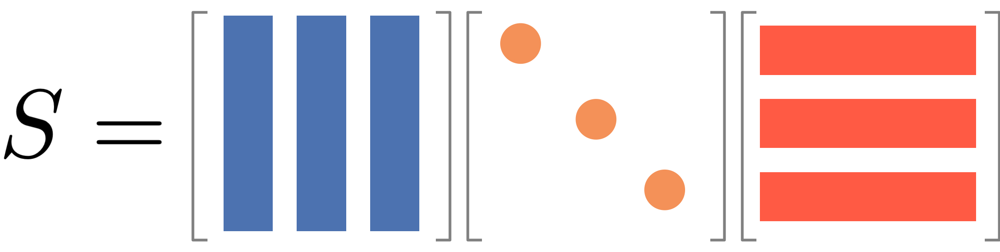

---
kernelspec:
  display_name: Python 3 (ipykernel)
  language: python
  name: python3
---

<a target="_blank" href="https://colab.research.google.com/github/skojaku/adv-net-sci/blob/main/notebooks/exercise-m01-euler-tour.ipynb">
  
</a>

#  Exercise


## Exercise 01

1. Create a network of landmasses and bridges of Binghamton, NY.
2. Find an Euler path that crosses all the bridges of Binghamton, NY exactly once.


```{code-cell} ipython3
# If you are using colab, uncomment the following line
# !sudo apt install libcairo2-dev pkg-config python3-dev
# !pip install pycairo cairocffi
# !pip install igraph

```

Define the edges
```{code-cell} ipython3
# This is a placeholder for your code for the exercise
edges = ...
```


Define the adjacnecy matrix (without for loops!)
```{code-cell} ipython3
A = ...
```

Visualize the graph
```{code-cell} ipython3
import igraph
import matplotlib.pyplot as plt
import numpy as np

def visualize_graph(A, **params):
  A = np.array(A)
  src, trg = np.where(A)
  g = igraph.Graph(directed=False)
  g.add_vertices(A.shape[0])
  for s, t in zip(src, trg):
    for _ in range(A[s, t]):
      g.add_edge(s, t)
  return igraph.plot(g, **params)

visualize_graph(A)
```

Check if the graph has an Euler path
```{code-cell} ipython3

```


##  Exercise 02

Let's create a network from pre-existing data and check if it has an Euler path.

1. Select a network of your choice from [Netzschleuder](https://networks.skewed.de/). For convenience, choose a network of nodes less than 5000.
2. Download the csv version of the data by clicking something like "3KiB" under `csv` column.
3. Unzip the file and find "edges.csv", open it with a text editor to familiarize yourself with the format.
4. Load the data using `pandas`.
5. Get the source and target nodes from the data to create an edge list.
6. Construct the adjacency matrix from the edge list.
7. Draw the graph using `igraph`.
8. Check if the graph has an Euler path.


Load the data by
```{code-cell} ipython3
import pandas as pd
df = pd.read_csv('edges.csv') # load the data
display(df)
```

Then, get the srce and target nodes to compose an edge list
```{code-cell} ipython3
src = ...
trg = ...
edges = ...
```

Create the adjacency matrix from the edge list
```{code-cell} ipython3
```

Get the degree of each node
```{code-cell} ipython3
deg = ...
```

Visualize the graph
```{code-cell} ipython3
visualize_graph(A)
```

Check if the graph has an Euler path
```{code-cell} ipython3
```---
jupytext:
  formats: md:myst
  text_representation:
    extension: .md
    format_name: myst
kernelspec:
  display_name: Python 3
  language: python
  name: python3
launch_buttons:
  notebook_interface: "classic"
  colab_url: "https://colab.research.google.com"
  thebe: true
  binderhub_url: "https://mybinder.org"  # The URL for your BinderHub (e.g., https://mybinder.org)
---


# Euler's solution

Euler consider two cases:
- a node has an even number of edges, or
- a node has an odd number of edges.

When a node has an even number $2k$ of edges, one can enter and leave the node $k$ times by crossing different edges.

When a node has an odd number $2k+1$ of edges, one can enter and leave the node $k$ times by crossing different edges but leave one last edge to cross. The only way to cross this last edge is that one starts or ends at the node.

Based up on the above reasoning, Euler leads to the following necessary (and later shown as sufficient) conditions:

:::{admonition} Euler's path

There exists a walk that crosses all edges exactly once if and only if all nodes have even number of edges, or exactly two nodes have an odd number of edges.
:::


Back to the Konigsberg bridge problem, every node has an odd number of edges, meaning that there is no way to cross all edges exactly once. What a sad story for the citizens of Konigsberg. But the problem was solved during World War II, where Koingberg was bombarded by Soviet Union, losing two of the seven bridges 🫠.

:::{figure-md} markdown-fig


Two bridges were bombed by Soviet Union, which allows the Euler path to exist.
:::

---
kernelspec:
  display_name: Python 3 (ipykernel)
  language: python
  name: python3
---

<a target="_blank" href="https://colab.research.google.com/github/skojaku/adv-net-sci/blob/main/docs/lecture-note/m01-euler_tour/how-to-code-network.ipynb">
  
</a>

# Compute with networks

So far we worked out the network of bridges of Konigsberg by illustrating the network with points and lines.
From now, we will work with a representation of the network that can be easily computed with code.

## Network representation

An atomic element of a network is a node, i.e., a network is a collection of edges which are pairs of nodes.
We *label* a unique integer as an identifier for each node. For instance, the bridges of Konigsberg has 4 nodes, and we assign the number 0 to 3 to the nodes. An edge can be represented by a pair of nodes. For instance, the edge between node 0 and node 1 can be represented by the pair `(0, 1)`.


```{figure-md} numbered-koningsberg-graph


Labeled Knigsberg graph

```

```{note}
:name: node-labeling
We label nodes starting from 0 with consecutive numbers, which is convenient for Python. However, this is *not the only way* to label nodes.
```

The Konigsberg graph can be represented by a list of edges.

```{code-cell} python
edges = [(0,1), (0, 1), (0, 3), (1, 2), (1, 2), (1, 3), (2, 3)]
```

Another, more convenient format is the *adjacency matrix*.
In this form, one regard the node index as a coordinate in the matrix. For instance, edge $(1,3)$ is represented by the entry in the second row and fourth column. The entry of the matrix represents the number of edges between two nodes. Thus, the zeros in the matrix represent the absence of edges.

```{code-cell} ipython3
A = [[0, 2, 0, 1],
     [2, 0, 2, 1],
     [0, 2, 0, 1],
     [1, 1, 1, 0]]
```

or equivalently, using for loops:
```{code-cell} ipython3
import numpy as np

A = np.zeros((4, 4))
for i, j in edges:
    A[i][j] += 1
    A[j][i] += 1
```

:::{note}
In the Konigsberg graph, the edges are *undirected*, meaning edge (i,j) is the same as edge (j,i), which is why we increment both entries $(i,j)$ and $(j,i)$ in the for loop. If the edges are *directed*, we treat (i,j) and (j,i) as two different edges, and increment only (i,j).
:::

## Edge counting

Let us showcase the convenience of the adjacency matrix by counting the number of edges in the network.

The total number of edges in the network is the sum of the entities in the
```{code-cell} ipython3
np.sum(A) / 2
```
We divide by 2 because an edge corresponds to two entries in the matrix. Now, let us consider

It is also easy to compute the number of edges pertained to individual nodes by taking the row or column sum of the matrix.
```{code-cell} ipython3
np.sum(A, axis = 1)
```
The result is an array of length 4, where the i-th entry is the number of edges connected to node i.

:::{important}
The number of edges connected to a node is called the ***degree*** of the node.
:::
:::{tip}
The `np.sum(A, axis = 1)` is the column sum of `A`. Alternatively, `np.sum(A, axis = 0)` is the row sum of `A`.
Check out the numpy [documentation](https://numpy.org/doc/stable/reference/generated/numpy.sum.html) for more details.
:::
:::{tip}
If the adjacency matrix is `scipy` CSR format (or CSC format), you can instead use `A_csr.sum(axis=1)`, `A_csr.sum(axis=0)`, and `A_csr.sum()`.
Check out the [scipy documentation](https://docs.scipy.org/doc/scipy/reference/generated/scipy.sparse.csr_matrix.html#scipy.sparse.csr_matrix) for more details.
:::

We can check the number of nodes with odd degree by taking the modulus of the degree by 2.
```{code-cell} ipython3
deg = np.sum(A, axis = 1)
is_odd = deg % 2 == 1
is_odd
```
```{code-cell} ipython3
if np.sum(is_odd) == 2 or np.sum(is_odd) == 0:
    print("The graph has a Euler path.")
else:
    print("The graph does not have a Euler path.")
```---
jupytext:
  formats: md:myst
  text_representation:
    extension: .md
    format_name: myst
kernelspec:
  display_name: Python 3
  language: python
  name: python3
---

# A puzzle

Back in 18th century, there was a city called *Königsberg* situated on the Pregel River in a historical region of Germany. The city had two large islands connected to each other and the mainland by seven bridges.
The citizens of Königsberg pondered a puzzle during their Sunday walks:

```{admonition} Problem
How could one walk through the city and cross each bridge exactly once?
```

:::{figure-md} seven-bridges


The seven bridges of Königsberg
:::

Leonard Euler worked out the solution to this puzzle in 1736. He first simplified the city into *a network of landmasses connected by bridges*, by noting that the landareas, the positions of the islands and the bridges are nothing to do with the puzzle, and that the only thing that matters is the connections between the landmasses.

:::{figure-md} euler-graph


Euler's graph of the bridges of Knigsberg
:::


## Pen-and-paper worksheet

Let's follow the worksheet to solve the puzzle step by step.

- [Worksheet](http://estebanmoro.org/pdf/netsci_for_kids/the_konisberg_bridges.pdf) {cite:p}`esteban-moro-worksheet`


```{bibliography}
:style: unsrt
:filter: docname in docnames
```# Module 1: Euler Tour

## What to learn in this module


In this module, we will learn a historical example that leads to the genesis of graph theory in mathematics and modern network science. Through this example, we will learn:
- How to describe a network using mathematical language
- How to code a network in Python
- Keywords: **network**, **degree**, **Euler walk**---
jupytext:
  formats: md:myst
  text_representation:
    extension: .md
    format_name: myst
kernelspec:
  display_name: Python 3
  language: python
  name: python3
---

# Appendix


## Compressed Sparse Row (CSR) format

CSR format is implemented in [scipy](https://docs.scipy.org/doc/scipy/reference/generated/scipy.sparse.csr_matrix.html). This consists of three arrays called `indptr`, `indices`, and `data`. For example,

```{code-cell} python
import networkx as nx
from scipy import sparse

G = nx.karate_club_graph()
A = sparse.csr_matrix(nx.adjacency_matrix(G))

print("A.indices:", A.indices[:5])
print("A.indptr:", A.indptr[:5])
print("A.data:", A.data[:5])
```

We will walk you through what these arrays mean, how they are generated, and how we can leverage them for efficient computations.

### How to generate CSR format from an adjacency matrix

Let's walk you through how to store an example adjacency matrix in Compressed Sparse Row (CSR) format. Our example adjacency matrix is as follows.

<div align="center">

|      |    0 |    1 |    2 |    3 |    4 |    5 |    6 |    7 |    8 |    9 |   10 |
| ---: | ---: | ---: | ---: | ---: | ---: | ---: | ---: | ---: | ---: | ---: | ---: |
|    0 |      |      |      |      |      |      |      |      |      |      |    1 |
|    1 |      |      |    1 |      |      |      |      |      |      |      |    1 |
|    2 |      |    1 |      |    1 |      |      |      |      |      |      |    1 |
|    3 |      |      |    1 |      |    1 |    1 |    1 |      |      |      |      |
|    4 |      |      |      |    1 |      |      |      |    1 |      |      |      |
|    5 |      |      |      |    1 |      |      |      |      |      |      |      |
|    6 |      |      |      |    1 |      |      |      |      |    1 |    1 |      |
|    7 |      |      |      |      |    1 |      |      |      |      |      |      |
|    8 |      |      |      |      |      |      |    1 |      |      |      |    1 |
|    9 |      |      |      |      |      |      |    1 |      |      |      |    1 |
|   10 |    1 |    1 |    1 |      |      |      |      |      |    1 |    1 |      |
</div>

We will first create **adjacency list**, which is a dictionary consisting of the row IDs and column IDs for the non-zero entries in the adjacency matrix.

<div class="container" align="center">
<div class="col" style="margin-top:0%">

$\{\text{Row ID}: (\text{Column ID}, \text{Value})\}$

</div>
</div>

Concretely, in Python,

```{code-cell} python
adj_list = {
  0:[(10,1)],
  1:[(2,1), (10, 1)],
  2:[(1,1), (3,1), (10, 1)],
  3:[(2,1), (4,1), (5,1), (6,1)],
  #...
}
```

CSR format is a *concatenation* of the keys and values of the adjacency list, respectively. The CSR format has a concatenated array of the values, one for column IDs and one for the values, called `indices` and `data`, respectively.

```{code-cell} python
import numpy as np

indices = np.array([vv[0] for k, v in adj_list.items() for vv in v])
indices
```

```{code-cell} python
data = np.array([vv[1] for k, v in adj_list.items() for vv in v])
data
```

Additionally, the CSR format has another array called `indptr`, which stores the Row IDs of the non-zero entries in the adjacency matrix. This `indptr` array has a value such that `indptr[i]` is the first index of `indices` that corresponds to the `i`-th row of the adjacency matrix. This can be generated by

```{code-cell} python
indptr = np.cumsum([0] + [len(adj_list[i]) for i in range(len(adj_list))])
indptr
```

where we added `0` at the beginning of the array to represent the first non-zero entry in the first row.
The first row ends at index `len(adj_list[0])-1`, and the second row starts at index `len(adj_list[0])` and ends at index `len(adj_list[0])+len(adj_list[1])-1`, and so on.

Now we have three compressed vectors `indptr`, `indices`, and `data`, that together form the CSR format for the adjacency matrix.


### How to use CSR format for efficient computations

The key advantage of the CSR representation is the memory efficiency. But you can leverage the CSR format for more efficient computations, if you know the semantics of `indptr`, `indices`, and `data` arrays.

For instance, one can compute the degree of a node by using
```{code-cell} python
node = 1
degree = indptr[node+1] - indptr[node]
degree
```
Let us break down the above code.
- `indptr[node]` is the first index of the `indices` array that corresponds to the `node`-th row of the adjacency matrix.
- `indptr[node+1]` is the first index of the `indices` array that corresponds to the `(node+1)`-th row of the adjacency matrix.
- Thus, `indptr[node+1] - indptr[node]` is the number of non-zero entries in the `node`-th row of the adjacency matrix, which is the degree of the `node`-th node.

Using `indices`, it is easy to identify the neighbors of a given node by using
```{code-cell} python
neighbors = indices[indptr[node]:indptr[node+1]]
neighbors
```
where `indices[indptr[node]:indptr[node+1]]` is the corresponding column IDs of the non-zero entries in the `node`-th row of the adjacency matrix, which corresponds to the node IDs connected to the `node`-th node.

The edge weights to the neighbors can be obtained by using
```{code-cell} python
edge_weights = data[indptr[node]:indptr[node+1]]
edge_weights
```
# Assignment

We will compute the average path length of a network of scientists. The network is constructed from {footcite:p}`sinatra2016quantifying`, where each node represents a scientist and two scientists are connected if they have co-authored a paper in Physical Review Journals from American Physical Society.

- **For students enrolled in SSIE 641**
  - You will receive a dedicated link to the assignment repository from the instructor.
- *For those who are not enrolled in SSIE 641*
  - You can access the assignment repository at [Github](https://github.com/sk-classroom/adv-net-sci-small-world).
  - This repository does not offer auto-grading. But you can grade the assignment by yourself by
    - `bash grading-toolkit/grade_notebook.sh tests/test_01.py assignment/assignment.ipynb`
    - `bash grading-toolkit/grade_notebook.sh tests/test_02.py assignment/assignment.ipynb`


```{footbibliography}
```---
jupytext:
  cell_metadata_filter: -all
  formats: md:myst
  text_representation:
    extension: .Rmd
    format_name: myst
    format_version: 0.13
    jupytext_version: 1.16.3
kernelspec:
  display_name: Python 3 (ipykernel)
  language: python
  name: python3
---


# Efficient representation for large sparse networks

An adjacency matrix is a convenient way to represent a network.
A challenge of handling large networks is that the adjacency matrix can be too large to fit in memrory.
For example, a network with $10^5$ nodes requires a $10^5 \times 10^5$ matrix, totaling $10$ billion entries!
A good news is that we do not need to hold all these entries in memory, if we know the network is *sparse*.

Many networks in real-world are sparse, meaning most nodes connect to only a few others.
The result is that the adjacency matrix often contains many zeros.
This is where we can save significant memory by storing only the non-zero entries.

**Compressed Sparse Row (CSR)** is an efficient way to store sparse networks by treating the adjacency matrix like a scatter plot. Instead of storing all entries, CSR only keeps track of the "coordinates" (row and column indices) of non-zero entries, along with their values.

:::{admonition} Optional Exercise
:class: tip
For those who are interested in the details of CSR format, please do the following:
- 📝 Pen and paper exercise [here](./pen-paper-csr/exercise.pdf)
- 💻 (Advanced) Coding exercise in the [Appendix](./appendix.md).

:::


:::{figure-md} csr_matirx


Compressed Sparse Row (CSR) matrix. Source: [Medium: Sparse GEMM and Tensor Core’s Structured Sparsity](https://medium.com/@hxu296/exploring-spgemm-and-nvidias-leap-in-deep-neural-network-efficiency-d367adc68791)
:::

The CSR format is implemented in the [scipy](https://docs.scipy.org/doc/scipy/reference/generated/scipy.sparse.csr_matrix.html) library. It is straightforward to convert the CSR matrix from the *dense* adjacency matrix.
```{code-cell} ipython3
from scipy.sparse import csr_matrix

A = [[0, 2, 0, 1],
     [2, 0, 2, 1],
     [0, 2, 0, 1],
     [1, 1, 1, 0]]

A_csr = csr_matrix(A)
A_csr
```

If you have an *edge list*, you can directly generate the CSR matrix without creating the dense matrix first.
```{code-cell} ipython3
from scipy.sparse import csr_matrix

edges = [(0,1), (0, 1), (0, 3), (1, 2), (1, 2), (1, 3), (2, 3)]

src = [edge[0] for edge in edges]
trg = [edge[1] for edge in edges]
values = [1 for _ in edges]
A_csr = csr_matrix((values, (src, trg)), shape=(4, 4))
A_csr
```
where `src`, `trg`, and `values` are lists of the source nodes, target nodes, and edge weights, respectively.
---
jupytext:
  cell_metadata_filter: -all
  formats: md:myst
  text_representation:
    extension: .Rmd
    format_name: myst
    format_version: 0.13
    jupytext_version: 1.16.3
kernelspec:
  display_name: Python 3 (ipykernel)
  language: python
  name: python3
---

<a target="_blank" href="https://colab.research.google.com/github/skojaku/adv-net-sci/blob/main/notebooks/exercise-m02-small-world.ipynb">
  
</a>

# Computing the Shortest Paths and Connected Components

Let's use `igraph` to compute the shortest paths and connected components. We will then use `scipy` to compute them.

```{code-cell} ipython3
# If you are using Google Colab, uncomment the following line to install igraph
# !sudo apt install libcairo2-dev pkg-config python3-dev
# !pip install pycairo cairocffi
# !pip install igraph
```

## igraph

### Create a graph

Let us create a graph of 4 nodes and 4 edges. Our edge list is given by

```{code-cell} ipython3
edge_list = [(0, 1), (1, 2), (0, 2), (0, 3)]
```

`igraph` has an object `Graph` that stores a graph and provides methods to manipulate and analyze the graph. To create a graph from an edge list, we can use the `add_edges` method.

```{code-cell} ipython3
import igraph

g = igraph.Graph() # Create an empty graph
g.add_vertices(4) # Add 4 vertices
g.add_edges(edge_list) # Add edges to the graph

# Plot the graph
igraph.plot(g, bbox=(150, 150), vertex_label=list(range(4)))
```

### Shortest Paths

Let's compute the paths between nodes 2 and 3.

```{code-cell} ipython3
g.get_all_simple_paths(2, to=3)
```

This method enumerates all possible simple paths between two nodes. This is OK for small networks but quickly becomes impractical for larger networks, as the number of paths increases exponentially with the size of the network.

Often, we are interested in the shortest path, which is the path with the smallest number of edges. The shortest path can be computed by using the `get_shortest_paths` method.

```{code-cell} ipython3
g.get_shortest_paths(2, to=3)
```

Note that there can be multiple shortest paths between two nodes. If we are interested in the "length" instead of the path itself, there is a more efficient function `distances`.

```{code-cell} ipython3
g.distances(2, 3)
```

### Connected Components

In the simple network above, we can see that for every pair of nodes, we can find a path connecting them. This is the definition of a connected graph. We can check this property for a given graph:

```{code-cell} ipython3
components = g.connected_components()
```

The `components` is a special object called [VertexClustering](https://python.igraph.org/en/0.11.6/api/igraph.VertexClustering.html) in `igraph`.
It has the following useful functions and attributes:

```{code-cell} ipython3
print("membership: ", components.membership)  # the IDs of the component each node belongs to.
print("sizes: ", list(components.sizes()))  # the number of nodes in each component.
print("giant: ", components.giant())  # a subgraph of the largest connected component.
```

### Exercise 01 🏋️‍♀️💪🧠

1. Now, let us add two nodes that are not connected to the existing graph, and call `connected_components` again. 🔗➕

2. Call `get_shortest_paths` between the two new nodes in different connected components. 🛣️🔍

3. Get the largest connected component. 🌐🏆

```{code-cell} ipython3

```

### Directed networks
Let's extend these ideas about paths and connected components to directed graphs.

```{code-cell} ipython3
edge_list =[(0, 1), (1, 2), (2, 1), (2, 3), (2, 5), (3, 1), (3, 4), (3, 5), (4, 5), (5, 3)]
g = igraph.Graph(directed=True)
g.add_vertices(6)
g.add_edges(edge_list)
igraph.plot(g, bbox=(250, 250), vertex_label=list(range(6)))
```

In directed graphs, edges and paths can be one-way. For instance, in our graph, you can go from node 0 to node 3, but not from 3 to 0.

```{code-cell} ipython3
print("From 0 to 3", g.get_all_simple_paths(0, to=3))
print("From 3 to 0", g.get_all_simple_paths(3, to=0))
```

The shortest path from 4 to 1 must take a longer route due to edge directions.
```{code-cell} ipython3
g.get_shortest_paths(4, 1)
```

Directed networks have two kinds of connected components.

- **Strongly connected components:** Strongly connected means that there exists a direct path between every pair of nodes, i.e., that from any node to any other nodes while respecting the edge directionality.
- **Weakly connected components:** Weakly connected means that there exists a path between every pair of nodes when ignoring the edge directionality.

```{code-cell} ipython3
print(list(g.connected_components(mode="strong")))
print(list(g.connected_components(mode="weak")))
```

## Scipy

We can create a graph, compute the shortest paths, and connected components using `scipy`.

### Create a graph


With scipy, we represent a network by an adjacency matrix using something called a *Compressed Sparse Row (CSR) matrix*. CSR matrices are efficient format for storing and manipulating *sparse* matrices. Why *sparse* is highlighed here? Because in many networks, the adjacency matrix is sparse, i.e., most of the entries are zero. For example, here is the adjacency matrix of a real-world network:


Most of the entries in this adjacency matrix are white, and white means that the value of the entry is zero. And the adjacency matrix looks very white! This is pretty common in real-world networks. We call these matrices "sparse" because they are mostly empty. And CSR matrices are a way to store these sparse matrices efficiently. Don't worry too much about the technical details for now. If you're curious to learn more, you can check out the [Appendix](appendix.md).

The great thing is, `scipy` (especially the `scipy.sparse` module) provides efficient tools for working with these sparse matrices. This comes in really handy when we're working with large networks.

Let create a graph using scipy.
```{code-cell} ipython3
from scipy import sparse # We will use sparse module in scipy

edge_list = [(0, 1), (1, 2), (0, 2), (0, 3)]

src = [src for src, dst in edge_list]
trg = [dst for src, dst in edge_list]
weight = [1 for src, dst in edge_list]

A = sparse.csr_matrix((weight, (src, trg)), shape=(4, 4))
A = A + A.T # Make the adjacency matrix symmetric
A
```

Let's break down the code.
- `src` and `trg` are the source and target nodes of the edges.
- `weight` is the weight of the edges.
- `sparse.csr_matrix((weight, (src, trg)))` creates a sparse matrix, filling `weight` into the positions specified by `(src, trg)`.
- `A.T` is the transpose of `A` and `A + A.T` makes the adjacency matrix symmetric.

The CSR matrix does not print nicely. But you can see it by converting to a numpy array and printing it.

```{code-cell} ipython3
A.toarray()
```

## Shortest Paths

The `sparse` module has a submodule `csgraph` that provides APIs for network analysis.

For example, `csgraph.shortest_path` computes the shortest path length from a specific node to all other nodes.

```{code-cell} ipython3
from scipy.sparse import csgraph

# `indices` is the node to compute the shortest path from.
D = csgraph.shortest_path(A, indices=2, directed=False)
D
```

**Advanced:** If you want to get the actual paths (i.e., list of nodes in the path), you can pass `return_predecessors=True` to `csgraph.shortest_path`.

```{code-cell} ipython3
D, predecessors = csgraph.shortest_path(A, indices=2, directed=False, return_predecessors=True)
```

## Connected Components

Connected components can be computed by `csgraph.connected_components`.

```{code-cell} ipython3
n_components, labels = csgraph.connected_components(A, directed=False, return_labels=True)

print("Number of connected components:", n_components)
print("Labels:", labels)
```

- `n_components` is the number of connected components.
- `labels` is an array of length `n_nodes` where each element is the ID of the connected component the node belongs to.


## Exercise 02 🏋️‍♀️💪🧠

Let's compute the average path length of a network from pre-existing data and check if how long on average it takes to go from any node to any other node.

1. Select a network of your choice from [Netzschleuder](https://networks.skewed.de/). For convenience, choose a network of nodes less than 5000.
2. Download the csv version of the data by clicking something like "3KiB" under `csv` column.
3. Unzip the file and find "edges.csv", open it with a text editor to familiarize yourself with the format.
4. Load the data using `pandas`.
5. Get the source and target nodes from the data to create an edge list.
6. Construct a graph from the edge list, either using `igraph` or `scipy`.
7. Compute the average path length

**Hint:** Finding all shortest paths is a qubic time operation with respect to the number of nodes, or simply put, it takes a long time to compute. So compute the "estimate" by sampling many pairs of nodes uniformly at random and computing the average path length.---
jupytext:
  cell_metadata_filter: -all
  formats: md:myst
  text_representation:
    extension: .Rmd
    format_name: myst
    format_version: 0.13
    jupytext_version: 1.16.3
kernelspec:
  display_name: Python 3 (ipykernel)
  language: python
  name: python3
---

# Walks, Trails, Paths, and Connectedness

## Walks, Trails, Paths

While we have already used the term **path**, let us make clear its definition, together with other related terms.

- A **walk** is a sequence of nodes that are connected to form a continous route in a network. For instance, walk (0, 1, 2, 3) is a walk in the graph of the bridges of Konigsberg. But the sequence (0,2,3,1) is not a walk, because the node 0 is not directly connected to node 2.

- A **trail** is a walk with no repeated edge. For instance, walk (0, 1, 2, 3) is also a trail as it does not cross the same edge twice. But walk (0,2,3,1,3) is not a trail due to the repeated edge (1,3).

- A **path** is a walk without repeated node. For instance, walk (0,1,2,3) is a path. But walk (0, 1, 2, 1, 2, 3) is not a path due to the repeated node 1 and 2.

- When a walk starts and ends at the same node, it is called a **loop*. If the loop is a trail, it is called a **circuit**. If the loop is a path, it is called a **cycle**.

***Question***: Is a path always a trail, and is a trail always a path?

:::{figure-md} numbered-koningsberg-graph2


Labeled Knigsberg graph

:::

- **Shortest Path** is the path with the smallest number of edges (or nodes) between two nodes.
A shortest path from node 0 to 2 is (0, 1, 2). Two nodes can have multiple shortest paths e.g., (0, 3, 2).
- **The shortest path length** is the number of edges in the shortest path, *not the number of nodes!* 👈👈

:::{note} Are there **shortest trails** and **shortest walks**?
Shortest trails and shortest walks are fundamentally equivalent to shortest paths. A shortest trail must visit each node only once (otherwise it would not be the shortest), and similarly, a shortest walk does not repeat nodes (otherwise it would not be the shortest), both forming a shortest path.
:::


## Connectedness

- A network is **connected** if there is a path between every pair of nodes.
- A network is **disconnected** if there is no path between some pairs of nodes.
- **A connected component** of a network is a set of nodes that are connected to each other.
- **The giant component** of a network is the largest connected component that contains a significant fraction of nodes in the network (in order of the number of nodes).

:::{figure-md} connected-components


connected components of a network. the nodes with the same color form a connected component.

:::

## Connectedness in directed networks

We call a network is *directed* if the edges have a direction. Example directed networks include the network of Web pages, the network of friendships on X, the network of citations on academic papers.

In a directed network, a walk must follow the edge directions. Paths, trails, and loops extend similarly to directed networks. But one thing to keep in mind: a walk may not be reversible, meaning there can be a walk from one node to another but not vice versa.

This leads to two different types of `connectedness` as follows:

- **Strong connectedness**: A directed network is said to be strongly connected if there is a path from every node to every other node.
- **Weak connectedness**: A directed network is said to be weakly connected if there is a path from every node to every other node on its *undirected* counterpart.


:::{figure-md} connected-components-directed


connected components of a network. the nodes with the same color form a connected component.

:::

**Question**: Is a strongly-connected component always a weakly-connected component?

In the next section, we will learn how to compute the shortest paths and connected components of a network using a library [igraph](https://python.igraph.org/en/stable/).

# Why is our social network small world?


- ✍️ [It’s a small world!! 6 degrees of separation](http://estebanmoro.org/pdf/netsci_for_kids/6_degrees_of_separation.pdf) {footcite}`esteban-moro-worksheet`


```{footbibliography}
```
---
jupytext:
  cell_metadata_filter: -all
  formats: md:myst
  text_representation:
    extension: .Rmd
    format_name: myst
    format_version: 0.13
    jupytext_version: 1.16.3
kernelspec:
  display_name: Python 3 (ipykernel)
  language: python
  name: python3
---


# Small-world experiment

How far are two people in a social network? Milgram and his colleagues conducted a series of expriment to find out in the 1960s.

:::{figure-md} milgram-small-world-experiment


Milgram's small world experiment.

:::


The experiment went as follows:
1. Milgram first sent out packets to randomly selected people in Omaha, Nebraska, and Wichita, Kansas.
2. The recipient was asked to send the packet to the target person in Boston if they knew them. If not, they were to forward it to someone they knew on a first-name basis who might know the target.
3. The recipient continued to forward the packet to their acquaintances until it reached the target.

The results were surprising: out of the 160 letters sent, 64 successfully reached the target person by the chain of nearly six people, which was later called **six degrees of separation**.
The results imply that, despite the fact that there were hundreds of millions of people in the United States, their social network was significantly compact, with two random people being connected to each other in only a few steps.

:::{tip}
The term "Six degrees of separation" is commonly associated with Milgram's experiment, but Milgram never used it. John Guare coined the term for his 1991 play and movie ["Six Degrees of Separation."](https://en.wikipedia.org/wiki/Six_Degrees_of_Separation_(film))
:::

The results were later confirmed independently.

-  Yahoo research replicate the Milgram's experiment by using emails. Started from more than 24,000 people, only 384 people reached the one of the 18 target person in 13 countries. Among the successful ones, the average length of the chain was about 4. When taken into account the broken chain, the average length was estimated between 5 and 7.{footcite}`goel2009social`

- Researchers in Facebook and University of Milan analyzed the social network n Facebook, which consisted of 721 million active users and 69 billion friendships. The average length of the shortest chain was found to be 4.74. {footcite}`backstrom2012four`

```{footbibliography}
```# Module 2: Small-world

## What to learn in this module

In this module, we will learn small-world experiments and conduct a small small-world experiment . We will learn:
- Small-world experiment by Milgram
- Different concepts of *distance*: path, walks, circuits, cycles, connectedness
- How to load a large sparse network efficiently into memory
- How to measure a *distance* between two nodes using `igraph`
- **Keywords**: small-world experiment, six degrees of separation, path, walks, circuits, cycles, connectedness, connected component, weakly connected component, strongly connected component, compressed sparse row format.
---
jupytext:
  cell_metadata_filter: -all
  formats: md:myst
  text_representation:
    extension: .Rmd
    format_name: myst
    format_version: 0.13
    jupytext_version: 1.16.3
kernelspec:
  display_name: Python 3 (ipykernel)
  language: python
  name: python3
---


# Toolbox for network analysis

Here are some useful tools for network analysis in Python:

- [Python built-in data structures](https://docs.python.org/3/tutorial/datastructures.html) (list, tuple, dict)
- [networkx](https://networkx.org/) - a beginner-friendly library for network analysis
- [igraph](https://igraph.org/python/) - a mature library with a wide range of algorithms
- [graph-tool](https://graph-tool.skewed.de/) - for stochastic block models
- [scipy](https://scipy.org/) - for analyzing large networks
- [pytorch-geometric](https://pytorch-geometric.readthedocs.io/en/latest/) - for graph neural networks

While `networkx` is a popular and beginner-friendly library for network analysis in Python, we'll be using `igraph` in this course. `igraph` is a mature library with a wide range of algorithms, originally developed for R.
Why `igraph` instead of `networkx`?
Because networkx has some persistent bugs in the implementations of some algorithms (e.g., LFR benchmark and weighted degree assortativity), which can skew the analysis.
`igraph` offers more reliable implementations.

We'll also use `scipy` for scientific computing. `scipy` is one of the most popular Python libraries and also a powerful network analysis tool, especially for large networks. While it requires a bit more effort to learn, once you get the hang of it, you'll find it's a powerful tool for your network analysis projects.


---
jupytext:
  cell_metadata_filter: -all
  formats: md:myst
  text_representation:
    extension: .Rmd
    format_name: myst
    format_version: 0.13
    jupytext_version: 1.16.3
kernelspec:
  display_name: Python 3 (ipykernel)
  language: python
  name: python3
---

# Wikirace

Let us feel how small a large network can be by playing the [Wikirace](https://wiki-race.com) game.

<div align="center">
  
</div>


### What's next

At the end of the module, we will measure the average path length in a social network.
Before jumping on, let us arm with some coding techniques to handle the network in the next two sections.

```{bibliography}
:style: unsrt
:filter: docname in docnames
```# Appendix

## Derivation of the Molloy-Reed criterion

Molloy and Reed derived the following criterion for an existence of a giant component in a network with an arbitrary degree distribution {footcite}`molloy1995critical`.
It is based on a simple heuristic argument: the network has a giant component when a random node $i$ with neighbor $j$ has, on average, is connected to at least one other node. We write the condition as

$$
\langle k_i \vert i \leftrightarrow j \rangle = \sum_{k} k P(k \vert i \leftrightarrow j) > 2
$$

where $\langle k_i \vert i \leftrightarrow j \rangle$ is the conditional average degree of node $i$ given that it is connected to node $j$. From Bayes' theorem, we have

$$
P(k_i \vert i \leftrightarrow j) = \frac{P(i \leftrightarrow j \vert k_i) P(k_i)}{P(i \leftrightarrow j)}
$$

Assuming that the network is uncorrelated and sparse (meaning, we neglect loops), then $P(i \leftrightarrow j \vert k_i) = k_i / (N-1)$ and $P(i \leftrightarrow j) = \langle k \rangle / (N-1)$. Substituting these into the above equation, we get

$$
P(k_i \vert i \leftrightarrow j) = \frac{k_i P(k_i)}{\langle k \rangle}
$$

Thus, the condition for the existence of a giant component is

$$
\frac{1}{\langle k \rangle} \sum_{k_i} k_i^2 P(k_i) = \frac{\langle k^2 \rangle}{\langle k \rangle} > 2
$$


## Derivation of the percolation threshold for a random attack.

Assume a fraction $p$ of nodes are removed independently from the network. The removal of nodes reduces the connectivity of the network and the degree of the remaining nodes.
The probability that a node with initial degree $k_0$ reduces its degree to $k$ follows
a binomial distribution,

$$
P(k \vert k_0, p) = \binom{k_0}{k} (1-p)^k p^{k_0-k}
$$

Considering all nodes, the new degree distribution is given by

$$
P'(k) = \sum_{k_0 = k}^{\infty} P(k_0) \binom{k_0}{k} (1-p)^k p^{k_0-k}
$$

To connect with the Molloy-Reed criterion, we need to compute the first and second moments, denoted by $\langle k \rangle'$ and $\langle k^2 \rangle'$, of the new degree distribution.

$$
\begin{align}
\langle k \rangle' &= \sum_{k} k P'(k_0) \\
&= \sum_{k} \sum_{k_0=k}^{\infty} k \binom{k_0}{k} (1-p)^k p^{k_0-k} P(k_0) \\
&= \sum_{k_0=0}^\infty P(k_0) \underbrace{\sum_{k} k \binom{k_0}{k} (1-p)^k p^{k_0-k}}_{\text{Expected value of $k$ for a binomial distribution}} \\
&= \sum_{k_0=0}^\infty P(k_0) k_0 (1-p) \\
&= \langle k_0 \rangle (1-p)
\end{align}
$$

Similarly, we can compute the second moment, which is given by

$$
\langle k^2 \rangle' = \langle k_0^2 \rangle (1-p)^2 + \langle k_0 \rangle p (1-p)
$$

By substituting these into the Molloy-Reed criterion, we get

$$
\frac{\langle k^2 \rangle'}{\langle k \rangle'}  = \frac{\langle k_0^2 \rangle (1-p)^2 + \langle k_0 \rangle p (1-p)}{\langle k_0 \rangle (1-p)} = \frac{\langle k_0^2 \rangle (1-p) + \langle k_0 \rangle p}{\langle k_0 \rangle} > 2
$$

By solving the inequality for $p$, we get the percolation threshold for a random attack,

$$
1-p < \frac{1}{\langle k_0 ^2 \rangle / \langle k_0 \rangle - 1}
$$

which is the condition for the existence of a giant component.
# Building a cost-effective power grid network

- ✍️ [Pen and Paper](./pen-and-paper/exercise.pdf)---
jupytext:
  formats: md:myst
  text_representation:
    extension: .md
    format_name: myst
kernelspec:
  display_name: Python 3
  language: python
  name: python3
---

# Minimum spanning tree

Many networks are surprisingly sparse, with most nodes having only a few connections, in part because connections are costly.
Like cables in power grids and human-to-human communications, networks are often built with cost constraints, and it is often of a great interest to find the most cost-effective structure.

**Minimum spanning tree** is a tree that connects all the nodes in a network with the minimum total weight of edges.
The term involves the following two concepts:

- **Tree**: A network is a tree if it is connected and has no cycles.
- **Spanning tree**: A spanning tree is a tree that spans all the nodes in a network.

The minimum spanning tree may not be unique, meaning there can be multiple spanning trees with the same minimum total weight of edges for a network.

:::{figure-md} minimum-spanning-tree


Minimum spanning tree of a network.
:::

## How to find the minimum spanning tree

**Kruskal's algorithm** and **Prim's algorithms** are two common methods to find a minimum spanning tree.
Both start with an empty edge set and add the smallest weight edge iteratively, while ensuring that the edges form a tree, until all nodes are included.
The difference between the two algorithms lies in the order of edge addition.

**Kruskal's algorithm** operates as follows:
1. Sort the edges by *the increasing order of the edge weights*.
2. Select the edge with the smallest weight that does not form a cycle with the edges already in the tree.
3. Repeat step 2 until all the nodes are connected.

**Prim's algorithm**:
1. Start with a singleton network $G$ consisting of a randomly chosen node.
2. Add the smallest weight edge connecting $G$ to a node not in $G$.
3. Repeat step 2 until all nodes are connected.

{{ '[🚀 Check out the Demo for Kruskal\'s and Prim\'s algorithm 🌐]( BASE_URL/vis/kruskal-vs-prime.html)'.replace('BASE_URL', base_url) }}

Kruskal's algorithm sorts the edges globally at the beginning, while Prim's algorithm sorts the edges locally at each step.
Both algorithms find the same minimum spanning tree, provided that all edge weights are distinct.
Otherwise, they may yield different trees.

## Code

`igraph` provides a function `igraph.Graph.spanning_tree` to find a minimum spanning tree in a given network.

Let's first create a network with random edge weights.
```{code-cell} ipython3
import igraph
import random

g = igraph.Graph.Famous('Zachary')
g.es["weight"] = [random.randint(1, 10) for _ in g.es]
igraph.plot(g, edge_width = g.es["weight"])
```

:::{note}
[Zachary's karate club](https://en.wikipedia.org/wiki/Zachary%27s_karate_club) is a famous network of 34 members of a karate club and documents of their links between friends.
The network is undirected and unweighted.
:::

The minimum spanning tree of the network can be found by the following code.

```{code-cell} ipython3
gmst = g.spanning_tree(weights=g.es["weight"]) # If not `weights` are not specified, the edges are assumed to be unweighted
igraph.plot(gmst, edge_width = gmst.es["weight"])
```---
jupytext:
  formats: md:myst
  text_representation:
    extension: .md
    format_name: myst
kernelspec:
  display_name: Python 3
  language: python
  name: python3
---

# Percolation

Network robustness can be viewed as a inverse process of **percolation** on a network. What is percolation?
Imagine a grid where each square has a chance to become a little puddle. Two puddles are connected if they are next to each other. As more puddles appear, they start connecting with their neighbors to form bigger puddles. This is basically what percolation is all about!
Random failure can be viewed as an inverse process of percolation, where a puddle is dried up (i.e., removed from the network),

```{figure-md} percolation


Image taken from https://jamesmccaffrey.wordpress.com/2021/07/12/whatever-happened-to-percolation-theory/

```

Now, the big question is: When the probability of a node being puddle is $p$, how big can our largest puddle get? 🌊
As we increase the chance of puddles appearing (that's our $p$), the biggest puddle does not grow slowly but explodes in size when $p$ reaches a critical value $p_c$. This sudden change is what we call a *phase transition*! From the percolation perspective, we approach to the critical point from disconnected phase, whereas from the network robustness perspective, we approach to the critical point from connected phase.

```{code-cell} ipython3
:tags: ["hide-input"]

import igraph as ig
import numpy as np
import seaborn as sns
import matplotlib.pyplot as plt


def percolate(g, p):
    return g.subgraph(np.where(np.random.rand(g.vcount()) < p)[0])


def largest_cluster_size(g):
    return g.connected_components().giant().vcount()


n, nei = 500, 1
g = ig.Graph.Lattice([n, n], nei=nei, directed=False, mutual=False, circular=False)

p_values = np.linspace(0, 1, 20)
largest_sizes = [largest_cluster_size(percolate(g, p)) / n**2 for p in p_values]

sns.set(style="ticks", font_scale=1.2)
fig, ax = plt.subplots(figsize=(5, 5))
sns.lineplot(x=p_values, y=largest_sizes, ax=ax, marker="o")
ax.set(
    xlabel="Probability (p)",
    ylabel="Fractional Largest Cluster Size",
    title="Percolation on a 500x500 Lattice",
)
sns.despine()

critical_p = 0.592746  # Critical probability for 2D square lattice
colors = sns.color_palette("colorblind", 3)
ax.axvline(x=critical_p, color="k", linestyle="--", alpha=0.7)
ax.fill_betweenx(
    y=[0, 1], x1=0, x2=critical_p, alpha=0.2, color=colors[0], label="Disconnected"
)
ax.fill_betweenx(
    y=[0, 1], x1=critical_p, x2=1, alpha=0.2, color=colors[1], label="Connected"
)
ax.legend().remove()

ax.annotate(
    "Disconnected",
    xy=(0.3, 0.5),
    xytext=(0.4, 0.1),
    textcoords="data",
    horizontalalignment="right",
    verticalalignment="center",
    fontsize=14,
    fontweight="bold",
)
ax.annotate(
    "Connected",
    xy=(0.9, 0.5),
    xytext=(0.7, 0.1),
    textcoords="data",
    horizontalalignment="left",
    verticalalignment="center",
    fontsize=14,
    fontweight="bold",
)
ax.set_xlim(0, 1)


```

```{note}

Want to see this in action? 🌟 Check out this interactive simulation.
Play around with it and watch how the puddles grow and connect. 🌊

[Bernoulli Percolation Simulation 🌐](https://visualize-it.github.io/bernoulli_percolation/simulation.html) 🔗

```

```{note}

The transition at $p_c$ is discontinuous in the limit of large $N$, called *first-order phase transition*.
In practice, it is often a continuous transition because of the finite size of the network.

```


## A criterion for the giant component

Percolation theory focuses on lattice, a regular structure that is rare in real-world networks. What happens if the network has a complex structure?
The Molloy-Reed criterion {footcite}`molloy1995critical` provides a simple condition for the existence of a giant component in a rewired network. It states that a giant component is likely to exist if:

$$
\kappa_0 := \frac{\langle k^2 \rangle}{\langle k \rangle} > 2
$$

where $k$ is the degree of a node, and $\langle k \rangle$ and $\langle k^2 \rangle$ are the average degree and the average of the square of the degree, respectively. The variable $\kappa_0$ is a shorthand for the ratio. See the [Appendix](./appendix.md) for the derivation of this criterion.

What does $\kappa_0$ represent? It represents the heterogeneity of the degree distribution. For example, a high $\kappa_0$ indicates that there are a few nodes with very high degrees and many nodes with low degrees. When $\kappa_0$ is small, the nodes have similar degree. And Molloy-Reed criterion tells us an important fact about the role of degree distributions on the robustness of networks:
the more heterogeneous the degree distribution is, the more likely the network is to have a giant component.

```{code-cell} ipython3
:tags: ["remove-input"]

import numpy as np
import matplotlib.pyplot as plt
import seaborn as sns
from scipy.stats import uniform, poisson, lognorm
# Set Seaborn style
sns.set_style('white')
sns.set(font_scale=1.5)
sns.set_style('ticks')

# Set up the plot
fig, axs = plt.subplots(1, 3, figsize=(15, 5))
fig.suptitle('Degree distributions with different $\\kappa_0$ values with the same mean $\\langle k \\rangle=5$')

# Set the average degree
avg_k = 5
samples = 3000

# Uniform distribution
k_uniform = np.array([avg_k] * samples)

# Poisson distribution
k_poisson = np.random.poisson(avg_k, size=samples)

# Log-normal distribution
k_lognorm = np.random.lognormal(mean=0, sigma=1, size=samples)
k_lognorm = k_lognorm * avg_k / np.mean(k_lognorm)


# Plot histograms
sns.histplot(k_uniform, ax=axs[0], kde=True, stat="density", discrete=True)
axs[0].set_title(f'Uniform\n$\\kappa_0 = {np.mean(k_uniform**2) / np.mean(k_uniform):.2f}$')
axs[0].set_xlim(0, 10)

sns.histplot(k_poisson, ax=axs[1], kde=True, stat="density", discrete=True)
axs[1].set_title(f'Poisson\n$\\kappa_0 = {np.mean(k_poisson**2) / np.mean(k_poisson):.2f}$')

sns.histplot(k_lognorm, ax=axs[2], kde=True, stat="density", bins=20)
axs[2].set_title(f'Log-normal\n$\\kappa_0 = {np.mean(k_lognorm**2) / np.mean(k_lognorm):.2f}$')

# Set labels and adjust layout
for ax in axs:
    ax.set_xlabel('Degree (k)')
    ax.set_ylabel('Density')

plt.tight_layout()
sns.despine()
```

```{note}
The rewired network considered here is **the configuration model**, where the edges are rewired randomly while keeping the degree distribution fixed. We will discuss more about the configuration model later.

```


```{admonition} Exercise
:class: tip

Consider a random network of $N$ nodes, where every pair of nodes are connected by an edge with a certain probability.
Then, the degree $k$ of a node is a binomial random variable, which we approximate by a Poisson random variable with mean $\langle k \rangle$. The variance of the Poisson random variable is also $\langle k \rangle$.

1. Derive $\langle k^2 \rangle$ using $\langle k \rangle$.
  - Hint: Variance is defined as $\text{Var}(k) = \langle (k-\langle k \rangle)^2 \rangle$.
2. Compute the ratio $\frac{\langle k^2 \rangle}{\langle k \rangle}$.
3. Check when the network satisfies the Molloy-Reed criterion.

```{dropdown} Solution

**Solution for Q1**:
To derive $\langle k^2 \rangle$, we start with the definition of variance

$$\text{Var}(k) = \langle (k - \langle k \rangle)^2 \rangle$$

Expanding the square, we get

$$\text{Var}(k) = \langle k^2 \rangle - 2\langle k \rangle \langle k \rangle + \langle k \rangle^2$$

Since $\text{Var}(k) = \langle k \rangle$ for a Poisson distribution, we can substitute and rearrange

$$\langle k \rangle = \langle k^2 \rangle - \langle k \rangle^2$$

Solving for $\langle k^2 \rangle$, we obtain

$$\langle k^2 \rangle = \langle k \rangle + \langle k \rangle^2$$

**Solution for Q2**:
$\frac{\langle k^2 \rangle}{\langle k \rangle} = 1 + \langle k \rangle$

**Solution for Q3**:
$\langle k \rangle >1$. In other words, if a node has on average more than one neighbor, the random network is likely to have a giant component.
```

## How many nodes are needed to break a network?

When does a network become disconnected? Based on the Molloy-Reed criterion, we can identify the critical fraction of nodes $f_c$ that need to be removed for the giant component to disappear in a network with an arbitrary degree distribution. This critical point is given by {footcite}`cohen2000resilience`:

$$
f_c = 1 - \frac{1}{\frac{\langle k^2 \rangle}{\langle k \rangle} - 1}
$$

See the [Appendix](./appendix.md) for the derivation of this criterion.

Let us illustrate this by considering two kinds of networks:

**Degree homogeneous network**:

In case of a degree homogeneous network like a random network considered in the exercise above,

$$
f_c = 1 - \frac{1}{\langle k \rangle}
$$

This suggests that the threshold is determined by the average degree $\langle k \rangle$. A large $\langle k \rangle$ results in a larger $f_c$, meaning that the network is more robust against random failures.

**Degree heterogeneous network**:

Most real-world networks are degree heterogeneous, i.e., the degree distribution $P(k) \sim k^{-\gamma}$ follows a power law (called *scale-free* network).
In this case, $f_c$ is given by

$$
f_c =
\begin{cases}
1 - \dfrac{1}{\frac{\gamma-2}{3-\gamma} k_{\text{min}} ^{\gamma-2} k_{\text{max}}^{3-\gamma} -1} & \text{if } 2 < \gamma < 3 \\
1 - \dfrac{1}{\frac{\gamma-2}{3-\gamma} k_{\text{min}} - 1} & \text{if } \gamma > 3 \\
\end{cases}
$$

where $k_{\text{min}}$ and $k_{\text{max}}$ are the minimum and maximum degree, respectively.
The variable $\gamma$ is the exponent of the power law degree distribution, controlling the degree heterogeneity, where a lower $\gamma$ results in a more degree heterogeneous network.

- For regime $2 < \gamma < 3$, the critical threshold $f_c$ is determined by the extreme values of the degree distribution, $k_{\text{min}}$ and $k_{\text{max}}$.
And $f_c \rightarrow 1$ when the maximum degree $k_{\text{max}} \in [k_{\text{min}}, N-1]$ increases.
Notably, in this regime, the maximum degree $k_{\text{max}}$ increases as the network size $N$ increases, and this makes $f_c \rightarrow 1$.

- For regime $\gamma > 3$, the critical threshold $f_c$ is influenced by the minimum degree $k_{\text{min}}$. In contrast to $k_{\text{max}}$, $k_{\text{min}}$ remains constant as the network size $N$ grows. Consequently, the network disintegrates when a finite fraction of its nodes are removed.

## Case study: Airport network

Let's consider an empirical network of international airports, where nodes are airports and edges denote a regular commercial flight between two airports.


Data loading:

```{code-cell} ipython3
:tags: ["hide-input", "hide-output"]

# Import necessary libraries
import igraph as ig
import numpy as np
import seaborn as sns
import matplotlib.pyplot as plt
import pandas as pd

# Load the airport network data from a CSV file
df = pd.read_csv("https://raw.githubusercontent.com/skojaku/core-periphery-detection/master/data/edge-table-airport.csv")

# Process the edge data
edges = df[["source", "target"]].to_numpy()
edges = np.unique(edges.reshape(-1), return_inverse=True)[1]
edges = edges.reshape(-1, 2)

# Create the original graph
g = ig.Graph()
g.add_vertices(np.unique(edges) + 1)
g.add_edges([tuple(edge) for edge in edges])
```

Based on the argument above, we can predict the critical point $f_c$ for the airport network as follows:

```{code-cell} ipython3
import numpy as np

g # igraph object of the airport network

# Compute the degree distribution
deg = np.array(g.degree())

k_ave = np.mean(deg)
k_2 = np.mean(deg **2)

# Compute the critical fraction of nodes that need to be removed (prediction)
f_c = 1 - 1 / (k_2 / k_ave - 1)
print(f"The critical fraction of nodes that need to be removed is predicted to be {f_c:.3f}")
```

The $f_c$ is very close to 1, meaning that the network is highly robust to random failures that it keeps the giant component until when almost all nodes are removed.
Let us confirm this by simulating the random failures.

```{code-cell} ipython3
:tags: ["hide-input"]

# Create a copy of the original graph for manipulation
g_damaged = g.copy()
n_nodes = g.vcount()  # Number of nodes in the graph

# Initialize list to store results
results = []

# Simulate random node removal and measure network connectivity
for i in range(n_nodes - 1):  # Loop until only one node remains

    # Randomly select and remove a node
    node_idx = np.random.choice(g_damaged.vs.indices)
    g_damaged.delete_vertices(node_idx)

    # Evaluate the connectivity of the remaining network
    components = g_damaged.connected_components()
    connectivity = np.max(components.sizes()) / g.vcount()

    # Save the results
    results.append(
        {
            "connectivity": connectivity,
            "frac_nodes_removed": (i + 1) / n_nodes,
        }
    )

# Convert results to a DataFrame
df_robustness_profile = pd.DataFrame(results)

# Set up the plot style
sns.set(style='white', font_scale=1.2)
sns.set_style('ticks')

# Create the plot
ax = df_robustness_profile.plot(
    x="frac_nodes_removed",
    y="connectivity",
    kind="line",
    figsize=(5, 5),
    label="Random attack",
    linewidth=2,
    color = sns.color_palette()[0]
)

# Set labels for x and y axes
plt.xlabel("Proportion of nodes removed")
plt.ylabel("Fractional size of largest component")

# Remove the legend
plt.legend().remove()

# Add a diagonal line from top left to bottom right
ax.plot([0, 1], [1, 0], color='gray', linestyle='--')

# Adjust the plot limits to ensure the diagonal line is visible
ax.set_xlim(0, 1)
ax.set_ylim(0, 1)

# Add a vertical line at the critical fraction
ax.axvline(x=f_c, color='red', linestyle='--', alpha=0.7, label="Critical fraction")

# Remove top and right spines of the plot
sns.despine()
```

The robustness profile of the airport network shows a very robust nature of the network, i.e., the airport network keeps the giant component until almost all nodes are removed.


## Targeted attacks

A key implication of the random failures is that a hub plays a critical role in holding the network together. This also implies a vulnerability of the network to targeted attacks. Namely, if we remove the hub preferentially, the network can be quickly disconnected into small components.

One can consider a targeted attack as a process of reducing the degree of nodes in a network. The degree-based attack, for example, reduces the maximum degree of the network, together with the degrees of neighboring nodes.
An effective attack is one that quickly breaks the Molloy-Reed criterion, and from this perspective, the degree-based attack is not effective because it reduces the maximum degree of the network, a major contributor to the degree heterogeneity, $\kappa_0$.


## How to design a robust network?

Based on the percolation theory, how we do we design a network that is robust against random failures and targeted attacks? Two key ingredients are:

1. **Degree heterogeneity**: As we have seen in the percolation theory, the more heterogeneous the degree distribution is, the more likely the network is to have a giant component.

2. **Resilience to hub removal**: A network is vulnerable to targeted attacks if the removal of a single node significantly decreases the heterogeneity of the degree distribution. The most susceptible structure is a star graph, where a central node connects to all other nodes, as removing this central node will disconnect the network.


```{admonition} Exercise
:class: tip

What is the design strategy to make a network robust against targeted attacks?
Design a network that is robust against both random failures and targeted attacks.

{{ '[🚀 Interactive Demo]( BASE_URL/vis/network-robustness.html)'.replace('BASE_URL', base_url) }}

```{dropdown} An answer

A bimodal degree distribution can enhance network robustness against both random failures and targeted attacks.
In this setup, $(1-r)$ portion of nodes have a degree of 1, while $r$ portion of nodes have a high degree, $k_{\text{max}}$.
This structure ensures that the network remains connected even if a hub is removed, as other hubs maintain the connectivity. It also withstands random failures due to its heterogeneous degree distribution.


```


```{footbibliography}
```---
jupytext:
  formats: md:myst
  text_representation:
    extension: .md
    format_name: myst
kernelspec:
  display_name: Python 3
  language: python
  name: python3
---

<a target="_blank" href="https://colab.research.google.com/github/skojaku/adv-net-sci/blob/main/notebooks/exercise-m03-robustness.ipynb">
  
</a>

```{code-cell} ipython3
# If you are using Google Colab, uncomment the following line to install igraph
# !sudo apt install libcairo2-dev pkg-config python3-dev
# !pip install pycairo cairocffi
# !pip install igraph
```

# Hands-on: Robustness (Random attack)

We consider a small social network of 34 members in a university karate club, called Zachary's karate club network.
```{code-cell} ipython3
import igraph
g = igraph.Graph.Famous("Zachary")
igraph.plot(g, vertex_size=20)
```

Let's break the network 😈!
We will remove nodes one by one and see how the connectivity of the network changes at each step.
It is useful to create a copy of the network to keep the original network unchanged.

```{code-cell} ipython3
g_original = g.copy()
```

## Robustness against random failures

Let us remove a single node from the network. To this end, we need to first identify which nodes are in the network. With `igraph`, the IDs of the nodes in a graph are accessible through `Graph.vs.indices` as follows:
```{code-cell} ipython3
print(g.vs.indices)
```

We randomly choose a node and remove it from the network by using `Graph.delete_vertices`.

```{code-cell} ipython3
import numpy as np
node_idx = np.random.choice(g.vs.indices)
g.delete_vertices(node_idx)
print("Node removed:", node_idx)
print("Nodes remaining:", g.vs.indices)
```

:::{note}
`np.random.choice(array)` takes an array `array` and returns a single element from the array.
For example, `np.random.choice(np.array([1, 2, 3]))` returns either 1, 2, or 3 with equal probability.
See [the documentation](https://numpy.org/doc/stable/reference/random/generated/numpy.random.choice.html) for more details.
:::

The connectivity of the network is the fraction of nodes in the largest connected component of the network after node removal.
We can get the connected components of the network by using `Graph.connected_components`.
```{code-cell} ipython3
components = g.connected_components()
```
The sizes of the connected components are accessible via `Graph.connected_components.sizes`.
```{code-cell} ipython3
components.sizes()
```
Thus, the connectivity of the network can be computed by
```{code-cell} ipython3
components = g.connected_components()
connectivity = np.max(components.sizes()) / g_original.vcount()
connectivity
```

Putting together the above code, let us compute the robustness profile of the network.

```{code-cell} ipython3
import pandas as pd

g = g_original.copy() # restore the network
n_nodes = g.vcount()  # Number of nodes

results = []
for i in range(n_nodes -1):  # Loop if the network has at least one node

    # Remove a randomly selected node
    node_idx = np.random.choice(g.vs.indices)
    g.delete_vertices(node_idx)

    # Evaluate the connectivity
    components = g.connected_components()
    connectivity = np.max(components.sizes()) / g_original.vcount()

    # Save the results
    results.append(
        {
            "connectivity": connectivity,
            "frac_nodes_removed": (i + 1) / n_nodes,
        }
    )

df_robustness_profile = pd.DataFrame(results)
```

Let us plot the robustness profile.

```{code-cell} ipython3
import matplotlib.pyplot as plt
import seaborn as sns

sns.set(style='white', font_scale=1.2)
sns.set_style('ticks')

ax = df_robustness_profile.plot(
    x="frac_nodes_removed",
    y="connectivity",
    kind="line",
    figsize=(5, 5),
    label="Random attack",
)
plt.xlabel("Proportion of nodes removed")
plt.ylabel("Connectivity")
plt.legend().remove()
plt.show()
```

## Targeted attack

In a targeted attack, nodes are removed based on specific criteria rather than randomly.
One common strategy is to remove nodes from the largest node degree to the smallest, based on the idea that removing nodes with many edges is more likely to disrupt the network connectivity.

The degree of the nodes is accessible via `Graph.degree`.
```{code-cell} ipython3
print(g_original.degree())
```

We compute the robustness profile by removing nodes with the largest degree and measuring the connectivity of the network after each removal.

```{code-cell} ipython3
g = g_original.copy() # restore the network
n_nodes = g.vcount()  # Number of nodes

results = []
for i in range(n_nodes -1):  # Loop if the network has at least one node

    # Remove the nodes with thelargest degree
    node_idx = g.vs.indices[np.argmax(g.degree())]
    g.delete_vertices(node_idx)

    # Evaluate the connectivity
    components = g.connected_components()
    connectivity = np.max(components.sizes()) / g_original.vcount()

    # Save the results
    results.append(
        {
            "connectivity": connectivity,
            "frac_nodes_removed": (i + 1) / n_nodes,
        }
    )

df_robustness_profile_targeted = pd.DataFrame(results)
```

```{code-cell} ipython3
sns.set(style='white', font_scale=1.2)
sns.set_style('ticks')

sns.set(style="white", font_scale=1.2)
sns.set_style("ticks")

ax = df_robustness_profile.plot(
    x="frac_nodes_removed",
    y="connectivity",
    kind="line",
    figsize=(5, 5),
    label="Random attack",
)
ax = df_robustness_profile_targeted.plot(
    x="frac_nodes_removed",
    y="connectivity",
    kind="line",
    label="Targeted attack",
    ax=ax,
)
ax.set_xlabel("Proportion of nodes removed")
ax.set_ylabel("Connectivity")
ax.legend(frameon=False)
plt.show()
```

While the network is robust against the random attacks, it is vulnerable to the degree-based targeted attack.---
jupytext:
  formats: md:myst
  text_representation:
    extension: .md
    format_name: myst
kernelspec:
  display_name: Python 3
  language: python
  name: python3
---


# Network Robustness

Nodes and edges can fail or be attacked, which disrupt the connectivity of a network.
Roughly speaking, we say a network is robust if it maintain most of its connectivity after failures or attacks.
There are different types of attacks, together with how we quantify the damage they cause. So let us first showcase a case study with code.

## Random node failures

Nodes can fail and disconnect from networks, such as power station closures in power grids. This is modeled as a **random failure**, where randomly chosen nodes are removed from the network. When a node fails, it and its edges are removed.

The damage varies depending on the node to be removed. The damage to the network can be measued in many different ways, but an accepted measure is the loss of **connectivity**, defined as the fraction of nodes left in the largest connected part of the network after the failure.

:::{figure-md} single-node-failure


The impact of removing a single node varies based on which node is removed.
:::

Multiple nodes can fail simultaneously, e.g., due to natural disasters like earthquakes or tsunamis.
Thus it is often useful to assess the robustness of the network against such failures.
**Robustness profile** is a plot of the connectivity drop as a function of the number of nodes removed. It provides a visual summary of the robustness of the network against *a given sequential failure of nodes*.
In random failure, the order of nodes removed is random.

:::{figure-md} multiple-node-failure


Robustness profile of a network for a sequential failure of nodes.
:::

Beyond the qualitative observation, it is useful to quantify the robustness of the network.
The **$R$-index** is a single number that summarizes the robustness of the network.
It is defined as the area under the connectivity curve with integral approximation.

$$
R = \frac{1}{N} \sum_{k=1}^{N-1} y_k
$$

where $y_k$ is the connectivity at fraction $k/N$ of nodes removed, where $N$ is the total number of nodes in the network. A higher value indicates that the network is robust against the attack. The $R$-index has a maximum value of 1/2 (i.e., which corresponds to a diagonal line in the plot above).


## Targeted attack

A network robust against random failures can still be fragmented by **targeted attacks**.
In targeted attacks, nodes are removed based on specific criteria rather than randomly.
For example, nodes can be removed in order of their degree, starting with the largest degree to the smallest degree. The rationale for this attack strategy is that large-degree nodes have many connections, so removing them disrupts the network more significantly.

Degree-based attack is not the only form of targeted attacks. Other forms of targeted attacks include removing nodes based on their centrality (closeness centrality, betweenness centrality) and those based on proximity.

## What's next?

In the next section, we will code up a simple example to compute the robustness profile of a network using Python.
# Module 3: Robustness

## What to learn in this module

In this module, we will learn about network robustness. We will learn:
- Minimum spanning tree
- Network robustness against random and targeted attacks
- **Keywords**: minimum spanning tree, Kruskal’s algorithm, Prim's algorithm, random attacks, targeted attacks, network robustness, robustness index---
jupytext:
  formats: md:myst
  text_representation:
    extension: .md
    format_name: myst
kernelspec:
  display_name: Python 3
  language: python
  name: python3
---

<a target="_blank" href="https://colab.research.google.com/github/skojaku/adv-net-sci/blob/main/notebooks/exercise-m04-friendship-paradox.ipynb">
  
</a>

# Degree distribution


Understanding degree distribution is the first key step to understand networks! And often, we want to see how the degree distribution looks like by plotting it like using histogram. But, it is not as easy as it may seem...

## Visualization basics

To learn the basics of data visualization, please take a [pen and paper exercise](./pen-and-paper/exercise.pdf).

## Coding exercise

[Exercise: Plotting degree distribution](https://github.com/skojaku/adv-net-sci/blob/main/notebooks/exercise-m04-friendship-paradox.ipynb)


### Plotting degree distribution

(The following content includes the answer to the exercise. So please do the exercise first before reading the following content.)

We will first introduce a formal definition of the degree distribution. Then, we will learn how to plot the degree distribution of a network.

The degree of a node $i$, denoted by $d_i$, is the number of edges connected to it. With the adjacency matrix $A$, the degree of node $i$ is given by:

$$
k_i = \sum_{j=1}^N A_{ij}.
$$

Let us compute the degree distribution of a network. We will create a Barabási-Albert network with $N=10,000$ nodes and $m=1$ edge per node.

```{code-cell} ipython3
import igraph
g = igraph.Graph.Barabasi(n = 10000, m = 1) # Create a Barabási-Albert network
A = g.get_adjacency() # Get the adjacency matrix
```

Compute the degree of each node by summing the elements of the adjacency matrix along the rows.

```{code-cell} ipython3
import numpy as np
deg = np.sum(A, axis=1)
deg = deg.flatten()
```

The degree distribution $p(k)$ can be computed by counting the number of nodes with each degree and dividing by the total number of nodes.

```{code-cell} ipython3
p_deg = np.bincount(deg) / len(deg)
```

Let us plot the degree distribution. This is not as trivial as you might think... 🤔

```{code-cell} ipython3
import seaborn as sns
import matplotlib.pyplot as plt

ax = sns.lineplot(x=np.arange(len(p_deg)), y=p_deg)
ax.set_xlabel('Degree')
ax.set_ylabel('Probability')
```

While it clearly shows that most nodes have small degree, it does not show the tail of the distribution clearly, and often it is this tail that is of great interest (e.g., hub nodes). To show the tail of the distribution more clearly, we can use a log-log plot.

```{code-cell} ipython3
ax = sns.lineplot(x=np.arange(len(p_deg)), y=p_deg)
ax.set_xscale('log')
ax.set_yscale('log')
ax.set_ylim(np.min(p_deg[p_deg>0])*0.01, None)
ax.set_xlabel('Degree')
ax.set_ylabel('Probability')
```

We see fluctuations for large degree nodes because of the small number of nodes with large degree.
One can use "binning" to smooth the plot. Binning involves grouping the data into bins and calculating the fraction of data within each bin. However, selecting an appropriate bin size can be challenging, and even with a well-chosen bin size, some information may be lost.

A more convenient way is to use the complementary cumulative distribution function (CCDF).
The CCDF at degree $k$ is the probability that a randomly chosen node has degree $k'$ greater than $k$ ($k' > k$).  For a visual comparison of CCDF and PDF, see Figure 3 in {footcite}`newman2005power` or [the arxiv version](https://arxiv.org/pdf/cond-mat/0412004)

$$
\text{CCDF}(k) = P(k' > k) = \sum_{k'=k+1}^\infty p(k')
$$

- CCDF is a monotonically decreasing function of $k$.
- CCDF encompasses the full information of $p(k)$, i.e., taking the derivative of CCDF gives $p(k)$.
- CCDF can be plotted as a smooth curve on a log-log scale without binning.

```{code-cell} ipython3
ccdf_deg = 1 - np.cumsum(p_deg)[:-1] # 1 - CDF (cumulative distribution function).
# The last element is excluded because it is always 1, resulting in CCDF=0, which cannot be plotted on a log-log scale.

ax = sns.lineplot(x=np.arange(len(ccdf_deg)), y=ccdf_deg)
ax.set_xscale('log')
ax.set_yscale('log')
ax.set_xlabel('Degree')
ax.set_ylabel('CCDF')
```

```{code-cell} ipython3
:tags: [remove-cell]
from myst_nb import glue

cdf_deg = np.cumsum(p_deg)
fig, ax = plt.subplots(figsize=(3,3))
ax = sns.lineplot(x=np.arange(len(cdf_deg)), y=cdf_deg, ax = ax)
ax.set_xscale('log')
ax.set_yscale('log')
ax.set_xlabel('Degree')
ax.set_ylabel('CDF')
glue("cdf_fig", fig, display=False)
```
:::{note}
CCDF (complementary cumulative distribution function) is used instead of CDF (cumulative distribution function) because it highlights the tail of the distribution better in a log-log plot. A log scale expands small values and compresses large values. In a CDF, large degree nodes have values close to 1, compressing the tail. In a CCDF, large degree nodes have small values, making the tail more visible.
```{glue} cdf_fig
:align: center
```
:::

The slope of the CCDF tells us the heterogeneity of the degree distribution.
- Steep slope: more **homogeneous** degree distribution (similar degrees)
- Flat slope: more **heterogeneous** degree distribution (wide range of degrees)


The slope of the CCDF is related to the power-law exponent of the degree distribution.
A power-law degree distribution is described by *a continuous distribution* with the *density function* (not the probability mass) $p(d)$ given by {footcite}`clauset2009power`:

$$
p(k) = \frac{\gamma-1}{k_{\min}} \left( \frac{k}{k_{\min}} \right)^{-\gamma}
$$

where:
- $p(k)$ is the probability *density* of a node having degree $k$
- $\gamma$ is the power-law exponent
- $k_{\min}$ is the minimum degree


:::{note}
The degree distribution is *discrete* but often approximated by a *continuous* distribution for mathematical convenience. While generally accurate, caution is needed as the reliability varies depending on the range of the degrees. See {footcite}`clauset2009power` for more details.
:::

:::{note}
The power-law distribution is ill-defined for $d=0$, which is why there must be a minimum degree $d_{\min}$ to avoid this issue.
:::

:::{note}
There has been a long-standing debate in network science as to whether the power-law well represents the real-world networks. Power-law is just one of many possible distributions with a heavy tail (i.e., a long tail on the right side of the distribution), and other distributions may also fit the data well such as log-normal distribution.
This discussion is critical as many theories in network science are built on the assumption of the form of the degree distribution. See {footcite}`artico2020rare,holme2019rare,voitalov2019scale,barabasi2003scale` for the debate.
:::

The CCDF for the power-law distribution is given by:

$$
\begin{aligned}
\text{CCDF}(k) &= 1 - \int_{k_{\min}}^k p(x) {\rm d}x \\
  &= 1 - \frac{\gamma -1}{k_{\min}}\cdot \frac{1}{1 - \gamma} \left[
\left(\frac{k^{-\gamma + 1}}{k_{\min}^{-\gamma}}\right) - \left(\frac{k_{\min} ^{-\gamma + 1}}{k_{\min} ^{-
\gamma}}\right)\right] \\
&= \left( \frac{k}{k_{\min}}\right)^{-\gamma + 1}
\end{aligned}
$$

Taking the logarithm:

$$
\log \left[ \text{CCDF}(k) \right] = (-\gamma + 1) \cdot \log k + \text{const.}
$$

Thus, the slope of the CCDF in a log-log plot is related to the power-law exponent $\gamma$.
Specifically, a steeper negative slope (i.e., a more negative value of $-\gamma + 1$) corresponds to a larger $\gamma$.
A larger $\gamma$ indicates a more homogeneous degree distribution, where the probability of finding nodes with very high degrees decreases more rapidly.
Conversely, a flatter slope (i.e., a value of $-\gamma + 1$ being closer to zero) corresponds to a smaller $\gamma$.
A smaller $\gamma$ indicates a more heterogeneous degree distribution, where there's a high probability of finding nodes with high degrees compared to that with a large $\gamma$ value.

For students interested in real-world examples of the CCDF plot, refer to Figure 4 in {footcite}`newman2005power`, or [the arxiv version](https://arxiv.org/pdf/cond-mat/0412004)

In sum, the CCDF in a log-log plot provides a convenient visual summary of the degree distribution, with the slope of the CCDF providing a measure of the heterogeneity of the degree distribution.


## Degree distribution of a friend

Continuing from the previous page, we will now consider the degree distribution of a friend of a node.

There are two ways to sample a friend of a node.
1. Sample a node uniformly at random and then sample a friend of the node.
2. Sample a *friendship* (i.e., edge) uniformly at random and then sample an end node of the edge.

Let us focus on the second case and leave the first case for interested students as an exercise.
In the second case, we sample an edge from the network.
This sampling is biased towards nodes with many edges, i.e., a person with $d$ edges is $d$ times more likely to be sampled than someone with 1 edge.
Thus, the degree distribution $p'(k)$ of a friend is given by

$$
p' (k) = C \cdot k \cdot p(k)
$$
The additional term $k$ reflects the fact that a person with $k$ friends is $k$ times more likely to be sampled than someone with 1 friend.
Term $C$ is the normalization constant that ensures the sum of probabilities $p'(k)$ over all $k$ is 1, which can be easily computed as follows:

$$
C = \frac{1}{\sum_{k} k \cdot p(k)} = \frac{1}{\langle k \rangle}
$$

where $\langle k \rangle$ is the average degree of the network. Substituting $C$ into $p'(k)$, we get:

$$
p' (k) = \frac{k}{\langle k \rangle} p(k)
$$

This is the degree distribution of a friend, and it is easy to verify that the average degree of a friend is given by

$$
\langle k' \rangle = \sum_{k} k \cdot p'(k) = \sum_{k} k \cdot \frac{k}{\langle k \rangle} p(k) = \frac{\langle k^2 \rangle}{\langle k \rangle}
$$

which is always larger than $\langle k \rangle$:

$$
\langle k' \rangle = \frac{\langle k^2 \rangle}{\langle k \rangle} \geq \langle k \rangle
$$

with equality only if every node has the same degree. This is a proof of the friendship paradox 😉!


:::{note}
The distribution $p'(k)$ is related to *the excess degree distribution* given by

$$
q(k) = \frac{k + 1}{\langle k \rangle} p(k+1)
$$

The term *excess* comes from the fact that the distribution represents the number of additional connections a randomly chosen friend has, beyond the connection that led to their selection. It excludes the link to the focal node and focuses on the remaining connections of the selected friend.
:::

:::{note}

The friend's degree, $\frac{\langle k^2 \rangle}{\langle k \rangle}$, concides with a term in Molloy-Reed condition:

$$

\frac{\langle k^2 \rangle}{\langle k \rangle} >2

$$

which is a condition for the existence of a giant component in a network. The Molloy-Reed condition states that the average degree of a node's friends must be at least 2 (the inequality is strict because the transition from a small component to a giant component is discontinuous). If a friend has only one edge, you and your friend form an isolated component. If a friend has two edges on average, your friend is a friend of someone else, and that someone else is also friend of another someone else and so on, forming a giant component.

:::

## Plotting degree distribution of a friend

Let us compare the degree distribution of a node and its friend.
We first get the edges in the network, from which we sample a friend.

```{code-cell} ipython3
from scipy import sparse
src, trg, _ = sparse.find(A)
```
- `sparse.find(A)` returns the source node, target node, and edge weight of the edge.
- `src` is the source node of the edge
- `trg` is the target node of the edge
- `_` is used to ignore the edge weight values, as we only need the source and target nodes for this analysis.

Now, let us get the degree of each friend

```{code-cell} ipython3
deg_friend = deg[src]
p_deg_friend = np.bincount(deg_friend) / len(deg_friend)
```

The CCDF of the degree distributions of a node and a friend can be computed by:

```{code-cell} ipython3
ccdf_deg = 1 - np.cumsum(p_deg)[:-1]
ccdf_deg_friend = 1 - np.cumsum(p_deg_friend)[:-1]
```
and plotted by:

```{code-cell} ipython3
import seaborn as sns
import matplotlib.pyplot as plt


ax = sns.lineplot(x=np.arange(len(ccdf_deg)), y=ccdf_deg, label='Node')
ax = sns.lineplot(x=np.arange(len(ccdf_deg)), y=ccdf_deg_friend, label='Friend', ax = ax)
ax.set_xscale('log')
ax.set_yscale('log')
ax.set_xlabel('Degree')
ax.set_ylabel('CCDF')
ax.legend(frameon = False)
```

The slope of the CCDF of a friend is flatter than that of a node, indicating that the degree distribution of a friend is biased towards higher degrees.

```{footbibliography}
```# In-class experiment

"Your friends have more friends than you" is a well-known phenomenon in social networks. It appears everywhere from physical social networks to online social networks, and even random networks!
OK. Let's do not "think" but "feeeeel" this paradox through the following in-class experiment.

## Materials
- [📇 Friendship card](./friendship-cards.pdf)
- 🖊️ Pen

## Friendship Network Experiment

```
┌─────────────────────────────────────────────────────────────┐

   1. [📇] Receive Your Card
      Get a card with a unique letter

   2. [🤝] Meet and Greet (5 mins)
      Move around, exchange cards with at least one friend

   3. [🧮] Count Connections (2 mins)
      Count received cards, write number, return cards

   4. [📈] Calculate Average (2 mins)
      Calculate average 'friend count' of your friends

   5. [📝] Fill Form
      Write your average and your own friend count
      in a separate sheet

└─────────────────────────────────────────────────────────────┘

❗ Important Notes:
  • This is a fun experiment, not a popularity contest
  • Be respectful and inclusive during the meet and greet
  • If you finish early, wait patiently for further instructions
```# Friendship Paradox


## The origin of the friendship paradox

The paradox arises not because of the way we form friendships. It's about measurement! For example a person with 100 friends generates 100 cards, while a person with 1 friend generates only 1 card. If we average friend counts over the cards, popular people are counted more. This is where the friendship paradox comes from.

In network terms, cards represent edges and people represent nodes. The friendship paradox arises because we measure at different levels: nodes or edges. The average friend count at the node level is lower than at the edge level because popular people are counted more often at the edge level.

- **🎉 Fun Challenge**: Can you create a network where your friends have the most friends? 🤔💡 Give it a try in this {{ '[Friendship Paradox Game! 🎮✨]( BASE_URL/vis/friendship-paradox-game.html)'.replace('BASE_URL', base_url) }}

- **Question**: Can you create a network where the friendship paradox is absent? In other words, can you create a graph, where your friends have the same number of friends as you?
# Vaccination Game

Beyond an interesting trivia, the friendship paradox has many practical utilities.

- **🎉 Fun Challenge**: Can you control the spread of a virus by strategically vaccinating individuals? 🤔💡 Give it a try in this {{ '[Vaccination Game! 🎮✨]( BASE_URL/vis/vaccination-game.html)'.replace('BASE_URL', base_url) }}
# Module 4: Friendship Paradox

## What to learn in this module

In this module, we will learn about the friendship paradox. Specifically,
- Friendship paradox: what is it, why it's important, and what are the consequences?
- **Keywords**: friendship paradox, degree bias---
jupytext:
  cell_metadata_filter: -all
  formats: md:myst
  text_representation:
    extension: .Rmd
    format_name: myst
    format_version: 0.13
    jupytext_version: 1.16.3
kernelspec:
  display_name: Python 3 (ipykernel)
  language: python
  name: python3
---

<a target="_blank" href="https://colab.research.google.com/github/skojaku/adv-net-sci/blob/main/notebooks/exercise-m05-clustering.ipynb">
  
</a>

# Hands-on: Clustering

```{code-cell} ipython3
# If you are using Google Colab, uncomment the following line to install igraph
# !sudo apt install libcairo2-dev pkg-config python3-dev
# !pip install pycairo cairocffi
# !pip install igraph
```

## Modularity maximization

Let us showcase how to use `igraph` to detect communities with modularity. We will use the Karate Club Network as an example.


```{code-cell} ipython3
import igraph
g = igraph.Graph.Famous("Zachary")
igraph.plot(g, vertex_size=20)
```

When it comes to maximizing modularity, there are a variety of algorithms to choose from.
Two of the most popular ones are the `Louvain` and `Leiden` algorithms, both of which are implemented in `igraph`. The Louvain algorithm has been around for quite some time and is a classic choice, while the Leiden algorithm is a newer bee that often yields better accuracy. For our example, we'll be using the `Leiden` algorithm, and I think you'll find it really effective!

```{code-cell} ipython3
communities = g.community_leiden(resolution=1, objective_function= "modularity")
```

What is `resolution`? It is a parameter that helps us tackle the resolution limit of the modularity maximization algorithm {footcite}`fortunato2007resolution`!
In simple terms, when we use the resolution parameter $\rho$, the modularity formula can be rewritten as
 follow:

$$
Q(M) = \frac{1}{2m} \sum_{i=1}^n \sum_{j=1}^n \left(A_{ij} - \rho \frac{k_i k_j}{2m}\right) \delta(c_i, c_j)
$$

Here, the parameter $\rho$ plays a crucial role in balancing the positive and negative parts of the equation.
The resolution limit comes into play because of the diminishing effect of the negative term as the number of edges $m$ increases.
The parameter $\rho$ can adjust this balance and allow us to circumvent the resolution limit.

What is `communities`? This is a list of communities, where each community is represented by a list of nodes by their indices.

```{code-cell} ipython3
print(communities)

```
Let us visualize the communities by coloring the nodes in the graph.

```{code-cell} ipython3
import seaborn as sns
community_membership = communities.membership
palette = sns.color_palette().as_hex()
igraph.plot(g, vertex_color=[palette[i] for i in community_membership])
```

- `community_membership`: This is a list of community membership for each node.
- `palette`: This is a list of colors to use for the communities.
- `igraph.plot(g, vertex_color=[palette[i] for i in community_membership])`: This plots the graph 'g' with nodes colored by their community.

### Exercise 01 🏋️‍♀️💪🧠

1. Select a network of your choice from [Netzschleuder](https://networks.skewed.de/). For convenience, choose a network of nodes less than 5000.
2. Download the csv version of the data by clicking something like "3KiB" under `csv` column.
3. Unzip the file and find "edges.csv", open it with a text editor to familiarize yourself with the format.
4. Load the data using `pandas`.
5. Get the source and target nodes from the data to create an edge list.
6. Construct a graph from the edge list, either using `igraph` or `scipy`.
7. Find communities by maximizing the modularity and visualize them.
8. Try at least three different values of the resolution parameter and observe how the community structure changes.

```{code-cell} ipython3
# Your code here
```

## Stochstic Block Model

Let us turn the SBM as our community detection tool using [graph-tool](https://graph-tool.skewed.de/). This is a powerful library for network analysis, with a focus on the stochastic block model.

```{code-cell} ipython3
#
# Uncomment the following code if you are using Google Colab
#
#!wget https://downloads.skewed.de/skewed-keyring/skewed-keyring_1.0_all_$(lsb_release -s -c).deb
#!dpkg -i skewed-keyring_1.0_all_$(lsb_release -s -c).deb
#!echo "deb [signed-by=/usr/share/keyrings/skewed-keyring.gpg] https://downloads.skewed.de/apt $(lsb_release -s -c) main" > /etc/apt/sources.list.d/skewed.list
#!apt-get update
#!apt-get install python3-graph-tool python3-matplotlib python3-cairo
#!apt purge python3-cairo
#!apt install libcairo2-dev pkg-config python3-dev
#!pip install --force-reinstall pycairo
#!pip install zstandard
```

We will identify the communities using the stochastic block model as follows.
First, we will convert the graph object in igraph to that in graph-tool.

```{code-cell} ipython3
import graph_tool.all  as gt
import numpy as np
import igraph

# igraph object
g = igraph.Graph.Famous("Zachary")

# Set random seed for reproducibility
np.random.seed(42)

# Convert the graph object in igraph to that in graph-tool
edges = g.get_edgelist()
r, c = zip(*edges)
g_gt = gt.Graph(directed=False)
g_gt.add_edge_list(np.vstack([r, c]).T)
```

Then, we will fit the stochastic block model to the graph.

```{code-cell} ipython3
# Fit the stochastic block model
state = gt.minimize_blockmodel_dl(
     g_gt,
     state_args={"deg_corr": False, "B_min":2, "B_max":10},
)
b = state.get_blocks()
```

- `B_min` and `B_max` are the minimum and maximum number of communities to consider.
- `deg_corr` is a boolean flag to switch to the degree-corrected SBM {footcite}`karrer2011stochastic`.


```{note}
Here's a fun fact: the likelihood maximization on its own can't figure out how many communities there should be. But `graph-tool` has a clever trick to circumvent this limitation.
`graph-tool` actually fits multiple SBMs, each with a different number of communities. Then, it picks the most plausible one based on a model selection criterion.
```

Let's visualize the communities to see what we got.

```{code-cell} ipython3
:tags: ["hide-input"]
# Convert the block assignments to a list
community_membership = b.get_array()

# The community labels may consist of non-consecutive integers, e.g., 10, 8, 1, 4, ...
# So we reassign the community labels to be 0, 1, 2, ...
community_membership = np.unique(community_membership, return_inverse=True)[1]
community_membership
```

```{code-cell} ipython3
# Create a color palette
import matplotlib.pyplot as plt
import seaborn as sns
palette = sns.color_palette().as_hex()
# Plot the graph with nodes colored by their community
fig, ax = plt.subplots(figsize=(10, 8))
igraph.plot(
    g,
    target=ax,
    vertex_color=[palette[i] for i in community_membership],
)
plt.axis('off')
plt.tight_layout()
plt.show()
```

What we're seeing here isn't a failure at all. In fact, it's the best partition according to our stochastic block model. The model has discovered something called a **core-periphery structure** {footcite}`borgatti2000models`. Let me break that down:

- Think of a major international airport (the core) and smaller regional airports (the periphery).
- Major international airports have many flights connecting to each other (densely connected).
- Smaller regional airports have fewer connections among themselves (sparsely connected).
- Many regional airports have flights to major hubs (periphery connected to the core).

That's exactly what our model found in this network.

If we look at the adjacency matrix, we would see something that looks like an upside-down "L". This shape is like a signature for core-periphery structures.

```{code-cell} ipython3
# Convert igraph Graph to adjacency matrix
A = np.array(g.get_adjacency().data)

# Sort nodes based on their community (core first, then periphery)
sorted_indices = np.argsort(community_membership)
A_sorted = A[sorted_indices][:, sorted_indices]

# Plot the sorted adjacency matrix
plt.figure(figsize=(10, 8))
plt.imshow(A_sorted, cmap='binary')
plt.title("Sorted Adjacency Matrix: Core-Periphery Structure")
plt.xlabel("Node Index (sorted)")
plt.ylabel("Node Index (sorted)")

plt.tight_layout()
plt.show()
```

### Exercise 02 🏋️‍♀️💪🧠

1. Select a network of your choice from [Netzschleuder](https://networks.skewed.de/). For convenience, choose a network of nodes less than 5000.
2. Download the csv version of the data by clicking something like "3KiB" under `csv` column.
3. Unzip the file and find "edges.csv", open it with a text editor to familiarize yourself with the format.
4. Load the data using `pandas`.
5. Get the source and target nodes from the data to create an edge list.
6. Construct a graph from the edge list, either using `igraph` or `scipy`.
7. Find communities by fitting the stochastic block model and visualize them.
8. Try `deg_corr=True` and compare the results with those from `deg_corr=False`.

```{footbibliography}
```---
jupytext:
  formats: md:myst
  text_representation:
    extension: .md
    format_name: myst
kernelspec:
  display_name: Python 3
  language: python
  name: python3
---

# Graph cut

Another approach from computer science is to treat a community detection problem as an *optimization* problem.
An early example is the **graph cut** problem, which asks to find the minimum number of edges to cut the graph into two disconnected components.

Specifically, let us consider cutting the network into two communities. Let $V_1$ and $V_2$ be the set of nodes in the two communities.
Then, the cut is the number of edges between the two communities, which is given by

$$
\begin{align}
\text{Cut}(V_1, V_2) = \sum_{i \in V_1} \sum_{j \in V_2} A_{ij}
\end{align}
$$

Now, the community detection problem is translated into **an optimization problem**, with the goal of finding a cut $V_1, V_2$ that minimizes $\text{Cut}(V_1, V_2)$.

The description of this problem is not complete 😈. Let's find out what is missing by playing with the optimization problem.

```{admonition} Exercise
:class: tip

Can you identify what is missing in the description of the graph cut problem? Without this, the best cut is trivial. {{ "<a href='BASE_URL/vis/community-detection/index.html?scoreType=graphcut&numCommunities=2&randomness=1&dataFile=two-cliques.json'>Graph Cut Problem 🎮</a>".replace('BASE_URL', base_url) }}

```{dropdown} Click to reveal the answer!

The missing element is a constraint: each community must contain at least one node. Without this, the trivial solution of placing all nodes in a single community would always yield a cut of zero.
```---
jupytext:
  formats: md:myst
  text_representation:
    extension: .md
    format_name: myst
kernelspec:
  display_name: Python 3
  language: python
  name: python3
---

# Modularity (Cont.)

:::{figure-md} fig-modularity-game


Illustration of how modularity measures assortativity relative to a null model.
:::

Let's dive into the modularity formula! To put modularity into math terms, we need a few ingredients:
- $m$: The total number of strings (edges) in our bag
- $n$: The total number of balls (nodes) we have
- $A_{ij}$: This tells us if ball $i$ and ball $j$ are connected by a string
- $\delta(c_i,c_j)$: This is our color-checker. It gives us a 1 if balls $i$ and $j$ are the same color (same community), and 0 if they're different.

Now, the probability of pulling out a string out of $m$ string and finding matching colors on both ends is:

$$
\frac{1}{m} \sum_{i=1}^n \sum_{j=i+1}^n A_{ij} \delta(c_i,c_j) = \frac{1}{2m} \sum_{i=1}^n \sum_{j=1}^n A_{ij} \delta(c_i,c_j)
$$

We set $A_{ii} = 0$ by assuming our network doesn't have any "selfie strings" (where a ball is connected to itself). Also, we changed our edge counting a bit. Instead of counting each string once (which gave us $m$), we're now counting each string twice (once from each end). That's why we use $2m$ in the equation.

Now, imagine we've cut all the strings, and we're going to draw two balls at random with replacement.
Here's how our new bag looks:
- We have $2m$ balls in total ($1$ string has $2$ balls, and thus $m$ strings have $2m$ balls in total).
- A node with $k$ edges correspond to the $k$ of $2m$ balls in the bag.
- The color of each ball in our bag matches the color (or community) of its node in the network.

Now, what's the chance of pulling out two balls of the same color?

$$
\sum_{c=1}^C \left( \frac{1}{2m}\sum_{i=1}^n k_i \delta(c, c_i) \right)^2
$$

where $k_i$ is the degree (i.e., the number of edges) of node $i$, and $C$ is the total number of communities (i.e., colors).

Here's what it means in simple terms:
- We look at each color ($c$) one by one (the outer sum).
- For each color, we figure out how many balls of that color are in our bag ($\frac{1}{2m}\sum_{i=1}^n k_i \delta(c, c_i)$).
- We divide by $2m$ to get the probability of drawing a ball of that color.
- We then calculate the chance of grabbing that color twice in a row ($\left( \frac{1}{2m}\sum_{i=1}^n k_i \delta(c, c_i) \right)^2$).
- Finally, we add up these chances for all $C$ colors.

Putting altogether, the modularity is defined by

$$
\begin{align}
Q &=\frac{1}{2m} \sum_{i=1}^n \sum_{j=1}^n A_{ij} \delta(c_i,c_j) - \sum_{c=1}^C \left( \frac{1}{2m}\sum_{i=1}^n k_i \delta(c, c_i) \right)^2
\end{align}
$$

Equivalently, a standard expression is given by

$$
Q =\frac{1}{2m} \sum_{i=1}^n \sum_{j=1}^n \left[ A_{ij} -  \frac{k_ik_j}{2m} \right]\delta(c_i,c_j)
$$

```{note}

Are the two forms of modularity the same formula? Let's see how we can transform one into the other:

1. We start with our first form of modularity:

   $$
   Q =\frac{1}{2m} \sum_{i=1}^n \sum_{j=1}^n A_{ij} \delta(c_i,c_j) - \sum_{c=1}^C \left( \frac{1}{2m}\sum_{i=1}^n k_i \delta(c, c_i) \right)^2
   $$

2. First, let's factor out $\frac{1}{2m}$ from both terms:

   $$
   Q =\frac{1}{2m} \left[ \sum_{i=1}^n \sum_{j=1}^n A_{ij} \delta(c_i,c_j) - \frac{1}{2m}\sum_{c=1}^C \left( \sum_{i=1}^n k_i \delta(c, c_i) \right)^2 \right]
   $$

3. Now, here's a neat trick: $(\sum_i a_i)^2 = (\sum_i a_i)( \sum_j a_j)$. We can use this to expand the squared term:

   $$
   Q =\frac{1}{2m} \left[ \sum_{i=1}^n \sum_{j=1}^n A_{ij} \delta(c_i,c_j) - \frac{1}{2m}\sum_{c=1}^C \left( \sum_{i=1}^n k_i \delta(c, c_i) \right) \left( \sum_{j=1}^n k_j \delta(c, c_j) \right)\right]
   $$

4. And here is another trick $(\sum_i a_i)( \sum_j a_j) = \sum_i a_i \sum_j a_j = \sum_i \sum_j a_ia_j$

   $$
   Q =\frac{1}{2m} \left[ \sum_{i=1}^n \sum_{j=1}^n A_{ij} \delta(c_i,c_j) - \frac{1}{2m}\sum_{c=1}^C \left( \sum_{i=1}^n \sum_{j=1}^n k_i k_j  \delta(c, c_i)  \delta(c, c_j) \right)\right]
   $$

5. Here's yet another cool trick, $\delta(c,c_i) \delta(c, c_j) = \delta(c_i,c_j)$. This means we can simplify our expression:

   $$
   Q =\frac{1}{2m} \left[ \sum_{i=1}^n \sum_{j=1}^n A_{ij} \delta(c_i,c_j) -  \frac{1}{2m} \sum_{i=1}^n \sum_{j=1}^n k_i k_j  \delta(c_i,c_j) \right]
   $$

6. Finally, we can factor out the common parts:

   $$
   Q =\frac{1}{2m} \sum_{i=1}^n \sum_{j=1}^n \left[ A_{ij} -  \frac{k_ik_j}{2m} \right]\delta(c_i,c_j)
   $$
```


## Modularity Demo

Let's learn how the modularity works by playing with a community detection game!

```{admonition} Exercise 1
:class: tip

Find communities by maximizing the modularity. {{ "<a href='BASE_URL/vis/community-detection/index.html?scoreType=modularity&numCommunities=2&randomness=1&dataFile=two-cliques.json'>Modularity maximization (two communities) 🎮</a>".replace('BASE_URL', base_url) }}

```

One of the good things about modularity is that it can figure out how many communities there should be all by itself! 🕵️‍♀️ Let's have some fun with this idea. We're going to play the same game again, but this time, we'll start with a different number of communities. See how the modularity score changes as we move things around.

```{admonition} Exercise 2
:class: tip

Find communities by maximizing the modularity. {{ "<a href='BASE_URL/vis/community-detection/index.html?scoreType=modularity&numCommunities=4&randomness=1&dataFile=two-cliques.json'>Modularity maximization (four communities) 🎮</a>".replace('BASE_URL', base_url) }}
```

Now, let's take our modularity maximization for a real-world example! 🥋 We're going to use the famous karate club network. This network represents friendships between members of a university karate club. It's a classic in the world of network science, and it's perfect for seeing how modularity works in practice.

```{admonition} Exercise 3
:class: tip

Find communities by maximizing the modularity. {{ "<a href='BASE_URL/vis/community-detection/index.html?scoreType=modularity&numCommunities=4&randomness=0.25&dataFile=net_karate.json'>Modularity maximization (four communities) 🎮</a>".replace('BASE_URL', base_url) }}

```

## Limitation of Modularity

Like many other community detection methods, modularity is not a silver bullet. Thanks to extensive research, we know many limitations of modularity. Let's take a look at a few of them.

### Resolution limit

The modularity finds two cliques connected by a single edge as two separate communities.
But what if we add another community to this network?
Our intuition tells us that, because communities are *local* structure, the two cliques should remain separated by the modularity. But is this the case?

```{admonition} Exercise 4
:class: tip

Find communities by maximizing the modularity. {{ "<a href='BASE_URL/vis/community-detection/index.html?scoreType=modularity&numCommunities=3&randomness=0.9&dataFile=two-cliques-big-clique.json'>Modularity maximization (four communities) 🎮</a>".replace('BASE_URL', base_url) }}

```{dropdown} Click here to see the solution

The best modularity score actually comes from merging our two cliques into one big community. This behavior is what we call the **Resolution limit** {footcite}`fortunato2007resolution`. Modularity can't quite make out communities that are smaller than a certain size!

Think of it like this: modularity is trying to see the big picture, but it misses the little details. In network terms, the number of edges $m_c$ in a community $c$ has to be bigger than a certain size. This size is related to the total number of edges $m$ in the whole network. We write this mathematically as ${\cal O}(m)$.
```

### Spurious communities

What if the network does not have any communities at all? Does the modularity find no communities? To find out, let's run the modularity on a random network, where each pair of nodes is connected randomly with the same probability.

```{admonition} Exercise 5
:class: tip

Find communities by maximizing the modularity. {{ "<a href='BASE_URL/vis/community-detection/index.html?scoreType=modularity&numCommunities=3&randomness=0.8&dataFile=random-net.json'>Modularity maximization (four communities) 🎮</a>".replace('BASE_URL', base_url) }}

```{dropdown} Click here to see the solution

Surprise, surprise! 😮 Modularity finds communities even in our random network, and with a very high score too! It's like finding shapes in clouds - sometimes our brains (or algorithms) see patterns where there aren't any.

The wild thing is that the modularity score for this random network is even higher than what we saw for our network with two clear cliques!

This teaches us two important lessons:
1. We can't compare modularity scores between different networks. It's like comparing apples and oranges! 🍎🍊
2. A high modularity score doesn't always mean we've found communities.

Interested readers can read more about this in [this tweet by Tiago Peixoto](https://twitter.com/tiagopeixoto/status/1466352013856358400) and the discussion [here](https://reticular.hypotheses.org/1924).

<blockquote class="twitter-tweet" style="max-width: 550px;"><p lang="en" dir="ltr">Modularity maximization is not a reliable method to find communities in networks. Here&#39;s a simple example showing why:<br><br>1. Generate an Erdős-Rényi random graph with N nodes and average degree &lt;k&gt;.<br><br>2. Find the maximum modularity partition. <a href="https://t.co/MTt5DdFXSX">pic.twitter.com/MTt5DdFXSX</a></p>&mdash; Tiago Peixoto (@tiagopeixoto) <a href="https://twitter.com/tiagopeixoto/status/1466352013856358400?ref_src=twsrc%5Etfw">December 2, 2021</a></blockquote> <script async src="https://platform.twitter.com/widgets.js" charset="utf-8"></script>
```


## So should we avoid modularity?

The simple answer is no. Modularity is still a powerful tool for finding communities in networks. Like any other method, it has its limitations. And knowing these limitations is crucial for using it effectively. There is "free lunch" in community detection {footcite}`peel2017ground`.

When these implicit assumptions are met, modularity is in fact a very powerful method for community detection. For example, it is in fact an "optimal" method for a certain class of networks {footcite}`nadakuditi2012graph`.

So, keep modularity in your toolbox. Just remember to use it wisely!

```{footbibliography}
```---
jupytext:
  formats: md:myst
  text_representation:
    extension: .md
    format_name: myst
kernelspec:
  display_name: Python 3
  language: python
  name: python3
---

# Modularity

**Modularity** is by far the most widely used method for community detection.
Modularity can be derived in many ways, but we will follow the one derived from assortativity.

## Assortativity

**Assortativity** is a measure of the tendency of nodes to connect with nodes of the same attribute.
The attribute, in our case, is the community that the node belongs to, and we say that a network is assortative if nodes of the same community are more likely to connect with each other than nodes of different communities.

Let's think about assortativity by using color balls and strings! 🎨🧵

Imagine we're playing a game as follows:

1. Picture each connection in our network as two colored balls joined by a piece of string. 🔴🟢--🔵🟡
2. The color of each ball shows which community it belongs to.
3. Now, let's toss all these ball-and-string pairs into a big bag.
4. We'll keep pulling out strings with replacement and checking if the balls on each end match colors.

The more color matches we find, the more assortative our network is. But, there's a catch!
What if we got lots of matches just by luck? For example, if all our balls were the same color, we'd always get a match. But that doesn't tell us much about our communities.
So, to be extra clever, we compare our results to a "random" version (null model):

1. We snip all the strings and mix up all the balls.
2. Then we draw pairs of balls at random *with replacement* and see how often the colors match.

By comparing our original network to this mixed-up version, we can see if our communities are really sticking together more than we'd expect by chance.
This comparison against the random version is the heart of modularity. Unlike graph cut methods that aim to maximize assortativity directly, modularity measures assortativity *relative* to *a null model*.

:::{figure-md} fig-modularity-game


Illustration of how modularity measures assortativity relative to a null model.
:::

## Deriving Modularity

Now, let's put on our math hats and make this colorful game a bit more precise.

Let's introduce some helpful symbols to describe our network:
- $N$: This is our total number of nodes (or balls in our game)
- $M$: The number of edges (or strings) connecting our nodes
- $A_{ij}$: Adjacency matrix. If $A_{ij} = 1$, it means node $i$ and node $j$ are connected. If $A_{ij} = 0$, they're not connected.
- $k_i$: Degree of node $i$, i.e., how many edges a node has.
- $c_i$: Community of node $i$, i.e., which community a node belongs to.
- $\delta(c_i, c_j)$: Kronecker delta function. It gives us 1 if nodes $i$ and $j$ are the same color, and 0 if they're different.

```{admonition} Exercise
:class: tip

What is the probability of color matches for a given network? Derive the probability by using $\sum, M, A_{ij}, \delta(c_i, c_j)$.

```{dropdown} Hint
Let's think about our colorful bag of balls and strings! 🎨🧵
First, ask yourself:
1. How many strings do we have in total? (This is our M!)
2. Now, out of all these strings, how many are the same color on both ends?
```

```{admonition} Exercise
:class: tip

What is the probability of color matches for the random version? Derive the probability by using $\sum, M, \delta(c_i, c_j), k_i,k_j$.

```{dropdown} Hint
1. Imagine a big bag full of colorful balls, but this time without any strings. 🔴🟢🔵🟡
2. Now, think about picking one ball out of the bag. What are the chances of picking a specific color?
3. Then, put that ball back and pick another one. What are the odds this second ball matches the color of the first one?

```

The full modularity formula is on the next page 😉.---
jupytext:
  formats: md:myst
  text_representation:
    extension: .md
    format_name: myst
kernelspec:
  display_name: Python 3
  language: python
  name: python3
---

# Community detection (pattern matching)

Community detection is an abstract unsupervised problem. It is abstract because there is no clear-cut definition or ground truth to compare against. The concept of a community in a network is subjective and highly context-dependent.

A classical approach to community detection is based on *pattern matching*.
Namely, we first explicitly define a community by a specific connectivity pattern of its members. Then, we search for these communities in the network.

:::{figure-md} clique


Cliques of different sizes. Taken from [https://pythonhosted.org/trustedanalytics/python_api/graphs/graph-/kclique_percolation.html](https://pythonhosted.org/trustedanalytics/python_api/graphs/graph-/kclique_percolation.html)
:::

Perhaps, the strictest definition of a community is a *clique*: a group of nodes all connected to each other. Examples include triangles (3-node cliques) and fully-connected squares (4-node cliques).
However, cliques are often too rigid for real-world networks. In social networks, for instance, large groups of friends rarely have every member connected to every other, yet we want to accept such "in-perfect" social circles as communities.
This leads to the idea of relaxed versions of cliques, called **pseudo-cliques**.

Pseudo-cliques are defined by relaxing at least one of the following three dimensions of strictness:

1. Degree: Not all nodes need to connect to every other node.
   - **$k$-plex**: each node connects to all but $k$ others in the group {footcite}`seidman1978graph`.
   - **$k$-core**: each node connects to $k$ others in the group {footcite}`seidman1983network`.
2. Density: The overall connection density can be lower.
   - **$\rho$-dense subgraphs**, with a minimum edge density of $\rho$ {footcite}`goldberg1984finding`.
3. Distance: Nodes can be further apart.
   - **$n$-clique**, where all nodes are within n steps of each other {footcite}`luce1950connectivity`.
4. Combination of the above:
   - **n-clan** and **n-club** {footcite}`mokken1979cliques`
   - **$k$-truss**, a maximal subgraph where all edges participate in at least $k-2$ triangles {footcite}`saito2008extracting,cohen2009graph,wang2010triangulation`.
   - **$\rho$-dense core**, a subgraph with minimum conductance $\rho$ {footcite}`koujaku2016dense`.

:::{figure-md} clique-pattern


Illustation of different pseudo cliques. Taken from {footcite}`koujaku2016dense`.

:::


```{footbibliography}
```
# Pen and Paper

✍️ [Pen and Paper Exercise](./pen-and-paper/exercise.pdf) 🚢
---
jupytext:
  formats: md:myst
  text_representation:
    extension: .md
    format_name: myst
kernelspec:
  display_name: Python 3
  language: python
  name: python3
---

# Balanced cut

## Ratio Cut

Graph cut often provide unbalanced communities, e.g., a community consisting of a single node, and another consisting of all other nodes. For example, if the network has a node with degree one (e.g., one edge), an optimal cut will be to place this node in its own community, resulting in a cut of one.

**Ratio cut** addresses this issue by introducing a normalization factor to balance the cut.
Suppose we cut the network into two communities $V_1$ and $V_2$, then the ratio cut is defined as

$$
\text{Ratio cut}(V_1, V_2) = \frac{1}{|V_1| \cdot |V_2|} \sum_{i \in V_1} \sum_{j \in V_2} A_{ij}
$$

- $|V_1|$ (or |V_2|) is the number of nodes in the community $V_1$ (or $V_2$).

The normalization factor $1/(|V_1| |V_2|)$ balances the community sizes. It's smallest when communities are equal ($|V_1| = |V_2|$) and largest when one community has only one node ($|V_1| = 1$ or $|V_2| = 1$).


```{code-cell} ipython3
:tags: ["hide-input"]

import matplotlib.pyplot as plt
import numpy as np

# Total number of nodes
total_nodes = 100

# Create an array of possible sizes for V1
V1_sizes = np.arange(1, total_nodes)

# Calculate corresponding sizes for V2
V2_sizes = total_nodes - V1_sizes

# Calculate the normalization factor
normalization_factor = 1 / (V1_sizes * V2_sizes)

# Create the plot
fig = plt.figure(figsize=(5, 3))
plt.plot(V1_sizes, normalization_factor)
plt.title('Normalization Factor vs. Community Size')
plt.xlabel('Size of V1')
plt.ylabel('1 / (|V1| * |V2|)')
plt.yscale('log')  # Use log scale for y-axis due to large range of values
plt.grid(True)
```

## Normalized cut

**Normalized cut**{footcite}`shi2000normalized` balances communities based on edge count, unlike Ratio cut which uses node count. It is defined as:

$$
\text{Normalized cut}(V_1, V_2) = \frac{1}{|E_1| \cdot |E_2|} \sum_{i \in V_1} \sum_{j \in V_2} A_{ij}
$$

- $|E_1|$ and $|E_2|$ are the number of edges in the communities $V_1$ and $V_2$, respectively.


```{admonition} Exercise
:class: tip

Compute the ratio cut and normalized cut for the following network. The red edges should be cut.

```{glue:figure} fig-graph-cut
:name: fig-graph-cut

```

```{dropdown} Click here to reveal the answer

The graph consists of two cliques, each with 5 nodes ($|V_1| = |V_2| = 5$).
Each clique has 10 internal edges and 2 edges connecting to the other clique.
Therefore, $|E_1| = |E_2| = 10 + 2 = 12$.
We can now calculate:

- **Ratio cut**: $2 / (5 \times 5) = 0.08$.
- **Normalized cut**: $2 / (12 \times 12) = 0.01388889$.

```

```{code-cell} ipython3
:tags: ["hide-input", "remove-output"]

import igraph as ig
import matplotlib.pyplot as plt
from myst_nb import glue

# Create two cliques of size 5
G1 = ig.Graph.Full(5)
G2 = ig.Graph.Full(5)

# Combine the two cliques
G = G1 + G2

# Add an edge between the two cliques
G.add_edge(0, 5)
G.add_edge(1, 6)

# Draw the graph
layout = G.layout_fruchterman_reingold()

# Set up the plot
fig, ax = plt.subplots(figsize=(5, 5))

# Draw the connecting edge in red
ig.plot(
    G,
    target=ax,
    layout=layout,
    vertex_color='lightblue',
    vertex_size=20,
    edge_color='gray',
    edge_width=1
)

# Draw the connecting edge in red behind the graph
ax.plot([layout[0][0], layout[5][0]], [layout[0][1], layout[5][1]], color='red', linewidth=2, zorder=0)
ax.plot([layout[1][0], layout[6][0]], [layout[1][1], layout[6][1]], color='red', linewidth=2, zorder=0)

ig.plot(
    G,
    target=ax,
    layout=layout,
    vertex_color='white',
    vertex_size=20,
    edge_color='black',
    edge_width=1
)

# Add labels to the nodes
for i, coords in enumerate(layout):
    ax.annotate(str(i), coords, ha='center', va='center')

plt.title("Two Cliques Connected by One Edge")
plt.axis('off')
plt.tight_layout()

glue("fig-graph-cut", fig, display=False)
```

## Cut into more than two communities

Ratio cut and Normalized cut can be extended to cut into more than two communities. Specifically, we can extend them to cut into $k$ communities, i.e., $V_1, V_2, \dots, V_k$ by defining

$$
\begin{align}
\text{Ratio cut}(V_1, V_2, \dots, V_k) &= \sum_{k=1}^K \frac{1}{|V_k|} \left(\sum_{i \in V_k} \sum_{j \notin V_{k}} A_{ij} \right) \\
\text{Normalized cut}(V_1, V_2, \dots, V_k) &= \sum_{k=1}^K \frac{1}{|E_k|} \left(\sum_{i \in V_k} \sum_{j \notin V_{k}} A_{ij} \right)
\end{align}
$$

## Algorithms to find the best cut

For both ratio and normalized cut, finding the best cut is a NP-hard problem. Yet, there are some heuristics to find a good cut.
Interested students are encouraged to refer to [Ulrike von Luxburg "A Tutorial on Spectral Clustering"](https://arxiv.org/abs/0711.0189) for more details.

## Issue of Ratio cut and Normalized cut

While Ratio cut and Normalized cut methods are clever approaches, they do come with a couple of challenges we should be aware of.

Firstly, these methods ask us to decide upfront how many communities we want to find. This can be tricky because, in real-world networks, we often don't know this number in advance. It requires us to make a guess on how many different groups of friends we have before actually looking at our social circle.

Secondly, and perhaps more critically, these methods *favor* communities of roughly the same size.
It's as if they're assuming all our friend groups should have about the same number of people.
But as we know from real life, that's not always the case.
Some of us might have a large group of college friends and a smaller group of childhood buddies.
Research has shown that in many real-world networks, communities can indeed be quite different in size {footcite}`palla2005uncovering,clauset2004finding`.

These limitations don't mean these methods should not be used, but they do remind us the importance of understanding the underlying assumptions and limitations of methods we use 😉.
It's always good to keep these points in mind when we're working with network data. 🕸️💡

```{footbibliography}
```---
jupytext:
  formats: md:myst
  text_representation:
    extension: .md
    format_name: myst
kernelspec:
  display_name: Python 3
  language: python
  name: python3
---

# Stochastic Block Model

Let's talk about two ways to look at communities in networks.

In modularity maximization, we are given a network and asked to find the best way to group its parts into communities.

Let's flip that idea on its head! 🙃 Instead of starting with a network and looking for communities, we start with the communities and ask, *"What kind of network would we get if the nodes form these communities?"*. This is the idea of the **Stochastic Block Model (SBM)**.

While modularity maximization is about finding hidden patterns, SBM is about imagining what a network would look like based on a given community structure. Two sides of the same coin, each giving us a unique perspective on community detection.

## Model

In stochastic block model, we describe a network using probabilities given a community structure. Specifically, let us consider two nodes $i$ and $j$ who belong to community $c_i$ and $c_j$. Then, the probability of an edge between $i$ and $j$ is given by their community membership.

$$
P(A_{ij}=1|c_i, c_j) = p_{c_i,c_j}
$$

where $p_{c_i,c_j}$ is the probability of an edge between nodes in community $c_i$ and $c_j$, respectively.
Notice that the edge probability is fully specified by the community membership of the nodes.
This means that nodes in a community are connected with the same probability irrespective of the nodes themselves, and the nodes in different two communities are also connected with the same probability.
As a result, when plotting the adjacency matrix, we observe "blocks" of different edge densities, which is why we say that SBM is a "block model".

```{code-cell} ipython3
:tags: [hide-input]

import numpy as np
import matplotlib.pyplot as plt

import igraph

# Generate SBM
n, k = 900, 3

# Create block sizes (equal for simplicity)
block_sizes = [n // k] * k

# Create diverse pref matrix
pref_matrix = [
    [0.3, 0.05, 0.1],
    [0.05, 0.4, 0.02],
    [0.1, 0.02, 0.35]
]

# Generate SBM using igraph
g = igraph.Graph.SBM(n, pref_matrix, block_sizes)

# Convert to adjacency matrix for visualization
A = np.array(g.get_adjacency().data)

# Plot
plt.figure(figsize=(8, 8))
plt.imshow(A, cmap='binary')
plt.title("Adjacency Matrix of Stochastic Block Model")
plt.xlabel("Node Index")
plt.ylabel("Node Index")
plt.tight_layout()
plt.show()

```


## Characterizing network structures with the SBM

Stochastic Block Model is a flexible model that can be used to describe a wide range of network structures.

Let's start with communities where nodes within a community are more likely to be connected to each other than nodes in different communities. We can describe this using SBM by:

$$
P_{c,c'} = \begin{cases}
    p_{\text{in}} & \text{if } c = c' \\
    p_{\text{out}} & \text{if } c \neq c'
\end{cases}
$$

-  $p_{\text{in}}$ is the chance of a connection between nodes in the same community
- $p_{\text{out}}$ is the chance of a connection between nodes in different communities

Usually, we set $p_{\text{in}} > p_{\text{out}}$, because nodes in the same community tend to be more connected.

But, there's more SBM can do:

1. **Disassortative communities**: What if we flip things around and set $p_{\text{in}} < p_{\text{out}}$? Now we have communities where nodes prefer to connect with nodes from other communities. This is not in line with the communities we have focused on so far. Yet, it is still a valid model of community structure, and SBM allows for this generalization of community structure easily.

2. **Random networks**: If we make $p_{\text{in}} = p_{\text{out}}$, we get a completely random network where every node has an equal chance of connecting to any other node. This is what we call an Erdős-Rényi network.

In sum, SBM has been used as a playground for network scientists. We can use it to create many interesting network structures and study how they behave.

## Generating networks with SBM

It is easy to generate networks with SBM using igraph.
For example, the assortativity communities can be generated as follows.

```{code-cell} ipython3
import igraph

p_in = 0.1
p_out = 0.001
block_sizes = [100, 200, 300]
n = sum(block_sizes)

pref_matrix = [
    [p_in, p_out, p_out],
    [p_out, p_in, p_out],
    [p_out, p_out, p_in]
]

g = igraph.Graph.SBM(n, pref_matrix, block_sizes)

# Plot the network
import seaborn as sns
palette = sns.color_palette()

community_colors = sum([[palette[i]] * block_sizes[i] for i in range(len(block_sizes))], [])
igraph.plot(g, vertex_color=community_colors)
```

- `pref_matrix` is the matrix of connection probabilities between communities. Its $(i,j)$th-element is the probability of a connection between nodes in community $i$ and $j$.


## Detecting communities with SBM

Imagine you're a detective trying to figure out how a network was created. You have a hunch about the community structure, and you want to know if it matches the network you see. That's exactly what we're going to do to find out communities!

Here's how we can describe the probability of seeing a particular network, given a community structure:

$$
P(\left\{A_{ij}\right\}_{ij}) = \prod_{i<j} P(A_{ij}=1|c_i, c_j)^{A_{ij}} (1-P(A_{ij}=1|c_i, c_j))^{1-A_{ij}}
$$

Let's break this down into simpler terms:

- First, $\left\{A_{ij}\right\}_{ij}$ is just a fancy way of saying "all the connections in our network". Think of it as a big table showing who's connected to whom.

- We use $\prod_{i < j}$ instead of $\prod_{i,j}$ because we're dealing with an undirected network. This means if Alice is friends with Bob, Bob is also friends with Alice. We only need to count this friendship once, not twice!

- The last part, $P(A_{ij}=1|c_i, c_j)^A_{ij}(1-P(A_{ij}=1|c_i, c_j))^{1-A_{ij}}$, might look scary, but it's actually quite clever. It's a shorthand way of saying "what's the chance of this connection existing or not existing?" If the connection exists ($A_{ij}=1$), we use the first part. If it doesn't ($A_{ij}=0$), we use the second part. It's a two-in-one formula.

Here's a neat trick we can use to make our lives easier. We can take the logarithm of both sides of our equation. This turns our big product (multiplication) into a simpler sum (addition).

$$
{\cal L}=\log P(\left\{A_{ij}\right\}_{ij}) = \sum_{i<j} A_{ij} \log P(A_{ij}=1|c_i, c_j) + (1-A_{ij}) \log (1-P(A_{ij}=1|c_i, c_j))
$$

We call this the **likelihood function**. It tells us how likely we are to see this network given our community guess. We can play around with different community assignments and edge probabilities to see which one gives us the highest likelihood.
To make this game easier, let's first figure out the best edge probabilities for a given community assignment.

Our likelihood function has a special shape - it is *a concave function* with respect to $p_{c,c'}$. This means that the likelihood function is a hill with only one peak when we look at it in terms of edge probability $p_{c,c'}$.

```{code-cell} ipython3
:tags: [remove-input]
import numpy as np
import matplotlib.pyplot as plt

def concave_function(x):
    return -(x - 0.5)**2 + 0.25

x = np.linspace(0, 1, 100)
y = concave_function(x)

plt.figure(figsize=(10, 6))
plt.plot(x, y, 'b-', linewidth=2)
plt.title('Schematic of Likelihood Function (Concave)')
plt.xlabel('Edge Probability p_c,c\'')
plt.ylabel('Likelihood')
plt.axvline(x=0.5, color='r', linestyle='--', label='Maximum')
plt.annotate('Global Maximum', xy=(0.5, 0.25), xytext=(0.6, 0.2),
             arrowprops=dict(facecolor='black', shrink=0.05))
plt.legend()
plt.grid(True)
plt.show()
```

So, what does this mean for us? The top of this hill (our maximum value) is flat, and there's only one flat spot on the whole hill. So if we can find a spot where the hill isn't sloping at all (that's what we mean by "zero gradient"), we've found the very top of the hill! 🏔️

In math terms, we take the derivative of our likelihood function with respect to $p_{c,c'}$ and set it to zero, i.e., $\partial {\cal L}  / \partial p_{cc'} = 0$. Here is what we get:


$$
\begin{aligned}
\frac{\partial {\cal L}}{\partial p_{c,c'}} &= 0 \\
\Rightarrow & \sum_{i<j} \left[A_{ij} \frac{1}{p_{c_i,c_j}} \delta(c_i,c)\delta(c_j,c') -(1-A_{ij}) \frac{1}{1-p_{c_i,c_j}}\delta(c_i,c')\delta(c_j,c') \right] = 0 \\
\Rightarrow &
\frac{m_{cc'}}{p_{c_i,c_j}} - \frac{\sum_{i < j} \delta(c_i,c)\delta(c_j,c') }{1-p_{c_i,c_j}} = 0 & \text{if } c \neq  c' \\
\Rightarrow & p_{c,c'} = \frac{m_{cc'}}{\sum_{i < j} \delta(c_i,c)\delta(c_j,c')}
\end{aligned}
$$

Let's break down these equations:

- $m_{cc'}$ is the number of edges between nodes in community $c$ and those in community $c'$.
- The derivative $\partial \log p_{cc} / \partial p_{cc}$ is just $1/p_{cc}$.

The denominator $\sum_{i < j} \delta(c_i,c)\delta(c_j,c')$ is the total number of pairs of nodes that belong to communities $c$ and $c'$. It is given by


$$
\sum_{i < j} \delta(c_i,c)\delta(c_j,c') =
\begin{cases}
n_cn_{c'} & \text{if } c \neq c' \\
\frac{n_c (n_c - 1)}{2} & \text{if } c = c'
\end{cases}
$$

Why do we have two different equations for $p_{c,c'}$? It's because we are counting each pair of nodes only by once. It is easy to verify when looking at the adjacency matrix:

```{code-cell} ipython3
:tags: [remove-input]
import numpy as np
import matplotlib.pyplot as plt
import igraph

# Generate SBM
n, k = 900, 3

# Create block sizes (equal for simplicity)
block_sizes = [n // k] * k

# Create diverse pref matrix
pref_matrix = [
    [0.3, 0.05, 0.1],
    [0.05, 0.4, 0.02],
    [0.1, 0.02, 0.35]
]

# Generate SBM using igraph
g = igraph.Graph.SBM(n, pref_matrix, block_sizes)

# Convert to adjacency matrix for visualization
A = np.array(g.get_adjacency().data)

# Create the plot
fig, ax = plt.subplots(figsize=(6, 6))

# Plot the adjacency matrix
ax.matshow(A, cmap='binary')
mask = np.triu(np.ones_like(A, dtype=bool), k=1)

# Highlight the upper triangle with yellow overlay
ax.matshow(np.ma.masked_array(np.ones_like(A), ~mask), cmap='Reds_r', alpha=0.3)

# Add a title
plt.title("Adjacency Matrix with Highlighted Upper Triangle")

plt.show()

```

The upper triangle of the adjacency matrix represents $i < j$ over which we take the sum.
When $c=c'$ (the diagonal block), we count only the upper half of the block, resulting in $\frac{n_c (n_c - 1)}{2}$. When $c \neq c'$ (different communities), we count all connections between them, resulting in $n_cn_{c'}$.

We have now obtaind the likelihood function based only on the community assignment. Maximizing ${\cal L}$ with respect to the community assignment gives us the most likely community assignment for the network.

```{footbibliography}
```---
jupytext:
  formats: md:myst
  text_representation:
    extension: .md
    format_name: myst
kernelspec:
  display_name: Python 3
  language: python
  name: python3
---

# What is community?

## Birds of a feather flock together


Birds of a feather flock together, and so do many other things.
For instance, we have a group of friends with similar interests who hang out together frequently but may not interact as much with other groups.

In networks, communities are groups of nodes that share similar connection patterns. These communities do not always mean densely-connected nodes. Sometimes, a community can be nodes that are not connected to each other, but connect similarly to other groups. For instance, in a user-movie rating network, a community might be users with similar movie tastes, even if they don't directly connect to each other.


Communities reflect underlying mechanisms of network formation and underpin the dynamics of information propagation. Examples include:

1. Homophily: The tendency of similar nodes to form connections.
2. Functional groups: Nodes that collaborate for specific purposes.
3. Hierarchical structure: Smaller communities existing within larger ones.
4. Information flow: The patterns of information, influence, or disease propagation through the network.

This is why network scientists are sooo obsessed with community structure in networks. See {footcite}`fortunato2010community,fortunato2016community,peixoto2019bayesian` for comprehensive reviews on network communities.

## References

```{footbibliography}
```
# Module 5: Clustering

## What to learn in this module

In this module, we will learn community detection, one of the most widely-used yet controversial techniques in network analysis. We will learn:
- What is community structure in networks?
- How to operationalize community structure?
- How to find communities in networks?
- Limitations of community detection
- **Keywords**: community detection, assortativity, modularity, resolution limit, rugged landscape, random graph, label switching algorithm, Louvain algorithm, stochastic block model, the configuration model.# Assignment

We will compute the various centrality measures for airport networks.

- **For students enrolled in SSIE 641**
  - You will receive a dedicated link to the assignment repository from the instructor.
- *For those who are not enrolled in SSIE 641*
  - You can access the assignment repository at [Github](https://github.com/sk-classroom/adv-net-sci-centrality).
  - This repository does not offer auto-grading. But you can grade the assignment by yourself by
    - `bash grading-toolkit/grade_notebook.sh tests/test_01.py assignment/assignment.ipynb`
    - `bash grading-toolkit/grade_notebook.sh tests/test_02.py assignment/assignment.ipynb`


```{footbibliography}
```---
jupytext:
  formats: md:myst
  text_representation:
    extension: .md
    format_name: myst
kernelspec:
  display_name: Python 3
  language: python
  name: python3
---

# What is centrality?

Have you ever wondered who the most popular person in your school is? Or which idea is the most important in a subject? Or maybe which movie everyone's talking about right now?
These questions are all about finding out what's important in a network of people, ideas, or things. In network science, we call this *centrality.*

Centrality or *importance* is a question of how important a node is in a network.
But the notion of *importance* is somewhat vague.
In what sense we say a node is important?
Answering this question needs a specific *context*, and there are many contexts in which the *importance* is defined.


## Different centrality measures

Here we will focus on several popular centrality measures. Let us denote by $c_i$ the centrality of node $i$ throughout this section.
Here is a preview of the centrality measures we will cover in this section

| Centrality          | Category            | Description                                                                 |
|-------------------------|---------------------|-----------------------------------------------------------------------------|
| Degree Centrality       | Degree              | Counts the number of edges connected to a node.                             |
| Closeness Centrality    | Shortest Path  | Measures how close a node is to all other nodes in the network.             |
| Eccentricity Centrality | Shortest Path  | Based on the maximum shortest path distance from a node to any other node.  |
| Harmonic Centrality     | Shortest Path  | Adjusts closeness centrality to work even in disconnected networks.         |
| Betweenness Centrality  | Shortest Path  | Measures the extent to which a node lies on paths between other nodes.      |
| Eigenvector Centrality  | Walk           | Measures a node's influence based on the influence of its neighbors.        |
| HITS (Hub and Authority) Centrality | Walk  | Measures the importance of nodes as hubs and authorities in a network.      |
| Katz Centrality         | Walk           | Considers the total number of walks between nodes, with a damping factor.   |
| PageRank                | Walk           | Measures the importance of nodes based on the structure of incoming links.  |


### Degree centrality

Perhaps the simplest form of cnetrality is *degree centrality*. It is just the count of the number of edges connected to a node (i.e., the number of neighbors, or *degree* in network science terminology). The most important node is thus the one with the highest degree.

$$
c_i = d_i = \sum_{j} A_{ij}
$$

where $A_{ij}$ is the adjacency matrix of the network, and $d_i$ is the degree of node $i$.

### Centrality based on shortest path


Let's talk about an ancient Roman monument called the *Milliarium Aureum*, also known as the *Golden Milestone*.
It was the starting point for measuring distances on all major roads in the Roman Empire.
Emperor Augustus built it when Rome changed from a republic to an empire.
The monument not only marked the distances but also represent a centralization of power, where Rome transitioned from a Republic to an Empire.
Perhaps the Romans understood the importance of being central in terms of distance, and this concept can be applied to define *centrality* in networks.

### Closeness centrality
**Closenes centrality** is a measure of how close a node is to all other nodes in the network. A node is central if it is close to all other nodes, which is operationally defined as

$$
c_i = \frac{N - 1}{\sum_{j = 1}^N \text{shortest path length from } j \text{ to } i}
$$

where $N$ is the number of nodes in the network. The numerator, $N - 1$, is the normalization factor to make the centrality have a maximum value of 1.


```{admonition} Exercise
:class: tip

Create a graph where a node has the maximum closeness centrality of value 1.


```{dropdown} Click to see the answer

The simplest example is a star graph, where one node is connected to all other nodes. The node at the center has the highest closeness centrality.


```


### Harmonic centrality

**Harmonic Centrality** is a measure that adjusts closeness centrality to work even in disconnected networks. The problem with closeness centrality is that it cannot handle disconnected networks. When a network is disconnected, some nodes can't reach others, making their distance infinite. This causes all centrality values to become zero, which isn't very helpful!

To fix this, Beauchamp {footcite:p}`beauchamp1965improved` came up with a clever solution called *harmonic centrality*. It works even when the network is disconnected.

$$
c_i = \sum_{j\neq i} \frac{1}{\text{shortest path length from } j \text{ to } i}
$$

### Eccentricity centrality

**Eccentricity centrality** is baesd on the farthest distance from a node to any other node. The eccentricity centrality is defined as

$$
c_i = \frac{1}{\max_{j} \text{shortest path length from } i \text{ to } j}
$$


These centrality measures provide different perspectives on the importance of nodes based on their accessibility and reachability within the network.

A central node should be close to all other nodes.

Closeness centrality captures the notion of "centrality" in the network. Namely, a node is *central* if it is close to all other nodes.

$$
c_i = \frac{N - 1}{\sum_{j = 1}^N \text{shortest path length from } j \text{ to } i}
$$

where $N$ is the number of nodes in the network. The numerator, $N$, is the normalization factor to make the centrality to have the maximum value of 1.


### Eccentricity centrality

Eccentricity centrality is based on the shortest path distance between nodes, just like the closeness centrality, but it is based on the *maximum* distance as opposed to the average distance like in the closeness centrality.

$$
c_i = \frac{1}{\max_{j} \text{shortest path length from } i \text{ to } j}
$$


### Betweenness centrality

Another notion of centrality is *betweenness centrality*. It considers that a node is important if it lies on many shortest paths between other nodes.

$$
c_i = \sum_{j < k} \frac{\sigma_{jk}(i)}{\sigma_{jk}}
$$

where $\sigma_{jk}$ is the number of shortest paths between nodes $j$ and $k$, and $\sigma_{jk}(i)$ is the number of shortest paths between nodes $j$ and $k$ that pass through node $i$.

```{footbibliography}
```---
jupytext:
  formats: md:myst
  text_representation:
    extension: .md
    format_name: myst
kernelspec:
  display_name: Python 3
  language: python
  name: python3
---

# Centralities based on centralities

"A man is known by the company he keeps" is a quote from Aesop who lived in the ancient Greece, a further back in time from the Roman Empire.
It suggests that a person's character is reflected by the people this person is friends with.
This idea can be applied to define the *centrality* of a node in a network.

## Eigenvector centrality

One considers that a node is important if it is connected to other important nodes. Yes, it sounds like circular! But it is actually computable! Let us define it more precisely by the following equation.

$$
c_i = \lambda \sum_{j} A_{ij} c_j
$$

where $\lambda$ is a constant. It suggests that the centrality of a node ($c_i$) is the sum of the centralities of its neighbors ($A_{ij} c_j$; note that $A_{ij}=1$ if $j$ is a neighbor, and otherwise $A_{ij}=0$), normalized by $\lambda$.
Using vector notation, we can rewrite the equation as

$$
\begin{bmatrix}
c_1 \\
c_2 \\
\vdots \\
c_n
\end{bmatrix} = \lambda
\begin{bmatrix}
A_{11} & A_{12} & \cdots & A_{1n} \\
A_{21} & A_{22} & \cdots & A_{2n} \\
\vdots & \vdots & \ddots & \vdots \\
A_{n1} & A_{n2} & \cdots & A_{nn}
\end{bmatrix}
\begin{bmatrix}
c_1 \\
c_2 \\
\vdots \\
c_n
\end{bmatrix}
$$

or equivalently,

$$
\mathbf{c} = \lambda \mathbf{A} \mathbf{c}
$$

Okay, but how do we solve this? Well, this is actually the eigenvector equation! And the solution to this equation is the eigenvector of the adjacency matrix, $\mathbf{A}$. But here's the tricky part - there are multiple eigenvectors. So which one should we choose?

Let's think about it for a moment. We want our centrality measure to be positive. It wouldn't make much sense to have negative importance! So, we're looking for an eigenvector where all the elements are positive. And a good news is that there's a special eigenvector that fits the bill perfectly.
Perron-Frobenius theorem guarantees that the eigenvector associted with the largest eigenvalue always has all positive elements.

This centrality is called **Eigenvector centrality**.


## Hyperlink-Induced Topic Search (HITS) centrality

Eigenvector centrality has several problems. One is that it does not handle directed networks very well.
A natural extension of eigenvector centrality to directed networks is the HITS centrality.
It introduces two notions of importance: *hub* and *authority*. A node is an important hub if it points to many important *authorities*. A node is an important authority if it is pointed by many important *hubs*.

Let's put on a math hat to concretely define the hub and authority centralities.
We introduce two vectors, $x_i$ and $y_i$, to denote the hub and authority centralities of node $i$, respectively. Following the idea of eigenvector centrality, we can define the hub and authority centralities as follows:

$$
x_i = \lambda_x \sum_j A_{ji} y_j, \quad y_i = \lambda_y \sum_j A_{ij} x_j
$$

Or equivalently,

$$
\mathbf{x} = \lambda_x \mathbf{A}^T \mathbf{y}, \quad \mathbf{y} = \lambda_y \mathbf{A} \mathbf{x}
$$

Substituting $\mathbf{y} = \lambda_y \mathbf{A} \mathbf{x}$ into the first equation and similar for $\mathbf{x}$, we get

$$
\mathbf{x} = \lambda_x \mathbf{A}^T \mathbf{A} \mathbf{x}, \quad \mathbf{y} = \lambda_y \mathbf{A} \mathbf{A}^T \mathbf{y}
$$

Again, we obtain the eigenvector equations whose solutions are the eigenvectors of $\mathbf{A}^T \mathbf{A}$ and $\mathbf{A} \mathbf{A}^T$ for $\mathbf{x}$ and $\mathbf{y}$, respectively.

```{admonition} Exercise
:class: tip

If the original network is *undirected*, is the HITS centrality equivalent to the eigenvector centrality? If so or not, explain why.

```{dropdown} Click to see the answer
If the graph is undirected, the hub and authority centralities are equivalent. And the solution is given by the eigenvector of $\mathbf{A} \mathbf{A}^T$. Now, let us consider the eigenvector equation for the adjacency matrix $\mathbf{A}$.

$$
\mathbf{c} = \lambda \mathbf{A} \mathbf{c}
$$

By multiplying $\mathbb{A}$ on the both sides, we get

$$
\begin{aligned}
\mathbf{A} \mathbf{c} &= \lambda \mathbf{A} \mathbf{A} \mathbf{c} \\
\iff \mathbf{A}^\top \mathbf{A} \mathbf{c} &= \lambda \mathbf{A}^\top \mathbf{c} \\
\iff \mathbf{A}^\top \mathbf{A} \mathbf{c} &= \lambda^2 \mathbf{c}
\end{aligned}
$$

where we used the fact that $\mathbf{A}$ is symmetric. It suggests that the eigenvector of $\mathbf{A}^\top \mathbf{A}$ is the same as that of $\mathbf{A}$, and that the eigenvalue of $\mathbf{A}^\top \mathbf{A}$ is the square of that of $\mathbf{A}$.
Thus, the eigenvector centrality is equivalent to the HITS centrality if the network is undirected.

```

```{admonition} Exercise
:class: tip

Consider the case where the graph is undirected and we normalize the hub centrality by the degree $d_j$ of the authority, namely

$$
x_i = \sum_j \frac{A_{ji}}{d_j} y_j,\quad y_i = \sum_j A_{ij} x_j
$$


Then we will get the hub centrality equivalent to the degree centrality. Confirm this by substituting $x_i = d_i$.
```

## Katz centrality

Eigenvector centrality tends to pay too much attention to a small number of nodes that are well connected to the network while under-emphasizing the importance of the rest of the nodes. A solution is to add a little bit of score to all nodes.

$$
c_i = \beta + \lambda \sum_{j} A_{ij} c_j
$$

```{admonition} Exercise
:class: tip

Derive the solution of the Katz centrality.

```{dropdown} Click to see the answer

The equation can be solved by

$$
\mathbf{c} = \beta \mathbf{1} + \lambda \mathbf{A} \mathbf{c}
$$

where $\mathbf{1}$ is the vector of ones. By rewriting the equation, we get

$$
\left( \mathbf{I} - \lambda \mathbf{A} \right) \mathbf{c} = \beta \mathbf{1}
$$

By taking the inverse of $\mathbf{I} - \lambda \mathbf{A}$, we get

$$
\mathbf{c} = \beta \left( \mathbf{I} - \lambda \mathbf{A} \right)^{-1} \mathbf{1}
$$
```

## PageRank

You've probably heard PageRank, a celebrated idea behind Google Search. It is like a cousin of Katz centrality.

$$
c_i = (1-\beta) \sum_j A_{ji}\frac{c_j}{d^{\text{out}}_j} + \beta \cdot \frac{1}{N}
$$

where $d^{\text{out}}_j$ is the out-degree of node $j$ (the number of edges pointing out from node $j$).
The term $c_j/d^{\text{out}}_j$ represents that the score of node $j$ is divided by the number of nodes to which node $j$ points. In Web, this is like a web page distributes its score to the web pages it points to. It is based on an idea of traffic, where the viewers of a web page are evenly transferred to the linked web pages. A web page is important if it has a high traffic of viewers.

```{footbibliography}
```---
jupyter:
  jupytext:
    text_representation:
      extension: .md
      format_name: markdown
      format_version: '1.3'
      jupytext_version: 1.16.3
  kernelspec:
    display_name: Python 3
    language: python
    name: python3
---

<a target="_blank" href="https://colab.research.google.com/github/skojaku/adv-net-sci/blob/main/notebooks/exercise-m06-centrality.ipynb">
  
</a>

# Computing centrality with Python

## Network of university students

Let's compute the centrality of the network using Python igraph.

```python
# Uncomment if you use Colab
#!pip install igraph
```

```python
import igraph
names  = ['Sarah', 'Mike', 'Emma', 'Alex', 'Olivia', 'James', 'Sophia', 'Ethan', 'Ava', 'Noah', 'Lily', 'Lucas', 'Henry']
edge_list = [(0, 1), (0, 2), (1, 2), (2, 3), (3, 4), (3, 5), (3, 6), (4, 5), (6, 7), (6, 8), (6, 9), (7, 8), (7, 9), (8, 9), (9, 10), (9, 11), (9, 12)]
g = igraph.Graph()
g.add_vertices(13)
g.vs["name"] = names
g.add_edges(edge_list)
igraph.plot(g, vertex_label=g.vs["name"])
```

`igraph` offers a wide range of centrality measures as methods of the `igraph.Graph` class.

- **Degree centrality**: `igraph.Graph.degree()`
- **Closeness centrality**: `igraph.Graph.closeness()`
- **Betweenness centrality**: `igraph.Graph.betweenness()`
- **Harmonic centrality**: `igraph.Graph.harmonic_centrality()`
- **Eccentricity**: `igraph.Graph.eccentricity()`
- **Eigenvector centrality**: `igraph.Graph.eigenvector_centrality()`
- **PageRank centrality**: `igraph.Graph.personalized_pagerank()`

For example, the closeness centrality is computed by

```python
g.closeness()
```

### Computing Katz centrality

Let's compute the Katz centrality without using igraph.
Let us first define the adjacency matrix of the graph

```python
A = g.get_adjacency_sparse()
```

which is the scipy CSR sparse matrix. The Katz centrality is given by

$$

\mathbf{c} = \beta \mathbf{1} + \alpha \mathbf{A} \mathbf{c}

$$

So, how do we solve this? We can use a linear solver but here we will use a simple method:

1. Initialize $\mathbf{c}$ with a random vector.
2. Compute the right hand side of the equation and update $\mathbf{c}$.
3. Repeat the process until $\mathbf{c}$ converges.

Let's implement this.

```python
import numpy as np

alpha, beta = 0.1, 0.05 # Hyperparameters
n_nodes = g.vcount() # number of nodes
c = np.random.rand(n_nodes, 1) # column random vector

for _ in range(100):
    c_next = beta * np.ones((n_nodes, 1)) + alpha * A * c
    if np.linalg.norm(c_next - c) < 1e-6:
        break
    c = c_next
print(c)
```

- Does the centrality converge?
- Change the hyperparameter and see how the result changes 😉
If the centrality diverges, think about why it diverges.

*Hint*: Katz centrality can be analytically computed by

$$

\mathbf{c} = \beta \left(\mathbf{I} -  \alpha \mathbf{A} \right)^{-1} \mathbf{1}

$$

### Exercise (Optional)

Compute the PageRank centrality of this graph

```python

```

## Network of ancient Roman roads

### Load the data & construct the network

```python
import pandas as pd

root = "https://raw.githubusercontent.com/skojaku/adv-net-sci/main/data/roman-roads"
node_table = pd.read_csv(f"{root}/node_table.csv")
edge_table = pd.read_csv(f"{root}/edge_table.csv")
```

The node table:

```python
node_table.head(3)
```

The edge table:

```python
edge_table.head(3)
```

Let's construct a network from the node and edge tables.

```python
import igraph

g = igraph.Graph() # create an empty graph
g.add_vertices(node_table["node_id"].values) # add nodes
g.add_edges(list(zip(edge_table["src"].values, edge_table["trg"].values))) # add edges
```

which looks like this:

```python
coord = list(zip(node_table["lon"].values, -node_table["lat"].values))
igraph.plot(g, layout = coord, vertex_size = 5)
```

### Exercise 🏛️

1. Compute the following centrality measures:
    - Degree centrality 🔢
    - Eigenvector centrality
    - PageRank centrality
    - Katz centrality
    - Betweenness centrality
    - Closeness centrality
2. Plot the centrality measures on the map and see in which centrality Rome is the most important node. 🗺️🏛️ (as beautiful as possible!!)


---
jupytext:
  formats: md:myst
  text_representation:
    extension: .md
    format_name: myst
kernelspec:
  display_name: Python 3
  language: python
  name: python3
---

# Pen and paper exercises

-  [️️School ](./pen-and-paper/exercise.pdf)
# Module 6: Centrality

## What to learn in this module

In this module, we will learn centrality, one of the most widely-used yet controversial techniques in network analysis. We will learn:
- What is centrality in networks?
- How to operationalize centrality?
- How to find centrality in networks?
- Limitations of centrality
- **Keywords**: degree centrality, closeness centrality, betweenness centrality, eigenvector centrality, PageRank, Katz centrality, HITS, random walk---
jupytext:
  formats: md:myst
  text_representation:
    extension: .md
    format_name: myst
kernelspec:
  display_name: Python 3
  language: python
  name: python3
---

# Ladder Lottery

```{admonition} Ladder Lottery
:class: tip

Ladder Lottery is a fun East Asian game, also known as "鬼腳圖" (Guijiaotu) in Chinese, "阿弥陀籤" (Amida-kuzi) in Japanese, "사다리타기" (Sadaritagi) in Korean, and "Ladder Lottery" in English. The game is played as follows:
1. A player is given a board with a set of vertical lines.
2. The player chooses a line and starts to move along the line
3. When hitting a horizontal line, the player must move along the horizontal line and then continue to move along the next vertical line.
4. The player wins if the player can hit a marked line at the bottom of the board.
5. You cannot see the horizontal lines in advance!

Play the {{ '[Ladder Lottery Game! 🎮✨]( BASE_URL/vis/amida-kuji.html?)'.replace('BASE_URL', base_url) }} and try to answer the following questions:

1. Is tehre a strategy to maximize the probability of winning?
2. How does the probability of winning change as the number of horizontal lines increases?


```# Pen and paper exercises

- [✍️ Pen and paper exercises](pen-and-paper/exercise.pdf)
---
jupytext:
  formats: md:myst
  text_representation:
    extension: .md
    format_name: myst
kernelspec:
  display_name: Python 3
  language: python
  name: python3
---

# Random Walks in Python

## Simulating Random Walks

We will simulate random walks on a simple graph of five nodes as follows.

```{code-cell} ipython3
import numpy as np
import igraph

g = igraph.Graph()

g.add_vertices([0, 1, 2, 3, 4])
g.add_edges([(0, 1), (0, 2), (0, 3), (1, 3), (2, 3), (2, 4), (3, 4)])
igraph.plot(g, vertex_size=20, vertex_label=g.vs["name"])
```

A random walk is characterized by the transition probabilities between nodes.

$$
P_{ij} = \frac{A_{ij}}{k_i}
$$

Let us first compute the transition probabilities and store them in a matrix, $\mathbf{P}$.

```{code-cell} ipython3

A = g.get_adjacency_sparse().toarray()
k = np.array(g.degree())
n_nodes = g.vcount()

# A simple but inefficient way to compute P
P = np.zeros((n_nodes, n_nodes))
for i in range(n_nodes):
    for j in range(n_nodes):
        if k[i] > 0:
            P[i, j] = A[i, j] / k[i]
        else:
            P[i, j] = 0

# Alternative, more efficient way to compute P
P = A / k[:, np.newaxis]

# or even more efficiently
P = np.einsum("ij,i->ij", A, 1 / k)
```

```{code-cell} ipython3
print("Transition probability matrix:\n", P)
```

```{code-cell} ipython3
import matplotlib.pyplot as plt
import seaborn as sns

sns.heatmap(P, annot=True, cmap="YlGnBu")
plt.show()
```

Each row and column of $\mathbf{P}$ corresponds to a node, with entries representing the transition probabilities from the row node to the column node.

Now, let us simulate a random walk on this graph. We represent a position of the walker by a vector, $\mathbf{x}$, with five elements, each of which represents a node. We mark the node that the walker is currently at by `1` and others as `0`.

```{code-cell} ipython3
x = np.array([0, 0, 0, 0, 0])
x[0] = 1
print("Initial position of the walker:\n", x)
```

This vector representation is convenient to get the probabilities of transitions to other nodes from the current node:

$$
\mathbf{x} \mathbf{P}
$$

which is translated into the following code:

```{code-cell} ipython3
probs = x @ P
print("Position of the walker after one step:\n", probs)
```

We can then draw the next node based on the probabilities

```{code-cell} ipython3

next_node = np.random.choice(n_nodes, p=probs)
x[:] = 0 # zero out the vector
x[next_node] = 1 # set the next node to 1
print("Position of the walker after one step:\n", x)
```

By repeating this process, we can simulate the random walk.

### Exercise 01

Write the following function to simulate the random walk for a given number of steps and return the $x$ for each step.

```{code-cell} ipython3
def random_walk(A, n_steps):
    """
    Simulate the random walk on a graph with adjacency matrix A.

    Args:
        A (np.ndarray): The adjacency matrix of the graph.
        x (np.ndarray): The initial position of the walker.
        n_steps (int): The number of steps to simulate.

    Returns:
        np.ndarray: The position of the walker after each step.
    """
    # Your code here
    pass
```

## Expected behavior of random walks

What is the expected position of the walker after multiple steps? It is easy to compute the expected position of the walker after one step from initial position $x(0)$:

$$
\mathbb{E}[x(1)] = x(0) P
$$

where $x(t)$ is the probability distribution of the walker at time $t$. In Python, the expected position of the walker at time $t=1$ is given by

```{code-cell} ipython3
x_0 = np.array([1, 0, 0, 0, 0])
x_1 = x_0 @ P
print("Expected position of the walker after one step:\n", x_1)
```

For the second step, the expected position of the walker is given by

$$
\mathbb{E}[x(2)] = \mathbb{E}[x(1) P] = \mathbb{E}[x(0) P] P = x(0) P^2
$$

In other words,

```{code-cell} ipython3
x_2 = x_1 @ P
print("Expected position of the walker after two steps:\n", x_2)
```

Following the same argument, the expected position of the walker at time $t$ is given by

$$
\mathbb{E}[x(t)] = x(0) P^t
$$

### Exercise 02

Write a function to compute the expected position of the walker at time $t$ using the above formula:

```{code-cell} ipython3
def expected_position(A, x_0, t):
    """
    Compute the expected position of the walker at time t.

    Args:
        A (np.ndarray): The adjacency matrix of the graph.
        x_0 (np.ndarray): The initial position of the walker.
        t (int): The number of steps to simulate.
    """
    # Your code here
    pass
```

### Exercise 03

Plot each element of $x(t)$ as a function of $t$ for $t=0,1,2,\ldots, 1000$. Try different initial positions and compare the results!

Steps:
1. Define the initial position of the walker.
2. Compute the expected position of the walker at time $t$ using the function you wrote above.
3. Draw a line for each element of $x(t)$, totalling 5 lines.
4. Create multiple such plots for different initial positions and compare them.

## Community structure

Random walks can capture community structure of a network.
To see this, let us consider a network of a ring of cliques.

```{code-cell} ipython3
import networkx as nx
import igraph
import numpy as np
import seaborn as sns
import matplotlib.pyplot as plt

n_cliques = 3
n_nodes_per_clique = 5

G = nx.ring_of_cliques(n_cliques, n_nodes_per_clique)
g = igraph.Graph().Adjacency(nx.to_numpy_array(G).tolist()).as_undirected()
membership = np.repeat(np.arange(n_cliques), n_nodes_per_clique)

color_map = [sns.color_palette()[i] for i in membership]
igraph.plot(g, vertex_size=20, vertex_color=color_map)
```

Let us compute the expected position of the walker after 1 to 10 steps.

**Compute the transition matrix**:

```{code-cell} ipython3
:tags: [hide-cell]
from scipy import sparse

# Get the adjacency matrix and degree
A = g.get_adjacency_sparse()
k = np.array(g.degree())

# This is an efficient way to compute the transition matrix
# using scipy.sparse
P = sparse.diags(1 / k) @ A
```

**Compute the expected position of the walker after 1 to 300 steps**:
```{code-cell} ipython3
:tags: [hide-cell]

x_t = np.zeros(g.vcount())
x_t[2] = 1
x_list = [x_t]
for t in range(300):
    x_t = x_t @ P
    x_list.append(x_t)
x_list = np.array(x_list)
```

**Plot the expected position of the walker at each step**:

```{code-cell} ipython3
:tags: [hide-input]

cmap = sns.color_palette("viridis", as_cmap=True)

sns.set_style('white')
sns.set(font_scale=1.2)
sns.set_style('ticks')

fig, axes = plt.subplots(figsize=(15,10), ncols = 3, nrows = 2)

t_list = [0, 1, 3, 5, 10, 299]
for i, t in enumerate(t_list):
    igraph.plot(g, vertex_size=20, vertex_color=[cmap(x_list[t][j] / np.max(x_list[t])) for j in range(g.vcount())], target = axes[i//3][i%3])
    axes[i//3][i%3].set_title(f"$t$ = {t}", fontsize = 25)
```

where the color of each node represents the probability of the walker being at that node.

An important observation is that the walker spends more time in the clique that it started from and then diffuse to others. Thus, the position of the walker before reaching the steady state tells us the community structure of the network.

## Exercise 04

1. Generate a network of 100 nodes with 4 communities using a stochastic block model, with inter-community edge probability $0.05$ and intra-community edge probability $0.2$. Then, compute the expected position of the walker starting from node zero after $x$ steps. Plot the results for $x = 0, 5, 10, 1000$.

2. Increase the inter-community edge probability to $0.15$ and repeat the simulation. Compare the results with the previous simulation.
---
jupytext:
  formats: md:myst
  text_representation:
    extension: .md
    format_name: myst
kernelspec:
  display_name: Python 3
  language: python
  name: python3
---


# Characteristics of Random Walks

## Stationary State

Let's dive into the math behind random walks in a way that's easy to understand.

Imagine you're at node $i$ at time $t$. You randomly move to a neighboring node $j$. The probability of this move, called the transition probability $p_{ij}$, is:

$$
p_{ij} = \frac{A_{ij}}{k_i},
$$

Here, $A_{ij}$ is an element of the adjacency matrix, and $k_i$ is the degree of node $i$. For a network with $N$ nodes, we can represent all transition probabilities in a transition probability matrix $P$:

$$
\mathbf{P} = \begin{pmatrix}
p_{11} & p_{12} & \cdots & p_{1N} \\
p_{21} & p_{22} & \cdots & p_{2N} \\
\vdots & \vdots & \ddots & \vdots \\
p_{N1} & p_{N2} & \cdots & p_{NN}
\end{pmatrix}
$$

This matrix $P$ encapsulates the entire random walk process. We can use it to calculate the probability of visiting each node after any number of steps. For instance:

- After one step: $P_{ij} = p_{ij}$
- After two steps: $\left(\mathbf{P}^{2}\right)_{ij} = \sum_{k} P_{ik} P_{kj}$
- After $T$ steps: $\left(\mathbf{P}^{T}\right)_{ij}$

```{note}
Let's explore why $\mathbf{P}^2$ represents the transition probabilities after two steps.

First, recall that $\mathbf{P}_{ij}$ is the probability of moving from node $i$ to node $j$ in one step. Now, consider a two-step walk from $i$ to $j$. We can express this as:

$$(\mathbf{P}^2)_{ij} = \sum_k \mathbf{P}_{ik} \mathbf{P}_{kj}$$

This equation encapsulates a key idea: to go from $i$ to $j$ in two steps, we must pass through some intermediate node $k$. Let's break this down step by step:

1. The probability of the first step ($i$ to $k$) is $\mathbf{P}_{ik}$.
2. The probability of the second step ($k$ to $j$) is $\mathbf{P}_{kj}$.
3. The probability of this specific path ($i$ → $k$ → $j$) is the product $\mathbf{P}_{ik} \mathbf{P}_{kj}$.
4. We sum over all possible intermediate nodes $k$ to get the total probability.

Likewise, for three steps, we have:

$$(\mathbf{P}^3)_{ij} = \sum_k \left( \mathbf{P}\right)^2_{ik} \mathbf{P}_{kj}$$

where:
1. The probability of going from $i$ to $k$ in two steps is $\left( \mathbf{P}\right)^2_{ik}$.
2. The probability of going from $k$ to $j$ in one step is $\mathbf{P}_{kj}$.
3. The probability of this specific path ($i$ →...→$k$ → $j$) is the product $\left( \mathbf{P}\right)^2_{ik} \mathbf{P}_{kj}$.
4. We sum over all possible intermediate nodes $k$ to get the total probability.

And we can extend this reasoning for any number of steps $t$.

In summary, for any number of steps $t$, $\left( \mathbf{P}^t \right)_{ij}$ gives the probability of being at node $j$ after $t$ steps, starting from node $i$.

```

As $T$ becomes very large, the probability distribution of being at each node, $\mathbf{x}(t)$, approaches a constant value:

$$
\mathbf{x}(t+1) =\mathbf{x}(t) \mathbf{P}
$$

This is an eigenvector equation. The solution, given by the Perron-Frobenius theorem, is called the stationary distribution:

$$
\mathbf{x}(\infty) = \mathbb{\pi}, \; \mathbf{\pi} = [\pi_1, \ldots, \pi_N]
$$

For undirected networks, this stationary distribution always exists and is proportional to the degree of each node:

$$
\pi_j = \frac{k_j}{\sum_{\ell} k_\ell} \propto k_j
$$

This means the probability of being at node $j$ in the long run is proportional to the degree of node $j$. The normalization ensures that the sum of all probabilities is 1, i.e., $\sum_{j=1}^N \pi_j = 1$.


## Experiment

Let us demonstrate the above math by using a small network using Python. Let us consider a small network of 5 nodes, which looks like this:

```{code-cell} ipython3
import igraph as ig
import numpy as np
edge_list = []
for i in range(5):
    for j in range(i+1, 5):
        edge_list.append((i, j))
        edge_list.append((i+5, j+5))
edge_list.append((0, 6))

g = ig.Graph(edge_list)
ig.plot(g, vertex_size=20, vertex_label=np.arange(g.vcount()))
```

The transition probability matrix $P$ is given by:

```{code-cell} ipython3
import scipy.sparse as sparse

A = g.get_adjacency_sparse()
deg = np.array(A.sum(axis=1)).flatten()
Dinv = sparse.diags(1/deg)
P = Dinv @ A
P.toarray()
```

Let us compute the stationary distribution by using the power method.

```{code-cell} ipython3
import matplotlib.pyplot as plt
import seaborn as sns

x = np.zeros(g.vcount())
x[1] = 1 # Start from node 1
T = 100
xt = []
for t in range(T):
    x = x.reshape(1, -1) @ P
    xt.append(x)

xt = np.vstack(xt) # Stack the results vertically

fig, ax = plt.subplots(figsize=(7,5))
palette = sns.color_palette().as_hex()
for i in range(g.vcount()):
    sns.lineplot(x=range(T), y=xt[:, i], label=f"Node {i}", ax=ax, color=palette[i])
ax.set_xlabel("Time")
ax.set_ylabel("Probability")
ax.set_title("Stationary distribution of a random walk")
ax.legend(bbox_to_anchor=(1.05, 1), loc='upper left')
plt.tight_layout()
plt.show()
```

We see that the distributions of the walker converges, and there are three characteristic features in the convergence:
1. The distribution of the walker occilates with a decying amplitude and eventually converges.
2. Nodes of the same degree converge to the same stationary probability.
3. Nodes with higher degree converge to the higher stationary probability.

To validate the last two observation, let us compare the stationary distribution of a random walker with the expected stationary distribution, which is proportional to the degree of the nodes.

```{code-cell} ipython3
import pandas as pd

n_edges = np.sum(deg) / 2
expected_stationary_dist = deg / (2 * n_edges)

pd.DataFrame({
    "Expected stationary distribution": expected_stationary_dist,
    "Stationary distribution of a random walk": xt[-1].flatten()
}).style.format("{:.4f}").set_caption("Comparison of Expected and Observed Stationary Distributions").background_gradient(cmap='cividis', axis = None)

```

## Time to reach the stationary state

Let's explore how quickly a random walker reaches its stationary state. The convergence speed is influenced by two main factors: edge density and community structure. In sparse networks, the walker needs more steps to explore the entire network. Additionally, the walker tends to remain within its starting community for some time.

The mixing time, denoted as $t_{\text{mix}}$, is defined as the minimum number of steps required for a random walk to get close to the stationary distribution, regardless of the starting point, with the maximum error less than $\epsilon$:

$$t_{\text{mix}} = \min\{t : \max_{{\bf x}(0)} \|{\bf x}(t) - {\bf \pi}\|_{1} \leq \epsilon\}$$

where $\|{\bf x}(t) - {\bf \pi}\|_{1} = 2\max_{i} |x_i(t) - \pi_i|$ represents the L1 distance between two probability distributions. The choice of $\epsilon$ is arbitrary.

We know that the distribution of a walker after $t$ steps is given by:

$$
\mathbf{x}(t) =  \mathbf{x}(0) \mathbf{P} ^{t}
$$

To find this distribution, we need to compute $\mathbf{P}^t$. However, we face a challenge: $\mathbf{P}$ is not diagonalizable.

A diagonalizable matrix $\mathbf{S}$ can be written as $\mathbf{S} = \mathbf{Q} \mathbf{\Lambda} \mathbf{Q}^{-1}$, where $\mathbf{\Lambda}$ is a diagonal matrix and $\mathbf{Q}$ is an orthogonal matrix. Visually, it looks like this:



It is useful because we can then compute the power of the matrix as follows:

$$
\mathbf{S}^t = \mathbf{Q} \mathbf{\Lambda}^t \mathbf{Q}^{-1}
$$

And it is easy to find ${\bf Q}$ and ${\bf \Lambda}$ by using eigenvalue decomposition if ${\bf S}$ is symmetric and consists only of real values. Namely, the eigenvectors form ${\cal Q}$ and the eigenvalues form the diagonal matrix ${\cal \Lambda}$.

```{note}
Let us demonstrate the above relation by calculating $\mathbf{S}^2$.
$$
\begin{align}
\mathbf{S}^2 &= \mathbf{Q} \mathbf{\Lambda} \mathbf{Q}^{-1} \mathbf{Q} \mathbf{\Lambda} \mathbf{Q}^{-1} \\
&= \mathbf{Q} \mathbf{\Lambda}^2 \mathbf{Q}^{-1}.
\end{align}
$$
(Note that $\mathbf{Q} \mathbf{Q}^{-1} = {\bf I}$.)


```


$\mathbf{P}$ is also diagonalizable but not symmetric like $\mathbf{\overline A}$ so that we cannot use the above relation directly. So we do a trick by rewriteing $\mathbf{P}$ as:

$$
\mathbf{P} = \mathbf{D}^{-1} \mathbf{A} = \mathbf{D}^{-\frac{1}{2}} \overline {\bf A} \mathbf{D}^{\frac{1}{2}}
$$

where $\overline{\bf A} = \mathbf{D}^{-\frac{1}{2}} \mathbf{A} \mathbf{D}^{-\frac{1}{2}}$ is the normalized adjacency matrix.

The advantage is that $\overline{\bf A}$ is diagonalizable: $\overline{\bf A} = \mathbf{Q} \mathbf{\Lambda} \mathbf{Q}^\top$. Using this, we can compute $\mathbf{P}^t$:

$$
\mathbf{P}^t = \mathbf{D}^{-\frac{1}{2}} \mathbf{Q} \mathbf{\Lambda}^t \mathbf{Q}^\top \mathbf{D}^{\frac{1}{2}} = \mathbf{Q}_L \mathbf{\Lambda}^t \mathbf{Q}_R ^\top
$$

where $\mathbf{Q}_L = \mathbf{D}^{-\frac{1}{2}} \mathbf{Q}$ and $\mathbf{Q}_R = \mathbf{D}^{\frac{1}{2}} \mathbf{Q}$.


```{note}
Let us demonstrate the above relation by calculating $\mathbf{P}^2$.

$$
\begin{align}
\mathbf{P}^2 &= \mathbf{D}^{-\frac{1}{2}} \overline{\bf A} \mathbf{D}^{\frac{1}{2}} \mathbf{D}^{-\frac{1}{2}} \overline{\bf A} \mathbf{D}^{\frac{1}{2}}\\
&=  \mathbf{D}^{-\frac{1}{2}} \overline{\bf A} ^2 \mathbf{D}^{\frac{1}{2}}\\
&= \mathbf{Q}_L \mathbf{\Lambda}^2 \mathbf{Q}_R ^\top
\end{align}
```

The probability distribution after $t$ steps is then:

$$
\mathbf{x}(t) = \mathbf{x}(0) \mathbf{Q}_L \mathbf{\Lambda}^t \mathbf{Q}_R ^\top
$$

We can rewrite this in a more intuitive form:

$$
\begin{pmatrix}
x_1(t) \\
x_2(t) \\
\vdots \\
x_N(t)
\end{pmatrix}
 =
 \sum_{\ell=1}^N
 \left[
 \lambda_\ell^t
 \begin{pmatrix}
 q^{(L)}_{\ell 1} \\
 q^{(L)}_{\ell 2} \\
 \vdots \\
 q^{(L)}_{\ell N}
 \end{pmatrix}
 \langle\mathbf{q}^{(R)}_{\ell},  \mathbf{x}(0) \rangle
 \right]
$$

```{note}
Visualize the above equation by using the following figure.


```

The term $\lambda_\ell^t$ represents the contribution of each eigenvalue to the stationary distribution over time. As $t$ increases, all terms decay exponentially except for the largest eigenvalue ($\lambda_1 = 1$). This explains how the random walk converges to the stationary distribution:

$$
\pi_i = \lim_{t\to\infty} x_i(t) = \begin{pmatrix} q^{(L)}_{1 1} \\ q^{(L)}_{1 2} \\ \vdots \\ q^{(L)}_{1 N} \end{pmatrix} \langle\mathbf{q}^{(R)}_{1},  \mathbf{x}(0) \rangle
$$

The second largest eigenvalue primarily determines the convergence speed to the stationary distribution. A larger second eigenvalue leads to slower convergence. Thus, the mixing time is closely related to the second largest eigenvalue.

Levin-Peres-Wilmer theorem states that the mixing time is bounded by the relaxation time as

$$
t_{\text{mix}} < \tau \log \left( \frac{1}{\epsilon \min_{i} \pi_i} \right), \quad \tau = \frac{1}{\lambda_2}
$$

where $\lambda_2$ is the second largest eigenvalue of the normalized adjacency matrix. The mixing time is known to be bounded by the relaxation time as

More commonly, it is expressed using the second smallest eigenvalue $\mu$ of the normalized laplacian matrix as

$$
t_{\text{mix}} \leq \frac{1}{1-\mu}
$$

where $\mu = 1-\lambda_2$.


### Compute the mixing time

Let us demonstrate the above math by using the network of two cliques.

### Normalized Adjacency Matrix

First, let us construct the normalized adjacency matrix $\overline{\bf A}$ of the network.

```{code-cell} ipython3
Dinv_sqrt = sparse.diags(1.0/np.sqrt(deg))
A_norm = Dinv_sqrt @ A @ Dinv_sqrt
```

Next, let us compute the eigenvalues and eigenvectors of the normalized adjacency matrix.

```{code-cell} ipython3
evals, evecs = np.linalg.eigh(A_norm.toarray())
```

```{note}
`evals` and `evecs` are sorted in descending order of the eigenvalues. `evecs[:, 0]` is the eigenvector corresponding to the largest eigenvalue, which is always 1.
```

```{warning}
There is a similar function called `np.linalg.eig` which returns the eigenvalues and eigenvectors. It can be used for any matrices, while `np.linalg.eigh` is specifically for symmetric matrices. `np.linalg.eigh` is faster and more stable and therefore preferred if your matrix is symmetric. `np.linalg.eig` is more susceptible to numerical errors and therefore less stable.
```

The eigenvalues and eigenvectors are shown below.
```{code-cell} ipython3
pd.DataFrame({
    "Eigenvalue": evals
}).T.style.background_gradient(cmap='cividis', axis = 1).set_caption("Eigenvalues of the normalized adjacency matrix")
```

```{code-cell} ipython3
pd.DataFrame({
    "Eigenvector %i" % i: evecs[:, i]
    for i in range(10)
}).style.background_gradient(cmap='cividis', axis = None).set_caption("Eigenvectors of the normalized adjacency matrix")
```

Notice that the largest eigenvalue is 1, which is always true for a normalized adjacency matrix.
The largest eigenvector (the leftmost one) is associated with the stationary distribution of the random walk.

```{note}
The sign of the eigenvector is indeterminate, which means we can choose the sign of the eigenvector arbitrarily. In fact, `np.linalg.eigh` returns the eigenvector whose sign can vary for a different run.
```

We decompose $\overline{\bf A}$ as

$$\overline {\bf A} = {\bf Q}{\bf \Lambda}{\bf Q}^\top$$

where ${\bf Q}$ corresponds to `eigvecs` and ${\bf \Lambda}$ corresponds to `np.diag(evals)` (since ${\bf \Lambda}$ is a diagonal matrix). Let's see if this is correct:

```{code-cell} ipython3
pd.DataFrame(A_norm.toarray()).style.background_gradient(cmap='cividis', axis = None).set_caption("Normalized Adjacency Matrix")
```

```{code-cell} ipython3
A_norm_reconstructed = evecs @ np.diag(evals) @ evecs.T
pd.DataFrame(A_norm_reconstructed).style.background_gradient(cmap='cividis', axis = None).set_caption("Reconstruction of the Normalized Adjacency Matrix")
```

Notice that the reconstruction is not perfect due to the numerical error, although overall the structure is correct.

### Multi-step Transition Probability

Let us first conform whether we can compute the transition probability after $t$ steps by using the eigenvalues and eigenvectors.

```{code-cell} ipython3
t = 5
x_0 = np.zeros(g.vcount())
x_0[0] = 1

# Compute x_t by using the eigenvalues and eigenvectors
Q_L = np.diag(1.0/np.sqrt(deg)) @ evecs
Q_R = np.diag(np.sqrt(deg)) @ evecs
x_t = x_0 @ Q_L @ np.diag(evals**t) @ Q_R.T

# Compute x_t by using the power iteration
x_t_power = x_0.copy()
for i in range(t):
    x_t_power = x_t_power @ P

pd.DataFrame({
    "Eigenvector": x_t.flatten(),
    "Power iteration": x_t_power.flatten()
}).style.background_gradient(cmap='cividis', axis = None).set_caption("Comparison of Eigenvector and Power Iteration")
```

### Relaxation Time and Mixing Time

Let us measure the relaxation time of the random walk.

```{code-cell} ipython3
evals, evecs = np.linalg.eigh(A_norm.toarray())
lambda_2 = -np.sort(-evals)[1]
tau = 1 / lambda_2
print(f"The relaxation time of the random walk is {tau:.4f}.")
```---
jupytext:
  formats: md:myst
  text_representation:
    extension: .md
    format_name: myst
kernelspec:
  display_name: Python 3
  language: python
  name: python3
---

# Random Walks

Suppose you walk in a city. You are drunk and your feet have no idea where to go. You just take a step wherever your feet take you. At every intersection, you make a random decision and take a step. This is the core idea of a random walk.

While your feet are taking you to a random street, after making many steps and looking back, you will realize that you have been to certain places more frequently than others. If you were to map the frequency of your visits to each street, you will end up with a distribution that tells you about salient structure of the street network. It is surprising that this seemingly random, brainless behavior can tell us something deep about the structure of the city.


## Random walks in a network

A random walk in undirected networks is the following process:
1. Start at a node $i$
2. Randomly choose an edge to traverse to a neighbor node $j$
3. Repeat step 2 until you have taken $T$ steps.


```{figure-md} random-walk-example


Random walk on a small network. The figure is taken from Li, Xing et al. “Representation Learning of Reconstructed Graphs Using Random Walk Graph Convolutional Network.” ArXiv abs/2101.00417 (2021).

```


```{note}
In case of directed networks, a random walker can only move along the edge direction, and it can be that the random walker is stuck in a so-called ``dead end'' that does not have any outgoing edges.
```

How does this simple process tell us something about the network structure? To get some insights, let us play with a simple interactive visualization.

```{admonition} Random Walk Simulation
:class: tip

Play with the {{ '[Random Walk Simulator! 🎮✨]( BASE_URL/vis/random-walks/index.html?)'.replace('BASE_URL', base_url) }} and try to answer the following questions:

1. When the random walker makes many steps, where does it tend to visit most frequently?
2. When the walker makes only a few steps, where does it tend to visit?
3. Does the behavior of the walker inform us about centrality of the nodes?
3. Does the behavior of the walker inform us about communities in the network?

```
---
jupytext:
  formats: md:myst
  text_representation:
    extension: .md
    format_name: myst
kernelspec:
  display_name: Python 3
  language: python
  name: python3
---

# Random walks unify centrality and communities

## Modularity: Interpretation from random walk perspective

Modularity can be intepreted as a random walk perspective. Modularity is given by

$$
Q = \frac{1}{2m} \sum_{ij} \left( A_{ij} - \frac{d_i d_j}{2m} \right) \delta(c_i, c_j)
$$

where $m$ is the number of edges in the network, $A_{ij}$ is the adjacency matrix, $d_i$ is the degree of node $i$, $c_i$ is the community of node $i$, and $\delta(c_i, c_j)$ is the Kronecker delta function (which is 1 if $c_i = c_j$ and 0 otherwise).

We can rewrite the modularity using the language of random walks as follows.

$$
\begin{aligned}
Q &= \sum_{ij} \left(\frac{A_{ij}}{2m}  - \frac{d_i}{2m} \frac{d_j}{2m} \right) \delta(c_i, c_j) \\
&= \sum_{ij} \left(\pi_i P_{ij}  - \pi_i \pi_j \right) \delta(c_i, c_j)
\end{aligned}
$$
where $\pi_i$ is the stationary distribution of the random walk given by

$$
\pi_i = \frac{d_i}{2m}
$$

and $P_{ij}$ is the transition probability between nodes $i$ and $j$.

```{note}
Let's break down this derivation step by step:

1. We start with the original modularity formula:

   $$Q = \frac{1}{2m} \sum_{ij} \left( A_{ij} - \frac{d_i d_j}{2m} \right) \delta(c_i, c_j)$$

2. First, we move the constant $1/(2m)$ to the inside of the parentheses:

   $$Q = \sum_{ij} \left(\frac{A_{ij}}{2m} - \frac{d_i d_j}{2m^2} \right) \delta(c_i, c_j)$$

3. Now, we recognize that $\frac{A_{ij}}{2m}$ can be rewritten as:

   $$\frac{A_{ij}}{2m} = \frac{d_i}{2m} \cdot \frac{A_{ij}}{d_i} = \pi_i P_{ij}$$

4. We also recognize that $\frac{d_i}{2m}$ is the stationary distribution of the random walk, which we denote as $\pi_i$:

   $$\frac{d_i}{2m} = \pi_i$$

5. Substituting these into our equation:

   $$Q = \sum_{ij} \left(\pi_i P_{ij} - \pi_i \pi_j \right) \delta(c_i, c_j)$$

```

The expression suggests that:

1. The first term, $\pi_i P_{ij} \delta(c_i, c_j)$, represents the probability that a walker is at node $i$ and moves to node $j$ within the same community **by one step**.
2. The second term, $\pi_i \pi_j$, represents the probability that a walker is at node $i$ and moves to another node $j$ within the same community **after long steps**.

In summary, modularity compares short-term and long-term random walk probabilities. High modularity indicates that a random walker is more likely to stay within the same community after one step than after many steps.

```{note}
Building on this perspective from random walks, Delvenne et al. {footcite}`delvenne2010stability` extends the modularity by comparing multi-step and long-step transition probabilities of a random walk. This approach, known as "Markov stability", shows that the number of steps acts as a "resolution parameter" that determines the scale of detectable communities.
```


## PageRank: Interpretation from random walk perspective

PageRank can be interpreted from a random walk perspective:

$$
c_i = (1-\beta) \sum_j P_{ji} c_j + \beta \cdot \frac{1}{N}
$$

Where:
- $c_i$ is the PageRank of node $i$
- $P_{ji}$ is the transition probability from node $j$ to node $i$
- $\beta$ is the teleportation probability
- $N$ is the total number of nodes

This equation represents a random walk where:
1. With probability $(1-\beta)$, the walker follows a link to the next node.
2. With probability $\beta$, the walker *teleports* to a random node in the network.

The PageRank $c_i$ is the stationary distribution of this random walk, representing the long-term probability of finding the walker at node $i$.

```{note}
This sounds odd at first glance. But it makes sense when you think about what PageRank was invented for, i.e., Web search. It characterizes a web surfer as a random walker that chooses the next page by randomly jumping to a random page with probability $\beta$ or by following a link to a page with probability $1-\beta$. The web page with the largest PageRank means that the page is most likely to be visited by this random web surfer.
```

```{footbibliography}

```# Module 7: Random Walks

## What to learn in this module

In this module, we will learn random walks, one of the most fundamental techniques in network analysis. We will learn:
- What is a random walk?
- How to simulate a random walk on a network?
- What is the behavior of a random walk on a network?
- Implicit connections to community detection and network centralities
- **Keywords**: random walk, community detection, network centralities---
jupytext:
  formats: md:myst
  text_representation:
    extension: .md
    format_name: myst
kernelspec:
  display_name: Python 3
  language: python
  name: python3
---

# Appendix

## Spectral Embedding with the Adjacency Matrix

The spectral embedding with the adjacency matrix is given by the following optimization problem:

$$
\min_{\mathbf{U}} J(\mathbf{U}),\quad J(\mathbf{U}) = \| \mathbf{A} - \mathbf{U}\mathbf{U}^\top \|_F^2
$$

We will approach the solution step by step based on the following steps:

1. We start taking a derivative of $J(\mathbf{U})$  with respect to $\mathbf{U}$.
2. We then set the derivative to zero (i.e., $\nabla J(\mathbf{U}) = 0$) and solve for $\mathbf{U}$.

1. Expand the Frobenius norm:

   The Frobenius norm for any matrix $\mathbf{M}$ is defined as:

   $\|\mathbf{M}\|_F^2 = \sum_{i,j} M_{ij}^2 = \text{Tr}(\mathbf{M}\mathbf{M}^\top)$

   Applying this to our problem:

   $J(\mathbf{U}) = \|\mathbf{A} - \mathbf{U}\mathbf{U}^\top\|_F^2 = \text{Tr}[(\mathbf{A} - \mathbf{U}\mathbf{U}^\top)(\mathbf{A} - \mathbf{U}\mathbf{U}^\top)^\top]$

   Expanding this:

   $= \text{Tr}(\mathbf{A}\mathbf{A}^\top - 2\mathbf{A}\mathbf{U}\mathbf{U}^\top + \mathbf{U}\mathbf{U}^\top\mathbf{U}\mathbf{U}^\top)$

2. Take the derivative with respect to $\mathbf{U}$:

   Using matrix calculus rules:

   $\frac{\partial \text{Tr}(\mathbf{A}\mathbf{A}^\top)}{\partial \mathbf{U}} = 0$

   $\frac{\partial \text{Tr}(\mathbf{A}\mathbf{U}\mathbf{U}^\top)}{\partial \mathbf{U}} = 2\mathbf{A}\mathbf{U}$

   $\frac{\partial \text{Tr}(\mathbf{U}\mathbf{U}^\top\mathbf{U}\mathbf{U}^\top)}{\partial \mathbf{U}} = 4\mathbf{U}\mathbf{U}^\top\mathbf{U}$

   Combining these:

   $\frac{\partial J}{\partial \mathbf{U}} = -4\mathbf{A}\mathbf{U} + 4\mathbf{U}\mathbf{U}^\top\mathbf{U}$

   Simplifying:

   $\frac{\partial J}{\partial \mathbf{U}} = -2\mathbf{A}\mathbf{U} + 2\mathbf{U}\mathbf{U}^\top\mathbf{U}$

3. Set the derivative to zero and solve:

   $-2\mathbf{A}\mathbf{U} + 2\mathbf{U}\mathbf{U}^\top\mathbf{U} = 0$

   $\mathbf{A}\mathbf{U} = \mathbf{U}\mathbf{U}^\top\mathbf{U}$

4. This equation is satisfied when $\mathbf{U}$ consists of eigenvectors of $\mathbf{A}$:

   Assume $\mathbf{U}$ consists of eigenvectors of $\mathbf{A}$:

   $\mathbf{A}\mathbf{U} = \mathbf{U}\mathbf{\Lambda}$

   where $\mathbf{\Lambda}$ is a diagonal matrix of eigenvalues.

   Since eigenvectors are orthonormal:

   $\mathbf{U}^\top\mathbf{U} = \mathbf{I}$

   Therefore:

   $\mathbf{U}\mathbf{U}^\top\mathbf{U} = \mathbf{U}$

   This shows our equation is satisfied when $\mathbf{U}$ consists of eigenvectors of $\mathbf{A}$.

5. To minimize $J(\mathbf{U})$, choose the eigenvectors corresponding to the $d$ largest eigenvalues.

   To understand why, consider the trace of our objective function:

   $J(\mathbf{U}) = \text{Tr}(\mathbf{A}\mathbf{A}^\top) - 2\text{Tr}(\mathbf{A}\mathbf{U}\mathbf{U}^\top) + \text{Tr}(\mathbf{U}\mathbf{U}^\top\mathbf{U}\mathbf{U}^\top)$

   Since $\mathbf{U}$ is orthogonal ($\mathbf{U}^\top\mathbf{U} = \mathbf{I}$), and trace is invariant under cyclic permutations, we can simplify:

   $J(\mathbf{U}) = \text{Tr}(\mathbf{A}\mathbf{A}^\top) - \text{Tr}(\mathbf{U}^\top\mathbf{A}\mathbf{U})$

   Let $\mathbf{U} = [\mathbf{u}_1, ..., \mathbf{u}_d]$ be the eigenvectors of $\mathbf{A}$ with corresponding eigenvalues $\lambda_1 \geq ... \geq \lambda_d$. Then:

   $\text{Tr}(\mathbf{U}^\top\mathbf{A}\mathbf{U}) = \sum_{i=1}^d \lambda_i$

   To minimize $J(\mathbf{U})$, maximize $\sum_{i=1}^d \lambda_i$ by selecting the eigenvectors corresponding to the $d$ largest eigenvalues.

The result is the collection of the $d$ eigenvectors corresponding to the $d$ largest eigenvalues, and it is one form of the spectral embedding.


## The proof of the Laplacian Eigenmap

The Laplacian Eigenmap is given by the following optimization problem:

$$
J_{LE}(\mathbf{U}) = \text{Tr}(\mathbf{U}^\top \mathbf{L} \mathbf{U})
$$

The step where we rewrite $J_{LE}(\mathbf{U})$ as $\text{Tr}(\mathbf{U}^\top \mathbf{L} \mathbf{U})$ is crucial for leveraging matrix derivatives. Let's break down this transformation step by step:

1. First, we rewrite $\mathbf{U}$ by column vectors:

   $$
   \mathbf{U} =
   \begin{bmatrix}
   \vert & \vert & & \vert \\
   \mathbf{x}_1 & \mathbf{x}_2 & \cdots & \mathbf{x}_d \\
   \vert & \vert & & \vert
   \end{bmatrix}
   $$

   where $\mathbf{x}_i$ is the $i$-th column of $\mathbf{U}$.

2. We can expand the loss function $J_{LE}(\mathbf{U})$:

   $$
   J_{LE}(\mathbf{U}) = \sum_{i} \sum_{j} L_{ij} u_i^\top u_j = \sum_{i} \sum_{j} \sum_{d'} L_{ij} u_{i,d'} u_{j,d'}
   $$

3. Rearranging the order of summation:

   $$
   J_{LE}(\mathbf{U}) = \sum_{d'} \sum_{i} \sum_{j} L_{ij} u_{i,d'} u_{j,d'}
   $$

4. We can rewrite this as a matrix multiplication for each $d'$:

   $$
   J_{LE}(\mathbf{U}) = \sum_{d'} \mathbf{x}_{d'}^\top \mathbf{L} \mathbf{x}_{d'}
   $$

   where $\mathbf{x}_{d'}$ is the $d'$-th column of $\mathbf{U}$.

5. Finally, we can express this as a trace:

   $$
   J_{LE}(\mathbf{U}) = \text{Tr}(\mathbf{U}^\top \mathbf{L} \mathbf{U})
   $$

This final form expresses our objective function in terms of matrix operations, which allows us to use matrix calculus to find the optimal solution. The trace representation is a useful technique to leverage matrix calculus.---
jupytext:
  formats: md:myst
  text_representation:
    extension: .md
    format_name: myst
kernelspec:
  display_name: Python 3
  language: python
  name: python3
---

# Graph embedding with word2vec

How can we apply word2vec to graph data? There is a critical challenge: word2vec takes sequence of words as input, while graph data are discrete and unordered. A solution to fill this gap is *random walk*, which transforms graph data into a sequence of nodes. Once we have a sequence of nodes, we can treat it as a sequence of words and apply word2vec.


## DeepWalk


DeepWalk is one of the pioneering works to apply word2vec to graph data {footcite}`perozzi2014deepwalk`. It views the nodes as words and the nodes random walks on the graph as sentences, and applies word2vec to learn the node embeddings.

More specifically, the method contains the following steps:

1. Sample multiple random walks from the graph.
2. Treat the random walks as sentences and feed them to word2vev to learn the node embeddings.


There are some technical details that we need to be aware of, which we will learn by implementing DeepWalk in the following exercise.

### Exercise 01: Implement DeepWalk

In this exercise, we implement DeepWalk step by step.

### Step 1: Data preparation

We will use the karate club network as an example.

**Load the data**
```{code-cell} ipython3
:tags: [hide-input]

import igraph
import networkx as nx
import numpy as np
import seaborn as sns

g = igraph.Graph.Famous("Zachary")
A = g.get_adjacency_sparse()

# Add the community labels to the nodes for visualization
g.vs["label"] = np.unique([d[1]['club'] for d in nx.karate_club_graph().nodes(data=True)], return_inverse=True)[1]

palette = sns.color_palette().as_hex()
igraph.plot(g, vertex_color=[palette[label] for label in g.vs["label"]], bbox=(300, 300))
```

### Step 2: Generate random walks

Next, we generate the training data for the word2vec model by generating multiple random walks starting from each node in the network.
Let us first implement a function to sample random walks from a given network.

```{code-cell} ipython3

def random_walk(net, start_node, walk_length):
    # Initialize the walk with the starting node
    walk = [start_node]

    # Continue the walk until the desired length is reached
    while len(walk) < walk_length:
        # Get the current node (the last node in the walk)
        cur = walk[-1]

        # Get the neighbors of the current node
        cur_nbrs = list(net[cur].indices)

        # If the current node has neighbors, randomly choose one and add it to the walk
        if len(cur_nbrs) > 0:
            walk.append(np.random.choice(cur_nbrs))
        else:
            # If the current node has no neighbors, terminate the walk
            break

    # Return the generated walk
    return walk
```

Generate 10 random walks of length 50 starting from each node.

```{code-cell} ipython3
n_nodes = g.vcount()
n_walkers_per_node = 10
walk_length = 50
walks = []
for i in range(n_nodes):
    for _ in range(n_walkers_per_node):
        walks.append(random_walk(A, i, walk_length))
```

### Step 3: Train the word2vec model
Then, we feed the random walks to the word2vec model.

```{code-cell} ipython3
from gensim.models import Word2Vec

model = Word2Vec(walks, vector_size=32, window=3, min_count=1, sg=1, hs = 1)
```

Here,

- `vector_size` is the dimension of the embedding vectors.
- `window` indicates the maximum distance between a word and its context words. For example, in the random walk `[0, 1, 2, 3, 4, 5, 6, 7]`, the context words of node 2 are `[0, 1, 3, 4, 5]` when `window=3`.
- `min_count` is the minimum number of times a word must appear in the training data to be included in the vocabulary.

Two parameters `sg=1` and `hs=1` indicate that we are using the skip-gram model with negative sampling. Let us understand what they mean in detail as follows.

- **Skip-gram model**: it trains word2vec by predicting context words given a target word. For example, given the sentence "The quick brown fox jumps over the lazy dog", in the skip-gram model, given the target word "fox", the model will try to predict the context words "quick", "brown", "jumps", and "over". If `sg=0`, the input and output are swapped: the model will predict the target word from the context words, e.g., given the context words "quick", "brown", "jumps", and "over", the model will predict the target word "fox".

- **Hierarchical softmax**: To understand hierarchical softmax better, let's break down how the word2vec model works. The goal of word2vec is to predict context words given a target word. For example, if our target word is $w_t$ and our context word is $w_c$, we want to find the probability of $w_c$ given $w_t$. This probability is calculated using the softmax function:

    $$
    P(w_c | w_t) = \frac{\exp(\mathbf{v}_{w_c} \cdot \mathbf{v}_{w_t})}{\sum_{w \in V} \exp(\mathbf{v}_w \cdot \mathbf{u}_{w_t})}
   $$

    Here, $\mathbf{v}_w$ and $\mathbf{u}_w$ represent the vector for word $w$ as context and target respectively, and $V$ is the entire vocabulary. The tricky part is the denominator, which requires summing over all words in the vocabulary. If we have a large vocabulary, this can be very computationally expensive. Imagine having to compute 100,000 exponentials and their sum for each training example if our vocabulary size is 100,000!

    Hierarchical softmax helps us solve this problem. Instead of calculating the probability directly, it organizes the vocabulary into a binary tree, where each word is a leaf node. To find the probability of a word, we calculate the product of probabilities along the path from the root to the leaf node. This method significantly reduces the computational complexity. Instead of being proportional to the vocabulary size, it becomes proportional to the logarithm of the vocabulary size. This makes it much more efficient, especially for large vocabularies.

    


By using the skip-gram model with hierarchical softmax, we can efficiently learn high-quality word embeddings even when dealing with large vocabularies.

Now, we extract the node embeddings from the word2vec model. In the word2vec model, the embeddings are stored in the `wv` attribute. The embedding of node $i$ is given by `model.wv[i]`.

```{code-cell} ipython3
embedding = []
for i in range(n_nodes):
    embedding.append(model.wv[i])
embedding = np.array(embedding)
```

`embedding` is the matrix of node embeddings. It has the same number of rows as the number of nodes in the network, and the number of columns is the embedding dimension.

**Print the first 3 nodes**
```{code-cell} ipython3
:tags: [hide-input]

embedding[:3]
```

Let's visualize the node embeddings using UMAP.

```{code-cell} ipython3
:tags: [hide-input]
import umap
from bokeh.plotting import figure, show
from bokeh.io import output_notebook
from bokeh.models import ColumnDataSource, HoverTool


reducer = umap.UMAP(n_components=2, random_state=42, n_neighbors=15, metric="cosine")
xy = reducer.fit_transform(embedding)

output_notebook()

# Calculate the degree of each node
degrees = A.sum(axis=1).A1

source = ColumnDataSource(data=dict(
    x=xy[:, 0],
    y=xy[:, 1],
    size=np.sqrt(degrees / np.max(degrees)) * 30,
    community=[palette[label] for label in g.vs["label"]]
))

p = figure(title="Node Embeddings from Word2Vec", x_axis_label="X", y_axis_label="Y")

p.scatter('x', 'y', size='size', source=source, line_color="black", color="community")

show(p)
```

### Step 4: Clustering

One of the interesting applications with node embeddings is clustering. While we have good community detection methods, like the modularity maximization and stochastic block model, we can use clustering methods from machine learning, such as $K$-means and Gaussian mixture model. Let's see what we can get from the node embeddings.


```{code-cell} ipython3
from sklearn.cluster import KMeans
from sklearn.metrics import silhouette_score

# Determine the optimal number of clusters using the silhouette score
def Kmeans_with_silhouette(embedding, n_clusters_range=(2, 10)):
    silhouette_scores = []

    # Iterate over a range of cluster numbers from 2 to 9
    for n_clusters in range(*n_clusters_range):
        # Create a KMeans object with the current number of clusters
        kmeans = KMeans(n_clusters=n_clusters)

        # Fit the KMeans model to the embedding data
        kmeans.fit(embedding)

        # Calculate the silhouette score for the current clustering
        score = silhouette_score(embedding, kmeans.labels_)

        # Append the number of clusters and its corresponding silhouette score to the list
        silhouette_scores.append((n_clusters, score))

    # Find the number of clusters that has the highest silhouette score
    optimal_n_clusters = max(silhouette_scores, key=lambda x: x[1])[0]

    # Create a KMeans object with the optimal number of clusters
    kmeans = KMeans(n_clusters=optimal_n_clusters)

    # Fit the KMeans model to the embedding data with the optimal number of clusters
    kmeans.fit(embedding)

    # Return the labels (cluster assignments) for each data point
    return kmeans.labels_
```

```{code-cell} ipython3
import seaborn as sns
labels = Kmeans_with_silhouette(embedding)
cmap = sns.color_palette().as_hex()
igraph.plot(g, vertex_color=[cmap[label] for label in labels], bbox=(500, 500))
```

## node2vec

node2vec is a sibling of DeepWalk proposed by {footcite}`grover2016node2vec`. Both use word2vec trained on random walks on networks. So, it appears that they are very similar. However, the following two components make them very different.

- **Biased random walk**: node2vec uses biased random walks that can move in different directions. The bias walk is parameterized by two parameters, $p$ and $q$:

    $$
    P(v_{t+1} = x | v_t = v, v_{t-1} = t) \propto
    \begin{cases}
    \frac{1}{p} & \text{if } d(v,t) = 0 \\
    1 & \text{if } d(v,t) = 1 \\
    \frac{1}{q} & \text{if } d(v,t) = 2 \\
    \end{cases}
    $$

    where $d(v,x)$ is the shortest path distance between node $v$ and $x$. A smaller $p$ leads to more biased towards the previous node, $v_{t-1} = t$. A smaller $q$ leads to more biased towards the nodes that are further away from the previous node, $v_{t-1} = t$.

    By adjusting the parameters $p$ and $q$, we can influence the random walk to behave more like either breadth-first sampling (BFS) or depth-first sampling (DFS).

    - **Breadth-First Sampling (BFS)**: This type of sampling explores all the neighbors of a node before moving on to the next level of neighbors. It is useful for capturing community structures within the graph. When we set the parameters to favor BFS, the resulting embeddings will reflect these community structures.

    - **Depth-First Sampling (DFS)**: This type of sampling goes deep into the graph, exploring as far as possible along each branch before backtracking. It is useful for capturing structural equivalence, where nodes that have similar roles in the graph (even if they are not directly connected) are represented similarly. When we set the parameters to favor DFS, the resulting embeddings will reflect these structural equivalences.

    

    The embeddings generated by node2vec can capture different aspects of the graph depending on the sampling strategy used. With BFS, we capture community structures, and with DFS, we capture structural equivalence.

    

- **Negative sampling**: node2vec uses negative sampling, instead of hierarchical softmax. This difference appears to be minor, but it has significant consequences on the characteristics of the embeddings. This is beyond the scope of this lecture, but you can refer to {footcite}`kojaku2021neurips` and {footcite}`dyer2014notes` for more details.


### Exercise 02: Implement node2vec

Let's implement the biased random walk for node2vec
```{code-cell} ipython3

def node2vec_random_walk(net, start_node, walk_length, p, q):
    """
    Sample a random walk starting from start_node.
    """
    # Initialize the walk with the start_node
    walk = [start_node]

    # Continue the walk until it reaches the desired length
    while len(walk) < walk_length:
        # Get the current node in the walk
        cur = walk[-1]
        # Get the neighbors of the current node
        cur_nbrs = list(net[cur].indices)
        # Check if the current node has any neighbors
        if len(cur_nbrs) > 0:
            # If the walk has just started, randomly choose the next node from the neighbors
            if len(walk) == 1:
                walk.append(np.random.choice(cur_nbrs))
            else:
                # Get the previous node in the walk
                prev = walk[-2]
                # Use the alias sampling method to choose the next node based on the bias parameters p and q
                next_node = alias_sample(net, cur_nbrs, prev, p, q)
                # Append the chosen next node to the walk
                walk.append(next_node)
        else:
            # If the current node has no neighbors, terminate the walk
            break

    return walk

def alias_sample(net, neighbors, prev, p, q):
    """
    Helper function to sample the next node in the walk.
    """
    # Implement the logic to sample the next node based on the bias parameters p and q
    # You can use the formula provided in the instructions to calculate the probabilities
    # and then sample the next node accordingly.
    # Initialize an empty list to store the unnormalized probabilities for each neighbor
    unnormalized_probs = []

    # Iterate over each neighbor of the current node
    for neighbor in neighbors:
        # If the neighbor is the same as the previous node in the walk
        if neighbor == prev:
            # Append the probability 1/p to the unnormalized probabilities list
            unnormalized_probs.append(1 / p)
        # If the neighbor is connected to the previous node in the walk
        elif neighbor in net[prev].indices:
            # Append the probability 1 to the unnormalized probabilities list
            unnormalized_probs.append(1)
        # If the neighbor is not connected to the previous node in the walk
        else:
            # Append the probability 1/q to the unnormalized probabilities list
            unnormalized_probs.append(1 / q)

    # Calculate the normalization constant by summing all unnormalized probabilities
    norm_const = sum(unnormalized_probs)

    # Normalize the probabilities by dividing each unnormalized probability by the normalization constant
    normalized_probs = [float(prob) / norm_const for prob in unnormalized_probs]

    # Randomly choose the next node from the neighbors based on the normalized probabilities
    next_node = np.random.choice(neighbors, size=1, p=normalized_probs)[0]

    # Return the chosen next node
    return next_node
```

Now, let's set up the word2vec model for node2vec.

```{code-cell} ipython3
walks = []
p = 1
q = 0.1
for i in range(n_nodes):
    for _ in range(n_walkers_per_node):
        walks.append(node2vec_random_walk(A, i, walk_length, p, q))
model = Word2Vec(walks, vector_size=32, window=3, min_count=1, sg=1, hs = 1)
```

where `hs=0` indicates that we are using negative sampling.
Notice that we set `sg=1` and `hs=1` instead of `sg=1` and `hs=0` in DeepWalk. This is because node2vec uses the skip-gram model with negative sampling.

Now, we extract the node embeddings from the word2vec model.

```{code-cell} ipython3
embedding = []
for i in range(n_nodes):
    embedding.append(model.wv[i])
embedding = np.array(embedding)
```

Let's visualize the node embeddings from node2vec.

```{code-cell} ipython3
:tags: [hide-input]

reducer = umap.UMAP(n_components=2, random_state=42, n_neighbors=15, metric="cosine")
xy = reducer.fit_transform(embedding)

output_notebook()

# Calculate the degree of each node
degrees = A.sum(axis=1).A1

source = ColumnDataSource(data=dict(
    x=xy[:, 0],
    y=xy[:, 1],
    size=np.sqrt(degrees / np.max(degrees)) * 30,
    community=[palette[label] for label in g.vs["label"]],
    name = [str(i) for i in range(n_nodes)]
))

p = figure(title="Node Embeddings from Word2Vec", x_axis_label="X", y_axis_label="Y")

p.scatter('x', 'y', size='size', source=source, line_color="black", color="community")

hover = HoverTool()
hover.tooltips = [
    ("Name", "@name"),
    ("Community", "@community")
]
p.add_tools(hover)

show(p)
```

The results for clustering are as follows:

```{code-cell} ipython3
import seaborn as sns

labels = Kmeans_with_silhouette(embedding)


cmap = sns.color_palette().as_hex()
igraph.plot(g, vertex_color=[cmap[label] for label in labels], bbox=(500, 500), vertex_label=["%d" %  d for d in  np.arange(n_nodes)])
```

## LINE

LINE {footcite}`tang2015line` is another pioneering work to learn node embeddings by directly optimizing the graph structure.
It is equivalent to node2vec with $p=1$, $q=1$, and window size 1.


```{footbibliography}

```# Pen and paper exercises

- [✍️ Pen and paper exercises](pen-and-paper/exercise.pdf)

# Software for Network Embedding

There are various software packages for network embeddings. But due to technical complexity, some of them do not faithfully implement the algorithms in the paper. We provide a list of software packages for network embeddings below.

- [fastnode2vec](https://github.com/louisabraham/fastnode2vec). This is a very fast implementation of node2vec. However, it uses a uniform probability distribution for the negative sampling, which is different from the original node2vec paper that uses a different distribution. This leads to some degeneracy of the embedding quality in community detection tasks.
- [pytorch-geometric](https://github.com/pyg-team/pytorch_geometric). This is a very popular package for graph neural networks. It also uses a uniform probability distribution for the negative sampling, potentially having the same issue as `fastnode2vec`.
- [gnn-tools](https://github.com/skojaku/gnn-tools). This is a collection of my experiments on network embedding methods.
- [My collection](https://github.com/skojaku/graphvec). This is a lighter version of the `gnn-tools` collection.
---
jupytext:
  formats: md:myst
  text_representation:
    extension: .md
    format_name: myst
kernelspec:
  display_name: Python 3
  language: python
  name: python3
---

# Spectral Embedding

## Network compression

Networks are a high-dimensional discrete data that can be difficult to analyze with traditional machine learning methods that assume continuous and smooth data. Spectral embedding is a technique to embed networks into low-dimensional spaces.

Let us approach the spectral embedding from the perspective of network compression.
Suppose we have an adjacency matrix $\mathbf{A}$ of a network.
The adjacency matrix is a high-dimensional data, i.e., a matrix has size $N \times N$ for a network of $N$ nodes.
We want to compress it into a lower-dimensional matrix $\mathbf{U}$ of size $N \times d$ for a user-defined small integer $d < N$.
A good $\mathbf{U}$ should preserve the network structure and thus can reconstruct the original data $\mathbf{A}$ as closely as possible.
This leads to the following optimization problem:

$$
\min_{\mathbf{U}} J(\mathbf{U}),\quad J(\mathbf{U}) = \| \mathbf{A} - \mathbf{U}\mathbf{U}^\top \|_F^2
$$

where:

1. $\mathbf{U}\mathbf{U}^\top$ is the outer product of $\mathbf{U}$ and represents the reconstructed network.
2. $\|\cdot\|_F$ is the Frobenius norm, which is the sum of the squares of the elements in the matrix.
3. $J(\mathbf{U})$ is the loss function that measures the difference between the original network $\mathbf{A}$ and the reconstructed network $\mathbf{U}\mathbf{U}^\top$.

By minimizing the Frobenius norm with respect to $\mathbf{U}$, we obtain the best low-dimensional embedding of the network.


### An intuitive solution for the optimization problem

Let us first understand the solution intuitively.
Consider the spectral decomposition of $\mathbf{A}$:

$$
\mathbf{A} = \sum_{i=1}^N \lambda_i \mathbf{u}_i \mathbf{u}_i^\top
$$

where $\lambda_i$ are weights and $\mathbf{u}_i$ are column vectors. Each term $\lambda_i \mathbf{u}_i \mathbf{u}_i^\top$ is a rank-one matrix that captures a part of the network's structure. The larger the weight $\lambda_i$, the more important that term is in describing the network.


To compress the network, we can select the $d$ terms with the largest weights $\lambda_i$. By combining the corresponding $\mathbf{u}_i$ vectors into a matrix $\mathbf{U}$, we obtain a good low-dimensional embedding of the network.


For a formal proof, please refer to the [Appendix section](./appendix.md).

### An example for the spectral embedding

Let us demonstrate the results with a simple example as follows.

```{code-cell} ipython3
:tags: [hide-input]

import numpy as np
import networkx as nx
import matplotlib.pyplot as plt
import seaborn as sns

# Create a small example network
G = nx.karate_club_graph()
A = nx.adjacency_matrix(G).toarray()
labels = np.unique([d[1]['club'] for d in G.nodes(data=True)], return_inverse=True)[1]
cmap = sns.color_palette()
nx.draw(G, with_labels=False, node_color=[cmap[i] for i in labels])
```


```{code-cell} ipython3
:tags: [hide-input]

# Compute the spectral decomposition
eigvals, eigvecs = np.linalg.eig(A)

# Find the top d eigenvectors
d = 2
sorted_indices = np.argsort(eigvals)[::-1][:d]
eigvals = eigvals[sorted_indices]
eigvecs = eigvecs[:, sorted_indices]

# Plot the results
import seaborn as sns
fig, ax = plt.subplots(figsize=(7, 5))
sns.scatterplot(x = eigvecs[:, 0], y = eigvecs[:, 1], hue=labels, ax=ax)
ax.set_title('Spectral Embedding')
ax.set_xlabel('Eigenvector 1')
ax.set_ylabel('Eigenvector 2')
plt.show()
```

Interestingly, the first eigenvector corresponds to the eigen centrality of the network, representing the centrality of the nodes.
The second eigenvector captures the community structure of the network, clearly separating the two communities in the network.

## Modularity embedding

In a similar vein, we can use the modularity matrix to generate a low-dimensional embedding of the network.
Namely, let us define the modularity matrix $\mathbf{Q}$ as follows:

$$
Q_{ij} = \frac{1}{2m}A_{ij} - \frac{k_i k_j}{4m^2}
$$

where $k_i$ is the degree of node $i$, and $m$ is the number of edges in the network.

We then compute the eigenvectors of $\mathbf{Q}$ and use them to embed the network into a low-dimensional space just as we did for the adjacency matrix.

```{code-cell} ipython3
:tags: [hide-input]

deg = np.sum(A, axis=1)
m = np.sum(deg) / 2
Q = A - np.outer(deg, deg) / (2 * m)
Q/= 2*m

eigvals, eigvecs = np.linalg.eig(Q)

# Sort the eigenvalues and eigenvectors
sorted_indices = np.argsort(-eigvals)[:d]  # Exclude the first eigenvector
eigvals = eigvals[sorted_indices]
eigvecs = eigvecs[:, sorted_indices]

fig, ax = plt.subplots(figsize=(7, 5))
sns.scatterplot(x = eigvecs[:, 0], y = eigvecs[:, 1], hue=labels, ax=ax)
ax.set_title('Modularity Embedding')
ax.set_xlabel('Eigenvector 1')
ax.set_ylabel('Eigenvector 2')
plt.show()
```

```{note}
The modularity embedding can be used to bipartition the network into two communities using a simple algorithm: group nodes with the same sign of the second eigenvector {footcite}`newman2006modularity`.
```

## Laplacian Eigenmap

Laplacian Eigenmap {footcite}`belkin2003laplacian` is another approach to compress a network into a low-dimensional space. The fundamental idea behind this method is to position connected nodes close to each other in the low-dimensional space. This approach leads to the following optimization problem:

$$
\min_{\mathbf{U}} J_{LE}(\mathbf{U}),\quad J_{LE}(\mathbf{U}) = \frac{1}{2}\sum_{i,j} A_{ij} \| u_i - u_j \|^2
$$

In this equation, $\| u_i - u_j \|^2$ represents the squared distance between nodes $i$ and $j$ in the low-dimensional space. The goal is to minimize this distance for connected nodes (where $A_{ij} = 1$). The factor $\frac{1}{2}$ is included for mathematical convenience in later calculations.

To solve this optimization problem, we rewrite $J_{LE}(\mathbf{U})$ as follows:

$$
\begin{aligned}
J_{LE}(\mathbf{U}) &= \frac{1}{2}\sum_{i}\sum_{j} A_{ij} \| u_i - u_j \|^2 \\
&= \frac{1}{2}\sum_{i}\sum_{j} A_{ij} \left( \| u_i \|^2 - 2 u_i^\top u_j + \| u_j \|^2 \right) \\
&= \sum_{i}\sum_{j} A_{ij} \| u_i \|^2 - \sum_{i}\sum_{j} A_{ij} u_i^\top u_j\\
&= \sum_{i} k_i \| u_i \|^2 - \sum_{i,j} A_{ij} u_i^\top u_j\\
&= \sum_{i,j} L_{ij} u_i^\top u_j
\end{aligned}
$$

where

$$
L_{ij} = \begin{cases}
k_i & \text{if } i = j \\
-A_{ij} & \text{if } i \neq j
\end{cases}
$$

Let us go through the derivation step by step.

1. In the first step (i.e., the second line), we expand the squared norm using the vector identity $\|a-b\|^2 = \|a\|^2 - 2a^\top b + \|b\|^2$.

2. In the second step (i.e., the third line), we distribute the sum and the factor $\frac{1}{2}$.
The middle term gets a factor of 1 because it appears twice in the expansion (once for $i,j$ and once for $j,i$), canceling out the $\frac{1}{2}$. Note that the term $A_{ij}$ is symmetric, i.e., $A_{ij} = A_{ji}$.

3. In the third step (i.e., the fourth line), we recognize that $\sum_j A_{ij}$ is the degree of node $i$, which we denote as $k_i$.

4. Finally, we combine the terms by using the Laplacian matrix $\mathbf{L}$.

The minimization problem can be rewritten as:

$$
J_{LE}(\mathbf{U}) = \text{Tr}(\mathbf{U}^\top \mathbf{L} \mathbf{U})
$$

where

$$
\mathbf{U} =
\begin{bmatrix}
\mathbf{u}_1 ^\top \\
\mathbf{u}_2 ^\top \\
\vdots \\
\mathbf{u}_N ^\top \\
\end{bmatrix}
$$

See the [Appendix section](./appendix.md) for the detailed derivation.

By taking the derivative of $J_{LE}(\mathbf{U})$ with respect to $\mathbf{U}$ and set it to zero, we obtain the following equation:

$$
\frac{\partial J_{LE}}{\partial \mathbf{U}} = 0 \implies \mathbf{L} \mathbf{U} = \lambda \mathbf{U}
$$

The solution is the $d$ eigenvectors associated with the $d$ smallest eigenvalues of $\mathbf{L}$.

It is important to note that the eigenvector corresponding to the smallest eigenvalue (which is always zero for connected graphs) is trivial - it's the all-one vector. Therefore, in practice, we typically compute the $d+1$ smallest eigenvectors and discard the one corresponding to the zero eigenvalue.


### An example for the Laplacian Eigenmap

Let us first compute the Laplacian matrix and its eigenvectors.
```{code-cell} ipython
:tags: [hide-input]

D = np.diag(np.sum(A, axis=1))
L = D - A

eigvals, eigvecs = np.linalg.eig(L)

# Sort the eigenvalues and eigenvectors
sorted_indices = np.argsort(eigvals)[1:d+1]  # Exclude the first eigenvector
eigvals = eigvals[sorted_indices]
eigvecs = eigvecs[:, sorted_indices]
```

The eigenvectors corresponding to the $d$ smallest eigenvalues are:
```{code-cell} ipython3
:tags: [hide-input]

fig, ax = plt.subplots(figsize=(7, 5))
sns.scatterplot(x = eigvecs[:, 0], y = eigvecs[:, 1], hue=labels, ax=ax)
ax.set_title('Laplacian Eigenmap')
ax.set_xlabel('Eigenvector 2')
ax.set_ylabel('Eigenvector 3')
plt.show()
```

```{footbibliography}
```
---
jupytext:
  formats: md:myst
  text_representation:
    extension: .md
    format_name: myst
kernelspec:
  display_name: Python 3
  language: python
  name: python3
---

# Spectral vs Neural Embedding

We have learned two types of graph embedding methods: spectral methods and neural embedding methods. But which one is better than the other? We will compare the two types of methods from multiple aspects as follows.


1. **Analytical Tractability**: Spectral methods are more analytically tractable and thus are easier to understand using linear algebra. It is even possible to derive the capability and limitation of the spectral methods. For example, spectral methods based on adjacency matrices and normalized laplacian matrices are shown to be optimal for detecting communities in the stochastic block model {footcite}`nadakuditi2012graph`. Neural embedding methods are less analytically tractable. But still possible to analyze the theoretical properties by using an equivalence between a spectral embedding and a neural embedding under a very specific condition {footcite}`qiu2018network,kojaku2023network`. These theoretical results have demonstrated that DeepWalk, node2vec, and LINE are in fact an optimal embedding methods for community detection for the stochatic block model.

2. **Scalability**: A key limitation of the spectral embedding is the computational cost. While efficient methods exist like randomized singular value decomposition (implemented in scikit learn package as `TruncatedSVD`), they might be unstable depending on the spectrum distribution of the matrix to be decomposed. Neural embedding methods are often more stable and scalable.

3. **Flexibility**: Neural embeddings are more flexible than spectral embeddings. It is easy to change the objective functions of neural embeddings using the same training procedure. For example, the proximity of nodes in both embedding spaces are inherently dot similarity, but one can train neural embeddings to optimize for other metrics to embed the network in a non-Euclidean space. An interesting example of this is the Poincaré embeddings {footcite}`nickel2017poincare` for embedding networks in hyperbolic space.

   


```{footbibliography}
```
# Module 8: Embedding

## What to learn in this module

In this module, we will learn how to embed networks into low-dimensional spaces. We will learn:
- Spectral embedding
- Neural embedding
- **Keywords**: Laplacian EigenMap, Normalized Spectral Embedding, DeepWalk, Node2Vec---
jupytext:
  formats: md:myst
  text_representation:
    extension: .md
    format_name: myst
kernelspec:
  display_name: Python 3
  language: python
  name: python3
---

# word2vec

In this section, we will introduce *word2vec*, a powerful technique for learning word embeddings. word2vec is a neural network model that learns words embeddings in a continuous vector space. It was introduced by Tomas Mikolov and his colleagues at Google in 2013 {footcite}`mikolov2013distributed`.

## How it works

"You shall know a word by the company it keeps" {footcite}`church1988word` is a famous quote in linguistics. It means that you can understand the meaning of a word by looking at the words that appear in the same context.
word2vec operates on the same principle.
word2vec identifies a word's context by examining the words within a fixed window around it. For example, in the sentence:

> The quick brown fox jumps over a lazy dog

The context of the word *fox* includes *quick*, *brown*, *jumps*, *over*, and *lazy*. word2vec is trained to predict which words are likely to appear as the context of an input word.

```{note}
There are two main architectures for word2vec:
1. **Continuous Bag of Words (CBOW)**: Predicts the target word (center word) from the context words (surrounding words).
2. **Skip-gram**: Predicts the context words (surrounding words) from the target word (center word).
```

So how are word embeddings learned? word2vec is a neural network model that looks like a bow tie. It has two layers of the vocabulary size coupled with a much smaller hidden layer.


- **Input layer**: The input layer consists of $N$ neurons, where $N$ is the size of the vocabulary (i.e., the number of unique words in the corpus). Each neuron corresponds to a unique word in the vocabulary. When a word is inputted, its corresponding neuron is activated and the other neurons are inhibited. Thus, the input layer is essentially a lookup mechanism that transforms the input word into a corresponding one-hot vector.

- **Output layer**: The output layer also consists of $N$ neurons, each corresponding to a unique word in the vocabulary. Unlike the input layer, multiple neurons can be activated for a single input. The strength of the activation of each neuron (with a normalization by the softmax function) represents the probability of the corresponding word being the input word's context.

- **Hidden layer**: The hidden layer is much smaller than the input and output layers. Multiple neurons in the hidden layer can be activated for a single input, and this activation pattern represents the word's *embedding*.

We can consider word2vec as a *dimensionality reduction* technique that reduces the dimensionality of the input layer to the hidden layer based on the co-occurrence of words within a short distance. The distance is named the *window size*, which is a user-defined hyperparameter.

## What's special about word2vec?

With word2vec, words are represented as dense vectors, enabling us to explore their relationships using simple linear algebra. This is in contrast to traditional natural language processing (NLP) methods, such as bag-of-words and topic modeling, which represent words as discrete units or high-dimensional vectors.


To showcase the effectiveness of word2vec, let's walk through an example using the `gensim` library.

```{code-cell} ipython3
import gensim
import gensim.downloader
from gensim.models import Word2Vec

# Load pre-trained word2vec model from Google News
model = gensim.downloader.load('word2vec-google-news-300')
```

Our first example is to find the words most similar to *king*.

```{code-cell} ipython3
# Example usage
word = "king"
similar_words = model.most_similar(word)
print(f"Words most similar to '{word}':")
for similar_word, similarity in similar_words:
    print(f"{similar_word}: {similarity:.4f}")
```

A cool (yet controversial) application of word embeddings is analogy solving. Let us consider the following puzzle:

> *man* is to *woman* as *king* is to ___ ?

We can use word embeddings to solve this puzzle.

```{code-cell} ipython3

# We solve the puzzle by
#
#  vec(king) - vec(man) + vec(woman)
#
# To solve this, we use the model.most_similar function, with positive words being "king" and "woman" (additive), and negative words being "man" (subtractive).
#
model.most_similar(positive=['woman', "king"], negative=['man'], topn=5)
```

The last example is to visualize the word embeddings.

```{code-cell} ipython3
:tags: [hide-input]

import matplotlib.pyplot as plt
import seaborn as sns
import numpy as np
import pandas as pd
from sklearn.decomposition import PCA

countries = ['Germany', 'France', 'Italy', 'Spain', 'Portugal', 'Greece']
capital_words = ['Berlin', 'Paris', 'Rome', 'Madrid', 'Lisbon', 'Athens']

# Get the word embeddings for the countries and capitals
country_embeddings = np.array([model[country] for country in countries])
capital_embeddings = np.array([model[capital] for capital in capital_words])

# Compute the PCA
pca = PCA(n_components=2)
embeddings = np.vstack([country_embeddings, capital_embeddings])
embeddings_pca = pca.fit_transform(embeddings)

# Create a DataFrame for seaborn
df = pd.DataFrame(embeddings_pca, columns=['PC1', 'PC2'])
df['Label'] = countries + capital_words
df['Type'] = ['Country'] * len(countries) + ['Capital'] * len(capital_words)

# Plot the data
plt.figure(figsize=(12, 10))

# Create a scatter plot with seaborn
scatter_plot = sns.scatterplot(data=df, x='PC1', y='PC2', hue='Type', style='Type', s=200, palette='deep', markers=['o', 's'])

# Annotate the points
for i in range(len(df)):
    plt.text(df['PC1'][i], df['PC2'][i] + 0.08, df['Label'][i], fontsize=12, ha='center', va='bottom',
             bbox=dict(facecolor='white', edgecolor='none', alpha=0.8))

# Draw arrows between countries and capitals
for i in range(len(countries)):
    plt.arrow(df['PC1'][i], df['PC2'][i], df['PC1'][i + len(countries)] - df['PC1'][i], df['PC2'][i + len(countries)] - df['PC2'][i],
              color='gray', alpha=0.6, linewidth=1.5, head_width=0.02, head_length=0.03)

plt.legend(title='Type', title_fontsize='13', fontsize='11')
plt.title('PCA of Country and Capital Word Embeddings', fontsize=16)
plt.xlabel('Principal Component 1', fontsize=14)
plt.ylabel('Principal Component 2', fontsize=14)
ax = plt.gca()
ax.set_axis_off()
```

We can see that word2vec places the words representing countries close to each other and so do the words representing their capitals. The country-capital relationship is also roughly preserved, e.g., *Germany*-*Berlin* vector is roughly parallel to *France*-*Paris* vector.

```{footbibliography}

```
---
jupytext:
  formats: md:myst
  text_representation:
    extension: .md
    format_name: myst
kernelspec:
  display_name: Python 3
  language: python
  name: python3
---


# Appendix

## Bruna's Spectral GCN


Let's first implement Bruna's spectral GCN.

```{code-cell} python
:tags: [hide-input]

import numpy as np
import scipy.sparse as sp
import torch
import torch.nn as nn
import scipy.sparse.linalg as slinalg

class BrunaGraphConv(nn.Module):
    """
    Bruna's Spectral Graph Convolution Layer

    This implementation follows the original formulation by Joan Bruna et al.,
    using the eigendecomposition of the graph Laplacian for spectral convolution.
    """

    def __init__(self, in_features, out_features, n_nodes):
        """
        Initialize the Bruna Graph Convolution layer

        Args:
            in_features (int): Number of input features
            out_features (int): Number of output features
        """
        super(BrunaGraphConv, self).__init__()

        self.in_features = in_features
        self.out_features = out_features

        # Learnable spectral filter parameters
        self.weight = nn.Parameter(
            torch.FloatTensor(in_features, out_features, n_nodes-1)
        )

        # Initialize parameters
        self.reset_parameters()

    def reset_parameters(self):
        """Initialize weights using Glorot initialization"""
        nn.init.xavier_uniform_(self.weight)


    @staticmethod
    def get_laplacian_eigenvectors(adj):
        """
        Compute eigendecomposition of the normalized graph Laplacian

        Args:
            adj: Adjacency matrix

        Returns:
            eigenvalues, eigenvectors of the normalized Laplacian
        """
        # Compute normalized Laplacian
        # Add self-loops
        adj = adj + sp.eye(adj.shape[0])

        # Compute degree matrix
        deg = np.array(adj.sum(axis=1))
        Dsqrt_inv = sp.diags(1.0 / np.sqrt(deg).flatten())

        # Compute normalized Laplacian: D^(-1/2) A D^(-1/2)
        laplacian = sp.eye(adj.shape[0]) - Dsqrt_inv @ adj @ Dsqrt_inv

        # Compute eigendecomposition
        # Using k=adj.shape[0]-1 to get all non-zero eigenvalues
        eigenvals, eigenvecs = slinalg.eigsh(laplacian.tocsc(), k=adj.shape[0]-1,which='SM', tol=1e-6)

        return torch.FloatTensor(eigenvals), torch.FloatTensor(eigenvecs)

    def forward(self, x, eigenvecs):
        """
        Forward pass implementing Bruna's spectral convolution

        Args:
            x: Input features [num_nodes, in_features]
            eigenvecs: Eigenvectors of the graph Laplacian [num_nodes, num_nodes-1]

        Returns:
            Output features [num_nodes, out_features]
        """
        # Transform to spectral domain
        x_spectral = torch.matmul(eigenvecs.t(), x)  # [num_nodes-1, in_features]

        # Initialize output tensor
        out = torch.zeros(x.size(0), self.out_features, device=x.device)

        # For each input-output feature pair
        for i in range(self.in_features):
            for j in range(self.out_features):
                # Element-wise multiplication in spectral domain
                # This is the actual spectral filtering operation
                filtered = x_spectral[:, i] * self.weight[i, j, :]  # [num_spectrum]

                # Transform back to spatial domain and accumulate
                out[:, j] += torch.matmul(eigenvecs, filtered)

        return out
```

Next, we will train the model on the karate club network to predict the given node labels indicating nodes' community memberships. We load the data by

```{code-cell} ipython
:tags: [hide-input]

import networkx as nx
import torch
import matplotlib.pyplot as plt

# Load karate club network
G = nx.karate_club_graph()
adj = nx.to_scipy_sparse_array(G)
features = torch.eye(G.number_of_nodes())
labels = torch.tensor([G.nodes[i]['club'] == 'Officer' for i in G.nodes()], dtype=torch.long)
```

We apply the convolution twice with ReLu activation in between. This can be implemented by preparing two independent `BrunaGraphConv` layers, applying them consecutively, and adding a ReLu activation in between.


```{code-cell} ipython
:tags: [hide-input]

# Define a simple GCN model
class SimpleGCN(nn.Module):
    def __init__(self, in_features, out_features, hidden_features, n_nodes):
        super(SimpleGCN, self).__init__()
        self.conv1 = BrunaGraphConv(in_features, hidden_features, n_nodes)
        self.relu = nn.ReLU()
        self.conv2 = BrunaGraphConv(hidden_features, out_features, n_nodes)

    def forward(self, x, eigenvecs):
        x = self.conv1(x, eigenvecs)
        x = self.relu(x)
        x = self.conv2(x, eigenvecs)
        return x
```

We then train the model by

```{code-cell} ipython
:tags: [hide-input]

import torch.optim as optim
from sklearn.model_selection import train_test_split

# Get eigenvectors of the Laplacian
eigenvals, eigenvecs = BrunaGraphConv.get_laplacian_eigenvectors(adj)

# Initialize the model
hidden_features = 10
input_features = features.shape[1]
output_features = 2
n_nodes = G.number_of_nodes()
model = SimpleGCN(input_features, output_features, hidden_features, n_nodes)

# Train the model
optimizer = optim.Adam(model.parameters(), lr=0.01)
criterion = nn.CrossEntropyLoss()

# Split the data into training and testing sets
train_idx, test_idx = train_test_split(np.arange(G.number_of_nodes()), test_size=0.2, random_state=42)
train_features = features[train_idx]
train_labels = labels[train_idx]
test_features = features[test_idx]
test_labels = labels[test_idx]


n_train = 100
for epoch in range(n_train):
    model.train()
    optimizer.zero_grad()
    output = model(train_features, eigenvecs[train_idx, :])
    loss = criterion(output, train_labels)
    loss.backward()
    optimizer.step()

    # Evaluate the model
    if epoch == 0 or (epoch+1) % 25 == 0:
        model.eval()
        with torch.no_grad():
            output = model(test_features, eigenvecs[test_idx, :])
            _, predicted = torch.max(output, 1)
            accuracy = (predicted == test_labels).float().mean()
            print(f'Epoch {epoch+1}/{n_train}, Loss: {loss.item():.4f}, Accuracy: {accuracy.item():.4f}')
```

Observe that the accuracy increases as the training progresses. We can use the model to predict the labels.
The model has a hidden layer, and let's visualize the data in the hidden space.

```{code-cell} ipython
:tags: [hide-input]
import seaborn as sns
from sklearn.manifold import TSNE

# Visualize the learned embeddings
embeddings = model.conv1(features, eigenvecs).detach().numpy()

xy = TSNE(n_components=2).fit_transform(embeddings)

fig, ax = plt.subplots(figsize=(5, 5))
sns.scatterplot(x = xy[:, 0].reshape(-1), y = xy[:, 1].reshape(-1), hue=labels.numpy(), palette='tab10', ax = ax)
ax.set_title("Learned Node Embeddings")
plt.show()
```


## ChebNet

Let's implement the ChebNet layer.

```{code-cell} ipython
:tags: [hide-input]

import numpy as np
import torch
import torch.nn as nn
import scipy.sparse as sp
from typing import Optional


def sparse_mx_to_torch_sparse(sparse_mx):
    """Convert scipy sparse matrix to torch sparse tensor."""
    sparse_mx = sparse_mx.tocoo()
    indices = torch.from_numpy(
        np.vstack((sparse_mx.row, sparse_mx.col)).astype(np.int64)
    )
    values = torch.from_numpy(sparse_mx.data.astype(np.float32))
    shape = torch.Size(sparse_mx.shape)
    return torch.sparse_coo_tensor(indices, values, shape)


class ChebConv(nn.Module):
    """
    Chebyshev Spectral Graph Convolutional Layer
    """

    def __init__(self, in_channels: int, out_channels: int, K: int, bias: bool = True):
        super(ChebConv, self).__init__()

        self.in_channels = in_channels
        self.out_channels = out_channels
        self.K = K

        # Trainable parameters
        self.weight = nn.Parameter(torch.Tensor(K, in_channels, out_channels))
        if bias:
            self.bias = nn.Parameter(torch.Tensor(out_channels))
        else:
            self.register_parameter("bias", None)

        self.reset_parameters()

    def reset_parameters(self):
        """Initialize parameters."""
        nn.init.xavier_uniform_(self.weight)
        if self.bias is not None:
            nn.init.zeros_(self.bias)

    def _normalize_laplacian(self, adj_matrix):
        """
        Compute normalized Laplacian L = I - D^(-1/2)AD^(-1/2)
        """
        # Convert to scipy if it's not already
        if not sp.isspmatrix(adj_matrix):
            adj_matrix = sp.csr_matrix(adj_matrix)

        adj_matrix = adj_matrix.astype(float)

        # Compute degree matrix D
        rowsum = np.array(adj_matrix.sum(1)).flatten()
        d_inv_sqrt = np.power(rowsum, -0.5)
        d_inv_sqrt[np.isinf(d_inv_sqrt)] = 0.0
        d_mat_inv_sqrt = sp.diags(d_inv_sqrt)

        # Compute L = I - D^(-1/2)AD^(-1/2)
        n = adj_matrix.shape[0]
        L = sp.eye(n) - d_mat_inv_sqrt @ adj_matrix @ d_mat_inv_sqrt
        return L

    def _scale_laplacian(self, L):
        """
        Scale Laplacian eigenvalues to [-1, 1] interval
        L_scaled = 2L/lambda_max - I
        """
        try:
            # Compute largest eigenvalue
            eigenval, _ = sp.linalg.eigsh(L, k=1, which="LM", return_eigenvectors=False)
            lambda_max = eigenval[0]
        except:
            # Approximate lambda_max = 2 if eigenvalue computation fails
            lambda_max = 2.0

        n = L.shape[0]
        L_scaled = (2.0 / lambda_max) * L - sp.eye(n)
        return L_scaled

    def chebyshev_basis(self, L_sparse: torch.sparse.Tensor, X: torch.Tensor):
        """
        Compute Chebyshev polynomials basis up to order K.
        """
        # List to store Chebyshev polynomials
        cheb_polynomials = []

        # T_0(L) = I
        cheb_polynomials.append(X)

        if self.K > 1:
            # T_1(L) = L
            X_1 = torch.sparse.mm(L_sparse, X)
            cheb_polynomials.append(X_1)

        # Recurrence T_k(L) = 2L·T_{k-1}(L) - T_{k-2}(L)
        for k in range(2, self.K):
            X_k = (
                2 * torch.sparse.mm(L_sparse, cheb_polynomials[k - 1])
                - cheb_polynomials[k - 2]
            )
            cheb_polynomials.append(X_k)

        return torch.stack(cheb_polynomials, dim=0)  # [K, num_nodes, in_channels]

    def forward(self, X: torch.Tensor, adj_matrix: sp.spmatrix):
        """
        Forward pass.

        Args:
            X: Node features tensor of shape [num_nodes, in_channels]
            adj_matrix: Adjacency matrix in scipy sparse format

        Returns:
            Output tensor of shape [num_nodes, out_channels]
        """
        # Compute normalized and scaled Laplacian
        L_norm = self._normalize_laplacian(adj_matrix)
        L_scaled = self._scale_laplacian(L_norm)

        # Convert to torch sparse tensor
        L_scaled = sparse_mx_to_torch_sparse(L_scaled).to(X.device)

        # Compute Chebyshev polynomials basis
        Tx = self.chebyshev_basis(L_scaled, X)  # [K, num_nodes, in_channels]

        # Perform convolution using learned weights
        out = torch.einsum("kni,kio->no", Tx, self.weight)

        if self.bias is not None:
            out += self.bias

        return out
```

We stack the layers to form a simple GCN model.

```{code-cell} ipython
:tags: [hide-input]

class ChebNet(nn.Module):
    """
    ChebNet model for node classification
    """

    def __init__(
        self,
        in_channels: int,
        hidden_channels: int,
        out_channels: int,
        K: int,
        num_layers: int,
        dropout: float = 0.5,
    ):
        super(ChebNet, self).__init__()

        self.convs = nn.ModuleList()

        # First layer
        self.convs.append(ChebConv(in_channels, hidden_channels, K))

        # Hidden layers
        for _ in range(num_layers - 2):
            self.convs.append(ChebConv(hidden_channels, hidden_channels, K))

        # Output layer
        self.convs.append(ChebConv(hidden_channels, out_channels, K))

        self.dropout = nn.Dropout(dropout)
        self.activation = nn.ReLU()

    def forward(self, X: torch.Tensor, adj_matrix: sp.spmatrix):
        """
        Forward pass through all layers
        """
        for i, conv in enumerate(self.convs[:-1]):
            X = conv(X, adj_matrix)
            X = self.activation(X)
            X = self.dropout(X)

        # Output layer
        X = self.convs[-1](X, adj_matrix)
        return X
```


Let's train the model on the karate club network.

```{code-cell} ipython
:tags: [hide-input]

import seaborn as sns
from sklearn.manifold import TSNE

import networkx as nx
import torch
import matplotlib.pyplot as plt

# Load karate club network
G = nx.karate_club_graph()
adj = nx.to_scipy_sparse_array(G)
features = torch.eye(G.number_of_nodes())
labels = torch.tensor(
    [G.nodes[i]["club"] == "Officer" for i in G.nodes()], dtype=torch.long
)

# Initialize the model
hidden_features = 10
input_features = features.shape[1]
output_features = 2
n_nodes = G.number_of_nodes()
K = 3
num_layers = 2
dropout = 0.5

model = ChebNet(
    input_features, hidden_features, output_features, K, num_layers, dropout
)

import torch.optim as optim
from sklearn.model_selection import train_test_split

# Train the model
optimizer = optim.Adam(model.parameters(), lr=0.01)
criterion = nn.CrossEntropyLoss()

# Split the data into training and testing sets
train_idx, test_idx = train_test_split(
    np.arange(G.number_of_nodes()), test_size=0.2, random_state=42
)
train_features = features[train_idx]
train_labels = labels[train_idx]
test_features = features[test_idx]
test_labels = labels[test_idx]


n_train = 100
for epoch in range(n_train):
    model.train()
    optimizer.zero_grad()
    output = model(features, adj)
    loss = criterion(output[train_idx], train_labels)
    loss.backward()
    optimizer.step()

    # Evaluate the model
    if epoch == 0 or (epoch + 1) % 25 == 0:
        model.eval()
        with torch.no_grad():
            output = model(features, adj)
            _, predicted = torch.max(output[test_idx], 1)
            accuracy = (predicted == test_labels).float().mean()
            print(
                f"Epoch {epoch+1}/{n_train}, Loss: {loss.item():.4f}, Accuracy: {accuracy.item():.4f}"
            )
```

Let's visualize the learned embeddings.

```{code-cell} ipython
:tags: [hide-input]

model.eval()
with torch.no_grad():
    # Get embeddings from the last hidden layer
    X_hidden = features
    for conv in model.convs[:-1]:
        X_hidden = conv(X_hidden, adj)
        X_hidden = model.activation(X_hidden)

# Reduce dimensionality for visualization
xy = TSNE(n_components=2).fit_transform(X_hidden.numpy())

fig, ax = plt.subplots(figsize=(5, 5))
sns.scatterplot(
    x=xy[:, 0].reshape(-1),
    y=xy[:, 1].reshape(-1),
    hue=labels.numpy(),
    palette="tab10",
    ax=ax,
)
ax.set_title("Learned Node Embeddings")
plt.show()
```
---
jupytext:
  formats: md:myst
  text_representation:
    extension: .md
    format_name: myst
kernelspec:
  display_name: Python 3
  language: python
  name: python3
---


# From Image to Graph

## Analogy between image and graph data
We can think of a convolution of an image from the perspective of networks.
In the convolution of an image, a pixel is convolved with its *neighbors*. We can regard each pixel as a node, and each node is connected to its neighboring nodes (pixels) that are involved in the convolution.


Building on this analogy, we can extend the idea of convolution to general graph data.
Each node has a pixel value(s) (e.g., feature vector), which is convolved with the values of its neighbors in the graph.
This is the key idea of graph convolutional networks.
But, there is a key difference: while the number of neighbors for an image is homogeneous, the number of neighbors for a node in a graph can be heterogeneous. Each pixel has the same number of neighbors (except for the boundary pixels), but nodes in a graph can have very different numbers of neighbors. This makes it non-trivial to define the "kernel" for graph convolution.

## Spectral filter on graphs
Just like we can define a convolution on images in the frequency domain, we can also define a ''frequency domain'' for graphs.

Consider a network of $N$ nodes, where each node has a feature variable ${\mathbf x}_i \in \mathbb{R}$. We are interested in:

$$
J = \frac{1}{2}\sum_{i=1}^N\sum_{j=1}^N A_{ij}(x_i - x_j)^2,
$$

where $A_{ij}$ is the adjacency matrix of the graph. The quantity $J$ represents *the total variation* of $x$ between connected nodes; a small $J$ means that connected nodes have similar $x$ (low variation; low frequency), while a large $J$ means that connected nodes have very different $x$ (high variation; high frequency).

We can rewrite $J$ as

$$
J = \frac{1}{2}\sum_{i=1}^N\sum_{j=1}^N A_{ij}(x_i - x_j)^2 = {\bf x}^\top {\bf L} {\bf x},
$$

where ${\bf L}$ is the Laplacian matrix of the graph given by

$$
L_{ij} = \begin{cases}
-1 & \text{if } i \text{ and } j \text{ are connected} \\
k_i & \text{if } i = j \\
0 & \text{otherwise}
\end{cases}.
$$

and ${\bf x} = [x_1,x_2,\ldots, x_N]^\top$ is a column vector of feature variables.


```{admonition} Detailed derivation
:tag: note
:class: dropdown

The above derivation shows that the total variation of $x$ between connected nodes is proportional to ${\bf x}^\top {\bf L} {\bf x}$.

$$
\begin{aligned}
J &= \frac{1}{2}\sum_{i=1}^N\sum_{j=1}^N A_{ij}(x_i - x_j)^2 \\
&= \frac{1}{2}\sum_{i=1}^N\sum_{j=1}^N \underbrace{A_{ij}\left( x_i^2 +x_j^2\right)}_{\text{symmetric}} - \sum_{i=1}^N\sum_{j=1}^N A_{ij}x_ix_j \\
&= \sum_{i=1}^Nx_i^2\underbrace{\sum_{j=1}^N A_{ij}}_{\text{degree of node } i, k_i} - \sum_{i=1}^N\sum_{j=1}^N A_{ij}x_ix_j \\
&= \sum_{i=1}^Nx_i^2 k_i - \sum_{i=1}^N\sum_{j=1}^N A_{ij}x_ix_j \\
&= \underbrace{[x_1,x_2,\ldots, x_N]}_{{\bf x}} \underbrace{\begin{bmatrix} k_1 & 0 & \cdots & 0 \\ 0 & k_2 & \cdots & 0 \\ \vdots & \vdots & \ddots & \vdots \\ 0 & 0 & \cdots & k_N \end{bmatrix}}_{{\bf D}} \underbrace{\begin{bmatrix} x_1 \\ x_2 \\ \vdots \\ x_N \end{bmatrix}}_{{\bf x}} - 2\underbrace{\sum_{i=1}^N\sum_{j=1}^N A_{ij}}_{{\bf x}^\top {\mathbf A} {\bf x}} {\bf x} \\
&= {\bf x}^\top {\bf D} {\bf x} - {\bf x}^\top {\mathbf A} {\bf x} \\
&= {\bf x}^\top {\bf L} {\bf x},
\end{aligned}
$$
```

Let us showcase the analogy between the Fourier transform and the Laplacian matrix.
In the Fourier transform, a signal is decomposed into sinusoidal basis functions. Similarly, for a graph, we can decompose the variation $J$ into eigenvector bases.

$$
J = \sum_{i=1}^N \lambda_i  {\bf x}^\top {\mathbf u}_i {\mathbf u}_i^\top {\bf x} = \sum_{i=1}^N \lambda_i  ||{\bf x}^\top {\mathbf u}_i||^2.
$$

where ${\mathbf u}_i$ is the eigenvector corresponding to the eigenvalue $\lambda_i$.
- The term $({\bf x}^\top {\mathbf u}_i)$ is a dot-product between the feature vector ${\bf x}$ and the eigenvector ${\mathbf u}_i$, which measures how much ${\bf x}$ *coheres* with eigenvector ${\mathbf u}_i$, similar to how Fourier coefficients measure coherency with sinusoids.
- Each $||{\bf x}^\top {\mathbf u}_i||^2$ is the ''strength'' of ${\bf x}$ with respect to the eigenvector ${\mathbf u}_i$, and the total variation $J$ is a weighted sum of these strengths.

Some eigenvectors correspond to low-frequency components, while others correspond to high-frequency components. For example, the total variation $J$ for an eigenvector ${\mathbf u}_i$ is given by

$$
J = \frac{1}{2} \sum_{j}\sum_{\ell} A_{j\ell}(u_{ij} - u_{i\ell})^2 = {\mathbf u}_i^\top {\mathbf L} {\mathbf u}_i = \lambda_i.
$$

This equation provides key insight into the meaning of eigenvalues:

1. For an eigenvector ${\mathbf u}_i$, its eigenvalue $\lambda_i$ measures the total variation for ${\mathbf u}_i$.
2. Large eigenvalues mean large differences between neighbors (high frequency), while small eigenvalues mean small differences (low frequency).

Thus, if ${\bf x}$ aligns well with ${\mathbf u}_i$ with a large $\lambda_i$, then ${\bf x}$ has a strong high-frequency component; if ${\bf x}$ aligns well with ${\mathbf u}_i$ with a small $\lambda_i$, then ${\bf x}$ has strong low-frequency component.

### Spectral Filtering

Eigenvalues $\lambda_i$ can be thought of as a *filter* that controls which frequency components pass through. Instead of using the filter associated with the Laplacian matrix, we can design a filter $h(\lambda_i)$ to control which frequency components pass through. This leads to the idea of *spectral filtering*. Two common filters are:

1. **Low-pass Filter**:
   $$h_{\text{low}}(\lambda) = \frac{1}{1 + \alpha\lambda}$$
   - Preserves low frequencies (small λ)
   - Suppresses high frequencies (large λ)
   - Results in smoother signals

2. **High-pass Filter**:
   $$h_{\text{high}}(\lambda) = \frac{\alpha\lambda}{1 + \alpha\lambda}$$
   - Preserves high frequencies
   - Suppresses low frequencies
   - Emphasizes differences between neighbors

```{code-cell} ipython
:tags: [remove-input]

import numpy as np
import matplotlib.pyplot as plt
import seaborn as sns
sns.set_context("talk")

alpha = 1
lambdas = np.linspace(0, 10, 100)
h_low = 1 / (1 + alpha * lambdas)
h_high = (alpha * lambdas) / (1 + alpha * lambdas)

fig, axes = plt.subplots(1, 2, figsize=(10, 5))
sns.lineplot(x=lambdas, y=h_low, label="Low-pass filter", ax=axes[0])
axes[0].legend(frameon=False).remove()
sns.lineplot(x=lambdas, y=h_high, label="High-pass filter", ax=axes[1])
axes[1].legend(frameon=False).remove()
axes[0].set_title("Low-pass filter")
axes[1].set_title("High-pass filter")
fig.text(0.5, 0.01, "Eigenvalue $\lambda$", ha="center")
axes[0].set_ylabel("Filter response $h(\lambda)$")
sns.despine()
plt.tight_layout()
```


### Example

Let us showcase the idea of spectral filtering with a simple example with the karate club network.

```{code-cell} ipython
:tags: [remove-input]
import igraph as ig
import numpy as np
from scipy import sparse
import matplotlib as mpl

G = ig.Graph.Famous("Zachary")
A = G.get_adjacency_sparse()
```

We will first compute the laplacian matrix and its eigendecomposition.

```{code-cell} ipython
# Compute Laplacian matrix
deg = np.array(A.sum(axis=1)).reshape(-1)
D = sparse.diags(deg)
L = D - A

# Compute eigendecomposition
evals, evecs = np.linalg.eigh(L.toarray())

# Sort eigenvalues and eigenvectors
order = np.argsort(evals)
evals = evals[order]
evecs = evecs[:, order]
```

Now, let's create a low-pass and high-pass filter.

```{code-cell} ipython
alpha = 2
L_low = evecs @ np.diag(1 / (1 + alpha * evals)) @ evecs.T
L_high = evecs @ np.diag(alpha * evals / (1 + alpha * evals)) @ evecs.T

print("Size of low-pass filter:", L_low.shape)
print("Size of high-pass filter:", L_high.shape)
```

Notice that the high-pass filter and low-pass filter are matrices of the same size as the adjacency matrix $A$, which defines a 'convolution' on the graph as follows:

$$
{\bf x}' = {\bf L}_{\text{low}} {\bf x} \quad \text{or} \quad {\bf x}' = {\bf L}_{\text{high}} {\bf x}.
$$

where ${\bf L}_{\text{low}}$ and ${\bf L}_{\text{high}}$ are the low-pass and high-pass filters, respectively, and ${\bf x}'$ is the convolved feature vector.

Now, let's see how these filters work. Our first example is a random feature vector.

```{code-cell} ipython

# Random feature vector
x = np.random.randn(A.shape[0], 1)

# Convolve with low-pass filter
x_low = L_low @ x

# Convolve with high-pass filter
x_high = L_high @ x
```

Let us visualize the results.

```{code-cell} ipython
:tags: [hide-input]

fig, axes = plt.subplots(1, 3, figsize=(15, 5))
palette = sns.color_palette("viridis", as_cmap=True)
norm = mpl.colors.Normalize(vmin=-0.3, vmax=0.3)

# Original
values = x.reshape(-1)
values /= np.linalg.norm(values)
ig.plot(G, vertex_color=[palette(norm(x)) for x in values], bbox=(0, 0, 500, 500), vertex_size=20, target=axes[0])
axes[0].set_title("Original")

# Low-pass filter applied
values = L_low @ x
values /= np.linalg.norm(values)
values = values.reshape(-1)
ig.plot(G, vertex_color=[palette(norm(x)) for x in values], bbox=(0, 0, 500, 500), vertex_size=20, target=axes[1])
axes[1].set_title("Low-pass filter")

# High-pass filter applied
values = L_high @ x
values /= np.linalg.norm(values)
values = values.reshape(-1)
ig.plot(G, vertex_color=[palette(norm(x)) for x in values], bbox=(0, 0, 500, 500), vertex_size=20, target=axes[2])
axes[2].set_title("High-pass filter")
fig.tight_layout()
```

We observe that the low-pass filter results in smoother ${\bf x}$ between connected nodes (i.e., neighboring nodes have similar ${\bf x}$).
The original ${\bf x}$ and ${\bf x}'_{\text{low}}$ are very similar because random variables are high-frequency components. In contrast, when we apply the high-pass filter, ${\bf x}'_{\text{high}}$ is similar to ${\bf x}$ because the high-frequency components are not filtered.

Let's now use an eigenvector as our feature vector ${\bf x}$.

```{code-cell} ipython
:tags: [hide-input]
eigen_centrality = np.array(G.eigenvector_centrality()).reshape(-1, 1)
low_pass_eigen = L_low @ eigen_centrality
high_pass_eigen = L_high @ eigen_centrality

fig, axes = plt.subplots(1, 3, figsize=(15, 5))
palette = sns.color_palette("viridis", as_cmap=True)

norm = mpl.colors.Normalize(vmin=-0, vmax=0.3)
values = eigen_centrality.reshape(-1)# high_pass_random.reshape(-1)
values /= np.linalg.norm(values)
values = values.reshape(-1)
ig.plot(G, vertex_color=[palette(norm(x)) for x in values], bbox=(0, 0, 500, 500), vertex_size=20, target=axes[0])
axes[0].set_title("Original")

values = low_pass_eigen.reshape(-1)
values /= np.linalg.norm(values)
values = values.reshape(-1)
ig.plot(G, vertex_color=[palette(norm(x)) for x in values], bbox=(0, 0, 500, 500), vertex_size=20, target=axes[1])
axes[1].set_title("Low-pass filter")

values = high_pass_eigen.reshape(-1)
values /= np.linalg.norm(values)
ig.plot(G, vertex_color=[palette(norm(x)) for x in values], bbox=(0, 0, 500, 500), vertex_size=20, target=axes[2])
axes[2].set_title("High-pass filter")
fig.tight_layout()
```

The high-pass filter increases the contrast of the eigenvector centrality, emphasizing the differences between nodes. On the other hand, the low-pass filter smooths out the eigenvector centrality.
---
jupytext:
  formats: md:myst
  text_representation:
    extension: .md
    format_name: myst
kernelspec:
  display_name: Python 3
  language: python
  name: python3
---


# Graph Convolutional Networks
We have seen that spectral filters give us a principled way to think about "convolution" on irregular graph structures, and controlling the frequency components brings out different aspects of the data. We now go one step further: instead of designing filters by hand, we can learn them from data for specific tasks.


## Spectral Graph Convolutional Networks

A simplest form of learnable spectral filter is given by

$$
{\bf L}_{\text{learn}} = \sum_{k=1}^K \theta_k {\mathbf u}_k {\mathbf u}_k^\top,
$$

where ${\mathbf u}_k$ are the eigenvectors and $\theta_k$ are the learnable parameters. The variable $K$ is the number of eigenvectors used (i.e., the rank of the filter). The weight $\theta_k$ is learned to maximize the performance of the task at hand.

Building on this idea, {footcite}`bruna2014spectral` added a nonlinearity to the filter and proposed a spectral convolutional neural network (GCN) by

$$
{\bf x}^{(\ell+1)} = h\left( L_{\text{learn}} {\bf x}^{(\ell)}\right),
$$

where $h$ is an activation function, and ${\bf x}^{(\ell)}$ is the feature vector of the $\ell$-th convolution. They further extend this idea to convolve on multidimensional feature vectors, ${\bf X} \in \mathbb{R}^{N \times f_{\text{in}}}$ to produce new feature vectors of different dimensionality, ${\bf X}' \in \mathbb{R}^{N \times f_{\text{out}}}$.

$$
\begin{aligned}
{\bf X}^{(\ell+1)}_i &= h\left( \sum_j L_{\text{learn}}^{(i,j)} {\bf X}^{(\ell)}_j\right),\quad \text{where} \quad L^{(i,j)}_{\text{learn}} = \sum_{k=1}^K \theta_{k, (i,j)} {\mathbf u}_k {\mathbf u}_k^\top,
\end{aligned}
$$

Notice that the learnable filter $L_{\text{learn}}^{(i,j)}$ is defined for each pair of input $i$ and output $j$ dimensions.


```{note}
Many GCNs simple when it comes to implementation despite the complicated formula. And this is one of my ways to learn GNNs. Check out the [Appendix for the Python implementation](appendix.md).

```

## From Spectral to Spatial

Spectral GCNs are mathematically elegant but have two main limitations:
1. **Computational Limitation**: Computing the spectra of the Laplacian is expensive ${\cal O}(N^3)$ and prohibitive for large graphs
2. **Spatial Locality**: The learned filters are not spatially localized. A node can be influenced by all other nodes in the graph.

These two limitations motivate the development of spatial GCNs.

### ChebNet

ChebNet {footcite}`defferrard2016convolutional` is one of the earliest spatial GCNs that bridges the gap between spectral and spatial domains.
The key idea is to leverage Chebyshev polynomials to approximate ${\bf L}_{\text{learn}}$ by

$$
{\bf L}_{\text{learn}} \approx \sum_{k=0}^{K-1} \theta_k T_k(\tilde{{\bf L}}), \quad \text{where} \quad \tilde{{\bf L}} = \frac{2}{\lambda_{\text{max}}}{\bf L} - {\bf I},
$$

where $\tilde{{\bf L}}$ is the scaled and normalized Laplacian matrix in order to have eigenvalues in the range of $[-1,1]$. The Chebyshev polynomials $T_k(\tilde{{\bf L}})$ transforms the eigenvalues $\tilde{{\bf L}}$ to the following recursively:

$$
\begin{aligned}
T_0(\tilde{{\bf L}}) &= {\bf I} \\
T_1(\tilde{{\bf L}}) &= \tilde{{\bf L}} \\
T_k(\tilde{{\bf L}}) &= 2\tilde{{\bf L}} T_{k-1}(\tilde{{\bf L}}) - T_{k-2}(\tilde{{\bf L}})
\end{aligned}
$$

We then replace ${\bf L}_{\text{learn}}$ in the original spectral GCN with the Chebyshev polynomial approximation:

$$
{\bf x}^{(\ell+1)} = h\left( \sum_{k=0}^{K-1} \theta_k T_k(\tilde{{\bf L}}){\bf x}^{(\ell)}\right),
$$

where:
- $T_k(\tilde{{\bf L}})$ applies the k-th Chebyshev polynomial to the scaled Laplacian matrix
- $\theta_k$ are the learnable parameters
- K is the order of the polynomial (typically small, e.g., K=3)

### Graph Convolutional Networks by Kipf and Welling

While ChebNet offers a principled way to approximate spectral convolutions, Kipf and Welling (2017) {footcite}`kipf2017semi` proposed an even simpler and highly effective variant called **Graph Convolutional Networks (GCN)**.


### First-order Approximation

The key departure is to use the first-order approximation of the Chebyshev polynomials.

$$
g_{\theta'} * x \approx \theta'_0x + \theta'_1(L - I_N)x = \theta'_0x - \theta'_1D^{-\frac{1}{2}}AD^{-\frac{1}{2}}x
$$

This is crude approximation but it leads to a much simpler form, leaving only two learnable parameters, instead of $K$ parameters in the original ChebNet.

Additionally, they further simplify the formula by using the same $\theta$ for both remaining parameters (i.e., $\theta_0 = \theta$ and $\theta_1 = -\theta$). The result is the following convolutional filter:

$$
g_{\theta} * x \approx \theta(I_N + D^{-\frac{1}{2}}AD^{-\frac{1}{2}})x
$$

While this is a very simple filter, one can stack multiple layers of convolutions to perform high-order graph convolutions.

### Deep GCNs can suffer from over-smoothing

GCN models can be deep, and when they are too deep, they start suffering from an ill-posed problem called *gradient vanishing/exploding*, where the gradients of the loss function becomes too small or too large to update the model parameters. It is a common problem in deep learning.

To facilitate the training of deep GCNs, the authors introduce a very simple trick called *renormalization*. The idea is to add self-connections to the graph:

$$
\tilde{A} = A + I_N, \quad \text{and} \quad \tilde{D}_{ii} = \sum_j \tilde{A}_{ij}
$$

And use $\tilde{A}$ and $\tilde{D}$ to form the convolutional filter.

Altogether, this leads to the following layer-wise propagation rule:

$$X^{(\ell+1)} = \sigma(\tilde{D}^{-\frac{1}{2}}\tilde{A}\tilde{D}^{-\frac{1}{2}}X^{(\ell)}W^{(\ell)})$$

where:
- $X^{(\ell)}$ is the matrix of node features at layer $\ell$
- $W^{(\ell)}$ is the layer's trainable weight matrix
- $\sigma$ is a nonlinear activation function (e.g., ReLU)

These simplifications offer several advantages:
- **Efficiency**: Linear complexity in number of edges
- **Localization**: Each layer only aggregates information from immediate neighbors
- **Depth**: Fewer parameters allow building deeper models
- **Performance**: Despite (or perhaps due to) its simplicity, it often outperforms more complex models

```{admonition} Exercise
:class: note

Let's implement a simple GCN model for node classification.
[Coding Exercise](../../../notebooks/exercise-m09-graph-neural-net.ipynb)
```


```{footbibliography}
```---
jupytext:
  formats: md:myst
  text_representation:
    extension: .md
    format_name: myst
kernelspec:
  display_name: Python 3
  language: python
  name: python3
---

# Preliminaries: Image Processing

Graph Neural Networks are a type of neural network for graph data. node2vec and deepwalk stem from the idea of language modeling.
In this module, we will focus on another branch of graph neural networks that stem from image processing.

## Edge Detection Problem in Image Processing

Edge detection is a classical problem in image processing. The goal is to identify the boundaries of objects in an image.

.webp)

To approach the problem, let us first remind that an image is a matrix of pixels. Each pixel has RGB values, each of which represents the intensity of red, green, and blue color. To simplify the problem, we focus on grayscale images, in which each pixel has only one value representing the brightness. In this case, an image can be represented as a 2D matrix, where each element in the matrix represents the brightness of a pixel.


### An example

Human eyes are very sensitive to brightness changes. An edge in an image appears when there is a *significant brightness change between adjacent pixels*. To be more concrete, let's consider a small example consisting of 6x6 pixels, with a vertical line from the top to the bottom, where the brightness is higher than the neighboring pixels. This is an edge we want to detect.

$$
X = \begin{bmatrix}
10 & 10 & 80 & 10 & 10 & 10 \\
10 & 10 & 80 & 10 & 10 & 10 \\
10 & 10 & 80 & 10 & 10 & 10 \\
10 & 10 & 80 & 10 & 10 & 10 \\
10 & 10 & 80 & 10 & 10 & 10 \\
10 & 10 & 80 & 10 & 10 & 10
\end{bmatrix}
$$

Let's zoom on the pixel at (3, 3) and its surrounding pixels.

$$
Z = \begin{bmatrix}
10 & 80 & 10 \\
\textcolor{blue}{10} & \textcolor{red}{80} & \textcolor{purple}{10} \\
10 & 80 & 10
\end{bmatrix}
$$

where the central pixel is highlighted in red. Since we are interested in the edge which is a sudden change in brightness along the horizontal direction, we take a derivative at the central pixel by

$$
\nabla Z_{22} = \textcolor{blue}{Z_{2,1}} - \textcolor{purple}{Z_{2,3}}
$$

Following the same process, we can compute the derivative at all pixels, which gives us the (horizontal) derivative of the image.

$$
\begin{bmatrix}
- & -70 & 0 & 70 & 0 & - \\
- & -70 & 0 & 70 & 0 & - \\
- & -70 & 0 & 70 & 0 & - \\
- & -70 & 0 & 70 & 0 & - \\
- & -70 & 0 & 70 & 0 & -
\end{bmatrix}
$$

The symbol `-` indicates that the derivative is not defined because one of the neighboring pixels is out of the image boundary.
We observe that the derivative is high at the edge and low elsewhere. This is a simple but effective way to detect edges in an image.

We can consider a derivative operator along the vertical direction that computes the difference between the vertical neighboring pixels.

$$
\nabla Z_{22} = Z_{1,2} - Z_{3,2}
$$

And, when applied to the entire image, the result is

$$
\begin{bmatrix}
- & - & - & - & -  & - \\
0 & 0 & 0 & 0 & 0 & 0 \\
0 & 0 & 0 & 0 & 0 & 0 \\
0 & 0 & 0 & 0 & 0 & 0 \\
- & - & - & - & - & -
\end{bmatrix}
$$

The all entries are zero, meaning that there is no edge in the vertical direction.

We can combine the horizontal and vertical derivatives to get the gradient of the image. For example,

$$
\nabla Z_{22} = Z_{12} - Z_{32} + Z_{21} - Z_{23}
$$

When applied to the entire image, the result is the same as the horizontal derivative.

### Convolution

We observe that there is a repeated pattern in the derivative computation: we are taking addition and subtraction of neighbiring pixels. This motivates us to generalize the operation to a more general form.

$$
\nabla Z_{22} = \sum_{i=-1}^1 \sum_{j=-1}^1 K_{h-(i+1),w-(j+1)} Z_{2+i, 2+j}
$$

where $K$ is a $3 \times 3$ matrix, and $w=h=3$ represent the width and height of the kernel.

$$
K = \begin{bmatrix}
K_{11} & K_{12} & K_{13} \\
K_{21} & K_{22} & K_{23} \\
K_{31} & K_{32} & K_{33}
\end{bmatrix}
$$

The matrix $K$ is called a **kernel**, and applying it to the image is called **convolution**.

```{note}
The index of the kernel is conventionally reversed. Namely, we reorder the entries of the kernel such that

$$
\begin{bmatrix}
K_{33} & K_{32} & K_{31} \\
K_{23} & K_{22} & K_{21} \\
K_{13} & K_{12} & K_{11}
\end{bmatrix}
$$

Then, take the element-wise product with $Z$

$$
\begin{bmatrix}
Z_{11} K_{33} & Z_{12} K_{32} & Z_{13} K_{31} \\
Z_{21} K_{23} & Z_{22} K_{22} & Z_{23} K_{21} \\
Z_{31} K_{13} & Z_{32} K_{12} & Z_{33} K_{11}
\end{bmatrix}
$$

and sum up all the elements to get the new pixel value $\nabla Z_{22}$.
Why do we reverse the kernel? This is to match with the mathematical definition of convolution, which will be introduced later.
```

```{tip}
In the previous example, we used a $3 \times 3$ kernels called the Prewitt operator, which in terms of $K$ is

$$
K_h = \begin{bmatrix}
-1 & 0 & 1 \\
-1 & 0 & 1 \\
-1 & 0 & 1
\end{bmatrix}
\quad \text{or} \quad
K_v = \begin{bmatrix}
-1 & -1 & -1 \\
0 & 0 & 0 \\
1 & 1 & 1
\end{bmatrix}
$$

where $K_h$ is the horizontal Prewitt operator and $K_v$ is the vertical Prewitt operator.
```

A kernel represents a local pattern we want to detect. The new pixel value after the convolution is maximized when the pattern is most similar to the kernel in terms of the inner product. This can be confirmed by:

$$
\nabla Z_{22} = \sum_{i=-1}^1 \sum_{j=-1}^1 K_{h-(i+1),w-(j+1)} Z_{2+i, 2+j} = \langle \hat K, Z \rangle
$$

where $\langle \cdot, \cdot \rangle$ is the inner product, and $\hat K$ is the order-reversed kernel.

```{note}
Check out this awesome interactive demo to see how different kernels work: [Demo](https://setosa.io/ev/image-kernels/)
```

## Fourier Transform


Convolution computes the new pixel values by sliding a kernel over an image. How is the resulting image related to the original image?


To answer this question, let us consider a row of an image and convolve it with a kernel $K$.

$$
\begin{aligned}
X &= \begin{bmatrix}
X_1 & X_2 & X_3 & X_4 & X_5 & X_6
\end{bmatrix} \\
K &= \begin{bmatrix}
K_1 & K_2 & K_3
\end{bmatrix}
\end{aligned}
$$

The convolution of $X$ and $K$ is

$$
X * K = \begin{bmatrix}
X_1 K_3 + X_2 K_2 + X_3 K_1 & X_2 K_3 + X_3 K_2 + X_4 K_1 & X_3 K_3 + X_4 K_2 + X_5 K_1 & X_4 K_3 + X_5 K_2 + X_6 K_1
\end{bmatrix}
$$

...which is complicated, right? 😅 So let's make it simple by using a useful theorem called **the convolution theorem**.

The convolution theorem gives us a simpler way to think about convolution. Instead of doing the complex sliding window operation in the original domain (like pixel values), we can:

1. Transform both signals to the frequency domain using Fourier transform
2. Multiply them together (much simpler!)
3. Transform back to get the same result

Mathematically, the above steps can be written as:

1. $\mathcal{F}(X), \mathcal{F}(K)$ - Transform both signals to frequency domain (Fourier transform)
2. $\mathcal{F}(X) \cdot \mathcal{F}(K)$ - Multiply the transformed signals
3. $\mathcal{F}^{-1}(\mathcal{F}(X) \cdot \mathcal{F}(K))$ - Transform back to get $X * K$

where $\mathcal{F}^{-1}$ is the inverse Fourier transform that brings us back to the original domain. This is much easier than computing the convolution directly!

For a discrete signal $x[n]$ with $N$ points, the Fourier transform $\mathcal{F}$ is defined as:

$$
\mathcal{F}(x)[k] = \sum_{n=0}^{N-1} x[n] \cdot e^{-2\pi i \frac{nk}{N}}
$$

where $i$ is the imaginary unit. Or equivalently,

$$
\mathcal{F}(x)[k] = \sum_{n=0}^{N-1} x[n] \cdot \left[ \cos\left(2\pi \frac{nk}{N}\right) - i \sin\left(2\pi \frac{nk}{N}\right) \right]
$$

using Euler's formula $e^{ix} = \cos(x) + i\sin(x)$.

```{note}
Complex number can be thought of as a way to represent a 2D vector using a single value (which is a computer science perspective; mathematically, it is a bit more subtle). For example, $e^{i\pi/2} = \cos(\pi/2) + i\sin(\pi/2)$ represents the 2D vector $(\cos(\pi/2), \sin(\pi/2))$. In the context of Fourier transform, we interpret $e^{-2\pi i \frac{nk}{N}}$ as two *base waves*, i.e., sine and cosine, with phase $\frac{2\pi k}{N}$.


```

In simple terms, $\mathcal{F}$ takes a signal (like our row of pixel values) and breaks it down into sine and cosine waves of different frequencies. Each frequency component $k$ tells us "how much" of that frequency exists in our original signal.
Don't worry too much about the complex math. The key idea is that $\mathcal{F}$ represents a signal as a sum of multiple waves with different frequencies, so we can understand the signal in terms of its frequencies rather than its original values.


```{note}
3Blue1Brown makes a beautiful video explaining Fourier transform: [Video](https://www.youtube.com/watch?v=spUNpyF58BY). Here is a great interactive demo on Fourier transform by Jez Swanson: [Demo](https://www.jezzamon.com/fourier/).
```

### An example for the Fourier transform

Now, let's perform the convolution using the Fourier transform using an example.

```{code-cell} ipython
import numpy as np
X = np.array([10, 10, 80, 10, 10, 10])
K = np.array([-1, 0, 1])
```

Let us first perform the convolution directly.

```{code-cell} ipython
# Pad X with zeros on both sides to handle boundary
n_conv = len(X) - len(K) + 1  # Now we get full length output
XKconv = np.zeros(n_conv)

for i in range(n_conv):
    XKconv[i] = np.sum(X[i:(i+len(K))] * K[::-1]) # Reverse the kernel and take element-wise product and sum up
XKconv
```


Let us now perform the convolution using the Fourier transform. We compute the Fourier transform of $X$ and $K$.

```{code-cell} ipython
# Step 1: Transform X and K to frequency domain
FX = np.fft.fft(X)
# Pad K with zeros to match the length of X before FFT
K_padded = np.pad(K, (0, len(X) - len(K)), 'constant') # [-1  0  1  0  0  0]
FK = np.fft.fft(K_padded)
print("FX:", FX)
```

- We add zeros to $K$ to make it the same length as $X$ before applying the Fourier transform. This is necessary because the convolution theorem requires the signals to have the same length.
- `FX` is the Fourier transform of $X$, which is a complex number. Each entry $FX[k]$ represents the weight of the cosine wave in its real part and the weight of the sine wave in its imaginary part, with phase $2\pi k / N$. Similarly for `FK`.

Next, we multiply the transformed signals.

```{code-cell} ipython
FXKconv = FX * FK
```

This is the convolution in the frequency domain. Finally, we transform back to get the convolution.

```{code-cell} ipython
XKconv_ft = np.real(np.fft.ifft(FXKconv))
XKconv_ft
```

- We take the real part. The imaginary part is due to numerical artifacts that do not matter in practice.
- The Fourier transform convolution produces a longer output than direct convolution because it includes partial overlaps between K and X at the boundaries. Since we only want the full overlaps, we need to truncate the first two elements of `XKconv_ft` (as K has length 3) to match the length of the direct convolution result.
- For example, let's look at what happens at the beginning of the convolution:
  - At position -2: Only the last element of K overlaps with X: `[0, 0, 10] * [-1, 0, 1] = 10`
  - At position -1: Two elements of K overlap with X: `[0, 10, 10] * [-1, 0, 1] = 10`
  - At position 0: Full overlap begins: `[10, 10, 80] * [-1, 0, 1] = 70`

  The Fourier transform method gives us all these positions (-2, -1, 0, ...), but we only want the full overlaps starting from position 0, which is why we truncate the first two elements.

```{code-cell} ipython
XKconv_ft = XKconv_ft[2:]
XKconv_ft
```

This gives us the same result as the direct convolution up to numerical errors.

## Fourier Transform of Images

Let's extend the above example to an image which is a 2D matrix.
The idea is the same: we take the Fourier transform of each row and column of the image, and then multiply them together to get the convolution in the frequency domain.
More specifically, for an image $X$ with size $H \times W$, the Fourier transform of $X$ is

$$
\begin{aligned}
\mathcal{F}(X)[h, w] &= \sum_{k=0}^{H-1} \sum_{\ell=0}^{W-1} X[k, \ell] \cdot e^{-2\pi i \frac{hk}{H}} \cdot e^{-2\pi i \frac{w\ell}{W}} \\
&= \sum_{k=0}^{H-1} \sum_{\ell=0}^{W-1} X[k, \ell] e^{-2\pi i \left(\frac{hk}{H} + \frac{w\ell}{W}\right)}
\end{aligned}
$$

Comparing with the 1D case, we see that the 2D Fourier transform is *functionally* the same as the 1D Fourier transform, except that we now have two indices $h$ and $w$ to represent the frequency in both dimensions.
The basis waves are 2D waves as shown below.

**Cosine waves**

```{code-cell} ipython
:tags: [hide-input]

import numpy as np
import matplotlib.pyplot as plt

def basis_function(img_size=256, u=0, v=0):
  '''
  img_size : square size of image f(x,y)
  u,v : spatial space indice
  '''
  N = img_size
  x = np.linspace(0, N-1, N)
  y = np.linspace(0, N-1, N)
  x_, y_ = np.meshgrid(x, y)
  bf = np.exp(-1j*2*np.pi*(u*x_/N+v*y_/N))
  if u == 0 and v == 0:
    bf = np.round(bf)
  real = np.real(bf) # The cosine part
  imag = np.imag(bf) # The sine part
  return real, imag

size = 16
bf_arr_real = np.zeros((size*size,size,size))
bf_arr_imag = np.zeros((size*size,size,size))
ind = 0
for col in range(size):
  for row in range(size):
    re,imag = basis_function(img_size=size, u=row, v=col)
    bf_arr_real[ind] = re
    bf_arr_imag[ind] = imag
    ind += 1

# real part
_, axs = plt.subplots(size, size, figsize=(7, 7))
axs = axs.flatten()
for img, ax in zip(bf_arr_real, axs):
  ax.set_axis_off()
  ax.imshow(img,cmap='gray')
```

**Sine waves**

```{code-cell} ipython
:tags: [hide-input]
# imaginary part
_, axs = plt.subplots(size, size, figsize=(7, 7))
axs = axs.flatten()
for img, ax in zip(bf_arr_imag, axs):
  ax.set_axis_off()
  ax.imshow(img,cmap='gray')
```

The Fourier transform of an image is a decomposition of an image into the sum of these basis waves.

### An example of Fourier transform

Let us apply the Fourier transform to an image.

```{code-cell} ipython
:tags: [hide-input]
from PIL import Image
import requests
from io import BytesIO
import numpy as np
import matplotlib.pyplot as plt

# Read image from URL
def read_jpeg_from_url(url):
    response = requests.get(url)
    img = Image.open(BytesIO(response.content))
    # Convert to RGB mode if needed (in case it's RGBA)
    if img.mode != 'RGB':
        img = img.convert('RGB')
    return img

def image_to_numpy(img):
    return np.array(img)

def to_gray_scale(img_np):
    return np.mean(img_np, axis=2)

# URL of the image
url = "https://www.binghamton.edu/news/images/uploads/features/20180815_peacequad02_jwc.jpg"

img = read_jpeg_from_url(url)
img_np = image_to_numpy(img)
img_gray = to_gray_scale(img_np)

plt.imshow(img_gray, cmap='gray')
```

Take the Fourier transform of the image.

```{code-cell} ipython
ft_img_gray = np.fft.fft2(img_gray)
```

This decomposes the image into a sum of basis waves. Let's see the weights of the basis waves.

```{code-cell} ipython
:tags: [hide-input]
import matplotlib

weight = np.abs(ft_img_gray)

# real part
fig1, ax1 = plt.subplots(figsize=(5, 5))

ax1.imshow(weight, cmap='gray', norm=matplotlib.colors.LogNorm(), aspect='equal')
cbar = fig1.colorbar(ax1.images[0], ax=ax1, orientation='horizontal')
cbar.set_label('Fourier transform magnitude')
```

The corresponding basis waves look like this:

```{code-cell} ipython
:tags: [hide-input]
size = 16
bf_arr_real = np.zeros((size*size,size,size))
bf_arr_imag = np.zeros((size*size,size,size))
ind = 0
for col in range(-size//2, size//2):
  for row in range(-size//2, size//2):
    re,imag = basis_function(img_size=size, u=row, v=col)
    bf_arr_real[ind] = re
    bf_arr_imag[ind] = imag
    ind += 1

# real part
fig, axs = plt.subplots(size, size, figsize=(7, 7))
axs = axs.flatten()
for img, ax in zip(bf_arr_real, axs):
  ax.set_axis_off()
  ax.imshow(img,cmap='gray')

fig.suptitle('Real Part of Basis Functions')


# imaginary part
fig, axs = plt.subplots(size, size, figsize=(7, 7))
axs = axs.flatten()
for img, ax in zip(bf_arr_imag, axs):
  ax.set_axis_off()
  ax.imshow(img,cmap='gray')

fig.suptitle('Imaginary Part of Basis Functions')
```

Now, let's see the convolution of the image with a Prewitt operator.

```{code-cell} ipython
K = np.array([[-1, -1, -1], [0, 0, 0], [1, 1, 1]]) # Prewitt operator

K_padd = np.zeros((img_gray.shape[0], img_gray.shape[1]))
K_padd[:K.shape[0], :K.shape[1]] = K

# convolution
FK = np.fft.fft2(K_padd)
```

The Fourier transform of the Prewitt operator looks like this:

```{code-cell} ipython
plt.imshow(np.abs(FK), cmap='gray')
cbar = plt.colorbar()
```

We can think of the frequency domain of the kernel as a **filter** that suppresses some frequencies and allows others to pass through. In the example of the Prewitt operator, the kernel `FK` has a low value around the center of the image. The product $FX \cdot FK$ then suppresses the low-frequency components of the image, and we are left with the high-frequency components that correspond to the horizontal edges. We can think of this as a high-pass filter that only allows high-frequency components to pass through.

Let's see the convolution result.

```{code-cell} ipython
:tags: [hide-input]
FX = np.fft.fft2(img_gray)
conv_img_gray = np.real(np.fft.ifft2(FX * FK))
plt.imshow(conv_img_gray, cmap='gray')
```
We observe that the horizontal edges are highlighted.

```{note}
A widespread application of the 2D Fourier transform is JPEG format. Here's how it works:

(1) It first breaks the image into small 8x8 squares.
(2) It converts each square into frequencies using the Discrete Cosine Transform. The sine part is discarded for compression.
(3) It keeps the important low frequencies that our eyes can see well.
(4) It throws away most of the high frequencies that our eyes don't notice much.

These steps make the file much smaller while still looking good to us.
```


## A key lesson from image processing

We have seen an equivalence between convolution in the pixel (spatial) domain and multiplication in the frequency domain.
Using the Fourier transform, an image is decomposed into a sum of basis waves.
The *kernel* can be thought of as *a filter* that suppresses some basis waves and allows others to pass through.

This idea is the key to understand graph convolutional networks we will see in the next page.

# Pen and paper exercises

- [✍️ Pen and paper exercises](pen-and-paper/exercise.pdf)
---
jupytext:
  formats: md:myst
  text_representation:
    extension: .md
    format_name: myst
kernelspec:
  display_name: Python 3
  language: python
  name: python3
---

# Popular Graph Neural Networks

In this note, we will introduce three popular GNNs: GraphSAGE, Graph Attention Networks (GAT), and Graph Isomorphism Network (GIN).

## GraphSAGE: Sample and Aggregate

GraphSAGE {footcite}`hamilton2017graphsage` introduced a different GCN that can be ***generalized to unseen nodes*** (they called it "inductive"). While previous approaches like ChebNet and GCN operate on the entire graph, GraphSAGE proposes an inductive framework that generates embeddings by sampling and aggregating features from a node's neighborhood.


### Key Ideas

GraphSAGE involves two key ideas: (1) sampling and (2) aggregation.

### Neighborhood Sampling

The key idea is the *neighborhood sampling*. Instead of using all neighbors, GraphSAGE samples a fixed-size set of neighbors for each node. This controls memory complexity, a key limitation of the previous GNNs.

Another key advantage of neighborhood sampling is that it enables GraphSAGE to handle dynamic, growing networks. Consider a citation network where new papers (nodes) are continuously added. Traditional GCNs would need to recompute filters for the entire network with each new addition. In contrast, GraphSAGE can immediately generate embeddings for new nodes by simply sampling their neighbors, without any retraining or recomputation.

### Aggregation

Another key idea is the *aggregation*. GraphSAGE makes a distinction between self-information and neighborhood information. While previous GNNs treat them equally and aggregate them, GraphSAGE treats them differently. Specifically, GraphSAGE introduces an additional step: it concatenates the self-information and the neighborhood information as the input of the convolution.

$$
Z_v = \text{CONCAT}(X_v, X_{\mathcal{N}(v)})
$$

where $X_v$ is the feature of the node itself and $X_{\mathcal{N}(v)}$ is the aggregation of the features of its neighbors. GraphSAGE introduces different ways to aggregate information from neighbors:

   $$X_{\mathcal{N}(v)} = \text{AGGREGATE}_k(\{X_u, \forall u \in \mathcal{N}(v)\})$$

   Common aggregation functions include:
   - Mean aggregator: $\text{AGGREGATE} = \text{mean}(\{h_u, \forall u \in \mathcal{N}(v)\})$
   - Max-pooling: $\text{AGGREGATE} = \max(\{\sigma(W_{\text{pool}}h_u + b), \forall u \in \mathcal{N}(v)\})$
   - LSTM aggregator: Apply LSTM to randomly permuted neighbors

The concatenated feature $Z_v$ is normalized by the L2 norm.

$$
\hat{Z}_v = \frac{Z_v}{\|Z_v\|_2}
$$

and then fed into the convolution.

$$
X_v^k = \sigma(W^k \hat{Z}_v + b^k)
$$

## Graph Attention Networks (GAT): Differentiate Individual Neighbors

A key innovation of GraphSAGE is to treat the self and neighborhood information differently. But should all neighbors be treated equally? Graph Attention Networks (GAT) address this by letting the model learn which neighbors to pay attention to.


### Attention Mechanism


The core idea is beautifully simple: instead of using fixed weights like GCN, let's learn attention weights $\alpha_{ij}$ that determine how much node $i$ should attend to node $j$. These weights are computed dynamically based on node features:

$$
\alpha_{ij} = \frac{\exp(e_{ij})}{\sum_{k \in \mathcal{N}(i)} \exp(e_{ik})}
$$

where $e_{ij}$ represents the importance of the edge between node $i$ and node $j$. Variable $e_{ij}$ is a *learnable* parameter and can be negative, and the exponential function is applied to transform it to a non-negative value, with the normalization term $\sum_{k \in \mathcal{N}(i)} \exp(e_{ik})$ to ensure the weights sum to 1.

How to compute $e_{ij}$? One simple choice is to use a neural network with a shared weight matrix $W$ and a LeakyReLU activation function. Specifically:

1. Let's focus on computing $e_{ij}$ for node $i$ and its neighbor $j$.
2. We use a shared weight matrix $W$ to transform the features of node $i$ and $j$.
   $$
   \mathbf{\tilde h}_i  = \mathbf{h}_i, \quad \mathbf{\tilde h}_j  = W\mathbf{h}_j
   $$
3. We concatenate the transformed features and apply a LeakyReLU activation function.

$$
e_{ij} = \text{LeakyReLU}(\mathbf{a}^T[\mathbf{\tilde h}_i, \mathbf{\tilde h}_j])
$$

where $\mathbf{a}$ is a trainable parameter vector that sums the two transformed features.

Once we have these attention weights, the node update is straightforward - just a weighted sum of neighbor features:

$$\mathbf{h}'_i = \sigma\left(\sum_{j \in \mathcal{N}(i) \cup \{i\}} \alpha_{ij}{\bf W}_{\text{feature}}\mathbf{h}_j\right)$$

where ${\bf W}_{\text{feature}}$ is a trainable weight matrix. To stabilize training, GAT uses multiple attention heads and concatenates their outputs:

$$\mathbf{h}'_i = \parallel_{k=1}^K \sigma\left(\sum_{j \in \mathcal{N}(i) \cup \{i\}} \alpha_{ij}^k{\bf W}^k_{\text{feature}}\mathbf{h}_j\right)$$

## Graph Isomorphism Network (GIN): Differentiate the Aggregation

Graph Isomorphism Networks (GIN) is another popular GNN that born out of a question: what is the maximum discriminative power achievable by Graph Neural Networks? The answer lies in its theoretical connection to **the Weisfeiler-Lehman (WL) test**, a powerful algorithm for graph isomorphism testing.


### Weisfeiler-Lehman Test

Are two graphs structurally identical? Graph isomorphism testing determines if two graphs are structurally identical, with applications in graph classification, clustering, and other tasks.


While the general problem has no known polynomial-time solution, the WL test is an efficient heuristic that works well in practice. The WL test iteratively refines node labels by hashing the multiset of neighboring labels


The WL test works as follows:

1. Assign all nodes the same initial label.
2. For each node, collect the labels of all its neighbors and *aggregate them* into a hash (e.g., new label). For example, the top node gets {0} from its neighbors, resulting in a collection {0,0}. A new label is created via a hash function $h$ that maps {0, {0, 0}} to a new label 1.
3. Repeat the process for a fixed number of iterations or until convergence.

Here is the implementation of the WL test in Python:

```{code-cell} ipython
:tags: [hide-input]

import numpy as np
from scipy import sparse

def weisfeiler_lehman_test(A, num_iterations):
    n_nodes = A.shape[0]
    labels = np.zeros(n_nodes, dtype=int)
    color_map = {}
    hash_fn = lambda x: color_map.setdefault(x, len(color_map))
    for _ in range(num_iterations):

        # Go through each node
        labels_old = labels.copy()
        for i in range(n_nodes):

            # Collect the labels of all neighbors
            neighbors = A[i].nonzero()[1]
            neighbor_labels = labels_old[neighbors]

            # Count the frequency of each label
            unique, counts = np.unique(neighbor_labels, return_counts=True)

            # Create a hash key by converting the frequency dictionary to a string
            hash_key = str({unique[j]: counts[j] for j in range(len(unique))})

            # Create a new label by hashing the frequency dictionary
            label = hash_fn(hash_key)
            labels[i] = label

        # Check convergence
        unique, counts = np.unique(labels, return_counts=True)
        unique_old, counts_old = np.unique(labels_old, return_counts=True)
        if np.array_equal(np.sort(counts), np.sort(counts_old)):
            break
    return labels


edge_list = [(0, 1), (1, 2), (2, 0), (3, 4), (4, 5), (5, 3)]

A = sparse.csr_matrix(
    ([1] * len(edge_list), ([e[0] for e in edge_list], [e[1] for e in edge_list])),
    shape=(6, 6),
)
A = A + A.T
A.sort_indices()

weisfeiler_lehman_test(A, A.shape[0])
```

After these iterations:
- Nodes with the same label are structurally identical, meaning that they are indistinguishable unless we label them differently.
- Two graphs are structurally identical if and only if they have the same node labels after the WL test.

The WL test is a heuristic and can fail on some graphs. For example, it cannot distinguish regular graphs with the same number of nodes and edges.

```{note}
The WL test above is called the 1-WL test. There are higher-order WL tests that can distinguish more graphs, which are the basis of advanced GNNs.
Check out [this note](https://www.moldesk.net/blog/weisfeiler-lehman-isomorphism-test/)
```

### GIN

GIN {footcite}`xu2018how` is a GNN that is based on the WL test.
The key idea is to focus on the parallel between the WL test and the GNN update rule.
- In the WL test, we iteratively collect the labels of neighbors and aggregate them through a *hash function*.
- In the GraphSAGE and GAT, the labels are the nodes' features, and the aggregation is some arithmetic operations such as mean or max.

The key difference is that the hash function in the WL test always distinguishes different sets of neighbors' labels, while the aggregation in GraphSAGE and GAT does not always do so. For example, if all nodes have the same feature (e.g., all 1), the aggregation by the mean or max will result in the same value for all nodes, whereas the hash function in the WL test can still distinguish different sets of neighbors' labels by *the count of each label*.

The resulting convolution update rule is:

$$
h_v^{(k+1)} = \text{MLP}^{(k)}\left((1 + \epsilon^{(k)}) \cdot h_v^{(k)} + \sum_{u \in \mathcal{N}(v)} h_u^{(k)}\right)
$$

where $\text{MLP}^{(k)}$ is a multi-layer perceptron (MLP) with $k$ layers, and $\epsilon^{(k)}$ is a fixed or trainable parameter.


```{footbibliography}

```
# Module 9: Graph Neural Networks

## What to learn in this module

In this module, we will learn how to use neural networks to learn representations of graphs. We will learn:
- Fourier transform on image
- Fourier transform on graph
- Spectral filters
- Graph convolutional networks
- Popular GNNs (GCN, GAT, GraphSAGE, and GIN)