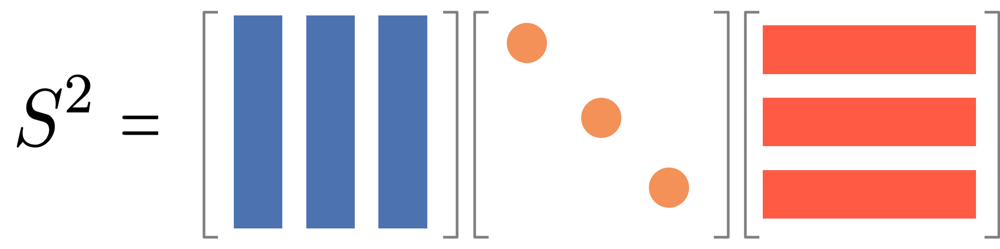
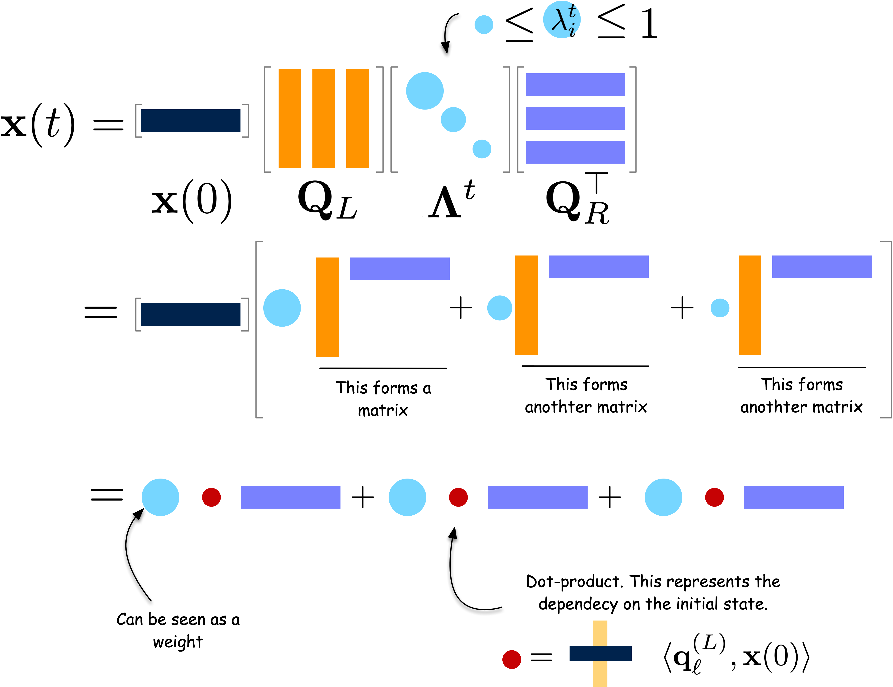

---
jupytext:
  formats: md:myst
  text_representation:
    extension: .md
    format_name: myst
kernelspec:
  display_name: Python 3
  language: python
  name: python3
---

# Ladder Lottery

```{admonition} Ladder Lottery
:class: tip

Ladder Lottery is a fun East Asian game, also known as "鬼腳圖" (Guijiaotu) in Chinese, "阿弥陀籤" (Amida-kuzi) in Japanese, "사다리타기" (Sadaritagi) in Korean, and "Ladder Lottery" in English. The game is played as follows:
1. A player is given a board with a set of vertical lines.
2. The player chooses a line and starts to move along the line
3. When hitting a horizontal line, the player must move along the horizontal line and then continue to move along the next vertical line.
4. The player wins if the player can hit a marked line at the bottom of the board.
5. You cannot see the horizontal lines in advance!

Play the {{ '[Ladder Lottery Game! 🎮✨]( BASE_URL/vis/amida-kuji.html?)'.replace('BASE_URL', base_url) }} and try to answer the following questions:

1. Is tehre a strategy to maximize the probability of winning?
2. How does the probability of winning change as the number of horizontal lines increases?


```# Pen and paper exercises

- [✍️ Pen and paper exercises](pen-and-paper/exercise.pdf)
---
jupytext:
  formats: md:myst
  text_representation:
    extension: .md
    format_name: myst
kernelspec:
  display_name: Python 3
  language: python
  name: python3
---

# Random Walks in Python

## Simulating Random Walks

We will simulate random walks on a simple graph of five nodes as follows.

```{code-cell} ipython3
import numpy as np
import igraph

g = igraph.Graph()

g.add_vertices([0, 1, 2, 3, 4])
g.add_edges([(0, 1), (0, 2), (0, 3), (1, 3), (2, 3), (2, 4), (3, 4)])
igraph.plot(g, vertex_size=20, vertex_label=g.vs["name"])
```

A random walk is characterized by the transition probabilities between nodes.

$$
P_{ij} = \frac{A_{ij}}{k_i}
$$

Let us first compute the transition probabilities and store them in a matrix, $\mathbf{P}$.

```{code-cell} ipython3

A = g.get_adjacency_sparse().toarray()
k = np.array(g.degree())
n_nodes = g.vcount()

# A simple but inefficient way to compute P
P = np.zeros((n_nodes, n_nodes))
for i in range(n_nodes):
    for j in range(n_nodes):
        if k[i] > 0:
            P[i, j] = A[i, j] / k[i]
        else:
            P[i, j] = 0

# Alternative, more efficient way to compute P
P = A / k[:, np.newaxis]

# or even more efficiently
P = np.einsum("ij,i->ij", A, 1 / k)
```

```{code-cell} ipython3
print("Transition probability matrix:\n", P)
```

```{code-cell} ipython3
import matplotlib.pyplot as plt
import seaborn as sns

sns.heatmap(P, annot=True, cmap="YlGnBu")
plt.show()
```

Each row and column of $\mathbf{P}$ corresponds to a node, with entries representing the transition probabilities from the row node to the column node.

Now, let us simulate a random walk on this graph. We represent a position of the walker by a vector, $\mathbf{x}$, with five elements, each of which represents a node. We mark the node that the walker is currently at by `1` and others as `0`.

```{code-cell} ipython3
x = np.array([0, 0, 0, 0, 0])
x[0] = 1
print("Initial position of the walker:\n", x)
```

This vector representation is convenient to get the probabilities of transitions to other nodes from the current node:

$$
\mathbf{x} \mathbf{P}
$$

which is translated into the following code:

```{code-cell} ipython3
probs = x @ P
print("Position of the walker after one step:\n", probs)
```

We can then draw the next node based on the probabilities

```{code-cell} ipython3

next_node = np.random.choice(n_nodes, p=probs)
x[:] = 0 # zero out the vector
x[next_node] = 1 # set the next node to 1
print("Position of the walker after one step:\n", x)
```

By repeating this process, we can simulate the random walk.

### Exercise 01

Write the following function to simulate the random walk for a given number of steps and return the $x$ for each step.

```{code-cell} ipython3
def random_walk(A, n_steps):
    """
    Simulate the random walk on a graph with adjacency matrix A.

    Args:
        A (np.ndarray): The adjacency matrix of the graph.
        x (np.ndarray): The initial position of the walker.
        n_steps (int): The number of steps to simulate.

    Returns:
        np.ndarray: The position of the walker after each step.
    """
    # Your code here
    pass
```

## Expected behavior of random walks

What is the expected position of the walker after multiple steps? It is easy to compute the expected position of the walker after one step from initial position $x(0)$:

$$
\mathbb{E}[x(1)] = x(0) P
$$

where $x(t)$ is the probability distribution of the walker at time $t$. In Python, the expected position of the walker at time $t=1$ is given by

```{code-cell} ipython3
x_0 = np.array([1, 0, 0, 0, 0])
x_1 = x_0 @ P
print("Expected position of the walker after one step:\n", x_1)
```

For the second step, the expected position of the walker is given by

$$
\mathbb{E}[x(2)] = \mathbb{E}[x(1) P] = \mathbb{E}[x(0) P] P = x(0) P^2
$$

In other words,

```{code-cell} ipython3
x_2 = x_1 @ P
print("Expected position of the walker after two steps:\n", x_2)
```

Following the same argument, the expected position of the walker at time $t$ is given by

$$
\mathbb{E}[x(t)] = x(0) P^t
$$

### Exercise 02

Write a function to compute the expected position of the walker at time $t$ using the above formula:

```{code-cell} ipython3
def expected_position(A, x_0, t):
    """
    Compute the expected position of the walker at time t.

    Args:
        A (np.ndarray): The adjacency matrix of the graph.
        x_0 (np.ndarray): The initial position of the walker.
        t (int): The number of steps to simulate.
    """
    # Your code here
    pass
```

### Exercise 03

Plot each element of $x(t)$ as a function of $t$ for $t=0,1,2,\ldots, 1000$. Try different initial positions and compare the results!

Steps:
1. Define the initial position of the walker.
2. Compute the expected position of the walker at time $t$ using the function you wrote above.
3. Draw a line for each element of $x(t)$, totalling 5 lines.
4. Create multiple such plots for different initial positions and compare them.

## Community structure

Random walks can capture community structure of a network.
To see this, let us consider a network of a ring of cliques.

```{code-cell} ipython3
import networkx as nx
import igraph
import numpy as np
import seaborn as sns
import matplotlib.pyplot as plt

n_cliques = 3
n_nodes_per_clique = 5

G = nx.ring_of_cliques(n_cliques, n_nodes_per_clique)
g = igraph.Graph().Adjacency(nx.to_numpy_array(G).tolist()).as_undirected()
membership = np.repeat(np.arange(n_cliques), n_nodes_per_clique)

color_map = [sns.color_palette()[i] for i in membership]
igraph.plot(g, vertex_size=20, vertex_color=color_map)
```

Let us compute the expected position of the walker after 1 to 10 steps.

**Compute the transition matrix**:

```{code-cell} ipython3
:tags: [hide-cell]
from scipy import sparse

# Get the adjacency matrix and degree
A = g.get_adjacency_sparse()
k = np.array(g.degree())

# This is an efficient way to compute the transition matrix
# using scipy.sparse
P = sparse.diags(1 / k) @ A
```

**Compute the expected position of the walker after 1 to 300 steps**:
```{code-cell} ipython3
:tags: [hide-cell]

x_t = np.zeros(g.vcount())
x_t[2] = 1
x_list = [x_t]
for t in range(300):
    x_t = x_t @ P
    x_list.append(x_t)
x_list = np.array(x_list)
```

**Plot the expected position of the walker at each step**:

```{code-cell} ipython3
:tags: [hide-input]

cmap = sns.color_palette("viridis", as_cmap=True)

sns.set_style('white')
sns.set(font_scale=1.2)
sns.set_style('ticks')

fig, axes = plt.subplots(figsize=(15,10), ncols = 3, nrows = 2)

t_list = [0, 1, 3, 5, 10, 299]
for i, t in enumerate(t_list):
    igraph.plot(g, vertex_size=20, vertex_color=[cmap(x_list[t][j] / np.max(x_list[t])) for j in range(g.vcount())], target = axes[i//3][i%3])
    axes[i//3][i%3].set_title(f"$t$ = {t}", fontsize = 25)
```

where the color of each node represents the probability of the walker being at that node.

An important observation is that the walker spends more time in the clique that it started from and then diffuse to others. Thus, the position of the walker before reaching the steady state tells us the community structure of the network.

## Exercise 04

1. Generate a network of 100 nodes with 4 communities using a stochastic block model, with inter-community edge probability $0.05$ and intra-community edge probability $0.2$. Then, compute the expected position of the walker starting from node zero after $x$ steps. Plot the results for $x = 0, 5, 10, 1000$.

2. Increase the inter-community edge probability to $0.15$ and repeat the simulation. Compare the results with the previous simulation.
---
jupytext:
  formats: md:myst
  text_representation:
    extension: .md
    format_name: myst
kernelspec:
  display_name: Python 3
  language: python
  name: python3
---


# Characteristics of Random Walks

## Stationary State

Let's dive into the math behind random walks in a way that's easy to understand.

Imagine you're at node $i$ at time $t$. You randomly move to a neighboring node $j$. The probability of this move, called the transition probability $p_{ij}$, is:

$$
p_{ij} = \frac{A_{ij}}{k_i},
$$

Here, $A_{ij}$ is an element of the adjacency matrix, and $k_i$ is the degree of node $i$. For a network with $N$ nodes, we can represent all transition probabilities in a transition probability matrix $P$:

$$
\mathbf{P} = \begin{pmatrix}
p_{11} & p_{12} & \cdots & p_{1N} \\
p_{21} & p_{22} & \cdots & p_{2N} \\
\vdots & \vdots & \ddots & \vdots \\
p_{N1} & p_{N2} & \cdots & p_{NN}
\end{pmatrix}
$$

This matrix $P$ encapsulates the entire random walk process. We can use it to calculate the probability of visiting each node after any number of steps. For instance:

- After one step: $P_{ij} = p_{ij}$
- After two steps: $\left(\mathbf{P}^{2}\right)_{ij} = \sum_{k} P_{ik} P_{kj}$
- After $T$ steps: $\left(\mathbf{P}^{T}\right)_{ij}$

```{note}
Let's explore why $\mathbf{P}^2$ represents the transition probabilities after two steps.

First, recall that $\mathbf{P}_{ij}$ is the probability of moving from node $i$ to node $j$ in one step. Now, consider a two-step walk from $i$ to $j$. We can express this as:

$$(\mathbf{P}^2)_{ij} = \sum_k \mathbf{P}_{ik} \mathbf{P}_{kj}$$

This equation encapsulates a key idea: to go from $i$ to $j$ in two steps, we must pass through some intermediate node $k$. Let's break this down step by step:

1. The probability of the first step ($i$ to $k$) is $\mathbf{P}_{ik}$.
2. The probability of the second step ($k$ to $j$) is $\mathbf{P}_{kj}$.
3. The probability of this specific path ($i$ → $k$ → $j$) is the product $\mathbf{P}_{ik} \mathbf{P}_{kj}$.
4. We sum over all possible intermediate nodes $k$ to get the total probability.

Likewise, for three steps, we have:

$$(\mathbf{P}^3)_{ij} = \sum_k \left( \mathbf{P}\right)^2_{ik} \mathbf{P}_{kj}$$

where:
1. The probability of going from $i$ to $k$ in two steps is $\left( \mathbf{P}\right)^2_{ik}$.
2. The probability of going from $k$ to $j$ in one step is $\mathbf{P}_{kj}$.
3. The probability of this specific path ($i$ →...→$k$ → $j$) is the product $\left( \mathbf{P}\right)^2_{ik} \mathbf{P}_{kj}$.
4. We sum over all possible intermediate nodes $k$ to get the total probability.

And we can extend this reasoning for any number of steps $t$.

In summary, for any number of steps $t$, $\left( \mathbf{P}^t \right)_{ij}$ gives the probability of being at node $j$ after $t$ steps, starting from node $i$.

```

As $T$ becomes very large, the probability distribution of being at each node, $\mathbf{x}(t)$, approaches a constant value:

$$
\mathbf{x}(t+1) =\mathbf{x}(t) \mathbf{P}
$$

This is an eigenvector equation. The solution, given by the Perron-Frobenius theorem, is called the stationary distribution:

$$
\mathbf{x}(\infty) = \mathbb{\pi}, \; \mathbf{\pi} = [\pi_1, \ldots, \pi_N]
$$

For undirected networks, this stationary distribution always exists and is proportional to the degree of each node:

$$
\pi_j = \frac{k_j}{\sum_{\ell} k_\ell} \propto k_j
$$

This means the probability of being at node $j$ in the long run is proportional to the degree of node $j$. The normalization ensures that the sum of all probabilities is 1, i.e., $\sum_{j=1}^N \pi_j = 1$.


## Experiment

Let us demonstrate the above math by using a small network using Python. Let us consider a small network of 5 nodes, which looks like this:

```{code-cell} ipython3
import igraph as ig
import numpy as np
edge_list = []
for i in range(5):
    for j in range(i+1, 5):
        edge_list.append((i, j))
        edge_list.append((i+5, j+5))
edge_list.append((0, 6))

g = ig.Graph(edge_list)
ig.plot(g, vertex_size=20, vertex_label=np.arange(g.vcount()))
```

The transition probability matrix $P$ is given by:

```{code-cell} ipython3
import scipy.sparse as sparse

A = g.get_adjacency_sparse()
deg = np.array(A.sum(axis=1)).flatten()
Dinv = sparse.diags(1/deg)
P = Dinv @ A
P.toarray()
```

Let us compute the stationary distribution by using the power method.

```{code-cell} ipython3
import matplotlib.pyplot as plt
import seaborn as sns

x = np.zeros(g.vcount())
x[1] = 1 # Start from node 1
T = 100
xt = []
for t in range(T):
    x = x.reshape(1, -1) @ P
    xt.append(x)

xt = np.vstack(xt) # Stack the results vertically

fig, ax = plt.subplots(figsize=(7,5))
palette = sns.color_palette().as_hex()
for i in range(g.vcount()):
    sns.lineplot(x=range(T), y=xt[:, i], label=f"Node {i}", ax=ax, color=palette[i])
ax.set_xlabel("Time")
ax.set_ylabel("Probability")
ax.set_title("Stationary distribution of a random walk")
ax.legend(bbox_to_anchor=(1.05, 1), loc='upper left')
plt.tight_layout()
plt.show()
```

We see that the distributions of the walker converges, and there are three characteristic features in the convergence:
1. The distribution of the walker occilates with a decying amplitude and eventually converges.
2. Nodes of the same degree converge to the same stationary probability.
3. Nodes with higher degree converge to the higher stationary probability.

To validate the last two observation, let us compare the stationary distribution of a random walker with the expected stationary distribution, which is proportional to the degree of the nodes.

```{code-cell} ipython3
import pandas as pd

n_edges = np.sum(deg) / 2
expected_stationary_dist = deg / (2 * n_edges)

pd.DataFrame({
    "Expected stationary distribution": expected_stationary_dist,
    "Stationary distribution of a random walk": xt[-1].flatten()
}).style.format("{:.4f}").set_caption("Comparison of Expected and Observed Stationary Distributions").background_gradient(cmap='cividis', axis = None)

```

## Time to reach the stationary state

Let's explore how quickly a random walker reaches its stationary state. The convergence speed is influenced by two main factors: edge density and community structure. In sparse networks, the walker needs more steps to explore the entire network. Additionally, the walker tends to remain within its starting community for some time.

The mixing time, denoted as $t_{\text{mix}}$, is defined as the minimum number of steps required for a random walk to get close to the stationary distribution, regardless of the starting point, with the maximum error less than $\epsilon$:

$$t_{\text{mix}} = \min\{t : \max_{{\bf x}(0)} \|{\bf x}(t) - {\bf \pi}\|_{1} \leq \epsilon\}$$

where $\|{\bf x}(t) - {\bf \pi}\|_{1} = 2\max_{i} |x_i(t) - \pi_i|$ represents the L1 distance between two probability distributions. The choice of $\epsilon$ is arbitrary.

We know that the distribution of a walker after $t$ steps is given by:

$$
\mathbf{x}(t) =  \mathbf{x}(0) \mathbf{P} ^{t}
$$

To find this distribution, we need to compute $\mathbf{P}^t$. However, we face a challenge: $\mathbf{P}$ is not diagonalizable.

A diagonalizable matrix $\mathbf{S}$ can be written as $\mathbf{S} = \mathbf{Q} \mathbf{\Lambda} \mathbf{Q}^{-1}$, where $\mathbf{\Lambda}$ is a diagonal matrix and $\mathbf{Q}$ is an orthogonal matrix. Visually, it looks like this:



It is useful because we can then compute the power of the matrix as follows:

$$
\mathbf{S}^t = \mathbf{Q} \mathbf{\Lambda}^t \mathbf{Q}^{-1}
$$

And it is easy to find ${\bf Q}$ and ${\bf \Lambda}$ by using eigenvalue decomposition if ${\bf S}$ is symmetric and consists only of real values. Namely, the eigenvectors form ${\cal Q}$ and the eigenvalues form the diagonal matrix ${\cal \Lambda}$.

```{note}
Let us demonstrate the above relation by calculating $\mathbf{S}^2$.
$$
\begin{align}
\mathbf{S}^2 &= \mathbf{Q} \mathbf{\Lambda} \mathbf{Q}^{-1} \mathbf{Q} \mathbf{\Lambda} \mathbf{Q}^{-1} \\
&= \mathbf{Q} \mathbf{\Lambda}^2 \mathbf{Q}^{-1}.
\end{align}
$$
(Note that $\mathbf{Q} \mathbf{Q}^{-1} = {\bf I}$.)


```


$\mathbf{P}$ is also diagonalizable but not symmetric like $\mathbf{\overline A}$ so that we cannot use the above relation directly. So we do a trick by rewriteing $\mathbf{P}$ as:

$$
\mathbf{P} = \mathbf{D}^{-1} \mathbf{A} = \mathbf{D}^{-\frac{1}{2}} \overline {\bf A} \mathbf{D}^{\frac{1}{2}}
$$

where $\overline{\bf A} = \mathbf{D}^{-\frac{1}{2}} \mathbf{A} \mathbf{D}^{-\frac{1}{2}}$ is the normalized adjacency matrix.

The advantage is that $\overline{\bf A}$ is diagonalizable: $\overline{\bf A} = \mathbf{Q} \mathbf{\Lambda} \mathbf{Q}^\top$. Using this, we can compute $\mathbf{P}^t$:

$$
\mathbf{P}^t = \mathbf{D}^{-\frac{1}{2}} \mathbf{Q} \mathbf{\Lambda}^t \mathbf{Q}^\top \mathbf{D}^{\frac{1}{2}} = \mathbf{Q}_L \mathbf{\Lambda}^t \mathbf{Q}_R ^\top
$$

where $\mathbf{Q}_L = \mathbf{D}^{-\frac{1}{2}} \mathbf{Q}$ and $\mathbf{Q}_R = \mathbf{D}^{\frac{1}{2}} \mathbf{Q}$.


```{note}
Let us demonstrate the above relation by calculating $\mathbf{P}^2$.

$$
\begin{align}
\mathbf{P}^2 &= \mathbf{D}^{-\frac{1}{2}} \overline{\bf A} \mathbf{D}^{\frac{1}{2}} \mathbf{D}^{-\frac{1}{2}} \overline{\bf A} \mathbf{D}^{\frac{1}{2}}\\
&=  \mathbf{D}^{-\frac{1}{2}} \overline{\bf A} ^2 \mathbf{D}^{\frac{1}{2}}\\
&= \mathbf{Q}_L \mathbf{\Lambda}^2 \mathbf{Q}_R ^\top
\end{align}
```

The probability distribution after $t$ steps is then:

$$
\mathbf{x}(t) = \mathbf{x}(0) \mathbf{Q}_L \mathbf{\Lambda}^t \mathbf{Q}_R ^\top
$$

We can rewrite this in a more intuitive form:

$$
\begin{pmatrix}
x_1(t) \\
x_2(t) \\
\vdots \\
x_N(t)
\end{pmatrix}
 =
 \sum_{\ell=1}^N
 \left[
 \lambda_\ell^t
 \begin{pmatrix}
 q^{(L)}_{\ell 1} \\
 q^{(L)}_{\ell 2} \\
 \vdots \\
 q^{(L)}_{\ell N}
 \end{pmatrix}
 \langle\mathbf{q}^{(R)}_{\ell},  \mathbf{x}(0) \rangle
 \right]
$$

```{note}
Visualize the above equation by using the following figure.



```

The term $\lambda_\ell^t$ represents the contribution of each eigenvalue to the stationary distribution over time. As $t$ increases, all terms decay exponentially except for the largest eigenvalue ($\lambda_1 = 1$). This explains how the random walk converges to the stationary distribution:

$$
\pi_i = \lim_{t\to\infty} x_i(t) = \begin{pmatrix} q^{(L)}_{1 1} \\ q^{(L)}_{1 2} \\ \vdots \\ q^{(L)}_{1 N} \end{pmatrix} \langle\mathbf{q}^{(R)}_{1},  \mathbf{x}(0) \rangle
$$

The second largest eigenvalue primarily determines the convergence speed to the stationary distribution. A larger second eigenvalue leads to slower convergence. Thus, the mixing time is closely related to the second largest eigenvalue.

Levin-Peres-Wilmer theorem states that the mixing time is bounded by the relaxation time as

$$
t_{\text{mix}} < \tau \log \left( \frac{1}{\epsilon \min_{i} \pi_i} \right), \quad \tau = \frac{1}{\lambda_2}
$$

where $\lambda_2$ is the second largest eigenvalue of the normalized adjacency matrix. The mixing time is known to be bounded by the relaxation time as

More commonly, it is expressed using the second smallest eigenvalue $\mu$ of the normalized laplacian matrix as

$$
t_{\text{mix}} \leq \frac{1}{1-\mu}
$$

where $\mu = 1-\lambda_2$.


### Compute the mixing time

Let us demonstrate the above math by using the network of two cliques.

### Normalized Adjacency Matrix

First, let us construct the normalized adjacency matrix $\overline{\bf A}$ of the network.

```{code-cell} ipython3
Dinv_sqrt = sparse.diags(1.0/np.sqrt(deg))
A_norm = Dinv_sqrt @ A @ Dinv_sqrt
```

Next, let us compute the eigenvalues and eigenvectors of the normalized adjacency matrix.

```{code-cell} ipython3
evals, evecs = np.linalg.eigh(A_norm.toarray())
```

```{note}
`evals` and `evecs` are sorted in descending order of the eigenvalues. `evecs[:, 0]` is the eigenvector corresponding to the largest eigenvalue, which is always 1.
```

```{warning}
There is a similar function called `np.linalg.eig` which returns the eigenvalues and eigenvectors. It can be used for any matrices, while `np.linalg.eigh` is specifically for symmetric matrices. `np.linalg.eigh` is faster and more stable and therefore preferred if your matrix is symmetric. `np.linalg.eig` is more susceptible to numerical errors and therefore less stable.
```

The eigenvalues and eigenvectors are shown below.
```{code-cell} ipython3
pd.DataFrame({
    "Eigenvalue": evals
}).T.style.background_gradient(cmap='cividis', axis = 1).set_caption("Eigenvalues of the normalized adjacency matrix")
```

```{code-cell} ipython3
pd.DataFrame({
    "Eigenvector %i" % i: evecs[:, i]
    for i in range(10)
}).style.background_gradient(cmap='cividis', axis = None).set_caption("Eigenvectors of the normalized adjacency matrix")
```

Notice that the largest eigenvalue is 1, which is always true for a normalized adjacency matrix.
The largest eigenvector (the leftmost one) is associated with the stationary distribution of the random walk.

```{note}
The sign of the eigenvector is indeterminate, which means we can choose the sign of the eigenvector arbitrarily. In fact, `np.linalg.eigh` returns the eigenvector whose sign can vary for a different run.
```

We decompose $\overline{\bf A}$ as

$$\overline {\bf A} = {\bf Q}{\bf \Lambda}{\bf Q}^\top$$

where ${\bf Q}$ corresponds to `eigvecs` and ${\bf \Lambda}$ corresponds to `np.diag(evals)` (since ${\bf \Lambda}$ is a diagonal matrix). Let's see if this is correct:

```{code-cell} ipython3
pd.DataFrame(A_norm.toarray()).style.background_gradient(cmap='cividis', axis = None).set_caption("Normalized Adjacency Matrix")
```

```{code-cell} ipython3
A_norm_reconstructed = evecs @ np.diag(evals) @ evecs.T
pd.DataFrame(A_norm_reconstructed).style.background_gradient(cmap='cividis', axis = None).set_caption("Reconstruction of the Normalized Adjacency Matrix")
```

Notice that the reconstruction is not perfect due to the numerical error, although overall the structure is correct.

### Multi-step Transition Probability

Let us first conform whether we can compute the transition probability after $t$ steps by using the eigenvalues and eigenvectors.

```{code-cell} ipython3
t = 5
x_0 = np.zeros(g.vcount())
x_0[0] = 1

# Compute x_t by using the eigenvalues and eigenvectors
Q_L = np.diag(1.0/np.sqrt(deg)) @ evecs
Q_R = np.diag(np.sqrt(deg)) @ evecs
x_t = x_0 @ Q_L @ np.diag(evals**t) @ Q_R.T

# Compute x_t by using the power iteration
x_t_power = x_0.copy()
for i in range(t):
    x_t_power = x_t_power @ P

pd.DataFrame({
    "Eigenvector": x_t.flatten(),
    "Power iteration": x_t_power.flatten()
}).style.background_gradient(cmap='cividis', axis = None).set_caption("Comparison of Eigenvector and Power Iteration")
```

### Relaxation Time and Mixing Time

Let us measure the relaxation time of the random walk.

```{code-cell} ipython3
evals, evecs = np.linalg.eigh(A_norm.toarray())
lambda_2 = -np.sort(-evals)[1]
tau = 1 / lambda_2
print(f"The relaxation time of the random walk is {tau:.4f}.")
```---
jupytext:
  formats: md:myst
  text_representation:
    extension: .md
    format_name: myst
kernelspec:
  display_name: Python 3
  language: python
  name: python3
---

# Random Walks

Suppose you walk in a city. You are drunk and your feet have no idea where to go. You just take a step wherever your feet take you. At every intersection, you make a random decision and take a step. This is the core idea of a random walk.

While your feet are taking you to a random street, after making many steps and looking back, you will realize that you have been to certain places more frequently than others. If you were to map the frequency of your visits to each street, you will end up with a distribution that tells you about salient structure of the street network. It is surprising that this seemingly random, brainless behavior can tell us something deep about the structure of the city.


## Random walks in a network

A random walk in undirected networks is the following process:
1. Start at a node $i$
2. Randomly choose an edge to traverse to a neighbor node $j$
3. Repeat step 2 until you have taken $T$ steps.


```{figure-md} random-walk-example


Random walk on a small network. The figure is taken from Li, Xing et al. “Representation Learning of Reconstructed Graphs Using Random Walk Graph Convolutional Network.” ArXiv abs/2101.00417 (2021).

```


```{note}
In case of directed networks, a random walker can only move along the edge direction, and it can be that the random walker is stuck in a so-called ``dead end'' that does not have any outgoing edges.
```

How does this simple process tell us something about the network structure? To get some insights, let us play with a simple interactive visualization.

```{admonition} Random Walk Simulation
:class: tip

Play with the {{ '[Random Walk Simulator! 🎮✨]( BASE_URL/vis/random-walks/index.html?)'.replace('BASE_URL', base_url) }} and try to answer the following questions:

1. When the random walker makes many steps, where does it tend to visit most frequently?
2. When the walker makes only a few steps, where does it tend to visit?
3. Does the behavior of the walker inform us about centrality of the nodes?
3. Does the behavior of the walker inform us about communities in the network?

```
---
jupytext:
  formats: md:myst
  text_representation:
    extension: .md
    format_name: myst
kernelspec:
  display_name: Python 3
  language: python
  name: python3
---

# Random walks unify centrality and communities

## Modularity: Interpretation from random walk perspective

Modularity can be intepreted as a random walk perspective. Modularity is given by

$$
Q = \frac{1}{2m} \sum_{ij} \left( A_{ij} - \frac{d_i d_j}{2m} \right) \delta(c_i, c_j)
$$

where $m$ is the number of edges in the network, $A_{ij}$ is the adjacency matrix, $d_i$ is the degree of node $i$, $c_i$ is the community of node $i$, and $\delta(c_i, c_j)$ is the Kronecker delta function (which is 1 if $c_i = c_j$ and 0 otherwise).

We can rewrite the modularity using the language of random walks as follows.

$$
\begin{aligned}
Q &= \sum_{ij} \left(\frac{A_{ij}}{2m}  - \frac{d_i}{2m} \frac{d_j}{2m} \right) \delta(c_i, c_j) \\
&= \sum_{ij} \left(\pi_i P_{ij}  - \pi_i \pi_j \right) \delta(c_i, c_j)
\end{aligned}
$$
where $\pi_i$ is the stationary distribution of the random walk given by

$$
\pi_i = \frac{d_i}{2m}
$$

and $P_{ij}$ is the transition probability between nodes $i$ and $j$.

```{note}
Let's break down this derivation step by step:

1. We start with the original modularity formula:

   $$Q = \frac{1}{2m} \sum_{ij} \left( A_{ij} - \frac{d_i d_j}{2m} \right) \delta(c_i, c_j)$$

2. First, we move the constant $1/(2m)$ to the inside of the parentheses:

   $$Q = \sum_{ij} \left(\frac{A_{ij}}{2m} - \frac{d_i d_j}{2m^2} \right) \delta(c_i, c_j)$$

3. Now, we recognize that $\frac{A_{ij}}{2m}$ can be rewritten as:

   $$\frac{A_{ij}}{2m} = \frac{d_i}{2m} \cdot \frac{A_{ij}}{d_i} = \pi_i P_{ij}$$

4. We also recognize that $\frac{d_i}{2m}$ is the stationary distribution of the random walk, which we denote as $\pi_i$:

   $$\frac{d_i}{2m} = \pi_i$$

5. Substituting these into our equation:

   $$Q = \sum_{ij} \left(\pi_i P_{ij} - \pi_i \pi_j \right) \delta(c_i, c_j)$$

```

The expression suggests that:

1. The first term, $\pi_i P_{ij} \delta(c_i, c_j)$, represents the probability that a walker is at node $i$ and moves to node $j$ within the same community **by one step**.
2. The second term, $\pi_i \pi_j$, represents the probability that a walker is at node $i$ and moves to another node $j$ within the same community **after long steps**.

In summary, modularity compares short-term and long-term random walk probabilities. High modularity indicates that a random walker is more likely to stay within the same community after one step than after many steps.

```{note}
Building on this perspective from random walks, Delvenne et al. {footcite}`delvenne2010stability` extends the modularity by comparing multi-step and long-step transition probabilities of a random walk. This approach, known as "Markov stability", shows that the number of steps acts as a "resolution parameter" that determines the scale of detectable communities.
```


## PageRank: Interpretation from random walk perspective

PageRank can be interpreted from a random walk perspective:

$$
c_i = (1-\beta) \sum_j P_{ji} c_j + \beta \cdot \frac{1}{N}
$$

Where:
- $c_i$ is the PageRank of node $i$
- $P_{ji}$ is the transition probability from node $j$ to node $i$
- $\beta$ is the teleportation probability
- $N$ is the total number of nodes

This equation represents a random walk where:
1. With probability $(1-\beta)$, the walker follows a link to the next node.
2. With probability $\beta$, the walker *teleports* to a random node in the network.

The PageRank $c_i$ is the stationary distribution of this random walk, representing the long-term probability of finding the walker at node $i$.

```{note}
This sounds odd at first glance. But it makes sense when you think about what PageRank was invented for, i.e., Web search. It characterizes a web surfer as a random walker that chooses the next page by randomly jumping to a random page with probability $\beta$ or by following a link to a page with probability $1-\beta$. The web page with the largest PageRank means that the page is most likely to be visited by this random web surfer.
```

```{footbibliography}

```# Module 7: Random Walks

## What to learn in this module

In this module, we will learn random walks, one of the most fundamental techniques in network analysis. We will learn:
- What is a random walk?
- How to simulate a random walk on a network?
- What is the behavior of a random walk on a network?
- Implicit connections to community detection and network centralities
- **Keywords**: random walk, community detection, network centralities