<!-- _class: mid -->

## Before we start

- Microphone on
- Zoom room open
- Recording started
- Sound volume up

---

<!-- _class: lead -->

Advanced Topics in Network Science · Session 01

# Networks

A flu, a bank and the login program on your server fail in the same way, and that is not a coincidence

Sadamori Kojaku · Binghamton University

<!--
Open on the outbreak, not on definitions. The whole first part is one story.
-->

---

## Roadmap

01

An outbreak and a map

02

The same story, everywhere

03

What makes a network a network

04

How this course works

---

<!-- _class: lead -->

Binghamton University

# EngiNet™

State University of New York

---

<!-- _class: mid -->

## Course materials: all rights reserved

No part of the course materials used in the instruction of this course may be reproduced
in any form or by any electronic or mechanical means, including the use of information
storage and retrieval systems, without written approval from the copyright owner.

© Binghamton University, State University of New York

---

<!-- _class: mid -->

## EngiNet: who to contact

- EngiNet office: Janice Kinzer, enginet@binghamton.edu
- EngiNet by phone: 1-800-478-0718, or 607-777-4965
- Media production: Rafia Rahman
- Instructor: Sadamori Kojaku, skojaku@binghamton.edu, 607-777-5039

---

<!-- _class: mid -->

## Course overview

- Instructor: Sadamori Kojaku
- Email: skojaku@binghamton.edu
- Office hours: Friday 10:00–14:00
- Course site: <a href="https://skojaku.github.io/adv-net-sci">skojaku.github.io/adv-net-sci</a>

---

<!-- _class: part -->

  
Part 1: An outbreak and a map

  
01 / 04

## April 2009: a new flu leaves Mexico

Nobody has immunity, and every border is a guess about where it goes next.

---

<!-- _class: mid -->

## Where does it surface first?

The 2009 H1N1 pandemic starts in Mexico. Name the first country outside Mexico with a confirmed case, and the second one.

* Neighbours first, then outward in rings?
* The largest countries first?
* Something else?
* *Turn to your neighbour. Thirty seconds.*

---

<!-- _class: mid -->

## First the United States. Then Spain.

Spain is nine thousand kilometres from Mexico City. Guatemala shares a border with Mexico, and was reached later.

---

## Kilometres are the wrong ruler

Ask instead: how many people fly this route in a day?

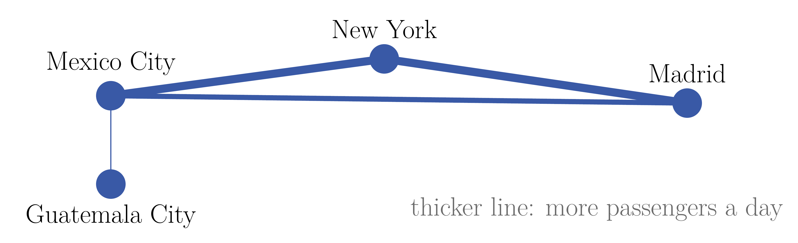
<figcaption>Guatemala City is next door and hard to reach; Madrid is far away and one flight away.</figcaption>

---

## The ruler that works

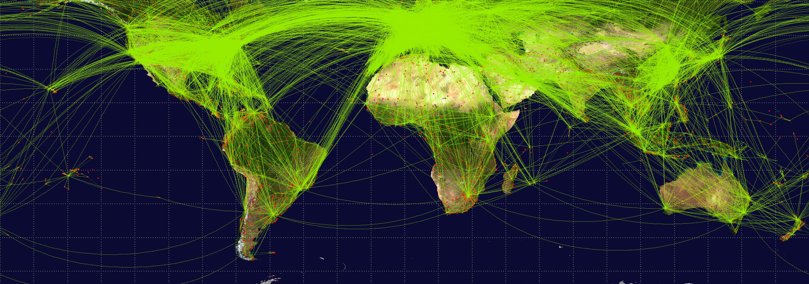
<figcaption>Every scheduled airline route on Earth. Measure the distance along these lines and the 2009 arrival times line up (Brockmann and Helbing, Science, 2013).</figcaption>

---

<!-- _class: part -->

  
Part 2: The same story, everywhere

  
02 / 04

## Epidemics are not a special case

The same question, who is connected to whom, decides outcomes in systems that share nothing else.

---

## 15 September 2008

Lehman Brothers files for bankruptcy. One firm, out of thousands.

* Within days, banks stop lending to each other worldwide.
* Why should one failure do that?
* *Thirty seconds with your neighbour.*

---

## Banks are a network

Each dot is a bank; each line is money one bank owes another, often due tomorrow morning.

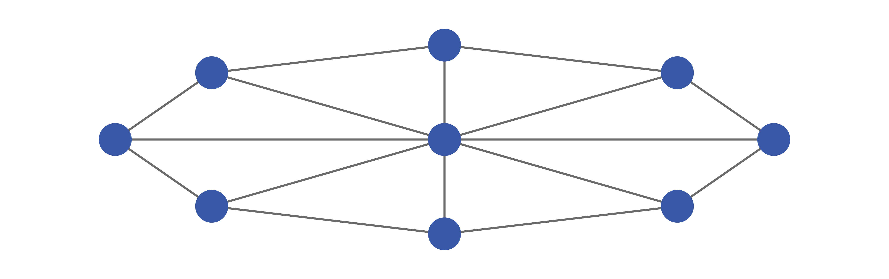
<figcaption>A bank is only as solvent as the promises pointing into it, and it cannot see past its own neighbours.</figcaption>

---

## One default, eight lenders short

Everyone who lent to the failed bank is now missing money, and may fail in turn: **cascading default**.

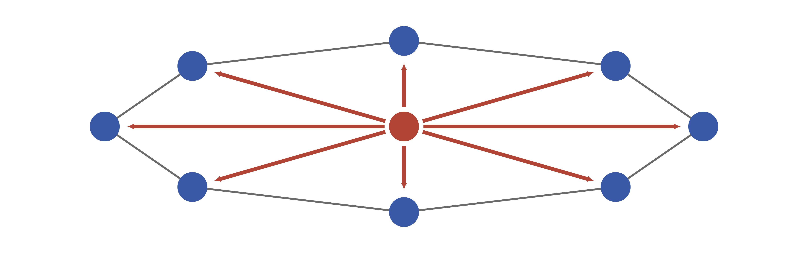
<figcaption>Red is the default and the losses leaving it. The damage travels the same links the money did.</figcaption>

---

<!-- _class: mid -->

## 29 March 2024

A hobby project compresses files. It is maintained by one person, unpaid, for years.

* How does a backdoor in that project reach the login program of nearly every Linux server on Earth?
* *Take thirty seconds.*

---

## What a compression library touches

xz compresses files. Nothing about it is security-critical until you follow what links against it.

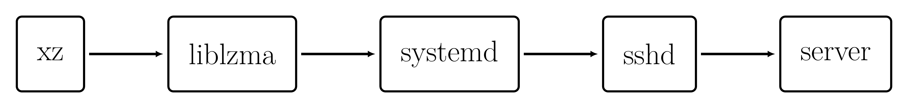
<figcaption>Each arrow reads "is built into". Four steps separate a compression library from the program that authenticates every remote login.</figcaption>

---

## Two years, one volunteer

Whoever maintains the first box in that chain controls everything downstream of it.

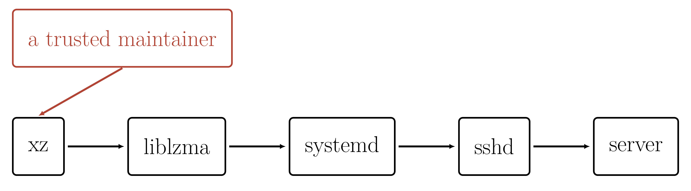
<figcaption>A new contributor helped for about two years, became a maintainer, and shipped hidden code in version 5.6.0 that reached sshd on Fedora and Debian test builds.</figcaption>

---

## It was caught by half a second

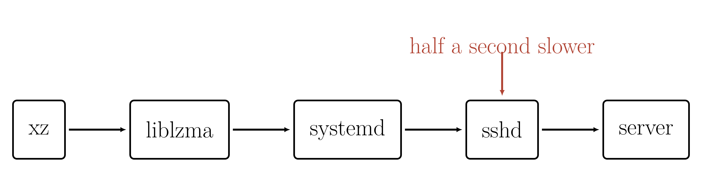
<figcaption>Andres Freund noticed logins to a test machine had slowed, went looking, and found the backdoor before it reached a stable release. Nobody had audited the trust; a stopwatch caught it.</figcaption>

<a href="https://www.youtube.com/watch?v=aoag03mSuXQ">How the xz backdoor worked (video)</a>

---

## Same shape, three worlds

Different material, one question: **who is connected to whom?**

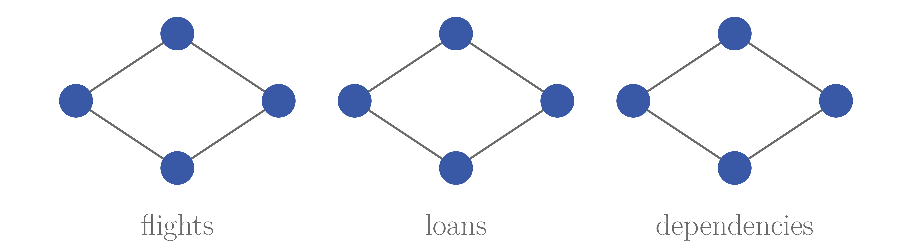
<figcaption>A virus travels the first, a loss the second, a backdoor the third. The reasoning that works on one works on the others.</figcaption>

---

<!-- _class: mid -->

## Your turn: name a network

* Write down three networks you are part of right this minute.
* For each one, write one way it could fail.
* *One minute, on paper.*

---

<!-- _class: mid -->

## Let's collect a few

* Which of your failures stay local?
* Which one spreads to everybody?
* *What made the difference?*

---

## Ones that are easy to miss

Remove one insect and the plants only it visits go with it.

Which plant here is safest? Which is one extinction away from trouble?

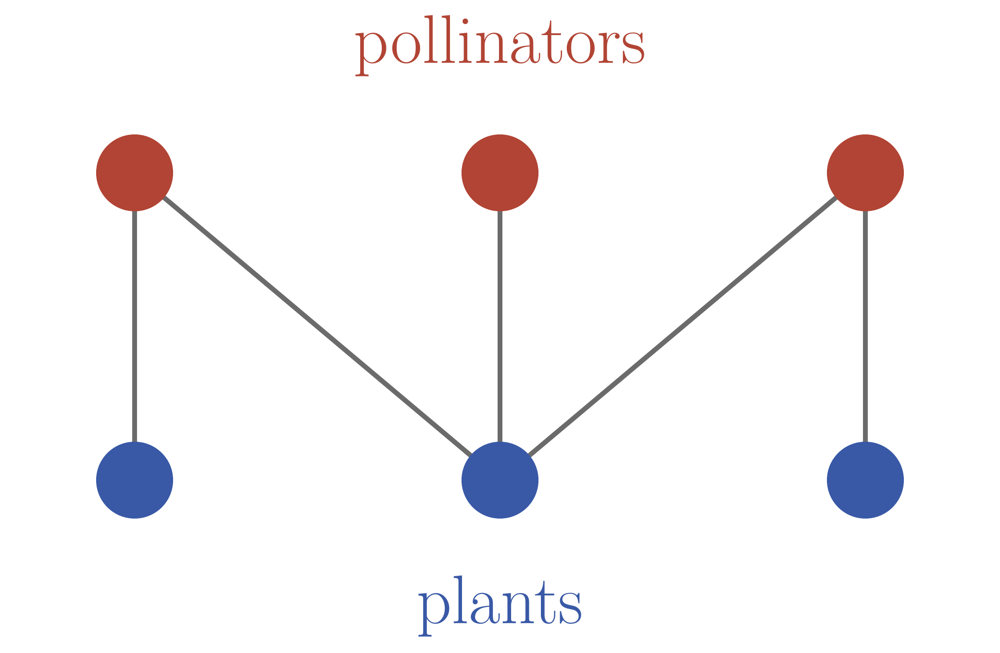
<figcaption>A line means that insect visits that plant.</figcaption>

---

## The network you are using right now

Eighty-six billion neurons. What you are following this sentence with is the wiring between them.

<figcaption>Long-distance fibre tracts of one human brain, reconstructed from diffusion MRI.</figcaption>

---

<!-- _class: part -->

  
Part 3: What makes a network a network

  
03 / 04

## Dots and lines are three centuries old

So what is new, and why does it need its own field?

---

## Isn't this just graph theory?

* Mathematicians have studied dots and lines since Euler.
* Their favourite objects are regular: every node alike, every neighbourhood alike.
* *So what is left for us to do?*

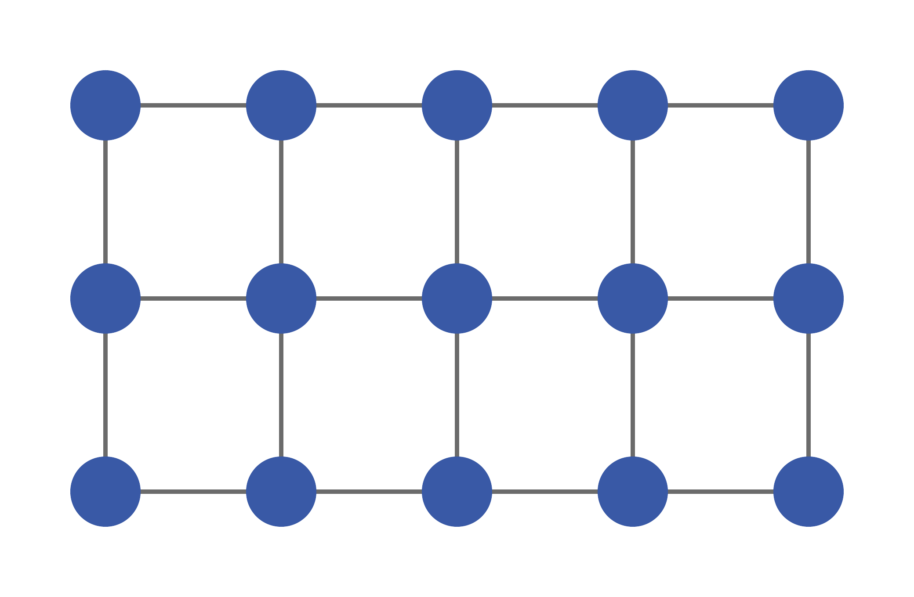
<figcaption>Every node here has the same neighbourhood, so one proof covers all of them.</figcaption>

---

## Real networks are not like that

A handful of nodes carry an enormous share of the links. Most carry very few.

No two neighbourhoods look alike, so one proof no longer covers all of them.

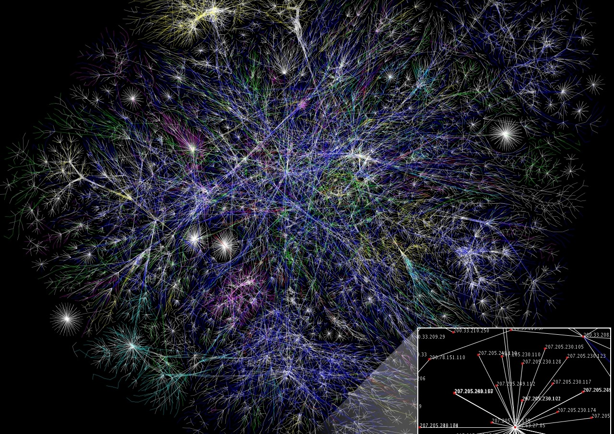
<figcaption>Routed paths across the Internet, drawn by the Opte Project.</figcaption>

---

## For 2500 years, the same move

Water, number, atoms, method: four attempts to reduce the world to something simpler.

<figcaption>Two millennia apart, one shared instinct: cut the world into its simplest parts.</figcaption>

---

## The reductionist bet

* Break the system into parts.
* Understand each part.
* Reassemble, and you understand the whole.

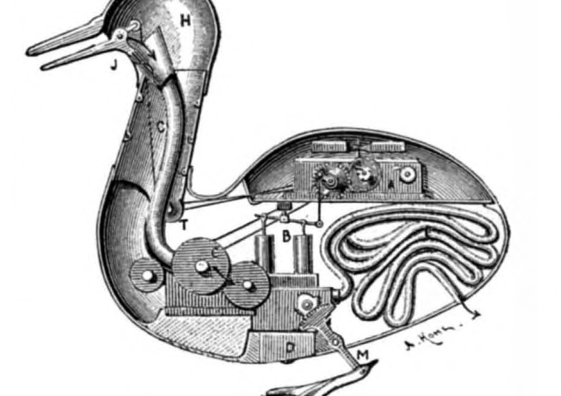
<figcaption>Inside Vaucanson's duck, 1739: an automaton built to prove that digestion is clockwork.</figcaption>

---

## A thought experiment

* You are an alien scientist studying humans.
* You know every neuron and every synapse, exactly.
* *Can you say what this person will dream tonight?*

<figcaption>John von Neumann, who was fond of this kind of question.</figcaption>

---

## Knowing the parts is not knowing the system

* Every neuron, but not the dream.
* Every person, but not the protest.
* Parts never act alone; they act on each other.
* **The relationships are the object of study.**

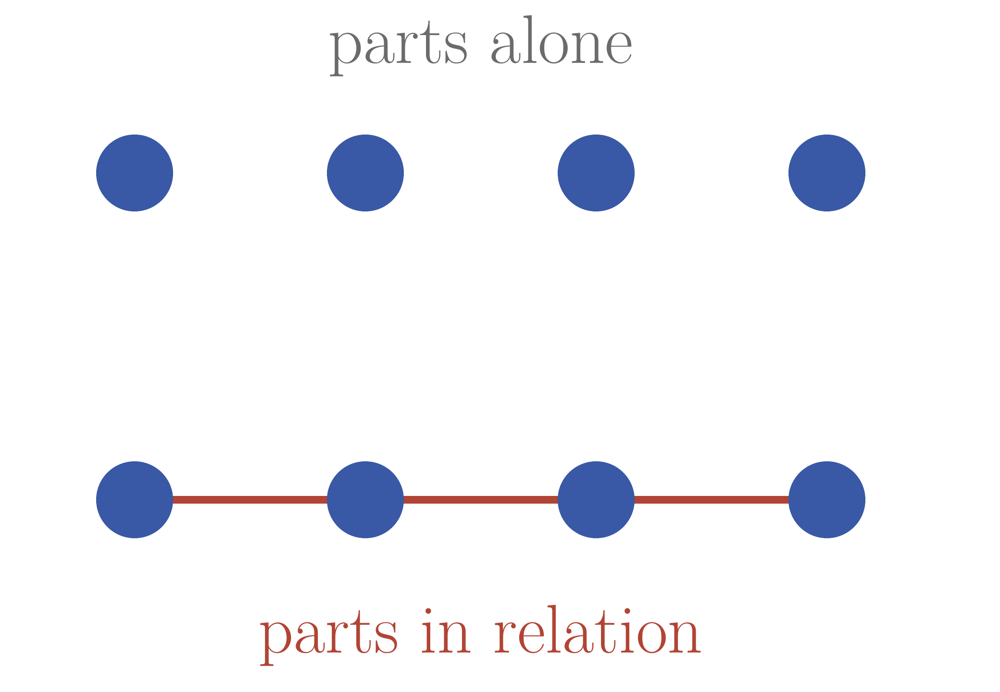
<figcaption>Same four parts in both rows. Only the lower row can carry anything between them.</figcaption>

---

## Who studied relationships first?

In 1736 Euler was handed a puzzle about a walk through a city, and answered it by throwing the city away, keeping only what was connected to what.

<figcaption>Leonhard Euler, 1707–1783.</figcaption>

---

## Seven bridges, one walk

Königsberg had four landmasses joined by seven bridges.

* Can you cross every bridge exactly once?
* *Two minutes, on paper.*

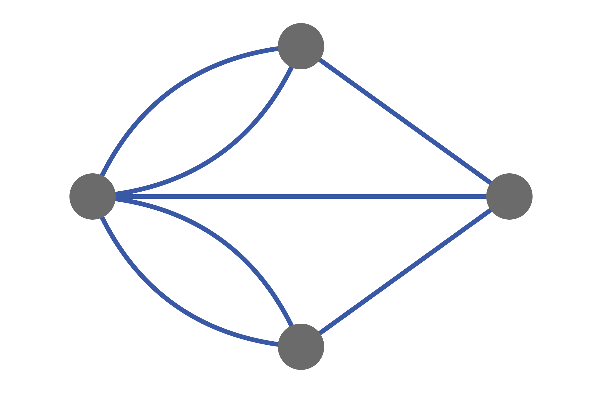
<figcaption>Four landmasses, seven bridges, and nothing else about the city.</figcaption>

---

<!-- _class: part -->

  
Part 4: How this course works

  
04 / 04

## The rest of this hour is logistics

How the course is built, and why it is built that way.

---

<!-- _class: mid -->

## What you will be able to do

* Analyse real networks at real size.
* Use the concepts the field is built on.
* Apply AI tools to network problems, and check their answers.
* Read a network science paper, and design your own study.

---

## Learning is training

* Nobody gets stronger by watching someone else lift.
* You get stronger by lifting, badly at first.
* Class is the gym: paper, pair programming, code that runs.
* **Train until you can feel a concept**, not just define it.

<figcaption>The part that builds strength is the part that is hard.</figcaption>

---

<!-- _class: mid -->

## Every module opens on paper

* You solve it alone first.
* Then you compare with the person beside you.
* Bring a pen.

<figcaption>No laptop for the first fifteen minutes: the mistake has to be yours before the fix means anything.</figcaption>

---

<!-- _class: mid -->

## Play it before you learn it

* Most modules ship an interactive game.
* Winning it needs the concept you have not been taught yet.
* You learn the concept by learning to win.

<a href="https://skojaku.github.io/adv-net-sci/assets/vis/vaccination-game.html">Open the vaccination game</a>

---

<!-- _class: mid -->

## Weekly quiz

* Every class opens with a short written quiz on last week.
* A few questions, graded and reviewed during class.
* One resubmission allowed.
* Online students submit through Brightspace.

---

<!-- _class: mid -->

## Assignments

* Most modules have a coding assignment.
* Handed out through GitHub Classroom.
* Autograded, unlimited attempts until the deadline.

---

<!-- _class: mid -->

## Student Lecture

* I publish a list of topics; you pick the one you like.
* You build a 15 to 20 minute lecture on it.
* **An interactive part is required**: a worksheet, an exercise the room does, live coding.
* A slide presentation on its own does not count.

---

## Where the grade comes from

One square is one percent.

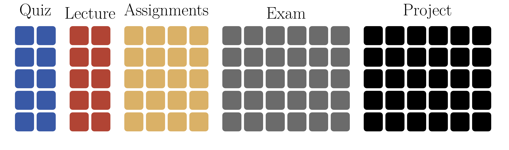
<figcaption>There are no bonus points this year: the hundred squares on this slide are the whole grade.</figcaption>

---

<!-- _class: mid -->

## Exam

* One final exam covering all topics.
* Multiple choice, take-home.
* Submitted through Brightspace.
* Exam week: **TBD**.

---

<!-- _class: mid -->

## Final project

* Individual, thirty percent of the grade.
* Anything in network science: a new method, a visualization, a case study, a literature review.
* Proposal **TBD** · paper **TBD** · presentations **TBD**.

---

<!-- _class: mid -->

## Three projects from previous years

* A map of research topics: which fields cite each other, and which papers sit on the bridge between two of them.
* Brain recordings as a network: electrodes are the nodes, and a link means two signals rise and fall together.
* The Tesla supercharger network: chargers are the nodes, drivable hops the links, and the question was where one more charger helps most.

---

<!-- _class: mid -->

## Where everything lives

- Lecture notes: <a href="https://skojaku.github.io/adv-net-sci">skojaku.github.io/adv-net-sci</a>
- Everything else: <a href="https://github.com/skojaku/adv-net-sci/">github.com/skojaku/adv-net-sci</a>

---

<!-- _class: mid -->

## Attendance

- Attendance is taken every class.
- Residential students: on paper, in the room.
- Online students: the assignment submission in each module counts as your attendance.

---

<!-- _class: mid -->

## Policy

- Three credits means 6.5 or more hours of work a week outside class.
- AI tools are allowed for learning; cite them when you use them in an assignment.
- Back up your code; a lost laptop is not an extension.
- Accommodations are available; academic dishonesty is not.

---

<!-- _class: mid -->

## Before you go

Earlier you each wrote down three networks you belong to.

* Which of them would you want to study for the project?
* What would you have to measure before you could say anything about it?
* *Bring one answer to the next class.*

---

<!-- _class: lead -->

# Questions?

Next time: Euler, seven bridges, and the first proof about a network

