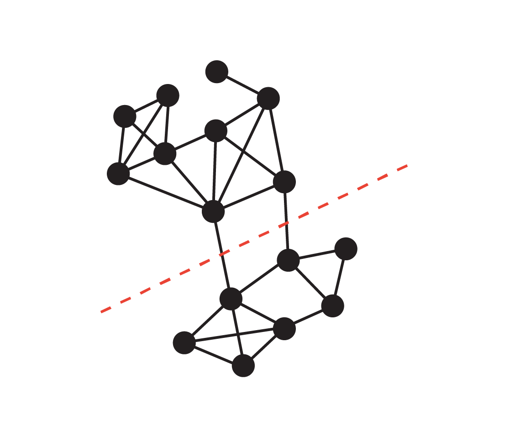
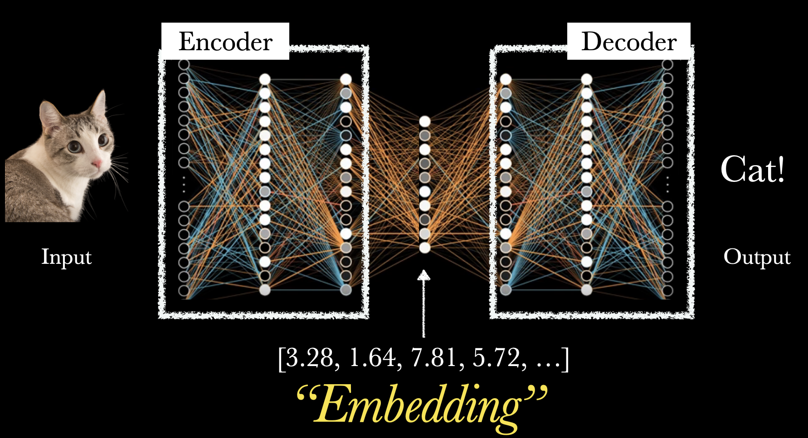
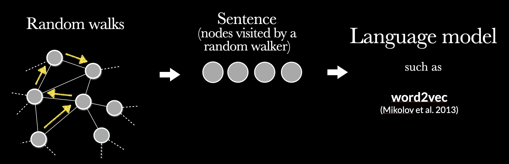
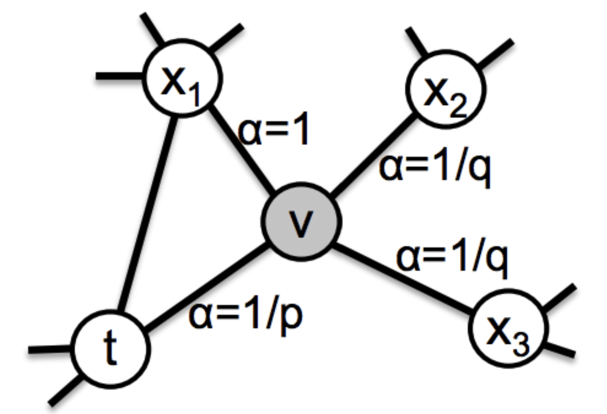

Introduction
===

Check list
- [ ] Microphone turned on
- [ ] Zoom room open
- [ ] Recording on
- [ ] Mouse cursor visible
- [ ] Sound Volume on

<!-- end_slide -->

# Advanced Topics in Network Science

Lecture 08: Network Embedding
Sadamori Kojaku


<!-- end_slide -->

# Network Embedding 🌐

- **Task**: Embed a network into a low-dimensional vector space
  1. Embedding can recover the network with high accuracy
  2. Embedding should be low-dimensional
- **Question**: How would you do that? What approache would be viable?


<!-- end_slide -->

# Pen and Paper ✍️

[Link](https://tinyurl.com/3ckp36n5)


<!-- end_slide -->

## Idea 1: Network reconstruction

Compress adjacency matrix A into low-dim representation `U` that minimizes **the reconstruction error**:

```latex +render
\[ \min \frac{1}{2}||\mathbf{A} - \lambda \mathbf{U}\mathbf{U}^\top||_F^2 \]
```

where

```latex +render
\[
U = \begin{bmatrix}
| & | & & | \\
\mathbf{u}_1 & \mathbf{u}_2 & \cdots & \mathbf{u}_d \\
| & | & & |
\end{bmatrix} \in \mathbb{R}^{n \times d}, \quad
\mathbf{u}^\top_i \mathbf{u}_j = 0 \quad \forall i \neq j, \text{and} \quad \sum_i u_i^2 = 1
\]
```

**Q**: Try solving this for the 1d case (only u_1)

<!-- end_slide -->

Proof sketch
===

```latex +render
\[
  \frac{1}{2}||\mathbf{A} - \lambda \mathbf{U}\mathbf{U}^\top||_F^2 = \frac{1}{2}\sum_{i=1}^N\sum_{j=1}^N (A_{ij} - \lambda u_i u_j)^2
\]
```

This is a convex function of `u_i`. Meaning that the gradient is 0 at the minimum. Thus, by taking derivative with respect to `u_i`, we can find the optimal `u_i` by solving the following equation:

```latex +render
\[
\frac{\partial}{\partial u_i}\left[ \frac{1}{2}\sum_{i=1}^N \sum_{j=1}^N (A_{ij} - \lambda u_i u_j)^2 \right] = 0
\]
```

<!-- end_slide -->

By setting the derivative to 0, we get:

```latex +render
\begin{align}
\frac{\partial}{\partial u_i}\left[ \frac{1}{2}\sum_{i=1}^N \sum_{j=1}^N (A_{ij} - \lambda u_i u_j)^2 \right] &= \underbrace{2}_{\text{Why🤔?}} \times \left[ \sum_{j=1, j\neq i}^N (A_{ij} - \lambda u_i u_j)(-\lambda u_j)\right] +
(A_{ii} - \lambda u_i^2) (-2\lambda u_i)
= 0 \\
&\iff -2 \lambda \left[ \sum_{j=1, j\neq i}^N A_{ij}u_j - \lambda^2 u_i u_j^2 \right] - 2 \lambda A_{ii}u_i + 2\lambda^2 u_i^3 \\
&\iff \sum_{j=1}^N A_{ij}u_j - \lambda u_i \underbrace{\sum_{j=1}^N u_j^2}_{=1 \text{(our constraint)}}\\
&\iff \sum_{j=1}^N A_{ij}u_j  = \lambda u_i
\end{align}
```

This is an eigenvalue problem of `A`, i.e.,

```latex +render
\begin{align}
\mathbf{A} \mathbf{u} = \lambda \mathbf{u}
\end{align}
```

**Q**: But we have `N` eigenvectors (`u_i`) with 0 gradient. Which one should we choose?

<!-- end_slide -->


Which eigenvector should we choose?
===

A guiding criterion is *the reconstruction error*, i.e., choose the eigenvector with eigenvalue `λ` that minimizes the reconstruction error.


```latex +render
\[
\frac{1}{2}||\mathbf{A} - \lambda \mathbf{u}\mathbf{u}^\top||_F^2 = \text{Tr}((\mathbf{A} - \lambda \mathbf{u}\mathbf{u}^\top)^\top (\mathbf{A} - \lambda \mathbf{u}\mathbf{u}^\top))
\]
```

Hint: Let's use the matrix Frobenius norm:

```latex +render
$||\mathbf{M}||_F^2 = \text{Tr}(\mathbf{M}^\top\mathbf{M})$.
```

And see how it relates to the eigenvalue.

<!-- end_slide -->

Expanding it gives

```latex +render
\begin{align}
\text{Tr}((\mathbf{A} - \lambda \mathbf{u}\mathbf{u}^\top)^\top (\mathbf{A} - \lambda \mathbf{u}\mathbf{u}^\top)) = \underbrace{\text{Tr}(\mathbf{A}^\top\mathbf{A})}_{\text{const.}} - 2\lambda \text{Tr}(\mathbf{u}^\top\mathbf{A}\mathbf{u}) + \lambda^2 \underbrace{\text{Tr}(\mathbf{u}^\top\mathbf{u}\mathbf{u}^\top\mathbf{u})}_{\text{const. (why? 🤔)}}) \\
\propto -2 \lambda \underbrace{\text{Tr}(\mathbf{u}^\top\mathbf{A}\mathbf{u})}_{\text{$=\lambda$ (why? 🤔)}}
\end{align}
```

Altogether, the reconstruction error is

```latex +render
\[
\frac{1}{2}||\mathbf{A} - \lambda \mathbf{u}\mathbf{u}^\top||_F^2 = - \lambda^2 + \text{const.}
\]
```

It is minimized when `λ` is the largest eigenvalue. So the best `u` is the eigenvector corresponding to **the largest eigenvalue**.

<!-- end_slide -->

# Why eigenvectors?


<!-- end_slide -->


```python {6,7,8, 16} +exec +line_numbers
import igraph as ig
import numpy as np
import matplotlib.pyplot as plt
import seaborn as sns

A = ig.Graph.Famous("Zachary").get_adjacency_sparse() # Load the karate club network
eigvals, eigvecs = np.linalg.eig(A.toarray()) # Eigenvalues and eigenvectors
eigvals, eigvecs = np.real(eigvals), np.real(eigvecs)

fig, axes = plt.subplots(1,4, figsize=(15,3))

for i in range(3):
    u = eigvecs[:, i].reshape((-1,1))
    lam = eigvals[i]

    basisMatrix = u @ u.T

    sns.heatmap(basisMatrix, ax=axes[i+1], cmap="coolwarm", center=0)
    axes[i+1].set_title(f"Lambda={lam:.2f}")
sns.heatmap(A.toarray(), ax=axes[0], cmap="coolwarm", center=0)
axes[0].set_title("Adjacency Matrix")
plt.show()
```

<!-- end_slide -->

Solution for general `d` dimensional case
===

The `d` eigenvectors associated with the largest `d` eigenvalues give the optimal solution that minimizes the reconstruction error for the `d` dimensional case.


<!-- end_slide -->

## Fed up with the math? Let's try it out! 🧑‍💻

```python +line_numbers
import numpy as np
import igraph as ig
A = ig.Graph.Famous("Zachary").get_adjacency_sparse() # Load the karate club network
```

Task 1: Compute the eigenvectors and eigenvalues of `A`.

Task 2: Compute the sum of reconstructed matrices using the first `d` eigenvectors for `d=1,2,3,4,5` and compare it with the original adjacency matrix `A`.

```latex +render
\[
\frac{1}{2}||\mathbf{A} - \sum_{i=1}^d \lambda_i \mathbf{u}_i \mathbf{u}_i^\top||_F^2
\]
```

where $u_i$ is the eigenvector corresponding to the $i$-th largest eigenvalue $\lambda_i$.

<!-- end_slide -->

# Idea 2: Graph Cut:

**Graph cut Problem** ✂️

Disconnect a graph into two components by cuttting the minimum number of edges

```latex +render
$$
\min_{Q,S} \text{cut}(Q,S) = \sum_{i \in Q} \sum_{j \in S} A_{ij}, \text{ where } |Q \cup S| ~ N, \quad Q \cap S = \emptyset
$$
```

<!-- column_layout: [3, 3] -->

<!-- column: 0 -->


This has a close relationship with the spectra of the network.
<!-- column: 1 -->



<!-- end_slide -->

## Ratio Cut

<!-- column_layout: [3, 3] -->

<!-- column: 0 -->

Ratio Cut:

```latex +render
\[
\sum_{i \in Q} \sum_{j \in S} A_{ij} \left( \frac{1}{|Q|} + \frac{1}{|S|} \right)
\]
```

**Challenge from me**: The RatioCut objective can be expressed concisely as:

```latex +render
$$
\mathbf{x}^\top \mathbf{L} \mathbf{x}
$$
```

where `L` is the combinatorial Laplacian matrix given by

```latex +render
$$
\mathbf{L} = \mathbf{D} - \mathbf{A}.
$$
```

and `x=[x_1,x_2,...,x_N]` is an indicator:

```latex +render
$$
x_i = \begin{cases}
\sqrt{|S|/|Q|} & \text{if } i \in Q \\
-\sqrt{|Q|/|S|} & \text{if } i \in S
\end{cases}
$$
```

Prove this!

<!-- column: 1 -->


> [!NOTE]
> I'll challenge you with a similar problem (normalized cut) later. Will ask you to form a group and try to solve it together. If you can solve it during the lecture, I'll give a bonus point to everyone in the group.
> DO NOT LOOK UP THE LAPTOP and PHONE. Feel free to chat.

**Note**: `x_i` appears to be peculiar but has convenient properties, i.e.,   **zero mean** and **normalization**, i.e.,

```latex +render
$\sum_i x_i = 0, \quad \sum_i x_i^2 = N$
```

<!-- end_slide -->

Consider distance between points $x_i$ and $x_j$:

```latex +render
$$
(x_i - x_j)^2 = \left(\sqrt{\frac{|S|}{|Q|}} + \sqrt{\frac{|Q|}{|S|}}\right)^2 = \frac{|S|^2 + |Q|^2 + 2|S||Q|}{|Q||S|} = \frac{(|S| + |Q|)^2}{|Q||S|} = \frac{N^2}{|Q||S|}
$$
```

```latex +render
$$
\begin{align}
\text{RatioCut}(Q,S) &= \sum_{i \in Q} \sum_{j \in S} A_{ij} \left( \frac{1}{|Q|} + \frac{1}{|S|} \right)
= \sum_{i \in Q} \sum_{j \in S} A_{ij} \left( \frac{|Q| + |S|}{|Q||S|} \right) \\
&= \frac{1}{N}\sum_{i \in Q} \sum_{j \in S} A_{ij}  \left( x_i - x_j \right)^2 \\
&= \frac{1}{2N}\underbrace{\sum_{i=1}^N  \sum_{j=1}^N}_{\text{Sum over all node pairs.}}  A_{ij}  \left( x_i - x_j \right)^2
\end{align}
$$
```

(The last equality holds because $(x_i - x_j)^2 = 0$ for $i,j \in Q$ or $i,j \in S$.)

<!-- end_slide -->

By expanding the square term, we get

```latex +render
\begin{align}
\text{RatioCut}(Q,S) &= \frac{1}{2N}\sum_{i=1}^N  \sum_{j=1}^N A_{ij}  \left( x_i - x_j \right)^2 \\
&= \frac{1}{N}\sum_{i=1}^N x^2_i \underbrace{\sum_{j=1}^N A_{ij}}_{\text{degree } k_i}  - \frac{1}{N}\sum_{i=1}^N \sum_{j=1}^N A_{ij} x_i x_j \\
&= \frac{1}{N}\sum_{i=1}^N k_i x^2_i  - \frac{1}{N}\sum_{i=1}^N \sum_{j=1}^N A_{ij} x_i x_j \\
&= \frac{1}{N}\sum_{i=1}^N \sum_{j=1} ^N L_{ij} x_i x_j \\
\end{align}
```

where $L$ is the **Combinatorial Laplacian matrix** given by

```latex +render
$$
\mathbf{L} = \begin{bmatrix}
k_1 & -A_{12} & \cdots & -A_{1n} \\
-A_{21} & k_2 & \cdots & -A_{2n} \\
\vdots & \vdots & \ddots & \vdots \\
-A_{n1} & -A_{n2} & \cdots & k_n
\end{bmatrix}
$$
```

<!-- end_slide -->

So the optimization problem is

```latex +render
$$
\min_{\mathbf{x}} \mathbf{x}^\top \mathbf{L} \mathbf{x} \quad
$$
```

subject to

```latex +render
$$
\mathbf{x} \mathbf{1} = 0, \quad \mathbf{x}^\top \mathbf{x} = N \quad x_i \in \left\{\sqrt{|S|/|Q|}, -\sqrt{|Q|/|S|}\right\}
$$
```

This is an NP-hard problem 😿. But, there is a way to get a good suboptimal solution by using spectral embedding!

 **💫 Core idea💫**: Relax the discrete constraint by allowing $x_i$ to be any real number. But keep the normalization constraint:

```latex +render
$$
\mathbf{x}^\top \mathbf{1} = 0, \quad \mathbf{x}^\top \mathbf{x} = 1 \quad x_i \in [-1,1]
$$
```

**Q**: What is the solution to this optimization problem?

<!-- end_slide -->

Consider the eigenvalue problem:

```latex +render
$$
\mathbf{L} \mathbf{x} = \lambda \mathbf{x}
$$
```

By applying `x` to both sides, we get

```latex +render
$$
\mathbf{x}^\top \mathbf{L} \mathbf{x} = \lambda \mathbf{x}^\top \mathbf{x} = \lambda
$$
```

where we have used `||x|| = 1`. The left-hand side is exactly the objective function we want to minimize!

Thus the solution is the eigenvector corresponding to the smallest eigenvalue 😉....

<!-- end_slide -->

Confirmation
===

> Thus the solution is the eigenvector corresponding to the smallest eigenvalue 😉....

```python +line_numbers
import numpy as np
import igraph as ig
A = ig.Graph.Famous("Zachary").get_adjacency_sparse() # Load
```

Compute the combinatorial Laplacian matrix `L` given by

```latex +render
$$
\mathbf{L} = \mathbf{D} - \mathbf{A}
$$
```

where `D` is the degree degree matrix.

Task 1: Compute the smallest eigenvalues and eigenvectors of `L` and plot the eigenvector.

Task 2: Compute the second smallest eigenvector and plot it.

<!-- end_slide -->

Issue with the `best` solution
===

> ~~Thus the solution is the eigenvector corresponding to the smallest eigenvalue 😉~~.


The eigenvector corresponding to the smallest eigenvalue is parallel to the all-ones vector.

```latex +render
$$
\mathbf{x}_1 = \frac{1}{\sqrt{N}} \begin{bmatrix}
1 & 1 & \cdots & 1
\end{bmatrix}^\top
$$
```

which violates the zero mean constraint:

```latex +render
$
\mathbf{x}^\top \mathbf{1} = 0
$
```

The second smallest eigenvector is orthogonal to `x_1`.

- This is because the eigenvectors are orthogonal to each other.

- Thus, the solution is the eigenvector corresponding to **the second smallest eigenvalue**!

- The second, and third, and ... smallest eigenvectors can be used to get a k-way partition of the network.

<!-- end_slide -->

## Normalized Cut

<!-- column_layout: [3, 3] -->

<!-- column: 0 -->

Let us derive another spectral embedding method based on the normalized cut.

```latex +render
$$
\text{NC}(Q,S) = \frac{\text{cut}(Q,S)}{\text{vol}(Q)} + \frac{\text{cut}(Q,S)}{\text{vol}(S)}
$$
```

where
```latex +render
$\text{vol}(Q) = \sum_{i \in Q} k_{i}, \text{vol}(S) = \sum_{i \in S} k_{i}$
```

The objective is expressed as:
```latex +render
$z^\top L_n z$
```

where `z` is an indicator vector given by

```latex +render
$$
z_i = \begin{cases} \sqrt{\frac{\text{vol}(S)}{\text{vol}(Q)}} & \text{if } i \in Q \\
-\sqrt{\frac{\text{vol}(Q)}{\text{vol}(S)}} & \text{if } i \in S
\end{cases}
$$
```

<!-- column: 1 -->

And `Ln` is the normalized Laplacian matrix given by

```latex +render
$$
\mathbf{L}_n = \mathbf{I} - \mathbf{D}^{-1/2} \mathbf{A}\mathbf{D}^{-1/2}
$$
```

Prove it!

<!-- end_slide -->

## Laplacian Eigenmap 🔄

**Objective**: Position connected nodes close together

````latex +render
$$
\min_{\mathbf{u}} \sum_{i,j} A_{ij} (\mathbf{u}_i - \mathbf{u}_j)^2
$$
````

**Q**: What is the solution to this optimization problem?

<!-- end_slide -->

Neural Embedding Methods
===




<!-- end_slide -->

# How can I apply neural networks to embedding?

1. Run random walks
2. Treat the walks as sentences
3. Apply neural networks to predict temporal correlations between words



**DeepWalk & node2vec**: Use *word2vec* to learn node embeddings from random walks

> [!NOTE]
> This is one way. Another popular way is to use *convolution* inspired from image processing.

<!-- end_slide -->

# Pen and Paper exercise

[Pen and Paper Exercise](https://skojaku.github.io/adv-net-sci/_downloads/bda4489e6c047dd517f24d5dbdbcae89/exercise.pdf)

<!-- end_slide -->

### CBOW Model


<!-- end_slide -->

### Skipgram


<!-- end_slide -->


## node2vec 📝


- Learn multi-step transition probabilities of random walks

- High probability ~ close in the embedding space

> [!NOTE]
> Precisely speaking, this is not an accurate model description. node2vec is trained on a biased training algorithm. Consequently, two frequently co-visited nodes are *not* always embedded closely. https://dl.acm.org/doi/10.5555/3540261.3542110

<!-- end_slide -->

### node2vec random walks

**Biased Random Walk**:

```latex +render
  $$
  \begin{align}
  P(\text{next}|\text{current}, \text{previous})
  \propto\begin{cases}
  \frac{1}{p} & \text{Return to previous} \\
  1 & \text{Move to neighbor} \\
  \frac{1}{q} & \text{Explore further}
  \end{cases}
  \end{align}
  $$
```

<!-- column_layout: [2, 3] -->

<!-- column: 0 -->

**Parameters**:
- `p`: Return parameter (lower = more backtracking)
- `q`: Out-degree parameter (lower = more exploration)

which control the walker to *move away* from the previous node or *stay locally*.

<!-- column: 1 -->




<!-- end_slide -->

### Example: Les Misérables Network 📚

<!-- column_layout: [1, 3] -->

<!-- column: 0 -->
Complementary visualizations of Les Misérables coappearance network generated by node2vec with label colors reflecting homophily (top) and structural equivalence (bottom).

<!-- column: 1 -->


