<!-- _class: lead -->

Advanced Topics in Network Science · Module 01

# Seven Bridges

A stroll, a puzzle, and the birth of graph theory

Sadamori Kojaku · Binghamton University

<!--
Open with the story, not the definitions. Königsberg is the hook; abstraction is the point of the whole course.
-->

---

## Roadmap for today

01

The puzzle — seven bridges, one frustrating walk

02

Abstraction — landmasses → nodes, bridges → edges

03

Degree and Euler — parity decides what is possible

04

Vocabulary — walk, trail, path, circuit, cycle

05

Connectivity — components and the giant component

06

Direction — in/out-degree, directed Euler condition, strong vs. weak

07

Representation — edge lists, adjacency, sparsity, CSR

08

Edge cases — the graphs that break the rules

---

<!-- _class: part -->

Part One01 / 08

## The puzzle

An 18th-century Sunday stroll that mathematics could not ignore

---

## The Königsberg bridge problem

18th-century Königsberg (today Kaliningrad). Two islands in the Pregel, linked to the mainland by seven bridges.

Cross each bridge exactly once and return to the start?

Nobody could find such a walk. More importantly: nobody could *prove* it was impossible.

<figcaption>the shape you're about to erase</figcaption>

---

## Your turn

Take ten minutes. Trace a route — or work the pen-and-paper worksheet.

[Worksheet (Esteban Moro)](http://estebanmoro.org/pdf/netsci_for_kids/the_konisberg_bridges.pdf)

Ask yourself: What information is essential — bridge length? Island size? How do you move from "I can't find a path" to "a path cannot exist"?

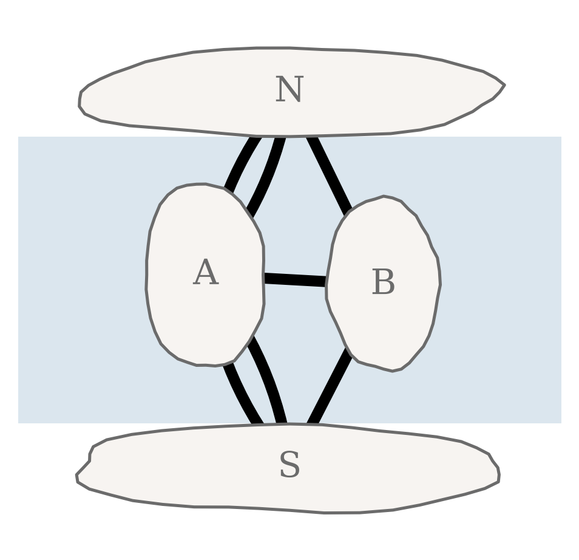
<figcaption>four landmasses, same layout as the engraving</figcaption>

---

<!-- _class: part -->

Part Two02 / 08

## Abstraction

Strip the map until only relationships remain

---

## What can you throw away?

Look again — the puzzle survives even if you erase almost everything here.

Turn to your neighbor — 30 seconds. Does the puzzle depend on bridge length? Island area? River width? Which bank you start from?

<figcaption>what actually matters here?</figcaption>

---

## Euler's move — the city

Euler asked the same question. His answer: keep only what connects to what — geography, distance, shape, all gone.

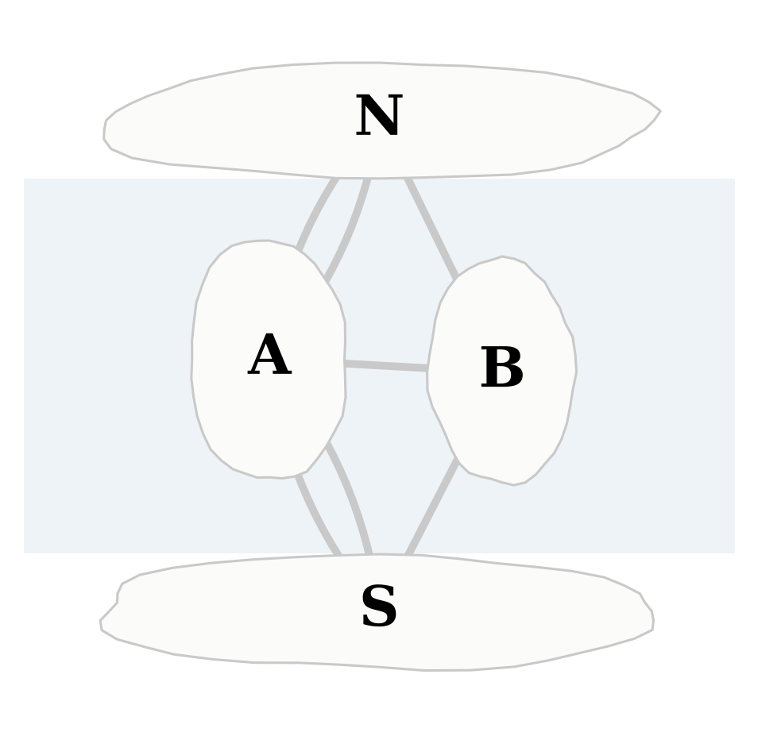
<figcaption>N, A, B, S now labelled — the cut comes next</figcaption>

---

<!-- _class: mid -->

## Euler's move — each landmass becomes a node

Four landmasses. Four dots. A landmass's size, its shape, its area — all gone. Only a bare label remains.

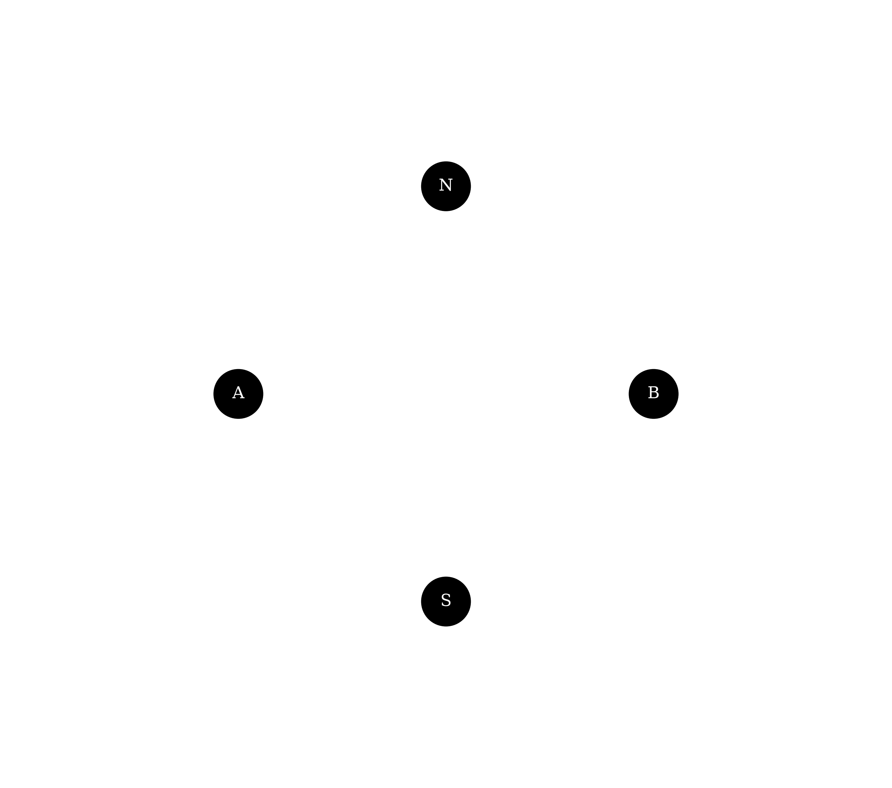
<figcaption>four dots, still no lines between them</figcaption>

---

<!-- _class: mid -->

## Euler's move — each bridge becomes an edge

Every bridge becomes a line joining two dots — a new object: a **graph**.

1736: this abstraction founds **graph theory** — substrate for social, transport, brain, Internet analysis.

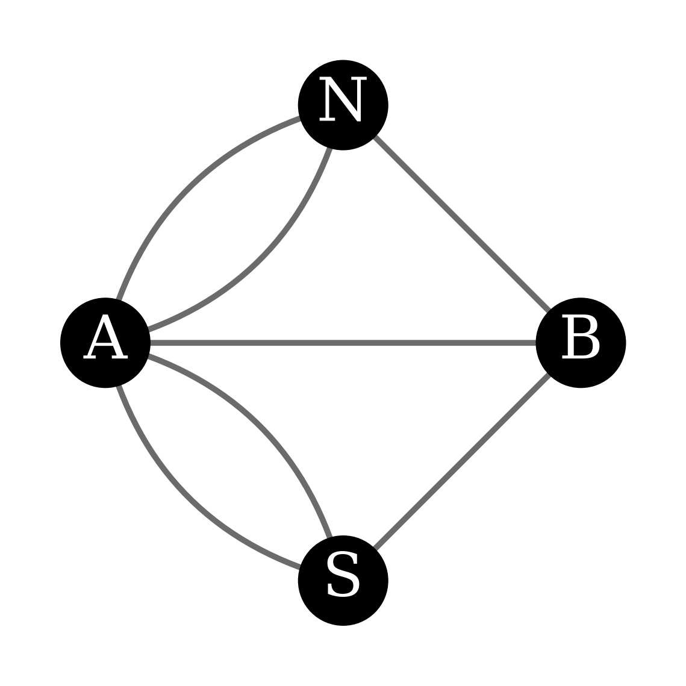
<figcaption>seven edges in all — two pairs doubled, island A touching five</figcaption>

---

<!-- _class: mid -->

## A graph, written down

$$ G = (V, E) $$

$V$ = **nodes** · $E$ = **edges** (pairs of nodes).

For Königsberg: four landmasses, seven bridges.

<figcaption>the abstracted city</figcaption>

---

<!-- _class: mid -->

## Your turn: abstract a transit line

Picture a small bus line: three stops — Depot, Mall, Park — a Depot–Mall leg, a Mall–Park leg, and an express Depot–Park run that skips Mall.

Decide with your neighbor: what are the nodes? What are the edges? Does the express route change Mall's degree?

*Take two minutes — sketch it as dots and lines.*

---

## Two bridges, one pair

Two bridges between island A and bank N. Two more between A and bank S. Count each, or collapse the pair?

* Both count. Each bridge is its own edge.
* Collapse them and you're solving a different puzzle — fewer crossings to make.

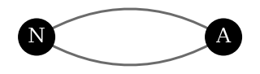
<figcaption>N–A, doubled — two bridges, one pair</figcaption>

---

<!-- _class: mid -->

## An edge to itself

A **self-loop** is an edge that starts and ends at the same node.

Königsberg has none — but graphs in general do.

<figcaption>both ends attach here</figcaption>

---

<!-- _class: part -->

Part Three03 / 08

## Degree and Euler’s theorem

Parity is the whole argument

---

<!-- _class: mid -->

## Degree

The **degree** $k_i$ is the number of edges attached to node $i$.

Count every edge touching the node — nothing more, nothing less.

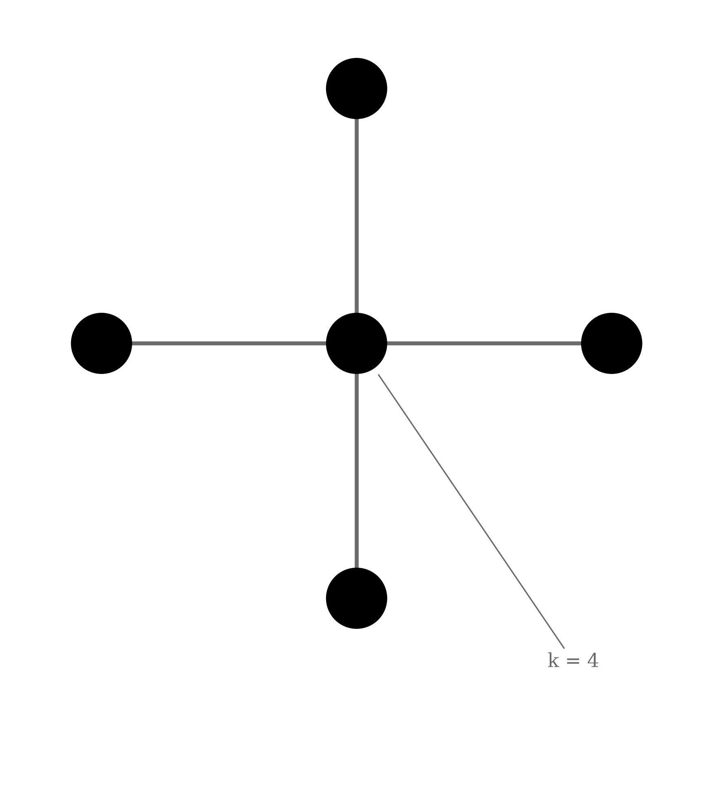
<figcaption>the arms: degree 1 each. The center: degree 4.</figcaption>

---

<!-- _class: mid -->

## You are mid-walk. How many edges do you use?

Your walk crosses every bridge once. Mid-walk, you arrive at a node — then leave again.

How many edges, just to pass through?

*30 seconds — count on your fingers.*

---

<!-- _class: mid -->

## Edges come in pairs

Arrive by one edge, leave by another — two edges per visit.

An interior node spends its edges two at a time.

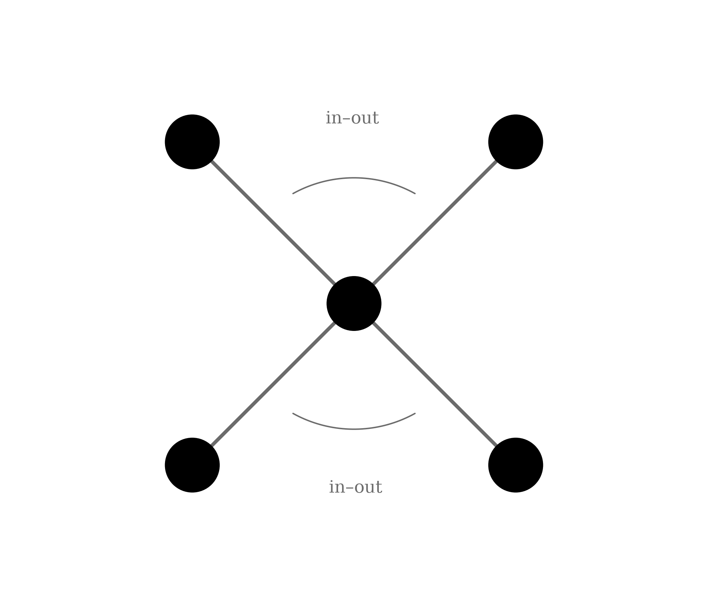
<figcaption>even: every edge finds a partner</figcaption>

---

<!-- _class: mid -->

## What if the degree is odd?

One edge can’t find a partner. What does that force?

*30 seconds — think about where that leftover edge has to go.*

---

<!-- _class: mid -->

## One edge left over

Pair up the edges — one is left alone. It has nowhere to go except the start or end of your walk.

An odd-degree node must be where you begin or where you finish.

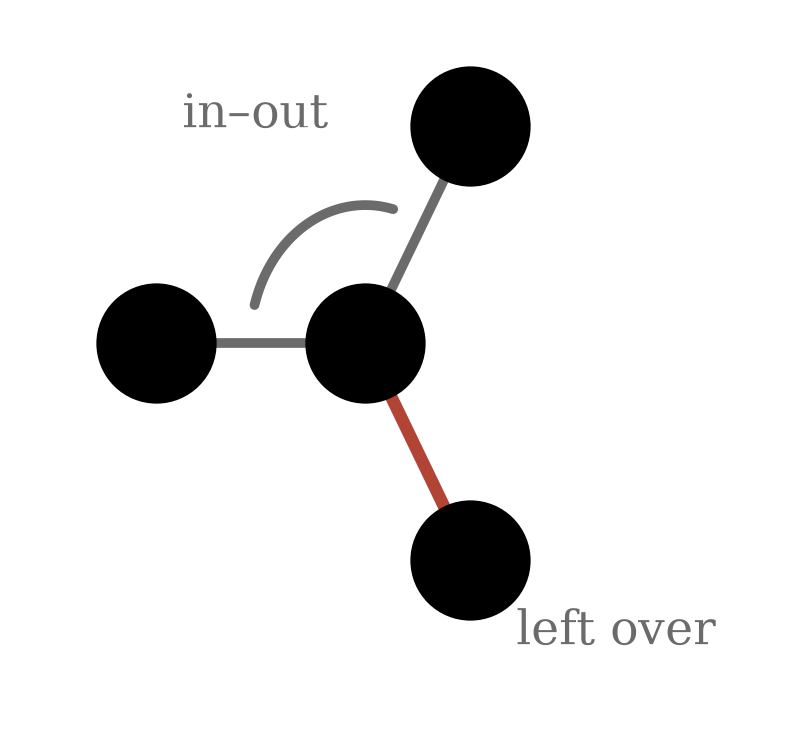
<figcaption>three edges at this node: one pair, one leftover</figcaption>

---

## A graph with such a walk has at most two odd nodes

If a walk crosses every edge exactly once, then

$$ \#\{\text{odd-degree nodes in the graph}\} \leq 2 $$

A walk using every edge once has exactly two ends. Only those two spots can absorb a leftover edge — at most two odd-degree nodes.

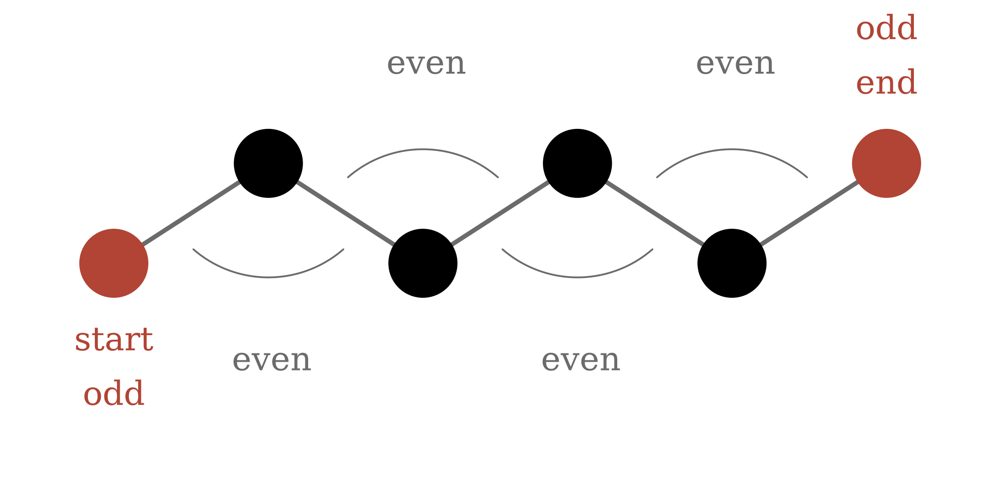
<figcaption>six nodes; only the two red ends are odd</figcaption>

---

## Your turn: count Königsberg

Count the bridges touching each landmass. How many landmasses have an odd count?

Hands up when you have an answer — possible, or impossible?

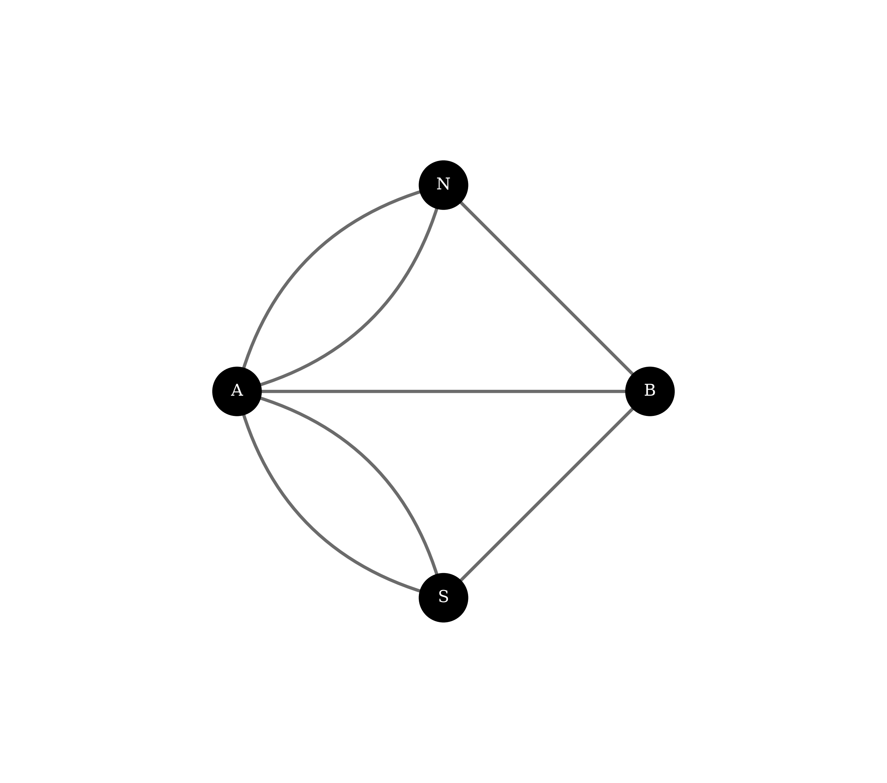
<figcaption>same graph, no counts shown</figcaption>

---

## The verdict

* Degrees: three, three, five, three
* All four odd
* Rule: at most two odd nodes
* Impossible.

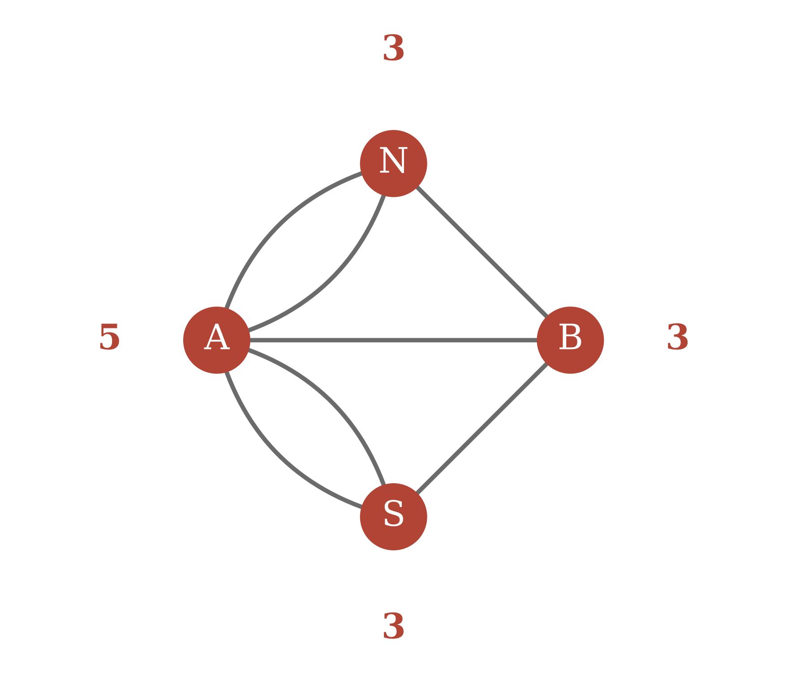
<figcaption>now labelled — red marks odd degree</figcaption>

---

## Eulerian path

An **Eulerian path** uses every edge once — exists exactly when 0 or 2 nodes are odd, on a graph you can get around.

We've shown more-than-two-odd breaks it. That the condition is also *enough* — a path always exists — we use without proving.

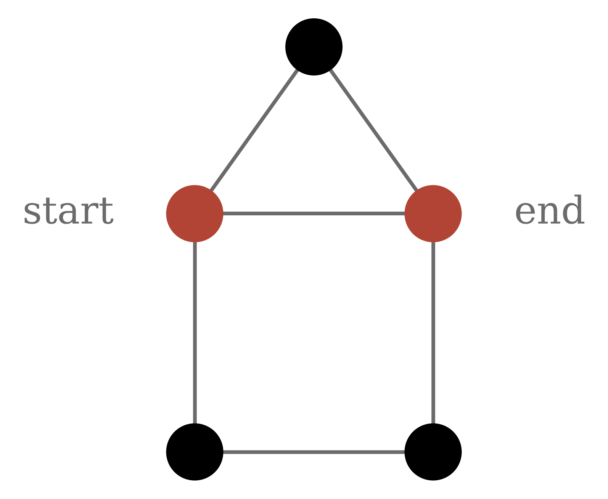
<figcaption>two odd nodes</figcaption>

---

<!-- _class: mid -->

## What if you must return to where you started?

Add one rule: end back where you began. What happens to "exactly two odd"?

*30 seconds.*

---

## Eulerian circuit

Ending back where you began removes the ends — no start, no finish, one loop. No node is left to absorb a leftover edge.

* The “exactly two odd” case disappears. For an **Eulerian circuit**, every node must be even.
* Königsberg fails either way — four odd nodes is neither 0 nor 2.

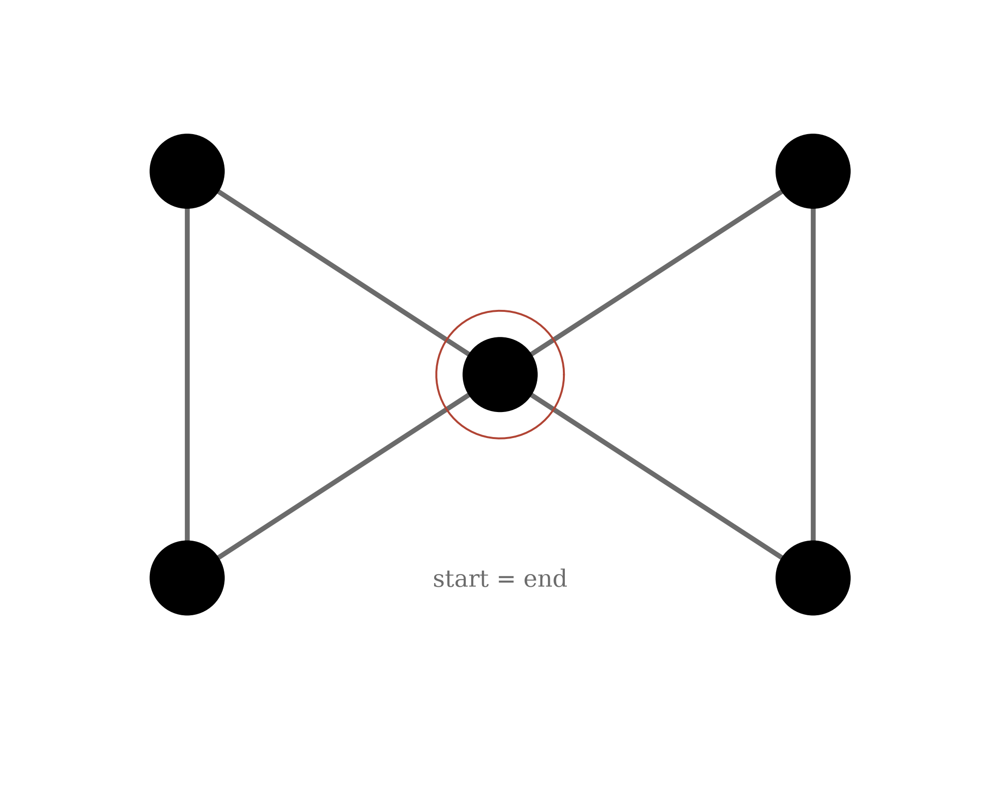
<figcaption>cross all six edges, end where you began</figcaption>

---

## Which two bridges would you destroy?

You want to make the walk possible. Which two bridges do you remove?

*Turn to your neighbor — 30 seconds.*

<figcaption>work from the degrees</figcaption>

---

## A tragic epilogue

World War II. Königsberg is bombed and two bridges are destroyed.

* Five bridges remain. Only two landmasses are left odd.
* The 200-year impossible walk becomes possible — by accident of war.

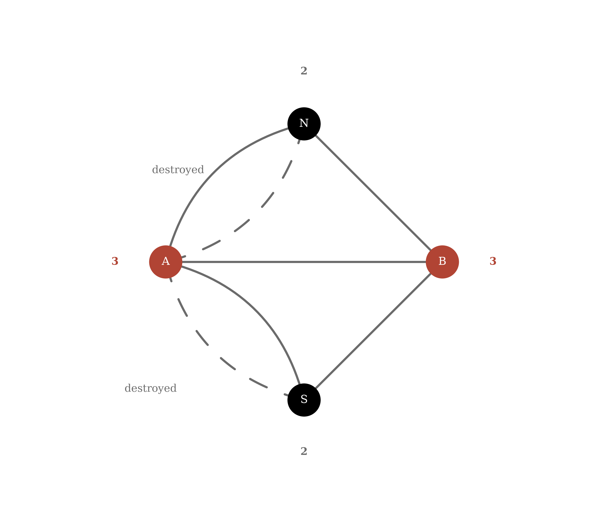
<figcaption>two odd → now possible</figcaption>

---

<!-- _class: part -->

Part Four04 / 08

## Vocabulary

Name the journeys precisely

---

<!-- _class: mid -->

## Walk

A **walk** is any route through the graph. Nodes may repeat. Edges may repeat. Nothing is off-limits.

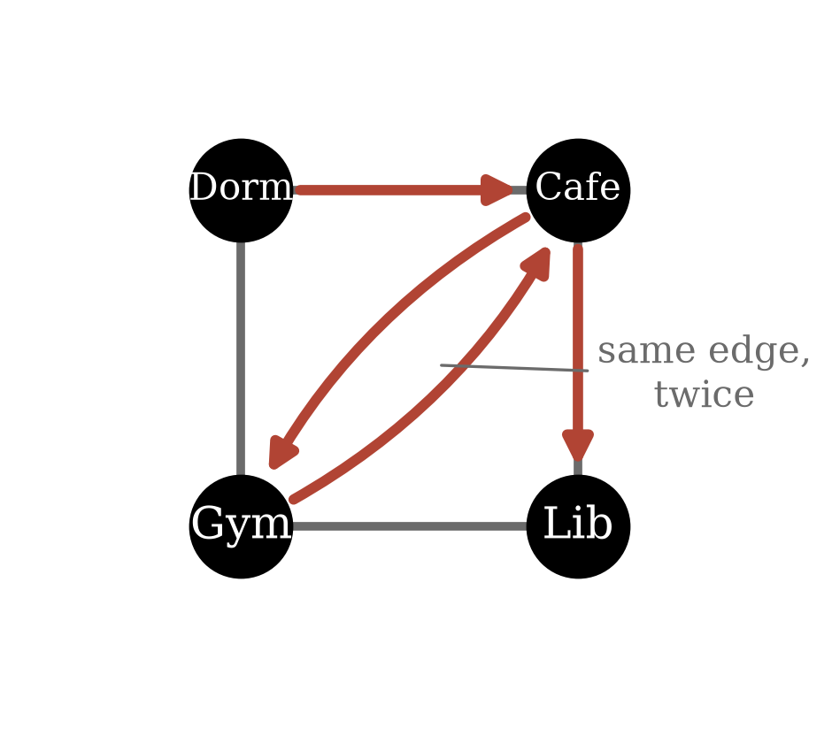
<figcaption>the route: Dorm → Cafe → Gym → Cafe → Lib</figcaption>

---

<!-- _class: mid -->

## Trail

A **trail** is a walk that never uses the same edge twice.

Nodes may still repeat.

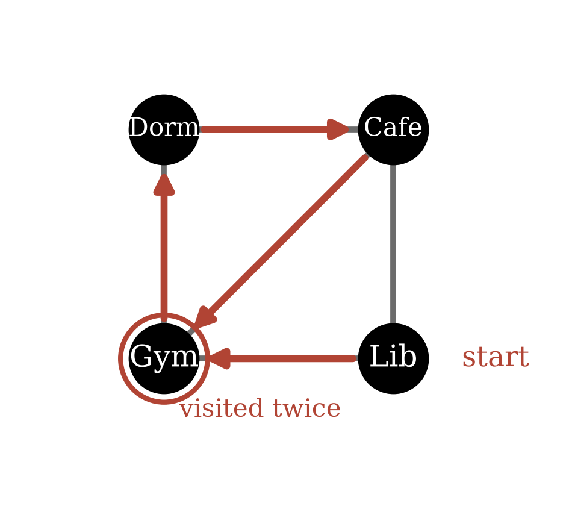
<figcaption>the route: Lib → Gym → Dorm → Cafe → Gym</figcaption>

---

## Path

A **path** is a walk that never uses the same node twice — and so never the same edge either.

* Every path is a trail. Not every trail is a path.
* That's why the **Eulerian path** from earlier is really an Eulerian *trail* — the name predates this vocabulary.

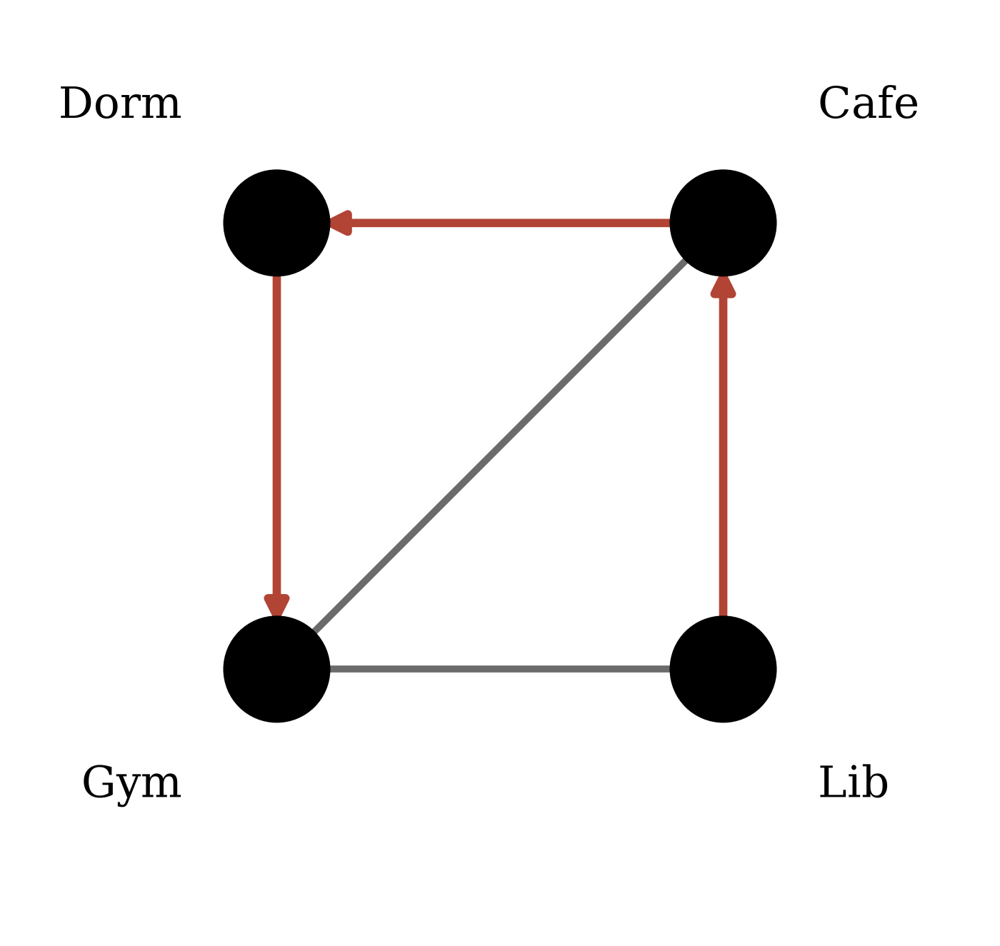
<figcaption>the route: Lib → Cafe → Dorm → Gym</figcaption>

---

<!-- _class: mid -->

## Your turn: find a trail that is not a path

Trace one on the campus graph.

Hands up when you have it.

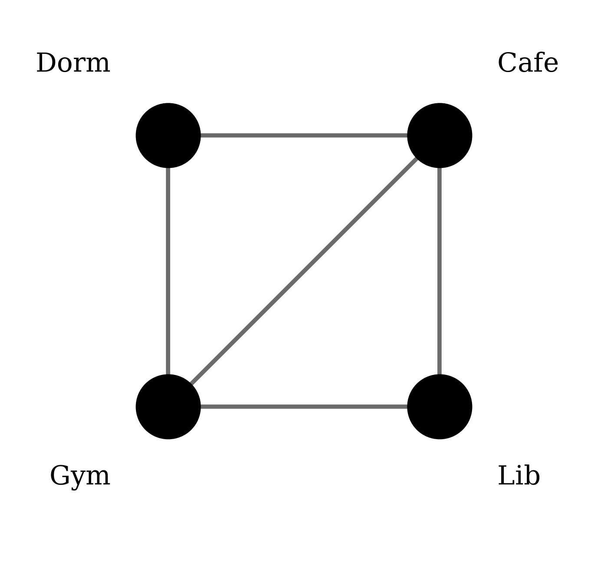
<figcaption>no arrows this time — you pick the direction</figcaption>

---

<!-- _class: mid -->

## Circuit

A **circuit** is a closed trail — back to the start, no edge repeated.

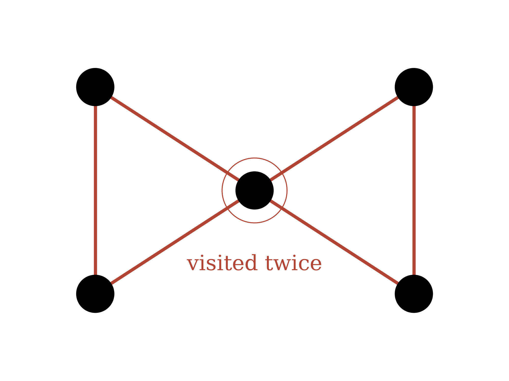
<figcaption>a node may be revisited; an edge may not</figcaption>

---

<!-- _class: mid -->

## Cycle

A **cycle** is a closed path — back to the start, no node repeated.

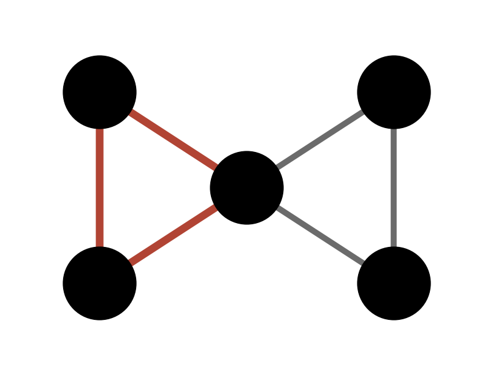
<figcaption>stricter than a walk or a trail — nothing repeats (red: the cycle traced)</figcaption>

---

<!-- _class: mid -->

## Your turn: one trail, both triangles

Six edges, two triangles, not touching. Trace one trail — no edge repeated — that covers every edge at right.

*30 seconds — try it. Hands up: possible, or impossible?*

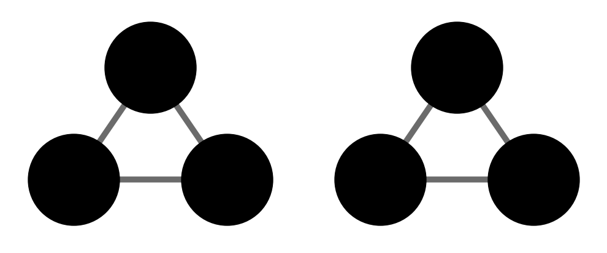
<figcaption>two triangles, no edge between them</figcaption>

---

<!-- _class: part -->

Part Five05 / 08

## Connectivity

Euler’s theorem quietly assumed you can get everywhere

---

## Can you get from any node to any other?

* A graph is **connected** when a path exists between every pair of nodes.
* The two-triangle graph from a moment ago already failed this test. This graph fails it too, differently.

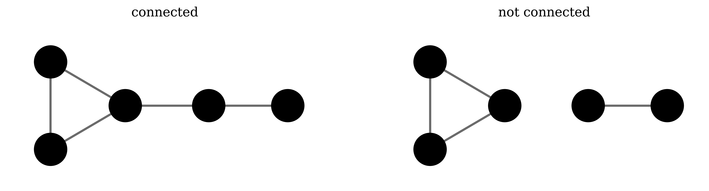
<figcaption>one missing edge splits five nodes into two pieces</figcaption>

---

## Components

* If not, the graph splits into **connected components** — maximal mutually-reachable sets.
* A single isolated node counts too — a component of one.

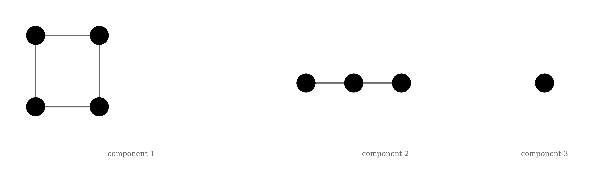
<figcaption>three components, no edge crosses between them</figcaption>

---

## Your turn: run the sweep

* Pick an unvisited node, mark it.
* Visit its unvisited neighbors, and theirs, until stuck.
* Everything touched is one component — repeat if nodes remain.

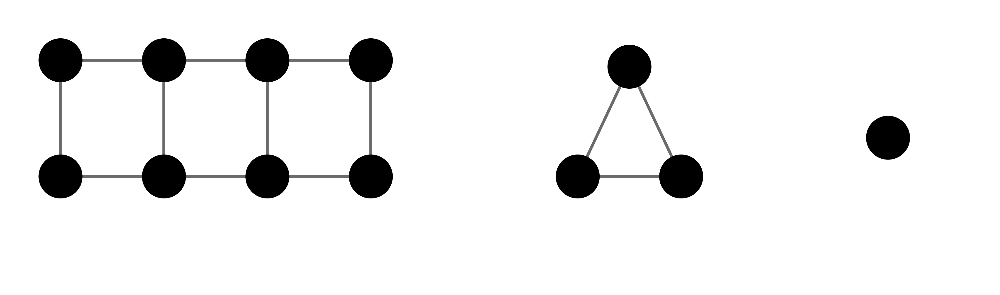
<figcaption>trace it yourself — how many sweeps in all?</figcaption>

---

## Three sweeps, three components

* Sweep 1 clears the eight-node ladder.
* Sweep 2 clears the triangle.
* Sweep 3 finds the lone node.

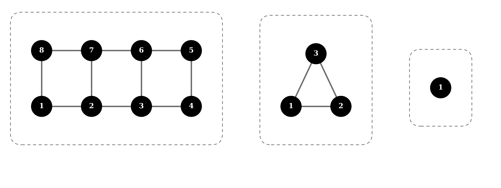
<figcaption>dashed boxes mark each swept component — numbering restarts at 1</figcaption>

---

<!-- _class: mid -->

## A component has 1,000 nodes. Is it giant?

You find a component with 1,000 nodes.

Giant, or not? What do you need to know first?

*Take 30 seconds.*

---

## The giant component

It depends on $N$. The same 1,000 nodes are giant in a network of 1,200 — and negligible in one of ten million.

* A component is **giant** when it holds a finite fraction of all nodes as $N$ grows.
* In practice: extract it and work there. *Whether* one exists is Module 3's question.

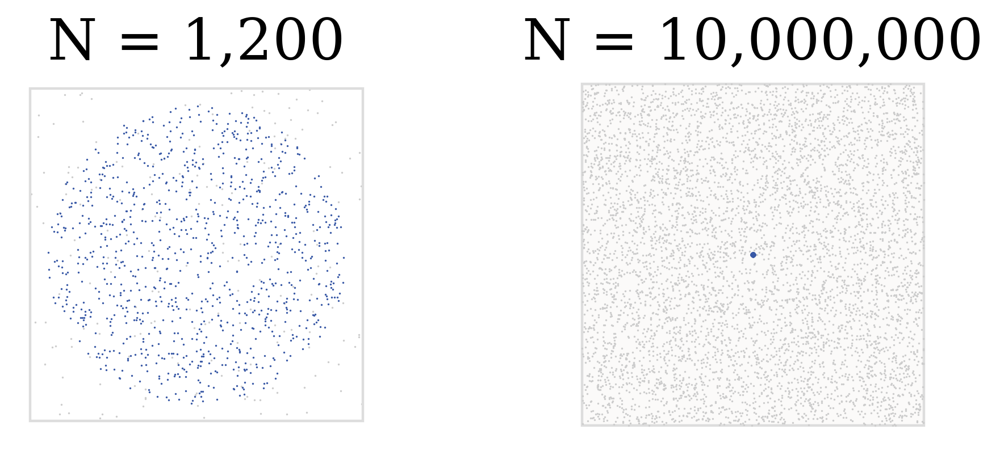
<figcaption>83% of the network on the left, 0.01% on the right</figcaption>

---

<!-- _class: part -->

Part Six06 / 08

## Direction

Point every edge one way — degree, Euler, connectivity all split in two

---

<!-- _class: mid -->

## Edges with direction

In a **directed** graph, each edge has an orientation — reachable one way doesn't mean reachable back.

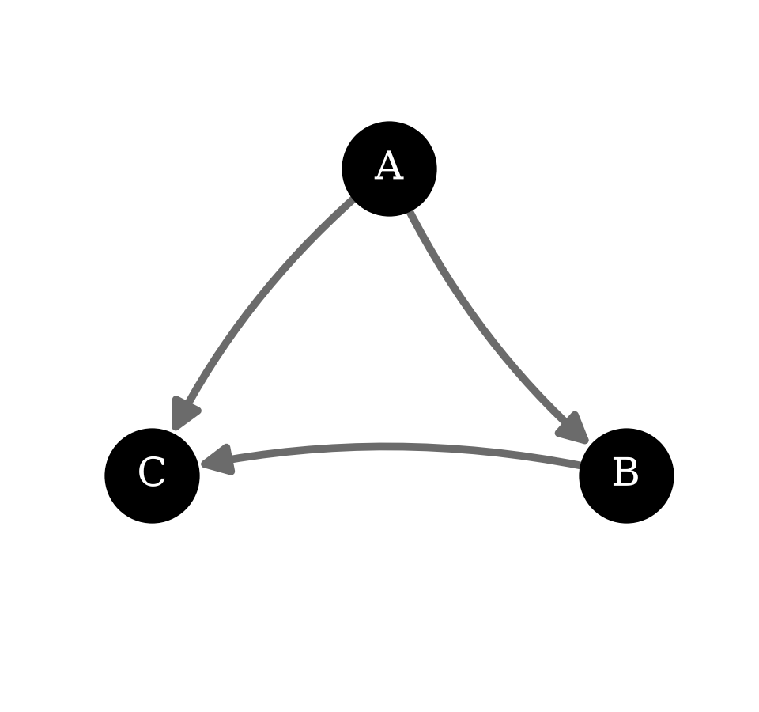
<figcaption>C receives from both A and B; nothing leaves C</figcaption>

---

<!-- _class: mid -->

## What breaks when edges have direction?

**Degree** has counted edges at a node without asking which way they point.

Once edges have direction, degree splits — into what?

*30 seconds.*

---

<!-- _class: mid -->

## In-degree and out-degree

Each node now has two counts: **in-degree**, edges arriving, and **out-degree**, edges leaving.

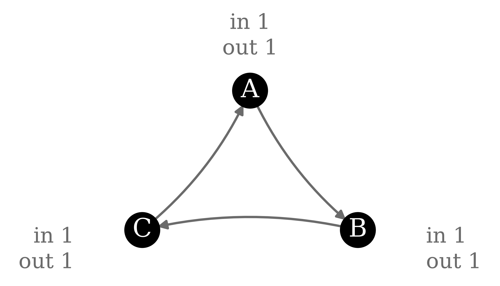
<figcaption>A→B→C→A — each arrow both leaves and arrives once</figcaption>

---

<!-- _class: mid -->

## Strongly connected

A directed path from every node to every other node.

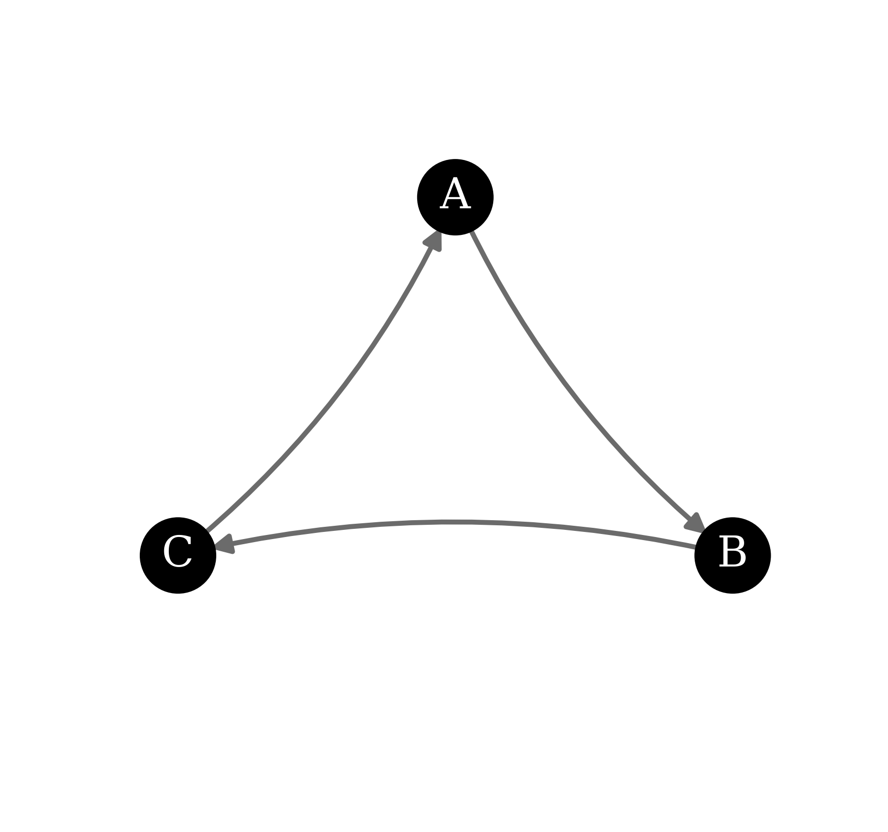
<figcaption>A→B→C→A: one loop reaches every node from every node</figcaption>

---

<!-- _class: mid -->

## Weakly connected

Connected once you ignore direction. A weaker requirement — every strongly connected graph is **weakly connected**, but the converse fails.

One-way streets get you out, not necessarily back.

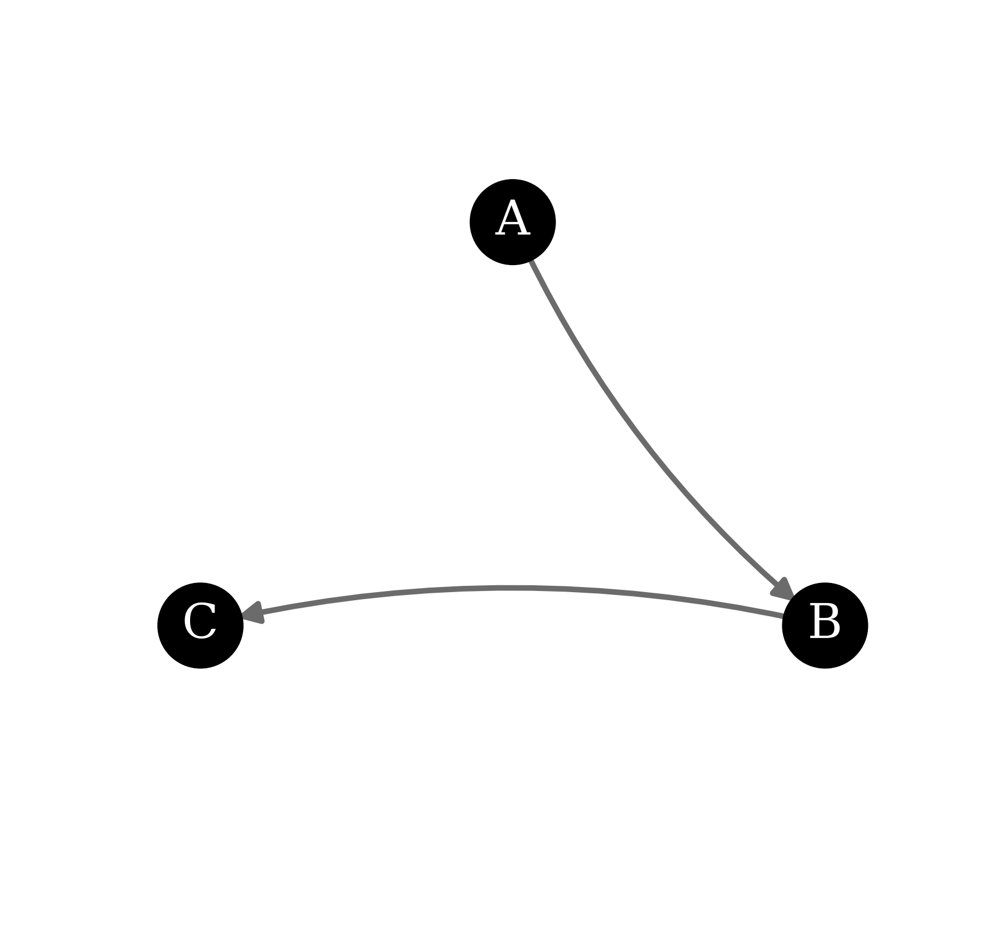
<figcaption>no directed route returns to A</figcaption>

---

<!-- _class: mid -->

## What replaces "odd" once edges point?

Königsberg's rule was about odd degrees. What plays that role once edges carry direction?

*30 seconds.*

---

## Total degree is the wrong quantity

Undirected rule: total degree. Try it here — add in + out, check even.

* A: in 0, out 2 → total 2, "even."
* B: in 2, out 0 → total 2, "even."
* Both pass — yet nothing enters A, nothing leaves B.

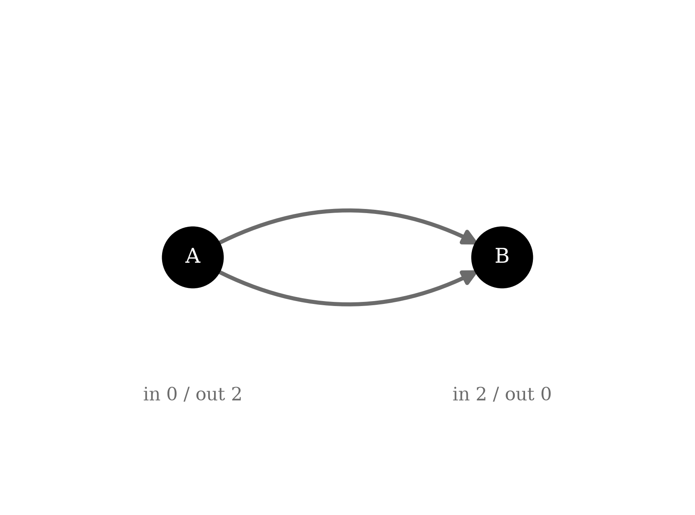
<figcaption>A: in 0, out 2 — B: in 2, out 0 — both "even," neither balanced</figcaption>

---

## The directed Euler condition

Euler's condition splits into two cases — connected once you ignore direction, plus one balance rule:

* **Closed tour:** in-degree equals out-degree at every node.
* **Trail:** exactly one node has out − in = 1 (start), one has in − out = 1 (end), every other node balances.

<figcaption>A→B→C→A: in = out = 1 at every node — a closed tour</figcaption>

---

<!-- _class: mid -->

## Your turn: does a closed tour survive?

Add one arc to this triangle — anywhere to anywhere.

Does the closed tour still exist? Does a trail?

*Turn to your neighbor — 30 seconds.*

<figcaption>A→B→C→A — add one arc and re-check</figcaption>

---

<!-- _class: part -->

Part Seven07 / 08

## Representation

How you store a network shapes what you can ask it

---

<!-- _class: mid -->

## How would you store a network?

A million nodes. Answer *who are node 7's neighbors?* — a billion times.

How would you lay this out in memory?

*30 seconds with your neighbor.*

---

<!-- _class: mid -->

## Edge list

Simplest option: a list of pairs, one per edge. Compact — but finding node 1's neighbors means scanning every pair.

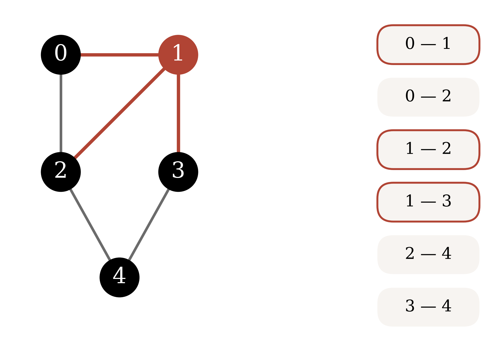
<figcaption>node 1's edges: rows 0, 2, 3</figcaption>

---

<!-- _class: mid -->

## Adjacency list

Store each node's neighbors directly — node 1's row is the answer, no scanning.

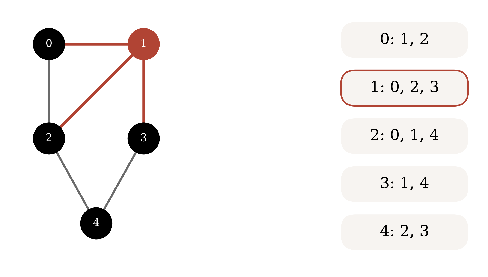
<figcaption>same three neighbors as the edge list, now sitting together</figcaption>

---

## Adjacency matrix

$$
A_{ij} =
\begin{cases}
1 & i \sim j \\
0 & \text{otherwise}
\end{cases}
$$

An $n \times n$ grid of 0s and 1s — opens the door to linear algebra, but costs $O(n^2)$ even when nearly all zero.

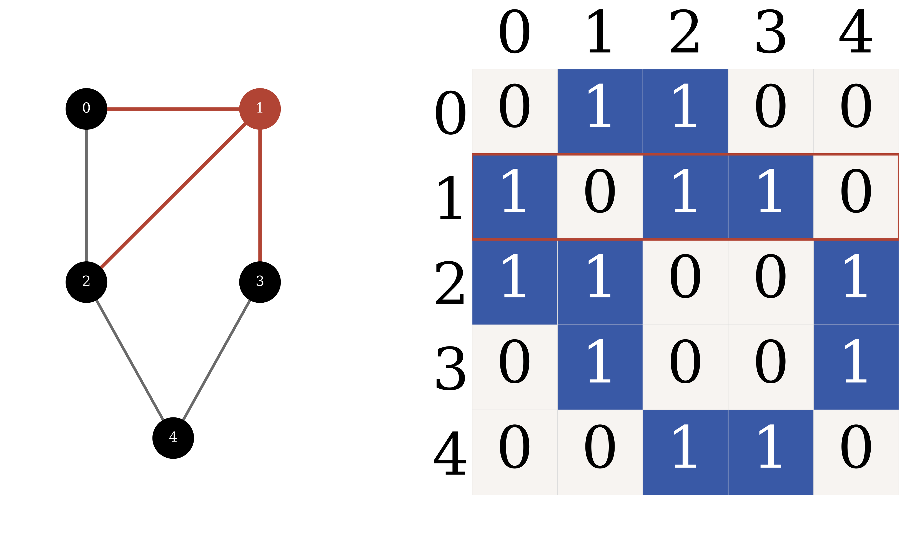
<figcaption>row 1 (red): 1s at columns 0, 2, 3 — node 1's three neighbors</figcaption>

---

<!-- _class: mid -->

## Degree, three ways — the edge list

Same quantity, every representation. Edge list: count rows mentioning node 1.

<figcaption>three rows mention node 1 — degree 3</figcaption>

---

<!-- _class: mid -->

## Degree, three ways — the adjacency list

The adjacency list needs no counting at all — a row's length is the degree.

<figcaption>node 1's row lists three neighbors — degree 3</figcaption>

---

<!-- _class: mid -->

## Degree, three ways — the matrix

And the matrix agrees a third way: sum a row.

<figcaption>row 1 sums to 3 — same degree as the edge list and adjacency list</figcaption>

---

<!-- _class: mid -->

## For a multigraph, count the edges

Two bridges, same pair? The entry isn't capped at 1 — $A_{ij}$ is the number of edges between $i, j$.

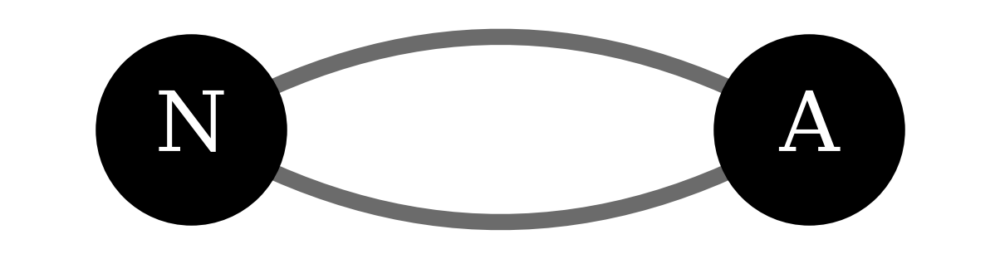
<figcaption>two N–A bridges → the entry is 2, not 1</figcaption>

---

<!-- _class: mid -->

## Multiply $A$ by itself. What do the entries mean?

$$ \mathbf{A}^2 $$

What does entry $(i,j)$ count?

*30 seconds — try it on the five-node graph from a couple of slides back, the one whose matrix appeared on-screen.*

---

## $A^k$ counts walks

$$ (\mathbf{A}^k)_{ij} = \#\{\text{walks of length } k \text{ from } i \text{ to } j\} $$

Walks, not paths — repetition is allowed. Later modules reuse this for clustering and centrality.

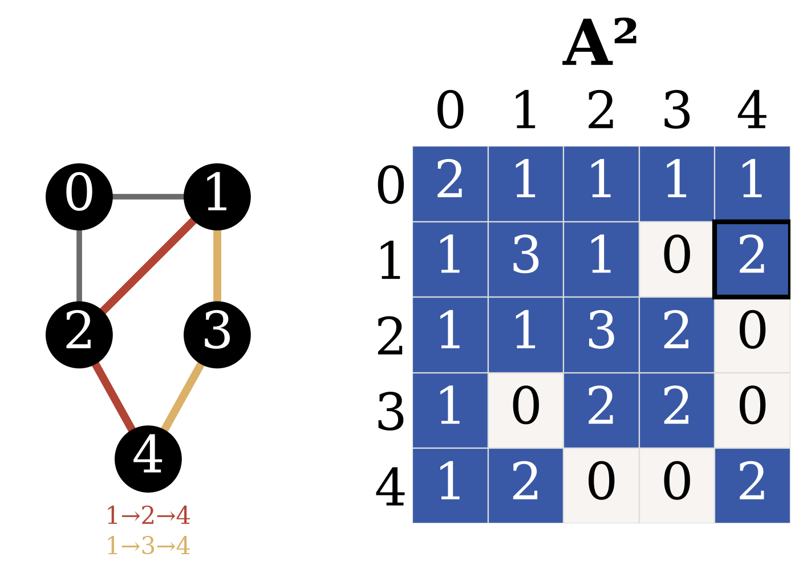
<figcaption>red route 1–2–4, gold route 1–3–4 — both land in cell (1,4)</figcaption>

---

<!-- _class: mid -->

## A dense matrix for eight billion people — how much memory?

Every human on Earth, a node. Store the full $n \times n$ matrix, dense, one byte per entry.

Guess before you compute — kilobytes? Gigabytes? More?

*30 seconds.*

---

## 64 exabytes

$$ n = 8\times10^{9} \qquad n^2 \times 1\text{ byte} = 6.4\times10^{19}\text{ bytes} \approx 64\text{ EB} $$

Eight billion nodes, one byte per pair — more storage than most data centers hold, just to record who is *not* connected.

Almost every entry in that grid is a wasted zero. That waste is exactly what a sparse format refuses to store.

---

## Store only the nonzeros

Most pairs aren't linked — store only what's there. The **Compressed Sparse Row (CSR)** format keeps three arrays:

* **data** — the values
* **indices** — column of each nonzero
* **indptr** — where each row starts, so one row = one contiguous slice

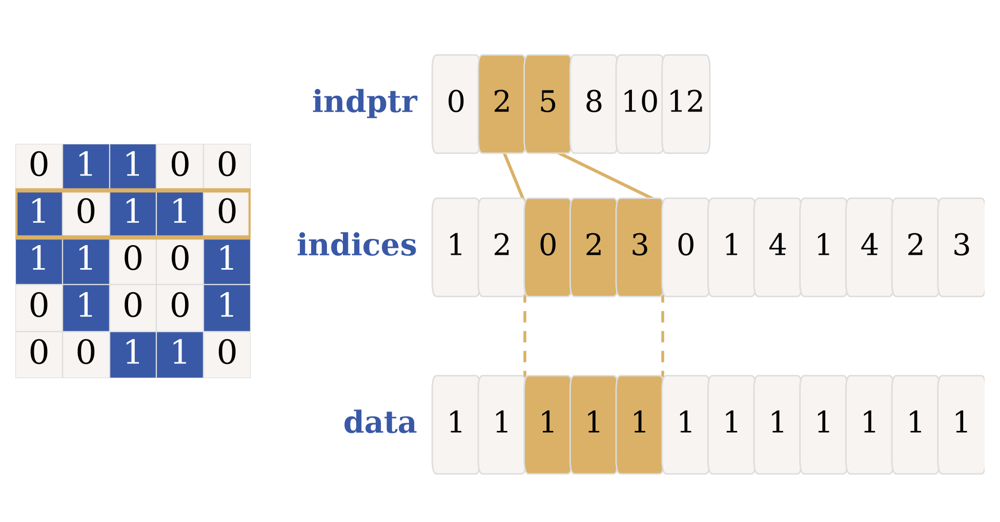
<figcaption>row 1: indptr 2→5 marks the slice — indices 0, 2, 3</figcaption>

---

## The payoff: degree

Degree falls straight out of **indptr** — no scan required:

$$ k_i = \mathrm{indptr}[i+1]-\mathrm{indptr}[i] $$

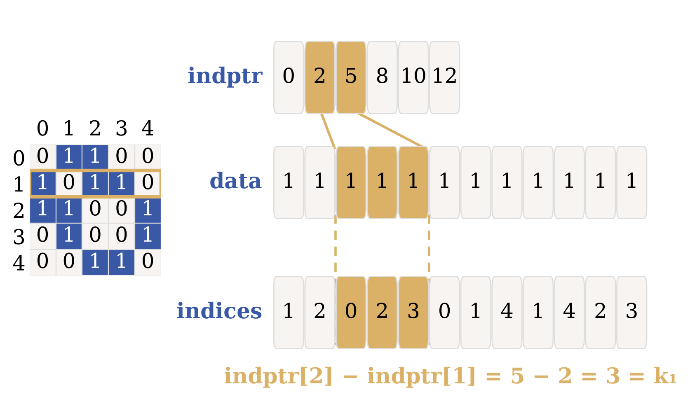
<figcaption>the dense row highlighted on the left becomes the highlighted slice on the right</figcaption>

---

## The payoff: memory

Dense stores 25 numbers here; CSR stores 30 (data 12 + indices 12 + indptr 6) — at this toy size, CSR loses. The claim is about growth: real networks are far larger and sparser, and the gap flips hard:

$$ O(n^2) \rightarrow O(m+n) $$

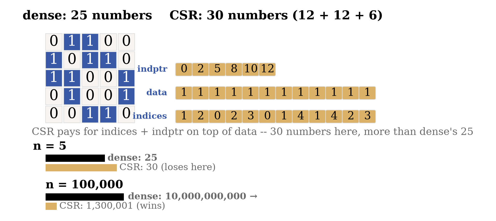
<figcaption>n=100,000, average degree 6: dense 10B vs CSR 1.3M — CSR wins 7,692×</figcaption>

---

## Which format when?

Rule of thumb: edge list on disk, sparse matrices for analysis.

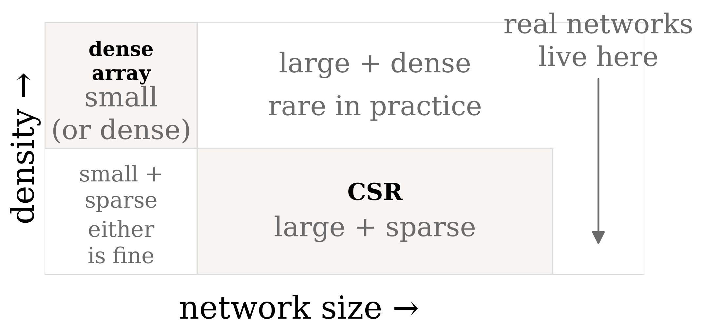
<figcaption>axes: node count vs. density</figcaption>

---

<!-- _class: part -->

Part Eight08 / 08

## Edge cases

The graphs that break the rules

---

<!-- _class: mid -->

## Does a self-loop add 1 to a node's degree, or 2?

Degree = edges attached to a node. A self-loop is one edge — but touches the node at both ends.

30 seconds: does it count once, or twice?

<figcaption>both ends attach here</figcaption>

---

<!-- _class: mid -->

## Two

Both endpoints attach at the same node, so a self-loop contributes 2 to its degree.

This keeps the parity argument intact — a self-loop adds an even number, so it never changes a node's parity.

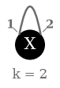
<figcaption>1 and 2 mark where the loop leaves and returns</figcaption>

---

<!-- _class: mid -->

## Is a single node with no edges connected?

One node. No edges. Nothing to reach, and nothing reaching it.

30 seconds: does "a path between every pair of nodes" even apply here?

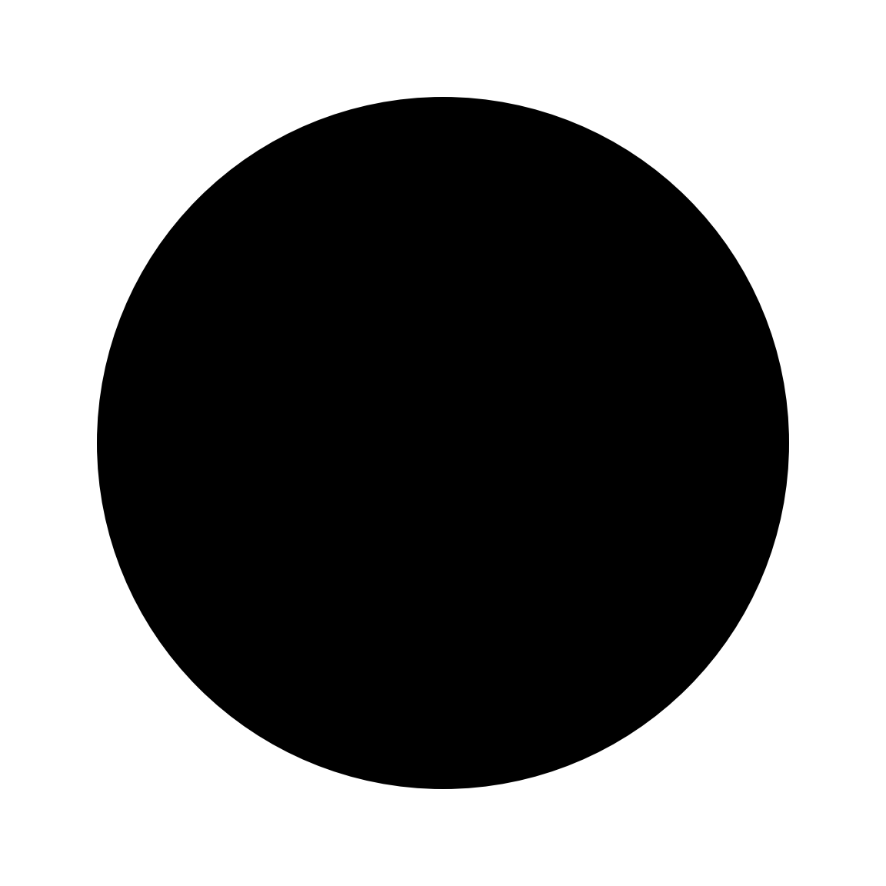
<figcaption>the smallest possible graph — a single dot</figcaption>

---

<!-- _class: mid -->

## Yes — vacuously

No pairs of nodes exist to fail the test — the condition holds by default. A lone node is a **component** of its own.

<figcaption>the ring marks the component — it contains exactly one node</figcaption>

---

<!-- _class: mid -->

## Every node has even degree, and yet there is no Euler circuit. How?

Picture a graph where every node has degree 2 — parity satisfied, in full.

60 seconds: draw one yourself before the next slide.

---

## The graph is in two pieces

Parity alone isn't enough — Euler's theorem also requires **connectivity**. A single walk can't jump between components, however even their degrees. That's why the sweep from Part Five matters.

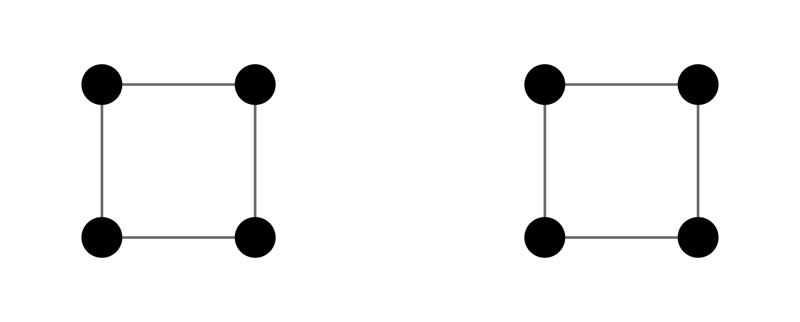
<figcaption>two squares, each still degree 2 — no edge between them</figcaption>

---

## Back to Königsberg

Run both conditions against the seven bridges, one last time:

* **Connected?** Yes.
* **0 or 2 odd-degree?** No — all four are odd.
* One failure is enough: no circuit, no path.

<figcaption>both conditions, checked against the same graph</figcaption>

---

## Module 01 review

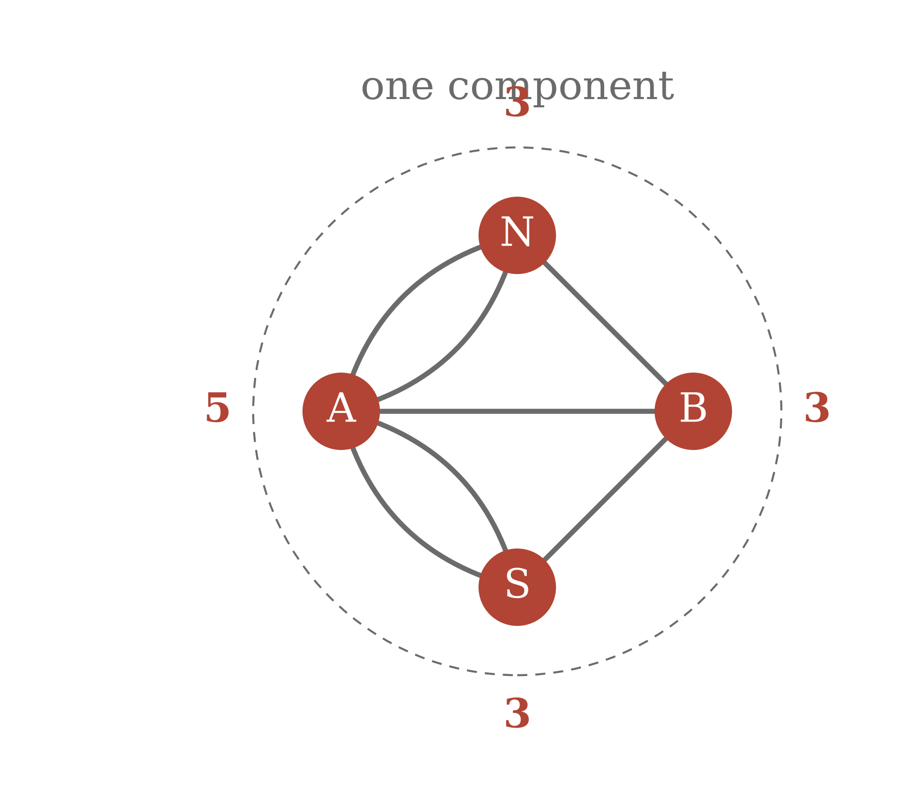
<figcaption>the seven bridges, one last time</figcaption>

* **Abstraction (1736):** landmasses → nodes, bridges → edges
* **Euler's theorem:** connected, 0 or 2 odd-degree nodes — walk, trail, path, circuit, cycle
* **Connectivity:** components, the giant component, $(\mathbf{A}^k)_{ij}$ counts walks
* **Representation:** edge list, adjacency, matrix, CSR — $O(n^2) \rightarrow O(m+n)$

Build a CSR matrix by hand in the Module 01 notebook.

---

## Coming up in Module 02

### Small worlds

Almost all eight billion people are a handful of friendships away from each other.

Short paths. High clustering. One rewiring model that delivers both at once.

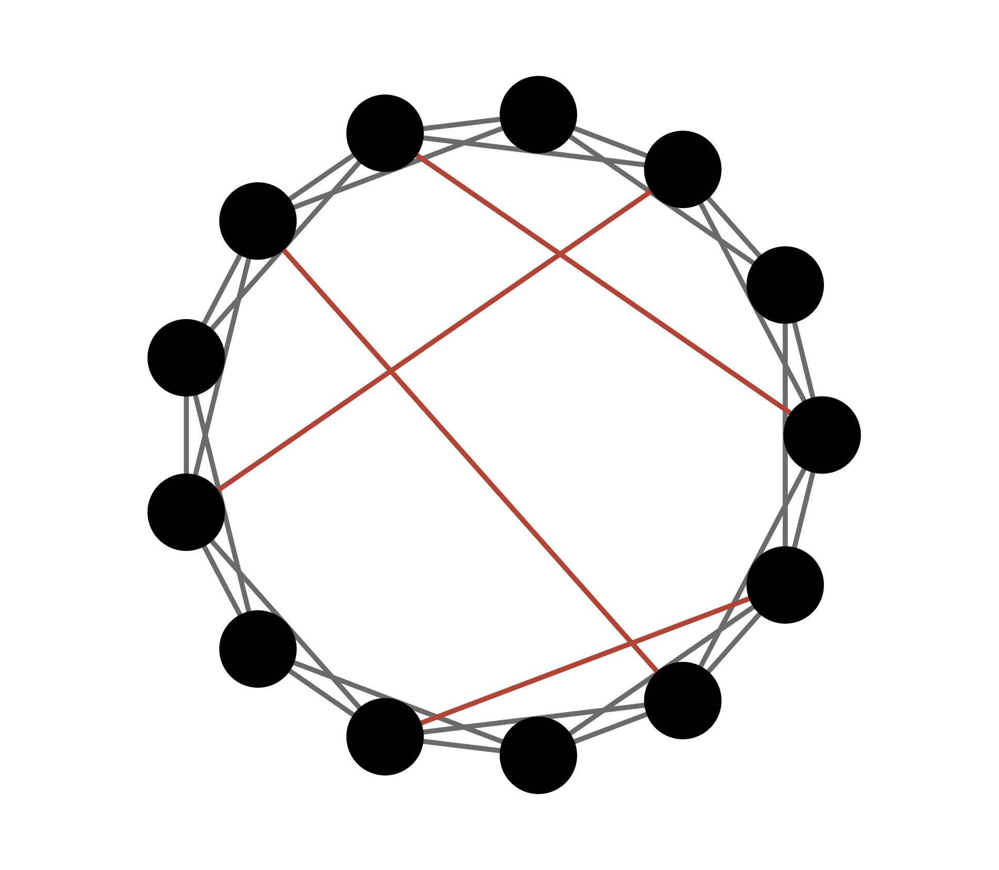
<figcaption>a few shortcuts (red) change everything</figcaption>

