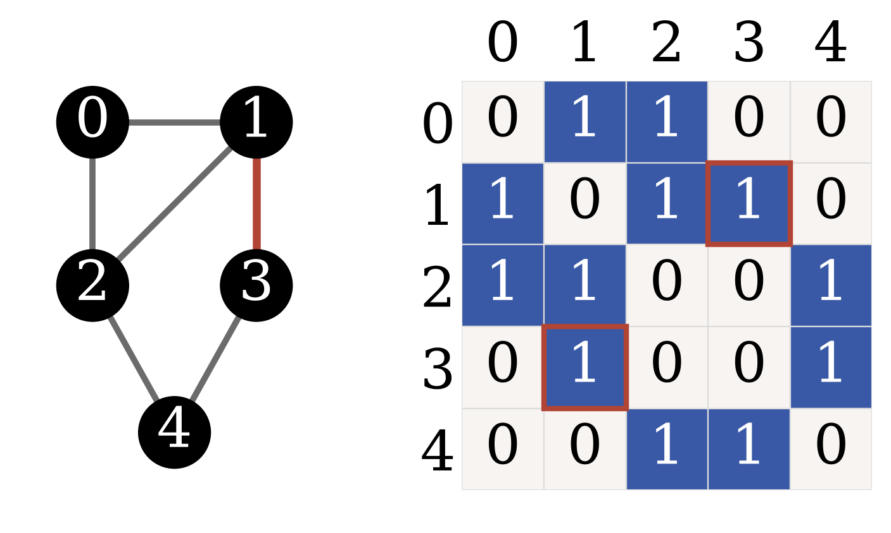

<!-- _class: lead -->

Advanced Topics in Network Science · Module 01

# Seven Bridges

A stroll, a puzzle, and the birth of graph theory

Sadamori Kojaku · Binghamton University

<!--
Open with the story, not the definitions. Königsberg is the hook; abstraction is the point of the whole course.
-->

---

## Roadmap for today

01

The puzzle — seven bridges, one frustrating walk

02

Abstraction — landmasses → nodes, bridges → edges

03

Degree and Euler — parity decides what is possible

04

Vocabulary — walk, trail, path, circuit, cycle

05

Connectivity — components, giants, directed reachability

06

Representation — edge lists, adjacency, sparsity, CSR

07

Edge cases — the graphs that break the rules

---

<!-- _class: part -->

Part One01 / 07

## The puzzle

An 18th-century Sunday stroll that mathematics could not ignore

---

## The Königsberg bridge problem

18th-century Königsberg (today Kaliningrad). Two islands in the Pregel, linked to the mainland by **seven bridges**.

Cross each bridge **exactly once** and **return to the start**?

Nobody could find such a walk. More importantly: nobody could *prove* it was impossible.

<figcaption>the shape you're about to erase</figcaption>

---

## Your turn

Take **ten minutes**. Trace a route — or work the pen-and-paper worksheet.

[Worksheet (Esteban Moro)](http://estebanmoro.org/pdf/netsci_for_kids/the_konisberg_bridges.pdf)

Ask yourself: What information is essential — bridge length? Island size? How do you move from "I can't find a path" to "a path cannot exist"?

<figcaption>four landmasses, same layout as the engraving</figcaption>

---

<!-- _class: part -->

Part Two02 / 07

## Abstraction

Strip the map until only relationships remain

---

## What can you throw away?

Look at the sketch again. The puzzle is still the puzzle if you erase almost everything about it.

Turn to your neighbor — 30 seconds. Does the puzzle depend on bridge length? Island area? River width? Which bank you start from?

<figcaption>what actually matters here?</figcaption>

---

## Euler's move — the city

Euler looked at this same map and asked the same question. His answer: throw away everything except **what connects to what**.

Geography, distance, shape — all of it is about to go.

<figcaption>N, A, B, S — the labels are all that survive the cut</figcaption>

---

## Euler's move — each landmass becomes a node

Four landmasses. Four dots. A landmass's size, its shape, its area — all gone. Only a bare label remains.

<figcaption>four dots, still no lines between them</figcaption>

---

## Euler's move — each bridge becomes an edge

Every bridge is now just a line joining two dots. What is left is a new mathematical object: a **graph**.

1736: this abstraction founds **graph theory** — the substrate for social, transport, brain, and Internet analysis.

<figcaption>seven edges in all — two pairs doubled</figcaption>

---

## A graph, written down

$$ G = (V, E) $$

$V$ = nodes · $E$ = edges (pairs of nodes).

For Königsberg: four landmasses, seven bridges.

<figcaption>the abstracted city</figcaption>

---

## Two bridges, one pair

Königsberg has two bridges between island A and bank N — and two more between A and bank S. Count each one, or collapse the pair?

* Both count. Each bridge is its own edge.
* Collapse them into one and you are solving a **different** puzzle — one with fewer crossings to make.

<figcaption>N–A, doubled — A touches five bridges in all, not four</figcaption>

---

## An edge to itself

A **self-loop** is an edge that starts and ends at the same node — a bridge, in principle, from a landmass back to itself.

Königsberg has none. But graphs in general do, and the definition needs to allow for them.

<figcaption>both ends attach here</figcaption>

---

<!-- _class: part -->

Part Three03 / 07

## Degree and Euler’s theorem

Parity is the whole argument

---

## Degree

The **degree** $k_i$ is the number of edges attached to node $i$.

Count every edge touching the node — nothing more, nothing less.

<figcaption>the arms: degree 1 each. The center: degree 4.</figcaption>

---

## You are mid-walk. How many edges do you use?

Suppose your walk crosses every bridge exactly once. You arrive at a node in the middle of that walk. Later, you leave it again.

How many edges does that node use, just to let you pass through?

*Take 30 seconds. Count on your fingers if you have to.*

---

## Edges come in pairs

Arrive by one edge, leave by another. Every time you pass through a node, you spend two edges — one in, one out.

An interior node consumes its edges **two at a time**.

<figcaption>even: every edge finds a partner</figcaption>

---

## What if the degree is odd?

One edge can’t find a partner. What does that force?

*30 seconds — think about where that leftover edge has to go.*

---

## One edge left over

Pair up the edges and one is left standing alone. That leftover edge has nowhere to go **except** the start or the end of your walk.

An odd-degree node must be where you **begin** or where you **finish**.

<figcaption>three edges at this node: one pair, one leftover</figcaption>

---

## A graph with such a walk has at most two odd nodes

If a walk crosses every edge exactly once, then

$$ \#\{\text{odd-degree nodes in the graph}\} \leq 2 $$

A walk that uses every edge exactly once has exactly two ends — a start and a finish. Only those two spots can absorb a leftover edge, so the graph itself can have at most two odd-degree nodes.

<figcaption>six nodes; only the two red ends are odd</figcaption>

---

## Your turn: count Königsberg

Count the bridges touching each landmass. How many landmasses have an **odd** count?

Hands up when you have an answer — possible, or impossible?

<figcaption>same four landmasses, same seven bridges — no counts shown</figcaption>

---

## The verdict

* Degrees: **three, three, five, three**
* All four **odd**
* A walk **that crosses every bridge exactly once** allows at most two odd nodes
* **Impossible.**

<figcaption>the same map you just counted, now labelled</figcaption>

---

## Eulerian path

An **Eulerian path** is a route that uses every edge exactly once.

On a graph you can get around — every node reachable from every other — one exists exactly when **0 or 2** nodes have odd degree.

<figcaption>two odd nodes: start and end</figcaption>

---

## What if you must return to where you started?

Add one requirement: the walk must end back where it began. What happens to the “exactly two odd” case?

*30 seconds.*

---

## Eulerian circuit

A closed walk has no ends — no start, no finish, just one loop. There’s no node left over to absorb a leftover edge.

* The “exactly two odd” case disappears. For an **Eulerian circuit**, every node must be even.
* Königsberg fails either way — four odd nodes is neither 0 nor 2.

<figcaption>trace the closed walk — cross all six edges, end where you began</figcaption>

---

## Which two bridges would you destroy?

You want to make the walk possible. Which two bridges do you remove?

*Turn to your neighbor — 30 seconds.*

<figcaption>work from the degrees</figcaption>

---

## A tragic epilogue

World War II. Königsberg is bombed and two bridges are destroyed.

* Five bridges remain. Only **two** landmasses are left odd.
* The 200-year impossible walk becomes possible — by accident of war.

<figcaption>two odd → now possible</figcaption>

---

<!-- _class: part -->

Part Four04 / 07

## Vocabulary

Name the journeys precisely

---

## Walk

A **walk** is any route through the graph. Nodes may repeat. Edges may repeat. Nothing is off-limits.

<figcaption>the Café–Gym edge, crossed twice</figcaption>

---

## Trail

A **trail** is a walk that never uses the same edge twice.

The *node* may still repeat — you can pass through the same corner without walking the same street again.

<figcaption>the route: Lib → Gym → Dorm → Cafe → Gym</figcaption>

---

## Path

A **path** is a walk that never uses the same node twice — and so never the same edge either.

Every path is a trail. Not every trail is a path.

<figcaption>the route: Lib → Cafe → Dorm → Gym</figcaption>

---

## Your turn: find a trail that is not a path

Trace one on the campus graph.

Hands up when you have it.

<figcaption>no arrows this time — you pick the direction</figcaption>

---

## Circuit

A **circuit** is a closed trail — back to the start, no edge repeated.

<figcaption>a node may be revisited; an edge may not</figcaption>

---

## Cycle

A **cycle** is a closed path — back to the start, no node repeated.

<figcaption>stricter than a walk or a trail — nothing repeats</figcaption>

---

## Writing a graph as a matrix

$$
A_{ij} =
\begin{cases}
1 & i \sim j \\
0 & \text{otherwise}
\end{cases}
$$

<figcaption>edge 1–3 ↔ cells (1,3) and (3,1)</figcaption>

---

## For a multigraph, count the edges

Two bridges between the same pair? The matrix entry isn't capped at 1 — $A_{ij}$ becomes the **number** of edges between $i$ and $j$.

<figcaption>two N–A bridges → the entry is 2, not 1</figcaption>

---

## Multiply $A$ by itself. What do the entries mean?

$$ \mathbf{A}^2 $$

What does entry $(i,j)$ count?

*30 seconds — try it on the graph from the previous slide.*

---

## $A^k$ counts walks

$$ (\mathbf{A}^k)_{ij} = \#\{\text{walks of length } k \text{ from } i \text{ to } j\} $$

Walks, not paths — repetition is allowed. Later modules reuse this for clustering and centrality.

<figcaption>red route 1–2–4, gold route 1–3–4 — both land in cell (1,4)</figcaption>

---

## Your turn: one trail, both triangles

Six edges, two triangles, not touching. Trace one trail — no edge repeated — that covers every edge below.

*30 seconds — try it. Hands up: possible, or impossible?*

<figcaption>two triangles, no edge between them</figcaption>

---

<!-- _class: part -->

Part Five05 / 07

## Connectivity

Euler's theorem quietly assumed you can get everywhere

---

## Can you get from any node to any other?

A graph is **connected** when a path exists between every pair of nodes.

<figcaption>one missing edge splits five nodes into two pieces</figcaption>

Every reachability argument since Euler has been quietly assuming this.

---

## Components

When the answer is no, the graph splits into **connected components** — maximal sets of mutually reachable nodes.

<figcaption>sizes 8, 3, and 1 — no edge crosses between them</figcaption>

A single isolated node counts too — a component of one, with nowhere to go.

---

## Your turn: run the sweep

Trace the traversal by hand, one component at a time:

* Pick an unvisited node and mark it.
* Visit its unvisited neighbors, and theirs, until you get stuck.
* Everything you touched is one component — if nodes remain, start again.

No components marked yet — trace your own below. How many sweeps until every node is marked?

---

## Three sweeps, three components

Sweep 1 clears the eight-node ladder. Sweep 2 clears the triangle. Sweep 3 finds the lone node.

<figcaption>each component restarts its own count at 1</figcaption>

Cost is $O(N+M)$ — you touch every node and edge once.

---

## A component has 1,000 nodes. Is it giant?

You find a component with exactly 1,000 nodes inside it.

Giant, or not? What would you need to know before you could answer?

*Take 30 seconds.*

---

## The giant component

It depends on $N$. The same 1,000 nodes are giant in a network of 1,200 — and negligible in one of ten million.

* A component is **giant** when it holds a **finite fraction** of all nodes as $N$ grows.
* In practice we extract the giant component and work there — *whether* one exists at all is Module 3's question.

<figcaption>83% of the network on the left, 0.01% on the right</figcaption>

---

## Edges with direction

In a **directed** graph, each edge has an orientation. Reachability need not run both ways — you can get from A to B without any way back.

<figcaption>C receives from both A and B; nothing leaves C</figcaption>

---

## What breaks when edges have direction?

**Degree** has counted edges at a node so far without asking which way they point.

30 seconds: once edges have direction, degree splits — into what?

---

## In-degree and out-degree

Each node now has two counts: **in-degree**, edges arriving, and **out-degree**, edges leaving. Euler's condition becomes: in-degree equals out-degree, at every node.

<figcaption>A→B→C→A — each arrow both leaves and arrives once</figcaption>

---

## Strongly connected

A directed path from every node to every other node — direction respected the whole way.

<figcaption>A→B→C→A: one loop reaches every node from every node</figcaption>

---

## Weakly connected

Connected once you ignore direction. A weaker requirement — every strongly connected graph is weakly connected, but the converse fails.

One-way streets get you out, not necessarily back.

<figcaption>no directed route returns to A</figcaption>

---

<!-- _class: part -->

Part Six06 / 07

## Representation

How a computer holds a network

---

## How would you store a network?

You have a million nodes, and you need to answer *who are node 7's neighbors?* — a billion times.

How would you lay this out in memory?

*30 seconds with your neighbor.*

---

## Edge list

The simplest option: a list of pairs, one per edge. Compact on disk — but finding node 1's neighbors (highlighted) means scanning every pair, since its edges are scattered through the list rather than grouped together.

<figcaption>node 1's edges: rows 0, 2, 3</figcaption>

---

## Adjacency list

Store each node's neighbors directly. Node 1's neighbors are node 1's row — no scanning, the answer is immediate.

<figcaption>same three neighbors as the edge list, now sitting together</figcaption>

---

## Adjacency matrix

An $n \times n$ grid of 0s and 1s. This opens the door to linear algebra — but storing it costs $O(n^2)$, even when almost every entry is 0.

* Degree is the same quantity, three ways: count incidences in the edge list, read a row's length in the adjacency list, sum a row in the matrix.

<figcaption>row 1 (red) is node 1's row: 1s at columns 0, 2, 3</figcaption>

---

## A dense matrix for eight billion people — how much memory?

Every human on Earth is a node. Store the full $n \times n$ adjacency matrix, dense, one byte per entry.

Guess before you compute — kilobytes? Gigabytes? More?

*30 seconds.*

---

## Store only the nonzeros

**512 exabytes.** Most pairs of people are not linked, so store only what is actually there, in three arrays:

* **data** — the values
* **indices** — the column of each nonzero
* **indptr** — where each row starts

One matrix row is one contiguous slice of **data** and **indices** — that is the whole trick.

<figcaption>row 1: indptr 2→5 marks the slice — indices 0, 2, 3</figcaption>

---

## The payoff: degree

Degree falls straight out of **indptr** — no scan required:

$$ k_i = \mathrm{indptr}[i+1]-\mathrm{indptr}[i] $$

<figcaption>the dense row highlighted on the left becomes the highlighted slice on the right</figcaption>

---

## The payoff: memory

The dense matrix stores 25 numbers here. CSR stores 30 — data (12) + indices (12) + indptr (6) — so at this toy size, **CSR loses**. The claim is about growth, not this graph: real networks are far larger and sparser, and the gap flips hard:

$$ O(n^2) \rightarrow O(m+n) $$

<figcaption>n=5: dense 25 vs CSR 30, dense wins — n=100,000: dense 10B vs CSR 1.3M, CSR wins 7,700×</figcaption>

---

## Which format when?

Rule of thumb: edge list on disk, sparse matrices for analysis. You build a CSR matrix by hand in the Module 01 notebook.

<figcaption>real networks cluster large-and-sparse — bottom right</figcaption>

---

<!-- _class: part -->

Part Seven07 / 07

## Edge cases

The graphs that break the rules

---

## Does a self-loop add 1 to a node's degree, or 2?

Degree is "the number of edges attached to a node." A self-loop is one edge — but it touches the node at both ends.

30 seconds: does it count once, or twice?

<figcaption>both ends attach here</figcaption>

---

## Two

Both endpoints attach at the same node, so a self-loop contributes **2** to its degree.

This keeps the parity argument intact — a self-loop adds an even number, so it never changes a node's parity.

<figcaption>① and ② mark where the loop leaves and returns</figcaption>

---

## Is a single node with no edges connected?

One node. No edges. Nothing to reach, and nothing reaching it.

30 seconds: does "a path between every pair of nodes" even apply here?

<figcaption>the smallest possible graph — a single dot</figcaption>

---

## Yes — vacuously

There are no pairs of nodes to fail the test, so the condition holds by default. A lone node is a **component of its own**.

<figcaption>the ring marks the component — it contains exactly one node</figcaption>

---

## Every node has even degree, and yet there is no Euler circuit. How?

Picture a graph where every node has degree 2 — all even, Euler's parity condition satisfied in full.

60 seconds: draw one yourself before the next slide.

---

## The graph is in two pieces

Parity alone is not enough. Euler's theorem also requires **connectivity** — a single walk cannot jump between components, no matter how even their degrees are. This is why the sweep from Part Five is not optional.

<figcaption>two triangles, no edge between them</figcaption>

---

## Module 01 review

<figcaption>the seven bridges, one last time</figcaption>

* **Abstraction (1736):** landmasses → nodes, bridges → edges — the birth of graph theory
* **Euler's theorem:** connected, plus 0 or 2 odd-degree nodes — with vocabulary to name every walk, trail, path, circuit, cycle
* **Connectivity:** components, the giant component, and $(\mathbf{A}^k)_{ij}$ counting walks between nodes
* **Representation:** edge list, adjacency list, matrix — and CSR's $O(n^2) \rightarrow O(m+n)$

---

## Coming up in Module 02

### Small worlds

Almost all eight billion people are a handful of friendships away from each other.

Short paths. High clustering. One rewiring model that delivers both at once.

<figcaption>a few shortcuts change everything</figcaption>

