<!-- _class: lead -->

Advanced Topics in Network Science · Module 02

# Six Handshakes

Why the world is smaller than it has any right to be

Sadamori Kojaku · Binghamton University

<!--
Open with Omaha, not with definitions. The paradox — clustered *and* short — is the spine of the whole module.
-->

---

<!-- _class: mid -->

## Today’s question

Why is a stranger on the other side of the world only about six handshakes away?

*Write down your guess for the number now. We come back to it twice.*

---

## Roadmap for today

01

The claim — a letter from Omaha, and 160 envelopes

02

Measuring “six” — distance, average path length, diameter

03

The other half — triangles and clustering

04

The yardstick — a random baseline and the index sigma

05

The mechanism — Watts–Strogatz rewiring

06

Edge cases — the networks that break the definitions

---

<!-- _class: part -->

Part One01 / 06

## The six-handshake claim

A letter, a stranger, and 160 envelopes

---

## Omaha, 1967

Stanley Milgram mails packets to people picked at random in Omaha, Nebraska and Wichita, Kansas.

Each packet names one target: a stockbroker who works in Boston.

<figcaption>Milgram’s experiment: starters in the Midwest, one target near Boston</figcaption>

---

<!-- _class: mid -->

## The one rule

You may not mail it to the target unless you know him personally.

Otherwise you pass it to **one person you know on a first-name basis** who might be closer.

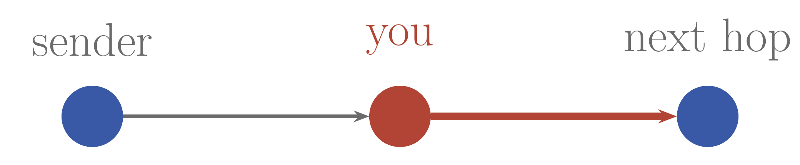
<figcaption>every hop is a real acquaintance</figcaption>

---

<!-- _class: mid -->

## How many hands?

A farmer in Omaha. A stockbroker outside Boston. Nothing in common.

How many people end up in the chain?

*Hands up: two? six? twenty? a hundred?*

---

## 160 packets, and what became of them

Of the 160 packets that went out, 64 reached the target. The rest stalled somewhere in the middle of the country.

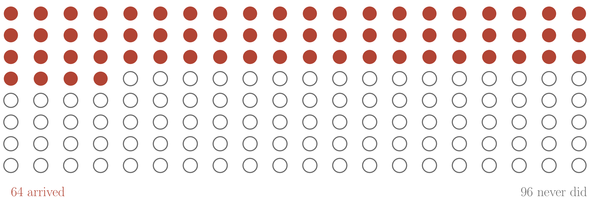
<figcaption>red: the 64 completed chains — the only ones that carry data</figcaption>

---

<!-- _class: mid -->

## The chains that made it

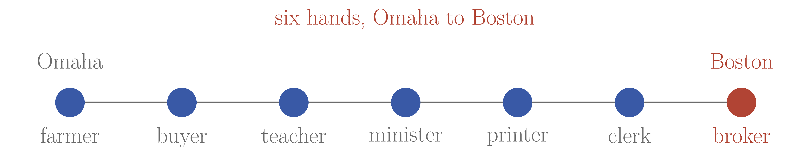
<figcaption>one packet’s route, hop by hop</figcaption>

The median completed chain ran through roughly six links. Not sixty.

---

<!-- _class: mid -->

## Milgram never said “six degrees”

The phrase belongs to the playwright **John Guare**, who used it as a title in 1990 — more than twenty years after the experiment.

Milgram reported a median chain length. The slogan did the rest of the work.

<figcaption>John Guare, who wrote the title — photo David Shankbone, CC BY 3.0</figcaption>

---

<!-- _class: mid -->

## Does it survive eight billion people?

1967: 160 letters, one target, one country.

Would the number grow if we ran it on the whole planet?

*30 seconds with your neighbour — bigger, smaller, or the same?*

---

## Email, 2003

A Yahoo study restaged the experiment by email: **more than 24,000 starters**, 18 targets in 13 countries.

* Only **384** chains completed.
* Those averaged about **four** steps.
* Correcting for the chains that died: five to seven.

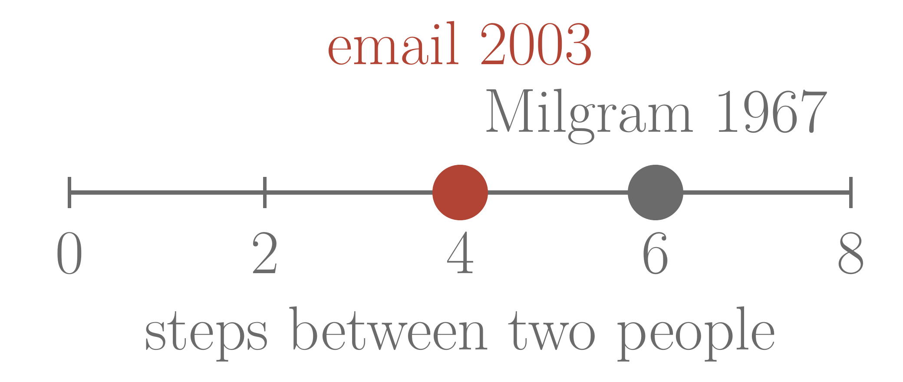
<figcaption>the new measurement, in red</figcaption>

---

## Facebook, 2012

Not a sample this time — the whole graph. **721 million** users and **69 billion** friendships, measured directly.

Average distance between two users: **4.74**.

*Check that against the number you wrote down.*

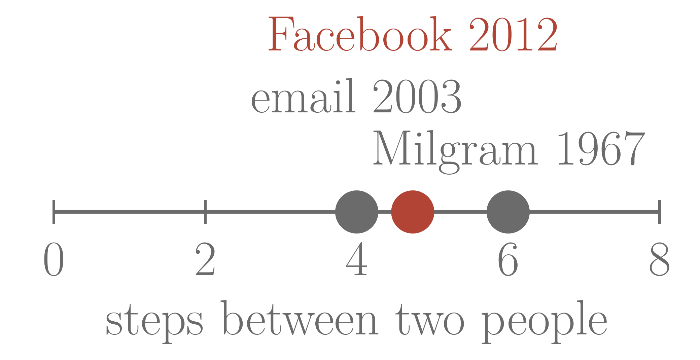
<figcaption>red: the new measurement, eight hundred times the people</figcaption>

---

## Your turn: Wikirace

Two random Wikipedia articles. Links only, no search box. Fewest clicks wins.

Play at [wiki-race.com](https://wiki-race.com) — one round, then shout out your click count.

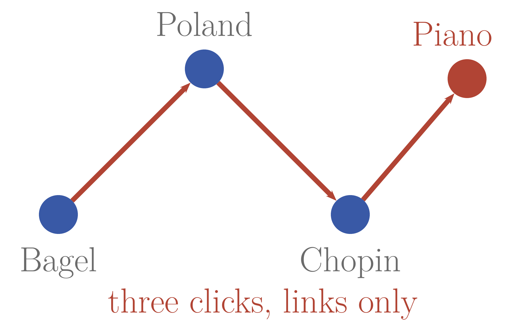
<figcaption>a route found by clicking, not by planning</figcaption>

---

<!-- _class: mid -->

## What did you just do?

You found a short route through a network of seven million articles — without ever seeing the network.

Is *finding* a short route the same as one *existing*?

*30 seconds.*

---

## What Milgram’s subjects actually did

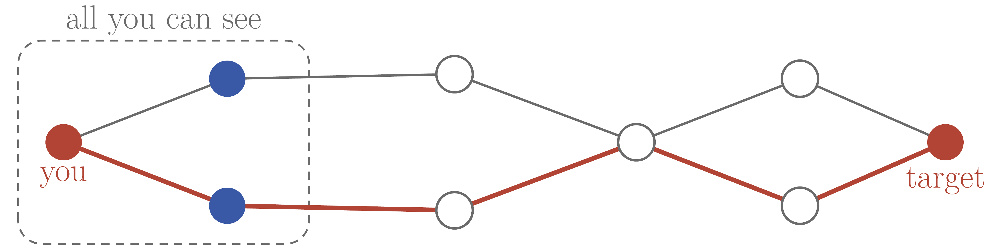
<figcaption>red: a route that exists — the dashed box is everything the start node can actually see</figcaption>

Milgram’s subjects had no map. They **routed** on local knowledge alone, which is a harder thing than short routes merely existing.

---

<!-- _class: part -->

Part Two02 / 06

## Measuring “six”

Turn the chain into a graph and count

---

<!-- _class: mid -->

## The chain is a graph

<figcaption>the same seven people from Part One</figcaption>

Each person becomes a **node**; “knows on a first-name basis” becomes an **edge**. Everything else about them is gone.

---

<!-- _class: mid -->

## Distance

The **distance** $d(i,j)$ is the number of *edges* on a shortest route between $i$ and $j$.

Not kilometres. Not people. Edges.

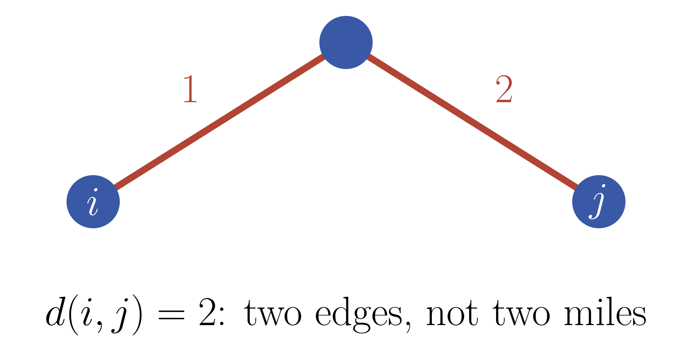
<figcaption>one shortest route, its edges numbered</figcaption>

---

## What is $d(A,G)$?

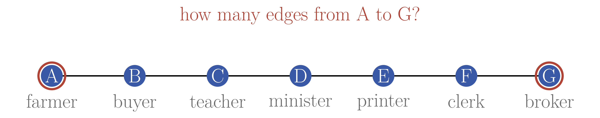
<figcaption>ringed: the two ends of the chain</figcaption>

*Count the edges out loud, together.*

---

## Count them, edge by edge

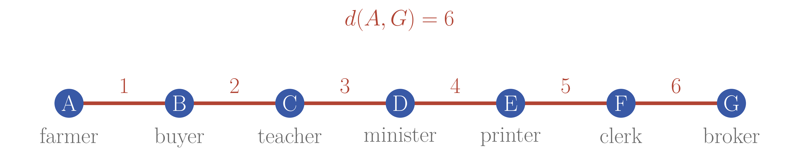
<figcaption>six edges from end to end</figcaption>

Six edges, seven people. That is the number you wrote down at the start — and the shape the phrase “six degrees” describes.

---

## A shortcut appears

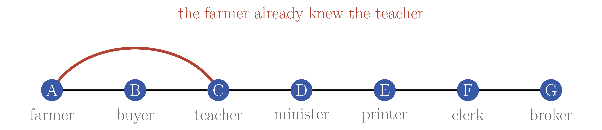
<figcaption>red: one edge that was there all along</figcaption>

It turns out the farmer already knew the teacher. One extra edge, no new people.

---

## Two routes, one distance

Now there are two ways from $A$ to $C$ — one edge, or two.

Distance takes the **minimum**. The longer route still exists; it just does not count.

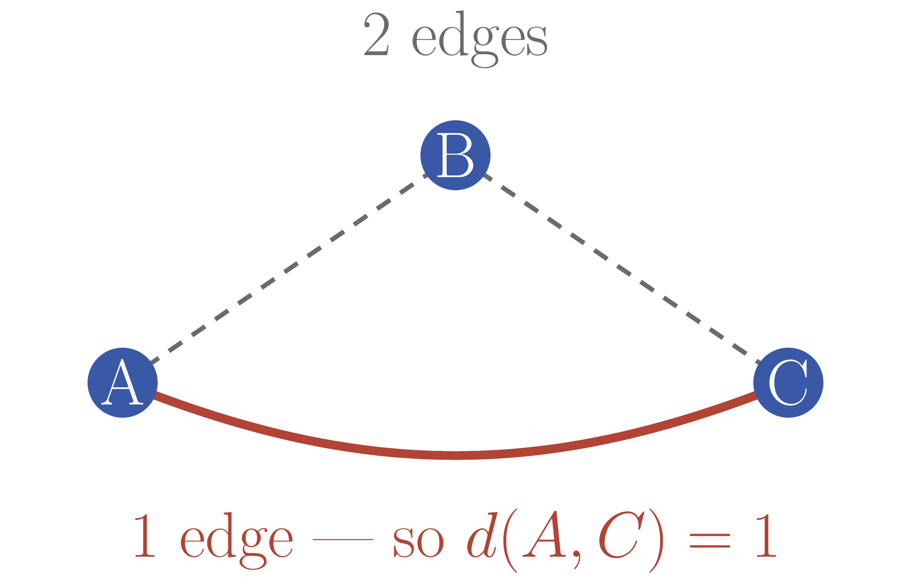
<figcaption>red: the shorter route</figcaption>

---

<!-- _class: mid -->

## One number for the whole network

Seven people make 21 pairs, and every pair has its own distance.

What single number would you report?

*30 seconds with your neighbour.*

---

## Average path length

The **average path length** $\bar L$ is the mean of $d(i,j)$ over every pair of nodes.

For the plain chain: $\bar L = 8/3 = 2.67$.

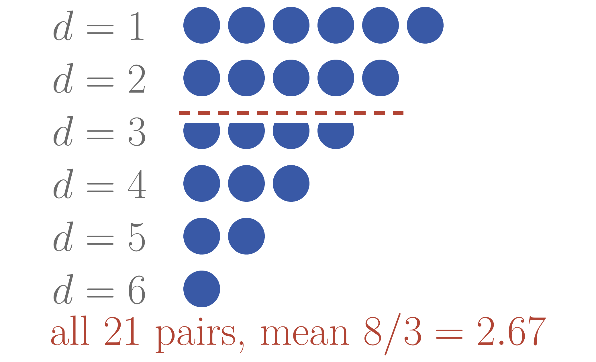
<figcaption>one dot per pair — red: the mean</figcaption>

---

## One more shortcut

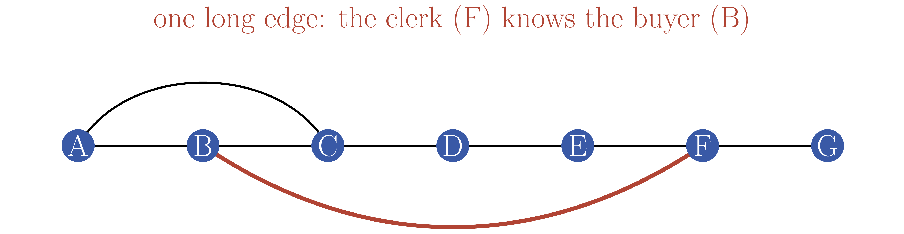
<figcaption>black: the chord from two slides ago — red: the new long edge</figcaption>

A second long edge, again with no new people. This is the whole small-world story in miniature.

---

## The average collapses

Two extra edges out of 21 pairs, and $\bar L$ falls from 2.67 to 1.81.

Notice which pairs moved: the far ones. The neighbours were already close.

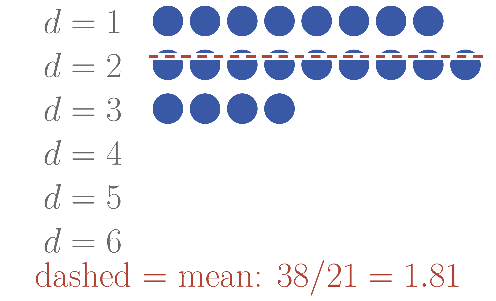
<figcaption>same axis as before — the tail is gone</figcaption>

---

## Diameter

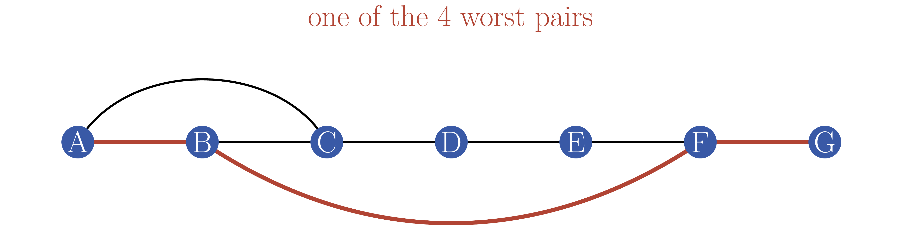
<figcaption>red: one of the four worst pairs</figcaption>

The **diameter** is the largest distance in the network — the worst case, not the average.

---

## Your turn: worksheet A

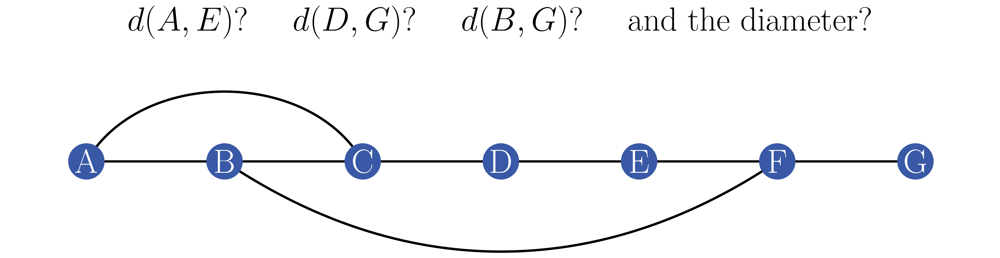
<figcaption>the acquaintance network, unlabelled</figcaption>

On paper: the three distances above, then the diameter of the whole network. *Four minutes.*

---

## Worksheet A — check

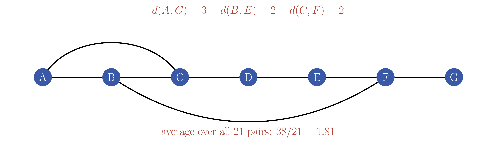
<figcaption>the four answers, on the network</figcaption>

The diameter is the largest distance in the whole network — not the largest of the three you just computed.

---

<!-- _class: part -->

Part Three03 / 06

## The other half

Short routes are only half of what makes a small world

---

<!-- _class: mid -->

## Do your friends know each other?

Pick two of your friends at random.

What are the odds that those two know each other?

*Compare with your neighbour — is your answer near zero, or nowhere near?*

---

<!-- _class: mid -->

## Triangles

Three nodes, all three edges present: a **triangle**.

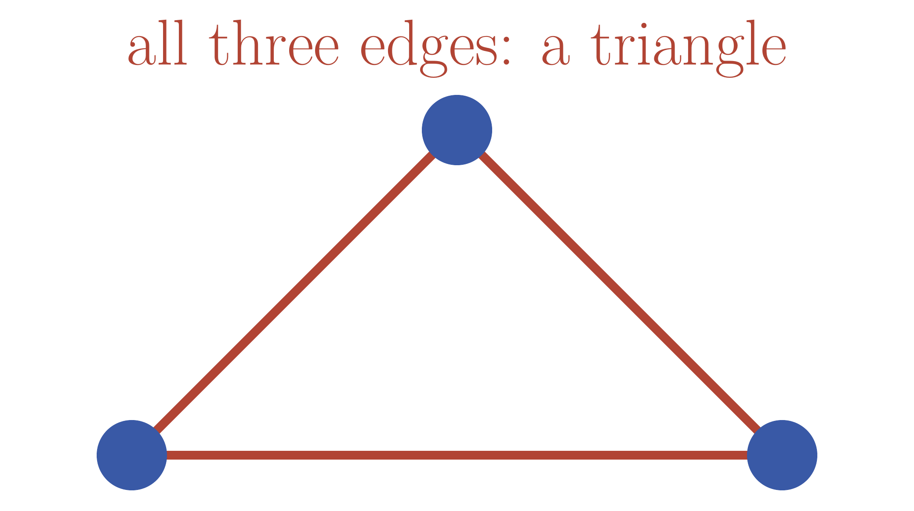
<figcaption>the smallest closed thing a network can hold</figcaption>

---

## Open and closed triplets

Two edges meeting at a node form a **triplet**, counted at that shared **centre** node.

Closed if the third edge is there, open if it is not.

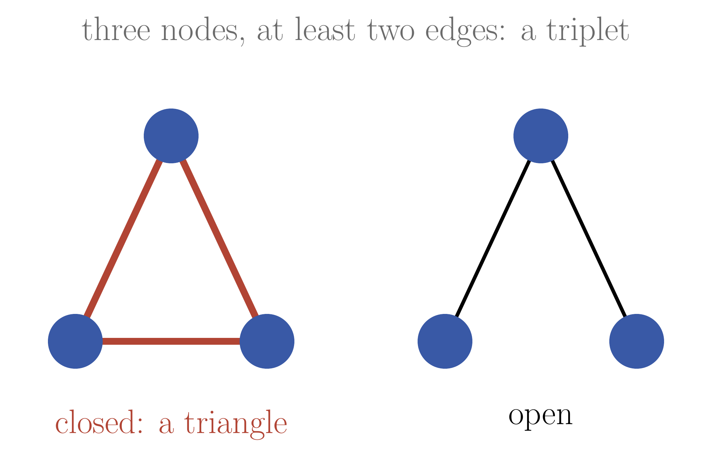
<figcaption>ringed: the centre node of each triplet</figcaption>

---

## Counting a triangle’s triplets

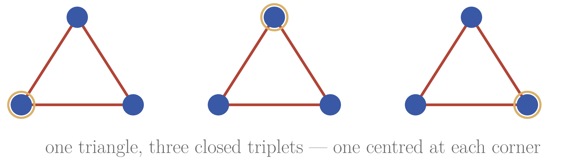
<figcaption>ringed: the triplet’s centre</figcaption>

Which is why counting triangles network-wide multiplies each one by three.

---

## One neighbourhood

Node $A$ has five friends.

The question is not about $A$’s edges. It is about the edges among those five.

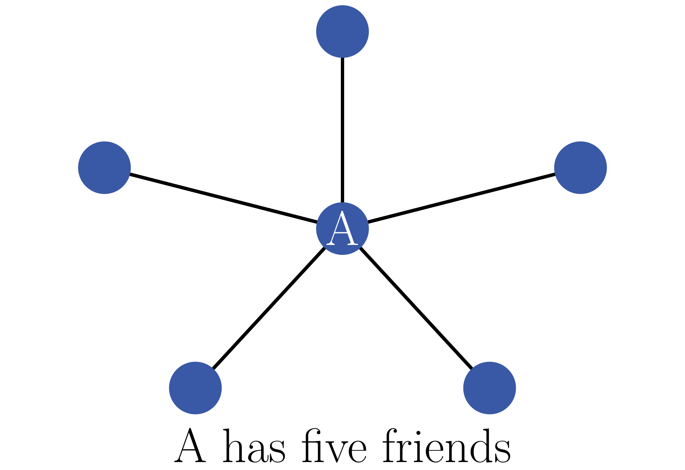
<figcaption>five friends, no links between them drawn yet</figcaption>

---

## How many pairs could be linked?

Every dashed line is a friendship that *could* exist among $A$’s five friends.

*Take 20 seconds — no formula, just count.*

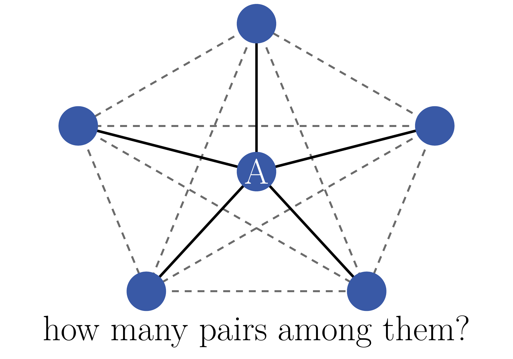
<figcaption>count them</figcaption>

---

## Every pair that could exist

With $k$ friends there are

$$ \binom{k}{2} = \frac{k(k-1)}{2} $$

possible edges among them.

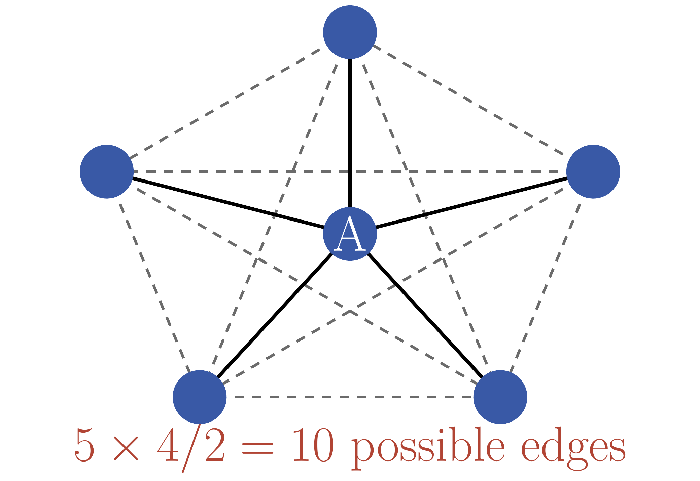
<figcaption>the dashed lines are possibilities, not edges</figcaption>

---

## Local clustering coefficient

$$ C_i = \frac{\text{edges among } i\text{'s neighbours}}{k_i(k_i-1)/2} $$

* Count the edges that do exist among the neighbours, then divide by every pair that could have been there.

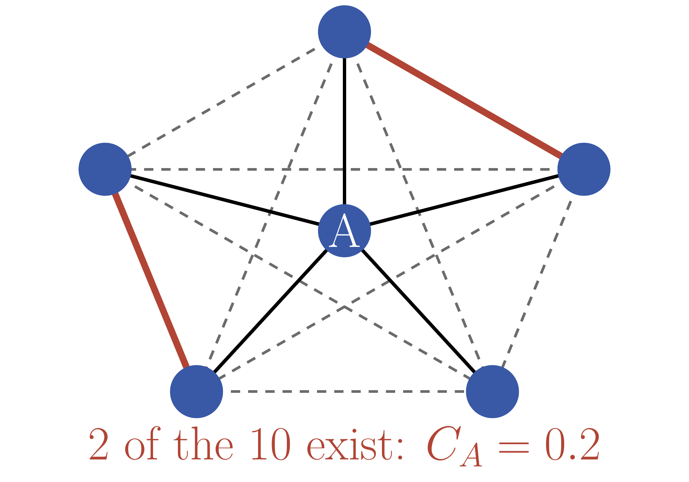
<figcaption>red: the two that exist — gray: the eight that do not</figcaption>

---

<!-- _class: mid -->

## Back to the matrix

In Module 01 we found that $(\mathbf{A}^2)_{ij}$ counts walks of length two from $i$ to $j$.

So what does the *diagonal* entry $(\mathbf{A}^3)_{ii}$ count?

*30 seconds.*

---

## Walking back to where you started

A closed 3-walk from $i$ can only be a triangle through $i$ — and every triangle can be walked two ways.

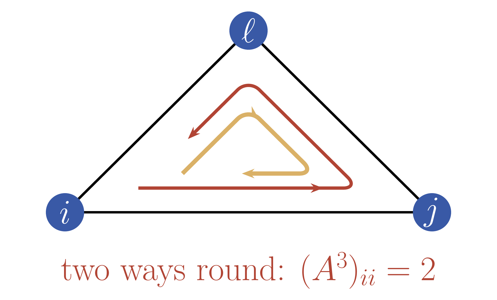
<figcaption>two closed walks, one arrow each way round</figcaption>

---

## Clustering, in matrix form

Each triangle is counted twice, and the denominator doubles to match:

$$ C_i = \frac{(\mathbf{A}^3)_{ii}}{k_i(k_i-1)} $$

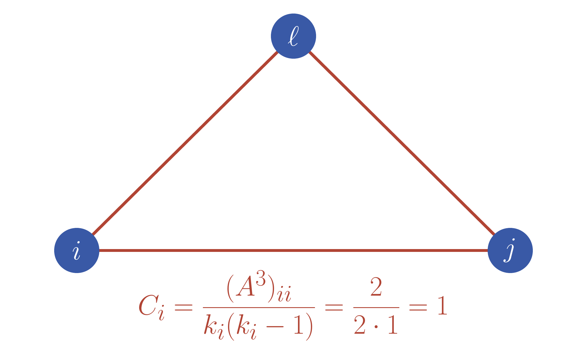
<figcaption>one triangle, degree two</figcaption>

---

## Averaging over nodes

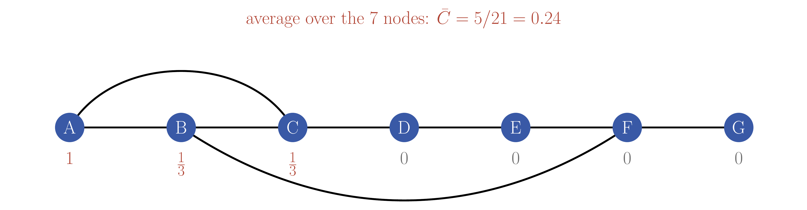
<figcaption>the seven people from Part One, again</figcaption>

The **average local clustering** $\bar C = \frac{1}{n}\sum_i C_i$ gives every node the same weight — hub or leaf. $G$ has one friend and so no pairs at all; we count it as zero here.

---

## A windmill

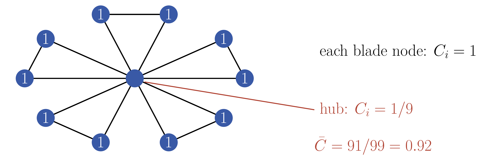
<figcaption>ten blade nodes, one hub</figcaption>

* Every blade node sees a perfectly closed neighbourhood; the hub sees almost none.

---

<!-- _class: mid -->

## Is 0.92 a fair summary?

Ten nodes with $C_i = 1$ outvote one hub with $C_i = 1/9$.

Would you call this network 92% clustered?

*Turn to your neighbour. What is the average hiding?*

---

## Global clustering

Count objects instead of averaging nodes: $C = 3 \times \#\text{triangles} \,/\, \#\text{triplets}$.

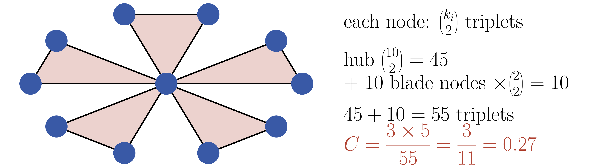
<figcaption>each shaded wedge is one triangle; the 3 counts it once per corner</figcaption>

---

## Two answers, one network

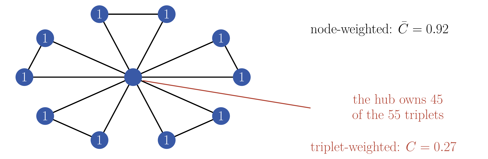
<figcaption>gray: the node-weighted answer — red: the triplet-weighted one</figcaption>

* $\bar C$ weights nodes: the blades outvote the hub.
* $C$ weights triplets: the hub owns most of them.

---

## Your turn: worksheet B

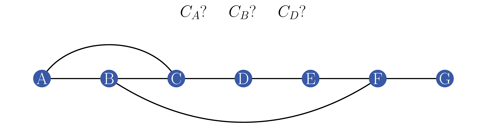
<figcaption>the same acquaintance network</figcaption>

On paper: the local clustering coefficient of the three nodes named above. *Four minutes.*

---

## Worksheet B — check

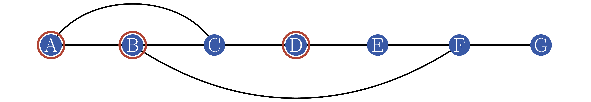

* $C_A = 1$ — both of $A$’s friends know each other
* $C_B = 1/3$ — one of $B$’s three pairs is closed
* $C_D = 0$ — $D$’s friends are strangers

---

<!-- _class: part -->

Part Four04 / 06

## The yardstick

High and short compared to *what*?

---

## The paradox

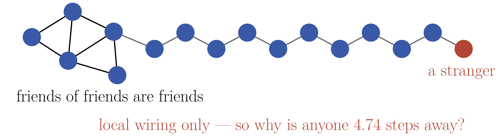
<figcaption>black: your dense local neighbourhood — gray: the long way out</figcaption>

High clustering means your edges stay local. Local wiring should put the far side of the world many, many hops away. Facebook measures 4.74.

---

<!-- _class: mid -->

## Score it naively

Small-world means high $\bar C$ and low $\bar L$, so try the obvious index:

$$ s = \bar C / \bar L \qquad \text{high is small-world?} $$

*30 seconds: find a network that breaks this.*

---

## Score the complete graph

Join every pair, and the naive index hits $s = 1$ — the largest value it can take.

For the least interesting network there is.

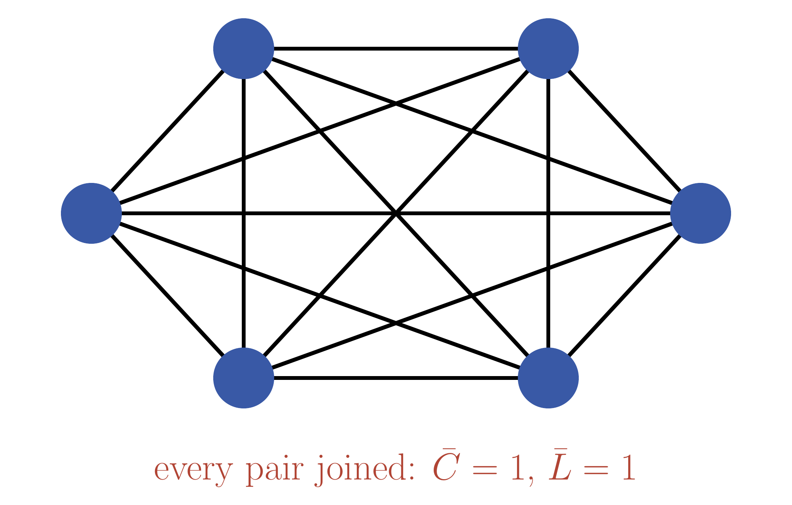
<figcaption>maximum score, zero insight</figcaption>

---

## Erdős–Rényi $G(n,p)$

So we need a structureless network of the same size to compare against.

Take $n$ nodes and connect each pair independently with probability $p$.

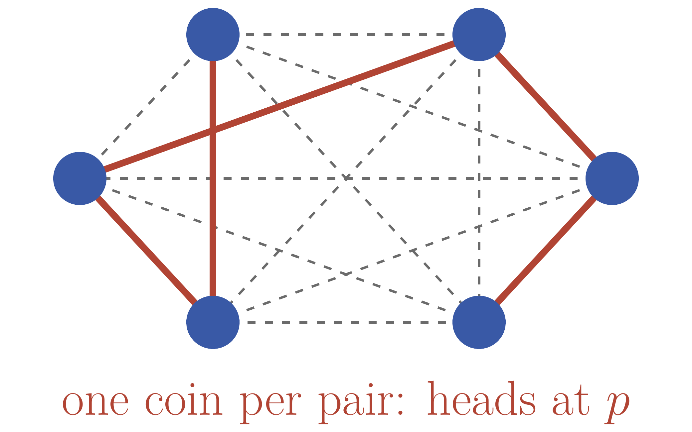
<figcaption>red: the pairs whose coin came up heads</figcaption>

---

<!-- _class: mid -->

## What is $C_i$ in a random graph?

Node $i$ has $k$ neighbours, so $k(k-1)/2$ pairs among them.

What fraction of those pairs do you expect to be linked?

*30 seconds. Does the answer depend on $k$?*

---

## One coin per pair

Each neighbour pair is its own independent coin, with the same $p$ as every other pair.

So the fraction of them you expect to be linked is just $p$ — whatever the degree.

$$ C_{\mathrm{rand}} = p $$

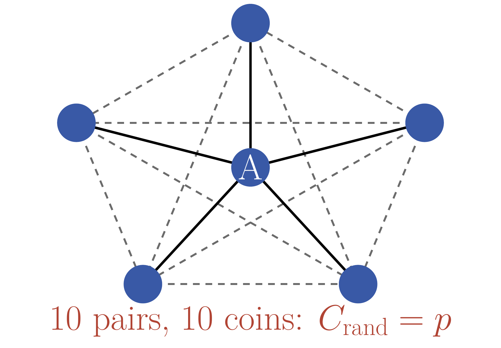
<figcaption>ten pairs, ten independent coins</figcaption>

---

## From $p$ to a number you can measure

A node has $n-1$ coins of its own, one for every other node, so its **average degree** is $\langle k \rangle = p(n-1)$.

Turn that around and the baseline is written in something you can count on a real network:

$$ C_{\mathrm{rand}} = \frac{\langle k \rangle}{n-1} $$

<figcaption>the same coins, counted one node at a time</figcaption>

---

<!-- _class: mid -->

## How far can 150 friends reach?

Everyone on Earth has about 150 acquaintances, wired at random.

After $L$ steps, how many people have you reached?

*30 seconds — say it as a formula, not a number.*

---

## The fan-out

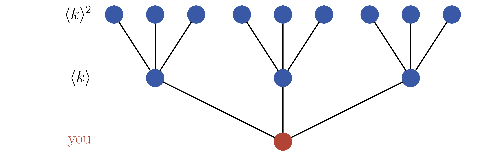
<figcaption>one step reaches k friends, two steps k squared</figcaption>

In a sparse random graph you almost never come back to someone you have met, so the count multiplies at every step.

---

## Where the fan-out meets eight billion

Set $\langle k \rangle^L = n$ and solve: $L_{\mathrm{rand}} \approx \ln n / \ln \langle k \rangle$.

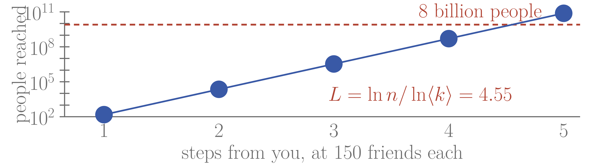
<figcaption>red: the world’s population, at 150 friends each</figcaption>

---

## Short is free. Clustered is not.

Randomness hands you short routes for nothing — and hands you almost no triangles, because $C_{\mathrm{rand}} = \langle k \rangle/(n-1)$ goes to zero as the network grows.

That is why the two properties together are surprising, and why $\bar L$ alone proves nothing.

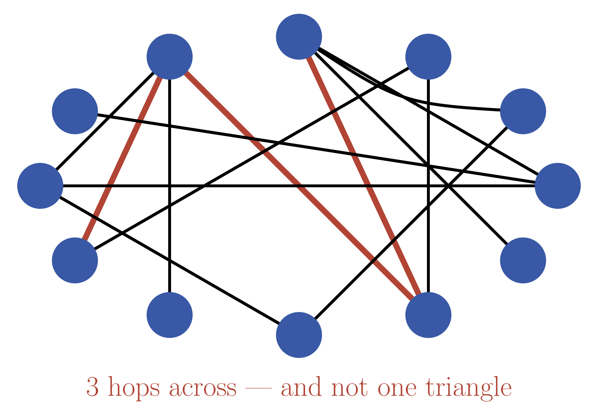
<figcaption>twelve nodes wired at random</figcaption>

---

<!-- _class: mid -->

## The small-world index

Normalise both halves against that random baseline. The $\bar C$ here is the average local clustering, not the transitivity.

$$ \sigma = \frac{\bar C / C_{\mathrm{rand}}}{\bar L / L_{\mathrm{rand}}} $$

$\sigma > 1$ is a small world; $\sigma \approx 1$ is random-like.

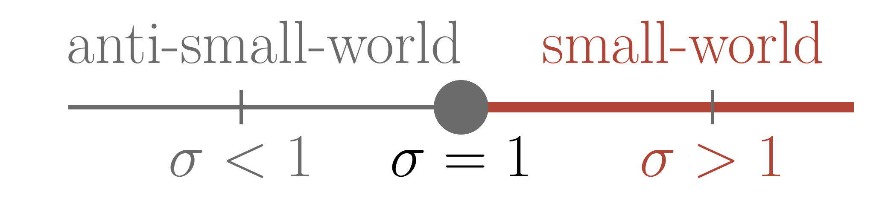
<figcaption>red: the small-world side of 1</figcaption>

---

## Your turn: three real networks

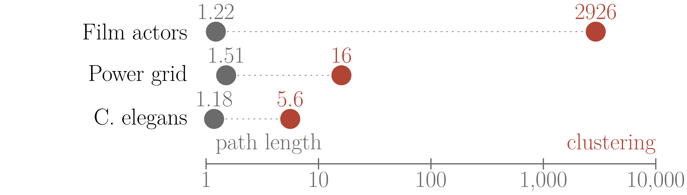
<figcaption>gray: the path-length ratio — red: the clustering ratio, log axis</figcaption>

Pick one row. Read both ratios off the axis and compute $\sigma$ yourself. *Two minutes.*

---

## Your $\sigma$, checked

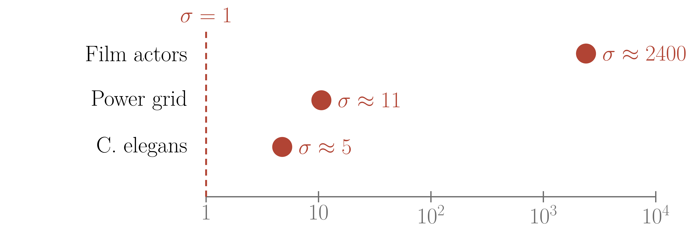
<figcaption>every network sits far to the right of the random baseline</figcaption>

Path length is barely 1.2–1.5 times the random baseline. Clustering is 6 to 3000 times it. That gap *is* the small-world property.

---

<!-- _class: part -->

Part Five05 / 06

## The mechanism

“What I cannot create, I do not understand” — Feynman

---

<!-- _class: mid -->

## Could you build one?

Measuring a property is not explaining it. So build a network that has both.

High clustering *and* short routes. What is your first move?

*Turn to your neighbour — 60 seconds, then we try the two obvious answers.*

---

## Obvious answer 1: wire locally

Put $n$ nodes on a ring and join each to its **4 nearest neighbours**. Neighbours share neighbours, so triangles are everywhere.

$\bar C = 0.5$ — as clustered as a real friendship network.

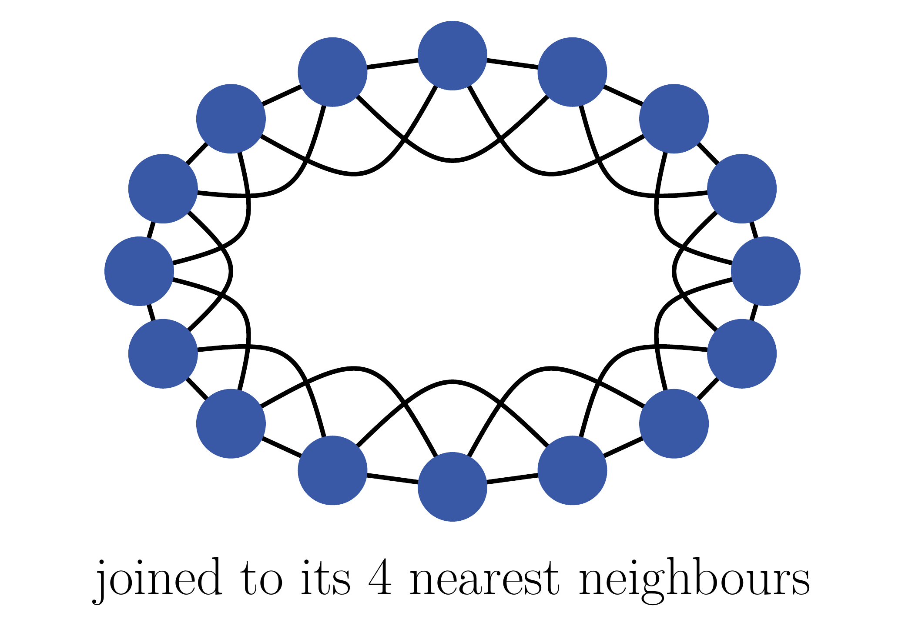
<figcaption>every edge is short</figcaption>

---

## Now walk across it

Crossing a ring lattice means walking around it, two nodes at a time.

* 16 nodes: 4 hops to the far side.
* 1000 nodes: $\bar L \approx 125$.
* Distance grows linearly with $n$ — the opposite of what we measured.

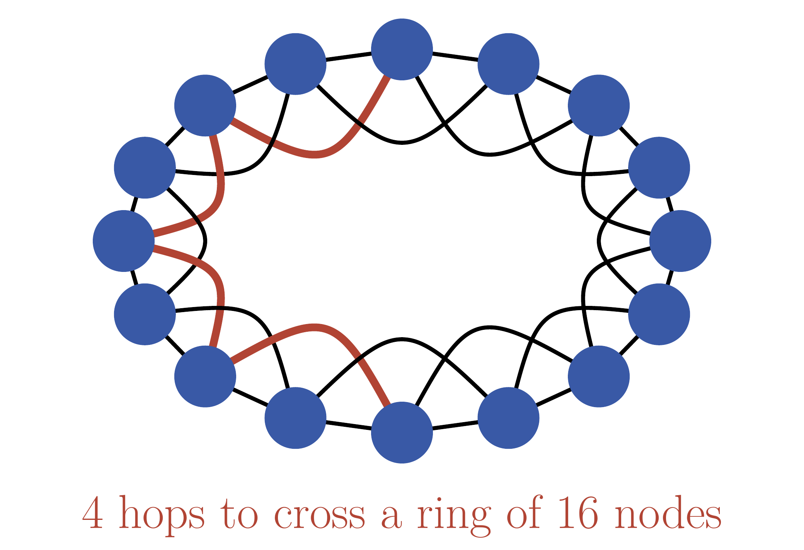
<figcaption>red: the longest shortest route</figcaption>

---

## Obvious answer 2: wire at random

Same nodes, same number of edges, shuffled.

* Routes get short immediately, and the clustering falls with them: 0.50 to 0.24 — at sixteen nodes, only a halving.
* Grow the network and the random baseline goes to nothing, while the ring stays at 0.50 forever.

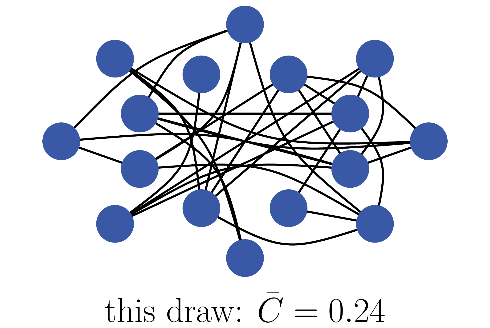
<figcaption>short routes, and half the closure</figcaption>

---

## The trade-off

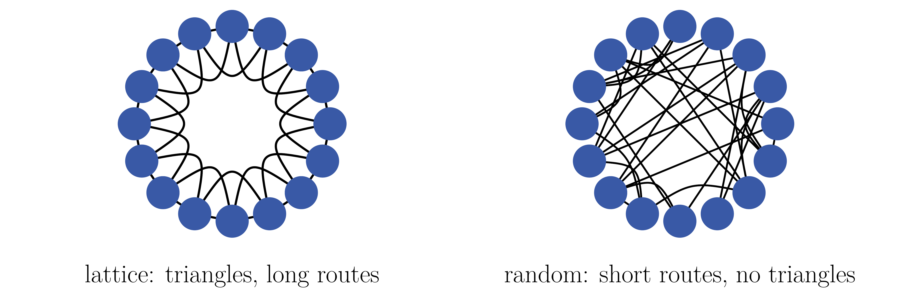
<figcaption>the two extremes, same nodes and same edge count</figcaption>

Each extreme buys one property with the other. Real networks refuse to choose — so the answer must be somewhere in between.

---

<!-- _class: mid -->

## How would you cheat?

You are holding the lattice. You want to keep its triangles and shorten its routes.

What is the cheapest edit you can make?

*30 seconds — how many edges would you touch?*

---

## Rewire with probability $p$

Walk the lattice edge by edge. With probability $p$, detach one end and reattach it to a node chosen at random.

* $p = 0$ leaves the lattice untouched.
* $p = 1$ destroys it completely.

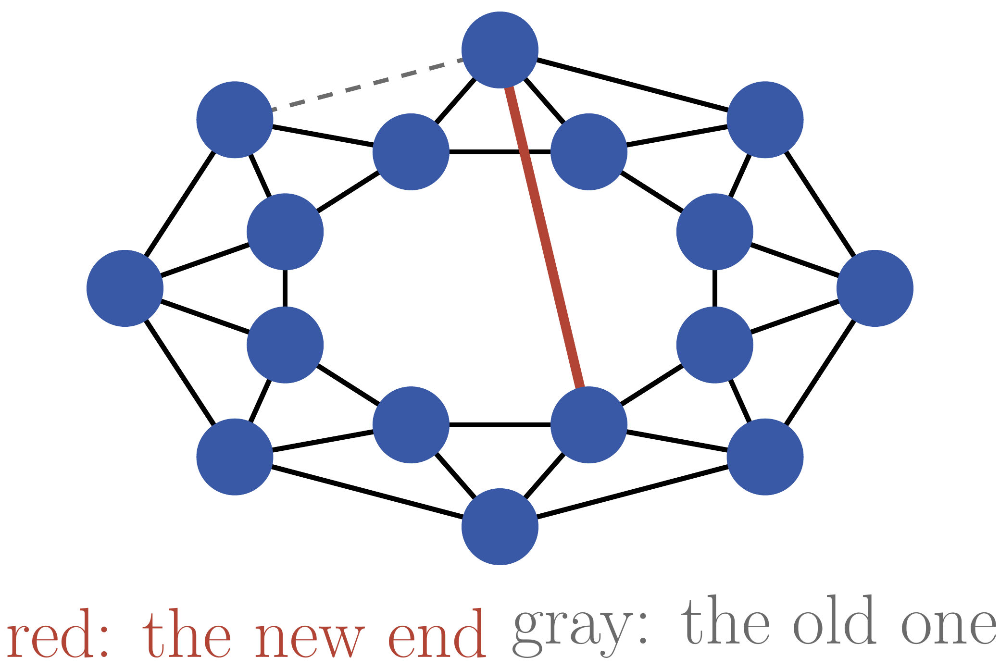
<figcaption>one edge moved, the rest untouched</figcaption>

---

## Watch it happen

Six edges move. The ring survives; a handful of long chords now cut across it.

Each red chord is one friendship that happens to reach far — the friend who moved abroad.

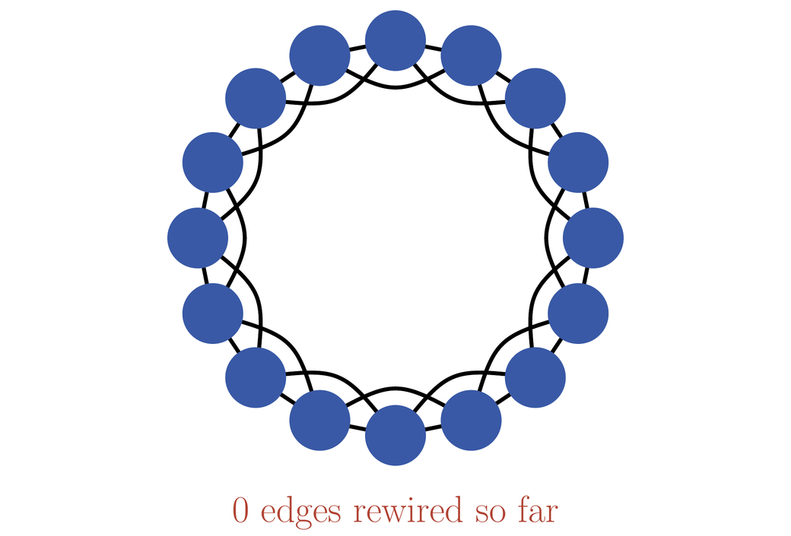
<figcaption>one rewiring per frame</figcaption>

---

<!-- _class: mid -->

## Predict the two curves

Sweep $p$ from 0 to 1 and track clustering and path length, each against its lattice value.

Do $C$ and $L$ fall together, or does one go first?

*Sketch both curves in your notes before the next slide.*

---

## The two curves, measured

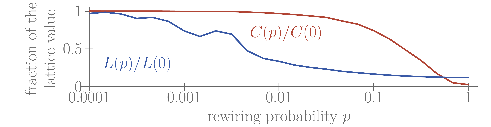
<figcaption>measured on 400 nodes, averaged over six runs</figcaption>

$L$ collapses while $C$ is still essentially untouched. A few random edges are enough to shorten everything, and far too few to break the triangles.

---

## The small-world band

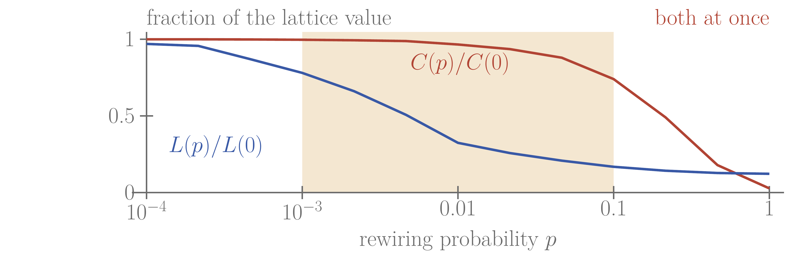
<figcaption>gold: paths at most half the lattice’s, clustering still four-fifths of it</figcaption>

By the time the routes have halved, clustering has lost about one per cent. Ask for both at once — paths at most half, clustering still four-fifths — and the band spans a factor of five in $p$.

---

## Why shortcuts are so cheap

One long edge serves an entire arc of nodes at once, and it costs at most a couple of triangles.

That asymmetry is the whole mechanism.

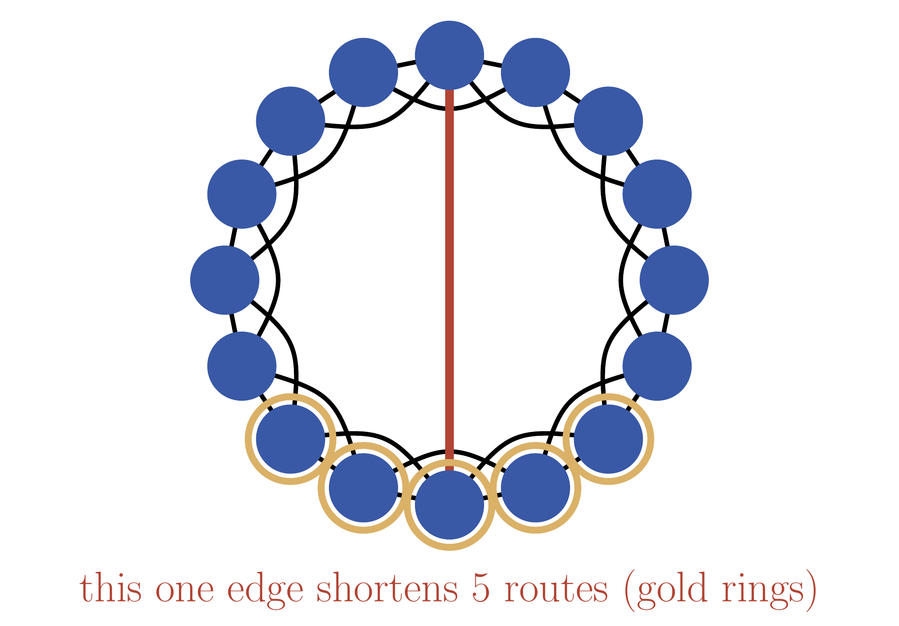
<figcaption>the lattice underneath is untouched</figcaption>

---

## Your turn: drag $p$ yourself

Open the Watts–Strogatz widget in the Module 02 notebook and sweep $p$ by hand.

Find the smallest $p$ where $L$ has already collapsed and $C$ has not.

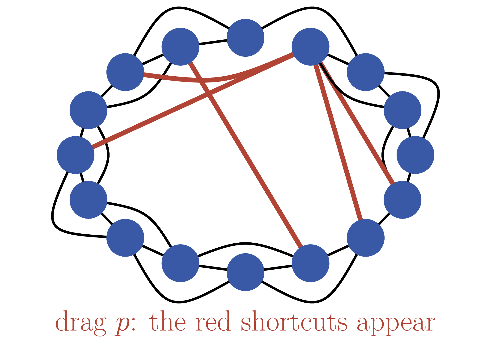
<figcaption>the ring at fourteen percent rewiring</figcaption>

---

<!-- _class: part -->

Part Six06 / 06

## Edge cases, and what survives them

The networks that break the definitions — and the one signature that does not break

---

<!-- _class: mid -->

## What if two nodes are not connected?

$\bar L$ averages $d(i,j)$ over every pair. This network has pairs with no route between them at all.

*30 seconds — what should the average do with those pairs?*

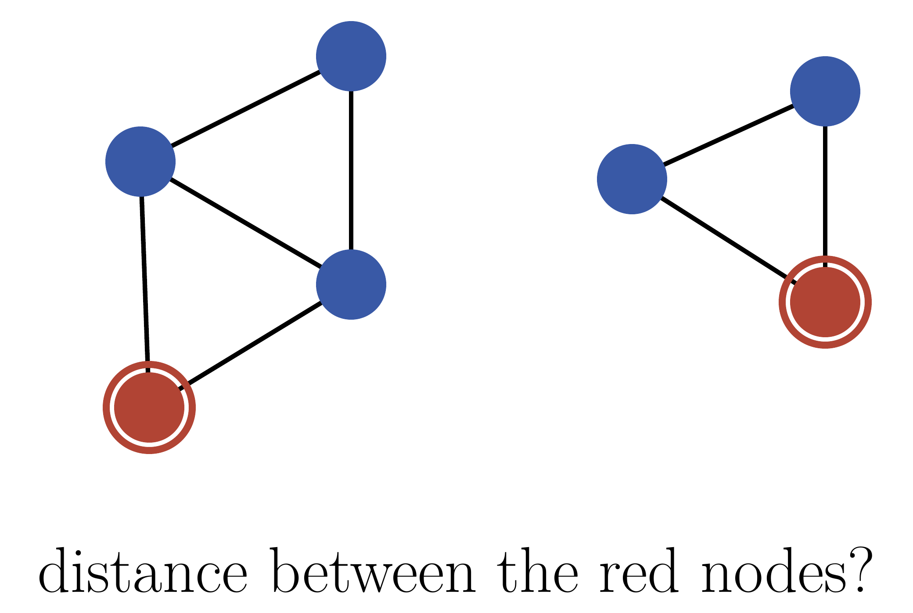
<figcaption>ringed: one such pair</figcaption>

---

## What the average does with it

One unreachable pair makes $\bar L$ infinite, however short everything else is.

So in practice we measure on the **largest connected component**, and say that we did.

It is the convention behind Facebook’s 4.74 — that average is over their largest component too.

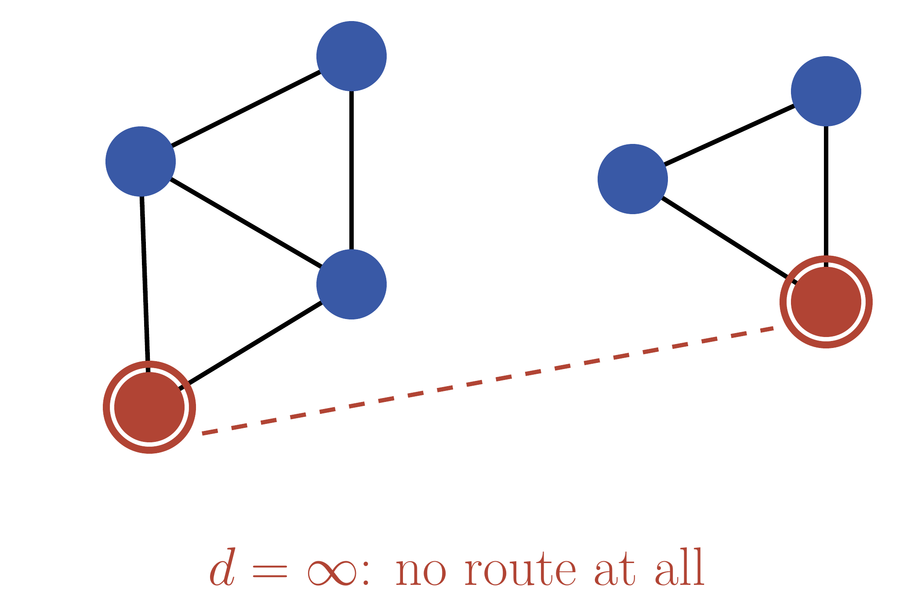
<figcaption>two components, and no edge between them</figcaption>

<!--
The other convention is the harmonic mean — average 1/d instead of d, so an unreachable pair contributes 0 rather than infinity. That quantity is called efficiency. Mention it only if someone asks; it needs a visual we do not have here.
-->

---

<!-- _class: mid -->

## The zero we have been using

$C_i$ divides by $k_i(k_i-1)/2$ — the number of pairs among the neighbours.

We have been counting degree-one nodes as zero since Part Three.

*Is that a fact, or a choice? 30 seconds with your neighbour.*

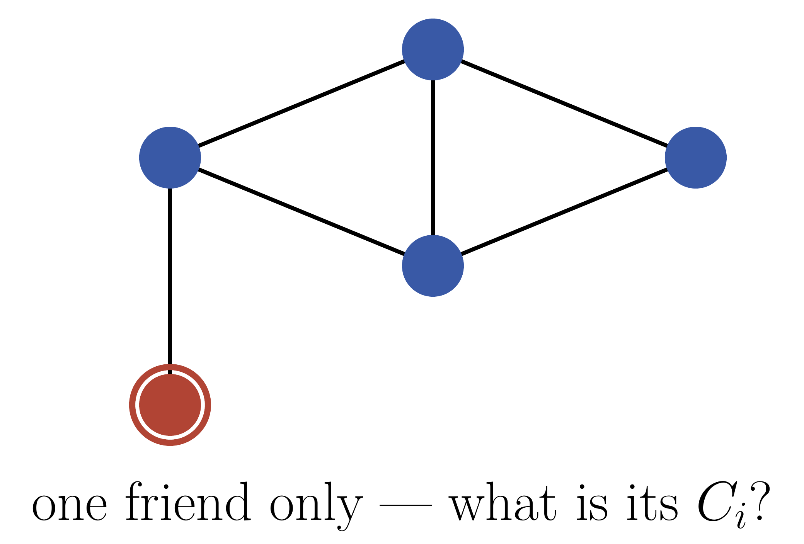
<figcaption>ringed: degree one</figcaption>

---

## Look at the denominator

No pairs among the neighbours, so numerator and denominator are both zero. $C_i$ is genuinely **undefined**.

* The usual convention: set it to zero.
* That drags $\bar C$ down in networks full of leaves.

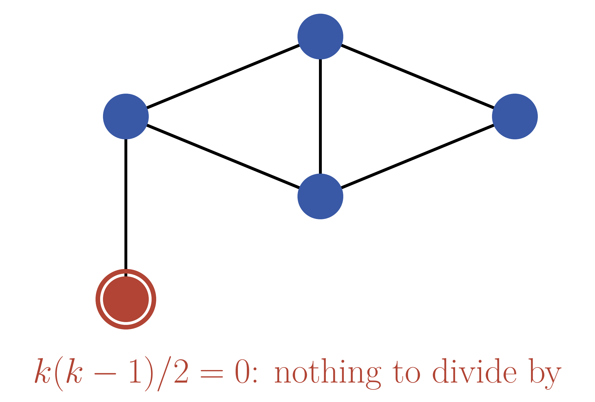
<figcaption>a leaf — and real networks are full of them</figcaption>

---

<!-- _class: mid -->

## Is any real network anti-small-world?

$\sigma < 1$ needs long routes *and* clustering below the random baseline.

The ring lattice has the long routes. Is it enough?

*30 seconds — which half of the ratio wins?*

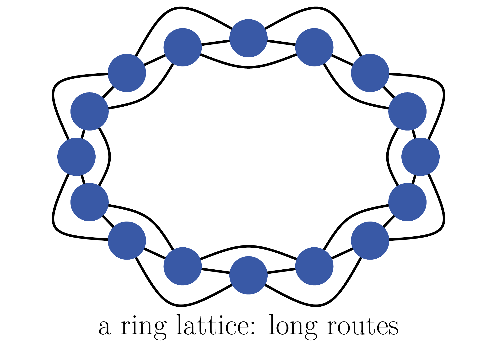
<figcaption>sixteen nodes, four neighbours each</figcaption>

---

## Score the ring lattice

$\sigma > 1$: the ring lattice’s clustering advantage beats its distance penalty.

$\sigma \approx 5$ for a ring of a thousand nodes; even the 16-node ring scores 1.56.

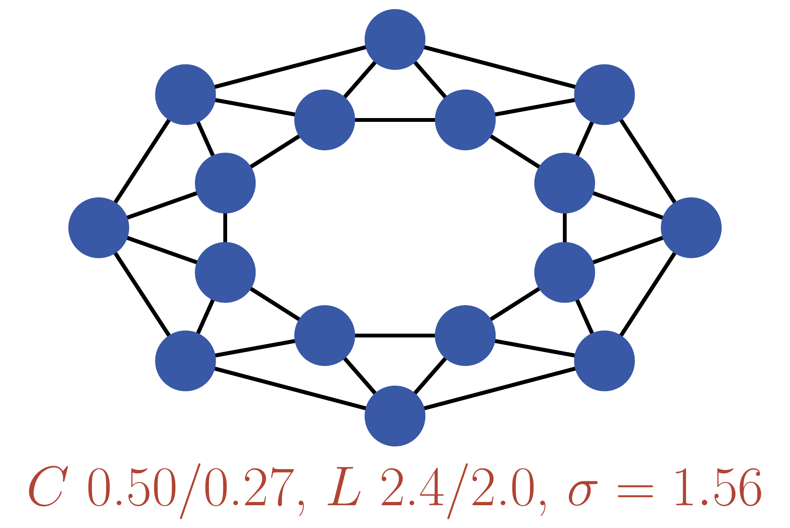
<figcaption>clustering wins the ratio, even here</figcaption>

---

## You have to kill the triangles

You need clustering under the random baseline — and random is already near zero.

Count the triplets centred on one intersection. How many are closed?

*60 seconds on paper.*

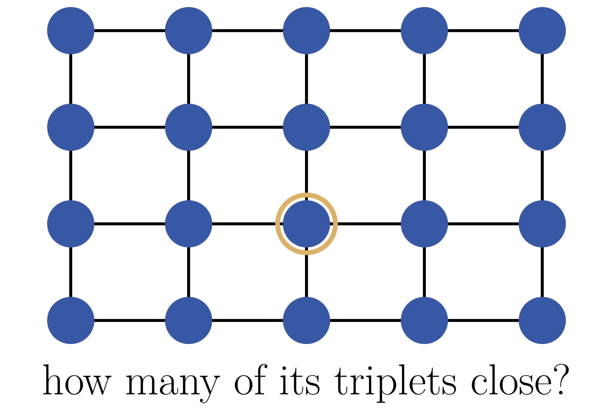
<figcaption>gold: the intersection to count around</figcaption>

---

## What the six triplets do

An intersection has four neighbours, so $\binom{4}{2} = 6$ triplets are centred on it — and no two of those four are joined to each other.

Nothing closes. $C = 0$, and $\sigma = 0$ with it.

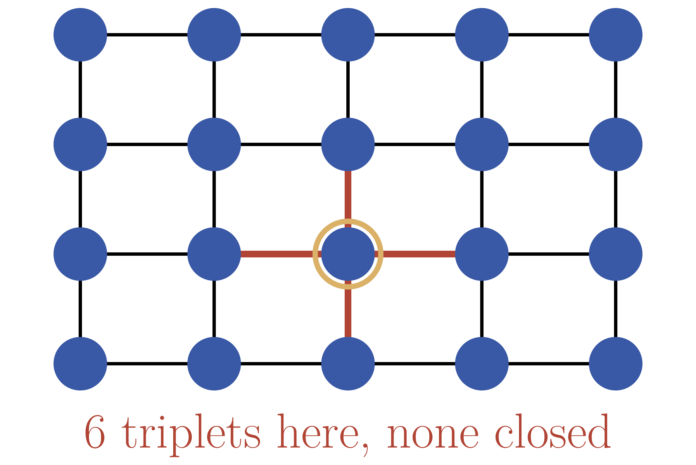
<figcaption>red: the four edges whose pairs are the six triplets</figcaption>

---

<!-- _class: mid -->

## $G(n,m)$ or $G(n,p)$ — the same thing?

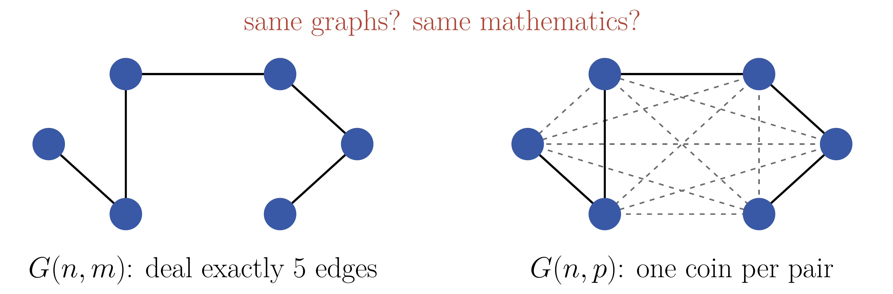
<figcaption>two recipes for “a random graph”</figcaption>

*30 seconds: does it matter which one you normalise against?*

---

## Where the two recipes part

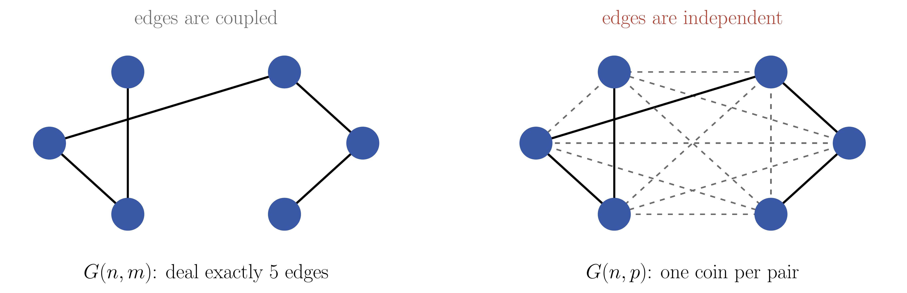
<figcaption>dashed: the pairs whose coin came up tails</figcaption>

Fix $m$ and the edges stop being independent: using one up makes the rest less likely — and independence is what let us write $C_{\mathrm{rand}} = p$.

---

## The same signature everywhere

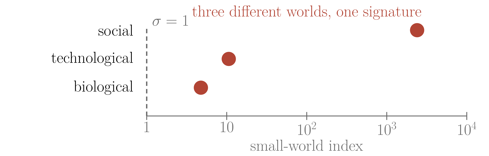
<figcaption>the three networks of Watts and Strogatz, by domain</figcaption>

Film collaborations, a power grid, and a worm’s nervous system. Nothing social connects them — and all three are small worlds.

---

## One map

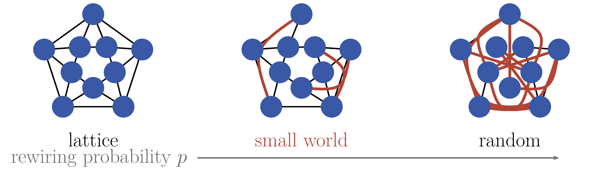
<figcaption>red: the rewired edges</figcaption>

Turn $p$ up from zero: the lattice keeps its triangles long after its routes have collapsed. The whole module sits on that one axis.

---

## Module 02 review

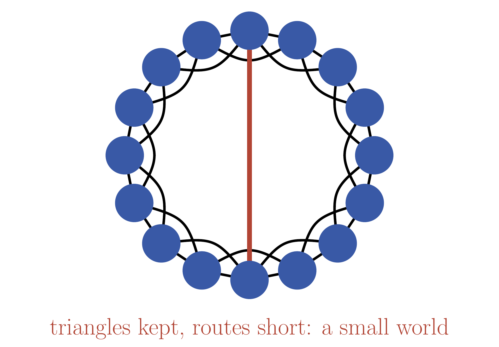
<figcaption>a lattice with a few shortcuts</figcaption>

Measure $\bar L$, $\bar C$ and $\sigma$ on a real network in the Module 02 notebook.

* **Distance:** $d(i,j)$, then $\bar L$ and the diameter
* **Clustering:** $C_i$, then $\bar C$ and transitivity $C$
* **$\sigma$:** both halves against a random graph of the same size
* **Watts–Strogatz:** a few shortcuts buy short routes

---

## Coming up in Module 03

### Robustness

The world is small because of a handful of long edges.

So what happens when they break — by accident, or because someone picked them out?

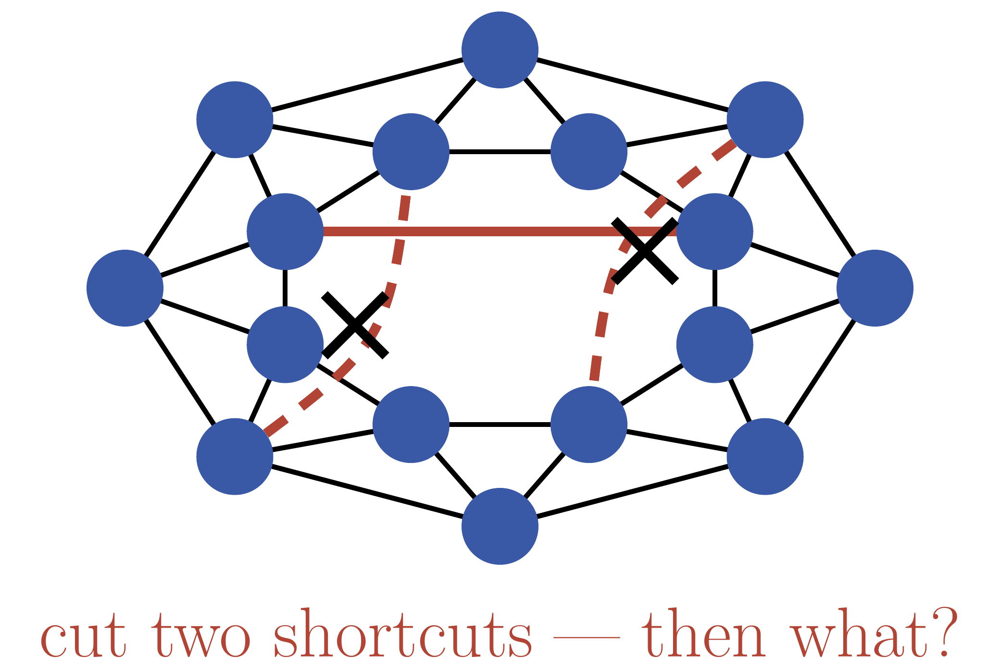
<figcaption>three shortcuts, two of them cut</figcaption>

