<!-- _class: lead -->

Advanced Topics in Network Science · Module 03

# Build it, Break it

The cheapest grid is the easiest one to destroy

Sadamori Kojaku · Binghamton University

<!--
Open with Moravia, not with definitions. The whole module is one story told three times: build the cheapest grid, break it, work out the law that governs the breaking.
-->

---

<!-- _class: mid -->

## The question for today

How much of a network can you destroy before it falls apart — and does it matter whether the damage is random or deliberate?

Hold a guess. A number, out loud, before we start.

<!--
Do not answer this. Part Five answers it with one formula; Part Six shows the answer depends entirely on who is doing the damage.
-->

---

## Roadmap for today

01

The cheapest grid — Moravia, 1926, and the minimum spanning tree

02

Greedy — Kruskal, Prim, and why the obvious rule wins here

03

Break it — one town goes dark, and the grid splits

04

Percolation — puddles, and a transition that arrives all at once

05

The formula — $\kappa$, branching, and the critical fraction $f_c$

06

Robust yet fragile — and what you would build instead

07

Edge cases — the graphs that test the law

---

<!-- _class: part -->

Part One01 / 07

## The cheapest grid

Post-war Moravia has no electricity and no money

---

## Moravia, 1919

Czechoslovakia is one year old. Its eastern lands are dark, and every crown spent on cable is a crown not spent on a hospital.

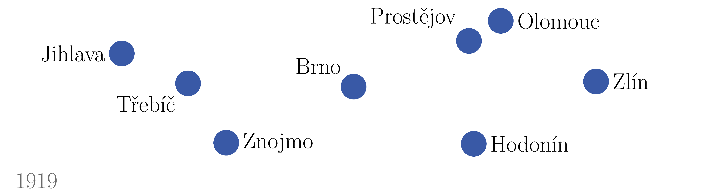
<figcaption>eight towns, no grid, no budget</figcaption>

<!--
Real place, real date. The engineers at the West Moravian Power Company have to connect all of these towns and cannot afford a metre of spare cable.
-->

---

## The problem reaches a mathematician

A friend at the West Moravian Power Company carries the question to **Otakar Borůvka**.

His 1926 paper *O jistém problému minimálním* is the first solution — and the birth of the **minimum spanning tree** problem.

We come back to how *he* solved it at the end of Part Two.

<figcaption>Otakar Borůvka, 1899–1995</figcaption>

---

## Erase the map

Rivers, roads, borders, town size — none of it changes which cables you should lay. Keep the towns.

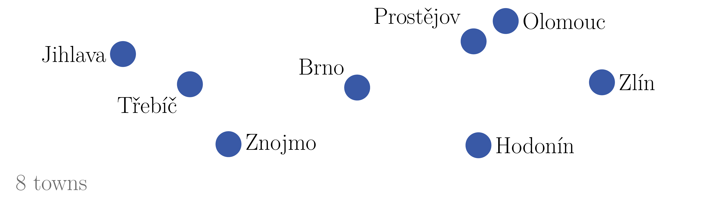
<figcaption>eight dots is all the geography we need</figcaption>

---

## Draw what could be built

Not every pair of towns is worth a cable. Thirteen routes are plausible — the rest run through mountains or double back.

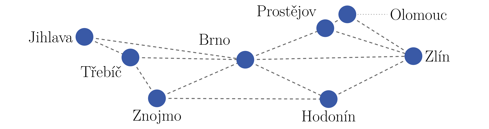
<figcaption>thirteen candidate routes</figcaption>

---

## Each route has a price

Put the kilometres on the line. Edges now carry numbers: this is a **weighted network**.

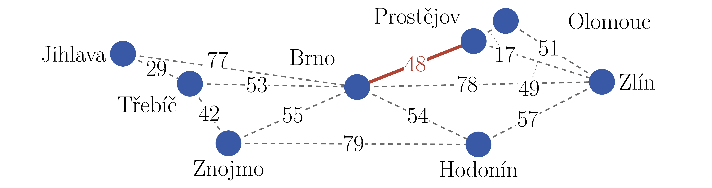
<figcaption>weight = kilometres of cable</figcaption>

---

<!-- _class: mid -->

## The engineer's question

Connect all eight towns. Which cables do you lay, and what is the least total length?

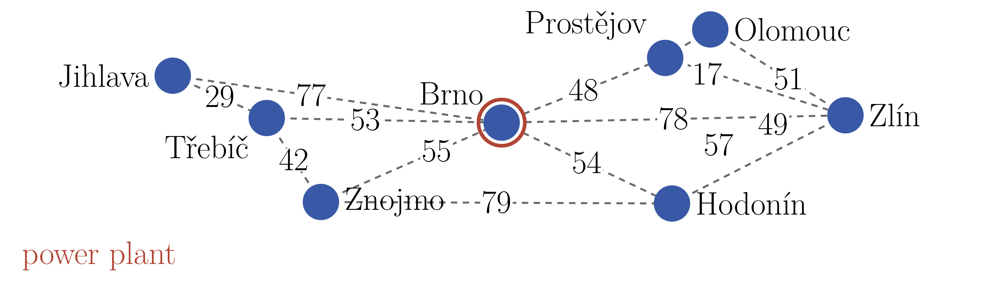

<!--
Do not reveal 292 here. Let them work it in the next slide and hold their own number until Part Two.
-->

---

## Your turn

Five minutes. Draw a set of cables that connects all eight towns, add up the kilometres, and keep your number to yourself.

<figcaption>your grid, your total</figcaption>

<!--
Collect a few totals on the board without judging them. The spread is the point: some will be near 292, some far above.
-->

---

## What everyone notices first

If your cables ever form a **loop**, one of them is doing nothing: cut it and every town is still connected.

So the cheapest answer has **no loops at all**.

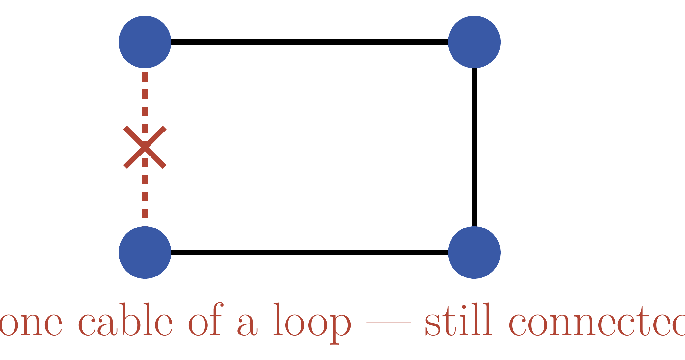
<figcaption>cut it — still connected</figcaption>

---

## A tree

A **tree** is a network that is connected and has no cycle.

Between any two nodes there is exactly one route — no choices, no spares.

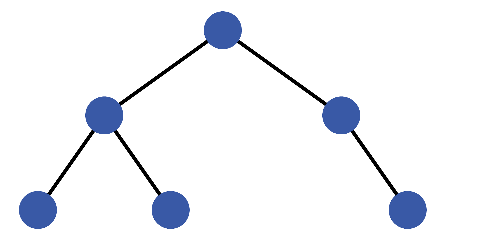
<figcaption>one route between any two</figcaption>

---

## Seven cables, always

A **spanning tree** touches every node. For $n$ towns it has exactly $n - 1$ cables — count them.

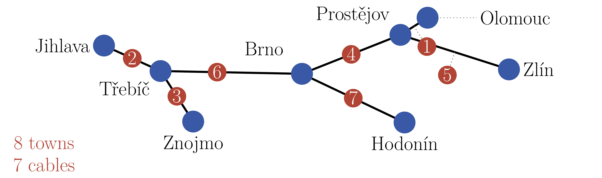
<figcaption>8 towns, 7 cables — the count is forced</figcaption>

<!--
The number of cables is not a design choice. Only WHICH seven is.
-->

---

## Minimum spanning tree

Of all the spanning trees, the one with the least total weight is the **minimum spanning tree**.

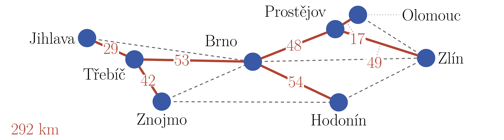
<figcaption>the cheapest way to keep everyone connected</figcaption>

---

<!-- _class: part -->

Part Two02 / 07

## Greedy

Take the cheapest thing that is not stupid, and repeat

---

## Kruskal's rule

Sort every route by price. Walk the list from the cheapest and take each cable — unless it would close a loop, in which case skip it. *Joseph Kruskal, 1956.*

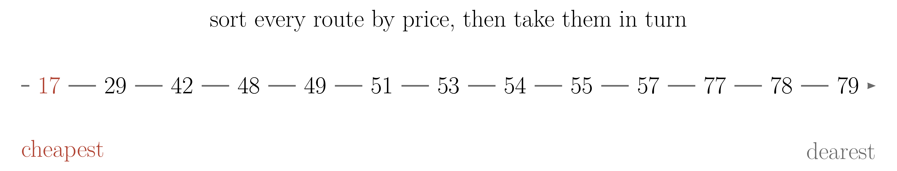
<figcaption>thirteen routes, cheapest first</figcaption>

---

## Kruskal, running

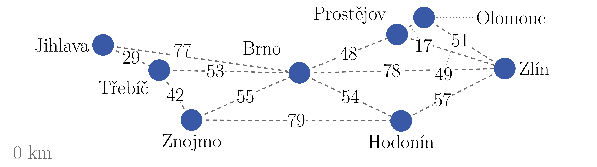
<figcaption>watch the sixth decision</figcaption>

<!--
Let the loop run twice before saying anything. Ask what happened at 51 km.
-->

---

## The one it refuses

Olomouc–Zlín is 51 km and it is next on the list. But both of its ends are already connected to each other, so the cable would buy nothing.

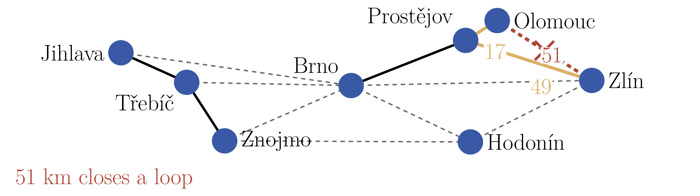
<figcaption>the loop it would have closed</figcaption>

<!--
This single skip IS the algorithm. Everything else is "take the cheapest".
-->

---

## Your turn

Run Kruskal by hand. Write down the order you take the cables in, mark the one you refuse, and total the kilometres.

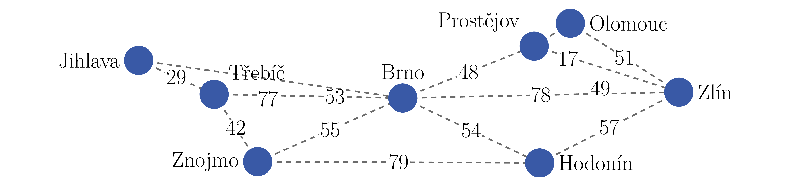
<figcaption>your list, in order</figcaption>

---

## The order — and the answer to the question

17, 29, 42, 48, 49, **skip 51**, 53, 54. Seven cables, **292 km** — and no grid on any of your sheets is cheaper.

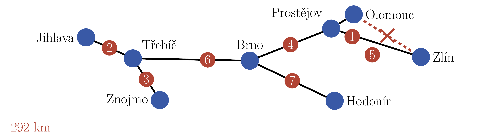
<figcaption>the order it was built in</figcaption>

---

## Prim's rule

Start at the Brno power plant. Repeatedly buy the cheapest cable that reaches **one new town**. *Jarník 1930 · Prim 1957.*

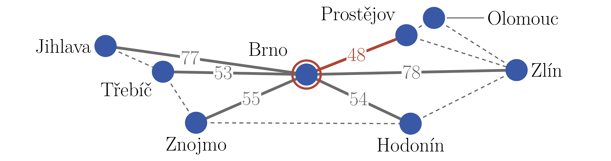
<figcaption>six ways out of Brno; take the cheapest</figcaption>

<!--
Jarník was also Czech, and published this in 1930 after reading Boruvka. Prim rediscovered it in 1957.
-->

---

## Prim, running

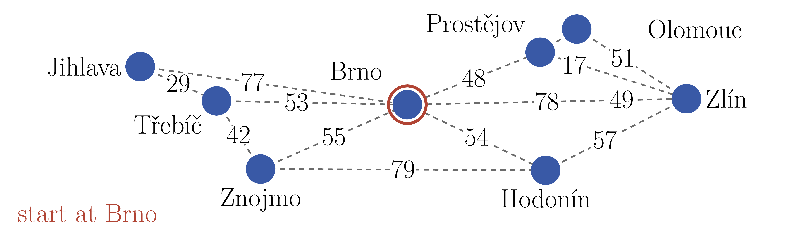
<figcaption>one blob, growing outward from the plant</figcaption>

<!--
Contrast with Kruskal: there, several disconnected fragments grew at once. Here there is always exactly one connected region.
-->

---

## Your turn

Run Prim from Brno. Write the order the cables enter in — then compare it with your Kruskal list.

<figcaption>start at Brno</figcaption>

---

## Different order, same tree

Prim takes 48, 17, 49, 53, 29, 42, 54. Kruskal took them in a different order — and landed on the **same seven cables**.

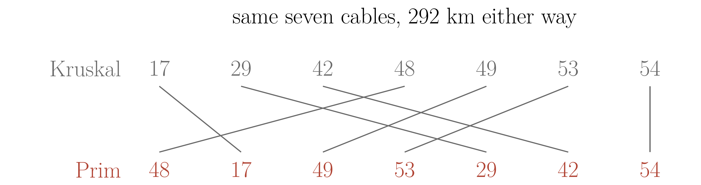
<figcaption>two routes to one answer</figcaption>

---

<!-- _class: mid -->

## Greedy is usually wrong

Take the cheapest thing available and you get a bad answer to almost every problem — packing a bag, planning a trip, scheduling a factory.

So why can it not be beaten here?

Thirty seconds. Argue it with the person next to you.

---

## Here it cannot be beaten

Cut the towns into any two groups. The cheapest cable crossing that cut **must** be in the minimum spanning tree — swap it in and any tree without it gets cheaper.

Both rules only ever take such a cable. That is the whole proof.

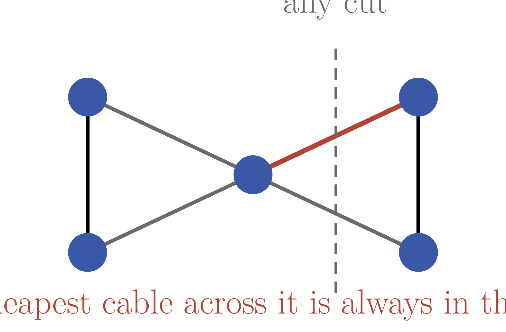
<figcaption>the cheapest cable across any cut is safe</figcaption>

---

<!-- _class: mid -->

## What if two cables cost the same?

Suppose the survey comes back and Olomouc–Zlín is 49 km, exactly the same as Prostějov–Zlín.

Is there still one cheapest grid?

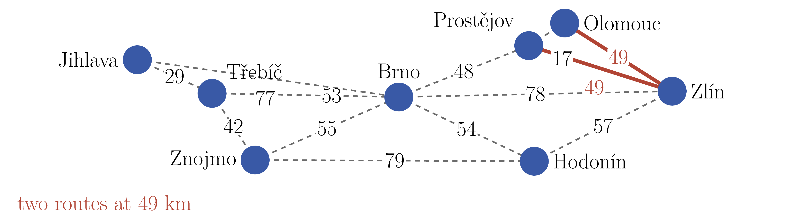

---

## Two cheapest grids

Six cables are in both. Then the tie: take either one, and the total is **292 km** either way. Which one an algorithm hands you depends on how it breaks the tie.

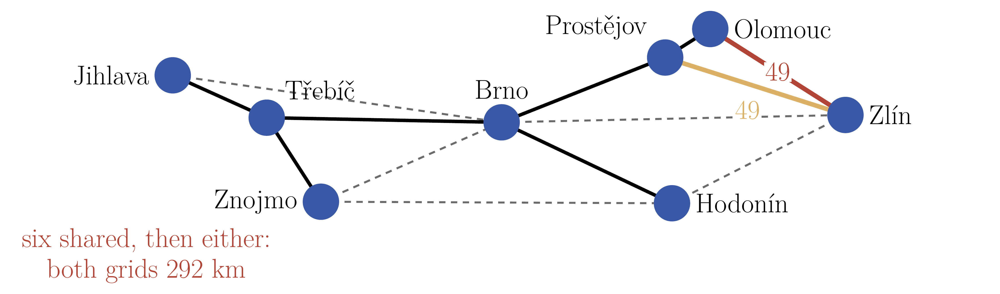
<figcaption>six shared cables, then a coin toss</figcaption>

<!--
All weights distinct implies a unique MST; ties imply several optima of equal cost. Both algorithms return one of them.
-->

---

<!-- _class: mid -->

## And Borůvka himself?

Neither of these is his. In 1926 there is no computer, no sorted list of thirteen numbers, and no notion of an "algorithm" to lean on.

What would you do, with eight towns and a pencil?

---

## Every town at once

Each piece of the network looks at its own cheapest way out and takes it — **all of them simultaneously** — and the pieces merge. Repeat.

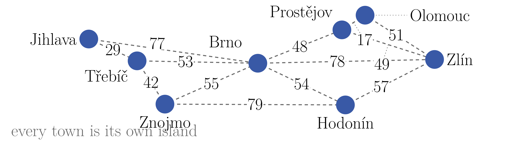
<figcaption>no ordering, no queue, no waiting</figcaption>

---

## Two rounds, not seven steps

Round one chooses six cables at the same time. Round two chooses the last. Kruskal and Prim need seven sequential decisions for the same tree.

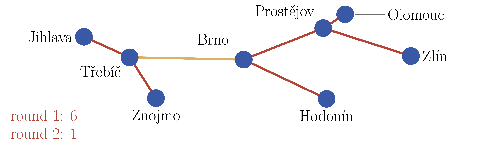
<figcaption>the parallel one — which is why it came back</figcaption>

<!--
Boruvka's algorithm is the one that survives on modern parallel hardware, ninety years after a pencil-and-paper problem in Moravia.
-->

---

<!-- _class: part -->

Part Three03 / 07

## Break it

The bill is paid, the grid is up, and now things start to fail

---

## The grid, finished

292 kilometres of cable, eight towns, seven lines. This is what 1926 would have built.

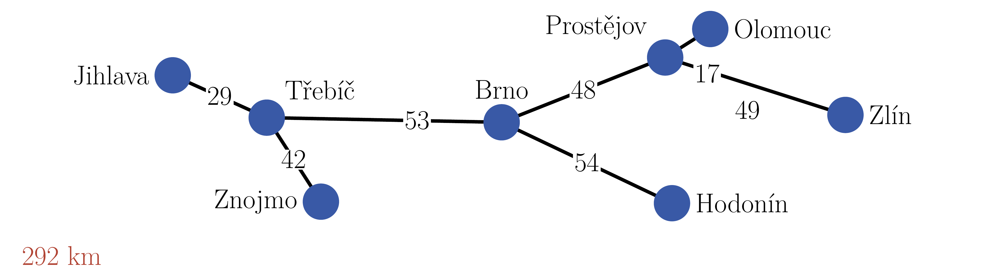
<figcaption>optimal, and complete</figcaption>

---

<!-- _class: mid -->

## Which town, gone dark, hurts most?

A transformer fails and one town drops off the grid, taking its cables with it.

Pick the town you would least like to lose. Hands up for yours.

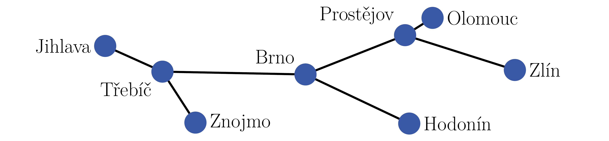

<!--
Run this as a real poll. Count hands for Brno, Prostejov, Trebic, and "a leaf". Write the tally on the board before the next slide.
-->

---

## Brno

Lose Brno and eight towns become **three, three and one**. No survivor can reach two-thirds of the others.

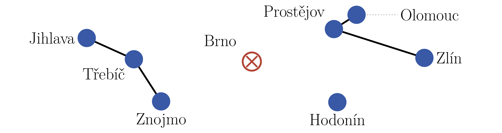
<figcaption>3 + 3 + 1</figcaption>

---

## Every cable is a bridge

A tree has exactly one route between any two towns. So every single cable, and every town on that route, is a single point of failure. This is not bad luck — it is what "cheapest" bought.

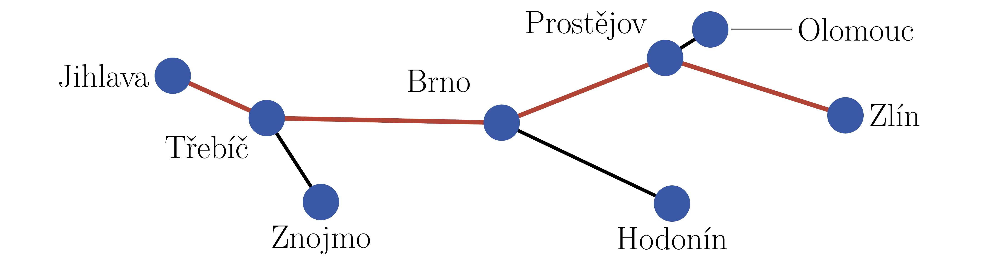
<figcaption>Jihlava to Zlín: one route, no spare</figcaption>

---

## Real grids are not trees

Every transmission network you have ever depended on is **meshed**: cut any one line and the power arrives by another.

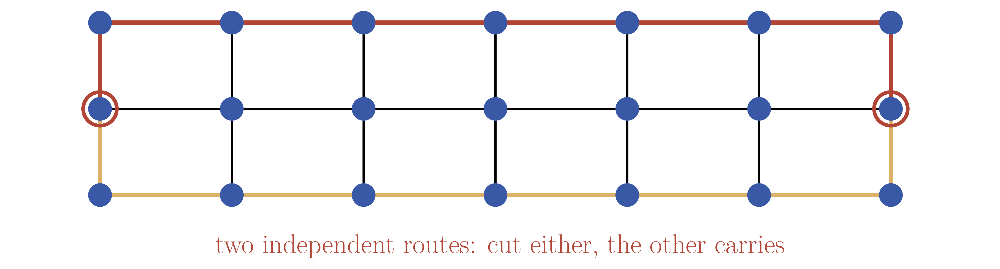
<figcaption>redundancy is what everyone actually builds</figcaption>

---

## Measuring the damage

**Connectivity** = size of the largest surviving piece ÷ original number of nodes. Losing Brno scores $3/8 = 0.375$; losing a leaf scores $7/8$.

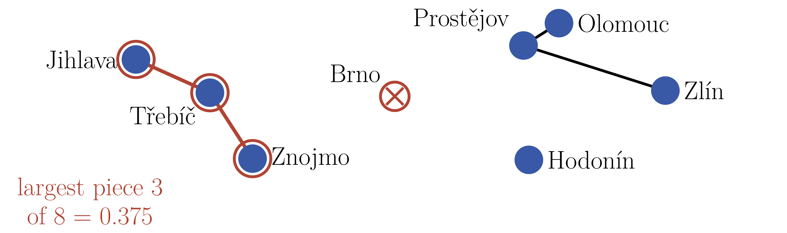
<figcaption>one number for "how bad"</figcaption>

---

<!-- _class: mid -->

## Keep going

Do not stop at one town. Remove them one at a time, and after each removal measure the connectivity again.

Sketch the curve before we draw it. Does it slide, or does it fall off a cliff?

---

## The robustness profile

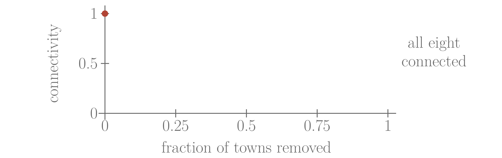
<figcaption>connectivity against the fraction removed</figcaption>

Damage is a **curve**, not a number.

<!--
Pause on the first two frames: the first removal costs more than the next four put together.
-->

---

## One curve, one number

The **R-index** is the area under the profile: $R = \frac{1}{N}\sum_k y_k$. High area, robust network. This attack scores $R = 0.17$.

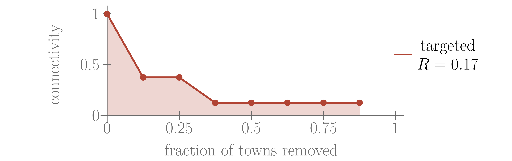
<figcaption>the whole curve, compressed to one comparable number</figcaption>

---

<!-- _class: mid -->

## Does the order matter?

Same grid. Same number of towns removed. Only the **order** is different.

How far apart can two curves on the same network be?

Guess a factor before we look.

---

## Random failure

Earthquakes, floods and broken transformers do not read the map. They hit leaves as often as hubs, and the grid degrades gently: $R = 0.41$.

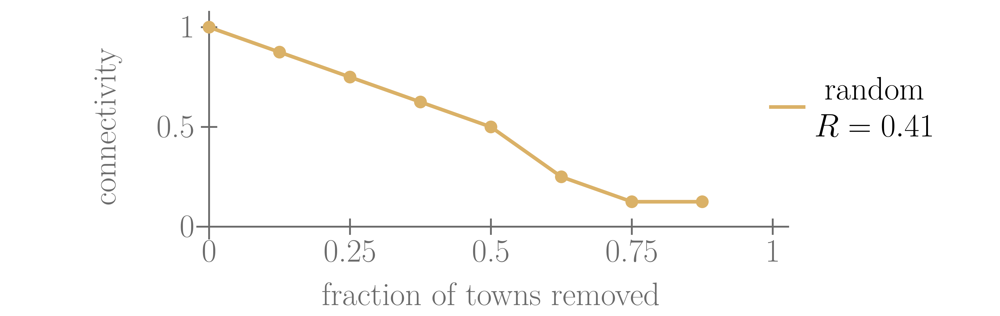
<figcaption>unlucky, but not targeted</figcaption>

---

## Targeted attack

An adversary who can see the map takes Brno first, then the next-best connected town. Same grid, same removals, $R = 0.17$ — **2.4× the damage**.

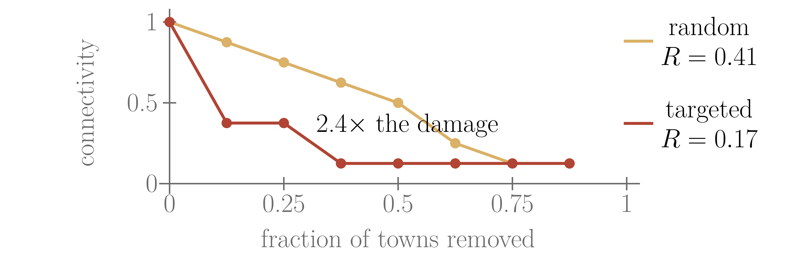
<figcaption>the gap between bad luck and bad intent</figcaption>

---

<!-- _class: mid -->

## Fix the hit list, or re-measure after every hit?

Degrees change as towns disappear. A quiet town can become the best-connected one left once the hubs around it are gone.

Is it worth the attacker's trouble to re-rank after every removal?

---

## Re-measuring is worse

On a random network, an attacker working from a **fixed** ranking needs 58% of the nodes. Re-ranking after **every** removal brings that down to 40%.

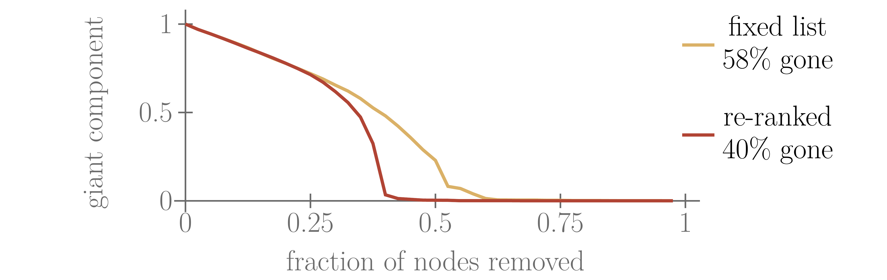
<figcaption>better targeting costs more computation — and buys more damage</figcaption>

<!--
Same trade-off applies to any attack criterion, not just degree. We come back to betweenness in Part Seven.
-->

---

## Take it apart yourself

Live: build a network, choose a removal strategy, and watch the profile draw itself.

Then on paper: *Build it, Break it, Build it back* — construct the MST by hand, break it, and redesign.

[network-robustness.html](https://skojaku.github.io/adv-net-sci/assets/vis/network-robustness.html)

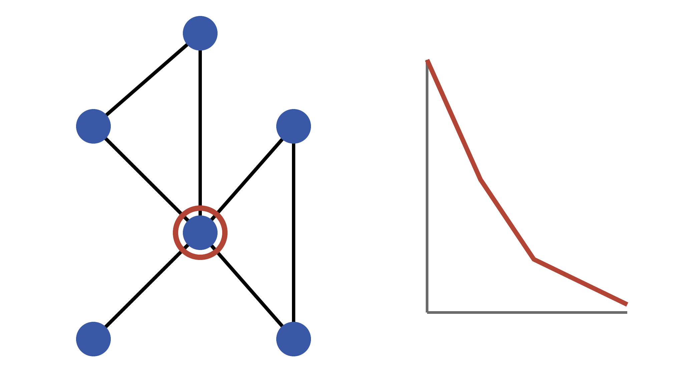
<figcaption>pick a target, watch the curve</figcaption>

---

<!-- _class: mid -->

## Before next time

You can now *measure* how badly a network breaks. You cannot yet **predict** it.

What fraction of a network has to fail before it fragments?

Next session: one formula answers this, for any network, from its degrees alone.

---

<!-- _class: part -->

Part Four04 / 07

## Percolation

Before networks — a paved yard in the rain

---

<!-- _class: mid -->

## The puddle yard

Rain falls on a paved yard. Each stone holds water with probability $p$, independently. Puddles on touching stones join up.

At which $p$ does one puddle first span the whole yard?

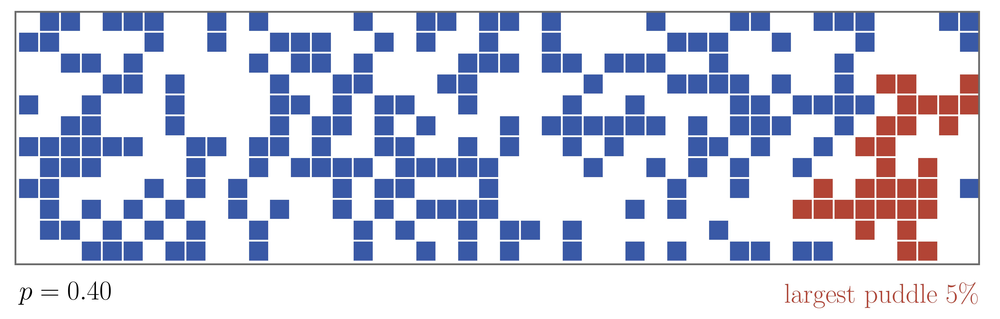

---

## Turning $p$ up

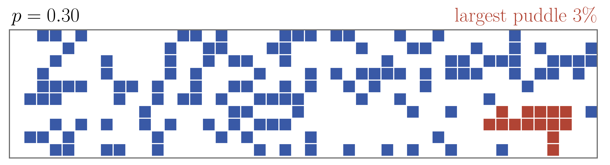
<figcaption>watch for the moment the pools join</figcaption>

<!--
Ask them to call out when it happens. The room will call it within a few hundredths of each other.
-->

---

## It happens all at once

Below $p_c \approx 0.59$ there are scattered pools. Above it, one puddle owns the yard. There is no gentle ramp: this is a **phase transition**.

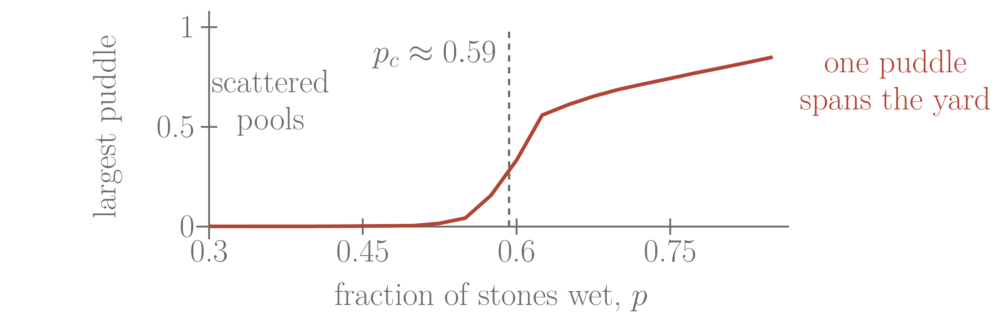
<figcaption>the largest puddle, measured</figcaption>

---

## Your turn at the slider

Drag $p$ yourself in the module notebook and find the transition by hand.

Then answer this: how sharp is it when the yard is ten times bigger?

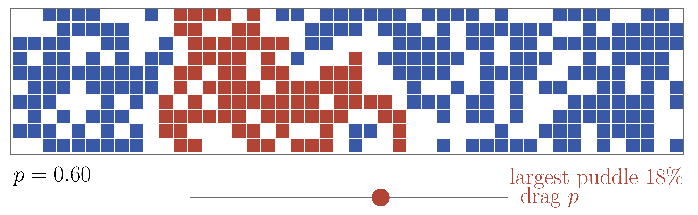
<figcaption>the marimo widget from the notes</figcaption>

---

<!-- _class: mid -->

## Does the order matter here?

The stones do not all wet at once — the rain fills them one by one, in whatever order it likes.

Does a different order change when the giant puddle arrives?

---

## Only the fraction

Different yard, different stones, same fraction wet — and the same answer. What determines connectivity is **how many**, not which ones came first.

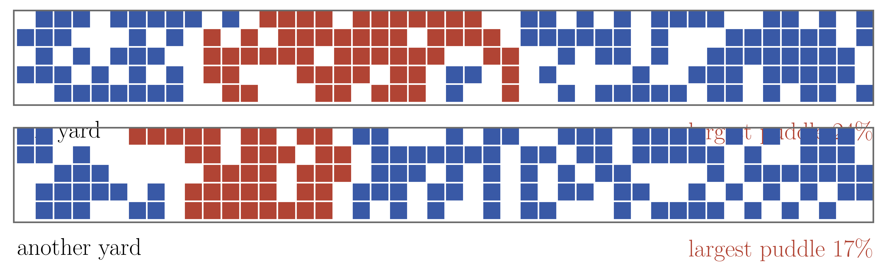
<figcaption>two yards, one threshold</figcaption>

---

## Attack is percolation, backwards

One axis, two directions. Adding nodes builds a giant component; removing them destroys it. The mathematics is already written — we only have to read it right to left.

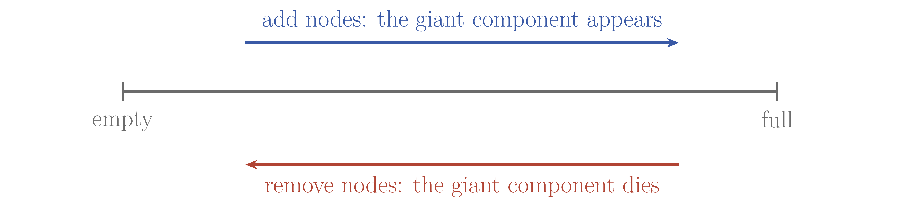
<figcaption>the same transition, approached from the other side</figcaption>

---

<!-- _class: part -->

Part Five05 / 07

## The formula

One number, from the degrees alone

---

<!-- _class: mid -->

## What number decides it?

Two networks. Same number of nodes, same number of edges. One shatters when you remove a fifth of it; the other survives losing four-fifths.

What would you have to know about a network to tell them apart?

---

<!-- _class: mid -->

## Follow an edge, not a node

Pick an **edge** at random — not a node — and walk to the node at its far end.

Is the node you arrive at a typical member of the network?

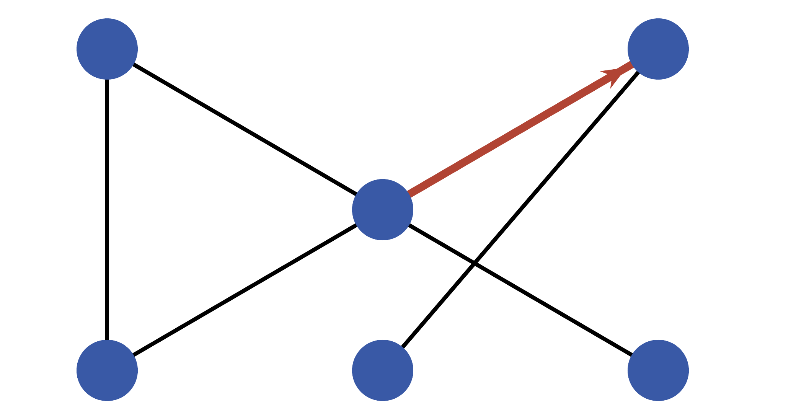

---

## No — it is biased toward hubs

Every edge has two ends, and a node owns one end per link. So a node with twice the degree has twice the chance of being the one you land on.

$$ q(k) = \frac{k\,p(k)}{\langle k \rangle} $$

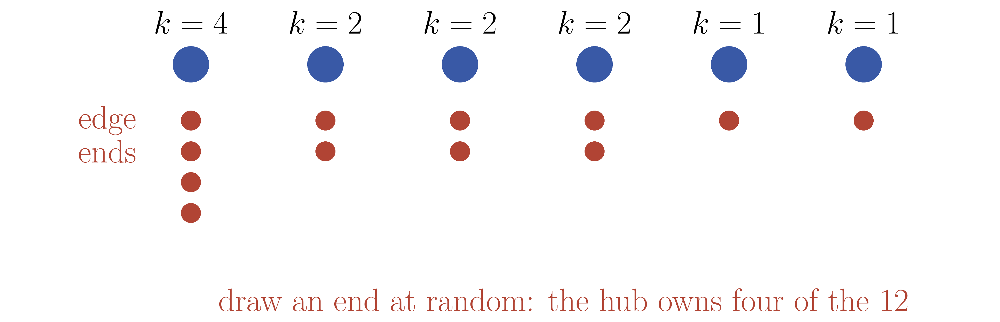
<figcaption>draw an end at random</figcaption>

---

## How connected is the node you land on?

Average the degree over $q(k)$ rather than over $p(k)$, and you get

$$ \kappa = \frac{\langle k^2 \rangle}{\langle k \rangle} $$

$\kappa$ is large exactly when the network has hubs.

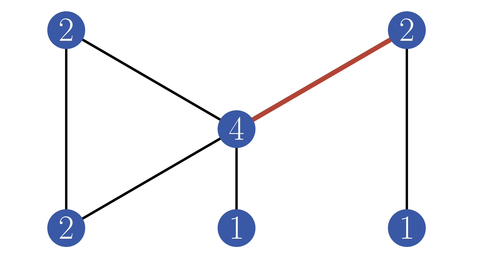
<figcaption>land here, count its links</figcaption>

---

## Subtract the way you came in

Of the $\kappa$ links at the node you reached, one is the edge you arrived on. The search fans out by $\kappa - 1$ — the **branching factor**.

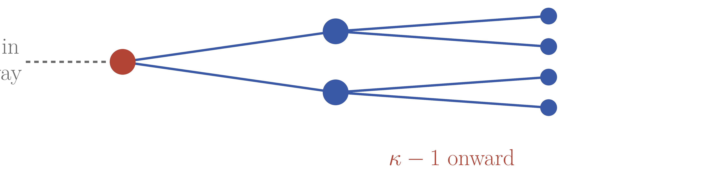
<figcaption>one in, $\kappa - 1$ out</figcaption>

---

## Molloy–Reed

Branching above 1 and the search never dies out; below 1 and it stalls. So a **giant component** exists exactly when $\kappa > 2$. *Molloy & Reed, 1995.*

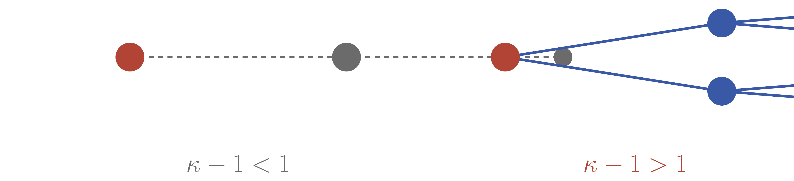
<figcaption>below 1 it dies; above 1 it never stops</figcaption>

---

## Your turn

Three small networks. Write down each degree, average $k$ and $k^2$ over the nodes, and compute $\kappa = \langle k^2 \rangle / \langle k \rangle$.

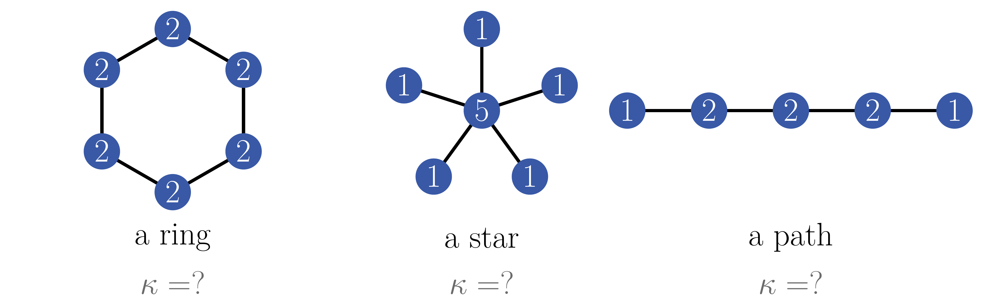
<figcaption>which of these has a giant component?</figcaption>

---

## $\kappa = 2$, 3 and 1.75

The star is comfortably above the threshold; the path is below it and falls apart on its own. The ring sits **exactly** at $\kappa = 2$.

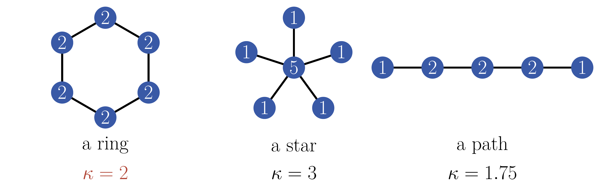
<figcaption>the ring lives on the line</figcaption>

---

## Now break it

Remove a fraction $f$ of the nodes at random. Each surviving neighbour still had $\kappa - 1$ onward links, but only $(1-f)$ of them lead anywhere.

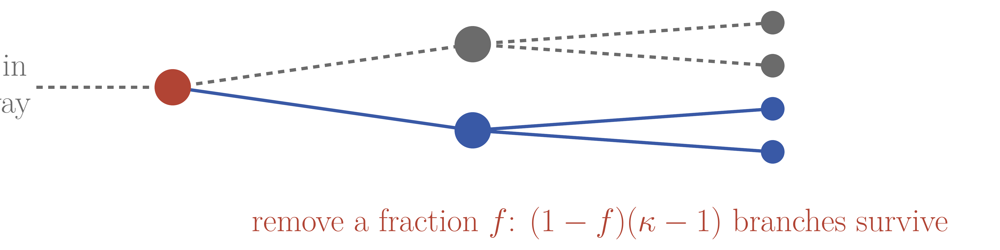
<figcaption>failure just rescales the branching factor</figcaption>

---

## The critical fraction

Set the branching to exactly 1 — $(1-f)(\kappa - 1) = 1$ — and solve for $f$: $\;f_c = 1 - \dfrac{1}{\kappa - 1}$.

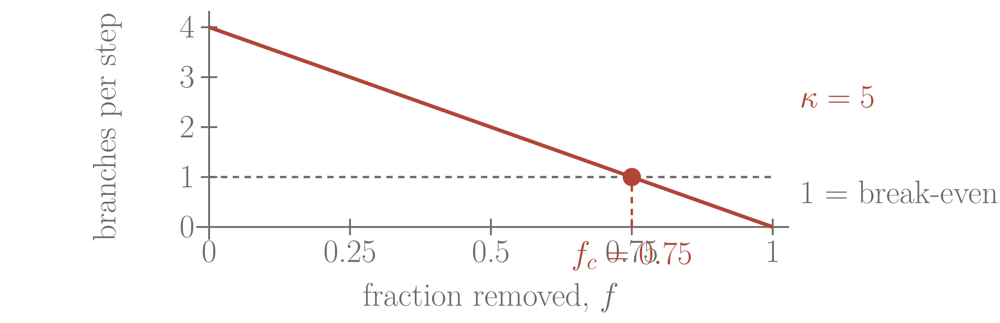
<figcaption>above $f_c$ the search dies, and so does the network</figcaption>

<!--
The exact binomial dilution is in the appendix and gives the same threshold; the heuristic is enough for the whole module.
-->

---

## A network without hubs

A Poisson degree distribution has $\langle k^2 \rangle = \langle k \rangle^2 + \langle k \rangle$, so $\kappa = \langle k \rangle + 1$ and $f_c = 1 - 1/\langle k \rangle$. Robustness is set by the **average degree alone**.

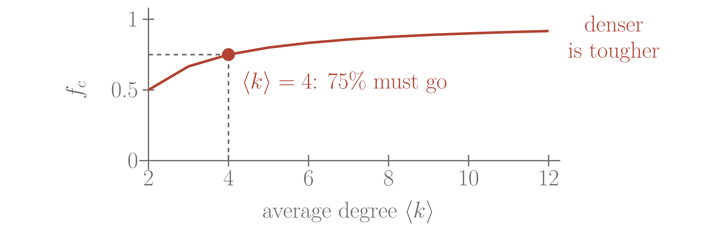
<figcaption>at $\langle k \rangle = 4$, three quarters of the nodes must go</figcaption>

---

<!-- _class: mid -->

## And a network with hubs?

A scale-free degree distribution, $P(k) \sim k^{-\gamma}$: most nodes tiny, a few enormous, and the largest degree grows with the network.

What happens to $\kappa = \langle k^2 \rangle / \langle k \rangle$?

---

## $\kappa$ blows up, $f_c \to 1$

For $2 < \gamma < 3$ the second moment diverges, so $\kappa \to \infty$ and $f_c \to 1$: you have to remove essentially **every** node before a hub network fragments.

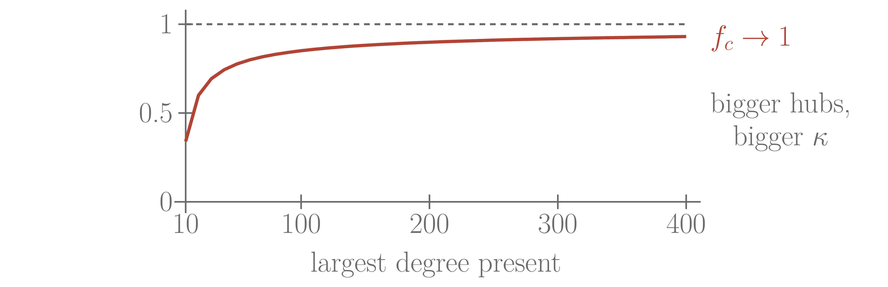
<figcaption>bigger hubs, bigger $\kappa$, higher threshold</figcaption>

<!--
Cohen, Erez, ben-Avraham and Havlin, PRL 2000: this is why the Internet shrugs off random router failures.
-->

---

<!-- _class: part -->

Part Six06 / 07

## Robust yet fragile

The strength and the weakness turn out to be the same thing

---

<!-- _class: mid -->

## So a hub network is indestructible?

$f_c \to 1$ says random failure cannot kill it. Every hub network you know — the Internet, the airline map, the cell — inherits that.

Is that the whole story?

---

## Random failure: both survive

Two simulated networks with the same 2,000 nodes and 6,000 edges. Knock out nodes at random and both hold together for a long time; the hub network holds on longest.

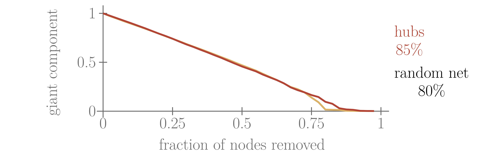
<figcaption>measured, not sketched</figcaption>

---

## Now let the adversary choose

Same two networks. This time remove the highest-degree node first, and keep going. The hub network is gone at **20%**.

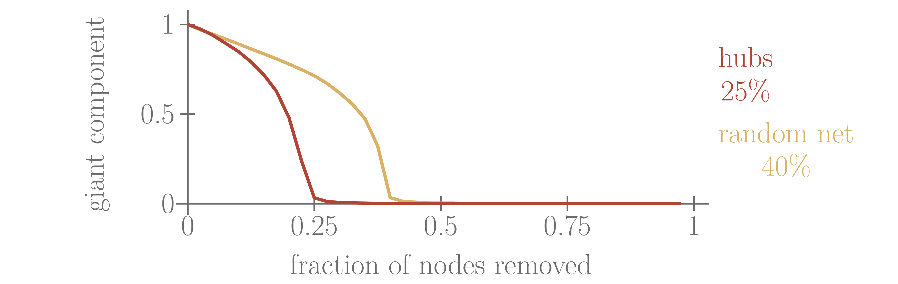
<figcaption>the hubs were the whole structure</figcaption>

---

## Robust yet fragile

The same hubs that made random failure harmless are what an attacker aims at. Strength and weakness are one structural fact. *Albert, Jeong & Barabási, Nature, 2000.*

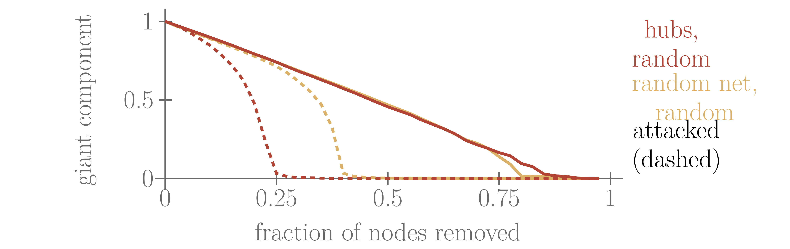
<figcaption>one network, two fates</figcaption>

---

## Efficiency against security

Hubs are the cheap way to connect everything — and the cheap thing to attack. Redundancy buys security and costs cable. **No structure wins both.**

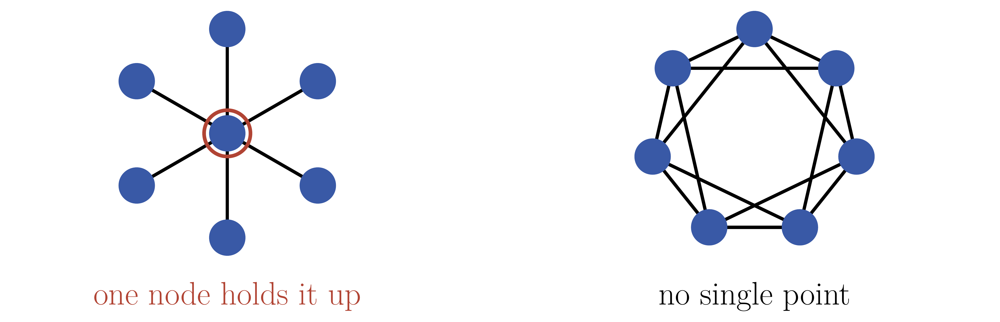
<figcaption>the trade-off, drawn</figcaption>

---

<!-- _class: mid -->

## You are the designer

Back to Moravia. The board will fund **two** extra cables beyond the 292 km tree.

Where do you put them, and what exactly does the money buy?

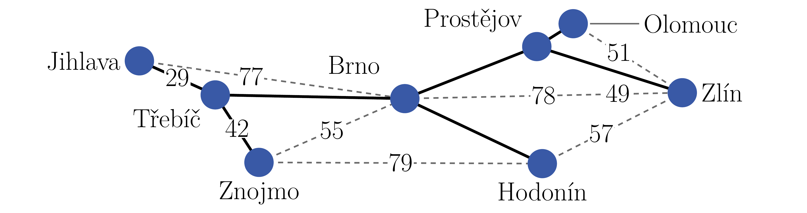

<!--
Take three proposals before revealing. Push for the second question: "what does it buy" is the one they skip.
-->

---

## Close the ring in the south

Zlín–Hodonín and Znojmo–Hodonín turn the tree into a ring. For **+136 km (+47%)**: worst single loss goes from $3/8$ to $6/8$, and $R$ from 0.17 to 0.27.

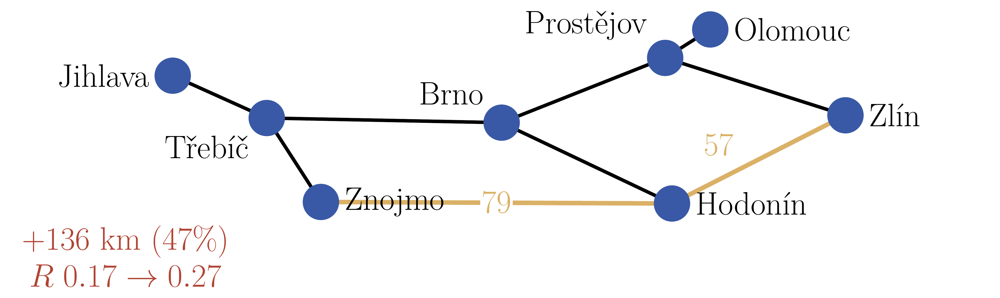
<figcaption>the best pair of the fifteen — searched, not guessed</figcaption>

---

## Design principles

* **Even out the degrees** — no town carrying three others
* **Redundant routes** — two ways to reach anywhere
* **Protect the hubs** you cannot design away
* **Layer** local grids under a backbone
* **Reconfigure** when an attack is detected

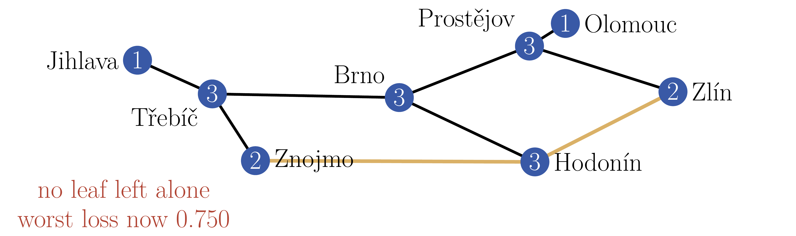
<figcaption>degrees after the two extra cables</figcaption>

---

## Build it back

1926 answered "cheapest". A modern grid answers "cheapest that survives" — the same tree, plus the loops that cost money and save cities.

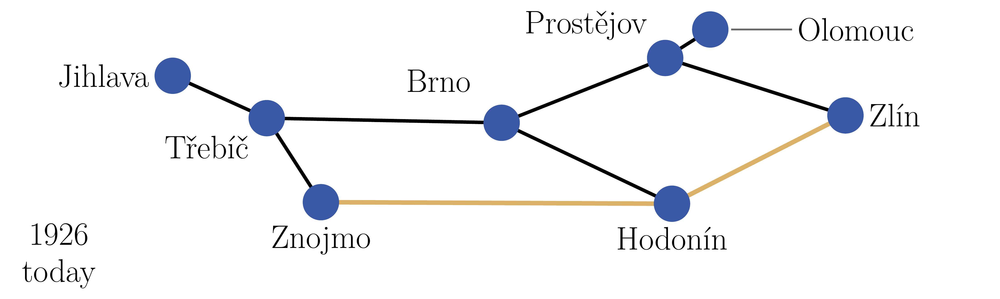
<figcaption>the tree, and what got added to it</figcaption>

---

<!-- _class: part -->

Part Seven07 / 07

## Edge cases

Four networks that test the law

---

<!-- _class: mid -->

## A ring

Every town has exactly two cables — a perfect loop, no hubs, no leaves.

What is $\kappa$, and what does $f_c$ say?

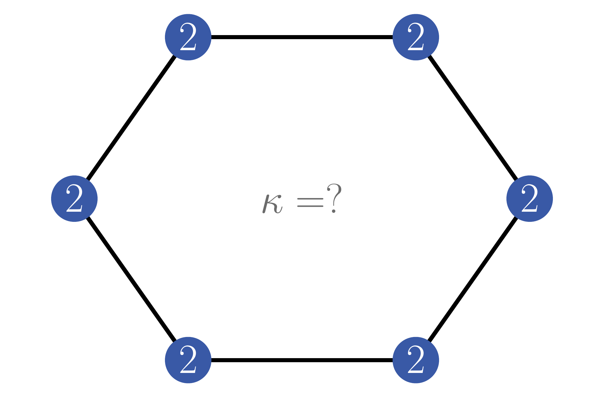

---

## Exactly on the threshold

$\langle k \rangle = 2$ and $\langle k^2 \rangle = 4$, so $\kappa = 2$ and the branching factor is exactly **1**.

$f_c = 0$: a ring has no robust core to lose. Cut one node and it is a chain; cut two and it is two chains.

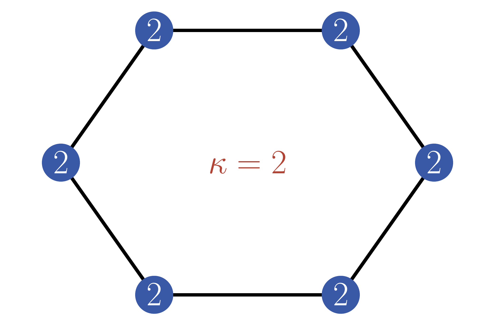
<figcaption>the threshold itself</figcaption>

---

<!-- _class: mid -->

## A random network with $\langle k \rangle = 1$

Poisson degrees, one edge per node on average.

What does $\kappa = \langle k \rangle + 1$ say about it?

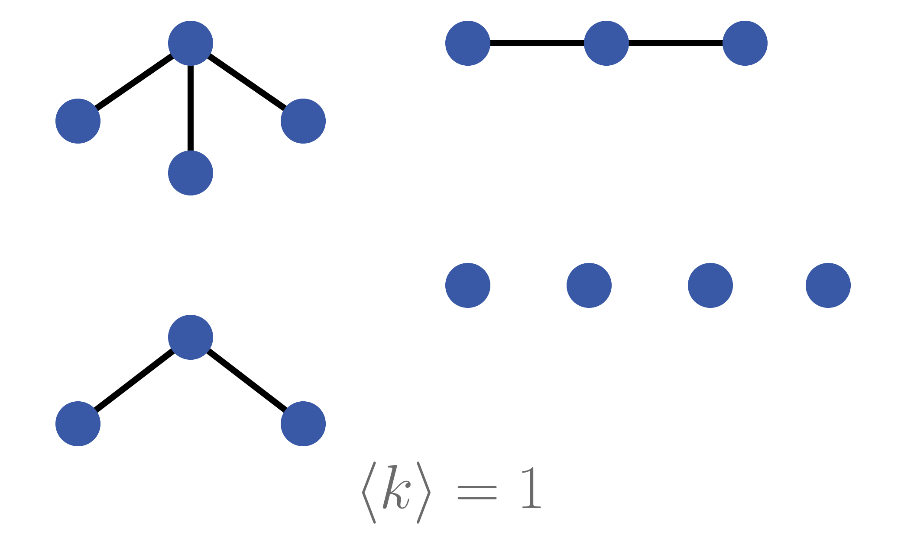

---

## The same threshold, from the other side

$\kappa = 2$ — exactly the Molloy–Reed boundary.

And $\langle k \rangle = 1$ is precisely where Module 02's giant component was born. Two different arguments, one number.

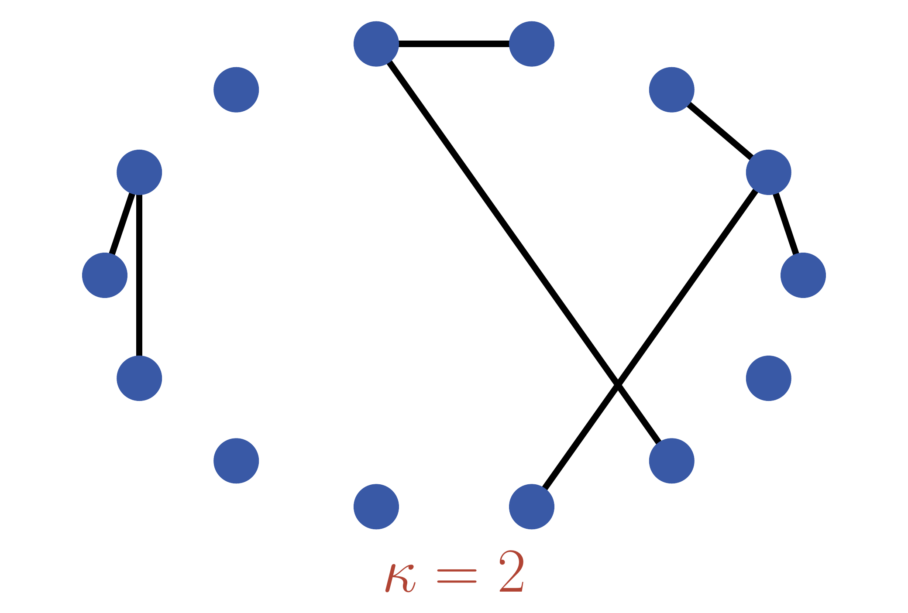
<figcaption>m02's result, rediscovered</figcaption>

---

<!-- _class: mid -->

## Attack by betweenness, not degree?

Suppose the adversary ranks nodes by how many shortest routes run **through** them, rather than how many links they have.

Would that do more damage? What would it cost?

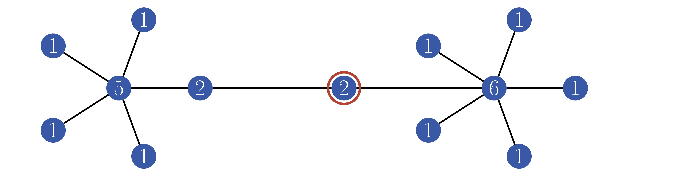

---

## More damage, more computation

The degree-2 node in the middle carries every route between the two halves. Degree misses it completely; betweenness finds it — at a far higher price to compute.

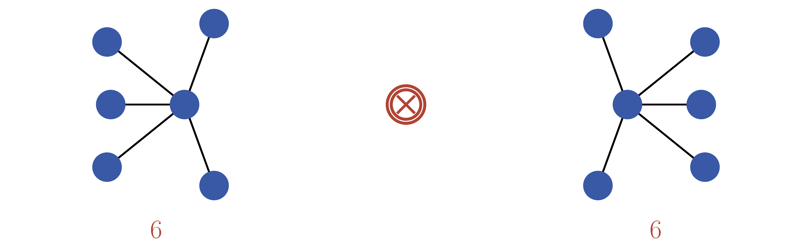
<figcaption>the cheapest node to cut is not the biggest</figcaption>

<!--
Module 06 defines betweenness properly. Flag it here so the definition arrives with a reason attached.
-->

---

<!-- _class: mid -->

## Real grids are full of triangles

Module 02 showed that real networks are heavily clustered: your neighbours are each other's neighbours.

Does $f_c = 1 - 1/(\kappa - 1)$ still hold there?

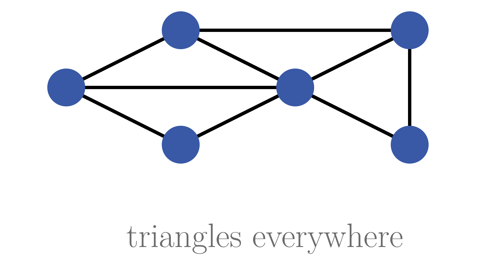

---

## Not exactly — and here is why

The branching argument assumed every step reaches a **new** node. A triangle sends the search straight back where it came from, so the real fan-out is smaller than $\kappa - 1$.

Real thresholds sit **below** the prediction.

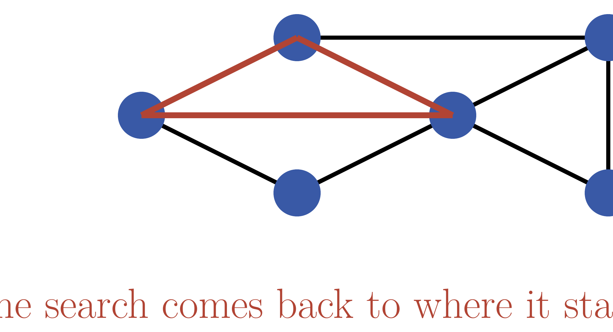
<figcaption>the search comes back on itself</figcaption>

<!--
The point is not that the formula is wrong. It is that you should always know which assumption you are standing on.
-->

---

## Module 03 in one picture

Build it, break it, build it back — and the one line that predicted the breaking before it happened.

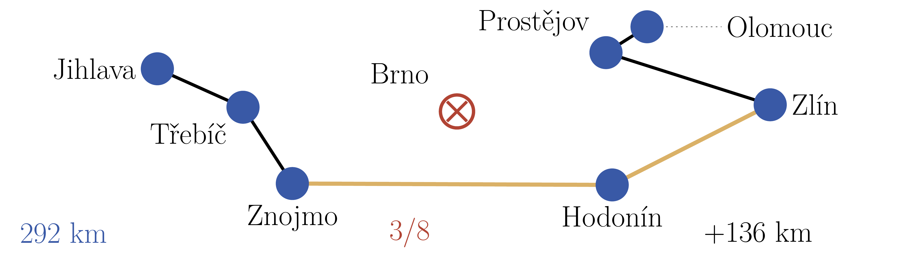
<figcaption>292 km · 0.375 · +136 km · $f_c$</figcaption>

---

## Coming up in Module 04

$q(k)$ said the node at the far end of a random edge is biased toward hubs.

Apply that to friendship and you get something uncomfortable: **your friends have more friends than you do.**

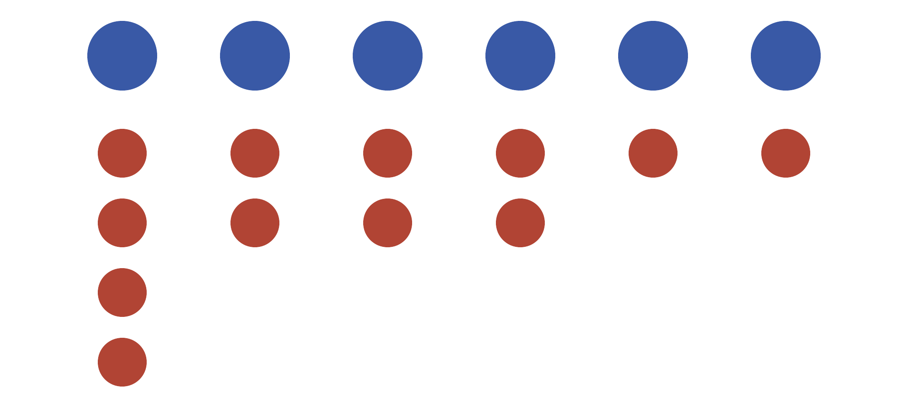
<figcaption>the same bias, a different question</figcaption>

