<!-- _class: lead -->

Advanced Topics in Network Science · Module 05

# The Club That Broke in Two

thirty-four friends, and the line nobody could agree on

Sadamori Kojaku · Binghamton University

<!--
Open with a karate club in 1970, not with a definition of community. Everything in this module is one real split, pushed until it stops answering.
-->

---

## Roadmap

01

A karate club, 1970, and a line nobody agrees on

02

What counts as a group?

03

Zachary's answer — cut between them

04

More than chance — balls, strings, modularity

05

Climbing Q — Louvain and Leiden

06

Turn it around — communities first

07

Three ways modularity lies

08

How would you know? And where this lands

---

<!-- _class: part -->

Part One01 / 09

## The club that broke in two

1970, and an anthropologist with a notebook

---

## Someone wrote the friendships down

In 1970 an anthropologist named **Wayne Zachary** started watching a karate club at an American university.

For two years he recorded which members met each other **outside the dojo** — at bars, at tournaments, in classes.

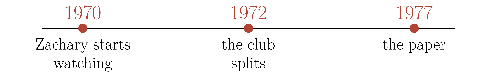
<figcaption>two years of watching, one paper</figcaption>

<!--
Zachary 1977, Journal of Anthropological Research 33(4): 452-473. Observed 1970-1972. He was studying conflict, not networks; the network was his instrument.
-->

---

## Two men who could not agree

**Mr. Hi** taught the class and wanted the fees raised. **John A.** ran the business and wanted them held. Thirty-four members were caught between.

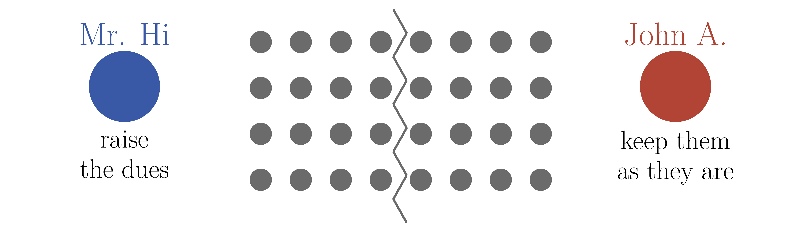
<figcaption>the instructor, the administrator, and everybody else</figcaption>

<!--
Both names are Zachary's own pseudonyms. The dispute ran for two years before anything happened.
-->

---

## Thirty-four people, seventy-eight friendships

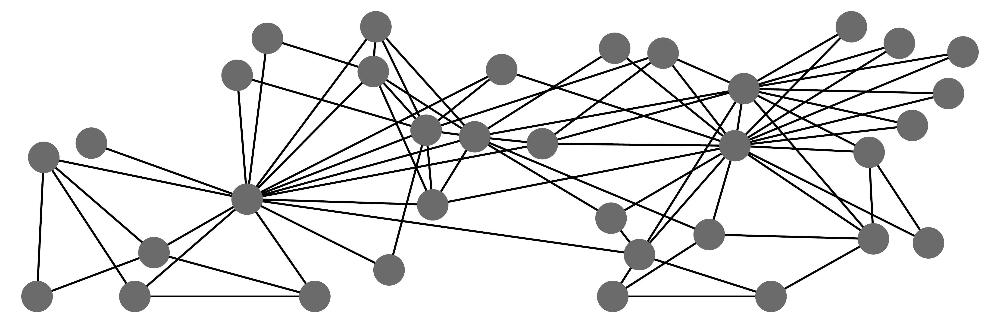
<figcaption>a line joins two members who met outside the dojo</figcaption>

No colour yet. Nobody is labelled. This is everything Zachary had.

<!--
Give them a moment to just look at it. Do not name anyone on the picture yet.
-->

---

<!-- _class: mid -->

## Point at the two groups

Two groups. Where does the line go?

<!--
Do not answer. Do not hint. Do not say which side anyone is on. The next slide is the activity; the answer is two slides away.
-->

---

## Your turn

Draw the line on paper — thirty seconds. Then hands up: **whose line cut more than fifteen friendships?**

<figcaption>three lines this room will draw — and they are three different clubs</figcaption>

<!--
Actually take the hands. The room splitting is the point of the exercise, not a rhetorical device. None of the three drawn lines is the historical answer -- the figure asserts that.
-->

---

## In 1972 the club actually split

The dispute ended in a fight over a fee increase. Mr. Hi started his own club. Every member had to choose.

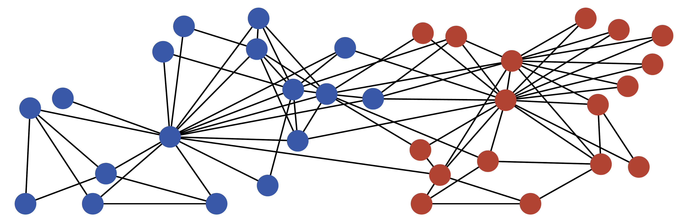
<figcaption>seventeen went with Mr. Hi (blue), seventeen stayed with the officers (red)</figcaption>

<!--
17 against 17. This is the ground truth for the rest of the module, and it is one of very few networks that has one.
-->

---

## Eleven friendships crossed the line

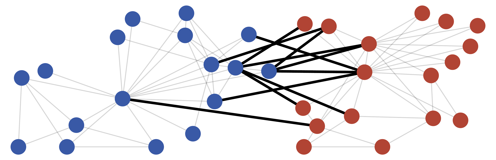
<figcaption>thirty-five friendships inside one club, thirty-two inside the other, eleven torn</figcaption>

Eleven of seventy-eight. The split ran almost exactly where the network was thinnest.

<!--
35 + 32 + 11 = 78. That "almost" is doing work: it is the whole of Part Eight.
-->

---

<!-- _class: mid -->

## Why should a network have groups at all?

Nobody organised this club into two halves. Where did the halves come from?

<!--
Take two or three answers before moving on. "They were friends already" is the beginning of the right answer.
-->

---

## Four reasons, and they are not the same reason

* People befriend people **like themselves**
* The **same work** puts people together
* Organisations are built in **layers**
* Information runs down **shared channels**

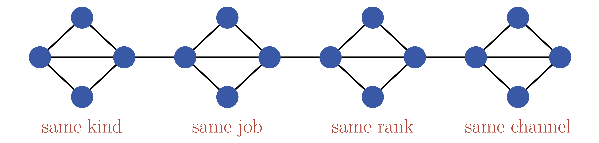
<figcaption>four groups, four different things that made them</figcaption>

<!--
Homophily, shared function, hierarchy, shared information pathways. Different causes, and they leave different traces -- which is why one definition of "community" will not fit all four.
-->

---

## The only club whose answer really happened

Almost every network you will ever cluster has **no answer key**. You find groups and nobody can tell you whether they are the right ones.

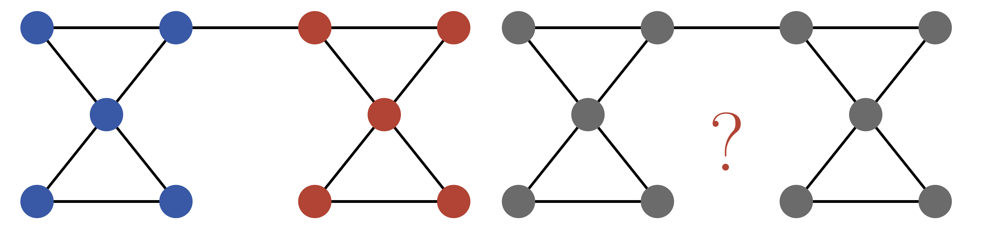
<figcaption>a recorded outcome on the left; the usual situation on the right</figcaption>

<!--
There is a trophy called the Zachary Karate Club Club, handed to whoever uses this network first at a network science conference. The joke is affectionate and it is also a complaint: the field leans on one small data set because so little else has a recorded answer. Do not quote the year -- I could not re-verify it.
-->

---

<!-- _class: mid -->

## Today's question

What is a community — and how would you know the one you found is real?

The first half takes until lunch. The second half takes the rest of the module.

<!--
Big question, straight out of the curriculum. Both halves get answered; only one of them gets answered comfortably.
-->

---

<!-- _class: part -->

Part Two02 / 09

## What counts as a group?

the first instinct, and how it fails

---

## Everyone knows everyone

The strictest possible answer: a group where **every** member is friends with **every** other.

That is a **clique**.

One missing friendship and the whole thing is disqualified.

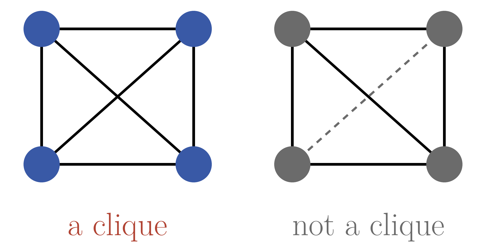
<figcaption>four mutual friends, and four one friendship short</figcaption>

---

<!-- _class: mid -->

## How large is the biggest clique in this club?

Thirty-four people. Seventy-eight friendships. Everyone knows everyone — how many can manage it?

Shout a number.

<!--
Take guesses. People say eight, ten, twelve. Do not correct them yet.
-->

---

## Five people. And only two such groups

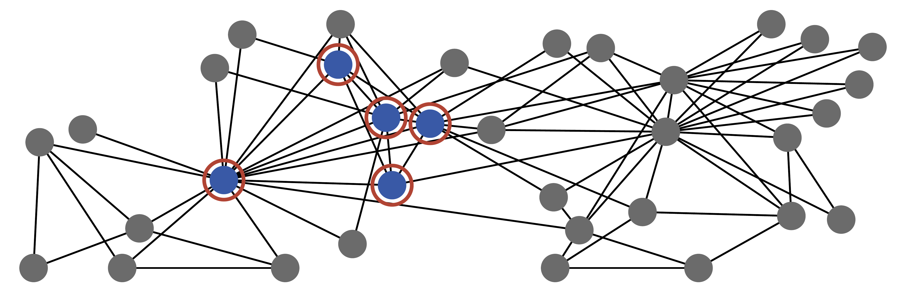
<figcaption>the largest all-know-all group in the club: five members</figcaption>

Both of them contain Mr. Hi. Neither contains John A.

<!--
Two maximum cliques, both of size 5, and they overlap in four people. Thirty-four members and the strictest definition finds five of them.
-->

---

<!-- _class: mid -->

## One missing friendship, and the group is disqualified?

Two people in a group of eight never happened to meet. Is that group not a group?

<!--
Obviously not. The next four slides are four different ways of saying "obviously not", and they do not agree with each other.
-->

---

## Relax the head count

A **k-plex**: every member may be missing at most **k** of the others.

At k = 1 you may miss one person. At k = 2, two.

The clique is the k-plex with k = 0.

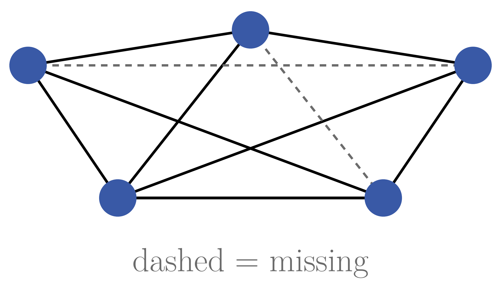
<figcaption>five members, each missing at most one of the others</figcaption>

---

## Relax it from the other side

A **k-core**: keep at least **k** friends *inside* the group. Peel away anyone who cannot, repeat, and count with me.

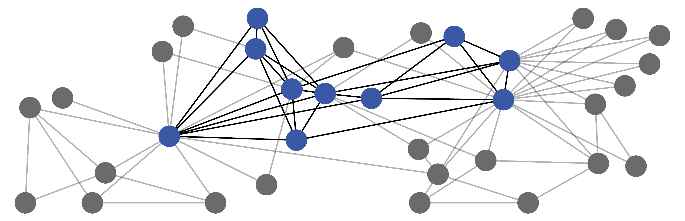
<figcaption>peel away anyone below k, and it stops at the 4-core: ten people</figcaption>

<!--
Run the peel out loud. Ask what happens at k=5: the core empties. Ten people is a third of the club, and it is not two groups.
-->

---

## Relax the density

Forget counting per person. Ask only that the group has at least a **fraction ρ** of the friendships it could have.

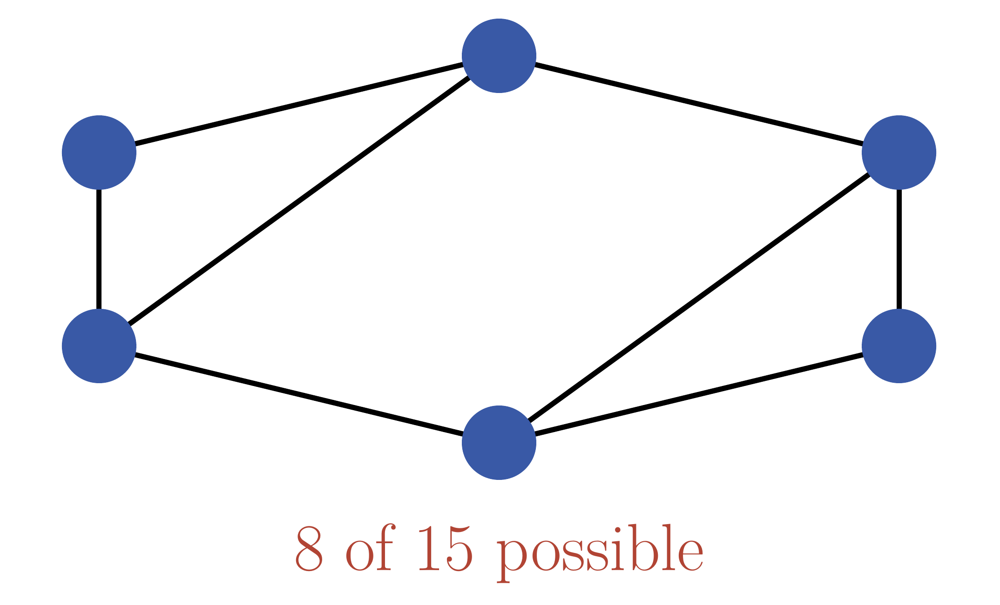
<figcaption>eight of the fifteen possible friendships</figcaption>

---

## Relax the distance

An **n-clique**: every member is within **n steps** of every other.

At n = 1 that is a clique again. At n = 2, a friend of a friend counts.

Two cousins of this — n-clan and n-club — constrain where those paths may run. They are in the notes.

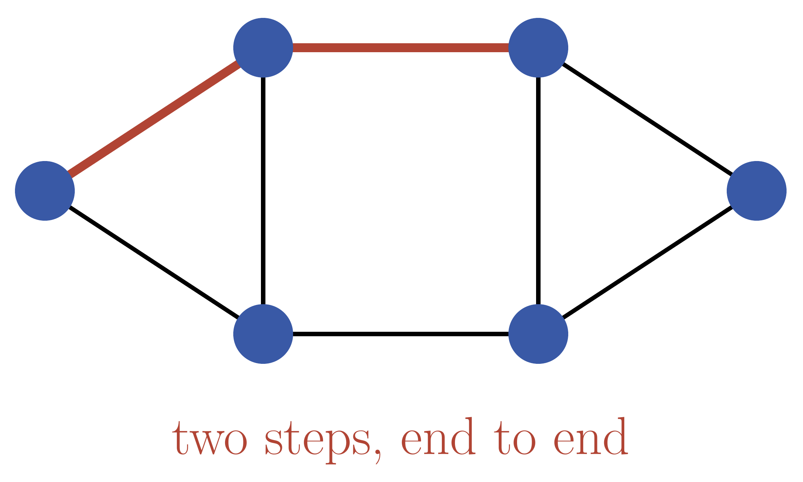
<figcaption>two steps from one end to the other</figcaption>

---

## Mix the axes

A **k-truss**: every *friendship* has to sit inside at least **k − 2** triangles.

Not a rule about people — a rule about the links themselves.

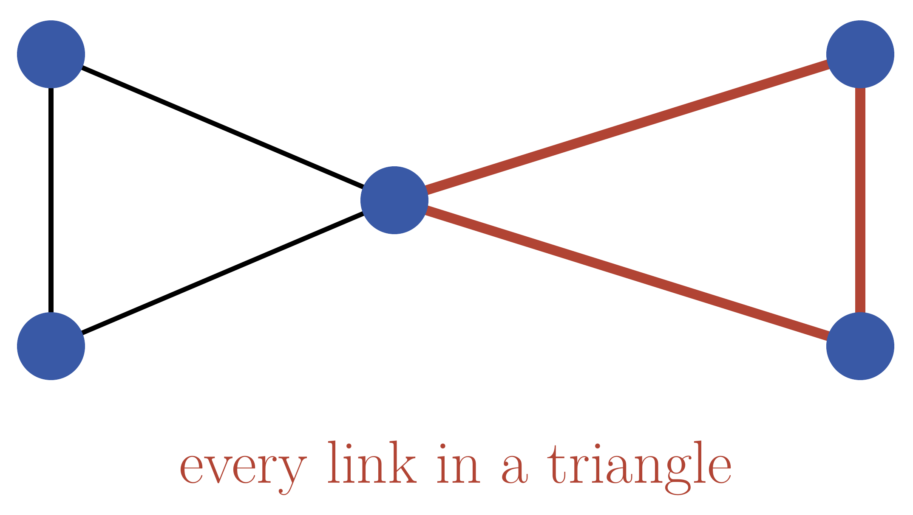
<figcaption>every link with a triangle around it</figcaption>

---

<!-- _class: mid -->

## Did any of those split the club in two?

Five definitions. Thirty-four people. Where are the two halves?

<!--
Nowhere. Wait for someone to say it.
-->

---

## They overlap, they multiply, and they do not partition

Each definition is a different answer to *what counts as a group*, so the problem is **ill-posed** — there is no fact of the matter to be right about.

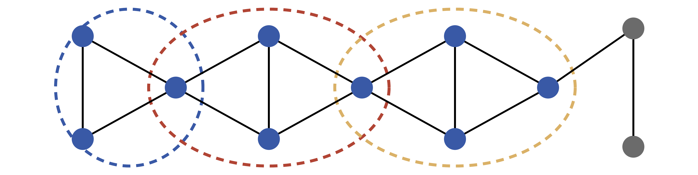
<figcaption>three definitions, three groups, overlapping — and two people in none of them</figcaption>

<!--
This is m05.c03 and it is the sentence the rest of the module keeps returning to. The move now is: stop defining, start optimising.
-->

---

<!-- _class: part -->

Part Three03 / 09

## Cut it

Zachary stopped looking for groups

---

## Stop looking for groups. Look at what runs between them

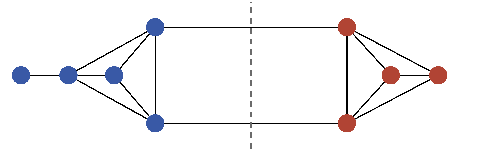
<figcaption>do not ask what a group is — ask where the network is thinnest</figcaption>

<!--
Nine members from here to the end of the part -- small enough to follow by hand. Two groups of four who all know each other, plus one person on the edge.
-->

---

## Count what you cut

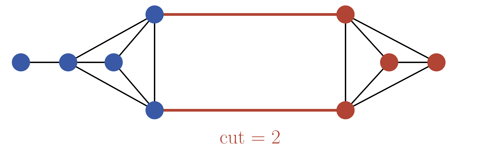
<figcaption>two friendships cross the line, so this cut costs two</figcaption>

$$\text{Cut}(V_1, V_2) = \sum_{i \in V_1} \sum_{j \in V_2} A_{ij}$$

<!--
Just a count of crossing edges. The sum is the same statement written for a computer.
-->

---

<!-- _class: mid -->

## So find the smallest cut 😈

This problem is incompletely stated. What is missing?

Thirty seconds with your neighbour.

<!--
Do NOT say the word "size" or "balance". Let the demo find it for them.
-->

---

## Live demo

Two groups of five, one friendship between them. Drag the solver and watch where it goes.

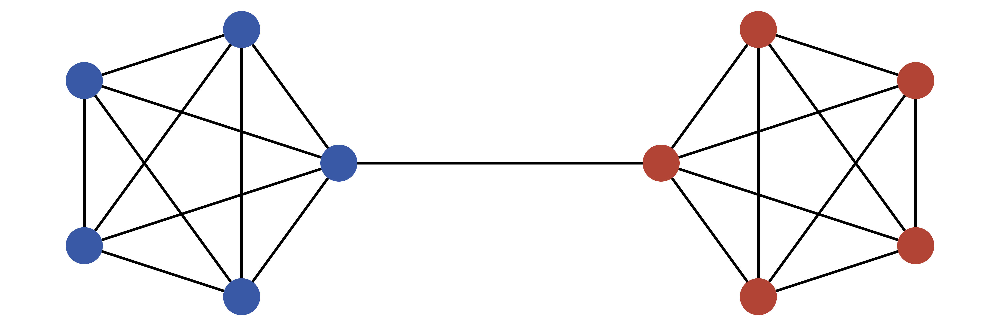
<figcaption>the network the demo starts from</figcaption>

<!--
skojaku.github.io/adv-net-sci/assets/vis/community-detection/index.html?scoreType=graphcut&numCommunities=2&randomness=1&dataFile=two-cliques.json
Let it run to the cheap answer before saying anything.
-->

---

## The cheapest cut peels one person off

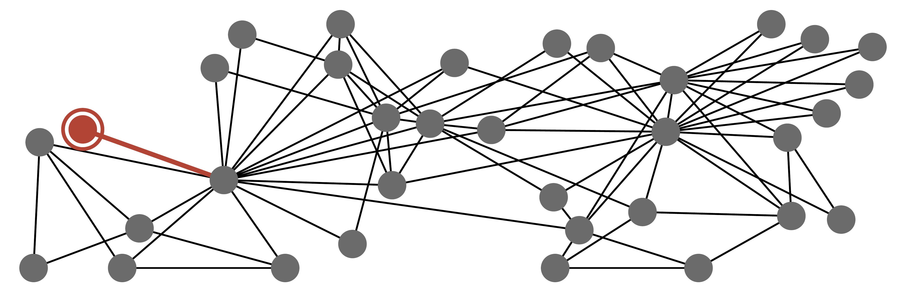
<figcaption>the club's only member with a single friend — cutting him away costs one</figcaption>

Nothing is wrong with the answer. It is genuinely the fewest crossing friendships. The **question** was wrong.

<!--
Node 12 in Zachary's numbering. A minimum cut with no constraint always finds a leaf, or an isolated corner. This is m05.c12.
-->

---

## So divide by the sizes

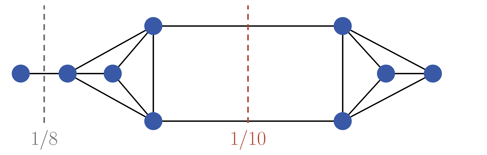
<figcaption>peeling one person scores 1/8; splitting the club scores 1/10 — and lower wins</figcaption>

$$\text{Ratio cut}(V_1, V_2) = \frac{\text{Cut}(V_1, V_2)}{|V_1| \cdot |V_2|}$$

<!--
Now the balanced split beats the trivial one. The normalizer did all the work.
-->

---

## What the normalizer does

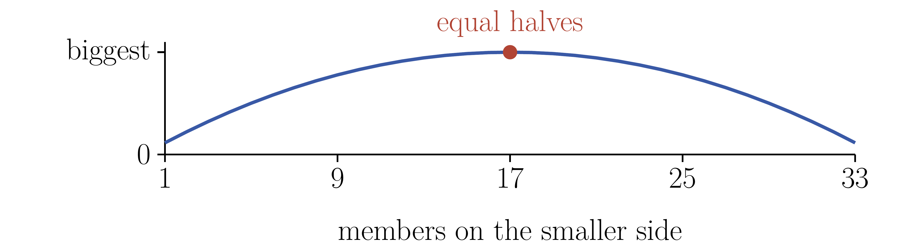
<figcaption>the product of the two group sizes, against how many people are on the smaller side</figcaption>

Biggest at equal halves, smallest when one side holds a single person. Dividing by it **punishes lopsided answers**.

---

## Balance by friendships instead of by heads

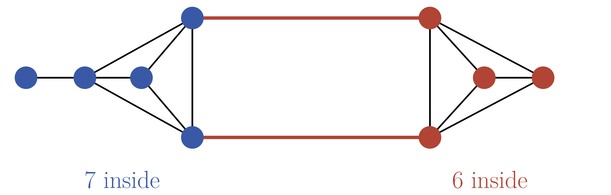
<figcaption>seven friendships inside the left group, six inside the right</figcaption>

$$\text{Normalized cut}(V_1, V_2) = \frac{\text{Cut}(V_1, V_2)}{|E_1| \cdot |E_2|}$$

<!--
2/(7x6) = 1/21. And notice: a lone person has NO friendships inside, so normalized cut cannot even score the trivial answer. It rules it out rather than penalising it.
-->

---

## More than two groups

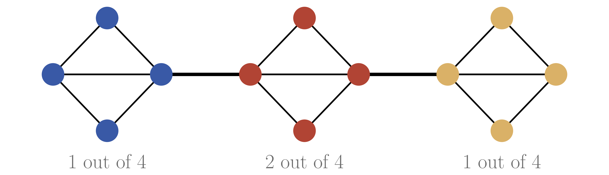
<figcaption>each group's escaping friendships, counted against its own size</figcaption>

Add up, over each group, its escaping friendships divided by its own size. Same idea, **K** times.

<!--
m05.c39. The formula is in the notes; the picture is the point.
-->

---

## Zachary ran his own club through it

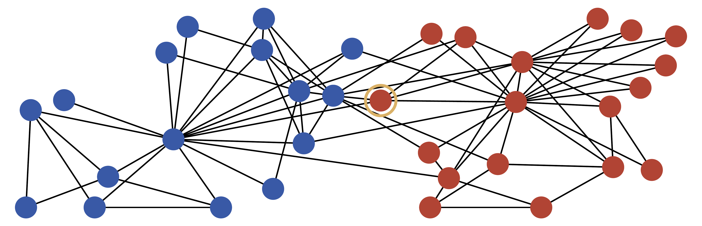
<figcaption>the cut's prediction — and it agrees with what happened for thirty-three of the thirty-four</figcaption>

A method that knows nothing but who drank with whom, predicting a fight about money.

<!--
This is reproduced, not quoted: a weighted max-flow between the two leaders gives exactly Zachary's 1977 result. Thirty-three out of thirty-four.
-->

---

<!-- _class: mid -->

## One person it got wrong

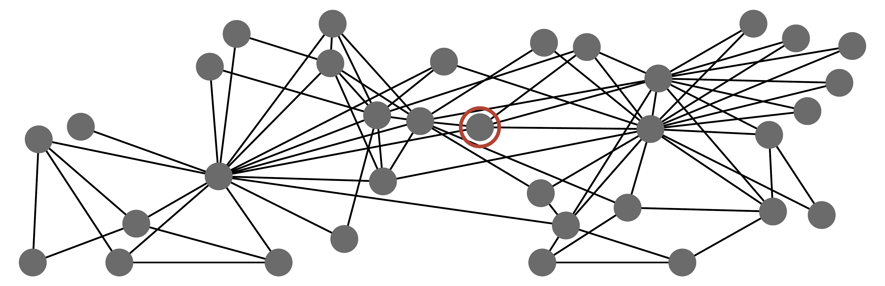
<figcaption>the one member the structure did not predict</figcaption>

I am not going to tell you who he is today. We come back to him in the last session.

<!--
Node 9. Do not name the reason. It is the closing beat of Part Eight and it lands much harder if it waits three weeks.
-->

---

<!-- _class: mid -->

## But the cut wants you to know K first

How many groups? The method will not tell you — it demands the number as input.

It also prefers equal halves, and finding the best cut is **NP-hard**.

<!--
End of day one. m05.c40, c41, c42. Leave the question hanging: what do you do when the number of groups is exactly what you do not know?
-->

---

<!-- _class: part -->

Part Four04 / 09

## More than chance

a second opinion about what a group is

---

## Not "cheap to cut" — "more inside than chance"

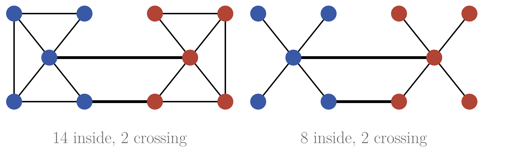
<figcaption>the same two friendships crossing, in two very different networks</figcaption>

Two crossing friendships out of thirty is remarkable. Two out of ten is Tuesday.

<!--
m05.c15. The cut counts crossings; it never asks how many crossings you SHOULD have expected.
-->

---

## Every friendship is two coloured balls on a string

Give everybody a colour — that colour is their group. Now each friendship is a string with a ball at each end.

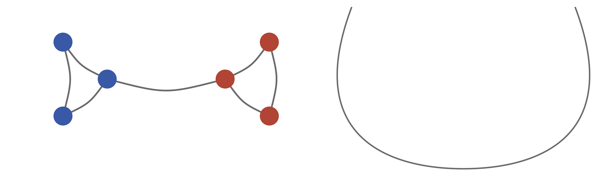
<figcaption>pull a string, cut the strings, tip the balls into the bag, draw two</figcaption>

<!--
The whole of modularity is this game. Play it slowly. The GIF runs the four stages; the next five slides walk them one at a time.
-->

---

## Pull a string. Do the ends match?

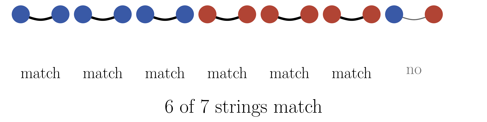
<figcaption>six of the seven strings have the same colour at both ends</figcaption>

$$\text{observed} = \frac{\text{friendships inside a group}}{m}$$

<!--
Six out of seven. That is the observed side of the ledger and nothing more.
-->

---

<!-- _class: mid -->

## Paint everyone the same colour

Now every string matches. Have you found anything?

<!--
No. Wait for them to say it. Do not say the word "chance" first.
-->

---

## So we need what chance would have given

Cut every string. Tip the balls into a bag. Now the colours are loose and nobody is anybody's friend.

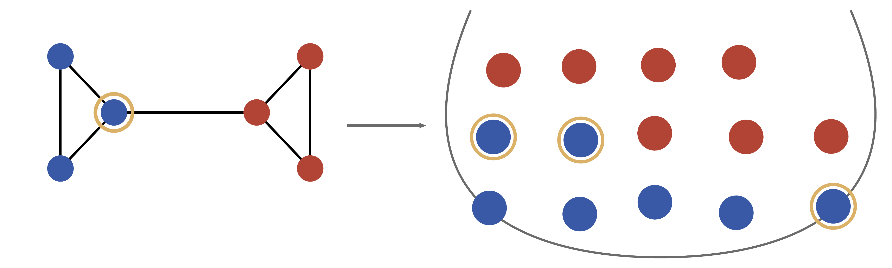
<figcaption>every friendship contributes two balls</figcaption>

<!--
This destroys the network and keeps exactly one thing: how many balls each person contributed. That is the null model, and it is a choice.
-->

---

## The bag holds 2m balls

<figcaption>the ringed member has three friends, so three of the balls are hers</figcaption>

A member with **k** friends puts in **k** balls. So the chance of pulling out her colour is $k / 2m$ — and that is where the degree enters everything that follows.

<!--
m05.c44. This is the slide that makes k_i k_j / 2m stop being an incantation.
-->

---

## Draw two balls. Do *those* match?

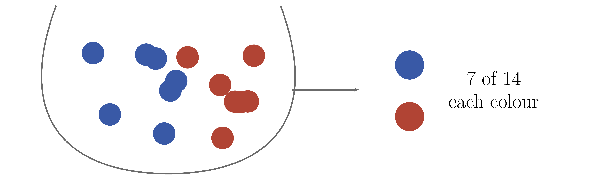
<figcaption>seven balls of each colour, drawn twice</figcaption>

$$\text{expected} = \sum_{c} \left(\frac{\sum_{i \in c} k_i}{2m}\right)^{2}$$

<!--
Half and half here, so the expected match rate is 1/2. Any grouping has such a number.
-->

---

<!-- _class: mid -->
## Modularity is the gap

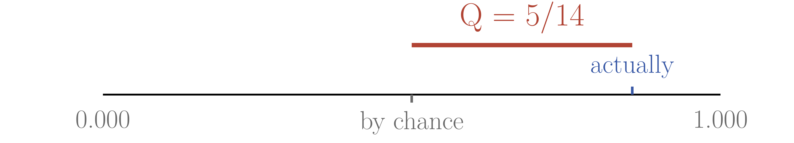
<figcaption>what the network did, against what the bag would have done</figcaption>

$$Q = \text{observed} - \text{expected}$$

<!--
6/7 minus 1/2 is 5/14. That is the whole definition; everything else is bookkeeping.
-->

---

## The same thing, written the usual way

$$Q = \frac{1}{2m}\sum_{ij}\left[A_{ij} - \frac{k_i k_j}{2m}\right]\delta(c_i, c_j)$$

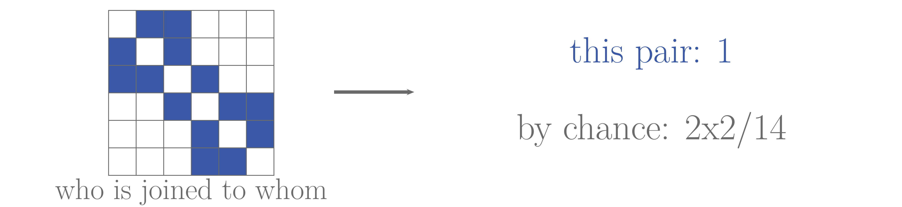
<figcaption>one pair of members: what happened, against what chance predicted</figcaption>

<!--
Go pair by pair instead of group by group. The algebra that turns one into the other is in the appendix -- expand the square, use delta(c,c_i)delta(c,c_j) = delta(c_i,c_j).
-->

---

## What "chance" actually is

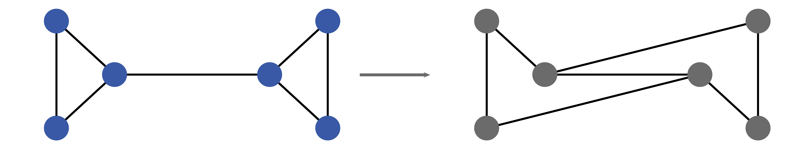
<figcaption>rewired at random, and every member keeps exactly the friends she had</figcaption>

The bag is the **configuration model**: shuffle every friendship, preserve every count. Change the null model and you change what counts as a community.

<!--
m05.c16. Worth saying out loud: this is a modelling choice, not a law. Part Seven is what it costs.
-->

---

## Your turn: compute Q by hand

Two triangles, one friendship between them, seven friendships in all. Score the grouping that splits them.

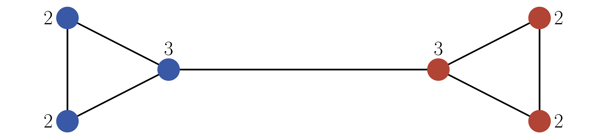
<figcaption>the number beside each member is how many friends she has</figcaption>

<!--
Two minutes, in pairs. Observed first, then expected. Do not put the answer on the board until most hands are down.
-->

---

## Five fourteenths

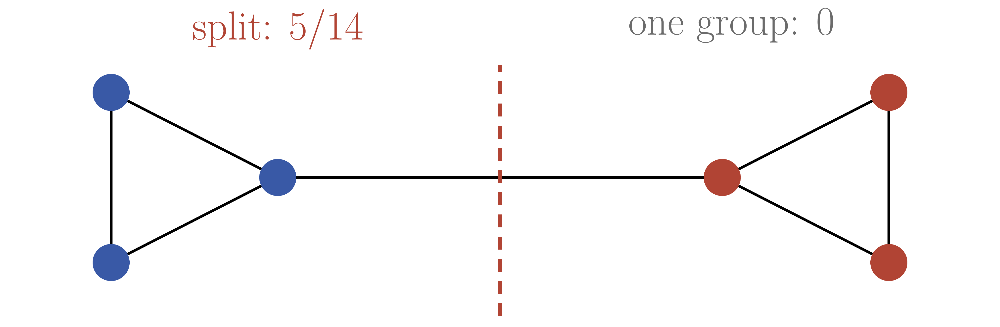
<figcaption>splitting them scores five fourteenths; calling them one group scores exactly zero</figcaption>

Q lives between −1 and 1. People quote **0.3** as the threshold for real structure.

<!--
Remember that 0.3. Part Seven kills it, on this same club.
-->

---

## What the cut could not do

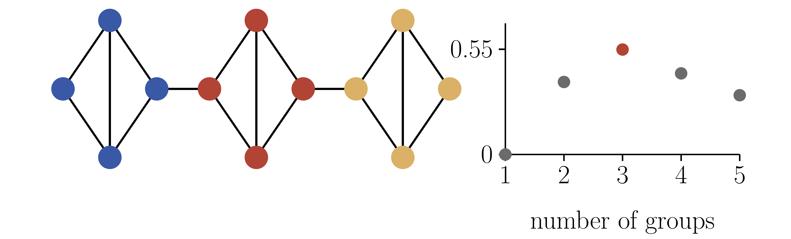
<figcaption>the same twelve people scored at one, two, three, four and five groups</figcaption>

Cut scores are not comparable across different K. **Q is.** So the number of groups falls out of the optimisation instead of going into it.

<!--
m05.c46. This is the reason modularity took over the field.
-->

---

<!-- _class: part -->

Part Five05 / 09

## Climbing Q

and why every method here is a guess

---

<!-- _class: mid -->

## How many ways can you split thirty-four people?

Any number of groups, any sizes. How many groupings are there?

Order of magnitude will do.

<!--
People guess thousands, or millions. Let them be wrong by twenty orders of magnitude.
-->

---

## About two followed by twenty-eight zeros

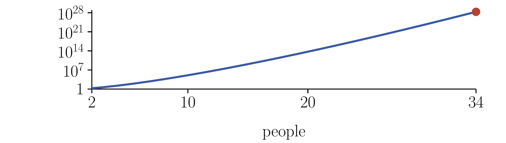
<figcaption>groupings of n people, on a log scale, up to the club's thirty-four</figcaption>

Maximising Q is **NP-hard**. Everything after this slide is a heuristic with no guarantee whatsoever.

<!--
B(34) = 2.1e28. Do NOT say "more than atoms in the universe" -- that is about 1e80 and the comparison is false.
-->

---

## Louvain, phase one

Everyone starts alone. Move each member into whichever neighbouring group raises Q the most, until no move helps.

<figcaption>one move at a time, on the club</figcaption>

<!--
This is greedy local search, and it is the whole of phase one. The GIF ends on the four communities the deck uses later.
-->

---

## Louvain, phase two

Collapse each group into one node, run phase one again, repeat. The **hierarchy is a by-product**.

<figcaption>local moves, then the groups themselves become nodes</figcaption>

<!--
Fast enough for millions of nodes. Every round is cheap because the network shrinks.
-->

---

<!-- _class: mid -->

## Must a group Louvain returns be connected inside?

It hands you a set of people and calls them a community. Can you walk from any one of them to any other without leaving the set?

<!--
Almost everybody says yes. It is not true, and the reason is worth the beat.
-->

---

## No — and Leiden fixes it

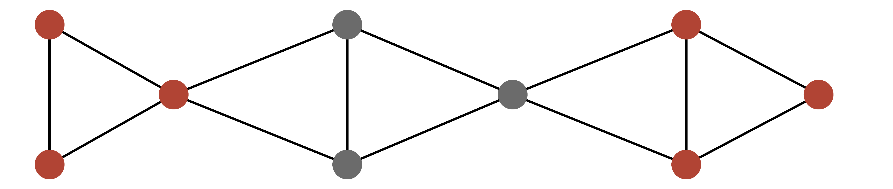
<figcaption>one group Louvain returned, in two pieces that do not touch</figcaption>

Move a broker out early and the people she was connecting stay behind, in one group, in two pieces. **Leiden** adds a refinement step that guarantees this cannot happen.

<!--
m05.c22. A real defect of a real algorithm, found years after everyone had adopted it.
-->

---

## Every method answers a different question

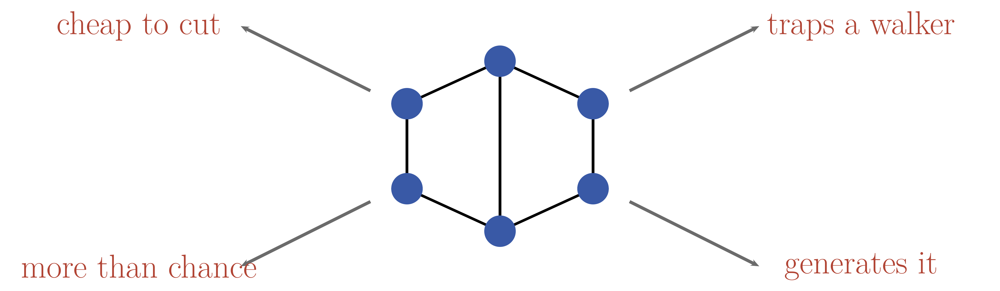
<figcaption>one network, and four different things the word "community" can mean</figcaption>

Cheap to cut. More than chance. Where a random walk gets stuck (Module 07). What the eigenvectors say (Module 08). Or: **what would generate this**.

<!--
The last one is Part Six and it is a genuinely different way to think.
-->

---

<!-- _class: part -->

Part Six06 / 09

## Turn it around

communities first, network second

---

## Build the network from the groups

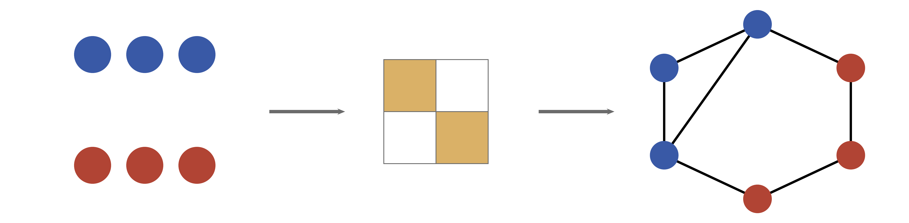
<figcaption>give everybody a group, look up the odds, roll for every pair</figcaption>

Give every member a group. Then join **i** and **j** with a probability that depends on nothing but their two groups.

<!--
m05.c29, the stochastic block model. Every other method in this module reads a network and guesses; this one writes a network and then asks which guess would have written it.
-->

---

## Sort by group, and blocks appear

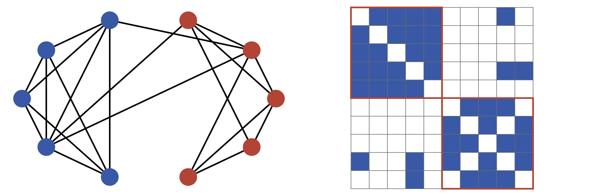
<figcaption>the same ten members, and who is joined to whom, ordered by group</figcaption>

<!--
Rows and columns are members; a filled cell is a friendship. Nothing changed but the order.
-->

---

## One small matrix decides everything

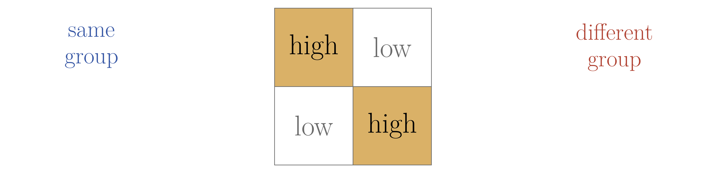
<figcaption>the chance of a friendship, for each pair of groups</figcaption>

Two groups, four numbers. Ten groups, a hundred. That matrix **is** the model.

---

## Inside more likely than outside

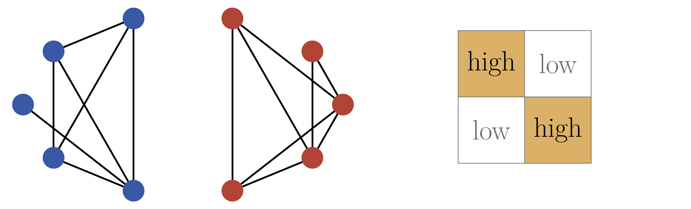
<figcaption>a high diagonal, and the communities you already recognise</figcaption>

<!--
This is the ordinary case and it reproduces exactly what modularity looks for.
-->

---

<!-- _class: mid -->

## What would you see if you flipped it?

Make friendships *between* the groups more likely than inside them. What does the network look like?

<!--
Let them describe it before showing it. Some will say "no communities". That is the interesting wrong answer.
-->

---

## Groups that connect outward

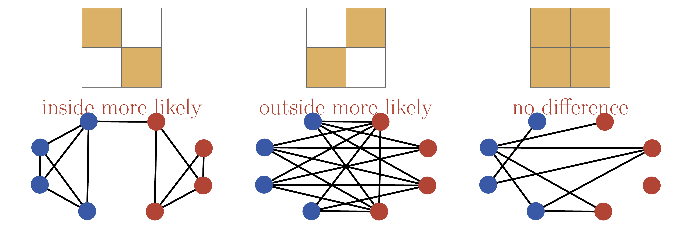
<figcaption>inside more likely; outside more likely; and no difference at all</figcaption>

<!--
m05.c52. Predator and prey; buyers and sellers; men and women in a dating network. Modularity would score these near zero and report nothing.
-->

---

## A community is a shared *pattern*

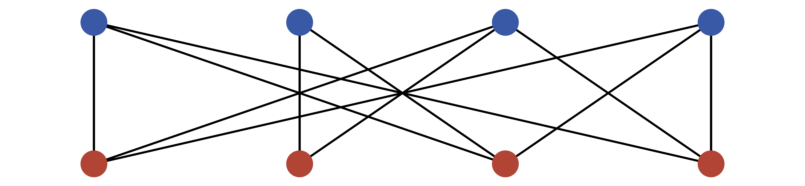
<figcaption>eight people, two groups, and not one friendship inside either group</figcaption>

Not a dense lump — a set of people who **connect to the rest of the world the same way**. That is the wide definition from Part One, and this is the model that can express it.

<!--
m05.c31. Worth pausing on: by every definition in Part Two, neither of these groups is a group at all.
-->

---

## Detection becomes inference

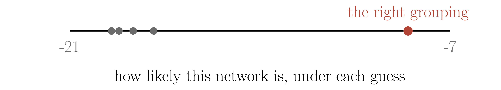
<figcaption>five candidate groupings, scored by how likely each makes the network you saw</figcaption>

Pick the grouping that makes the observed network **most probable**. Now "how many groups?" is model selection, not a rule of thumb.

<!--
m05.c32. The likelihood, its concavity, and the closed form for the block probabilities are all in the appendix.
-->

---

## Your turn: find the blocks

Here is the same network in the order you happened to receive it. Swap rows and columns until you can see the groups.

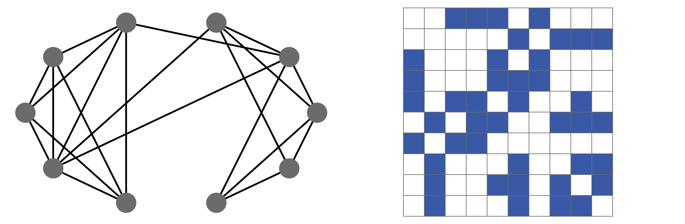
<figcaption>same members, same friendships, no order</figcaption>

<!--
Three minutes. Some will sort by degree and get close. The point is that the blocks were always there.
-->

---

<!-- _class: mid -->

## You have the tools. Next week you run them

Louvain, on real networks, with your own hands.

Pen and paper first, then the Module 05 notebook. Bring the questions you cannot answer from the slides.

<!--
End of day two. The hands-on session is where they generate the Q > 0.3 that opens Part Seven, so make sure they actually do it.
-->

---

<!-- _class: part -->

Part Seven07 / 09

## Three ways modularity lies

last week you pulled Q above 0.3 out of a random graph

---

<!-- _class: mid -->

## Two groups of five, one friendship between them

<figcaption>ten people, and one link holding them together</figcaption>

Does modularity separate them?

<!--
Everyone says yes. They are right. Say nothing about scores yet.
-->

---

## Yes — and it is not close

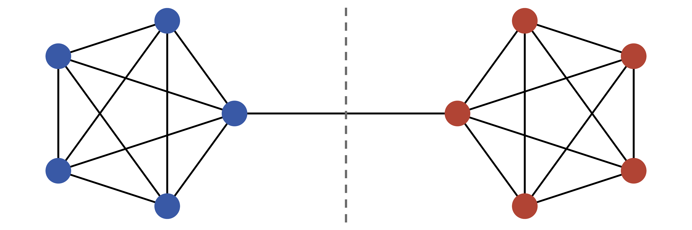
<figcaption>split, this scores 0.45; called one group, it scores exactly zero</figcaption>

Two obvious groups, and the score is emphatic about it.

---

<!-- _class: mid -->

## Now add a third, much larger group

Forty more people, somewhere else in the network, with nothing to do with these ten. What happens to the two groups of five?

<!--
Nobody expects anything to happen. That is the trap and it is worth walking into slowly.
-->

---

## Live demo

The same two groups of five. Untouched. Plus forty people who know each other.

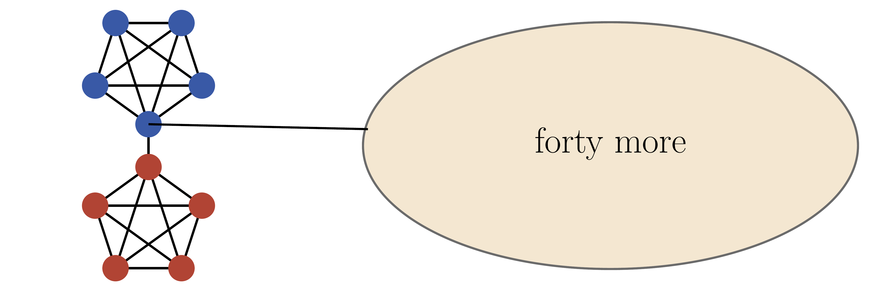
<figcaption>nothing about the two small groups has changed</figcaption>

<!--
skojaku.github.io/adv-net-sci/assets/vis/community-detection/index.html?scoreType=modularity&numCommunities=3&randomness=0.9&dataFile=two-cliques-big-clique.json
Ask for three communities. Watch it refuse.
-->

---

## The two groups get merged

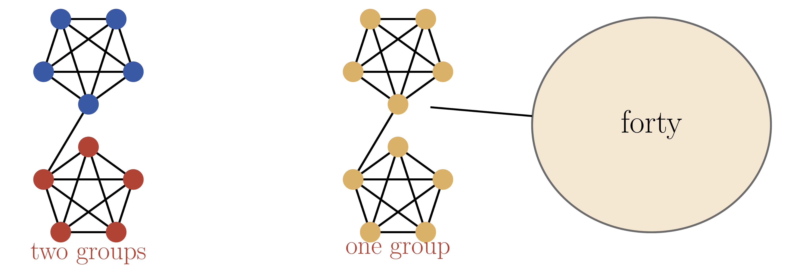
<figcaption>alone, two groups; in company, modularity insists they are one</figcaption>

Merging them **raises** Q — 0.1410 against 0.1404. Not a bug in the algorithm. The definition prefers it.

<!--
m05.c26, the resolution limit. Fortunato and Barthelemy 2007. The cliques are identical in both networks -- that is the whole argument.
-->

---

## The threshold is the square root of 2m

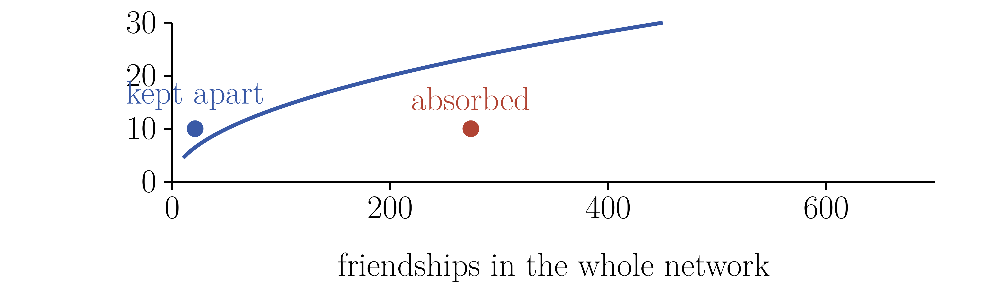
<figcaption>the same ten internal friendships, on either side of the line</figcaption>

Alone, the network has 21 friendships and the threshold is 6.5 — a group with ten survives. In company it has 274, the threshold is 23.4, and the same ten no longer clear it.

<!--
sqrt(2L) is Fortunato and Barthelemy's own statement. The lecture note says O(m); that is loose and it is being fixed.
-->

---

## A group's fate is decided somewhere else

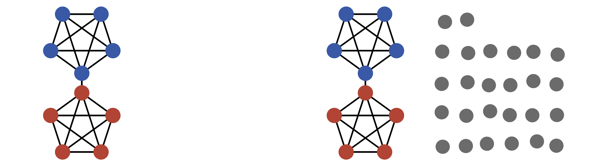
<figcaption>the same two groups, and a crowd that has never met either of them</figcaption>

Nothing inside those ten people changed. The **whole network's** size decided whether they exist.

<!--
Non-locality. This is why "just tune the resolution parameter" is a patch and not a fix.
-->

---

<!-- _class: mid -->

## Is there one best grouping?

You maximise Q and get an answer. Run it again. Same answer?

<!--
They ran it last week with different seeds, so somebody in the room already knows.
-->

---

## The landscape is rugged

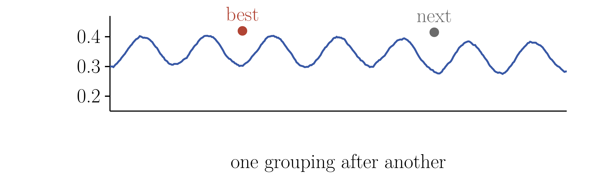
<figcaption>one grouping after another, and a great many of them nearly tie</figcaption>

Best on this club: 0.4198. Runner-up: 0.4151 — one percent apart, and the two disagree about **thirty-two pairs** of members.

<!--
m05.c27. "Near-optimal" means almost nothing when the optimum is a plateau with exponentially many nearly-equal peaks.
-->

---

<!-- _class: mid -->

## What does it return on a network with no groups at all?

Forty people, wired together at random. No groups were put in. What comes out?

<!--
Half the room will say "about zero". They did this experiment last week and it did not say about zero.
-->

---

## Live demo

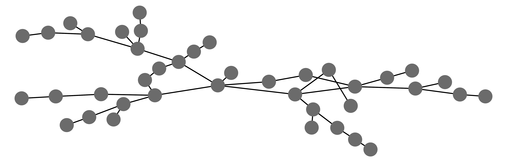
<figcaption>forty people, forty-one friendships, no structure whatsoever</figcaption>

<!--
skojaku.github.io/adv-net-sci/assets/vis/community-detection/index.html?scoreType=modularity&numCommunities=4&randomness=1&dataFile=random-net.json
-->

---

## Q = 0.66 — higher than the two obvious groups scored

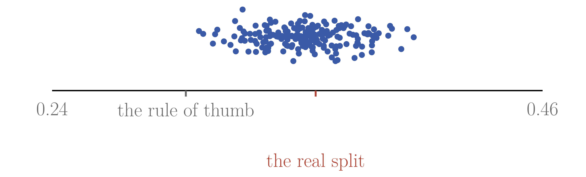
<figcaption>two hundred random networks, each with the club's thirty-four people and seventy-eight friendships</figcaption>

Every one of them clears 0.3. Their average is **0.354**; the split that really happened scores **0.358**.

<!--
m05.c28 and c47. The rule of thumb dies here, on this club, by four thousandths. Q cannot be compared across networks, and a high score alone is not evidence of anything.
-->

---

<!-- _class: part -->

Part Eight08 / 09

## How would you know?

three methods, three answers

---

## Three methods gave three different clubs

The cut said two groups of seventeen. Modularity says **four**. Which is right?

<figcaption>colour marks Louvain's four groups here, not the two clubs</figcaption>

<!--
The honest answer is "it depends what you have to compare against", and that splits the rest of this part in two.
-->

---

## Without an answer key: conductance

Count the friendships that **escape** the group. Divide by everything the group is attached to.

Low means a group that keeps to itself.

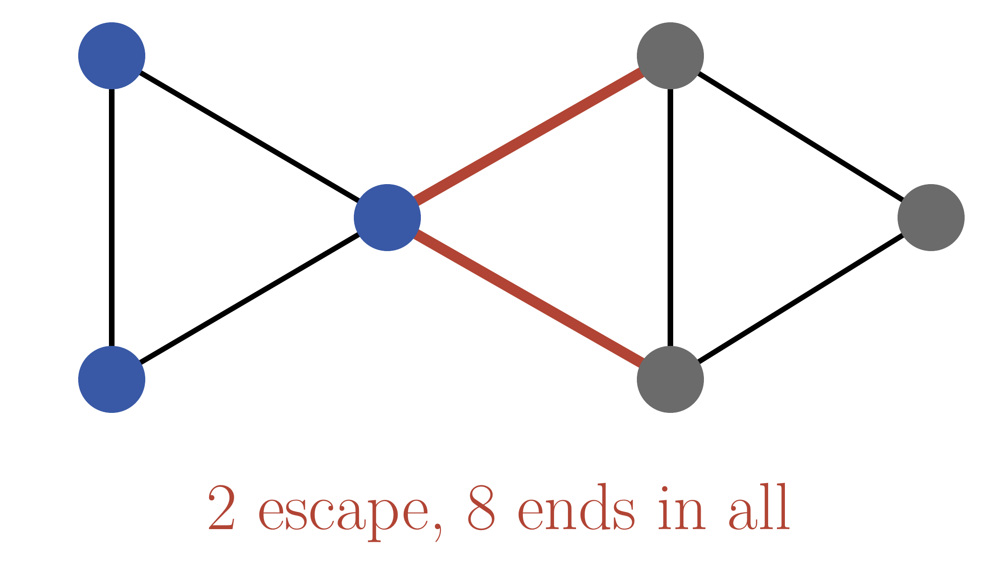
<figcaption>two friendships escape; the group has eight link-ends in all</figcaption>

---

## It scores one group at a time

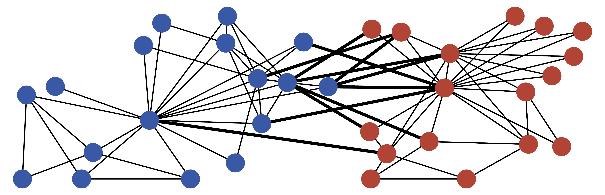
<figcaption>the split that happened scores about 0.15 — eleven escaping out of seventy-five</figcaption>

Unlike Q, this is a score **per group**, so you can ask about one community without committing to the whole grouping.

<!--
m05.c34. Internal-versus-external density is the same idea in its crudest form.
-->

---

## Every internal score just rewrites a definition

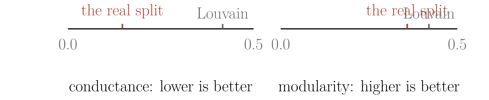
<figcaption>0.147 against 0.23–0.42 on the left; 0.3582 against 0.4198 on the right</figcaption>

They do not disagree about the facts. They disagree about **what a group is** — and neither failed an exam.

<!--
Conductance: real split 0.147 against Louvain's four groups at 0.23 to 0.42. Modularity: 0.4198 against 0.3582. Same network, same two candidates, opposite verdicts.
-->

---

## With an answer key, the unit is the pair

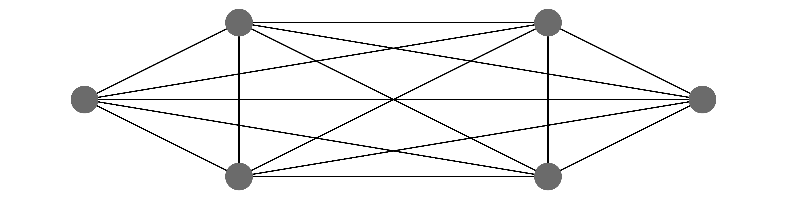
<figcaption>six people make fifteen pairs</figcaption>

Two groupings agree about a pair when both put them together, or both keep them apart. That is what every score below counts.

---

## How much does one grouping tell you about the other?

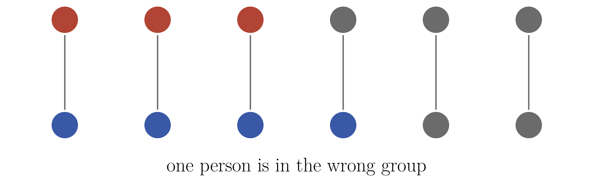
<figcaption>where each person belonged, and where the method put her — the colours are not comparable</figcaption>

Treat the two labellings as two random variables. Their **mutual information** is how much knowing one tells you about the other.

<!--
m05.c35, first half. If the method were perfect, knowing its label would tell you the true label exactly.
-->

---

<!-- _class: mid -->
## Divide by how much there was to know

<figcaption>what the two share, against everything there was to share</figcaption>

$$\text{NMI} = \frac{2\,I(X;Y)}{H(X) + H(Y)}$$

<!--
Normalising by the entropies puts it on [0,1]: 1 is identical, 0 is no information at all.
-->

---

## Your turn: score this

Six people. Three and three, really. The method put one of them in the wrong group.

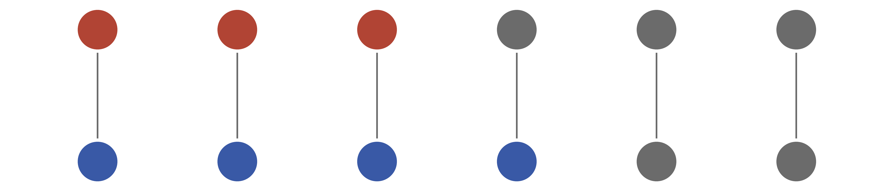
<figcaption>the truth on top, what the method said underneath</figcaption>

<!--
Ask for a guess first -- what fraction out of one? Most people say "about 0.8, it only got one wrong". Then have them count the pairs.
-->

---

## One person wrong, and the two scores disagree about how bad that is

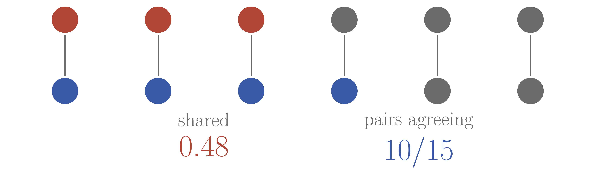
<figcaption>shared information says 0.48; counting pairs says ten of the fifteen agree</figcaption>

Ten out of fifteen is 0.67. That is the **Rand index**, and it feels generous for one person in six.

<!--
It is generous. The next slide is why.
-->

---

<!-- _class: mid -->

## A coin-flip grouping already scores two thirds

Assign all six people at random and the Rand index still comes out high. How do you fix a score like that?

<!--
Somebody will say "subtract what you would get by chance". That is exactly right and it is the same move as modularity's null model.
-->

---

<!-- _class: mid -->
## Subtract what chance would have given

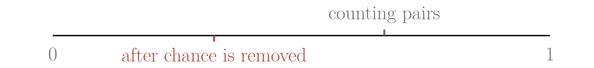
<figcaption>counting pairs gives 0.67; taking chance out leaves 0.32</figcaption>

That is the **adjusted Rand index**. Zero means you did as well as coin-flipping. Negative means worse.

<!--
m05.c36. Same correction, same spirit, as the k_i k_j / 2m in modularity. Comparing to chance is the recurring idea of this whole module.
-->

---

## Report both

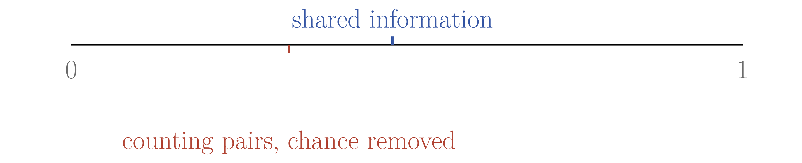
<figcaption>one grouping, one answer key, two verdicts: 0.48 and 0.32</figcaption>

Shared information is generous to methods that make many small groups; pair counting is conservative. Report both.

---

## The best score is not what happened

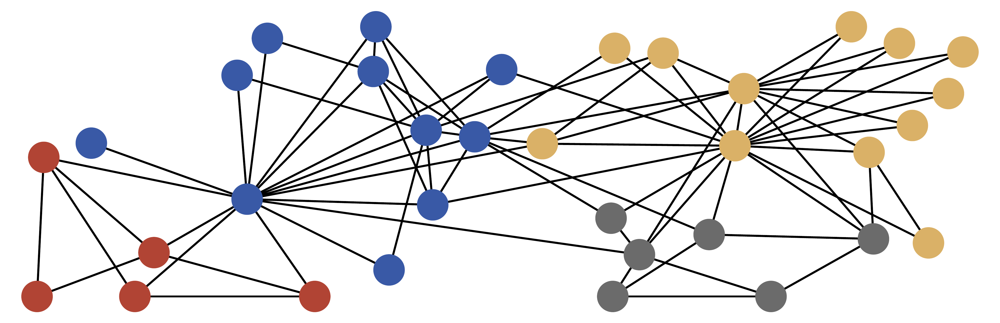
<figcaption>four groups scoring 0.4198 — and the dashed line is where the club really broke</figcaption>

The split that actually happened — seventeen against seventeen, in 1972, over money — scores **0.3582**.

<!--
Let that sit. Maximising the score does not find the event. The optimum is not the truth, and on the one network where we can check, it is not even close to the truth.
-->

---

<!-- _class: mid -->
## And it matches reality less well than the 1977 answer

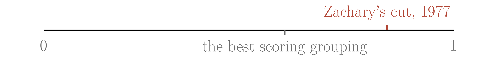
<figcaption>scored against what really happened: 0.84 for the 1977 cut, 0.59 for the best-scoring grouping</figcaption>

Fifty years of better algorithms, and the higher score is the worse answer.

<!--
Not a criticism of Louvain -- it maximised exactly what it was asked to maximise. The objective was never "predict the split".
-->

---

## And that one person

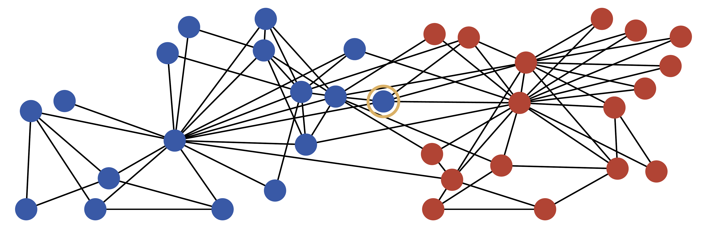
<figcaption>structurally an officer; he joined Mr. Hi's club anyway</figcaption>

He was **three weeks from his black-belt test**. Switching would have cost him his rank, because Mr. Hi was the instructor.

<!--
This is the man from Part Three. The structure was not wrong about his friendships -- it was right. It simply cannot see a belt test.
-->

---

## Metadata is not ground truth

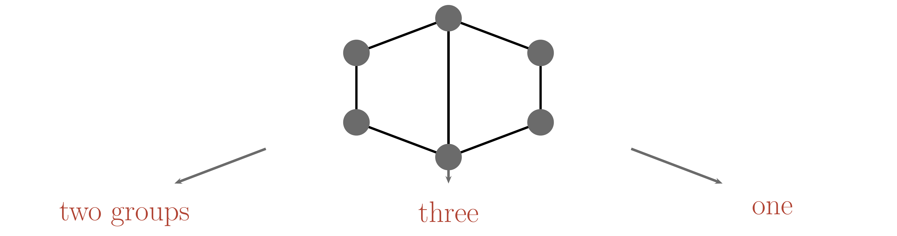
<figcaption>three methods, three answers, and no umpire in the picture</figcaption>

A low score can mean the method failed — or that the labels have nothing to do with the wiring. Nothing in the score tells you which. And **no method is best on every network**: each encodes assumptions, and the job is knowing when they hold.

<!--
Peel, Larremore and Clauset 2017, "The ground truth about metadata and community detection in networks". m05.c48, no free lunch.
-->

---

<!-- _class: part -->

Part Nine09 / 09

## Where this lands

---

## Four fields already asking this exact question

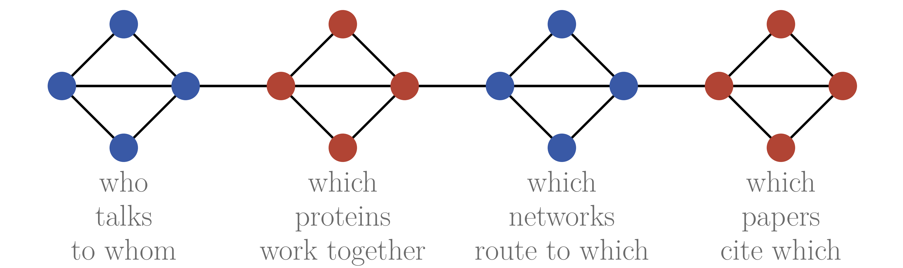
<figcaption>the same question, four times over</figcaption>

Echo chambers in political networks. Protein complexes and disease modules. Autonomous systems on the Internet. Research fields in citation data.

<!--
m05.c37. In every one of them the ground-truth problem from the last slide is live and unsolved.
-->

---

<!-- _class: mid -->
## Module 05 in one picture

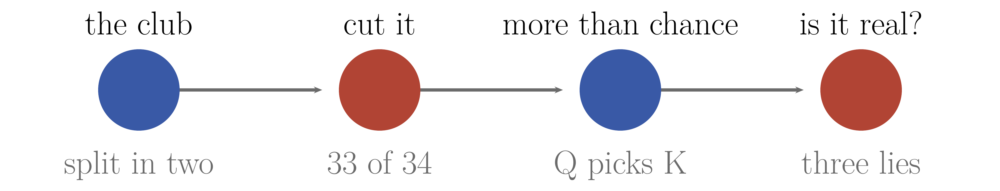
<figcaption>the club, the cut, the null model, and the doubt</figcaption>

<!--
Four moves. Story, then the maths of that story, then the general case, then everything that goes wrong with it.
-->

---

## Coming up in Module 06

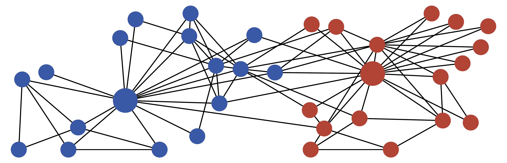
<figcaption>the club broke cleanly because two people were holding it together</figcaption>

Mr. Hi had **16** friends. John A. had **17**. Today we asked which *group* somebody was in. Next we ask which *person* matters.

<!--
Centrality. The two hubs are exactly why this network splits so cleanly, and they are the bridge into the next module.
-->
