<!-- _class: lead -->

Advanced Topics in Network Science · Module 06

# All Roads Lead to Rome

… do they?

Sadamori Kojaku · Binghamton University

<!--
Open on a stone in a forum, not on a definition of centrality. The whole module is one question asked seven ways.
-->

---

<!-- _class: mid -->

## The question for today

Which city is the most important — and important in *what sense*?

The second half of that question is the whole module.

<!--
Do not answer. Part Eight answers it, and the answer is that there is no single answer.
-->

---

## Roadmap for today

01

The Golden Milestone — importance by decree

02

Count the roads

03

Close to everything — and what breaks when the network does

04

The broker — who the traffic cannot avoid

05

Known by the company you keep

06

Everyone gets a floor — Katz, and the dial that breaks it

07

The Web has direction — hubs, authorities, PageRank

08

Which one should you use?

---

<!-- _class: part -->

Part One01 / 08

## The Golden Milestone

Rome decided who mattered, and wrote it in bronze

---

## 20 BC, the Forum Romanum

Augustus raises the **Milliarium Aureum** at the head of the Forum.

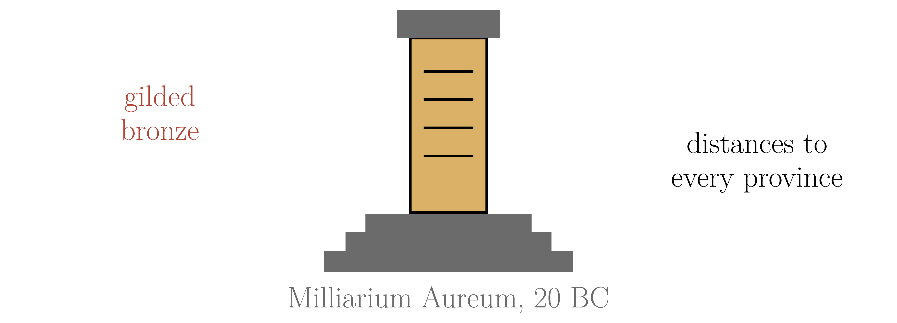
<figcaption>the marble core is still there, at the foot of the Temple of Saturn</figcaption>

<!--
20 BC. Newly made curator viarum — commissioner of roads — and the first thing he builds is a measuring point. The gilding is long gone; the marble core survives.
-->

---

## Every distance in the empire was measured from it

Not the distance between cities. The distance **from here**.

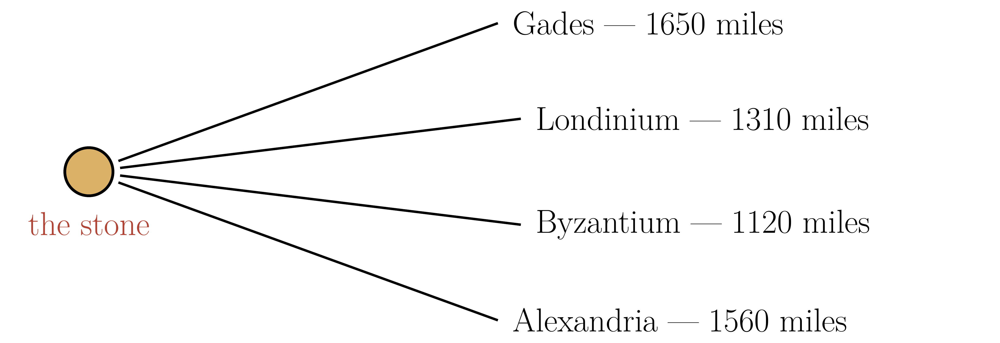
<figcaption>outward, never across — roughly, in Roman miles by road</figcaption>

<!--
Importance by decree: one authority declares a centre, and every other place is described by how far it is from that centre. This is the last time in the course that importance is something anyone can simply declare.
-->

---

## The roads themselves

Twelve cities, eighteen routes — every one of them a real road or a real sea lane.

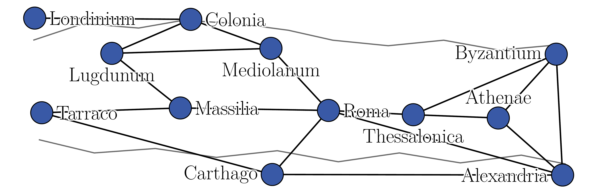
<figcaption>the Via Aurelia, the Via Egnatia, the Via Domitia, and the grain fleets</figcaption>

<!--
Name three out loud: Aurelia up the coast from Rome, Egnatia across from Brundisium to Byzantium, Domitia running into Spain. The grain runs from Carthage and Alexandria were sea lanes and carried more tonnage than any road.
-->

---

## The same picture, without the coastline

Cities become discs, routes become edges. Nothing else changes.

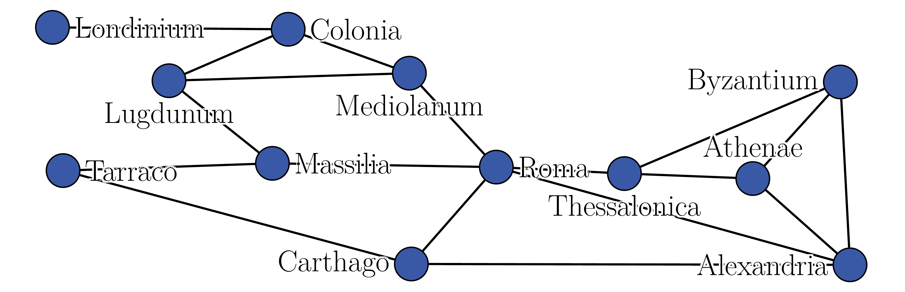
<figcaption>this one drawing is the whole of today</figcaption>

<!--
Stress that the geometry never moves again. What changes on later slides is only how dark a city is, and where the crown sits.
-->

---

<!-- _class: mid -->

## Which one is the most important?

Point at a city on that map. Do not explain yet.

<!--
Take a show of hands for two or three cities. Do not confirm anything, do not hint, and above all do not say the word "degree".
-->

---

## Your turn: your own network

Draw a line between two students who share a club.

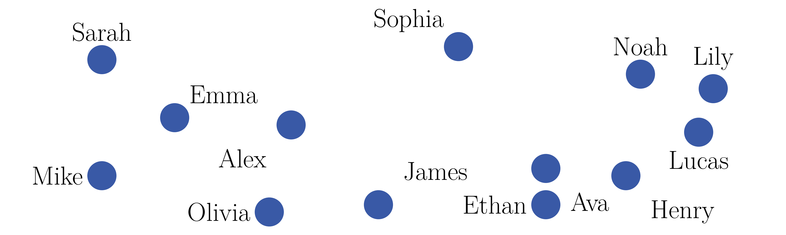
<figcaption>Drama · Art · Volunteer · Sailing · Chess · Debate · Math · Tennis</figcaption>

<!--
Three minutes, on paper. This is Question 1 of tonight's handout, so they are starting it now whether they know it or not.
-->

---

<!-- _class: mid -->

## Two jobs, one network

Who do you tell first, to spread news through the whole network fastest?

And who would you make Club Coordinator?

Same thirteen students. Two different jobs.

<!--
Let them argue. Do not write any name on the board, and do not confirm either answer — the next slide does it.
-->

---

## You have already invented three answers

Nobody has defined anything yet, and the room already disagrees.

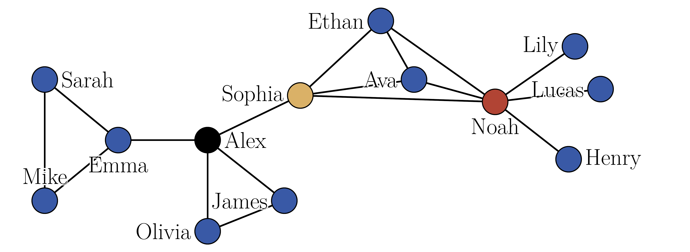
<figcaption>red Noah: tell first · gold Sophia: closest to everyone · black Alex: coordinates</figcaption>

<!--
Noah has six friends and is the obvious broadcast choice. Sophia is closest to everyone on average. Alex is the one every path between the clubs has to use — on four friends, against Noah's six.
-->

---

<!-- _class: part -->

Part Two02 / 08

## Count the roads

The cheapest question you can ask

---

## Degree centrality

$$c_i = \sum_j A_{ij}$$

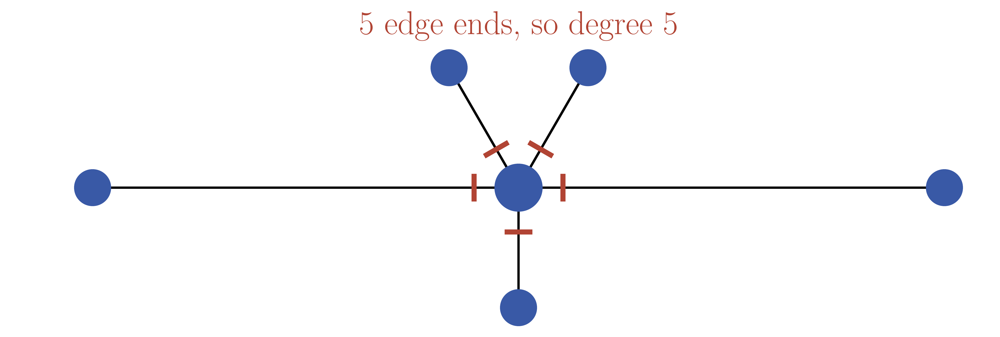

<!--
Count the edges that end at a node. That is degree centrality, and it is the whole definition — the cheapest question in the module.
-->

---

## Your turn: count the roads

Count the roads at **Rome**. Then at **Alexandria**. Call both numbers out.

<figcaption>no shading, no crown — just the map</figcaption>

<!--
Thirty seconds. Two numbers from the room before the next slide. Somebody will miscount Rome as four by missing the sea lane to Alexandria, which is worth catching out loud.
-->

---

## The first crown

Rome, with five roads. Alexandria second, with four. **The proverb checks out.**

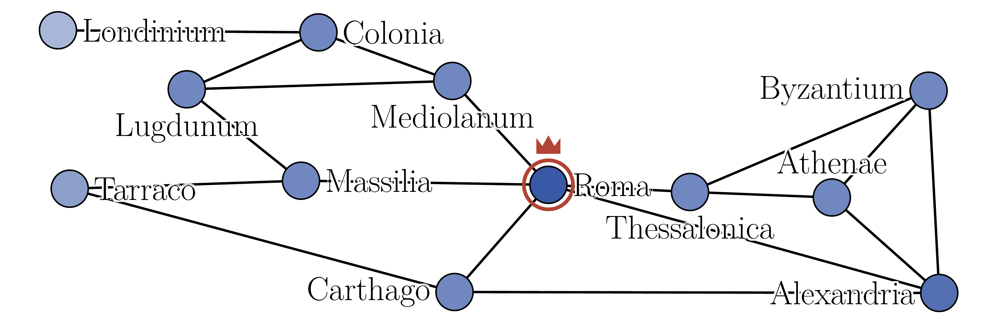
<figcaption>darker means higher degree; the crown marks the highest</figcaption>

---

## Nobody has to see the whole map

Degree is the only measure today that a city could compute for itself.

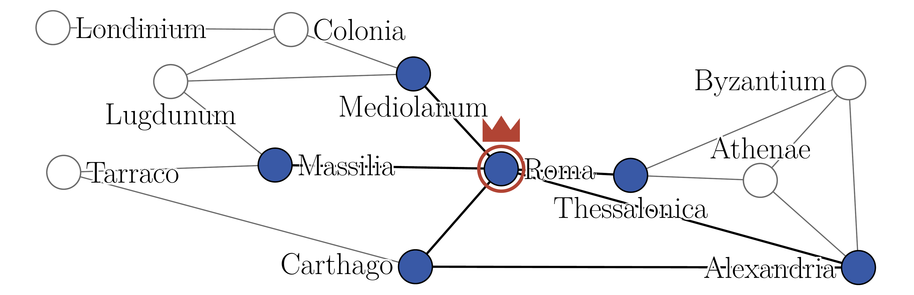
<figcaption>what Rome can see from where it stands; the rest is out of reach</figcaption>

<!--
Stand in Rome, count the roads leaving, and you are done. Every other measure today needs somebody who can see the entire network at once.
-->

---

<!-- _class: mid -->

## Is counting roads enough?

Rome has five. Alexandria has four.

Is that the whole story?

<!--
Fish for "it depends what the roads lead to". Do not resolve it; the next slide names the two ways out and Parts 3 to 7 walk them.
-->

---

## Degree sees exactly one step

Two ways to see further: **distance** (Parts Three and Four) and **walks** (Parts Five to Seven).

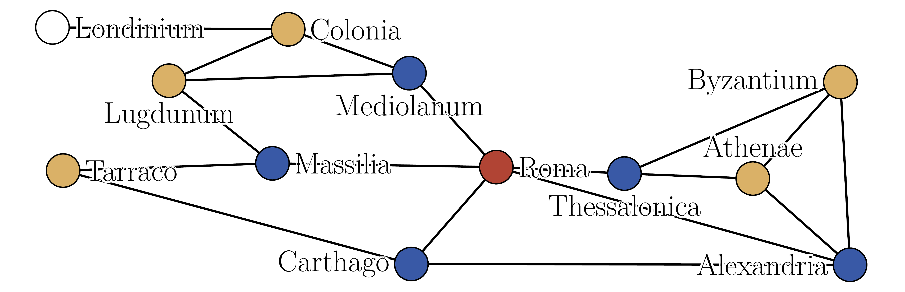
<figcaption>red Rome, blue one step, gold two — white is what degree cannot see</figcaption>

---

<!-- _class: part -->

Part Three03 / 08

## Close to everything

And what breaks when the network breaks

---

## The Milliarium's own logic

A place is central when it is **close to everything else**. That is what the stone was claiming.

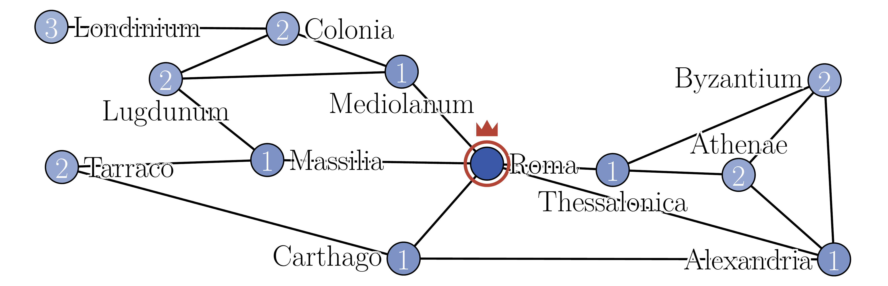
<figcaption>each city carrying its number of steps from Rome; darker means fewer</figcaption>

---

## Closeness centrality

Add up the distances from a city to every other city, and invert.

$$c_i = \frac{N-1}{\sum_j d(i,j)}$$

**Closeness centrality**: small total distance, large score.

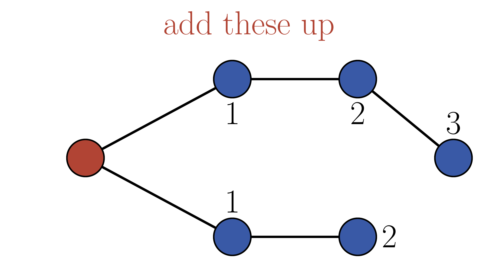
<figcaption>one node, and its distance to each of the others</figcaption>

---

## Your turn: do one by hand

Take **Massilia**. Write the distance to each of the eleven others, add them up, divide eleven by the total.

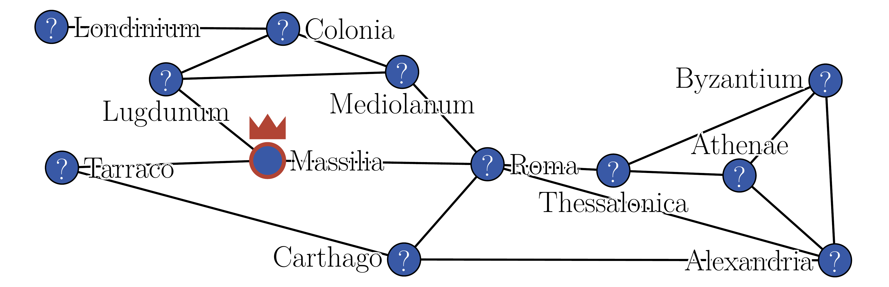
<figcaption>Massilia is crowned; every other city is holding a question mark</figcaption>

<!--
Ninety seconds. Then take the total from the room before showing the next slide.
-->

---

## Massilia's eleven distances

Three cities one step away, five at two steps, three at three. They sum to **22**, so Massilia scores $11/22 = 0.50$.

<figcaption>each city carrying its distance from Massilia</figcaption>

---

## The second crown

Rome's distances sum to 18, so Rome scores **0.61** — and takes a second crown.

<figcaption>darker means higher closeness; the crown marks the highest</figcaption>

---

<!-- _class: mid -->

## Why divide by $N-1$?

We could have used the raw total distance. Why put the number of other cities on top?

<!--
Someone will say "to compare networks of different sizes", which is right but not the sharpest answer. The sharpest answer is on the next slide: it fixes the ceiling at 1.
-->

---

## So the best possible score is exactly 1

In a **star**, the centre is one step from everybody.

Its total distance is $N-1$, so its score is $(N-1)/(N-1) = 1$ — the largest closeness any node in any network can have.

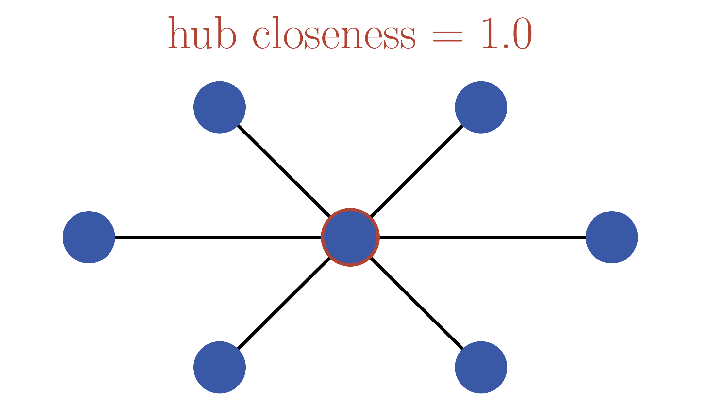
<figcaption>the only shape that reaches the ceiling</figcaption>

---

<!-- _class: mid -->

## What if the network is cut?

A winter storm closes the Channel crossing for the season. What happens to the closeness scores?

<figcaption>one route, gone — the dashed edge is the closed crossing</figcaption>

<!--
Do not say "zero" and do not say "Londinium". The trap is that it is not only Londinium's score that dies.
-->

---

## Every score dies, not just one

One unreachable city makes **every** sum infinite. Twelve cities, one value, no ranking at all.

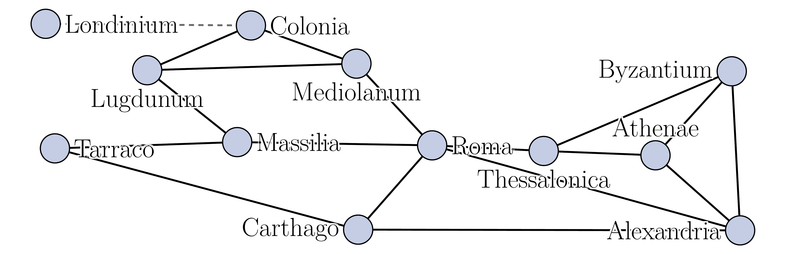
<figcaption>every city the same shade, because every city now scores exactly 0</figcaption>

---

## Take the reciprocal first

Invert each distance *before* adding, and an unreachable city contributes $1/\infty = 0$ instead of poisoning the total.

$$c_i = \sum_{j \neq i} \frac{1}{d(i,j)}$$

**Harmonic centrality** survives the cut.

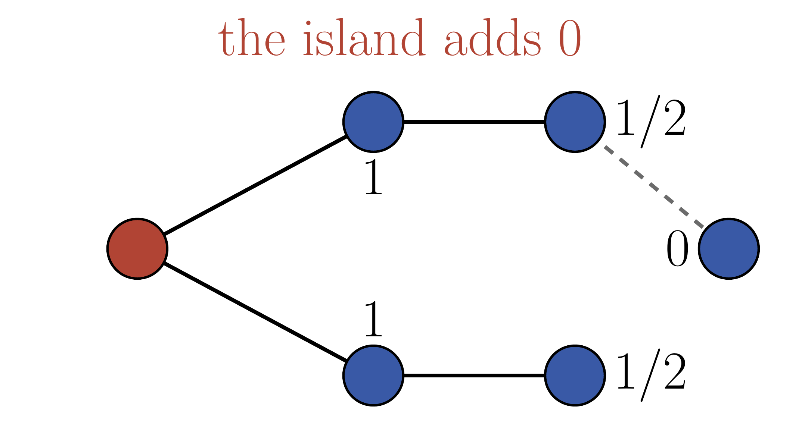
<figcaption>an unreachable node adds nothing instead of adding infinity</figcaption>

---

## The same broken map, still ranked

Rome scores 7.5, Massilia 6.2, and Londinium alone scores 0.

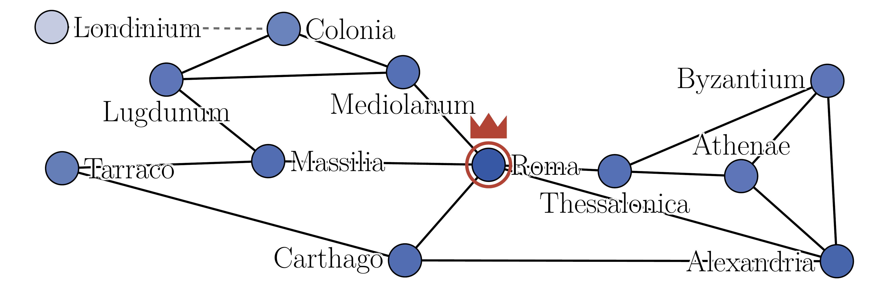
<figcaption>darker means higher harmonic centrality; the crossing is still cut</figcaption>

---

<!-- _class: mid -->

## Would you site a fire station on the average?

Closeness minimises your **average** trip.

Is that what a fire station is for?

<!--
Wait for someone to say "the worst case". That is the whole of the next slide.
-->

---

## The worst case, minimised

Score a city by its **longest** shortest path instead of its average one: $c_i = 1/\max_j d(i,j)$.

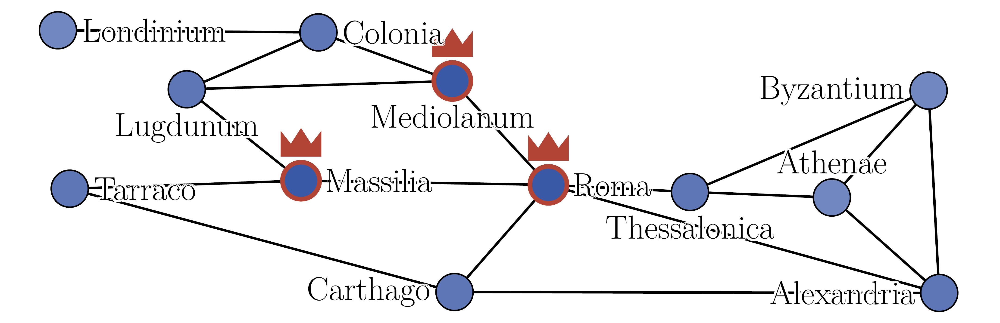
<figcaption>three cities share the crown — each reaches the whole empire in three steps</figcaption>

<!--
Massilia and Mediolanum have three roads each and Rome has five, and all three reach everything in three steps. The first crack: a ruler coarse enough to tie is a ruler that cannot rank.
-->

---

<!-- _class: part -->

Part Four04 / 08

## The broker

Who the traffic cannot avoid

---

## Trace a letter

You are carrying a letter from **Londinium** to **Alexandria**. Which cities do you have to pass through?

<figcaption>the same map</figcaption>

<!--
Let two or three students trace different routes out loud. Do not count anything yet, and do not name a winner.
-->

---

## Betweenness centrality

$$c_i = \sum_{j<k} \frac{\sigma_{jk}(i)}{\sigma_{jk}}$$

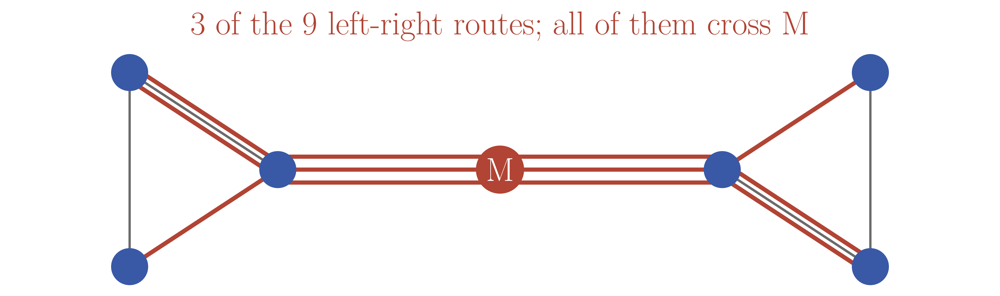

<!--
Betweenness centrality counts how often a node lies on the shortest path between two others: traffic it can broker, or block.
-->

---

## Counting the paths

$\sigma_{jk}$ counts the shortest $j$–$k$ paths; $\sigma_{jk}(i)$ counts the ones through $i$. **Ties are shared, never double counted.**

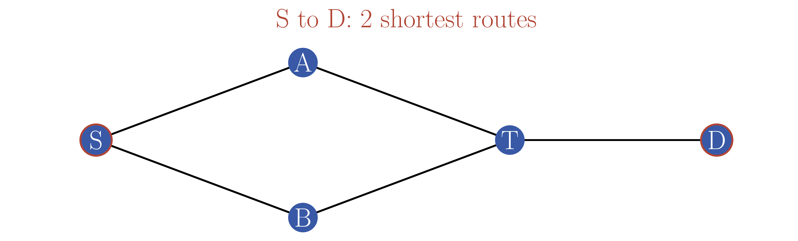
<figcaption>S to D, two ways round</figcaption>

---

## Your turn: count them

How many shortest **S–D** routes are there? How many go through **A**? Through **T**?

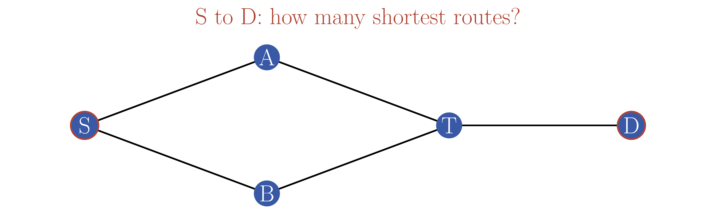
<figcaption>five nodes, count carefully</figcaption>

<!--
Sixty seconds. Take all three numbers from the room before the next slide.
-->

---

## Two routes, so a half each

$\sigma_{SD} = 2$. A carries one route and B the other, so each earns $\tfrac12$ — and T earns a whole one, because **every** route uses it.

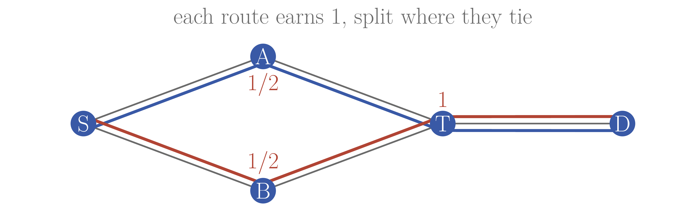
<figcaption>one route in blue, one in red, and the credit each node earns</figcaption>

---

## The third crown

Rome again — 0.50, half of all the traffic in the empire.

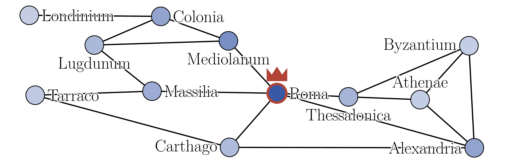
<figcaption>darker means higher betweenness; the crown marks the highest</figcaption>

---

## Now look at second place

**Mediolanum** brokers 0.27 on three roads. Alexandria brokers 0.18 on four.

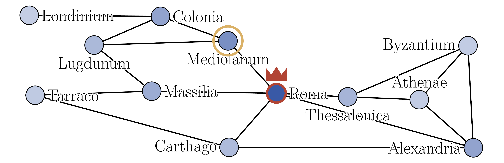
<figcaption>the gold ring is the runner-up; the red crown is still the winner</figcaption>

<!--
This is the first time in the deck that fewer connections beat more, and it is the idea the next slide isolates.
-->

---

## Bridges and brokers

Two tight groups, joined through one node holding **two** edges.

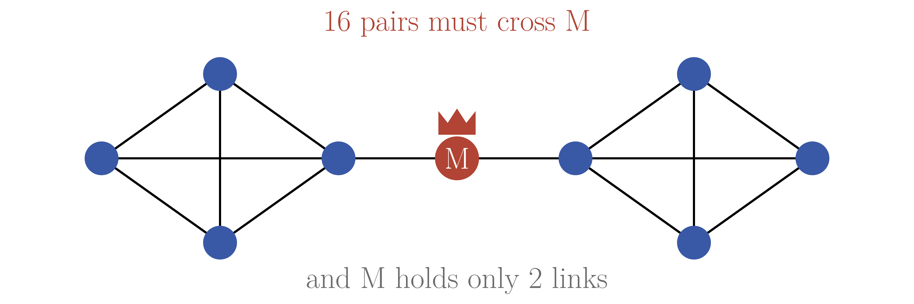
<figcaption>degree 2, and all sixteen crossing pairs</figcaption>

<!--
It is nobody by degree. Burt called the gap it sits in a structural hole; Module 05 cuts networks apart at exactly these edges.
-->

---

## Module 03, revisited: strike by degree

Take out Rome, then Alexandria — the two cities with the most roads. **Seven** of twelve stay joined.

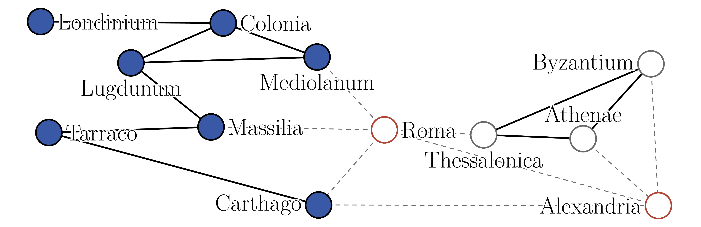
<figcaption>red rim: removed · blue: the surviving network · gray: cut off from it</figcaption>

---

## Now strike by betweenness

Rome again — and then **Tarraco, which has two roads**. Only **five** stay joined.

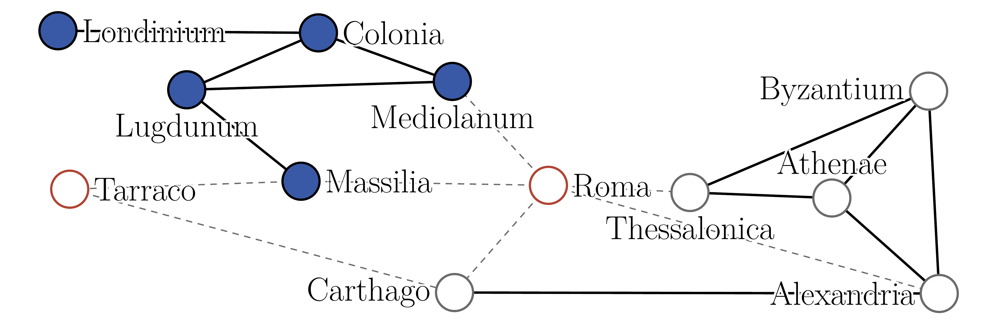
<figcaption>same marks, but the second strike chosen by traffic, not by count</figcaption>

<!--
Module 03 showed that networks die fastest when the attacker chooses well. This is what "well" means.
-->

---

## Tonight, and a question to sleep on

Handout: **"Who's the Big Cheese in the University Clubs?"** — the same thirteen students you drew this morning.

Is a city important because it is important?

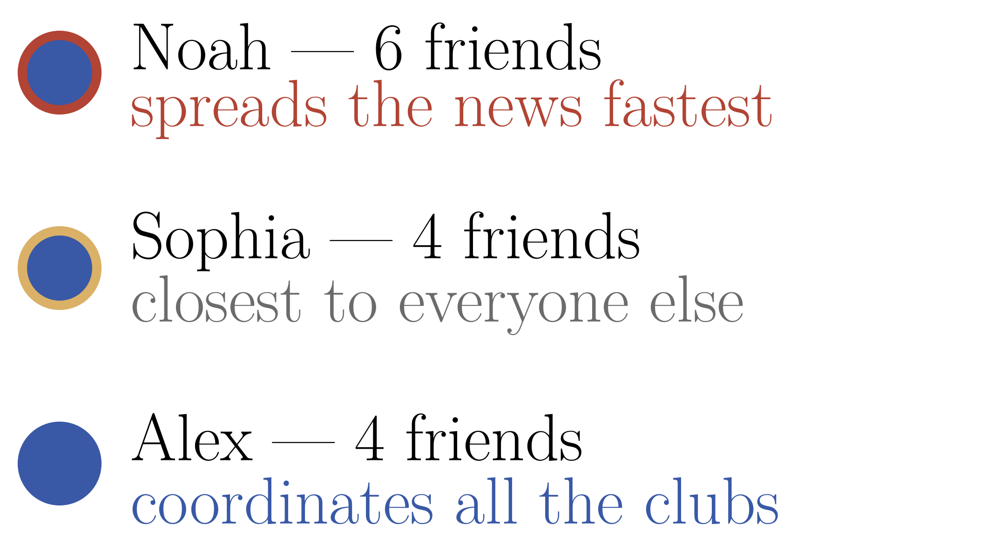
<figcaption>three questions, three students</figcaption>

<!--
The cliffhanger is deliberately circular. Tomorrow it turns into an eigenvector equation.
-->

---

<!-- _class: part -->

Part Five05 / 08

## Known by the company you keep

Importance you inherit

---

## Aesop, sixth century BC

*A man is known by the company he keeps.*

Two cities with the same number of roads are not the same city, if one of them is connected to the capital and the other to two villages.

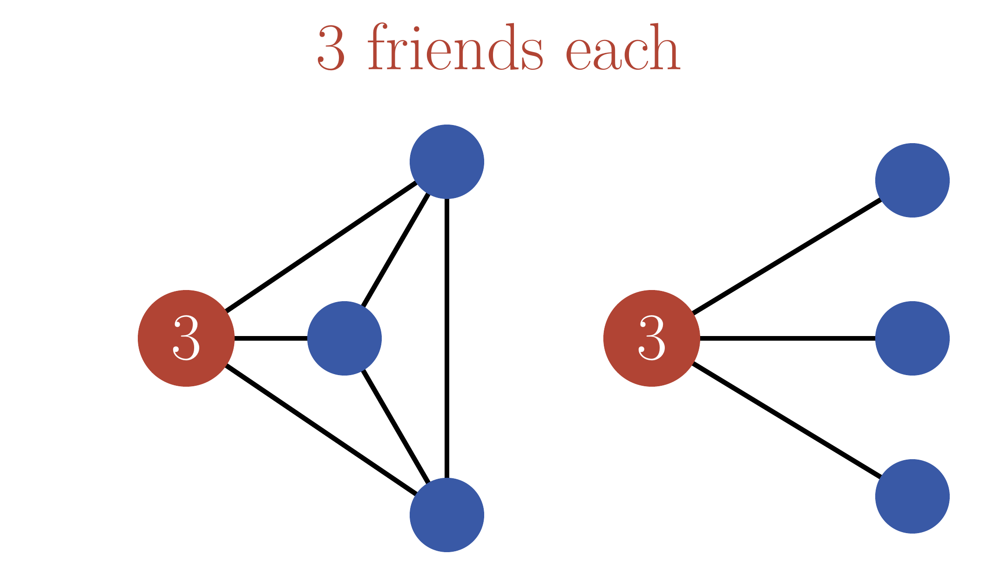
<figcaption>equal degree, unequal company</figcaption>

---

## Importance you inherit

Stop counting neighbours. Add up their **scores** instead.

$$c_i \propto \sum_j A_{ij}\, c_j$$

A node is important if its neighbours are.

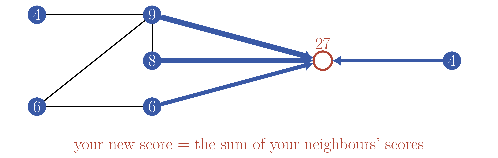
<figcaption>score arriving from each neighbour</figcaption>

---

<!-- _class: mid -->

## Isn't that circular?

To know Rome's score I need Milan's.

To know Milan's I need Rome's.

Can this be computed at all?

<!--
Let the objection stand for a moment. It is a good objection. The answer is that the circularity is exactly what makes it solvable.
-->

---

## It is an eigenvector equation

Write that one line for all twelve cities at once and the sum becomes a matrix product.

$$\lambda\, c = A\, c$$

**Eigenvector centrality** is the vector that comes back unchanged, up to scale.

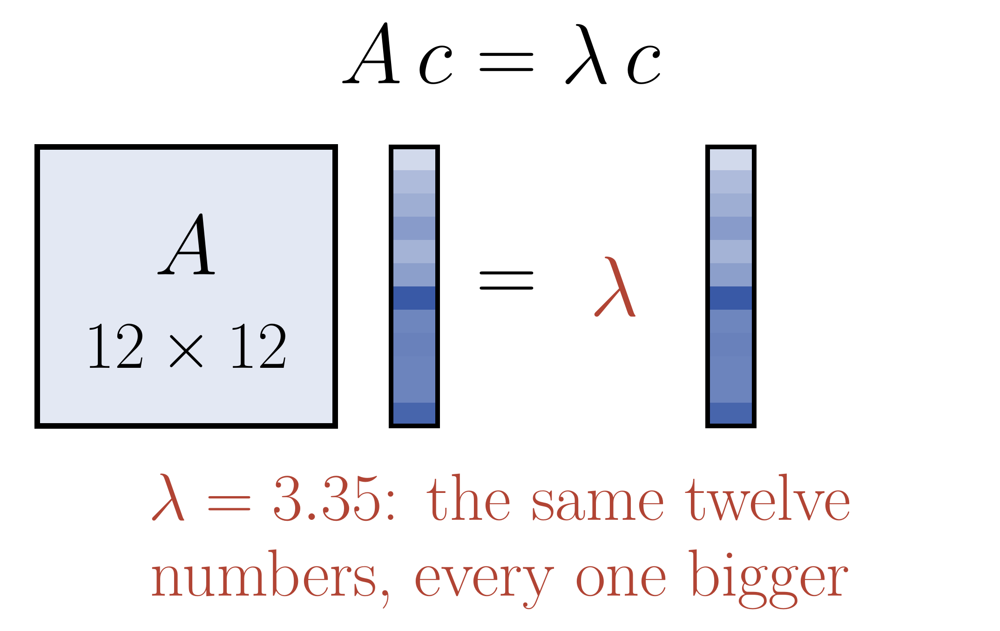
<figcaption>the matrix acting on the scores</figcaption>

<!--
Eigenvector centrality is the vector that comes back unchanged, up to scale. Say the words "eigenvector centrality" here for the first time.
-->

---

<!-- _class: mid -->

## Which eigenvector?

A twelve-by-twelve matrix has twelve of them.

Most have negative entries.

What would a negative importance mean?

<!--
No hints. The next slide names the theorem.
-->

---

## Perron and Frobenius

For a connected network with non-negative $A$, **one** eigenvalue is larger than all the others, and its eigenvector is unique and **strictly positive**.

Perron proved it in **1907**; Frobenius extended it in **1912**.

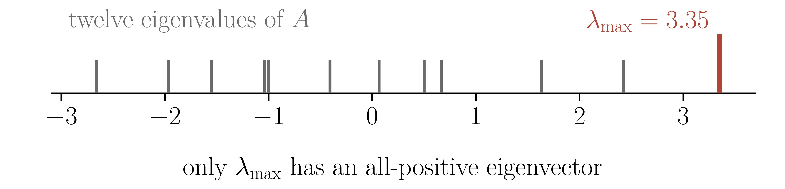
<figcaption>twelve eigenvalues, one usable</figcaption>

<!--
That theorem is the licence to say "the" eigenvector centrality. Without it the definition would not pick out a single answer.
-->

---

## Power iteration

Everyone starts at 1. Add up your neighbours. Rescale. Repeat.

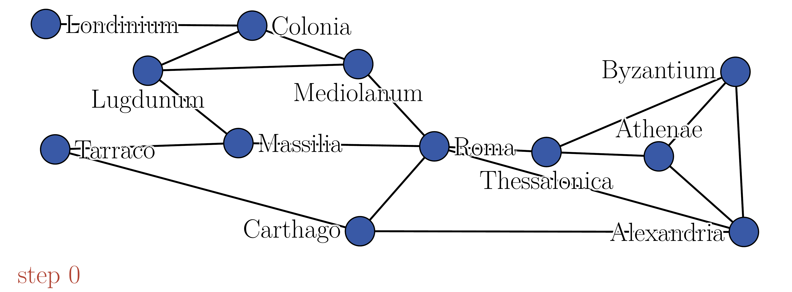
<figcaption>no eigenvalue solver anywhere — just addition, over and over</figcaption>

---

## Step one is degree

Step 0 is flat: everybody equal.

**Step 1 is exactly the degree ranking**, because the first sum is only a count.

After that the score arrives from further away, and the order stops changing by step 4.

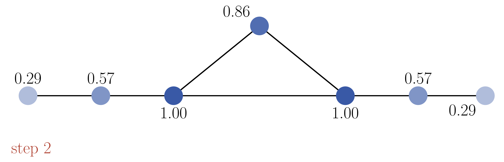
<figcaption>two rounds of adding up neighbours</figcaption>

<!--
The crown is decided after a single step. Everything after that is sorting out the rest of the ranking.
-->

---

## Why it converges

Write the starting vector in the eigenbasis. Multiplying by $A$ multiplies each piece by its own $\lambda$.

So every piece but the leading one shrinks like $|\lambda_i/\lambda_1|^t$ — and the slowest here is **0.80**.

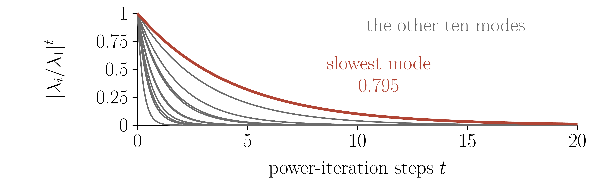
<figcaption>every other mode, dying</figcaption>

<!--
Write the starting vector in the eigenbasis: multiplying by A multiplies each piece by its own eigenvalue, so every piece except the leading one shrinks geometrically.
-->

---

## Module 01, revisited

$A^t$ counts **walks of length $t$**.

Power iteration counts walks and lets the long ones dominate — so eigenvector centrality answers "where do most walks end up?"

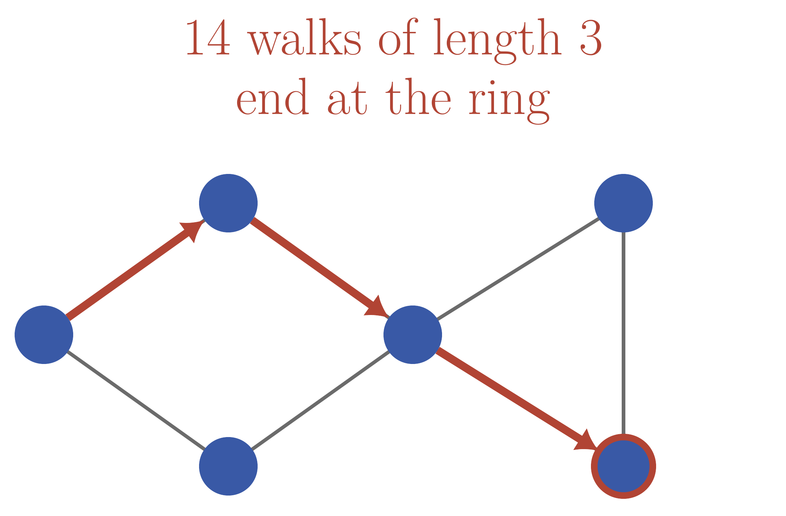
<figcaption>three walks of length 3, arriving</figcaption>

---

## The fourth crown

Rome again — but **Alexandria is within 8%** with one road fewer.

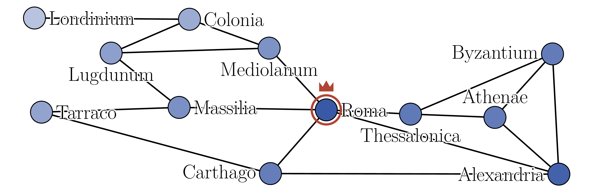
<figcaption>darker means higher eigenvector centrality; the crown marks the highest</figcaption>

<!--
The company you keep nearly closes a gap that counting cannot.
-->

---

<!-- _class: mid -->

## Where does this break?

Describe a network where this ranking would be useless.

Thirty seconds with your neighbour.

<!--
Steer nobody. If someone says "a network with one dense clump", they have it exactly, and the next slide is their answer drawn.
-->

---

## It piles up in one place

A tight cluster feeds itself, and the far end of the tail is *invisible*.

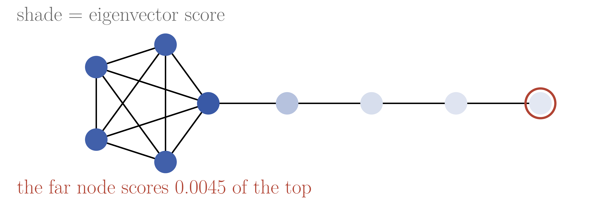
<figcaption>five nodes take almost everything; the ringed node scores 0.0045 of the top</figcaption>

<!--
0.0045 is not "small", it is below anything a ranking can distinguish. This is the failure Katz was written to repair, and Part Six opens on it.
-->

---

<!-- _class: part -->

Part Six06 / 08

## Everyone gets a floor

Katz, and the dial that breaks it

---

## Give everybody a baseline

Hand every node a fixed amount $\beta$ before any inheriting happens.

$$c = \beta\mathbf{1} + \lambda A c$$

**Katz centrality**: now nothing can be stuck at zero.

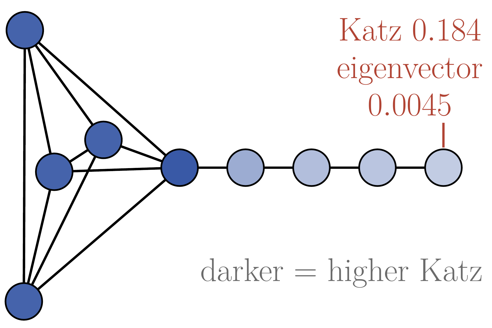
<figcaption>the same tail, lifted off the floor</figcaption>

<!--
0.0045 becomes 0.184 — a factor of forty on the node the previous measure could not see.
-->

---

## Solve it once

Collect the $c$ terms on one side and invert.

$$c = \beta\,(I - \lambda A)^{-1}\mathbf{1}$$

One matrix inverse, and the recursion is gone.

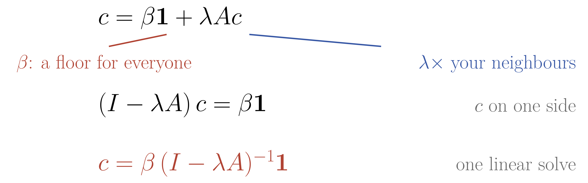
<figcaption>the same equation, rearranged</figcaption>

---

<!-- _class: mid -->

## What is that inverse counting?

$$(I - \lambda A)^{-1}$$

It came out of algebra. What does it *mean*?

<!--
If nobody bites, remind them what one over one minus x expands into. Do not say the word "walks" yet.
-->

---

## Walks, discounted by length

Expand the inverse as a series and every power of $A$ appears.

$$c = \beta \sum_{t \ge 0} \lambda^t A^t \mathbf{1}$$

Katz counts **every walk of every length**, discounting a walk of length $t$ by $\lambda^t$.

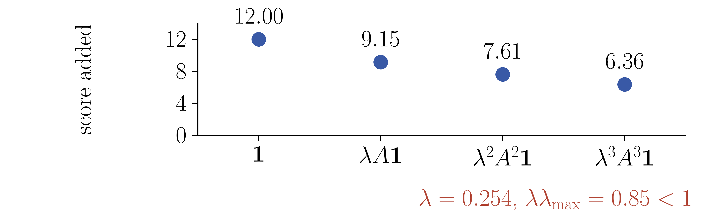
<figcaption>each term smaller than the last</figcaption>

---

## $\lambda$ is a dial

Turn $\lambda$ down and only the shortest walks survive: Katz becomes **degree**.

Turn it up and long walks count as much as short ones: Katz becomes **eigenvector centrality**.

Everything useful is in between.

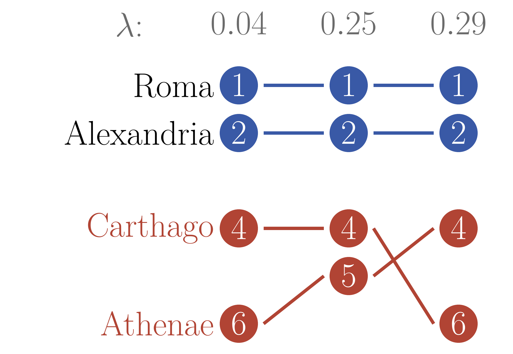
<figcaption>the top of the ranking, at three settings</figcaption>

<!--
Everything useful is in between. Turning the dial down keeps only the shortest walks; turning it up lets long walks count as much as short ones.
-->

---

<!-- _class: mid -->

## How far can you turn it?

Predict first: what happens if I keep raising $\lambda$?

Say it out loud before we run it.

<!--
Collect two or three predictions. "It grows" is the common one. "It stops working" is the right one, and the next slide says exactly when.
-->

---

## Past $1/\lambda_{\max}$ it stops meaning anything

The series converges only while $\lambda < 1/\lambda_{\max}$.

Here $\lambda_{\max} = 3.35$, so the ceiling is **0.299**.

Set $\lambda = 0.344$ and **eleven of the twelve scores go negative**.

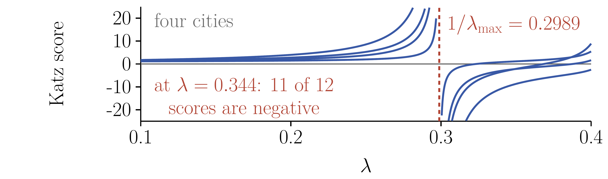
<figcaption>scores against lambda, crossing zero</figcaption>

---

## The fifth crown

Rome, with Alexandria at 0.89 behind it. Five measures now, and the crown has not moved.

<figcaption>darker means higher Katz score; the crown marks the highest</figcaption>

---

<!-- _class: part -->

Part Seven07 / 08

## The Web has direction

Hubs, authorities, and PageRank

---

## A road runs both ways. A link does not.

Write $A_{ij} = 1$ when **$i$ links to $j$**. One page here links to four others; one links to nothing at all.

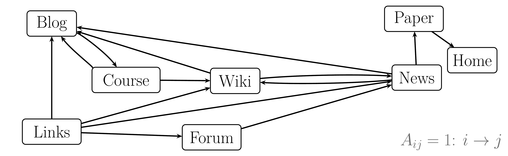
<figcaption>eight pages, fourteen links, arrows pointing where they point</figcaption>

<!--
Say the second half out loud: a link is not a road, it is a recommendation. That asymmetry is the whole of Part Seven.
-->

---

<!-- _class: mid -->

## Which page is important?

A page that links to everything, or a page that everything links to?

<figcaption>eight pages, no scores</figcaption>

<!--
Both answers are defensible and that is the point. Do not resolve it.
-->

---

## Both — and they are different quantities

A good **hub** points at good authorities. A good **authority** is pointed at by good hubs. Two scores per page, each defined through the other.

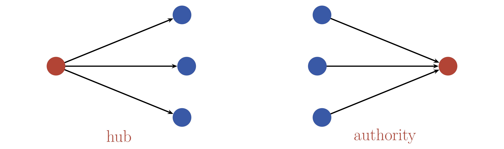
<figcaption>the two roles a page can play</figcaption>

---

## Two coupled equations

$$x = A y \qquad y = A^{\top} x$$

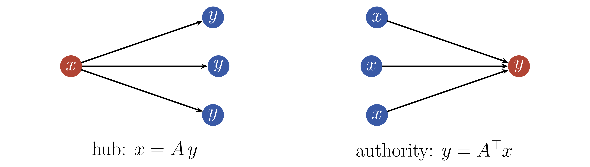

<!--
Substitute one into the other and each is an eigenvector problem: hubs are the leading eigenvector of A A-transpose, authorities of A-transpose A. HITS, Kleinberg 1999.
-->

---

## Your turn: pick them by eye

Which page is the best **hub**? Which is the best **authority**? Argue from the arrows, not from a formula.

<figcaption>eight pages, no scores</figcaption>

<!--
Sixty seconds. Two crowns to collect, and they must not land on the same page.
-->

---

## Two crowns, two pages

The first time today that one network gave two different answers at the same time.

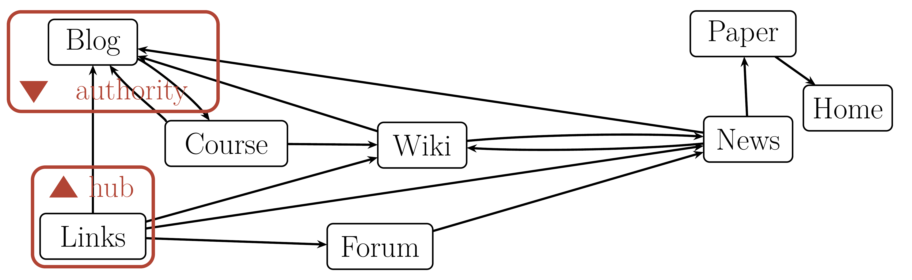
<figcaption>the hub crown and the authority crown, on different pages</figcaption>

---

<!-- _class: mid -->

## What if you run HITS on a road map?

Our Roman network is undirected — every road runs both ways, so $A = A^{\top}$. What do hubs and authorities become?

<figcaption>no arrows anywhere</figcaption>

---

## It collapses back to Part Five

With $A$ symmetric, $A^{\top}A = A^2$, so $A^{\top} A\, c = \lambda^2 c$: the same vector, and only the eigenvalue is squared.

<figcaption>the Part Five picture, unchanged: hubs and authorities are that same vector</figcaption>

---

## The same equation, six times

Chess players, popular children, sociograms, web pages. Parts Five to Seven are one idea rediscovered.

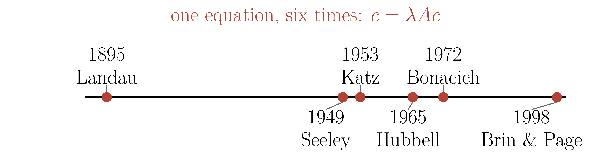
<figcaption>a century of people solving the same problem without knowing it</figcaption>

<!--
Landau 1895 was ranking chess tournaments. Seeley 1949 was ranking children by who liked whom. Katz 1953, Hubbell 1965, Bonacich 1972 — all sociology. Brin and Page arrive in 1998 and none of the earlier work is cited.
-->

---

<!-- _class: mid -->

## 1998, Stanford

You are ranking the entire Web by counting links.

What is the first thing somebody does to you?

<!--
"They make a page with a thousand links on it." Exactly. Do not say how PageRank answers it.
-->

---

## Divide the vote

$$c_i = (1-\beta)\sum_j \frac{A_{ji}\,c_j}{d^{\text{out}}_j} + \frac{\beta}{N}$$

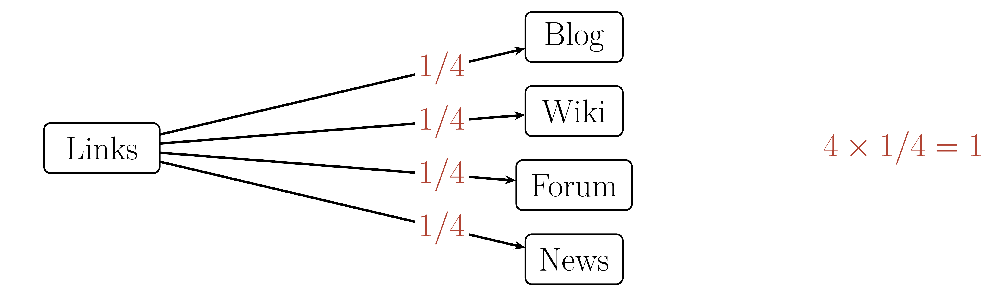

<!--
A page has one vote and splits it among its out-links, so a link from a page that links to everything is worth almost nothing.
-->

---

## A different crown

The page HITS crowned as the best hub is the page PageRank ranks **eighth of eight**.

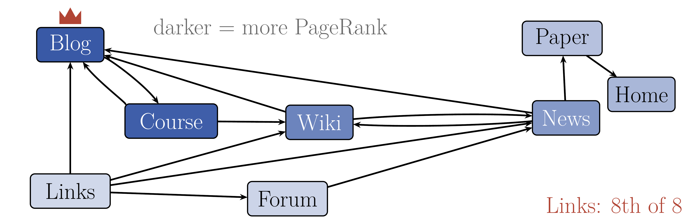
<figcaption>darker means higher PageRank; the crown marks the highest</figcaption>

<!--
This is the payoff the whole module has been walking toward. Same network, same arrows, two defensible definitions, and they disagree completely.
-->

---

<!-- _class: mid -->

## The walker reaches a dead end

Follow the links at random. Sooner or later you land on a page with nothing to click. Now what?

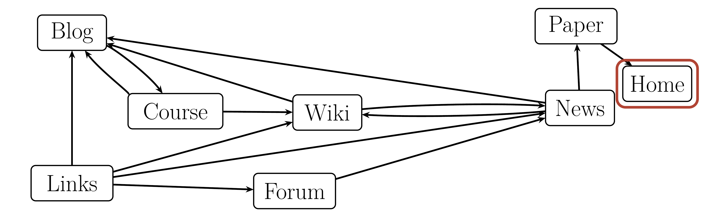
<figcaption>one page, no way out</figcaption>

---

## Teleportation

With probability $\beta$ the walker ignores the links and jumps to a random page. PageRank is **where the walker spends its time** in the long run.

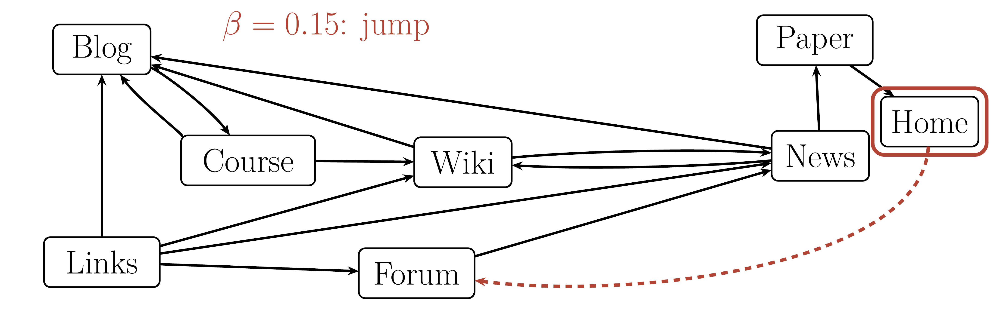
<figcaption>the only way out of a dead end — without it, every drop of score drains away</figcaption>

---

<!-- _class: mid -->

## How would you build "more like this"?

A student is reading the course page.

What should the sidebar show — and how would you compute it?

<!--
Fish for "things near it". Then ask what "near" means in a directed network, and let them arrive at biasing the walk.
-->

---

## Bias the teleport

$$c_i = \sum_k \beta(1-\beta)^k p_i^{(k)}$$

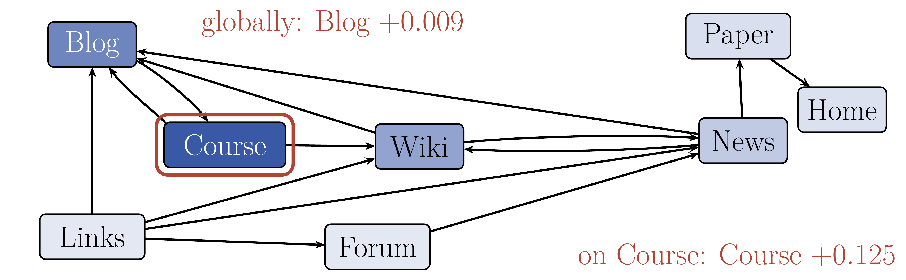

<!--
Send every jump back to one page and the ranking bends toward it. Globally Blog leads Course by 0.009; personalized on Course, Course leads by 0.125.
The formula is the same score read a second way: the chance of reaching i in k steps, discounted by distance from the focus. Personalized PageRank is discounted reachability.
-->

---

<!-- _class: part -->

Part Eight08 / 08

## Which one should you use?

Everything above, and the cost of choosing wrong

---

## Six measures, one map

Rome took every crown outright but one, and shares that one with two three-road cities.

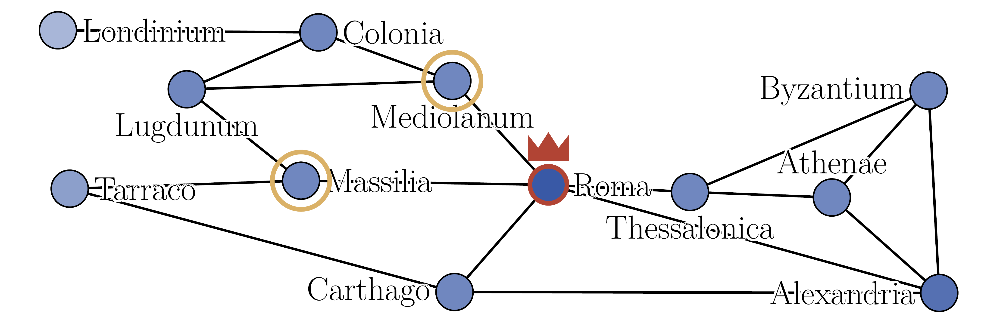
<figcaption>red: six crowns held alone. gold: the two that tie it on eccentricity</figcaption>

<!--
Do not present this as a disappointment. It is a finding, and the next four slides are what it means.
-->

---

<!-- _class: mid -->

## So which one do you use?

You will have to pick one on Thursday.

On what grounds?

<!--
"It depends" is correct and useless. Push for what it depends ON.
-->

---

## Match the measure to the job

The measure is not a property of the network. It is a property of **your question**.

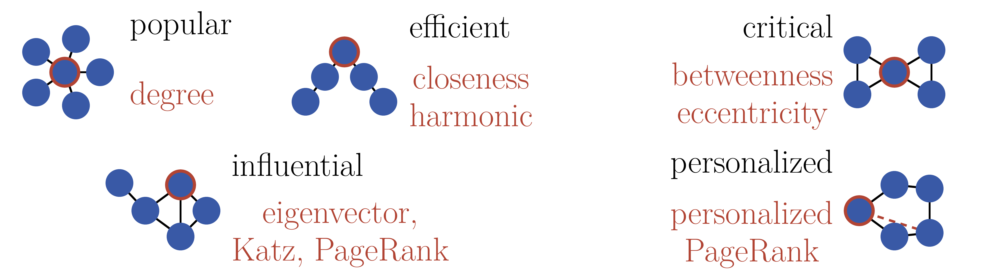
<figcaption>five jobs, five answers</figcaption>

---

<!-- _class: mid -->

## How much of that was the map we drew?

We chose eighteen routes out of the documented ones. Suppose we had chosen differently — which answers would change?

<figcaption>one map out of many we could have drawn</figcaption>

<!--
This is the question the module was really about. Take predictions on which measure is most fragile before showing the numbers.
-->

---

## Some answers survive redrawing. Some do not.

Counting roads gives the same answer on **every** map anyone could have drawn. Who is *influential* does not.

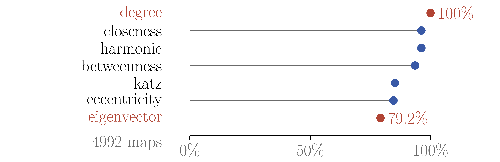
<figcaption>share of 4992 drawable maps in which Rome keeps that crown</figcaption>

---

## The map we drew

Betweenness crowns Rome — 0.50 against Mediolanum's 0.27.

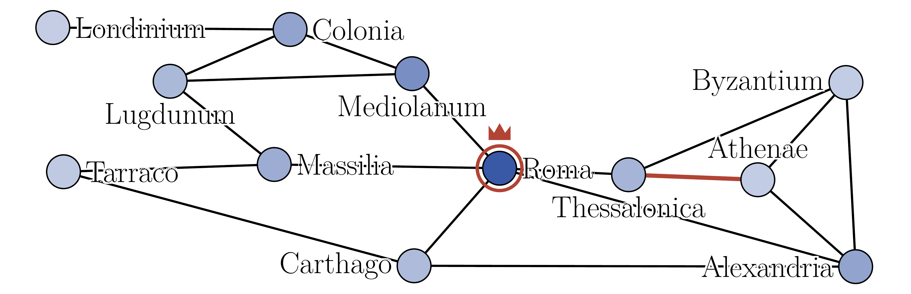
<figcaption>darker means higher betweenness; the road to be traded is red</figcaption>

---

## One redraw, one moved crown

Trade the Thessaly road for the Balkan road and the Africa–Gaul lane. Every route is as documented as before.

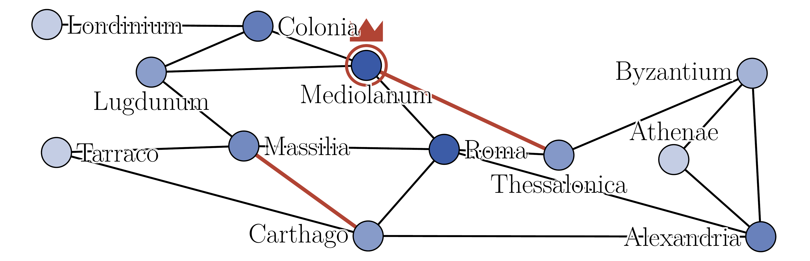
<figcaption>betweenness now crowns Mediolanum; nothing else moves</figcaption>

---

<!-- _class: mid -->

## A million nodes. Which of these can you run?

Ten million edges, and an afternoon.

Which measures are still available to you?

<!--
Push them to think about what each definition needs to look at.
-->

---

## Cost is part of the choice

Degree reads the edges once. Closeness and betweenness need a shortest-path sweep from **every** node.

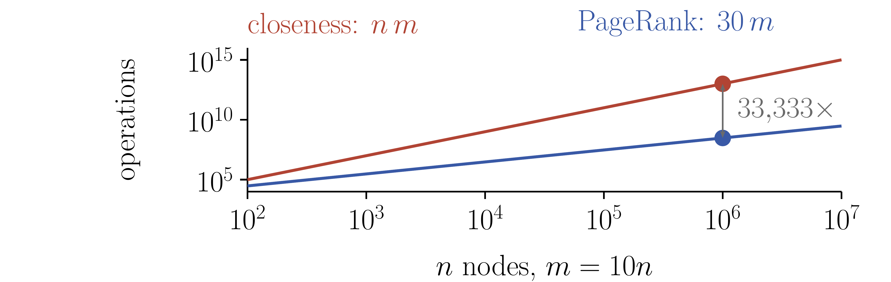
<figcaption>work against network size, log axes — 33,000x apart at a million nodes</figcaption>

---

<!-- _class: mid -->

## Predict: the star and the path

In a star, do these measures agree with each other?

In a path?

Answer both before the next slide.

<!--
Star: everyone says yes, and they are right. Path: the interesting one.
-->

---

## Total agreement

In a star **every** measure crowns the hub, because there is only one shape of node to argue about.

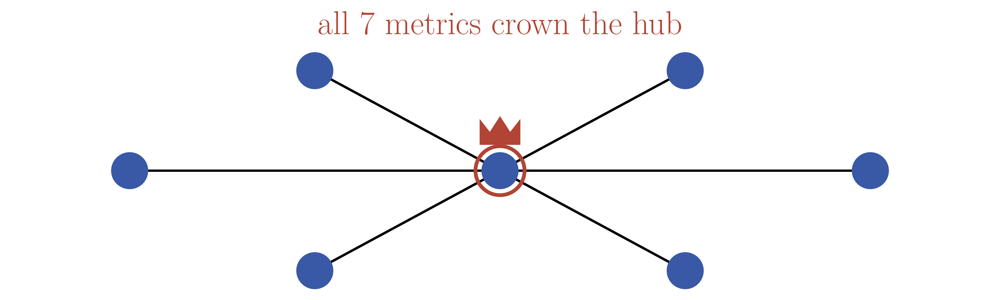
<figcaption>one node wins everything</figcaption>

---

## Then total disagreement

In a path, degree cannot separate the five interior nodes at all. Betweenness ranks them completely and crowns exactly one.

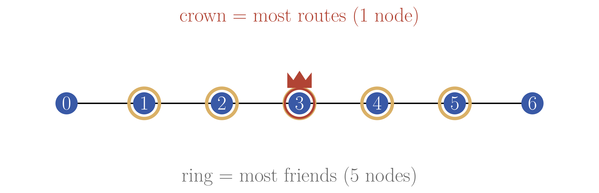
<figcaption>five tie on degree; one wins on betweenness</figcaption>

---

## Three places this pays rent

Module 04's friendship paradox, used deliberately: ask a random person to name a friend, and vaccinate **them**.

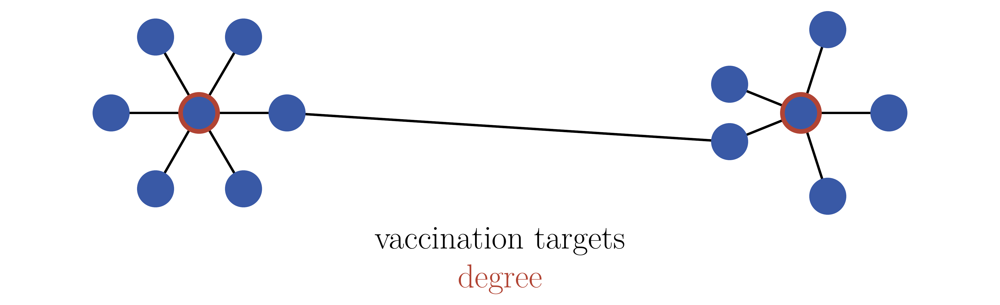
<figcaption>the named friends, marked — no census of the network required</figcaption>

---

## Defending infrastructure

The defender reads the attacker's ranking. **Betweenness** names the substations whose loss splits the grid, not the ones with the most cables.

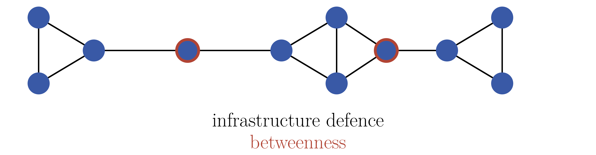
<figcaption>the nodes worth hardening first</figcaption>

---

## Systemic risk

Regulators score institutions on their **position**, not their balance sheet. A bank that is not large can still be the one every exposure runs through.

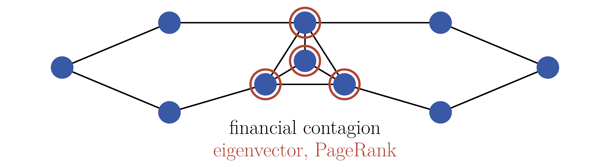
<figcaption>small bank, unavoidable position</figcaption>

---

## Coming up in Module 07

That walker was not a metaphor. **PageRank is a random walk** — and next time the walker is the subject rather than the tool.

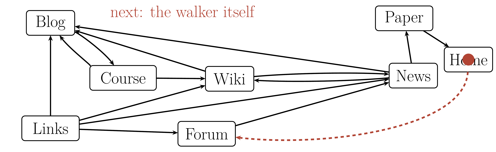
<figcaption>the walker, mid-jump</figcaption>

<!--
Hand off explicitly: everything in Parts Five to Seven was one equation. Module 07 shows it is also one walk.
-->
