<!-- _class: lead -->

Graduate Lecture · Fall 2026

# Network Science

---

Structure, dynamics, and the mathematics of connected systems

Instructor name · Course code

<!--
Welcome. One long lecture, six parts: graphs as a language, random models, small worlds, scale-free structure, position and groups, then dynamics on top of structure.
-->

---

## Roadmap for the lecture

---

**01 Graphs as a language**

Degree, paths, components, clustering

**02 Random networks**

The null model and its failures

**03 Small worlds**

Short paths with high clustering

**04 Scale-free networks**

Power laws, hubs, preferential attachment

**05 Position and groups**

Centrality, PageRank, communities

**06 Robustness and spreading**

Percolation, epidemics, immunization

<!--
Six parts. The first three are the classical models; the last three are what you do with a network once you have one.
-->

---

<!-- _class: part -->

Part One01 / 06

## Graphs as a language

The handful of definitions every later result is built out of

<!--
Part one is vocabulary, but the vocabulary does real work: each quantity we define is a hypothesis about what matters in a system.
-->

---

## What counts as a network

---

| System | Node | Link | Directed |
| --- | --- | --- | --- |
| Internet | Router | Physical cable | No |
| World Wide Web | Page | Hyperlink | Yes |
| Cell | Protein | Binding interaction | No |
| Science | Paper | Citation | Yes |
| Power grid | Station | Transmission line | No |

The same system admits several encodings. Choosing one is a modeling decision, and it is usually the decision that determines the answer.

<!--
The move is always the same: decide what a node is, decide what a link means. Most of the difficulty in applied work is right here, not in the math.
-->

---

## Nodes, links, and the adjacency matrix

---

A graph is a node set and a link set. Store it as a matrix and all of linear algebra becomes available to you.

$$ A_{ij} = \begin{cases} 1 & \text{if } i \sim j \\ 0 & \text{otherwise} \end{cases} $$

Undirected graphs give a symmetric matrix with a zero diagonal. Powers of the matrix count walks: $(A^n)_{ij}$ is the number of walks of length $n$ from $i$ to $j$.

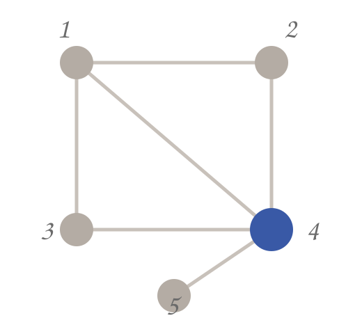
<figcaption>a five-node graph and its matrix</figcaption>

---

## Degree, average degree, density

---

$$ k_i = \sum_{j} A_{ij} \qquad \langle k \rangle = \frac{2L}{N} \qquad d = \frac{2L}{N(N-1)} $$

The factor of two is the whole trick: every link contributes to two degrees, so the degree sum double-counts the links.

Real networks sit at the very bottom of the density range. The web has billions of pages and an average degree in the tens.

<!--
Average degree is the first number you compute. Density says how far from complete the graph is; real networks are overwhelmingly sparse, which is why we can compute on them at all.
-->

---

## Directed and weighted networks

---

### Directed

The matrix is no longer symmetric. Every node carries two degrees, and the two averages coincide.

$$ \langle k^{in} \rangle = \langle k^{out} \rangle = \frac{L}{N} $$

Reachability splits into in- and out-components, which is why the web has a bow-tie shape rather than one blob.

### Weighted

Entries become strengths: call volume, traffic, synaptic efficacy.

$$ s_i = \sum_{j} w_{ij} $$

Weights are broadly distributed too, so thresholding a weighted network into a binary one throws away most of the signal.

---

## Paths, distance, and diameter

---

The distance $d_{ij}$ is the number of links on a shortest path. Average over all pairs and you get the characteristic path length.

$$ \langle d \rangle = \frac{1}{N(N-1)} \sum_{i \neq j} d_{ij} $$

The diameter $d_{max}$ is the largest of these distances. Both come out of one breadth-first search per node.

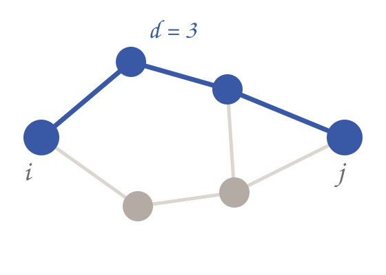
<figcaption>d = 3 between i and j</figcaption>

<!--
Distance is measured in hops. Diameter is the worst case; average path length is the number people quote. Breadth-first search gives you both.
-->

---

## Connected components

---

A component is a maximal set of mutually reachable nodes. Real networks almost always show one giant component plus a scatter of small isolates.

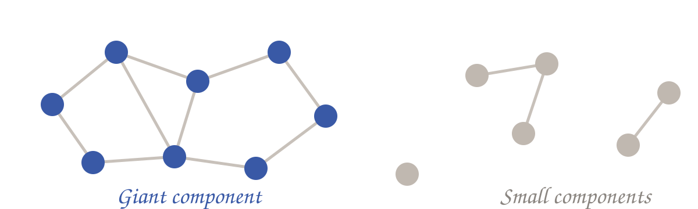
<figcaption>one giant component, several small ones</figcaption>

<!--
Most real networks have one giant component holding the large majority of nodes, plus a scatter of small ones. That is not an accident, and part two explains why.
-->

---

## Clustering coefficient

---

Of the links that could exist among node $i$'s neighbours, what fraction do exist?

$$ C_i = \frac{2 L_i}{k_i (k_i - 1)} $$

Here $L_i$ counts links among the $k_i$ neighbours. Averaging over nodes gives $\langle C \rangle$, which in social networks lands between 0.1 and 0.6 and stays roughly independent of size.

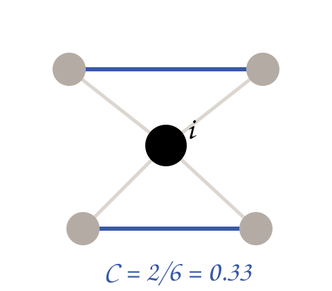
<figcaption>C = 2/6 = 0.33</figcaption>

---

<!-- _class: part -->

Part Two02 / 06

## Random networks

The null model, and the specific ways it fails

<!--
The random graph is wrong about almost every real network, which is exactly what makes it useful: deviations from it are the findings.
-->

---

## The Erdős–Rényi model

---

Take $N$ labelled nodes and connect each of the $\binom{N}{2}$ possible pairs independently with probability $p$. Nothing else is specified, so anything the model produces is a consequence of randomness alone.

expected links

$$ \langle L \rangle = p \binom{N}{2} $$

expected degree

$$ \langle k \rangle = p (N-1) $$

To hold $\langle k \rangle$ fixed as the network grows, $p$ must shrink like $1/N$. Sparseness is built into the limit we care about.

---

## From binomial to Poisson

---

<table class="steps">
<tr><td>Exact</td><td>

$$ p_k = \binom{N-1}{k} p^k (1-p)^{N-1-k} $$

</td></tr>
<tr><td>Sparse limit</td><td>

$$ p_k = e^{-\langle k \rangle} \frac{\langle k \rangle^k}{k!} $$

</td></tr>
<tr><td>Spread</td><td>

$$ \sigma_k = \langle k \rangle^{1/2} $$

</td></tr>
</table>

The relative width falls off as $\langle k \rangle^{-1/2}$, so large random networks are strikingly uniform: nodes many times the average degree are effectively impossible.

<!--
The exact answer is binomial; in the sparse large-N limit it collapses to a Poisson with a single parameter. The key consequence is the narrow peak.
-->

---

## The giant component

---

Let $S$ be the fraction of nodes in the largest component. Self-consistency gives an implicit equation with a transition at one link per node.

$$ S = 1 - e^{-\langle k \rangle S} $$

Below $\langle k \rangle = 1$ the only solution is $S = 0$. Above it a positive branch appears, and by $\langle k \rangle = \ln N$ essentially every node is absorbed.

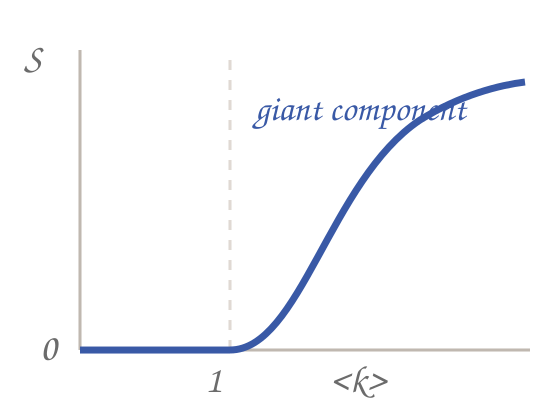
<figcaption>a phase transition at &lt;k&gt; = 1</figcaption>

---

## Where the random model breaks down

---

| Property | Random graph | Real networks | Verdict |
| --- | --- | --- | --- |
| Path length | Logarithmic in $N$ | Logarithmic or shorter | Close |
| Degree spread | Poisson, narrow | Heavy-tailed, hubs | Wrong |
| Clustering | $C = \langle k \rangle / N \to 0$ | Large, size-independent | Wrong |
| Growth | Fixed $N$ | Nodes arrive over time | Missing |

Two of these failures set the agenda: clustering leads to small-world models, degree spread leads to scale-free ones.

---

<!-- _class: part -->

Part Three03 / 06

## Small worlds

How a network can be both locally dense and globally shallow

---

## Six degrees of separation

---

5.2

median chain length in Milgram's completed letter experiment, 1967

4.7

average distance among 721 million Facebook users, 2011

19

estimated diameter of the reachable web, measured on directed links

The striking part is not the size of the number but its stability. Multiply the population by a thousand and the distance grows by roughly one hop.

---

## Why random graphs are small

---

Walk outward from any node. At distance $d$ you have reached roughly $\langle k \rangle^d$ nodes, so the whole network is covered once that product reaches $N$.

reach at distance d

$$ N(d) \approx 1 + \langle k \rangle + \cdots + \langle k \rangle^d $$

set equal to N

$$ \langle d \rangle \approx \frac{\ln N}{\ln \langle k \rangle} $$

A logarithm is a very slow function. With $\langle k \rangle = 100$, going from a thousand nodes to a billion moves the average distance from about 1.5 to about 4.5.

---

## The Watts–Strogatz model

---

Begin with a ring lattice, which has high clustering and long paths. Rewire each link with probability $p$ and interpolate toward a random graph.

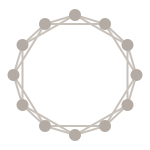
<figcaption>p = 0 · high C, long paths</figcaption>

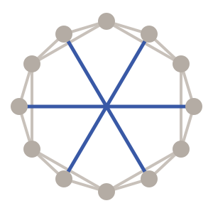
<figcaption>small p · high C, short paths</figcaption>

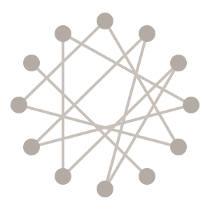
<figcaption>p = 1 · low C, short paths</figcaption>

<!--
Start from a ring lattice, rewire a small fraction of links at random. A handful of shortcuts destroys the long paths while leaving local structure intact.
-->

---

## Clustering and path length together

---

Path length falls off at a much smaller rewiring probability than clustering does. Between the two curves lies a wide band where the network is simultaneously clustered and shallow.

The model does not, however, produce hubs. Its degree distribution stays narrow, which is what part four takes up.

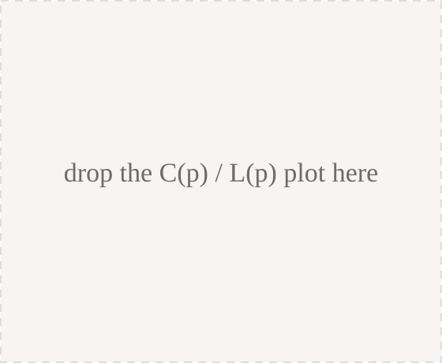
<figcaption>C(p) and L(p)</figcaption>

---

<!-- _class: part -->

Part Four04 / 06

## Scale-free networks

Why hubs appear, and why the average degree stops being a useful summary

---

## Power-law degree distributions

---

$$ p_k \sim k^{-\gamma} $$

Most measured networks land in the range $2 < \gamma < 3$. The tail decays slowly enough that a node with a thousand times the average degree is unremarkable.

In the Poisson case the factorial in the denominator makes such a node impossible.

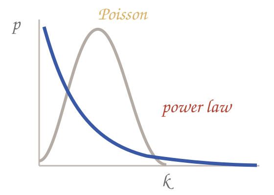
<figcaption>power law vs Poisson</figcaption>

---

## Reading a log-log plot

---

$$ \ln p_k = -\gamma \ln k + c $$

A straight line on log axes, with slope $-\gamma$. That is the entire diagnostic.

Two cautions: use logarithmic binning or the cumulative distribution, and fit by maximum likelihood rather than by eye.

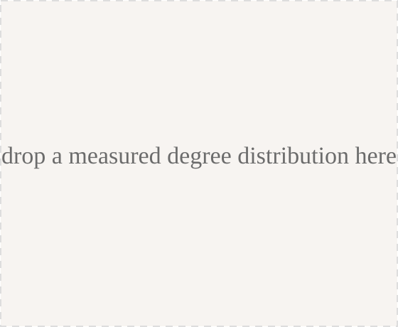
<figcaption>a measured degree distribution</figcaption>

---

## Divergent moments

---

$$ \langle k^n \rangle = \int_{k_{min}}^{\infty} k^{n} k^{-\gamma} \, dk = \frac{k_{max}^{n-\gamma+1} - k_{min}^{n-\gamma+1}}{n - \gamma + 1} $$

The integral converges only when $n < \gamma - 1$. For $2 < \gamma < 3$ the mean is finite but the second moment grows without bound as the network grows.

A distribution with no finite variance has no characteristic scale, which is where the name comes from. Reporting an average degree is then close to meaningless.

Keep this result in your pocket. It is the reason scale-free networks resist random damage and the reason epidemic thresholds vanish on them.

---

## Growth and preferential attachment

---

### Growth

At every step one node arrives with $m$ links. The network has a history, and early nodes have more time to accumulate links.

### Preferential attachment

The new node picks targets in proportion to their current degree.

$$ \Pi(k_i) = \frac{k_i}{\sum_j k_j} $$

Neither ingredient works alone. Growth with uniform attachment produces an exponential tail; preferential attachment on a fixed node set eventually funnels every link into a single hub.

---

## Deriving the exponent

---

<table class="steps">
<tr><td>Rate equation</td><td>

$$ \frac{dk_i}{dt} = m \frac{k_i}{\sum_j k_j} = \frac{k_i}{2t} $$

</td></tr>
<tr><td>Integrate</td><td>

$$ k_i(t) = m \left( \frac{t}{t_i} \right)^{1/2} $$

</td></tr>
<tr><td>Invert</td><td>

$$ p_k \sim k^{-3} $$

</td></tr>
</table>

<!--
Continuum derivation. Degrees grow as the square root of time, and the exponent comes out at three independently of m. Real networks show a range of exponents, so treat this as a mechanism rather than a fit.
-->

---

## The ultra-small world

---

Hubs are shortcuts. Routing through them makes distances shorter than the random-graph logarithm, with the scaling depending on the exponent.

| | | |
| --- | --- | --- |
| $\gamma = 2$ | $\langle d \rangle \sim \text{const}$ | a single hub touches nearly everything |
| $2 < \gamma < 3$ | $\langle d \rangle \sim \ln \ln N$ | ultra-small: the regime most real networks occupy |
| $\gamma = 3$ | $\langle d \rangle \sim \ln N / \ln \ln N$ | the Barabási–Albert borderline |
| $\gamma > 3$ | $\langle d \rangle \sim \ln N$ | hubs too rare to matter; back to small-world scaling |

---

<!-- _class: part -->

Part Five05 / 06

## Position and groups

Centrality, ranking, and the intermediate scale between node and network

---

## Four centrality measures

---

| Measure | Definition | Answers |
| --- | --- | --- |
| Degree | $k_i$ | how many direct contacts |
| Closeness | $\left( \sum_j d_{ij} \right)^{-1}$ | how fast something reaches everyone |
| Betweenness | $\sum \sigma_{st}(i) / \sigma_{st}$ | how much traffic must pass through |
| Eigenvector | $\lambda x_i = \sum_j A_{ij} x_j$ | how well connected the contacts are |

These rankings routinely disagree, and the disagreement is informative: a low-degree node with high betweenness is a broker.

---

## Betweenness and bridges

---

Degree is local; betweenness is not. A node with two links can still carry every path between two dense regions.

Removing the bridge here leaves every node's degree nearly unchanged and disconnects the network. This is the gap between local and structural importance.

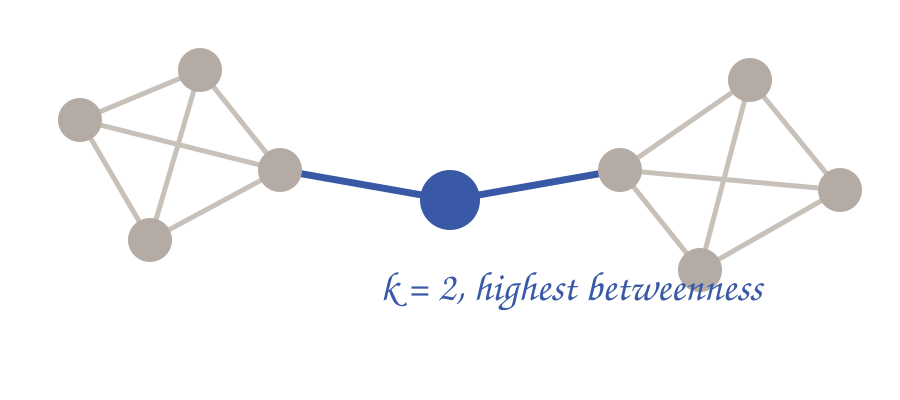
<figcaption>k = 2, highest betweenness</figcaption>

---

## PageRank

---

$$ x_i = \frac{1-d}{N} + d \sum_{j \to i} \frac{x_j}{k_j^{out}} $$

Read it as a random walker who follows links with probability $d$ and teleports to a uniformly chosen node otherwise. The scores are that walker's stationary distribution.

Teleportation is not cosmetic. Without it, walkers pile up in dangling nodes and sink components, and the iteration has no unique fixed point.

Power iteration converges in tens of steps on real graphs, which is what made the measure practical at web scale.

---

## Communities and modularity

---

A community is a set of nodes with more internal links than a degree-preserving random rewiring would give.

$$ Q = \frac{1}{2L} \sum_{ij} \left( A_{ij} - \frac{k_i k_j}{2L} \right) \delta(c_i, c_j) $$

Maximizing $Q$ is NP-hard, so we use greedy agglomeration such as Louvain.

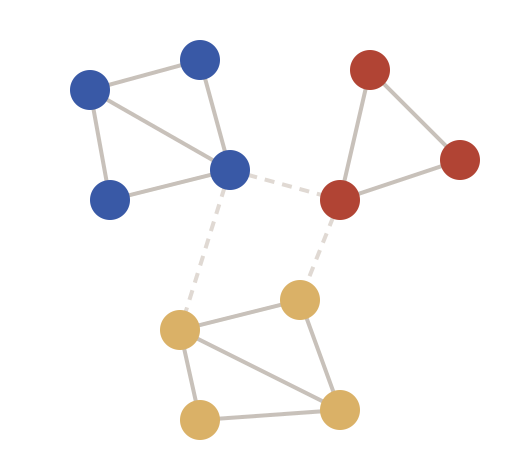
<figcaption>three communities, sparse links between</figcaption>

<!--
Modularity compares observed internal density against a degree-preserving null model. Mention the resolution limit: modularity maximization cannot see communities below a size set by the number of links, and reports a positive Q even on random graphs.
-->

---

<!-- _class: part -->

Part Six06 / 06

## Robustness and spreading

What happens when nodes fail, and when something travels along the links

---

## Random failure versus targeted attack

---

### Random failure

A uniformly chosen node is almost certainly a low-degree node, so removing it costs the network very little. In the $\gamma < 3$ limit the critical fraction approaches one.

### Targeted attack

Remove nodes in order of degree and the same network fragments after a few percent. The property that makes it robust is exactly what makes it fragile.

This asymmetry is a design fact, not a curiosity. It explains why the internet tolerates constant router failure and why a small number of deliberate outages can be catastrophic.

---

## The Molloy–Reed criterion

---

giant component exists while

$$ \kappa = \frac{\langle k^2 \rangle}{\langle k \rangle} > 2 $$

critical removed fraction

$$ f_c = 1 - \frac{1}{\kappa - 1} $$

For a Poisson network $\kappa = \langle k \rangle + 1$, which recovers the familiar threshold. For a scale-free network with $\gamma < 3$ the second moment diverges, $\kappa$ grows with $N$, and $f_c$ tends to one: the network has no percolation threshold in the usual sense.

The same divergence drives the epidemic result on the next two slides. One property, two consequences.

---

## Epidemics on networks

---

**SI**

no recovery; everyone is eventually infected

**SIS**

recovery to susceptible; an endemic state is possible

**SIR**

permanent immunity; the outbreak burns out

spreading rate and threshold

$$ \lambda = \frac{\beta}{\mu}, \qquad \lambda_c = \frac{\langle k \rangle}{\langle k^2 \rangle} $$

Classical epidemiology assumes uniform mixing. Putting the process on a contact network replaces that assumption with measured structure, and the threshold picks up the second moment.

---

## The vanishing epidemic threshold

---

$$ \lambda_c = \frac{\langle k \rangle}{\langle k^2 \rangle} \; \longrightarrow \; 0 \qquad \text{as } \langle k^2 \rangle \to \infty $$

In a network whose second moment diverges there is no threshold to fall below. A pathogen with any positive transmissibility can establish itself, which is why hub-targeted intervention matters more than lowering transmission uniformly.

---

## Immunization and the friendship paradox

---

Uniform vaccination fails for the same reason random failure is harmless: it mostly reaches low-degree nodes. Targeting hubs works, but degree data is rarely available.

degree of a randomly chosen neighbour

$$ \langle k_{nn} \rangle = \frac{\langle k^2 \rangle}{\langle k \rangle} \; \geq \; \langle k \rangle $$

Following a link lands you on a high-degree node more often than picking uniformly. So the acquaintance strategy needs no global information: sample a random person, ask for a contact, immunize the contact.

---

## What to carry forward

---

01

Networks from unrelated domains share quantitative structure, and the structure is reproducible enough to model.

02

The random graph is the reference point. Its two clearest failures, clustering and heavy tails, generated the two model families we use.

03

A divergent second moment is the single most consequential fact in the field: it kills the percolation threshold and the epidemic threshold at once.

04

Dynamics inherit structure. Before modelling a process on a network, measure the network.

---

## Readings

---

<table class="steps">
<tr><td>Textbook</td><td>Barabási, <em>Network Science</em>, Cambridge, 2016 — chapters 2 through 10</td></tr>
<tr><td>Reference</td><td>Newman, <em>Networks</em>, 2nd edition, Oxford, 2018</td></tr>
<tr><td>Small worlds</td><td>Watts &amp; Strogatz, <em>Nature</em> 393, 1998</td></tr>
<tr><td>Scale-free</td><td>Barabási &amp; Albert, <em>Science</em> 286, 1999</td></tr>
<tr><td>Robustness</td><td>Albert, Jeong &amp; Barabási, <em>Nature</em> 406, 2000</td></tr>
<tr><td>Fitting</td><td>Clauset, Shalizi &amp; Newman, <em>SIAM Review</em> 51, 2009</td></tr>
</table>
