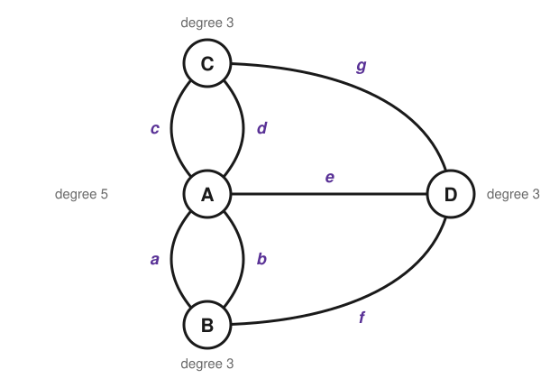
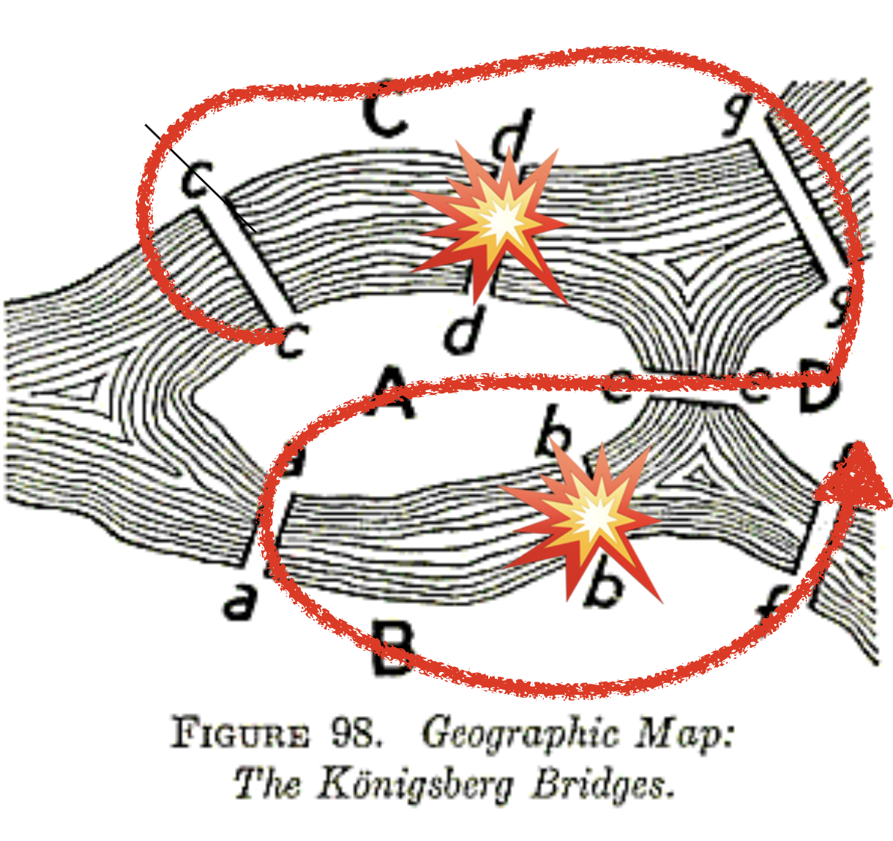

> **The big question of this module.** Can you walk a city crossing each bridge exactly once — and how would you ever *prove* that you cannot?

## Königsberg, 1736: seven bridges and a Sunday walk

Our story begins not in a lab, but on the streets of an 18th-century Prussian city called Königsberg. It was a city of thinkers—most famously the philosopher Immanuel Kant—but the puzzle that would change mathematics belonged to everyone.

The city was built around two islands in the Pregel River, connected to the mainland and each other by seven distinct bridges. During their Sunday strolls, the citizens amused themselves with a challenge:

> Is it possible to design a walk through the city that crosses each of the seven bridges **exactly once** and returns to the starting point?

Try it yourself on the city below. Click a landmass to put your pencil down,
then click bridges to cross them — the tracer will not let you cross the same
bridge twice. You will hit exactly the wall the citizens hit: you get stranded
somewhere with a bridge still unused. Then keep going through the last two
steps, which stop reporting *that* you failed and start showing you *why* you
always would.

```{=html}
<style>
/* --------------------------------------------------------------------------
   Königsberg tracer — only the rules this one stage needs. The paper, the
   panels, the buttons, the tallies and the motion all come from
   assets/anim.css; the sequencer from assets/anim.js. Colours are the kit's
   resolved tokens (var(--_ink), var(--_accent), var(--_amber)) — never
   literals. Everything is scoped to #kb-tracer, because two stages may share
   a page. Keyframe names cannot be scoped, so they carry a kb- prefix.
   -------------------------------------------------------------------------- */

/* The map is the argument, so it takes the wider half of the stage — and that
   has to be repeated under the kit's 820px breakpoint, because an id selector
   outranks the kit's class selector whatever the media query says. The drawing
   cap is a variable, so the kit's own narrow rule can still take it to 100%. */
#kb-tracer .anim-grid-2 { grid-template-columns: minmax(0, 1.45fr) minmax(0, 1fr); }
#kb-tracer { --anim-svg-max: 470px; }
@media (max-width: 820px) {
  #kb-tracer .anim-grid-2 { grid-template-columns: minmax(0, 1fr); }
}

#kb-tracer .kb-water { fill: var(--_accent-soft); }
/* The banks are white and so is the paper, so without an edge the map has no
   extent. Drawn over everything, deaf to the pointer. */
#kb-tracer .kb-frame { fill: none; stroke: var(--_ink); stroke-width: 2.4; pointer-events: none; }
#kb-tracer .kb-land { fill: var(--_white); stroke: var(--_ink); stroke-width: 2; }

/* A bridge is ink until it is one you may take (accent, breathing), and amber
   once it is behind you. */
#kb-tracer .kb-bridge { stroke: var(--_ink); stroke-width: 7; fill: none; }
#kb-tracer .kb-open { stroke: var(--_accent); animation: kb-pulse 1.2s ease-in-out infinite; }
#kb-tracer .kb-used { stroke: var(--_amber); }
@keyframes kb-pulse { 50% { stroke-width: 10.5; } }

/* Refused: one flinch from the bridge you cannot have. */
#kb-tracer .kb-nope { animation: kb-nope 0.42s ease; }
@keyframes kb-nope {
  0%, 100% { stroke-width: 7; opacity: 1; }
  30% { stroke-width: 12; opacity: 0.3; }
}

/* Invisible, generous targets laid over the drawing: landmasses first, then
   bridges, so a bridge always wins where the two overlap. */
#kb-tracer .kb-hit { fill: transparent; stroke: transparent; stroke-width: 20; pointer-events: all; }
#kb-tracer .kb-live .kb-hit { cursor: pointer; }

#kb-tracer .kb-letter { font-family: var(--_hand); font-size: 11px; font-style: italic; fill: var(--_accent); }
#kb-tracer .kb-name { font-family: var(--_hand); font-size: 15px; font-weight: 700; fill: var(--_ink); }

/* Beat two: every bridge-end as a spoke, the pairs that pass through, and the
   one spoke at each landmass that has nothing to pair with. */
#kb-tracer .kb-spoke { stroke: var(--_ink-faint); stroke-width: 1.6; stroke-dasharray: 3 3; fill: none; }
#kb-tracer .kb-hub { fill: var(--_white); stroke: var(--_ink); stroke-width: 1.6; }
#kb-tracer .kb-pair { stroke: var(--_accent); stroke-width: 3.4; fill: none; stroke-linecap: round; }
#kb-tracer .kb-left { stroke: var(--_amber); stroke-width: 3.6; fill: none; stroke-linecap: round; }
#kb-tracer .kb-left-dot { fill: var(--_amber); stroke: var(--_ink); stroke-width: 1.2; }

/* Where you are standing. */
#kb-tracer .kb-here { fill: var(--_amber); stroke: var(--_ink); stroke-width: 1.8; }
/* And where you put the pencil down, which the route otherwise forgets. */
#kb-tracer .kb-start { fill: none; stroke: var(--_amber); stroke-width: 2.4; }

/* The tracer's reply to your last click. Three lines are always reserved, so
   a refusal never shoves the reset button out from under the pointer. */
#kb-tracer .kb-msg {
  font-family: var(--_hand);
  font-size: 0.84rem;
  line-height: 1.35;
  color: var(--_ink);
  min-height: calc(3 * 1.35em);
  margin-top: 0.3rem;
}
#kb-tracer .kb-msg-no { color: var(--_amber); }
</style>

<figure class="anim-stage" id="kb-tracer">
  <div class="anim-bar">
    <div class="anim-step" data-anim-step></div>
    <div class="anim-dots" data-anim-dots></div>
    <button class="anim-btn" type="button" data-anim-prev aria-label="Previous step">◀</button>
    <button class="anim-btn" type="button" data-anim-play>⏸ Pause</button>
    <button class="anim-btn" type="button" data-anim-next aria-label="Next step">▶</button>
    <button class="anim-btn" type="button" data-anim-replay>↻ Replay</button>
  </div>

  <div class="anim-grid-2" data-anim-canvas>
    <div data-anim-clear data-kb-map></div>
    <div data-anim-clear data-kb-side></div>
  </div>

  <figcaption class="anim-note" data-anim-note></figcaption>
</figure>

<script src="/assets/anim/kb-tracer.js" defer></script>
```

What you have just watched is the reason, drawn rather than argued. Nobody in
Königsberg had it. They had only the first half — no one could find a route,
and, far worse, no one could *prove* that none existed. The problem eventually
reached the mathematician Leonhard Euler, whose goal was not to have the answer
but to have the reason in a form that works for any city, with any number of
islands and any number of bridges.

**Before you read Euler's solution, be a mathematician for ten minutes.** This is how discovery happens, and we **strongly recommend** working through this [pen-and-paper worksheet](http://estebanmoro.org/pdf/netsci_for_kids/the_konisberg_bridges.pdf) before going on. As you work, ask yourself:

- What information is essential? The length of a bridge? The size of an island?
- What are the fundamental constraints of the problem?
- How can you move from "I can't find a route" to "a route cannot exist"?

## Euler throws away the map

Euler's genius was to realize that most of the information on the map was a distraction. He performed a radical act of simplification, an approach we now call **abstraction**.

He stripped the problem down to its skeleton:

1.  He turned each of the four landmasses into a simple **dot** (a **node**).
2.  He turned each of the seven bridges into a simple **line** connecting the dots (an **edge**).

<!-- TODO(anim): the map dissolves into the graph — the landmasses shrink to dots, the bridges straighten into lines, and the river fades away. -->

{#fig-euler-graph fig-alt="Four labelled nodes A, B, C, D joined by seven labelled edges, with the degree of each node written beside it." fig-align="center" width=80%}

This wasn't just a sketch; it was a new mathematical object. Euler had invented the **graph** (or **network**). He had created a language for talking not about numbers or shapes, but about pure **relationships and connectivity**.

## What a graph is, formally

::: {.callout-important title="Key concept: a graph, written down"}
Formally, a graph is a pair

$$
G = (V, E)
$$

where $V$ is the set of **nodes** (also called vertices) and $E$ is the set of **edges**, each edge being a pair of nodes. For Königsberg, $V$ has four elements — the two banks and the two islands — and $E$ has seven.

Everything else in this course is built on those two sets. Notice what the definition does *not* contain: no coordinates, no distances, no shapes.
:::

Two features of Königsberg are worth naming now, because the definition above quietly permits both.

**Parallel edges.** Königsberg has *two* pairs of bridges that connect the same two landmasses: *a* and *b* both run from the island A to the south bank B, and *c* and *d* both run from A to the north bank C. Each copy counts separately, so $E$ contains the pair $(A,B)$ twice and the pair $(A,C)$ twice. A graph that allows repeated edges like this is a **multigraph**. Collapse each pair into a single edge and you are solving a different puzzle with a different answer — which is precisely why the multiplicity matters.

**Self-loops.** An edge may also join a node to itself; such an edge is a **self-loop**. Königsberg has none, but they appear all the time in real data (a paper citing itself, a bank lending to itself). A self-loop contributes **2** to the count of edges at its node, since both of its endpoints attach there. That convention is what keeps the even/odd argument in the next section working: a self-loop is one arrival and one departure, so it never flips a node between odd and even.

::: {.column-margin}
**Leonhard Euler (1707-1783)** — one of history's most prolific mathematicians. Despite losing his sight, he produced nearly half of his life's work while completely blind.
:::

## From a walk to a proof: the idea of degree

With this simplified representation, Euler could stop thinking about walking and start thinking about rules. He focused on the nodes and asked a crucial question: how does a journey *through* a node work?

Imagine you are on a walk. Every time you arrive at a landmass, you cross one bridge. Every time you leave, you cross another. This means that for any landmass that is **not** the start or the end of your journey, you must use bridges in pairs: one "in" and one "out."

This leads to the key insight. Let's count the number of bridges attached to each landmass. We'll call this the **degree** of the node.

::: {.callout-important title="Key concept: node degree"}
The **degree** of a node is the number of edges attached to it. It is the most fundamental property of a node in a network.
:::

-   If a node has an **even degree** (2, 4, 6, …), you can always pass through it. For every "in" bridge, there is an "out" bridge.
-   If a node has an **odd degree** (1, 3, 5, …), it must be special. The "in" and "out" bridges cannot all be paired up; one bridge is left over. That leftover bridge means an odd-degree node **must be the start or the end** of your walk.

A journey has only one start and one end. Therefore, if you can cross every bridge exactly once, then **at most two nodes have an odd degree**.

### The verdict: all four landmasses are odd

Count the bridges at each node in @fig-euler-graph:

- **C, the north bank:** bridges *c*, *d*, *g* — degree 3 (odd)
- **B, the south bank:** bridges *a*, *b*, *f* — degree 3 (odd)
- **A, the Kneiphof island:** bridges *a*, *b*, *c*, *d*, *e* — degree 5 (odd)
- **D, the east island:** bridges *e*, *f*, *g* — degree 3 (odd)

All four landmasses have an odd degree. Since such a journey allows at most two odd-degree nodes — one to start at, one to end at — the walk the citizens wanted is **mathematically impossible**. Euler did not merely fail to find a route; he proved, with logical certainty, that no such route can ever exist.

A route that crosses every edge exactly once is called an **Eulerian trail**. *Trail* is the technical word for a route that never repeats an *edge*, although it may pass through the same node more than once — which in Königsberg you are forced to do. The full vocabulary is on the [next page](01b-vocabulary.qmd).

::: {.callout-important title="Key concept: Euler's condition"}
A graph has an **Eulerian trail** — a route crossing every edge exactly once — if and only if:

1.  The graph is **connected** (you can get from any node to any other), and
2.  **one** of these holds:
    -   **No node has an odd degree.** Then the route can start and end at the same node: it is a closed loop, an **Eulerian circuit**.
    -   **Exactly two nodes have an odd degree.** Then the route must start at one of them and end at the other.
:::

The argument above proves one direction: *if* such a route exists, *then* at most two nodes are odd. That direction is all Königsberg needs, since its four odd nodes already kill the possibility. The other direction — that these conditions are also *enough*, so that whenever they hold a route can actually be built — needs a short separate argument, sketched in the [appendix](04-appendix.qmd).

### The bombs that changed the answer

The story of the seven bridges has an ironic epilogue. During World War II, Königsberg was heavily bombed, and two of the seven bridges — *b* and *d*, one from each of the island's two parallel pairs — did not survive.

{#fig-bombed-bridges fig-alt="Historical map of the Königsberg bridges with two of the seven marked as destroyed and a route drawn over the rest." fig-align="center" width=70%}

Recount the degrees with *b* and *d* gone. A keeps *a*, *c*, *e* — degree 3. B keeps *a*, *f* — degree 2. C keeps *c*, *g* — degree 2. D still has *e*, *f*, *g* — degree 3. Exactly two odd nodes remain, so a route crossing all five surviving bridges now exists, and it must start on one island and end on the other.

Note what that does *not* say. The citizens asked for a walk that **returns to where it started**, and that still requires zero odd nodes. The bombs made the trail possible; the circuit is as impossible as it ever was. Two words that sound interchangeable in English — trail and circuit — have different answers in the same city.

Euler's solution was far more than fun trivia. It was the beginning of a new field of science. The idea of abstracting a system into nodes and edges is how we now understand our modern world. Every time you rely on a connected system, you are benefiting from the intellectual leap made by Euler over a puzzle about a Sunday stroll.

## What you can now do

- Turn a physical layout into nodes and edges, and defend what you threw away.
- Count degrees and decide whether an Eulerian trail or an Eulerian circuit exists.
- Explain why "I could not find one" and "one cannot exist" are entirely different claims.

Next: [Five Words You Will Use All Semester](01b-vocabulary.qmd) — walk, trail, path, circuit, cycle — plus the two objects the rest of the course leans on hardest, the adjacency matrix and the connected component. Then write the code on the [hands-on page](02-coding.qmd), and hand in the [exercises](03-exercises.qmd).
