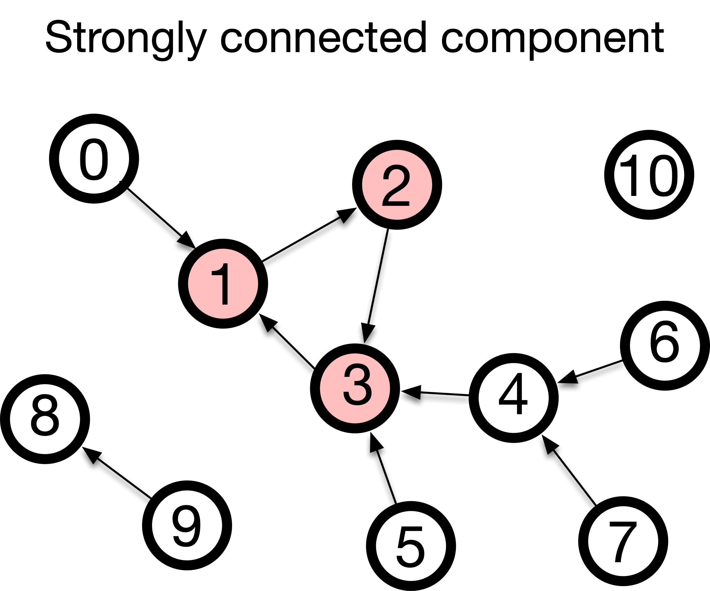

Euler's proof needed exactly one technical word: *degree*. Everything after this module needs five more — **walk**, **trail**, **path**, **circuit**, **cycle** — and two objects, the **adjacency matrix** and the **connected component**. They look like housekeeping. They are not: every later module is phrased in them, and this is the page you will come back to.

## Walk, trail, path

| Term | Definition |
| :--- | :--- |
| **Walk** | A sequence of steps along edges. Both edges and nodes may repeat. |
| **Trail** | A walk that never repeats an **edge**. Nodes may repeat. |
| **Path** | A walk that never repeats a **node** — and therefore never repeats an edge either. |

The road-trip version: a walk is a casual drive that may go down the same street twice; a trail is a mail route, which never covers the same street twice but may pass the same intersection again; a path is a tour of cities in which every city is new.

The three are nested. Every path is a trail, and every trail is a walk; the restrictions only ever get tighter.

## Circuit and cycle

A journey that ends where it began is **closed**. Closing the two stricter kinds gives two more words.

| Term | Definition |
| :--- | :--- |
| **Circuit** | A **trail** that starts and ends at the same node. |
| **Cycle** | A **path** that starts and ends at the same node — the start node being the one permitted repeat. |

With this vocabulary, Königsberg becomes precise:

- An **Eulerian trail** uses every edge of the graph exactly once. It is very often called an *Euler path*, including in the title of this module, but it is a trail rather than a path: it may return to a node, as the Kneiphof island forces you to.
- An **Eulerian circuit** is an Eulerian trail that comes back to its starting node.

The citizens of Königsberg wanted an Eulerian circuit, which requires *every* node to have even degree. Their city had four odd nodes, so they wanted the impossible — and after the war it had two odd nodes, which is enough for a trail but still not for a circuit.

## Three ways to write a network down

A graph is a mathematical object; a computer needs a data structure. There are three standard ones, and the [hands-on notebook](02-coding.qmd) builds all three. Take the Königsberg graph and number its nodes A = 0, B = 1, C = 2, D = 3.

**Edge list.** One pair per edge, and nothing else:

```
(0,1) (0,1) (0,2) (0,2) (0,3) (1,3) (2,3)
```

Seven pairs for seven bridges. The two parallel pairs are simply listed twice — an edge list handles a multigraph without any extra machinery.

**Adjacency list.** For each node, the list of its neighbours:

```
0: 1, 1, 2, 2, 3
1: 0, 0, 3
2: 0, 0, 3
3: 0, 1, 2
```

The degree of a node is now the length of its row: 5, 3, 3, 3 — the four numbers Euler's proof turned on.

**Adjacency matrix.** An $N \times N$ table ${\bf A}$ where $A_{ij}$ is the number of edges between nodes $i$ and $j$ (so $0$ or $1$ in a graph without parallel edges):

$$
{\bf A} =
\begin{pmatrix}
0 & 2 & 2 & 1\\
2 & 0 & 0 & 1\\
2 & 0 & 0 & 1\\
1 & 1 & 1 & 0
\end{pmatrix}
$$

Read the first row: node 0 (the island A) has two edges to node 1 (the south bank B), two to node 2 (the north bank C), one to node 3 (the east island D). Sum a row and you get that node's degree again: 5, 3, 3, 3.

The three are not interchangeable in cost, and choosing between them is a real decision:

- *"Is there an edge between node 47 and node 912?"* — one lookup in the matrix, a scan in the other two.
- *"Who are node 47's neighbours?"* — one row of the adjacency list, versus a scan of the entire edge list.
- The matrix stores every **non**-edge explicitly. A network of a million nodes needs $10^{12}$ entries, almost all of them zero, which is why real code stores it in a compressed form — see the [appendix](04-appendix.qmd).

## The adjacency matrix, and what its powers count

The adjacency matrix looks like nothing more than a table of small integers. Its power is that ordinary matrix multiplication, applied to it, counts journeys.

Start with a question you can answer with the map in front of you. **How many two-step walks run from the north bank C to the south bank B?** Such a walk leaves C, lands somewhere, and goes on to B. From C you can only reach A (two ways: bridges *c* and *d*) or D (one way: *g*). From A there are two bridges on to B; from D there is one. So the answer is $2 \times 2 + 1 \times 1 = 5$.

Now get the same number from the matrix without thinking about bridges at all. Take row C, $(2,0,0,1)$, and column B, $(2,0,0,1)$, multiply them entry by entry and add:

$$
2\cdot 2 + 0 \cdot 0 + 0 \cdot 0 + 1 \cdot 1 = 5 .
$$

Multiplying a row by a column and adding *is* matrix multiplication, so that number is the entry $\left({\bf A}^2\right)_{CB}$. The same argument works for any number of steps.

::: {.callout-important title="Key concept: matrix powers count walks"}
$$
\left({\bf A}^k\right)_{ij} = \text{the number of walks of length } k \text{ from } i \text{ to } j .
$$
:::

The two-line derivation is in the [appendix](04-appendix.qmd).

Note what it counts: **walks**, not trails and not paths. Nodes and edges may repeat, which is exactly why the formula is so simple. Counting paths, where repetition is forbidden, is vastly harder, and no matrix product does it.

Two consequences we will use later. First, the diagonal entry $\left({\bf A}^2\right)_{ii}$ counts out-and-back trips from node $i$: in a graph with no parallel edges that is just the degree of $i$, while in Königsberg $\left({\bf A}^2\right)_{AA} = 2^2 + 2^2 + 1^2 = 9$, because you may leave the island by bridge *a* and come back by bridge *b*. Second, a **triangle** is a set of three nodes each joined to the other two — Königsberg has one in A, B, D (bridges *a*, *f*, *e*) and another in A, C, D (bridges *c*, *g*, *e*). In a graph with no parallel edges, $\left({\bf A}^3\right)_{ii}$ is *twice* the number of triangles containing $i$, since each triangle can be walked in two directions. Module 2 turns that count into a measure of how cliquish a network is.

## When a network falls apart

Euler's condition begins with the word *connected*, and it has to: if you cannot get from one part of the network to another, no single walk can possibly cover all the edges.

-   A graph is **connected** if there is a path between every pair of nodes.
-   A **disconnected** graph breaks into separate islands of nodes, called **connected components**. More precisely, a connected component is a *maximal* set of mutually reachable nodes — maximal meaning you cannot add another node without breaking that property.

{#fig-connected-components fig-alt="A graph whose nodes are shaded in three groups, one of eight nodes, one of two, one of one." fig-align="center" width=70%}

### The giant component

Real networks are almost never neatly connected, but they are rarely evenly broken either. What you typically find is one enormous component holding most of the nodes, surrounded by a scatter of tiny fragments and isolated nodes. That dominant piece is called the **giant component**.

"Giant" is a claim about *proportion*, not head count. A component is giant when it holds a fixed share of all the nodes — say 90% — and goes on holding roughly that share as the network grows. A component of 1,000 nodes is giant in a network of 1,200 and negligible in a network of 10 million.

This matters practically, because the giant component is usually the object we analyze. Average path length is undefined across disconnected pieces; centrality computed on an isolated pair of nodes tells you nothing. In practice one extracts the giant component and works there — and asking *when a giant component exists at all*, and *what it takes to destroy it*, is the entire subject of Module 3.

### Finding components by flood fill

Reading components off a picture is easy; doing it on a million nodes needs an algorithm. The idea is simple enough to run by hand:

1. Pick any unvisited node and mark it as visited.
2. Look at its neighbours. Any that are unvisited, visit them too.
3. Repeat until nothing new can be reached. Everything you touched is one component.
4. If unvisited nodes remain, pick one and start again — that is the next component.

Whether you always extend the most recently discovered node (**depth-first search**, DFS) or sweep outward one layer at a time (**breadth-first search**, BFS) changes the order of visits but not the resulting component. BFS gives you something extra for free: because it explores layer by layer, the layer at which it first reaches a node is the *shortest path length* to that node, which is how Module 2 measures how small the world is.

Either way, each node is visited once and each edge is looked at a constant number of times. The work therefore grows in proportion to the number of nodes plus the number of edges, not to the square of the number of nodes: double the size of the network and you roughly double the work. That is why splitting a network into components stays practical at any scale you are likely to meet.

### Connectivity when edges have direction

What if edges run one way, like one-way streets? We call these **directed graphs**, and they have two flavours of connectivity:

- **Weakly connected**: the graph would be connected if you ignored the arrows. You can get from A to B, but perhaps not from B to A.
- **Strongly connected**: there is a directed path from every node to every other node. Wherever you start, you can reach anywhere else by following the arrows.

{#fig-connected-components-directed fig-alt="A directed graph with three nodes shaded to mark a strongly connected component." fig-align="center" width=70%}

## What you can now do

- Say precisely which of walk, trail, path, circuit and cycle a given route is.
- Write the same network as an edge list, an adjacency list and an adjacency matrix, and read a degree off each one.
- Read $\left({\bf A}^k\right)_{ij}$ as a count of walks rather than an opaque product.
- Split a network into connected components by hand, and say what makes one of them giant.

Now do it in code: the [hands-on notebook](02-coding.qmd) builds all three representations and a component finder, and the [exercises](03-exercises.qmd) ask you to decide, for a network you have never seen, whether an Eulerian trail exists.
