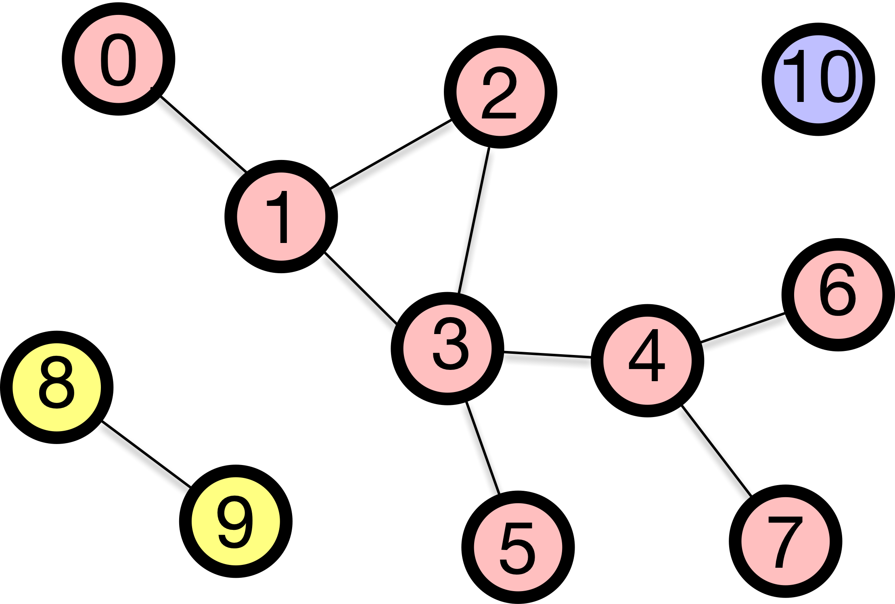

Euler's proof needed exactly one technical term: *degree*. Everything after this module needs five more: **walk**, **trail**, **path**, **circuit**, and **cycle**. It also needs two objects: the **adjacency matrix** and the **connected component**. These sound like housekeeping, but they are not. Every later module is phrased in them, and this is the page you will come back to.

## Walk, trail, path

| Term | Definition |
| :--- | :--- |
| **Walk** | A sequence of steps along edges, where both edges and nodes may be repeated. |
| **Trail** | A walk that does not repeat any **edge**. Nodes may repeat. |
| **Path** | A walk that never repeats a **node**, and therefore never repeats an edge either. |

The road-trip version: a walk is a casual drive that may pass the same street twice. A trail is a mail route that never passes the same street twice but may pass the same intersection again. A path is a tour of cities in which every city is new.

The three are nested: every path is a trail and every trail is a walk, and the restrictions only ever get tighter.

## Circuit and cycle

A journey that ends where it began is **closed**. Closing the two stricter kinds gives two more words.

| Term | Definition |
| :--- | :--- |
| **Circuit** | A **trail** that starts and ends at the same node. |
| **Cycle** | A **path** that starts and ends at the same node, the start node being the one permitted repeat. |

With this vocabulary, the Königsberg problem becomes precise:

- An **Eulerian trail** uses every edge of the graph exactly once. It is very often called an *Euler path*, and the title of this module reflects that convention, but it is actually a trail rather than a path, because it can return to a node. Kneiphof island forces such a return.
- An **Eulerian circuit** is an Eulerian trail that returns to its starting node.

The citizens of Königsberg wanted an Eulerian circuit, but for that *every* node must have even degree. There were four odd-degree nodes in their city, so what they wanted was impossible. After the war, two odd-degree nodes were left, which is enough for a trail but still not enough for a circuit.

The definitions above run one way — a name, then a route that fits it. Below
they run the other way. Three routes are traced across a small campus and the
ladder decides, on every step, which of the five names the route has left. Then
you get the pencil: click a place, then a neighbour, and watch the name move as
you go. Two questions settle it every time — does an edge come round twice, and
does a node?

```{=html}
<style>
/* --------------------------------------------------------------------------
   Route namer — only the layout and the ink this one stage needs. The paper,
   the panels, the buttons and the motion come from assets/anim.css, the
   sequencer from assets/anim.js, and the scenes from
   assets/anim/route-namer.js, which the m01 deck mounts too. Colours are the
   kit's resolved tokens — never literals. Scoped to #route-namer; keyframe
   names cannot be scoped, so they carry an rn- prefix.
   -------------------------------------------------------------------------- */

/* The card carries all five names at once and has to hold them without
   scrolling, so it takes the wider half; the campus square is small and does
   not need it. Repeated under the kit's 820px breakpoint, because an id
   selector outranks the kit's class selector whatever the media query says. */
#route-namer { --anim-svg-max: 380px; }
#route-namer .anim-grid-2 { grid-template-columns: minmax(0, 1fr) minmax(0, 1.2fr); }
@media (max-width: 820px) {
  #route-namer .anim-grid-2 { grid-template-columns: minmax(0, 1fr); }
}

#route-namer .rn-node { fill: var(--_white); stroke: var(--_ink); stroke-width: 2.4; }
/* Waiting for a click; already stood on; standing on now. */
#route-namer .rn-open { stroke: var(--_accent); stroke-dasharray: 4 3; }
#route-namer .rn-been { fill: var(--_accent-soft); }
#route-namer .rn-here { fill: var(--_amber); }

#route-namer .rn-nope { animation: rn-nope 0.42s ease; }
@keyframes rn-nope {
  0%, 100% { opacity: 1; }
  30% { opacity: 0.25; }
}

#route-namer .rn-name { font-family: var(--_hand); font-size: 17px; font-weight: 700; fill: var(--_ink); }
#route-namer .rn-hit { fill: transparent; stroke: none; pointer-events: all; }
#route-namer .rn-clickable .rn-hit { cursor: pointer; }
#route-namer .rn-head { fill: var(--_amber); }
#route-namer .rn-step { font-family: var(--_hand); font-size: 15px; font-weight: 700; fill: var(--_ink); }
/* A leg over an edge that has already been walked: the accent, so a repeat is
   a different colour and not just a second stroke in the same one. */
#route-namer .rn-again { stroke: var(--_accent); }
#route-namer .rn-again-fill { fill: var(--_accent); }

#route-namer .rn-body { display: flex; flex-direction: column; gap: 0.35rem; align-items: flex-start; }
#route-namer .rn-ladder { display: flex; flex-direction: column; gap: 0.18rem; align-self: stretch; }
#route-namer .rn-chip {
  display: flex;
  justify-content: space-between;
  gap: 0.5rem;
  padding: 0 0.4rem;
  font-family: var(--_hand);
  font-size: 0.78rem;
  line-height: 1.28;
  border: 1.6px solid transparent;
  border-radius: 11px 5px 11px 5px / 5px 11px 5px 11px;
}
#route-namer .rn-chip span { color: var(--_ink-faint); }
#route-namer .rn-on {
  background: var(--_accent-soft);
  border-color: var(--_accent);
}
#route-namer .rn-on b { color: var(--_accent); }
#route-namer .rn-on span { color: var(--_ink-soft); }
#route-namer .rn-route { font-family: var(--_mono); font-size: 0.74rem; color: var(--_ink); }
/* Two lines reserved: narration, verdicts and refusals all land here, and a
   refusal must not shove the reset button out from under the pointer. */
#route-namer .rn-why {
  font-family: var(--_hand);
  font-size: 0.82rem;
  line-height: 1.3;
  color: var(--_ink);
  min-height: calc(2 * 1.3em);
  align-self: stretch;
}
#route-namer .rn-why-no { color: var(--_amber); }
</style>

<figure class="anim-stage" id="route-namer">
  <div class="anim-bar">
    <div class="anim-step" data-anim-step></div>
    <div class="anim-dots" data-anim-dots></div>
    <button class="anim-btn" type="button" data-anim-prev aria-label="Previous step">◀</button>
    <button class="anim-btn" type="button" data-anim-play>⏸ Pause</button>
    <button class="anim-btn" type="button" data-anim-next aria-label="Next step">▶</button>
    <button class="anim-btn" type="button" data-anim-replay>↻ Replay</button>
  </div>

  <div class="anim-grid-2" data-anim-canvas>
    <div data-anim-clear data-rn-map></div>
    <div data-anim-clear data-rn-side></div>
  </div>

  <figcaption class="anim-note" data-anim-note></figcaption>
</figure>

<script src="/assets/anim/route-namer.js" defer></script>
```

One warning about this particular campus: every closed trail on it is also a
cycle. Telling a circuit from a cycle needs two loops meeting at a single
corner, and a square with one diagonal has no such corner. The distinction is
real, but you will have to look for it on a bigger graph.

## Three ways to write a network down

Graphs are mathematical objects, and a computer needs data structures to represent them. There are three standard data structures for graphs, and the [hands-on notebook](02-coding.qmd) builds all three. Let's take the Königsberg graph and number its nodes A = 0, B = 1, C = 2, D = 3.

**Edge list.** One pair per edge, and no other information:

```
(0,1) (0,1) (0,2) (0,2) (0,3) (1,3) (2,3)
```

Seven pairs for seven bridges. The two parallel pairs are simply listed twice — an edge list handles a multigraph without any extra machinery.

**Adjacency list.** For each node, the list of its neighbours:

```
0: 1, 1, 2, 2, 3
1: 0, 0, 3
2: 0, 0, 3
3: 0, 1, 2
```

The degree of a node is now the length of its row: 5, 3, 3, 3 — the four numbers Euler's proof turned on.

**Adjacency matrix.** The $N \times N$ table ${\bf A}$ below. The entry at row $i$ and column $j$ is the number of edges between node $i$ and node $j$; in a graph without parallel edges it is either $0$ or $1$.

$$
{\bf A} =
\begin{pmatrix}
0 & 2 & 2 & 1\\
2 & 0 & 0 & 1\\
2 & 0 & 0 & 1\\
1 & 1 & 1 & 0
\end{pmatrix}
$$

Reading the first row of the matrix, you see that node 0 (island A) has two edges to node 1 (south bank B), two edges to node 2 (north bank C), and one edge to node 3 (east island D). Summing a row gives you the degree of that node again: 5, 3, 3, 3.

The three are not interchangeable in cost, and choosing between them is a real decision:

- Asking *"is there an edge between node 47 and node 912?"* requires a single lookup in the matrix, whereas the other two require a scan.
- Asking *"who are node 47's neighbours?"* takes one row of the adjacency list, versus a scan of the entire edge list.
- The matrix explicitly stores every **non**-edge. For a network of a million nodes this requires $10^{12}$ entries, most of which are zeros, which is why real code stores it in a compressed form — see the [appendix](04-appendix.qmd).

## The adjacency matrix, and what its powers count

Adjacency matrices are just tables of small integers. Yet their power lies in the fact that ordinary matrix multiplication, applied to them, counts journeys.

Start with a question you can answer with the map in front of you. **How many two-step walks run from the north bank C to the south bank B?** Such a walk leaves C, lands somewhere, and goes on to B. There are two ways to walk from C to A in one step (via bridges *c* and *d*) and two bridges from A on to B; there is one way to walk from C to D (via bridge *g*) and one bridge from D on to B. In total, there are $2 \times 2 + 1 \times 1 = 5$ ways.

We get the same number from the matrix without thinking about the bridges. We take row C, $(2,0,0,1)$, and column B, $(2,0,0,1)$, multiply them element-wise and sum them up:

$$
2\cdot 2 + 0 \cdot 0 + 0 \cdot 0 + 1 \cdot 1 = 5 .
$$

This multiplication and addition of a row and a column *is* matrix multiplication, and that number is the entry $\left({\bf A}^2\right)_{CB}$. The same argument applies to any number of steps.

::: {.callout-important title="Key concept: matrix powers count walks"}
$$
\left({\bf A}^k\right)_{ij} = \text{the number of walks of length } k \text{ from } i \text{ to } j .
$$
:::

The two-line derivation is in the [appendix](04-appendix.qmd).

Note what it counts: **walks**, not trails or paths. Nodes and edges can be repeated, which is exactly what makes the formula so simple. Counting paths, where repetition is forbidden, is much harder, and no matrix product does it.

Here is the same claim with the routes drawn. The graph is not Königsberg —
five nodes, six edges, no parallel pair — because the argument is easier to
watch where every entry is a 0 or a 1. The cell being watched is $(1,4)$: empty
in ${\bf A}$, because no single edge joins those two, then filled as the
two-step routes are drawn one at a time. The fourth step is the one worth
sitting with, and the last puts $k$ on a knob.

```{=html}
<style>
/* --------------------------------------------------------------------------
   A^k counts walks — only the layout and the ink this one stage needs. The
   paper, the panels, the buttons, the knob and the motion come from
   assets/anim.css, the sequencer from assets/anim.js, and the scenes from
   assets/anim/walk-power.js, which the m01 deck mounts too. Colours are the
   kit's resolved tokens — never literals. Scoped to #walk-power.
   -------------------------------------------------------------------------- */

/* Three things share the frame — the graph, the matrix and the bookkeeping —
   so the right half splits again in two rather than stacking, which would run
   the matrix off the bottom. Repeated under the kit's 820px breakpoint,
   because an id selector outranks the kit's class selector whatever the media
   query says. */
#walk-power { --anim-svg-max: 340px; }
#walk-power .anim-grid-2 { grid-template-columns: minmax(0, 1fr) minmax(0, 1.3fr); }
@media (max-width: 820px) {
  #walk-power .anim-grid-2 { grid-template-columns: minmax(0, 1fr); }
}
#walk-power [data-wp-side] { display: flex; gap: 0.65rem; align-items: flex-start; }

#walk-power .wp-node { fill: var(--_accent); stroke: var(--_ink); stroke-width: 2; }
#walk-power .wp-name { font-family: var(--_hand); font-size: 19px; font-weight: 700; fill: var(--_white); }
/* The two corners the watched entry is about, ringed in the same amber as the
   watched cell — so at k = 4, where eleven walks are too many to draw, the
   graph still says which pair the number belongs to. */
#walk-power .wp-end { fill: none; stroke: var(--_amber); stroke-width: 3; }
#walk-power .wp-leg { stroke-width: 5; fill: none; stroke-linecap: round; stroke-opacity: 0.85; }
#walk-power .wp-red { stroke: var(--_amber); }
#walk-power .wp-purple { stroke: var(--_accent); }

/* The power, the grid, and what the grid counts, as one stack — so the matrix
   on screen always says out loud which power it is. */
#walk-power .wp-mwrap {
  display: flex;
  flex-direction: column;
  align-items: center;
  gap: 0.18rem;
  flex: none;
}
#walk-power .wp-title {
  font-family: var(--_hand);
  font-size: 1.75rem;
  font-weight: 700;
  line-height: 1.02;
  color: var(--_accent);
}
#walk-power .wp-title sup { font-size: 0.62em; }
#walk-power .wp-sub {
  font-family: var(--_hand);
  font-size: 0.72rem;
  line-height: 1.2;
  color: var(--_ink-soft);
}
#walk-power .wp-m {
  display: grid;
  grid-template-columns: repeat(6, 26px);
  gap: 2px;
  flex: none;
}
#walk-power .wp-m > i {
  display: inline-grid;
  place-items: center;
  height: 26px;
  font-family: var(--_mono);
  font-size: 0.72rem;
  font-style: normal;
  /* Zeros recede so the sparsity pattern is the first thing the eye gets. */
  color: var(--_ink-faint);
  background: var(--_white);
  border: 1px solid var(--_rule);
}
/* `> i` on the base rule, so every state below has to carry the child
   combinator too or it loses on specificity and only its colour lands. */
#walk-power .wp-m > i.wp-h { border: 0; background: none; color: var(--_ink-soft); font-weight: 700; }
#walk-power .wp-m > i.wp-h-on { color: var(--_amber); }
/* Every nonzero in the accent, so the shape of the matrix reads at a glance
   and the one amber cell is unmistakably the one being talked about. */
#walk-power .wp-m > i.wp-on { background: var(--_accent-soft); color: var(--_accent); font-weight: 700; }
#walk-power .wp-m > i.wp-band { outline: 1.6px solid var(--_amber); outline-offset: -1.6px; }
#walk-power .wp-m > i.wp-hi {
  background: var(--_amber);
  border-color: var(--_amber);
  color: var(--_white);
  font-weight: 700;
}

#walk-power .wp-card { display: flex; flex-direction: column; gap: 0.3rem; flex: 1 1 auto; min-width: 0; }
/* The kit's knob wrapper carries `margin: 0.45rem auto 0.2rem`, written for a
   block container. As a flex item those auto side margins beat `stretch`, the
   track resolves to its content width — nothing — and all that renders is a
   knob floating in the middle of the card. Kill the auto margins, not the
   rule. */
#walk-power .wp-card .anim-range {
  align-self: stretch;
  max-width: none;
  margin-left: 0;
  margin-right: 0;
}
#walk-power .wp-formula { font-family: var(--_mono); font-size: 0.84rem; color: var(--_accent); }
#walk-power .wp-terms { display: flex; gap: 0.3rem; flex-wrap: wrap; }
#walk-power .wp-term {
  padding: 0.05rem 0.32rem;
  font-family: var(--_mono);
  font-size: 0.7rem;
  color: var(--_ink-faint);
  border: 1.4px solid var(--_rule);
  border-radius: 8px 4px 8px 4px / 4px 8px 4px 8px;
}
#walk-power .wp-term-on { color: var(--_amber); border-color: var(--_amber); font-weight: 700; }
#walk-power .wp-read { font-family: var(--_hand); font-size: 0.82rem; line-height: 1.3; min-height: calc(2 * 1.3em); }
#walk-power .wp-read b { color: var(--_accent); }
</style>

<figure class="anim-stage" id="walk-power">
  <div class="anim-bar">
    <div class="anim-step" data-anim-step></div>
    <div class="anim-dots" data-anim-dots></div>
    <button class="anim-btn" type="button" data-anim-prev aria-label="Previous step">◀</button>
    <button class="anim-btn" type="button" data-anim-play>⏸ Pause</button>
    <button class="anim-btn" type="button" data-anim-next aria-label="Next step">▶</button>
    <button class="anim-btn" type="button" data-anim-replay>↻ Replay</button>
  </div>

  <div class="anim-grid-2" data-anim-canvas>
    <div data-anim-clear data-wp-map></div>
    <div data-anim-clear data-wp-side></div>
  </div>

  <figcaption class="anim-note" data-anim-note></figcaption>
</figure>

<script src="/assets/anim/walk-power.js" defer></script>
```

Two consequences we will use later. The diagonal element $\left({\bf A}^2\right)_{ii}$ counts out-and-back trips from node $i$ to itself. In a graph without parallel edges, this is the degree of $i$. In Königsberg, you can leave the island by bridge *a* and return on bridge *b*, and the full count is $\left({\bf A}^2\right)_{AA} = 2^2 + 2^2 + 1^2 = 9$. A **triangle** is a set of three nodes all connected to each other. Königsberg has two: A, B, D (bridges *a*, *f*, *e*) and A, C, D (bridges *c*, *g*, *e*). In graphs without parallel edges, $\left({\bf A}^3\right)_{ii}$ is *twice* the number of triangles containing $i$, because each triangle can be walked in two directions. Module 2 converts this number into a measure of how cliquish a network is.

## When a network falls apart

Euler's condition begins with the word *connected*, and it has to. If some part of the network is unreachable from another, then no single walk can possibly cover all the edges.

-   A graph is **connected** if there is a path between every pair of nodes.
-   A **disconnected** graph breaks into islands of nodes called **connected components**. A connected component is a *maximal* set of nodes that can reach each other, maximality meaning that you cannot add another node without breaking the property.

{#fig-connected-components fig-alt="A graph whose nodes are shaded in three groups, one of eight nodes, one of two, one of one." fig-align="center" width=70%}

### The giant component

A real network is almost never neatly connected, but it is rarely evenly broken either. Typically, there is one large component containing most of the nodes, with a few small fragments and isolated nodes scattered around. This dominant component is called the **giant component**.

"Giant" is a statement about *proportion*, not head count. A component is giant if it occupies some fixed fraction of all the nodes (say 90%) and keeps that fraction roughly constant as the network grows. A 1,000-node component is giant in a 1,200-node network but negligible in a 10 million-node network.

In practice, the giant component is what we usually analyse. The average path length is not defined between disconnected pieces, and a centrality computed on an isolated pair of nodes tells you nothing. So we extract the giant component and work there — and *when a giant component exists at all*, and *what it takes to destroy it*, are the questions of all of Module 3.

### Finding components by flood fill

It is easy to read the components off a picture, but you need an algorithm to do it on a million nodes. The idea is simple enough to run by hand:

1. Pick any unvisited node and mark it as visited.
2. Look at its neighbours. Any that are unvisited, visit them too.
3. Repeat until nothing new can be reached. Everything you touched is one component.
4. If unvisited nodes remain, pick one and start again — that is the next connected component.

The order of visits changes depending on whether you always extend the most recently discovered node (**depth-first search**, DFS) or sweep outward one layer at a time (**breadth-first search**, BFS), but the resulting component is the same. Because BFS explores layer by layer, the layer at which it first reaches a node is the *shortest path length* to that node, which is how Module 2 measures how small the world is.

Either way, each node is visited only once and each edge is checked only a constant number of times. The work therefore grows in proportion to the number of nodes plus the number of edges, not to the square of the number of nodes. If you double the size of the network, the amount of work roughly doubles. That is why partitioning a network into components stays practical at any scale you are likely to meet.

The picture above gave the components away; twelve nodes in a row do not. Run
the sweep below and the amber ring is the frontier, the number on a node is the
layer it was reached at, and the boxes close one at a time. On the last step
you pick the seeds. Pick different ones from your neighbour and the numbers on
the nodes will disagree — the three groups will not. That is the point: the
partition belongs to the graph, and only the visit order is yours.

```{=html}
<style>
/* --------------------------------------------------------------------------
   Component sweep — only the layout and the ink this one stage needs. The
   paper, the panels, the buttons and the motion come from assets/anim.css, the
   sequencer from assets/anim.js, and the scenes from
   assets/anim/comp-sweep.js, which the m01 deck mounts too. Colours are the
   kit's resolved tokens — never literals. Scoped to #comp-sweep; keyframe
   names cannot be scoped, so they carry a cs- prefix.
   -------------------------------------------------------------------------- */

/* The band graph is 4.5 times as wide as it is tall, so this is the one stage
   here that does not split the frame in two: the drawing takes the full column
   and its bookkeeping sits underneath in a single row. */
#comp-sweep { --anim-svg-max: 100%; }
#comp-sweep .cs-col { display: flex; flex-direction: column; gap: 0.35rem; }

#comp-sweep .cs-node { fill: var(--_white); stroke: var(--_ink); stroke-width: 2.2; }
/* Unvisited and waiting for a click; visited; and the ring the sweep is on. */
#comp-sweep .cs-open { stroke: var(--_accent); stroke-dasharray: 3 3; }
#comp-sweep .cs-seen { fill: var(--_accent); }
#comp-sweep .cs-front { fill: var(--_amber); animation: cs-pulse 1.1s ease-in-out infinite; }
/* stroke-width and not r: the SVG geometry properties are animatable as CSS in
   Chrome but not everywhere. */
@keyframes cs-pulse { 50% { stroke-width: 6; } }

#comp-sweep .cs-nope { animation: cs-nope 0.42s ease; }
@keyframes cs-nope {
  0%, 100% { opacity: 1; }
  30% { opacity: 0.25; }
}

/* An edge the sweep has looked at — the O(N + M) count is about these. */
#comp-sweep .cs-tree { stroke: var(--_accent); stroke-width: 3.4; }
#comp-sweep .cs-num { font-family: var(--_hand); font-size: 15px; font-weight: 700; fill: var(--_amber); }
#comp-sweep .cs-name { font-family: var(--_hand); font-size: 13px; fill: var(--_ink-soft); }
#comp-sweep .cs-box { fill: none; stroke: var(--_accent); stroke-width: 2; stroke-dasharray: 7 5; }
#comp-sweep .cs-hit { fill: transparent; stroke: none; pointer-events: all; }
#comp-sweep .cs-clickable .cs-hit { cursor: pointer; }

#comp-sweep .cs-card { display: flex; flex-direction: column; gap: 0.3rem; }
/* One line always reserved, so the row underneath never jumps as the sweep
   narrates itself. */
#comp-sweep .cs-msg { font-family: var(--_hand); font-size: 0.84rem; line-height: 1.3; min-height: 1.3em; }
#comp-sweep .cs-rows { display: flex; flex-wrap: wrap; gap: 0.35rem 1.05rem; align-items: baseline; }
#comp-sweep .cs-rows .anim-tally { gap: 0.5rem; }
#comp-sweep .cs-rows .anim-quote { flex-basis: 100%; }
#comp-sweep .cs-chip {
  display: flex;
  gap: 0.4rem;
  align-items: baseline;
  padding: 0.1rem 0.45rem;
  font-family: var(--_hand);
  font-size: 0.8rem;
  background: var(--_accent-soft);
  border: 1.6px solid var(--_accent);
  border-radius: 12px 6px 12px 6px / 6px 12px 6px 12px;
}
#comp-sweep .cs-chip span { color: var(--_ink-soft); }
</style>

<figure class="anim-stage" id="comp-sweep">
  <div class="anim-bar">
    <div class="anim-step" data-anim-step></div>
    <div class="anim-dots" data-anim-dots></div>
    <button class="anim-btn" type="button" data-anim-prev aria-label="Previous step">◀</button>
    <button class="anim-btn" type="button" data-anim-play>⏸ Pause</button>
    <button class="anim-btn" type="button" data-anim-next aria-label="Next step">▶</button>
    <button class="anim-btn" type="button" data-anim-replay>↻ Replay</button>
  </div>

  <div class="cs-col" data-anim-canvas>
    <div data-anim-clear data-cs-map></div>
    <div data-anim-clear data-cs-side></div>
  </div>

  <figcaption class="anim-note" data-anim-note></figcaption>
</figure>

<script src="/assets/anim/comp-sweep.js" defer></script>
```

### When edges have direction

What if edges run one way, like one-way streets? These are called **directed graphs**, and two things you have been treating as one quantity each now split in two.

The first is degree. An undirected node has a single count; a directed node has two:

- **In-degree** $k^{\text{in}}_i$ — how many edges arrive at $i$.
- **Out-degree** $k^{\text{out}}_i$ — how many leave it.

They need not be equal, and the gap between them is usually the interesting part: a paper with a large in-degree is cited often, one with a large out-degree cites often, and those are not the same paper. The handshake changes shape too. Every edge still leaves exactly one node and arrives at exactly one, so

$$
\sum_i k^{\text{in}}_i = \sum_i k^{\text{out}}_i = M,
$$

where the undirected version gave $2M$ — the factor of two was only ever the two ends of an edge being counted separately, and now each end belongs to a different sum. Module 6 divides by out-degree to define PageRank and Module 7 walks along out-edges, so this is the split those modules assume you have.

The second is connectivity, which now comes in two flavours:

- **Weakly connected**: the graph would be connected if we ignored the arrows, meaning there is a path from A to B but perhaps not from B to A.
- **Strongly connected**: there is a directed path from any node to every other node. No matter where you start, you can follow the arrows to get anywhere else.

{#fig-connected-components-directed fig-alt="A directed graph with three nodes shaded to mark a strongly connected component." fig-align="center" width=70%}

Drawn as two separate figures, strong and weak look like two graphs. They are
one graph and two questions, and the difference between the answers is usually
a single arrowhead. Below is a town of five corners and six one-way streets.
The number beside a corner is how many of the other four it reaches, so five
fours is the verdict and the drawing carries it without a caption. Click any
street to turn it round. One of the six streets can be pointed either way
without costing anything; the other five each break the town on their own. Only
six of the 64 orientations are strongly connected, while all 64 of them are
weakly connected — and that gap *is* the difference between the two words.

```{=html}
<style>
/* --------------------------------------------------------------------------
   Directed reachability — only the layout and the ink this one stage needs.
   The paper, the panels, the buttons and the motion come from assets/anim.css,
   the sequencer from assets/anim.js, and the scenes from
   assets/anim/dir-reach.js, which the m01 deck mounts too. Colours are the
   kit's resolved tokens — never literals. Scoped to #dir-reach.
   -------------------------------------------------------------------------- */

/* The verdict lives on the drawing — a reach count beside every corner — so
   the card is only two flags and a line, and the drawing takes the wider half.
   Repeated under the kit's 820px breakpoint, because an id selector outranks
   the kit's class selector whatever the media query says. */
#dir-reach { --anim-svg-max: 440px; }
#dir-reach .anim-grid-2 { grid-template-columns: minmax(0, 1.35fr) minmax(0, 1fr); }
@media (max-width: 820px) {
  #dir-reach .anim-grid-2 { grid-template-columns: minmax(0, 1fr); }
}

#dir-reach .dr-arc { stroke: var(--_ink); stroke-width: 4.2; fill: none; }
#dir-reach .dr-head { fill: var(--_ink); }
/* An arc the flood has just used, and one you turned round yourself. */
#dir-reach .dr-on { stroke: var(--_amber); stroke-width: 5.6; }
#dir-reach .dr-flipped { stroke: var(--_accent); }
#dir-reach .dr-flipped-fill { fill: var(--_accent); }
/* One beat rubs the arrowheads out — the same six streets, asked the weaker
   question. */
#dir-reach .dr-undirected .dr-head { opacity: 0; }
#dir-reach .dr-undirected .dr-arc { stroke: var(--_accent); }

#dir-reach .dr-node { fill: var(--_white); stroke: var(--_ink); stroke-width: 2.6; }
/* An amber rim on any corner that cannot reach the whole town: a broken
   orientation should be visible before you read a single number. */
#dir-reach .dr-part { stroke: var(--_amber); stroke-width: 3.4; }
#dir-reach .dr-src { fill: var(--_amber); }
#dir-reach .dr-lit { fill: var(--_accent); }
#dir-reach .dr-name { font-family: var(--_hand); font-size: 24px; font-weight: 700; fill: var(--_ink); }
#dir-reach .dr-name-on { fill: var(--_white); }
/* How many of the other four this corner reaches. Five fours is the verdict. */
#dir-reach .dr-count {
  font-family: var(--_hand);
  font-size: 23px;
  font-weight: 700;
  fill: var(--_accent);
}
#dir-reach .dr-count-low { fill: var(--_amber); }
#dir-reach .dr-hit { fill: none; stroke: transparent; stroke-width: 30; pointer-events: stroke; }
#dir-reach .dr-clickable .dr-hit { cursor: pointer; }

#dir-reach .dr-card { display: flex; flex-direction: column; gap: 0.3rem; }
#dir-reach .dr-verdict { display: flex; gap: 0.4rem; flex-wrap: wrap; }
#dir-reach .dr-flag {
  display: flex;
  gap: 0.4rem;
  align-items: baseline;
  padding: 0.1rem 0.4rem;
  font-family: var(--_hand);
  font-size: 0.74rem;
  line-height: 1.3;
  border: 1.8px solid var(--_ink);
  border-radius: 12px 6px 12px 6px / 6px 12px 6px 12px;
}
#dir-reach .dr-flag span { font-weight: 700; font-size: 0.82rem; }
#dir-reach .dr-yes { background: var(--_accent-soft); border-color: var(--_accent); }
#dir-reach .dr-yes span { color: var(--_accent); }
#dir-reach .dr-no { background: var(--_amber-soft); border-color: var(--_amber); }
#dir-reach .dr-no span { color: var(--_amber); }
/* Two lines reserved, so a verdict flipping between one line and two does not
   shove the reset button out from under the pointer. */
#dir-reach .dr-msg {
  font-family: var(--_hand);
  font-size: 0.82rem;
  line-height: 1.3;
  min-height: calc(2 * 1.3em);
}
#dir-reach .dr-msg-no { color: var(--_amber); }
</style>

<figure class="anim-stage" id="dir-reach">
  <div class="anim-bar">
    <div class="anim-step" data-anim-step></div>
    <div class="anim-dots" data-anim-dots></div>
    <button class="anim-btn" type="button" data-anim-prev aria-label="Previous step">◀</button>
    <button class="anim-btn" type="button" data-anim-play>⏸ Pause</button>
    <button class="anim-btn" type="button" data-anim-next aria-label="Next step">▶</button>
    <button class="anim-btn" type="button" data-anim-replay>↻ Replay</button>
  </div>

  <div class="anim-grid-2" data-anim-canvas>
    <div data-anim-clear data-dr-map></div>
    <div data-anim-clear data-dr-side></div>
  </div>

  <figcaption class="anim-note" data-anim-note></figcaption>
</figure>

<script src="/assets/anim/dir-reach.js" defer></script>
```

## What you can now do

- Say precisely which of walk, trail, path, circuit and cycle a given route is.
- Write the same network as an edge list, an adjacency list and an adjacency matrix, and read a degree off each one.
- Read $\left({\bf A}^k\right)_{ij}$ as a count of walks rather than an opaque product.
- Split a network into connected components by hand, and say what makes one of them giant.

Now do it in code: the [hands-on notebook](02-coding.qmd) builds all three representations and a component finder, and the [exercises](03-exercises.qmd) ask you to decide, for a network you have never seen, whether an Eulerian trail exists.
