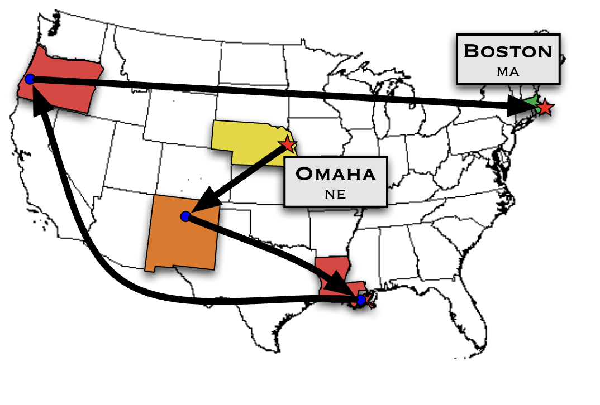

> **The big question of this module.** Why is a stranger on the other side of the world only about six handshakes away?

Eight billion people, and any two of them turn out to be separated by a handful
of introductions. That is a strange thing for a network to be, and the
strangeness is the whole point. Your friends mostly know each other, which
should seal you inside a small pocket of the world — and yet the world is not
small in *that* sense. It is small in the sense of *close*.

This module measures both halves of that sentence, shows why they pull against
each other, and gives one mechanism that produces them together. We reuse the
vocabulary from [Module 1](../m01-euler_tour/01b-vocabulary.qmd) — walk, path,
connected component — and add three new quantities: **average path length**,
the **clustering coefficient**, and the **small-world index** that judges them
against a random network.

## Sixty-Four Letters That Found a Stockbroker

::: {.column-margin}
[Stanley Milgram](https://en.wikipedia.org/wiki/Stanley_Milgram) (1933-1984) was an American social psychologist best known for his controversial [obedience experiments](https://en.wikipedia.org/wiki/Milgram_experiment) at Yale University in the early 1960s. Beyond the obedience studies, Milgram conducted groundbreaking research on social networks, including the famous ["small world" experiment](https://en.wikipedia.org/wiki/Small-world_experiment) that revealed the surprisingly short chains connecting any two people in society.
:::

How far apart are two people in a social network? Milgram and his colleagues ran
a series of experiments in the 1960s to find out, and @fig-milgram-small-world-experiment
sketches how the best-known of them worked.

::: {#fig-milgram-small-world-experiment}

{width=70% fig-align="center"}

Milgram's small world experiment: packets start in Nebraska and are forwarded, one acquaintance at a time, toward a target in Boston.

:::

The experiment went as follows:

1. The researchers mailed a packet to 296 people, most of them in Omaha, Nebraska, and the rest in Boston.
2. The recipient was asked to send the packet straight to the target person — a stockbroker working in Boston — if they knew him personally. If not, they were to forward it to someone they knew on a first-name basis who might be closer to him.
3. Each new recipient did the same, until the packet reached the target or the chain died.

The result was surprising: 64 of the 296 packets reached the stockbroker, and
those completed chains had passed through **5.2 intermediaries on average** —
the figure that became known as **six degrees of separation** (Travers and
Milgram, *Sociometry*, 1969). Despite the hundreds of millions of people in the
United States, two randomly chosen strangers sat only a few handshakes apart.

::: {.column-margin}
The term "six degrees of separation" is commonly associated with Milgram's experiment, but Milgram never used it. John Guare coined the term for his 1991 play and film ["Six Degrees of Separation."](https://en.wikipedia.org/wiki/Six_Degrees_of_Separation_(film))
:::

Notice what the experiment actually shows. It is not merely that a short chain
*exists* between two strangers — it is that ordinary people, each seeing only
their own acquaintances, can *find* one. That is a much stronger claim, and it
is the one we will put you inside of a few paragraphs from now.

Later studies confirmed the effect at a scale Milgram could not reach:

- An email version of the experiment recruited more than 24,000 chains aimed at 18 targets in 13 countries. Only 384 chains completed, but among those the average length was about four steps; correcting for the chains that simply died, the researchers estimated the true typical distance at five to seven (Dodds, Muhamad and Watts, *Science*, 2003; re-analysed in @goel2009social).

- Researchers at Facebook and the University of Milan measured the whole Facebook social network — 721 million active users and 69 billion friendships. The average distance between two users was 4.74. [@backstrom2012four]

## Clustered and Yet Close: Two Things That Should Not Coexist

When we think about social networks, it is natural to imagine that most people
are friends with others who are nearby — friends of friends, classmates,
colleagues, neighbors. These are **local connections**, and they tend to form
tightly-knit groups where everyone knows each other. In network terms, this
means there are many **triangles**: if Alice is friends with Bob, and Bob is
friends with Carol, then Alice is also likely to be friends with Carol.

However, if a network had only these local, clustered connections, it would be
hard for information or influence to travel across it. You would have to pass
through many intermediaries to reach someone on the far side, so the typical
distance between two nodes would be *large*, not six.

What makes **small-world networks** surprising is that, despite all that local
clustering, they also contain a few **long-range connections** — edges that link
distant parts of the network. These shortcuts collapse the typical distance. As
a result, even in a huge network, you can reach almost anyone in a few steps.
This combination of high clustering and short paths is what defines the
small-world property.

In summary:

- **Local connections** create clustering (many triangles), but on their own they make the network "large" in terms of path length.
- **Small-world networks** have both high clustering *and* short average path lengths, thanks to a few edges that connect distant parts of the network.
- This is non-trivial because it cannot be explained by local connections alone; the long-range links are essential.

## Try It Yourself: Race Across Wikipedia in Five Clicks

Before we measure anything, feel it. Play a round of
[Wikirace](https://wiki-race.com): you are given a start article and a target
article, and you must get from one to the other using only the links inside the
pages. No search box.

You will almost certainly arrive in fewer than ten clicks, and — this is the
part worth noticing — you will do it without ever seeing a map of Wikipedia. You
route by local knowledge alone, exactly as Milgram's letter carriers did. Keep
count of your clicks; that number is the quantity we are about to define.

<!-- TODO(anim): Wikirace-style click path across a small article graph, showing the hop count rising as the player closes in on the target -->

## Putting a Number on "Small"

Two quantities carry the whole story, so we define them precisely and compute
each one by hand on a network small enough to check.

### Distance and Average Path Length

The **distance** $d(i,j)$ between two nodes is the number of edges on a shortest
path between them. If no path exists at all, the distance is infinite.

::: {.column-margin}
Recall from [Module 1](../m01-euler_tour/01b-vocabulary.qmd) that a **path** is a walk that never revisits a node. A *shortest* path between two nodes is one with the fewest edges; there may be several, but they all have the same length.
:::

```{dot}
//| fig-width: 3
//| fig-height: 3
//| fig-cap: "A four-node network. Node A is the one we measure from."
//| label: fig-distance-example
//| fig-align: center
graph G {
  layout=circo
  node [shape=circle, color="#333333", fontcolor="#333333", penwidth=1.2];
  edge [color="#666666"];
  A [color="#593196", fontcolor="#593196", penwidth=2.4];
  B;
  C;
  D;
  A -- B;
  A -- C;
  B -- C;
  B -- D;
  C -- D;
}
```

In @fig-distance-example, let us find the distance between A and D:

- Path 1: A $\rightarrow$ B $\rightarrow$ D (2 edges)
- Path 2: A $\rightarrow$ C $\rightarrow$ D (2 edges)
- Path 3: A $\rightarrow$ C $\rightarrow$ B $\rightarrow$ D (3 edges)

There are several paths, but the shortest ones have 2 edges, so $d(A,D) = 2$.

Now average over every pair. Four nodes give $\binom{4}{2} = 6$ pairs:

| Pair    | Shortest Path                | Length |
|---------|------------------------------|--------|
| A - B   | A $\rightarrow$ B                        | 1      |
| A - C   | A $\rightarrow$ C                        | 1      |
| A - D   | A $\rightarrow$ B $\rightarrow$ D or A $\rightarrow$ C $\rightarrow$ D       | 2      |
| B - C   | B $\rightarrow$ C                        | 1      |
| B - D   | B $\rightarrow$ D                        | 1      |
| C - D   | C $\rightarrow$ D                        | 1      |

The **average path length** $\overline{L}$ is the mean of these distances:
$(1+1+2+1+1+1)/6 = 7/6 \simeq 1.17$.

The **diameter** is a different summary of the same table: the *largest* entry
rather than the average. Here it is 2. Average path length is the typical case;
diameter is the worst case. The rest of this module works with the average, so
whenever you read "the world is six steps wide", it is an average, not a
guarantee.

## Counting Triangles: Three Ways to Measure Clustering

In social networks your friends tend to know each other. If you have a friend
Alice, and Alice has friends Bob and Carol, clustering asks: "Are Bob and Carol
also friends?" High clustering means dense local neighborhoods.

There are three standard ways to turn that question into a number, and they are
not interchangeable:

- **Local clustering** $C_i$ — one number *per node*: what fraction of node $i$'s pairs of friends are themselves friends.
- **Average local clustering** $\overline{C}$ — the plain average of $C_i$ over all nodes. Every node counts once, so a person with two friends counts as much as a person with two hundred.
- **Global clustering** $C$ — one ratio for the *whole network*: triangles over connected triplets. Because a node with $k$ friends supplies $\binom{k}{2}$ triplets, high-degree nodes dominate this one.

We take them one at a time, and then compute all three on the same six-node
network so you can see them disagree.

### Local Clustering

**Local clustering** asks: of all the pairs of friends you have, what fraction
of those pairs are friends with each other?

$$
C_i = \dfrac{\text{\# of edges among the neighbors of } i}{\text{\# of pairs of neighbors of } i} = \dfrac{e_i}{k_i(k_i-1)/2}
$$

where $k_i$ is the degree of node $i$ and $e_i$ is the number of edges running
between $i$'s neighbors. Every such edge closes a triangle with $i$, so you may
equally read the numerator as "triangles containing $i$" — the two counts are
the same number.

A node with fewer than two neighbors has no pairs to check at all. By convention
we set $C_i = 0$ for those nodes.

```{dot}
//| fig-width: 3
//| fig-height: 2.6
//| fig-cap: "A six-node network of friends. We measure clustering at node A."
//| label: fig-local-clustering
//| fig-align: center
graph G {
  layout=circo
  node [shape=circle, color="#333333", fontcolor="#333333", penwidth=1.2];
  edge [color="#666666"];
  A [color="#593196", fontcolor="#593196", penwidth=2.4, pos="0,0!"];
  B;
  C;
  D;
  E;
  F;

  A -- B;
  A -- C;
  A -- D;
  A -- E;
  A -- F;
  B -- F;
  C -- E;
}
```

Take node A in @fig-local-clustering. It has $k_A = 5$ neighbors (B, C, D, E, F),
so there are $5 \times 4 / 2 = 10$ pairs of them. Of those ten pairs, exactly two
are joined by an edge: B-F and C-E. So

$$
C_A = \frac{2}{10} = 0.2 .
$$

### Average Local Clustering

Average local clustering is the mean of $C_i$ over every node:

$$
\overline {C} = \frac{1}{N} \sum_{i=1}^N C_i
$$

Run through @fig-local-clustering node by node. B's two neighbors are A and F,
and A-F is an edge, so $C_B = 1$. The same holds for C, E and F. Node D has a
single neighbor, so $C_D = 0$ by our convention. With $C_A = 0.2$:

$$
\overline{C} = \frac{0.2 + 1 + 1 + 0 + 1 + 1}{6} = \frac{4.2}{6} = 0.70 .
$$

### Global Clustering

Global clustering, also known as **transitivity**, asks the same question of the
network as a whole: across every place where two edges meet, how often is the
triangle closed?

A **connected triplet** is a set of three nodes joined by at least two edges. It
is either a *closed* triplet (a triangle) or an *open* triplet (a wedge):

```{dot}
//| fig-width: 5
//| fig-height: 2.25
//| fig-cap: "Closed triplet (left) and open triplet (right). The accent edge is the one that closes the triangle."
//| label: fig-triplets
//| fig-align: center
graph G {
  layout=neato;

  node [shape=circle, fontsize=14, color="#333333", fontcolor="#333333", penwidth=1.2];
  edge [color="#666666"];

  L1 [shape=plaintext, label="Closed triplet", fontsize=13, pos="-1.5,0.9!"];
  A1 [pos="-1.5,0!"];
  B1 [pos="-2.5,-1!"];
  C1 [pos="-0.5,-1!"];
  A1 -- B1;
  A1 -- C1;
  B1 -- C1 [color="#593196", penwidth=2.4];

  L2 [shape=plaintext, label="Open triplet", fontsize=13, pos="1.5,0.9!"];
  A2 [pos="1.5,0!"];
  B2 [pos="0.5,-1!"];
  C2 [pos="2.5,-1!"];
  A2 -- B2;
  A2 -- C2;
}
```

The global clustering coefficient is

$$
C = \frac{3 \times \text{number of triangles}}{\text{number of connected triplets}}
$$

Why the factor of three? A connected triplet is pinned down by its **center** —
the node in the middle, the one incident to both edges. A triangle contains
three connected triplets, one centered at each of its three nodes. Multiplying
the triangle count by three therefore puts the numerator into the same units as
the denominator.

Counting triplets is easiest center by center: a node of degree $k$ is the
center of $\binom{k}{2}$ of them. In @fig-local-clustering, A contributes
$\binom{5}{2} = 10$, each of B, C, E and F has degree 2 and so contributes 1, and
D has degree 1 and contributes none — 14 connected triplets in total. There are
2 triangles (A-B-F
and A-C-E), so

$$
C = \frac{3 \times 2}{14} = 0.43 .
$$

::: {.callout-important title="Same network, two answers: 0.70 and 0.43"}
Both numbers are correct; they weight the network differently.

Average local clustering gave 0.70 because five of the six nodes are tiny — they
have exactly two neighbors, and those two happen to be connected, so each scores
a perfect 1. The hub A, whose neighborhood is almost empty, is outvoted five to
one.

Global clustering gave 0.43 because A alone supplies 10 of the network's 14
triplets, and only 2 of them are closed. The hub dominates.

The rule of thumb: **average local clustering describes the typical node; global
clustering describes the typical triplet.** In networks with hubs the two can
differ by a lot, and reporting one while calling it "the clustering
coefficient" is how papers end up incomparable.
:::

<!-- TODO(anim): step through the six-node graph node by node, filling in C_i, then rebuild the same number as a triplet ratio to show why the two answers differ -->

## Compared to What? The Random Baseline

We now have both ingredients — $\overline{L}$ and $\overline{C}$. The obvious
move is to combine them into a single score. A small world has high clustering
and short paths, so take the ratio:

$$
s_{\text{naive}} = \frac{\overline{C}}{\overline{L}}
$$

This does not work, and the reason is instructive. Clustering is at most 1, and
average path length is at least 1, so $s_{\text{naive}} \le 1$ always. The
maximum is reached by a **complete network**, where everyone knows everyone:
$\overline{C} = 1$, $\overline{L} = 1$, and $s_{\text{naive}} = 1$. The score is
maximized by the single least interesting network there is. Raw values of
$\overline{C}$ and $\overline{L}$ cannot certify small-worldness, because there
is nothing in them to say whether 0.43 is a lot of clustering or a little.

A lot compared to *what*? To a network with the same size and the same number of
edges but no structure at all. Humphries and Gurney turned that comparison into
the **small-world index** [@humphries2008network]:

$$
\sigma = \frac{\overline{C}/\overline{C}_{\text{random}}}{\overline{L}/\overline{L}_{\text{random}}} = \frac{\overline{C} \cdot \overline{L}_{\text{random}}}{\overline{L} \cdot \overline{C}_{\text{random}}}
$$

where $\overline{C}_{\text{random}}$ and $\overline{L}_{\text{random}}$ come from
an equivalent random network — an Erdős–Rényi graph with the same number of
nodes and the same number of edges, in which every pair of nodes is joined
independently with probability $p$.

::: {.column-margin}
Watts and Strogatz [@watts1998collective] compared $\overline{C}$ and $\overline{L}$ against a random graph in 1998, but the single ratio $\sigma$ and the name "small-world-ness" are due to Humphries and Gurney in 2008.
:::

Reading $\sigma$:

- $\sigma > 1$: small-world — more clustered than random without paying for it in distance.
- $\sigma \approx 1$: indistinguishable from a random network.
- $\sigma < 1$: anti-small-world — long paths, little clustering, worse than random on both counts.

You could get the two reference values by generating a thousand random networks
and averaging. You do not have to. For an Erdős–Rényi graph they are known in
closed form:

$$
\begin{aligned}
\overline{C}_{\text{random}} & \approx \frac{\langle k \rangle}{n-1} \\
\overline{L}_{\text{random}} &\approx \frac{\ln n }{\ln \langle k \rangle}
\end{aligned}
$$

where $n$ is the number of nodes and $\langle k \rangle$ the average degree
[@humphries2008network; @newman2001random]. Both results are derived in the
[appendix](04-appendix.qmd).

::: {.callout-tip title="Worked example: is this network a small world?"}
Suppose you measure a network of $n = 1{,}000$ nodes with average degree
$\langle k \rangle = 10$, and find $\overline{C} = 0.30$ and $\overline{L} = 4.5$.

The random baseline is $\overline{C}_{\text{random}} \approx 10/999 = 0.010$ and
$\overline{L}_{\text{random}} \approx \ln 1000 / \ln 10 = 6.91/2.30 = 3.0$.

$$
\sigma = \frac{0.30/0.010}{4.5/3.0} = \frac{30}{1.5} = 20 .
$$

Thirty times the clustering of a random graph, for only one and a half times the
distance. Comfortably a small world.
:::

Notice what the baseline reveals: short paths come *free* in a random network —
$\ln 1000 / \ln 10 = 3$ steps across a thousand nodes. High clustering does not.
So the surprising half of the small-world property was never the short paths. It
was having them *and* keeping the triangles.

## How to Build a Small World from Scratch

Real networks turn out to be small worlds again and again. That raises the question
of mechanism: what process would produce a network like this? Watts and
Strogatz answered it with a model you can run on a napkin — start with something
maximally clustered, then add a dial that introduces randomness.

::: {.column-margin}
> "What I cannot create, I do not understand." — Richard Feynman

Which is exactly why a model matters here: building a network that has the small-world property is how we learn what causes it.
:::

**Step 1: Start with a ring lattice.**

- Arrange $N$ nodes in a ring.
- Give every node degree $k$ (choose $k$ even) by connecting it to its $k$ nearest neighbors around the ring — $k/2$ on each side.
- This is maximally parochial: clustering is high, and the average path length is roughly $N/(2k)$, which grows *linearly* with $N$.

**Step 2: Rewire each edge with probability $p$.**

- Visit every edge in turn. With probability $p$, detach one endpoint and reconnect it to a node chosen uniformly at random; with probability $1-p$, leave it alone.
- Do not create self-loops or duplicate edges.

The parameter $p$ is the dial. At $p = 0$ you have the lattice: high clustering,
long paths. At $p = 1$ every edge has been rewired and you have something
indistinguishable from an Erdős–Rényi random graph: short paths, almost no
clustering. The interesting
question is what happens in between — and the answer is that the two properties
do not fade at the same rate.

Take the case from the original paper: $N = 1{,}000$ nodes and $k = 10$, so
5,000 edges, an average path length of about 50 and a clustering coefficient of
about 0.67. Now set $p = 0.01$ — roughly 50 edges moved out of 5,000, one
percent of the network. The average path length collapses to about a third of
its lattice value, while the clustering is still within a few percent of it
[@watts1998collective]. Fifty shortcuts buy you the whole small-world effect and
cost you almost none of the local structure.

You do not have to take the paper's word for it. Below is a village of twenty
you can count by hand: walk across it, move one edge, walk across it again, and
then turn the dial yourself.

```{=html}
<figure class="anim-stage" id="ws-dial">
  <div class="anim-bar">
    <div class="anim-step" data-anim-step></div>
    <div class="anim-dots" data-anim-dots></div>
    <button class="anim-btn" type="button" data-anim-prev aria-label="Previous step">◀</button>
    <button class="anim-btn" type="button" data-anim-play>⏸ Pause</button>
    <button class="anim-btn" type="button" data-anim-next aria-label="Next step">▶</button>
    <button class="anim-btn" type="button" data-anim-replay>↻ Replay</button>
  </div>

  <div class="anim-grid-2" data-anim-canvas>
    <div data-anim-clear data-ws-ring></div>
    <div data-anim-clear data-ws-side></div>
  </div>

  <figcaption class="anim-note" data-anim-note></figcaption>
</figure>

<script>
/* The rewiring dial. Markup above, scenes below, and nothing in between:
   the paper, the pen, the motion and the sequencer all come from
   assets/anim.css + assets/anim.js, and everything a scene calls arrives on
   `ctx`. The kit is loaded after this file, hence the animReady queue. */
(window.animReady = window.animReady || []).push(function () {

  /* ---------------------------------------------------------------- data ---
     Every number here was computed once, offline, and pasted in. Nothing in
     this file runs a graph algorithm.

     The ring: 20 nodes, each joined to its two neighbours on each side, so
     40 edges and exactly 20 triangles (i, i+1, i+2).
       lattice          L = 2.89   C = 0.500   d(0,10) = 5
       after one rewire L = 2.67   C = 0.482   d(0,10) = 3
     ------------------------------------------------------------------------ */
  const NODE = [[110,26],[136,30.1],[159.4,42],[178,60.6],[189.9,84],[194,110],[189.9,136],[178,159.4],[159.4,178],[136,189.9],[110,194],[84,189.9],[60.6,178],[42,159.4],[30.1,136],[26,110],[30.1,84],[42,60.6],[60.6,42],[84,30.1]];
  const EDGE = [[0,1],[1,2],[2,3],[3,4],[4,5],[5,6],[6,7],[7,8],[8,9],[9,10],[10,11],[11,12],[12,13],[13,14],[14,15],[15,16],[16,17],[17,18],[18,19],[19,0],[0,2],[1,3],[2,4],[3,5],[4,6],[5,7],[6,8],[7,9],[8,10],[9,11],[10,12],[11,13],[12,14],[13,15],[14,16],[15,17],[16,18],[17,19],[18,0],[19,1]];
  const TRI  = [[0,1,2],[1,2,3],[2,3,4],[3,4,5],[4,5,6],[5,6,7],[6,7,8],[7,8,9],[8,9,10],[9,10,11],[10,11,12],[11,12,13],[12,13,14],[13,14,15],[14,15,16],[15,16,17],[16,17,18],[17,18,19],[18,19,0],[19,0,1]];

  /* Twenty nodes on one circle put a straight i–(i+2) edge four units inside
     the rim, so the lattice drew as a plain hoop and its triangles were
     invisible slivers. Every skip edge is therefore bowed into the disc, one
     quadratic control point each: the band becomes a braid and triangle
     (i, i+1, i+2) becomes a lens you can actually see lose its shading. */
  const BOW = [[126.1,60.5],[140.6,67.9],[152.1,79.4],[159.5,93.9],[162,110],[159.5,126.1],[152.1,140.6],[140.6,152.1],[126.1,159.5],[110,162],[93.9,159.5],[79.4,152.1],[67.9,140.6],[60.5,126.1],[58,110],[60.5,93.9],[67.9,79.4],[79.4,67.9],[93.9,60.5],[110,58]];

  /* One nested rewiring sequence, drawn once with a fixed seed. Edge e jumps
     from EDGE[e] to MOVED[e] the moment RANK[e] edges have moved, so the ring
     at any count is an array lookup and never a simulation. Triangle t stops
     being a triangle at TRI_DIES[t], the rank of the first of its three edges
     to leave. RANK[21] = 0: the edge the reader unties by hand in scene 3 is
     the first the dial would have moved anyway. */
  const MOVED = [[0,16],[1,6],[2,13],[3,0],[4,6],[5,16],[6,13],[7,6],[8,1],[9,15],[10,13],[11,14],[12,6],[13,8],[14,0],[15,1],[16,9],[17,2],[18,14],[19,7],[0,5],[1,11],[2,10],[3,14],[4,17],[5,18],[6,19],[7,12],[8,7],[9,19],[10,4],[11,16],[12,1],[13,1],[14,10],[15,5],[16,13],[17,18],[18,15],[19,16]];
  const RANK = [1,27,8,14,31,28,10,24,33,29,9,35,12,19,11,23,3,21,36,13,2,0,22,38,20,34,18,26,25,4,7,17,37,6,39,15,5,32,30,16];
  const TRI_DIES = [2,1,9,15,21,11,11,25,26,5,8,13,13,7,12,4,4,22,14,2];

  /* The two shortest paths from node 0 to the node opposite: five hops on the
     lattice, three once the chord is there. Each hop is [from, to, bow], and
     bow is the control point the trail has to follow so the ink lands on the
     edge rather than beside it (-1 for a straight one). */
  const WALK_LAT = [[0,2,0], [2,4,2], [4,6,4], [6,8,6], [8,10,8]];
  const WALK_WS  = [[0,1,-1], [1,11,-1], [11,10,-1]];

  const CHORD = 21;   /* EDGE[21] = 1–3, a skip edge, so it sits in exactly one
                         triangle — cut it and precisely one shading is lost. */

  /* Watts & Strogatz for N = 1000, k = 10, both as a fraction of the lattice
     value, on 24 log-spaced detents from p = 1e-4 to p = 1. Shared verbatim
     with course/_pair-notebook-walkthrough.qmd. */
  const P_STEPS = 24;
  const L_RAT = [1, .99, .97, .93, .86, .75, .62, .48, .36, .27, .21, .17, .14, .12, .105, .095, .085, .078, .072, .067, .063, .059, .056, .053];
  const C_RAT = [1, 1, .99, .99, .98, .97, .96, .94, .92, .88, .83, .76, .67, .57, .46, .35, .26, .19, .13, .09, .06, .04, .026, .016];
  /* How many of the ring's 40 edges have moved at each detent: round(40p),
     floored at the one the reader moved by hand. It stays at that single
     chord through detent 14 — which is the whole point, because by then the
     distance curve has already done all of its falling. */
  const COUNT = [1,1,1,1,1,1,1,1,1,1,1,1,1,1,1,2,2,4,5,8,12,18,27,40];
  const PARK = 8;     /* where auto-play stops: L 0.36 of the lattice, C 0.92 */

  const pval = (i) => Math.pow(10, -4 + (4 * i) / (P_STEPS - 1));
  const px = (i) => 26 + (i / (P_STEPS - 1)) * 180;
  const py = (v) => 96 - v * 74;
  const poly = (a) => a.map((v, i) => px(i) + "," + py(v)).join(" ");

  /* --------------------------------------------------------------- scenes */
  const scenes = [
    {
      label: "Everyone knows their neighbours",
      note: "Twenty people in a ring. Each one knows the two on either side and nobody else: 40 edges, 20 triangles, nobody knows anyone far away.",
      async run(ctx) {
        ctx.drawRing();
        const c = ctx.card("the village");
        [["people", "20"], ["edges", "40"], ["triangles", "20"]].forEach((row, i) => {
          const t = ctx.el("div", "anim-tally anim-fade",
            "<span>" + row[0] + "</span><b>" + row[1] + "</b>");
          t.style.animationDelay = ctx.fast() ? "0s" : (1.9 + i * 0.35) + "s";
          c.appendChild(t);
        });
        const last = ctx.el("div", "anim-caption anim-fade", "nobody knows anyone far away");
        last.style.animationDelay = ctx.fast() ? "0s" : "3.1s";
        c.appendChild(last);
        await ctx.sleep(4000);
      }
    },
    {
      label: "How far is the other side?",
      note: "Send a message from node 0 to the node facing it. Hopping two at a time along the lattice, the fastest route is five hops — five handshakes to cross a village of twenty.",
      async run(ctx) {
        const c = ctx.card("how far is the other side?");
        const big = ctx.el("div", "anim-big", "0");
        c.appendChild(big);
        c.appendChild(ctx.el("div", "anim-caption", "hops from 0 to the node opposite"));
        const route = ctx.el("div", "anim-tally", "<span>route</span><b>0</b>");
        c.appendChild(route);
        const val = route.querySelector("b");

        await ctx.sleep(500);
        const seen = [WALK_LAT[0][0]];
        await ctx.walk(WALK_LAT, (h, n) => {
          big.textContent = String(h);
          seen.push(n);
          val.textContent = seen.join(" → ");
        });
        big.textContent = "5";
        c.appendChild(ctx.el("div", "anim-caption anim-fade",
          "five handshakes to cross a village of twenty"));
        await ctx.sleep(1800);
      }
    },
    {
      label: "Cut one thread, tie it elsewhere",
      note: "Now do what Watts and Strogatz do: detach one end of one edge and reconnect it at random. One edge in forty leaves the rim and lands as a chord — and exactly one triangle goes with it.",
      async run(ctx) {
        const c = ctx.card("cut one thread, tie it somewhere else");
        ctx.clearWalk();
        await ctx.sleep(400);
        await ctx.flyChord();
        ctx.ringNote("one edge lifted off the rim and tied across the circle");

        /* A skip edge belongs to one triangle only, so the count is exact:
           TRI[1] is (1, 2, 3) and nothing else loses a side. */
        await ctx.unshade(1);
        await ctx.sleep(300);
        [["edges moved", "1 of 40"], ["triangles lost", "1 of 20"]].forEach((row, i) => {
          const t = ctx.el("div", "anim-tally anim-fade",
            "<span>" + row[0] + "</span><b>" + row[1] + "</b>");
          t.style.animationDelay = ctx.fast() ? "0s" : (i * 0.5) + "s";
          c.appendChild(t);
        });
        await ctx.sleep(2000);
      }
    },
    {
      label: "Walk it again",
      note: "Walk it again. Five hops became three; averaged over all 190 pairs the distance fell from 2.89 to 2.67 — while nineteen of the twenty triangles never noticed.",
      async run(ctx) {
        const c = ctx.card("walk it again");
        ctx.clearWalk();
        const big = ctx.el("div", "anim-big", "5");
        c.appendChild(big);
        c.appendChild(ctx.el("div", "anim-caption", "hops from 0 to the node opposite"));
        await ctx.sleep(400);

        await ctx.walk(WALK_WS, (h) => { if (h === WALK_WS.length) big.textContent = "5 → 3"; });
        await ctx.sleep(400);

        c.appendChild(ctx.el("div", "anim-quote anim-fade", "one edge in forty"));
        await ctx.sleep(700);
        [["average distance", "2.89 → 2.67"], ["triangles", "20 → 19"]].forEach((row, i) => {
          const t = ctx.el("div", "anim-tally anim-fade",
            "<span>" + row[0] + "</span><b>" + row[1] + "</b>");
          t.style.animationDelay = ctx.fast() ? "0s" : (i * 0.5) + "s";
          c.appendChild(t);
        });
        await ctx.sleep(2600);
      }
    },
    {
      label: "Now you turn the dial",
      note: "Now you turn it. Across the whole left half of the dial the ring still looks like a village — one chord in forty — and the distance has already collapsed. Clustering only gives way much later.",
      async run(ctx) {
        const c = ctx.card("now you turn it");
        ctx.clearWalk();
        /* The one line that stops a reader reading the ring of twenty and the
           curves of a thousand as the same object. Say both numbers. */
        ctx.ringNote("the ring is the same dial, sketched on twenty nodes instead of the thousand the curves describe");

        const track = ctx.el("div", "anim-track");
        const knob = ctx.el("div", "anim-knob");
        track.appendChild(knob);
        c.appendChild(track);

        const read = ctx.el("div", "anim-readout anim-readout--tight",
          '<span>p = <b data-p>0.0001</b></span>' +
          '<span style="color:var(--_accent)">hops <b data-l>1.00</b>×</span>' +
          '<span style="color:var(--_amber)">clustering <b data-c>1.00</b>×</span>');
        c.appendChild(read);

        const svg = ctx.svgRoot("0 0 220 120");
        svg.innerHTML =
          '<line class="anim-axis" x1="26" y1="96" x2="212" y2="96"/>' +
          '<line class="anim-axis" x1="26" y1="14" x2="26" y2="96"/>' +
          '<polyline class="anim-amber-stroke" points="' + poly(C_RAT) + '"/>' +
          '<polyline class="anim-accent-stroke" points="' + poly(L_RAT) + '"/>' +
          '<line class="anim-marker" data-mark x1="26" y1="12" x2="26" y2="99"/>' +
          '<text class="anim-label" x="10" y="26">1</text>' +
          '<text class="anim-label" x="10" y="100">0</text>' +
          '<text class="anim-label" x="18" y="115">p = 0.0001</text>' +
          '<text class="anim-label" x="184" y="115">p = 1</text>' +
          '<text class="anim-label anim-accent-fill" x="126" y="82">hops</text>' +
          '<text class="anim-label anim-amber-fill" x="126" y="40">clustering</text>';
        c.appendChild(svg);
        c.appendChild(ctx.el("div", "anim-caption",
          "curves: Watts &amp; Strogatz, N = 1000, k = 10, each as a fraction of its lattice value"));

        const verdict = ctx.el("div", "anim-quote anim-fade");
        verdict.style.visibility = "hidden";
        c.appendChild(verdict);

        const outP = read.querySelector("[data-p]");
        const outL = read.querySelector("[data-l]");
        const outC = read.querySelector("[data-c]");
        const mark = svg.querySelector("[data-mark]");

        /* One knob, and it is a real one: pointer, touch and arrow keys all
           land in onInput, and grabbing it pauses the sequence so the ring
           is yours until you let go. */
        const dial = ctx.mountKnob(knob, {
          min: 0, max: P_STEPS - 1, step: 1, value: 0,
          label: "Rewiring probability p",
          format: (i) => "p = " + pval(i).toFixed(4),
          onGrab: () => ctx.pause(),
          onInput: (i) => {
            outP.textContent = pval(i).toFixed(4);
            outL.textContent = L_RAT[i].toFixed(2);
            outC.textContent = C_RAT[i].toFixed(2);
            mark.setAttribute("x1", px(i));
            mark.setAttribute("x2", px(i));
            ctx.setP(i);
          }
        });
        dial.set(0);

        const say = (t) => {
          verdict.textContent = t;
          verdict.style.visibility = "visible";
        };

        /* Skipping or reading without motion: land on the split, not the
           hairball, because the split is the thing this figure is about. */
        if (ctx.fast()) {
          dial.set(PARK);
          say("distance: already gone. triangles: still here.");
          return;
        }

        await ctx.sleep(900);
        for (let i = 1; i <= PARK; i++) { dial.set(i); await ctx.sleep(200); }
        await ctx.sleep(500);
        say("distance: already gone. triangles: still here.");
        await ctx.sleep(2600);

        for (let i = PARK + 1; i < P_STEPS; i++) { dial.set(i); await ctx.sleep(170); }
        say("turn it all the way and there is no village left.");
        await ctx.sleep(2400);
      }
    }
  ];

  mountScenes(document.getElementById("ws-dial"), scenes, {
    stepsLabel: "Rewiring steps",

    /* The two things only this animation has: a ring that persists across all
       five scenes, and a card on the right that each scene rewrites. Built
       once at mount, handed to every scene on ctx. */
    helpers(ctx) {
      const ring = ctx.$("[data-ws-ring]");
      const side = ctx.$("[data-ws-side]");
      const S = {};

      const at = (n) => NODE[n][0] + " " + NODE[n][1];
      const len = (a, b) => Math.hypot(NODE[a][0] - NODE[b][0], NODE[a][1] - NODE[b][1]);

      /* a to b, bowed through BOW[k] when k >= 0 and straight otherwise. */
      const seg = (a, b, k) => (k >= 0)
        ? "M " + at(a) + " Q " + BOW[k][0] + " " + BOW[k][1] + " " + at(b)
        : "M " + at(a) + " L " + at(b);

      /* Where edge e lives when it has not been rewired: the first twenty are
         rim edges, the rest are the bows, and BOW[j] belongs to EDGE[20 + j]. */
      const home = (e) => seg(EDGE[e][0], EDGE[e][1], e < 20 ? -1 : e - 20);

      function place(n, glide) {
        if (!glide) S.token.classList.remove("anim-glide");
        S.token.style.transform = "translate(" + NODE[n][0] + "px," + NODE[n][1] + "px)";
        if (!glide) {
          S.token.getBoundingClientRect();          /* commit before re-arming */
          S.token.classList.add("anim-glide");
        }
      }

      /* Scene 1 builds the ring; scenes 2–5 only ever mutate it. The layers
         are separate <g>s so the trail lands over the edges and under the
         nodes without any z fiddling. */
      function drawRing() {
        ring.textContent = "";
        const svg = ctx.svgRoot("0 0 220 220");
        const g = () => svg.appendChild(ctx.svgEl("g"));
        const gShade = g(), gEdge = g(), gTrail = g(), gNode = g(), gToken = g();
        const slow = !ctx.fast();

        /* Two rim edges out and one bow back — the lens between them is the
           triangle, and it is the only part of the drawing clustering is. */
        S.tris = TRI.map((t, i) => {
          const p = ctx.svgEl("path", {
            d: "M " + at(t[0]) + " L " + at(t[1]) + " L " + at(t[2]) +
               " Q " + BOW[i][0] + " " + BOW[i][1] + " " + at(t[0]) + " Z",
            "class": "anim-shade" + (slow ? " anim-fade" : "")
          });
          if (slow) p.style.animationDelay = (2.6 + i * 0.03) + "s";
          return gShade.appendChild(p);
        });

        S.edges = EDGE.map((e, i) => {
          const p = ctx.svgEl("path", {
            d: home(i),
            "class": "anim-edge" + (slow ? " anim-draw" : "")
          });
          if (slow) {
            /* --dash must clear the path's own length or the line pops in
               late instead of drawing; a bow is longer than its chord. */
            p.style.setProperty("--dash", Math.ceil(len(e[0], e[1]) * 1.3) + 2);
            p.style.animationDelay = (0.9 + i * 0.04) + "s";
          }
          return gEdge.appendChild(p);
        });

        NODE.forEach((q, i) => {
          const n = ctx.svgEl("circle", {
            cx: q[0], cy: q[1], r: 5,
            "class": "anim-node" + (slow ? " anim-fade" : "")
          });
          if (slow) n.style.animationDelay = (i * 0.045) + "s";
          gNode.appendChild(n);
        });

        const tok = ctx.svgEl("g", { "class": "anim-glide" });
        tok.appendChild(ctx.svgEl("circle", { r: 7.5, "class": "anim-token" }));
        tok.style.transform = "translate(" + NODE[0][0] + "px," + NODE[0][1] + "px)";
        tok.style.opacity = 0;
        gToken.appendChild(tok);

        S.trail = gTrail;
        S.token = tok;
        S.note = ctx.el("div", "anim-caption", "twenty people, forty edges, twenty triangles");
        ring.appendChild(svg);
        ring.appendChild(S.note);
      }

      const ringNote = (t) => { S.note.textContent = t; };

      /* Walk a precomputed route, laying ink behind the token. */
      async function walk(route, onHop) {
        place(route[0][0], false);
        S.token.style.opacity = 1;
        for (let h = 0; h < route.length; h++) {
          const [a, b, k] = route[h];
          const ln = ctx.svgEl("path", { d: seg(a, b, k), "class": "anim-trail" });
          if (!ctx.fast()) {
            ln.classList.add("anim-draw");
            ln.style.setProperty("--dash", Math.ceil(len(a, b) * 1.3) + 2);
            ln.style.animationDuration = "0.3s";
          }
          S.trail.appendChild(ln);
          place(b, true);
          if (onHop) onHop(h + 1, b);
          await ctx.sleep(430);
        }
      }

      function clearWalk() {
        S.trail.textContent = "";
        S.token.style.opacity = 0;
      }

      /* Scene 3: the free end of the bow lets go, swings round the outside of
         the ring with a wobble that decays to nothing, and settles as a
         straight chord. The control point is blended from the bow's own so
         the edge leaves exactly where it was drawn. */
      async function flyChord() {
        const p = S.edges[CHORD];
        const A = NODE[EDGE[CHORD][0]], F = NODE[EDGE[CHORD][1]], T = NODE[MOVED[CHORD][1]];
        const B = BOW[CHORD - 20];
        p.setAttribute("class", "anim-edge anim-accent-stroke");
        p.style.strokeWidth = "3.4";

        if (!ctx.fast()) {
          const a0 = Math.atan2(F[1] - 110, F[0] - 110);
          let a1 = Math.atan2(T[1] - 110, T[0] - 110);
          while (a1 < a0) a1 += 2 * Math.PI;
          for (let k = 1; k <= 24; k++) {
            const t = k / 24, s = Math.sin(Math.PI * t);
            const ang = a0 + (a1 - a0) * t;
            const rad = 84 * (1 + 0.26 * s);
            const ex = 110 + rad * Math.cos(ang), ey = 110 + rad * Math.sin(ang);
            const mx = (A[0] + ex) / 2, my = (A[1] + ey) / 2;
            const dx = mx - 110, dy = my - 110, dl = Math.hypot(dx, dy) || 1;
            const w = 30 * s * (1 + 0.35 * Math.sin(6 * Math.PI * t));
            const cx = (1 - t) * B[0] + t * (mx + dx / dl * w);
            const cy = (1 - t) * B[1] + t * (my + dy / dl * w);
            p.setAttribute("d", "M " + A[0] + " " + A[1] + " Q " +
              cx.toFixed(1) + " " + cy.toFixed(1) + " " +
              ex.toFixed(1) + " " + ey.toFixed(1));
            await ctx.sleep(34);
          }
        }
        p.setAttribute("d", seg(MOVED[CHORD][0], MOVED[CHORD][1], -1));
        p.style.strokeWidth = "3";
      }

      /* Scene 5: the ring at detent i. Pure lookup — an edge is where it was
         or where it went, a triangle is shaded or it is not. */
      function setP(i) {
        const m = COUNT[i];
        S.edges.forEach((p, e) => {
          const gone = RANK[e] < m;
          p.setAttribute("d", gone ? seg(MOVED[e][0], MOVED[e][1], -1) : home(e));
          p.setAttribute("class", gone ? "anim-edge anim-accent-stroke" : "anim-edge");
          p.style.strokeWidth = gone ? "3" : "";
        });
        S.tris.forEach((t, k) => {
          /* Reset the class outright: a fade that has finished still holds
             the element's opacity, and style.opacity would lose to it. */
          t.setAttribute("class", "anim-shade");
          t.style.fill = "";
          t.style.fillOpacity = "";
          t.style.opacity = m < TRI_DIES[k] ? 1 : 0;
        });
      }

      function card(title) {
        side.textContent = "";
        const c = ctx.el("div", "anim-panel anim-pop");
        if (title) c.appendChild(ctx.el("div", "anim-caption", title));
        side.appendChild(c);
        return c;
      }

      /* S is filled by drawRing(), i.e. after helpers() has already run, so
         everything that reaches into it has to be a function — the kit copies
         these onto ctx by value at mount time. */
      /* Flash the triangle that is about to stop being one, then let it go —
         otherwise a lens quietly vanishing among nineteen others is missed. */
      async function unshade(k) {
        const t = S.tris[k];
        t.style.fill = "var(--_amber)";
        t.style.fillOpacity = "0.5";
        await ctx.sleep(650);
        t.setAttribute("class", "anim-shade anim-fade-out");
        t.style.fill = "";
        t.style.fillOpacity = "";
      }

      return { drawRing, ringNote, walk, clearWalk, flyChord, unshade, setP, card };
    }
  });
});
</script>
```


This is the mechanism. A small number of long-range connections is enough to
make a network globally close while it remains locally clustered. The same
explanation carries beyond social networks: neurons are wired mostly to their
neighbors but a few axons cross the brain, and the Internet is mostly regional
with a few links that span continents.

## What You Can Now Do

- Compute the distance between two nodes, the average path length, and the diameter of a small network by hand.
- Compute local, average local and global clustering, and say which of the last two is larger and why.
- Explain why the raw ratio $\overline{C}/\overline{L}$ cannot certify a small world, and normalize against a random baseline instead.
- Build a Watts-Strogatz network and predict what turning $p$ will do to clustering and to path length.

Next: [measure all of this in code](02-coding.qmd) on networks where you already
know the answer, then [work the exercises](03-exercises.qmd). The derivations
behind the random-graph baseline are in the
[appendix](04-appendix.qmd).

## References

::: {#refs}
:::
