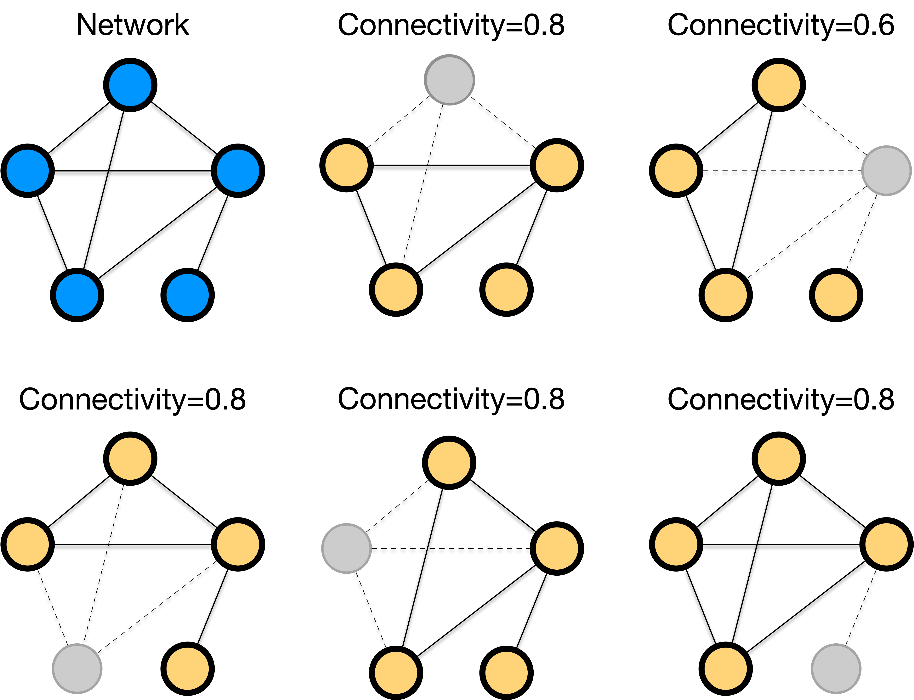
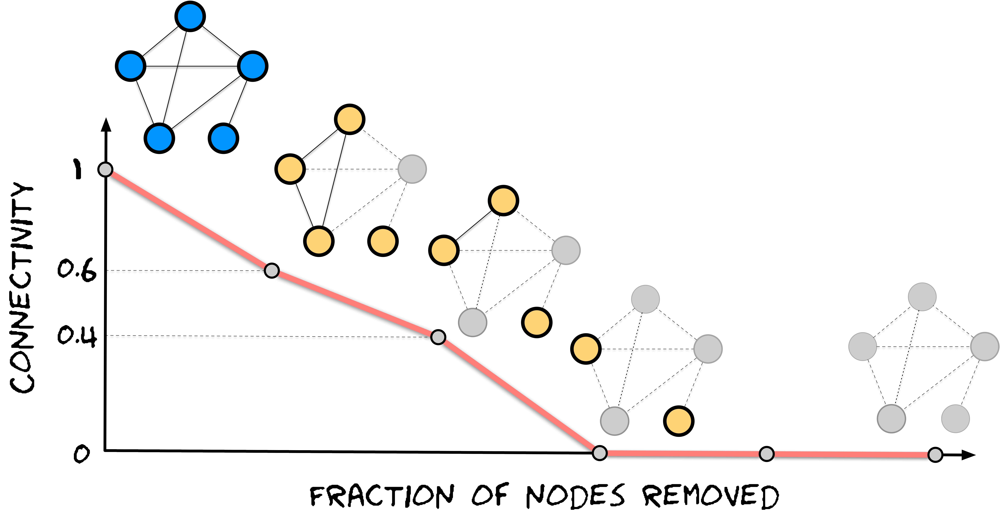

## What to learn in this module

In this module, we will explore network robustness through the lens of infrastructure design. Starting from the historical challenge of building cost-effective power grids, we will learn:

- How minimum spanning trees provide optimal cost-efficiency for network connectivity
- Why real-world networks have redundancies beyond minimum connectivity requirements
- How networks respond to random failures versus targeted attacks
- Quantitative measures of network robustness and percolation theory
- Design principles for balancing cost efficiency with resilience

**Keywords**: minimum spanning tree, Kruskal's algorithm, Prim's algorithm, network redundancy, random failures, targeted attacks, connectivity loss, R-index, percolation, robustness paradox

## Pen-and-Paper Exercise: From MST to Robust Grid Design

- ✍️ [Pen and Paper Exercise](./pen-and-paper/exercise.pdf): Starting with a minimum spanning tree for cost efficiency, design a power grid network that maintains connectivity even when key components fail.

## Network Design Challenges

[🚀 Interactive Demo](https://skojaku.github.io/adv-net-sci/assets/vis/network-robustness.html)

## Power Grid Design Challenge

In the aftermath of World War I, the newly formed Czechoslovakia faced massive reconstruction challenges. Cities and towns across [Moravia](https://en.wikipedia.org/wiki/Moravia) needed electricity, but the young nation had limited resources. Every resources spent on unnecessary infrastructure was a resource not available for hospitals, schools, or economic recovery. Engineers at the West Moravian Power Company faced a critical question: How do you connect every town and village to the electrical grid while using the minimum length of cable?

::: {.column-margin}
**Otakar Borůvka** (1899-1995) was a Czech mathematician who is best known for his work on the minimum spanning tree problem.

:::

The problem reached mathematician Otakar Borůvka through his friend at the power company. Borůvka's 1926 solution gave us the first systematic approach to what we now call **the minimum spanning tree problem**: finding the cheapest way to connect all locations in a network.

#### Minimum Spanning Tree

A **minimum spanning tree (MST)** of a weighted network is a tree that:

- **Spans** all nodes (connects every location in the network)
- Is a **tree** (connected with no cycles - no redundant loops)
- Has **minimum total weight** among all possible spanning trees

Otakar Borůvka delivered the first algorithm to solve this problem: **Borůvka's algorithm**. But it is not the only algorithm to find the minimum spanning tree.
In fact, there are several algorithms. We will cover two algorithms: **Kruskal's algorithm** and **Prim's algorithm**, which are easier to understand and implement.

### Finding the Minimum Spanning Tree

#### Kruskal's Algorithm

**Kruskal's algorithm** embodies a remarkably simple yet powerful intuition: always choose the cheapest available option, but never create wasteful loops. While sounds heuristic, this algorithm in fact leads to the global optimial solution!

The algorithm works by first sorting every possible connection from cheapest to most expensive like arranging all the cable segments by cost. Then, it examines each connection in order, asking a crucial question: "If I add this cable, will it create a redundant loop?" If the answer is no, the cable joins the growing network. If adding it would create a cycle---meaning the two locations are already connected through some other path---the algorithm skips it as wasteful. This process continues until every location is connected, guaranteeing both minimum cost and complete coverage.

#### Prim's Algorithm

**Prim's algorithm** takes a fundamentally different approach, embodying the intuition of organic growth from a single starting point. Picture an engineer beginning at the central power plant and asking: "What's the cheapest way to connect one more location to our existing grid?" This local growth strategy builds the network incrementally, always expanding from what's already been constructed.

The algorithm begins by selecting any location as its starting point, often the power plant in our analogy. From this initial seed, it repeatedly identifies the cheapest connection that would bring a new, unconnected location into the growing network. Unlike Kruskal's global view, Prim's algorithm maintains a clear distinction between locations already in the network and those still waiting to be connected. At each step, it finds the minimum-cost bridge between these two groups, gradually expanding the connected region until it encompasses every location.

This local expansion strategy mirrors how many real-world infrastructure projects actually develop. Engineers often start from existing facilities and expand outward, always seeking the most cost-effective way to serve additional areas. Prim's algorithm formalizes this natural growth process.

<!-- TODO(anim): Kruskal vs Prim step-through. Side-by-side view of the same
     7-node power-grid graph, with a step slider (0-6) that adds one MST edge
     per step: Kruskal in globally-sorted weight order, Prim growing outward
     from A. Edges already chosen are solid, candidates dashed; nodes already
     attached to the growing tree are highlighted. A toggle for "all weights
     unique" vs "some weights tied" shows that the two algorithms agree in the
     first case and may disagree in the second (see the note below). -->

::: {.callout-note}

Two algorithms find the same minimum spanning tree when all connection costs are different. If there are connections with the same cost, there are multiple minimum spanning trees of the same cost, and which tree to find depends on the algorithm. In particular, Prim's algorithm finds different trees when starting from different locations.

:::

## Why Minimum Spanning Tree is Not Enough

Minimum spanning tree is an efficient way to connect all locations in a network with the minimum total cost. However, such a network is vulnerable to failures, e.g., the network can be disconnected when a single node fails, in particular those close to the center of the network. This is why our power grid has a lot of redundancies beyond the minimum spanning tree, for the sake of resilience against failures.

::: {#fig-us-powe-grid}

{width=50%}

This is the power grid of the United States.

:::

### Measuring Network Damage

Not every failure is equal. Some failures are more damaging than others. For example, removing somee nodes in a grid network can be catastrophic, while removing other nodes can be more tolerable.

While there can be many metrics to quantify network damage, we will focus on a purely topological metric: the fraction of nodes remaining in the largest connected component after removal.

$$
\text{Connectivity} = \frac{\text{Size of largest component after removal}}{\text{Original network size}}
$$

{#fig-single-node-failure fig-alt="The impact of removing a single node varies based on which node is removed."}

The **robustness profile** plots connectivity against the fraction of nodes removed, revealing how networks fragment. Crucially, the shape of this profile depends entirely on the **order** in which nodes are removed - random removal creates one pattern, while strategic targeting creates dramatically different patterns.

{#fig-multiple-node-failure fig-alt="Robustness profile of a network for a sequential failure of nodes."}

To compare networks with a single metric, we use the **R-index** - the area under this curve:

$$
R = \frac{1}{N} \sum_{k=1}^{N-1} y_k
$$

The robustness index is a measure of how robust a network is to under a sequential failure of nodes. The higher the R-index, the more robust the network is.

Networks can exhibit different robustness profiles under different attack strategies. One form of an attack is a **random failure**, where nodes are removed randomly. Another form of an attack is a **targeted attack**, where nodes are removed strategically.

Random failures are like earthquakes or equipment malfunctions; they strike unpredictably. In power grids, generators might fail due to technical problems. In computer networks, servers might crash randomly.

Even if a network survives random failures beautifully, it might crumble under **targeted attacks**. Adversaries strategically choose which nodes to attack for maximum damage. The most intuitive strategy targets **high-degree nodes** (hubs) first, i.e., like targeting the busiest airports to disrupt air travel.

#### Fixed order or recomputed order?

There is a subtlety hiding in "attack the hubs first" that is easy to miss and matters a great deal in practice: *when* do you decide the order?

- **Fixed (simultaneous) attack.** Rank all nodes by degree once, on the original network, then delete them in that order.
- **Adaptive (sequential) attack.** Delete the current highest-degree node, then **recompute** every degree on what remains, then delete the new highest-degree node, and so on.

These differ because removing a hub changes its neighbors' degrees. A node that looked unimportant initially can become the most connected node left once the hubs around it are gone; a fixed ranking never notices. Adaptive attacks are consistently more destructive than fixed ones for the same number of removals, so an adaptive strategy gives the more honest estimate of worst-case fragility.

The same choice applies to any attack criterion, not just degree — you can attack by betweenness (Module 6) and recompute it after every removal. That is more damaging still, and far more expensive to compute, which is the usual trade-off: better targeting costs the attacker more information and more computation.

::: {.column-margin}
The asymmetry between random failures and targeted attacks is one of the most counterintuitive discoveries in network science. A network that seems robust can have hidden vulnerabilities that smart adversaries can exploit.
:::

## Theoretical Framework for Network Robustness

To understand these patterns mathematically, we can view network attacks as the **reverse process of percolation**. **Percolation theory** studies phase transitions in connectivity by asking: as we randomly add nodes to a grid, when does a giant connected component emerge? Network robustness asks the opposite: as we remove nodes, when does the giant component disappear?

::: {.column-margin}
Percolation theory originated in physics to understand how liquids flow through porous materials. The same mathematics explains how networks fragment under node removal - a beautiful example of how physics concepts illuminate network behavior.
:::

<!-- TODO(anim): Percolation grid dial. A 50x50 lattice where each cell is
     filled with probability p, driven by a p slider (0 to 1). Cells belonging
     to the largest connected component are drawn in the accent colour, all
     other filled cells in a muted tone, empty cells white. A readout reports
     the size of the largest component as a fraction of the grid, so the reader
     watches the giant component appear as p crosses p_c. -->

::: {.column-margin}
**Percolation vs. Robustness: Two Sides of the Same Coin**

Percolation theory asks: *"Starting from isolation, how many nodes must we connect to form a giant component?"* - increasing connectivity from $p = 0$ to $p = 1$.

Robustness analysis asks: *"Starting from full connectivity, how many nodes must we remove to fragment the network?"* - decreasing connectivity from $p = 1$ to $p = 0$.

These are mathematically equivalent processes, just viewed in opposite directions along the same connectivity parameter.
:::

### The Phase Transition

Imagine a grid where each square randomly becomes a "puddle" with probability $p$. As $p$ increases, something dramatic happens - suddenly, a giant puddle spanning the entire grid appears! This **phase transition** occurs at a critical probability $p_c$. Crucially, the exact timing doesn't matter; only the fraction of nodes present or removed determines connectivity.

<!-- TODO(anim): Phase-transition curve, sharing the p slider with the
     percolation grid above. Plots the fraction of the grid in the largest
     component against p, with a marker riding the curve at the current p and a
     dashed vertical line at the 2D-lattice critical point p_c = 0.593. Label
     the two sides "disconnected phase" and "connected phase". -->

### The Molloy-Reed Criterion

For networks with arbitrary degree distributions, the **Molloy-Reed criterion** determines whether a **giant component** exists - that is, whether the network contains a single large connected component that includes most of the nodes:

$$
\kappa = \frac{\langle k^2 \rangle}{\langle k \rangle} > 2
$$

where $\langle k \rangle$ is the average degree and $\langle k^2 \rangle$ is the average of squared degrees. The ratio $\kappa$ measures **degree heterogeneity** - networks with hubs have high $\kappa$, while degree homogeneous networks have low $\kappa$. When $\kappa > 2$, a giant component forms that dominates the network connectivity. See the Appendix for the proof of the Molloy-Reed criterion.

The Molloy-Reed criterion is a powerful tool to predict the existence of a giant component in a network and allows us to find the critical fraction of nodes that must be **removed** to break the network. This critial fraction depends on the strategy of the attack, along with the degree distribution. For simplicity, let us restrict ourselves into the random failures. For the random failure case, the critical fraction is given by:

$$
f_c = 1 - \frac{1}{\kappa - 1}
$$

The value of $\kappa$ depends on the degree distribution, and below, we showcase two examples of degree distributions.

#### Degree homogeneous network

In case of a degree homogeneous network like a random network considered in the exercise above, the critical fraction is given by:

$$
f_c = 1 - \frac{1}{\langle k \rangle}
$$

given that a Poisson degree distribution with mean $\langle k \rangle$ has $\langle k^2 \rangle = \langle k \rangle^2 + \langle k \rangle$, and thus $\kappa = \langle k \rangle + 1$, which makes $\kappa - 1 = \langle k \rangle$. This suggests that the threshold is determined by the average degree $\langle k \rangle$. A large $\langle k \rangle$ results in a larger $f_c$, meaning that the network is more robust against random failures.

#### Degree heterogeneous network

Most real-world networks are degree heterogeneous, i.e., the degree distribution $P(k) \sim k^{-\gamma}$ follows a power law (called *scale-free* network).
The power-law degree distribution has infinite second moment, i.e., $\langle k^2 \rangle = \infty$ and thus $f_c = 1.0$, which means that all nodes must be removed to break the network into disconnected components.
This is the case where the number of nodes is infinite (i.e., so that a node has a very large degree for the degree distribution to be a valid power law). When restricting the maximum degree to be finite, the critical fraction is given by:

$$
f_c =
\begin{cases}
1 - \dfrac{1}{\frac{\gamma-2}{3-\gamma} k_{\text{min}} ^{\gamma-2} k_{\text{max}}^{3-\gamma} -1} & \text{if } 2 < \gamma < 3 \\
1 - \dfrac{1}{\frac{\gamma-2}{\gamma-3} k_{\text{min}} - 1} & \text{if } \gamma > 3 \\
\end{cases}
$$

where $k_{\text{min}}$ and $k_{\text{max}}$ are the minimum and maximum degree, respectively.
The variable $\gamma$ is the exponent of the power law degree distribution, controlling the degree heterogeneity, where a lower $\gamma$ results in a more degree heterogeneous network.

- For regime $2 < \gamma < 3$, the critical threshold $f_c$ is determined by the extreme values of the degree distribution, $k_{\text{min}}$ and $k_{\text{max}}$.
And $f_c \rightarrow 1$ when the maximum degree $k_{\text{max}} \in [k_{\text{min}}, N-1]$ increases.
Notably, in this regime, the maximum degree $k_{\text{max}}$ increases as the network size $N$ increases, and this makes $f_c \rightarrow 1$.

- For regime $\gamma > 3$, the critical threshold $f_c$ is influenced by the minimum degree $k_{\text{min}}$. In contrast to $k_{\text{max}}$, $k_{\text{min}}$ remains constant as the network size $N$ grows. Consequently, the network disintegrates when a finite fraction of its nodes are removed.

<!-- TODO(anim): Critical fraction f_c against maximum degree k_max, for
     gamma = 2.1, 2.5, 2.9 with k_min = 1, using the piecewise formula above.
     The point to make visible: for 2 < gamma < 3 the curves climb towards
     f_c = 1 as k_max grows, so a larger heterogeneous network is harder and
     harder to break by random failure. -->

### Robustness Under Attack

While scale-free networks show remarkable robustness against random failures, they exhibit a fundamental vulnerability to targeted attacks that deliberately target high-degree nodes (hubs). This asymmetry reveals the "Achilles' heel" property of complex networks, where the same structural features that provide robustness against random failures create critical vulnerabilities to strategic attacks.

Rather than removing nodes randomly, an adversary with knowledge of the network structure can systematically remove the highest-degree nodes first, followed by the next highest-degree nodes, and so on. Under this targeted hub removal strategy, scale-free networks fragment rapidly and dramatically. The critical threshold for attacks, $f_c^{\text{attack}}$, is dramatically lower than for random failures. While random failures require $f_c^{\text{random}} \approx 1$ (nearly all nodes must be removed), targeted attacks need only $f_c^{\text{attack}} \ll 1$ (a small fraction of hubs) to fragment the network.

To understand how networks fragment under targeted attacks, we must consider two key effects that occur when the highest-degree nodes are systematically removed. First, the removal of hub nodes changes the maximum degree of the remaining network from $k_{\max}$ to a new lower value $k'_{\max}$. Second, since these removed hubs had many connections, their elimination also removes many links from the network, effectively changing the degree distribution of the surviving nodes.

The mathematical analysis of this process relies on mapping the attack problem back to the random failure framework through careful accounting of these structural changes. When we remove an $f$ fraction of the highest-degree nodes in a scale-free network, the new maximum degree becomes $k'_{\max} = k_{\min} f^{1/(1-\gamma)}$, where the power-law exponent $\gamma$ determines how rapidly the degree sequence declines.

For scale-free networks with degree exponent $\gamma$, the critical attack threshold $f_c$ satisfies:

$$
f_c^{\frac{2-\gamma}{1-\gamma}} = \frac{2 + 2^{-\gamma}}{3-\gamma} k_{\min} \left(f_c^{\frac{3-\gamma}{1-\gamma}} - 1\right)
$$

The fractional exponents $(2-\gamma)/(1-\gamma)$ and $(3-\gamma)/(1-\gamma)$ arise from the power-law degree distribution and determine how quickly the network fragments as hubs are removed. For networks with $\gamma < 3$ (highly heterogeneous degree distributions), these exponents are negative, leading to extremely small values of $f_c$, i.e., meaning just a tiny fraction of hub removal can destroy network connectivity.

This vulnerability has profound real-world implications across multiple domains. Power grids invest heavily in protecting major substations and transmission hubs because their failure could cascade throughout the system. Internet infrastructure includes hub redundancy and protection protocols to maintain connectivity when major routing nodes are compromised. Transportation networks maintain backup routes and alternative pathways when major airports or train stations fail. Even biological systems have evolved protective mechanisms for critical proteins that serve as hubs in cellular networks.

The robustness paradox demonstrates that no single network structure can be optimal against all types of failures. There's always a fundamental trade-off between efficiency, which naturally favors hub-based architectures for optimal resource distribution, and security, which requires redundancy and distributed connectivity to prevent catastrophic failures from targeted attacks.

## Design Principles for Robust Networks

How do we design networks that resist both random failures and targeted attacks? Key principles include:

1. **Balanced Degree Distribution**: Avoid both extreme homogeneity and extreme hub concentration
2. **Multiple Redundant Pathways**: Ensure removing any single node doesn't isolate large portions
3. **Strategic Hub Protection**: In hub-based networks, invest heavily in protecting critical nodes
4. **Hierarchical Design**: Combine local clusters with hub connections and redundant backbones
5. **Adaptive Responses**: Design systems that can reconfigure when attacks are detected

These strategies reflect lessons learned from our historical power grid challenge: moving beyond the minimum spanning tree to create networks that balance efficiency with resilience.

## References

1. **Borůvka, O.** (1926). O jistém problému minimálním [About a certain minimal problem]. *Práce Moravské Přírodovědecké Společnosti*, 3, 37-58. [Original work on minimum spanning trees]

2. **Molloy, M., & Reed, B.** (1995). A critical point for random graphs with a given degree sequence. *Random Structures & Algorithms*, 6(2-3), 161-180. [Molloy-Reed criterion]

3. **Albert, R., Jeong, H., & Barabási, A. L.** (2000). Error and attack tolerance of complex networks. *Nature*, 406(6794), 378-382. [Seminal paper on network robustness and the "Achilles' heel" property]

4. **Cohen, R., Erez, K., ben-Avraham, D., & Havlin, S.** (2000). Resilience of the Internet to random breakdowns. *Physical Review Letters*, 85(21), 4626-4629. [Mathematical framework for random failures]

5. **Cohen, R., Erez, K., ben-Avraham, D., & Havlin, S.** (2001). Breakdown of the Internet under intentional attack. *Physical Review Letters*, 86(16), 3682-3685. [Mathematical analysis of targeted attacks]

6. **Callaway, D. S., Newman, M. E., Strogatz, S. H., & Watts, D. J.** (2000). Network robustness and fragility: Percolation on random graphs. *Physical Review Letters*, 85(25), 5468-5471. [Percolation theory approach to network robustness]

7. **Cohen, R., & Havlin, S.** (2010). *Complex Networks: Structure, Robustness and Function*. Cambridge University Press. [Comprehensive treatment of network robustness theory]

8. **Newman, M. E. J.** (2018). *Networks*. Oxford University Press. [Modern textbook covering network robustness and percolation]