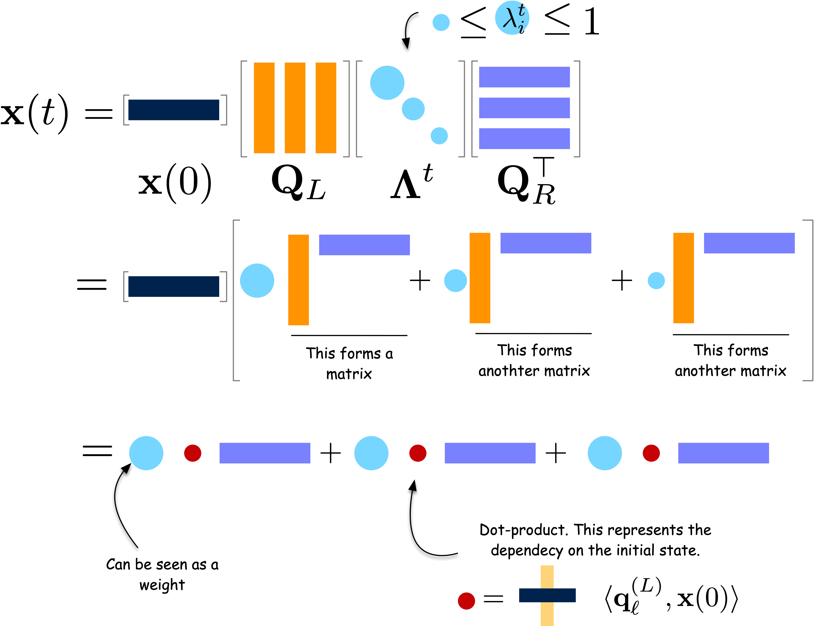

The main text claimed one thing without proof: the speed at which a random walk
forgets its starting point is governed by the second largest eigenvalue of the
transition matrix. This appendix earns that claim. It assumes you have met
eigenvalues and eigenvectors before; if you have not, the result in
[the concepts page](01-concepts.qmd) is all you need to use random walks in
practice.

## The Obstacle: The Transition Matrix Is Not Symmetric

The short-term behavior of a random walk is

$$
x(t) = x(0)\,\mathbf{P}^t ,
$$

so everything hinges on computing a high power of a matrix. That is easy when a
matrix splits as $\mathbf{Q}\mathbf{\Lambda}\mathbf{Q}^{-1}$, because then the
power falls onto the diagonal alone:
$\mathbf{Q}\mathbf{\Lambda}^t\mathbf{Q}^{-1}$.

The obstacle is that $\mathbf{P} = \mathbf{D}^{-1}\mathbf{A}$ is **not
symmetric** — dividing each row by a different degree destroys the symmetry of
$\mathbf{A}$ — so we cannot simply reach for the eigendecomposition of a
symmetric matrix, which is the one case that is guaranteed to behave well.

::: {.column-margin}

::: {#fig-diagonalizable}

A diagonalizable matrix, drawn: the same linear map seen in a basis where it is
nothing but a list of stretch factors.

:::

Any symmetric real matrix is diagonalizable with an *orthogonal* $\mathbf{Q}$
(that is, $\mathbf{Q}\mathbf{Q}^\top = \mathbf{I}$). A general matrix may be
diagonalizable, but its $\mathbf{Q}$ need not be orthogonal — which is exactly
the property the argument below needs.
:::

## The Trick: Move Half a Degree to Each Side

The way around it is to move the degrees around until what remains *is*
symmetric. Split $\mathbf{D}^{-1}$ into two halves and put one on each side:

$$
\mathbf{P} = \mathbf{D}^{-1}\mathbf{A}
= \mathbf{D}^{-\frac{1}{2}} \underbrace{\left( \mathbf{D}^{-\frac{1}{2}} \mathbf{A} \mathbf{D}^{-\frac{1}{2}} \right)}_{\overline{\mathbf{A}}} \mathbf{D}^{\frac{1}{2}}
$$

that is,

$$
\mathbf{P} = \mathbf{D}^{-\frac{1}{2}} \overline{\mathbf{A}} \mathbf{D}^{\frac{1}{2}} .
$$

The two ingredients are:

- **Diagonal degree matrix $\mathbf{D}$**: the diagonal matrix whose entries are the node degrees,

$$
\mathbf{D} = \begin{pmatrix}
k_1 & 0 & \cdots & 0 \\
0 & k_2 & \cdots & 0 \\
\vdots & \vdots & \ddots & \vdots \\
0 & 0 & \cdots & k_N
\end{pmatrix}
$$

- **Normalized adjacency matrix $\overline{\mathbf{A}}$**: each entry of $\mathbf{A}$ divided by the square roots of the two degrees at its ends,

$$
\overline{\mathbf{A}} = \mathbf{D}^{-\frac{1}{2}} \mathbf{A} \mathbf{D}^{-\frac{1}{2}},
\qquad
\overline{A}_{ij} = \frac{A_{ij}}{\sqrt{k_i k_j}} .
$$

Because $\mathbf{A}$ is symmetric for an undirected network and the same factor
is applied on both sides, $\overline{\mathbf{A}}$ is symmetric too. That is the
whole point of the manoeuvre, and it is the algebraic face of the reversibility
we established in the main text: a walk that looks the same played backwards has
a transition matrix that is a symmetric matrix in disguise.

## Diagonalizing the Disguise

Being symmetric, $\overline{\mathbf{A}}$ has an orthogonal eigendecomposition

$$
\overline{\mathbf{A}} = \mathbf{Q} \mathbf{\Lambda} \mathbf{Q}^\top,
\qquad \mathbf{Q}\mathbf{Q}^\top = \mathbf{I},
$$

with $\mathbf{\Lambda}$ diagonal and real. Substituting into the previous
identity gives

$$
\mathbf{P} = \mathbf{Q}_L \mathbf{\Lambda} \mathbf{Q}_R^\top,
\qquad
\mathbf{Q}_L = \mathbf{D}^{-\frac{1}{2}} \mathbf{Q},
\quad
\mathbf{Q}_R = \mathbf{D}^{\frac{1}{2}} \mathbf{Q} .
$$

So $\mathbf{P}$ has the same eigenvalues as $\overline{\mathbf{A}}$; only the
eigenvectors are reweighted by degree. And $\mathbf{Q}_L$, $\mathbf{Q}_R$ are
built so that

$$
\mathbf{Q}_R^\top \mathbf{Q}_L
= \mathbf{Q}^\top \mathbf{D}^{\frac{1}{2}} \mathbf{D}^{-\frac{1}{2}} \mathbf{Q}
= \mathbf{Q}^\top \mathbf{Q} = \mathbf{I},
$$

which is what makes powers collapse. For $t = 2$,

$$
\begin{aligned}
\mathbf{P}^2 & = \mathbf{Q}_L \mathbf{\Lambda} \underbrace{\mathbf{Q}_R^\top \mathbf{Q}_L}_{= \mathbf{I}} \mathbf{\Lambda} \mathbf{Q}_R^\top \\
& = \mathbf{Q}_L \mathbf{\Lambda}^2 \mathbf{Q}_R^\top ,
\end{aligned}
$$

and by induction, for every $t$,

$$
\mathbf{P}^t = \mathbf{Q}_L \mathbf{\Lambda}^t \mathbf{Q}_R^\top .
$$

::: {#fig-diagonalizable-sum}

The short-term behavior of a random walk, drawn as a sum. Writing
$x(t) = x(0)\mathbf{P}^t$ with the decomposition above, $x(t)$ is a sum of the
rows of $\mathbf{Q}_R^\top$, each scaled by $\lambda_\ell^t$ and by the overlap
between the initial distribution $x(0)$ and the matching column of
$\mathbf{Q}_L$. Because $\lambda_\ell^t$ shrinks fastest for the smallest
$|\lambda_\ell|$, what survives after a few steps is the term with the largest
non-unit eigenvalue, $\lambda_2$.

:::

## Reading the Decomposition One Mode at a Time

Write $q_L^{(\ell)}$ for the $\ell$-th column of $\mathbf{Q}_L$ and
$q_R^{(\ell)}$ for the $\ell$-th column of $\mathbf{Q}_R$. Then

$$
x(t) = x(0)\,\mathbf{P}^t
= \sum_{\ell=1}^{N} \lambda_\ell^{\,t}\, \left( x(0)\cdot q_L^{(\ell)} \right) \left( q_R^{(\ell)} \right)^\top .
$$

The walk is a sum of $N$ **modes**. Each mode is a fixed pattern
$q_R^{(\ell)}$ over the nodes, present in the initial condition with weight
$x(0)\cdot q_L^{(\ell)}$, and multiplied by $\lambda_\ell$ at every step.

**The first mode is the stationary distribution.** Order the eigenvalues
$1 = \lambda_1 > \lambda_2 \geq \cdots \geq \lambda_N > -1$. Check that
$\mathbf{D}^{1/2}\mathbf{1}$ is an eigenvector of $\overline{\mathbf{A}}$ with
eigenvalue 1:

$$
\overline{\mathbf{A}}\, \mathbf{D}^{\frac{1}{2}}\mathbf{1}
= \mathbf{D}^{-\frac{1}{2}} \mathbf{A} \mathbf{1}
= \mathbf{D}^{-\frac{1}{2}} \mathbf{k}
= \mathbf{D}^{\frac{1}{2}}\mathbf{1},
$$

using $\mathbf{A}\mathbf{1} = \mathbf{k}$, the vector of degrees. Normalising it
to unit length gives $q^{(1)} = \mathbf{D}^{1/2}\mathbf{1}/\sqrt{2m}$, since
$\|\mathbf{D}^{1/2}\mathbf{1}\|^2 = \sum_i k_i = 2m$. Therefore

$$
q_L^{(1)} = \mathbf{D}^{-\frac{1}{2}} q^{(1)} = \frac{\mathbf{1}}{\sqrt{2m}},
\qquad
q_R^{(1)} = \mathbf{D}^{\frac{1}{2}} q^{(1)} = \frac{\mathbf{k}}{\sqrt{2m}} .
$$

The first mode's weight is $x(0)\cdot q_L^{(1)} = \frac{1}{\sqrt{2m}}\sum_i x_i(0) = \frac{1}{\sqrt{2m}}$
for *any* starting distribution, because probabilities sum to 1. So the $\ell=1$
term of the sum is

$$
1^{\,t}\cdot \frac{1}{\sqrt{2m}} \cdot \frac{\mathbf{k}^\top}{\sqrt{2m}}
= \frac{\mathbf{k}^\top}{2m}
= \boldsymbol{\pi} ,
$$

which is the $\pi_i = k_i/2m$ of the main text, recovered spectrally, and it
does not depend on $x(0)$ at all.

**Everything else decays.** For $\ell \geq 2$ we have $|\lambda_\ell| < 1$, so
$\lambda_\ell^{\,t} \to 0$. Hence

$$
x(t) - \boldsymbol{\pi} = \sum_{\ell \geq 2} \lambda_\ell^{\,t}\, \left( x(0)\cdot q_L^{(\ell)} \right)\left( q_R^{(\ell)} \right)^\top,
$$

and for large $t$ the sum is dominated by the slowest-decaying term, the one
with the largest $|\lambda_\ell|$ among $\ell \geq 2$. The error therefore
behaves like $\lambda_2^{\,t} = e^{-t/\tau}$ with

$$
\tau = \frac{1}{-\log \lambda_2} \approx \frac{1}{1-\lambda_2}
\quad \text{for } \lambda_2 \text{ close to } 1 .
$$

This is the relaxation time of the main text, and it is why the spectral gap
$1 - \lambda_2$ is *the* number to look at.

## From Decay Rate to Mixing Time

Mixing time was defined with the $\ell_1$ distance,

$$
t_{\text{mix}} = \min\left\{t : \max_{x(0)} \|x(t) - \boldsymbol{\pi}\|_{1} \leq \epsilon\right\},
\qquad
\|x(t) - \boldsymbol{\pi}\|_1 = \sum_i |x_i(t) - \pi_i| .
$$

Converting the mode-by-mode decay above into a bound on this sum costs one
Cauchy–Schwarz step and one factor accounting for the smallest stationary
probability. For a reversible walk the standard result is

$$
t_{\text{mix}} < \frac{1}{1-\lambda_\star} \log\left( \frac{1}{\epsilon\, \min_i \pi_i} \right),
\qquad
\lambda_\star = \max\left(|\lambda_2|,\ |\lambda_N|\right) .
$$

Two things to notice. First, the relevant quantity is the largest eigenvalue in
*magnitude* other than 1: a walk can be slow because $\lambda_2$ is near $+1$
(a bottleneck) or because $\lambda_N$ is near $-1$ (near-periodicity, as in a
nearly bipartite network). A lazy walk, which stays put with probability
$1/2$, kills the second failure mode outright. Second, $\tau = 1/(1-\lambda_2)$
by itself is a time *scale*, not a bound: the logarithm says how many multiples
of $\tau$ you need, and it grows as you demand a tighter $\epsilon$ or as the
rarest node becomes rarer.

::: {.column-margin}
The **normalized Laplacian** is $\overline{\mathbf{L}} = \mathbf{I} - \overline{\mathbf{A}}$,
so its eigenvalues are exactly $1 - \lambda_\ell$ and its second smallest is the
spectral gap $\mu = 1 - \lambda_2$. Everything above can therefore be rewritten
in Laplacian language without changing a single number.
:::

## Worked Numbers

Two ten-node networks, so the arithmetic is checkable by hand or in three lines
of numpy.

| Network | $\lambda_2$ | gap $1-\lambda_2$ | $\tau$ |
|---|---|---|---|
| Two 5-cliques joined by one edge | $0.927$ | $0.073$ | $\approx 14$ |
| One 10-clique | $-1/9 \approx -0.111$ | $1.111$ | $\approx 0.9$ |

Same node count, same walk rule. The single bottleneck edge multiplies the
relaxation time by about fifteen. Removing the bottleneck — merging the cliques
— makes the walk mix in essentially one step, because from any node in a clique
every other node is one step away.

For the complete graph $K_N$ the eigenvalues can be written down exactly:
$\mathbf{P} = (\mathbf{J} - \mathbf{I})/(N-1)$, whose eigenvalues are 1 (once)
and $-1/(N-1)$ ($N-1$ times). For $N = 10$ that is $-1/9$, matching the table.
