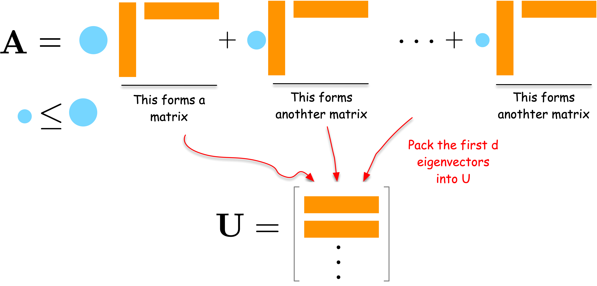
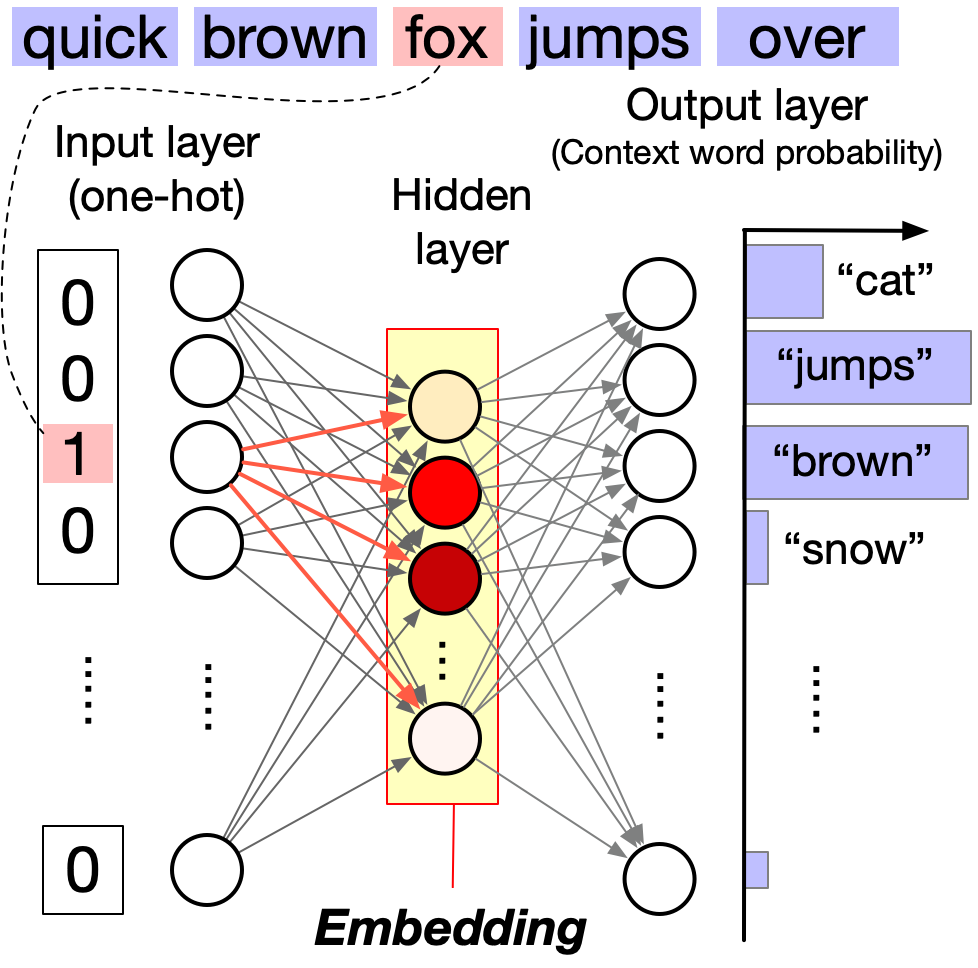

> **The big question of this module.** How do you turn a network into coordinates
> without throwing away what makes it a network?

## Why would you give a node coordinates?

::: {#fig-karate-to-map}

{width=100% fig-align="center"}

The same 34 people, twice. On the left, Zachary's karate club as a wiring diagram: the only thing you can say about a person is who they are joined to. On the right, the same club after embedding: every person now carries two numbers, and the two factions separate on their own.
:::

Right now the only description you have of a node is its row of the adjacency matrix. For the karate club that is 34 numbers per person, most of them zero. That is what people mean when they call a network *high-dimensional data*: each node is described by as many numbers as there are nodes, nearly all of them zero, and the numbers are not quantities you can compare — entry 7 answers "is person 7 your friend", not "how much".

Every tool you already know wants the opposite. $k$-means, logistic regression, a scatter plot: all of them want a short list of numbers per item, where being close in those numbers means being similar. **Network embedding** builds exactly that — a map sending each node to a point in $\mathbb{R}^d$ with $d \ll N$ (two if you want a picture, 64 or 128 in practice), chosen so that nodes sitting in similar positions in the network land near each other.

Once the map exists, everything downstream is ordinary machine learning: cluster the points, classify them, or find pairs of points that are suspiciously close and call those your predicted links.

## Spectral embedding

### Compression: from $N$ numbers per node down to $d$

Let us approach spectral embedding from the perspective of network compression.
Suppose we have an adjacency matrix $\mathbf{A}$ of a network.
The adjacency matrix is high-dimensional data, i.e., a matrix of size $N \times N$ for a network of $N$ nodes.
We want to compress it into a lower-dimensional matrix $\mathbf{U}$ of size $N \times d$ for a user-defined small integer $d < N$.
A good $\mathbf{U}$ should preserve the network structure and thus can reconstruct the original data $\mathbf{A}$ as closely as possible.

Before any algebra, watch that trade happen on twenty people. Throw the table
away, keep two numbers per person, then try to rebuild the network from those
numbers alone — and at the end, choose $d$ yourself.

```{=html}
<style>
/* --------------------------------------------------------------------------
   Lossy compression — only the rules this one stage needs. Paper, pen, panels,
   buttons, knob and motion all come from assets/anim.css; the sequencer from
   assets/anim.js. Colours are the kit's resolved tokens, never literals.
   -------------------------------------------------------------------------- */

/* The drawing is one wide canvas (network + matrix on the left, the plane on
   the right) so a node can physically fly from one to the other. The kit caps
   .anim-svg at 310px, which is right for a square figure and far too narrow
   for this one. */
#emb-lossy { --anim-svg-max: 100%; }
#emb-lossy [data-emb-side] { max-width: 27rem; margin: 0.5rem auto 0; }

/* Flight time, set per scene: a long arc when the nodes leave the network,
   a short one when the reader is dragging the dial. */
#emb-lossy .emb-dot {
  transition: transform var(--emb-t, 0.34s) cubic-bezier(0.4, 0.05, 0.5, 1);
}

/* 42 edges on 20 nodes goes to mush at the kit's 2.2 stroke. */
#emb-lossy .emb-thin { stroke-width: 1.7; }

/* The two kinds of error, one colour: an edge the reconstruction dropped
   (dashed, because it is a hole) and one it made up (solid, because it is
   there in the copy and not in the original). */
#emb-lossy .emb-lost { stroke: var(--_amber); stroke-dasharray: 3.5 3; }
#emb-lossy .emb-new  { stroke: var(--_amber); stroke-width: 1.7; fill: none; }

/* The reconstruction drawn on the plane itself — thin and quiet, because the
   points are the subject and these are only the inference from them. */
#emb-lossy .emb-rec {
  stroke: var(--_ink); stroke-width: 1.4; stroke-opacity: 0.5; fill: none;
}

/* One cell of the adjacency matrix. 400 of them; the outline is what makes
   "400 numbers" a thing you can see rather than a thing you are told. */
#emb-lossy .emb-cell { fill: none; stroke: var(--_rule); stroke-width: 0.4; }
#emb-lossy .emb-cell-on  { fill: var(--_ink); stroke: var(--_ink); }
#emb-lossy .emb-cell-bad { fill: var(--_amber); stroke: var(--_amber); }

#emb-lossy .emb-frame {
  fill: none; stroke: var(--_ink); stroke-width: 1.8; stroke-dasharray: 6 4;
}
#emb-lossy .emb-mid { text-anchor: middle; }
</style>

<figure class="anim-stage" id="emb-lossy">
  <div class="anim-bar">
    <div class="anim-step" data-anim-step></div>
    <div class="anim-dots" data-anim-dots></div>
    <button class="anim-btn" type="button" data-anim-prev aria-label="Previous step">◀</button>
    <button class="anim-btn" type="button" data-anim-play>⏸ Pause</button>
    <button class="anim-btn" type="button" data-anim-next aria-label="Next step">▶</button>
    <button class="anim-btn" type="button" data-anim-replay>↻ Replay</button>
  </div>

  <div data-anim-canvas>
    <div data-anim-clear data-emb-plot></div>
    <div data-anim-clear data-emb-side></div>
  </div>

  <figcaption class="anim-note" data-anim-note></figcaption>
</figure>

<script>
/* Lossy compression, drawn. Markup above, scenes below, nothing in between:
   everything a scene calls arrives on `ctx`, from assets/anim.js. The kit is
   loaded after this file, hence the animReady queue. */
(window.animReady = window.animReady || []).push(function () {

  /* ---------------------------------------------------------------- data ---
     Every number here was computed once, offline, and pasted in. Nothing in
     this file runs a graph algorithm, an eigensolver or a layout.

     THE NETWORK. 20 nodes drawn from a planted-partition model with three
     groups of 7, 7 and 6, edge probability 0.6 inside a group and 0.03
     between; connected, minimum degree 2, 42 edges. NODE is a spring layout
     computed inside each group and then set on a triangle, so the three
     groups are visible in the wiring diagram too.

     THE EMBEDDING. Adjacency spectral embedding exactly as defined above:
     U = [sqrt(l1) u1, ..., sqrt(ld) ud] over the d largest signed eigenvalues
     of A, which here are 4.818, 3.597, 3.308, 1.266, 0.811, 0.730, 0.666,
     0.480 — all positive, so the square roots are all real.

     THE RECONSTRUCTION. Score every one of the 190 node pairs by (U U^T)_ij
     and keep the 42 highest — the same number of edges the network has, so
     lost and invented always come out equal. RECON[d-1] is that list. NCORR
     counts how many of the 42 are real:

        d      1    2    3    4    5    6    7    8
        kept  19   31   31   32   34   35   36   37
        lost  23   11   11   10    8    7    6    5

     THE PICTURE. The plane always shows the first two coordinates, so PLANE
     is the same for every d >= 2 — adding a dimension changes the
     reconstruction, not the view. At d = 1 there is no second coordinate at
     all and every point sits on the axis, at AXIS_Y.
     ------------------------------------------------------------------------ */
  const NODE = [[124.7,105.3],[142.0,133.7],[118.5,128.1],[137.0,110.0],[100.1,108.7],[114.2,115.6],[117.8,91.2],[30.6,56.9],[44.6,68.4],[28.9,83.9],[70.1,83.9],[58.7,69.7],[48.8,87.0],[54.8,99.4],[130.9,23.0],[90.2,30.7],[110.9,28.2],[110.7,16.1],[94.8,54.3],[117.7,41.3]];
  const EDGE = [[0,2],[0,3],[0,5],[0,6],[0,8],[1,2],[1,3],[2,4],[2,5],[3,5],[3,6],[3,7],[3,12],[4,5],[4,6],[7,8],[7,9],[7,11],[8,9],[8,10],[8,11],[8,12],[8,17],[9,12],[9,13],[10,11],[10,12],[10,13],[11,12],[11,13],[12,13],[13,16],[14,16],[14,17],[14,19],[15,16],[15,17],[15,18],[16,17],[16,19],[17,19],[18,19]];
  const COMM = [0,0,0,0,0,0,0,1,1,1,1,1,1,1,2,2,2,2,2,2];
  const PLANE = [[315.0,246.6],[260.3,196.8],[271.4,237.5],[330.8,244.9],[259.5,219.9],[283.5,248.0],[275.2,221.2],[340.7,162.4],[398.8,133.6],[348.4,133.5],[355.3,124.2],[374.1,128.8],[392.6,145.1],[357.2,96.1],[266.0,40.2],[261.2,56.3],[292.8,12.0],[299.9,20.2],[245.2,86.2],[268.4,28.3]];
  const ORIGIN = [231.3, 141.1];   /* where both coordinates are zero        */
  const NCORR = [19,31,31,32,34,35,36,37];
  const RECON = [
    [[0,7],[0,8],[0,9],[0,10],[0,11],[0,12],[0,13],[3,7],[3,8],[3,9],[3,10],[3,11],[3,12],[3,13],[5,8],[7,8],[7,9],[7,10],[7,11],[7,12],[7,13],[8,9],[8,10],[8,11],[8,12],[8,13],[8,16],[8,17],[9,10],[9,11],[9,12],[9,13],[10,11],[10,12],[10,13],[11,12],[11,13],[11,16],[11,17],[12,13],[12,16],[12,17]],
    [[0,2],[0,3],[0,5],[0,8],[0,12],[2,3],[3,5],[3,6],[3,7],[3,8],[3,11],[3,12],[7,8],[7,9],[7,10],[7,11],[7,12],[7,13],[8,9],[8,10],[8,11],[8,12],[8,13],[9,10],[9,11],[9,12],[9,13],[10,11],[10,12],[10,13],[11,12],[11,13],[12,13],[13,16],[13,17],[14,16],[14,17],[14,19],[15,16],[16,17],[16,19],[17,19]],
    [[0,2],[0,3],[0,4],[0,5],[0,6],[2,3],[2,4],[2,5],[2,6],[3,4],[3,5],[3,6],[4,5],[5,6],[7,8],[7,11],[7,12],[8,9],[8,10],[8,11],[8,12],[8,13],[9,10],[9,11],[9,12],[9,13],[10,11],[10,12],[10,13],[11,12],[11,13],[12,13],[14,15],[14,16],[14,17],[14,19],[15,16],[15,17],[15,19],[16,17],[16,19],[17,19]],
    [[0,2],[0,3],[0,4],[0,5],[0,6],[2,3],[2,4],[2,5],[3,5],[3,6],[3,7],[3,8],[4,5],[5,6],[7,8],[7,9],[7,11],[7,12],[8,9],[8,10],[8,11],[8,12],[8,13],[9,10],[9,11],[9,12],[10,11],[10,12],[10,13],[11,12],[11,13],[12,13],[14,15],[14,16],[14,17],[14,19],[15,16],[15,17],[15,19],[16,17],[16,19],[17,19]],
    [[0,2],[0,3],[0,4],[0,5],[0,6],[1,3],[2,4],[2,5],[2,6],[3,5],[3,6],[3,7],[4,5],[5,6],[7,8],[7,9],[7,11],[7,12],[8,9],[8,10],[8,11],[8,12],[9,10],[9,11],[9,12],[9,13],[10,11],[10,12],[10,13],[11,12],[11,13],[12,13],[14,15],[14,16],[14,17],[14,19],[15,16],[15,17],[15,19],[16,17],[16,19],[17,19]],
    [[0,2],[0,3],[0,4],[0,5],[0,6],[1,3],[2,4],[2,5],[2,6],[3,5],[3,6],[3,7],[4,5],[5,6],[7,8],[7,9],[7,11],[7,12],[8,9],[8,10],[8,11],[8,12],[9,10],[9,11],[9,12],[9,13],[10,11],[10,12],[10,13],[11,12],[11,13],[12,13],[14,16],[14,17],[14,19],[15,16],[15,17],[15,18],[15,19],[16,17],[16,19],[17,19]],
    [[0,2],[0,3],[0,4],[0,5],[0,6],[1,2],[1,3],[2,4],[2,5],[3,5],[3,6],[3,7],[4,5],[5,6],[7,8],[7,9],[7,11],[7,12],[8,9],[8,10],[8,11],[8,12],[9,10],[9,11],[9,12],[9,13],[10,11],[10,12],[10,13],[11,12],[11,13],[12,13],[14,16],[14,17],[14,19],[15,16],[15,17],[15,18],[15,19],[16,17],[16,19],[17,19]],
    [[0,2],[0,3],[0,4],[0,5],[0,6],[0,8],[1,2],[1,3],[2,4],[2,5],[3,5],[3,6],[3,7],[4,5],[5,6],[7,8],[7,9],[7,11],[7,12],[8,9],[8,10],[8,11],[8,12],[9,11],[9,12],[9,13],[10,11],[10,12],[10,13],[11,12],[11,13],[12,13],[14,16],[14,17],[14,19],[15,16],[15,17],[15,18],[15,19],[16,17],[16,19],[17,19]]
  ];

  const AXIS_Y = ORIGIN[1];      /* the second coordinate reads zero here */
  const DMAX = 8;
  const N = NODE.length;         /* 20  */
  const M = EDGE.length;         /* 42  */
  const CELLS = N * N;           /* 400 — every number on screen is derived   */
  const KEEP = 2;                /* where autoplay and a skipped read park    */

  const key = (a, b) => (a < b ? a + "," + b : b + "," + a);
  const ADJ = [];
  for (let i = 0; i < N; i++) ADJ.push(new Array(N).fill(0));
  EDGE.forEach((e) => { ADJ[e[0]][e[1]] = 1; ADJ[e[1]][e[0]] = 1; });
  const RSET = RECON.map((r) => new Set(r.map((p) => key(p[0], p[1]))));

  /* d = 1 keeps only the first coordinate, so the second is zero for
     everyone: the same x, all on the axis. */
  const LINE = PLANE.map((p) => [p[0], AXIS_Y]);
  const at = (d) => (d === 1 ? LINE : PLANE);

  const store = (d) => N * d;      /* how many numbers the embedding costs */

  /* the small "edges recovered against d" chart in scene 4 */
  const cx = (d) => 30 + ((d - 1) / (DMAX - 1)) * 184;
  const cy = (f) => 80 - f * 62;
  const curve = NCORR.map((n, i) => cx(i + 1) + "," + cy(n / M)).join(" ");

  /* --------------------------------------------------------------- scenes */
  const scenes = [
    {
      label: "Twenty people, four hundred numbers",
      note: "Twenty people and forty-two friendships. The only description any one of them has is a row of the table: twenty numbers each, four hundred in all, and almost every one of them a zero.",
      async run(ctx) {
        ctx.build();
        const c = ctx.card("what you are given");
        [["people", String(N)],
         ["friendships", String(M)],
         ["numbers in the table", String(CELLS)]].forEach((row, i) => {
          const t = ctx.el("div", "anim-tally anim-fade",
            "<span>" + row[0] + "</span><b>" + row[1] + "</b>");
          t.style.animationDelay = ctx.fast() ? "0s" : (3.2 + i * 0.4) + "s";
          c.appendChild(t);
        });
        const last = ctx.el("div", "anim-caption anim-fade",
          "one row per person, one column per person — and the plane on the right is still empty");
        last.style.animationDelay = ctx.fast() ? "0s" : "4.5s";
        c.appendChild(last);
        await ctx.sleep(5400);
      }
    },
    {
      label: "Two numbers each",
      note: "Now give every person two numbers and let them go stand on the plane. Four hundred numbers became forty — and the three groups arrived intact, without ever being told about each other.",
      async run(ctx) {
        const c = ctx.card("keep two numbers each");
        ctx.hideHint();
        await ctx.sleep(400);

        /* Group by group, so you can watch a blob leave the network and
           arrive as a blob: that is the whole claim of the scene. */
        for (let g = 0; g < 3; g++) {
          ctx.fly(2, g);
          await ctx.sleep(1000);
        }
        await ctx.sleep(300);

        [["points", String(N)],
         ["numbers each", "2"],
         ["numbers in all", CELLS + " → " + store(2)]].forEach((row, i) => {
          const t = ctx.el("div", "anim-tally anim-fade",
            "<span>" + row[0] + "</span><b>" + row[1] + "</b>");
          t.style.animationDelay = ctx.fast() ? "0s" : (i * 0.45) + "s";
          c.appendChild(t);
        });
        const q = ctx.el("div", "anim-quote anim-fade", "ten times smaller");
        q.style.animationDelay = ctx.fast() ? "0s" : "1.5s";
        c.appendChild(q);
        await ctx.sleep(2600);
      }
    },
    {
      label: "Rebuild it from the points",
      note: "Rebuild the network from the forty numbers alone: score every pair by U Uᵀ and keep the forty-two best. Thirty-one friendships come back. Eleven are lost and eleven invented, and the amber marks show exactly which.",
      async run(ctx) {
        const c = ctx.card("rebuild it from the points alone");
        c.appendChild(ctx.el("div", "anim-caption",
          "U Uᵀ scores every pair of points; keep its " + M +
          " largest entries and call those the friendships"));
        await ctx.sleep(500);

        ctx.setD(2, true);            /* draw the reconstruction on the plane */
        await ctx.sleep(1500);
        ctx.overlay(2);               /* fold it back onto the original       */
        await ctx.sleep(900);

        const gone = M - NCORR[1];
        [["friendships back", NCORR[1] + " of " + M],
         ["lost", String(gone)],
         ["invented", String(gone)]].forEach((row, i) => {
          const t = ctx.el("div", "anim-tally anim-fade",
            "<span>" + row[0] + "</span><b>" + row[1] + "</b>");
          t.style.animationDelay = ctx.fast() ? "0s" : (i * 0.45) + "s";
          c.appendChild(t);
        });
        const q = ctx.el("div", "anim-quote anim-fade",
          "compression is lossy — and you can see what was lost");
        q.style.animationDelay = ctx.fast() ? "0s" : "1.5s";
        c.appendChild(q);
        await ctx.sleep(3000);
      }
    },
    {
      label: "Now you choose d",
      note: "Now you choose d. One number each and the three groups smear onto a line. Two, and they separate — twelve friendships come back at once. After that every extra dimension costs twenty more numbers and buys about one more edge.",
      async run(ctx) {
        const c = ctx.card("how many numbers is enough?");

        const track = ctx.el("div", "anim-track");
        const knob = ctx.el("div", "anim-knob");
        track.appendChild(knob);
        c.appendChild(track);

        const read = ctx.el("div", "anim-readout",
          '<span>d = <b data-d>2</b></span>' +
          '<span style="color:var(--_accent)">stored <b data-s>40</b> of ' + CELLS + '</span>' +
          '<span style="color:var(--_amber)">edges back <b data-r>31</b> of ' + M + '</span>');
        c.appendChild(read);

        const svg = ctx.svgRoot("0 0 232 98");
        svg.innerHTML =
          '<line class="anim-axis" x1="30" y1="80" x2="222" y2="80"/>' +
          '<line class="anim-axis" x1="30" y1="14" x2="30" y2="80"/>' +
          '<polyline class="anim-accent-stroke" points="' + curve + '"/>' +
          '<line class="anim-marker" data-mark x1="30" y1="12" x2="30" y2="83"/>' +
          '<text class="anim-label" x="12" y="22">' + M + '</text>' +
          '<text class="anim-label" x="16" y="84">0</text>' +
          '<text class="anim-label" x="26" y="95">d = 1</text>' +
          '<text class="anim-label" x="196" y="95">d = 8</text>' +
          '<text class="anim-label anim-accent-fill" x="86" y="46">edges recovered</text>';
        c.appendChild(svg);
        /* Honest label: the plane can only ever show two numbers, so past
           d = 2 it is the reconstruction that changes, not the picture. */
        c.appendChild(ctx.el("div", "anim-caption",
          "the plane always draws the first two coordinates, so past d = 2 the " +
          "points stop moving and only the rebuilt network changes"));

        const verdict = ctx.el("div", "anim-tally anim-fade");
        verdict.style.visibility = "hidden";
        c.appendChild(verdict);

        const outD = read.querySelector("[data-d]");
        const outS = read.querySelector("[data-s]");
        const outR = read.querySelector("[data-r]");
        const mark = svg.querySelector("[data-mark]");

        /* One knob, and a real one: pointer, touch and arrow keys all land in
           onInput, and grabbing it pauses the sequence so the dial is yours. */
        const dial = ctx.mountKnob(knob, {
          min: 1, max: DMAX, step: 1, value: KEEP,
          label: "Number of dimensions d",
          format: (d) => "d = " + d,
          onGrab: () => ctx.pause(),
          onInput: (d) => {
            outD.textContent = String(d);
            outS.textContent = String(store(d));
            outR.textContent = String(NCORR[d - 1]);
            mark.setAttribute("x1", cx(d));
            mark.setAttribute("x2", cx(d));
            ctx.setD(d);
            ctx.overlay(d);
          }
        });

        const say = (t) => { verdict.innerHTML = t; verdict.style.visibility = "visible"; };

        /* Skipping, or reading with motion turned off: land on the knee,
           because the knee is what this figure is about. */
        if (ctx.fast()) {
          ctx.quick();
          dial.set(KEEP);
          say("<span>two numbers each</span><b>and the groups are already there</b>");
          return;
        }

        ctx.quick();
        dial.set(1);
        await ctx.sleep(1600);
        say("<span>one number each</span><b>everyone on one line</b>");
        await ctx.sleep(2200);

        dial.set(2);
        await ctx.sleep(1400);
        say("<span>+1 number each</span><b>+" + (NCORR[1] - NCORR[0]) + " friendships back</b>");
        await ctx.sleep(2600);

        for (let d = 3; d <= DMAX; d++) { dial.set(d); await ctx.sleep(520); }
        say("<span>+6 dimensions, +" + (store(DMAX) - store(2)) + " numbers</span><b>+" +
            (NCORR[DMAX - 1] - NCORR[1]) + " friendships</b>");
        await ctx.sleep(3200);
      }
    }
  ];

  mountScenes(document.getElementById("emb-lossy"), scenes, {
    stepsLabel: "Compression steps",

    /* One canvas holds the network, its matrix and the plane, so a node can
       physically travel between them. Built once in scene 1; scenes 2 to 4
       only ever mutate it. */
    helpers(ctx) {
      const plot = ctx.$("[data-emb-plot]");
      const side = ctx.$("[data-emb-side]");
      const S = {};
      const CELL = 4.6, MX = 49, MY = 160;

      function build() {
        plot.textContent = "";
        const svg = ctx.svgRoot("0 0 452 272", "emb-canvas");
        const g = () => svg.appendChild(ctx.svgEl("g"));
        const gFrame = g(), gNet = g(), gNew = g(), gSock = g(),
              gMat = g(), gRec = g(), gDot = g(), gLab = g();
        const slow = !ctx.fast();

        /* the plane: a dashed sheet with the two axes crossing at ORIGIN */
        gFrame.appendChild(ctx.svgEl("rect", {
          x: 196, y: 6, width: 252, height: 248, rx: 10, "class": "emb-frame"
        }));
        gFrame.appendChild(ctx.svgEl("line", {
          x1: ORIGIN[0], y1: 12, x2: ORIGIN[0], y2: 248,
          "class": "anim-axis anim-faint"
        }));
        gFrame.appendChild(ctx.svgEl("line", {
          x1: 202, y1: ORIGIN[1], x2: 442, y2: ORIGIN[1],
          "class": "anim-axis anim-faint"
        }));

        S.net = EDGE.map((e, i) => {
          const ln = ctx.svgEl("line", {
            x1: NODE[e[0]][0], y1: NODE[e[0]][1],
            x2: NODE[e[1]][0], y2: NODE[e[1]][1],
            "class": "anim-edge emb-thin" + (slow ? " anim-draw" : "")
          });
          if (slow) {
            ln.style.setProperty("--dash",
              Math.ceil(Math.hypot(NODE[e[0]][0] - NODE[e[1]][0],
                                   NODE[e[0]][1] - NODE[e[1]][1])) + 2);
            ln.style.animationDelay = (0.4 + i * 0.03) + "s";
          }
          return gNet.appendChild(ln);
        });

        /* the sockets stay behind when the nodes leave */
        NODE.forEach((p) => gSock.appendChild(ctx.svgEl("circle", {
          cx: p[0], cy: p[1], r: 4.8, "class": "anim-node-off"
        })));

        /* 400 cells, faded in one by one: the count is the point */
        S.cells = [];
        for (let i = 0; i < N; i++) {
          for (let j = 0; j < N; j++) {
            const r = ctx.svgEl("rect", {
              x: MX + j * CELL, y: MY + i * CELL, width: CELL, height: CELL,
              "class": "emb-cell" + (slow ? " anim-fade" : "")
            });
            if (slow) r.style.animationDelay = (1.7 + (i * N + j) * 0.0035) + "s";
            S.cells.push(gMat.appendChild(r));
          }
        }

        /* Each node is a circle in its own <g>, so the group carries the
           journey and the circle keeps its geometry. */
        S.dots = NODE.map((p, i) => {
          const gg = ctx.svgEl("g", { "class": "emb-dot" });
          gg.appendChild(ctx.svgEl("circle", { r: 4.8, "class": "anim-node" }));
          gg.style.transform = "translate(" + p[0] + "px," + p[1] + "px)";
          if (slow) {
            gg.classList.add("anim-fade");
            gg.style.animationDelay = (i * 0.05) + "s";
          }
          return gDot.appendChild(gg);
        });

        const lab = (x, y, t, cls) => {
          const e = ctx.svgEl("text", { x: x, y: y, "class": "anim-label" + (cls ? " " + cls : "") });
          e.textContent = t;
          return gLab.appendChild(e);
        };
        /* Short on purpose: anything longer runs under the plane's frame. */
        lab(MX, MY + N * CELL + 12,
          "A: " + N + " × " + N + " = " + CELLS + " numbers");
        S.hint = lab(322, 122, "an empty plane", "emb-mid anim-faint");

        S.gNew = gNew;
        S.gRec = gRec;
        S.svg = svg;
        plot.appendChild(svg);
        setMat(0);
        flight("0.85s");
      }

      const flight = (t) => S.svg.style.setProperty("--emb-t", t);
      const quick = () => flight("0.3s");
      const hideHint = () => { S.hint.setAttribute("class", "anim-label emb-mid anim-faint anim-fade-out"); };

      /* Send group g (or every node, when g is undefined) to its place in the
         d-dimensional picture. */
      function fly(d, g) {
        const P = at(d);
        S.dots.forEach((dot, i) => {
          if (g != null && COMM[i] !== g) return;
          dot.classList.remove("anim-fade");
          dot.style.transform = "translate(" + P[i][0] + "px," + P[i][1] + "px)";
        });
      }

      /* The reconstruction, drawn on the plane: the 42 pairs the embedding
         scores highest, joined. Pure lookup — RECON[d-1] was computed
         offline. A pair the network does not actually have is drawn amber
         here too, which is what explains the long lines across the gaps. */
      function setD(d, draw) {
        fly(d);
        const P = at(d);
        S.gRec.textContent = "";
        RECON[d - 1].forEach((pr, i) => {
          const ln = ctx.svgEl("line", {
            x1: P[pr[0]][0], y1: P[pr[0]][1], x2: P[pr[1]][0], y2: P[pr[1]][1],
            "class": ADJ[pr[0]][pr[1]] ? "emb-rec" : "emb-new"
          });
          if (draw && !ctx.fast()) {
            ln.classList.add("anim-draw");
            ln.style.setProperty("--dash",
              Math.ceil(Math.hypot(P[pr[0]][0] - P[pr[1]][0],
                                   P[pr[0]][1] - P[pr[1]][1])) + 2);
            ln.style.animationDelay = (i * 0.028) + "s";
          }
          S.gRec.appendChild(ln);
        });
      }

      /* Fold the reconstruction back onto the original: a friendship the copy
         kept stays in ink, one it dropped goes amber and dashed, one it made
         up is drawn in amber. The matrix says the same thing cell by cell. */
      function overlay(d) {
        const R = RSET[d - 1];
        S.net.forEach((ln, e) => {
          ln.classList.toggle("emb-lost", !R.has(key(EDGE[e][0], EDGE[e][1])));
        });
        S.gNew.textContent = "";
        RECON[d - 1].forEach((pr) => {
          if (ADJ[pr[0]][pr[1]]) return;
          S.gNew.appendChild(ctx.svgEl("line", {
            x1: NODE[pr[0]][0], y1: NODE[pr[0]][1],
            x2: NODE[pr[1]][0], y2: NODE[pr[1]][1], "class": "emb-new"
          }));
        });
        setMat(d);
      }

      /* d = 0 means "just A". Otherwise a cell is ink where both agree there
         is an edge, amber wherever they disagree, blank where both say no.
         classList, not setAttribute: scene 1 fades the 400 cells in one by
         one and a whole-attribute write would strip .anim-fade off them. */
      function setMat(d) {
        const R = d ? RSET[d - 1] : null;
        for (let i = 0; i < N; i++) {
          for (let j = 0; j < N; j++) {
            const a = ADJ[i][j];
            const r = R ? (i !== j && R.has(key(i, j)) ? 1 : 0) : a;
            const c = S.cells[i * N + j];
            c.classList.toggle("emb-cell-on", !!(a && r));
            c.classList.toggle("emb-cell-bad", a !== r);
          }
        }
      }

      function card(title) {
        side.textContent = "";
        const c = ctx.el("div", "anim-panel anim-pop");
        if (title) c.appendChild(ctx.el("div", "anim-caption", title));
        side.appendChild(c);
        return c;
      }

      /* S is filled by build(), i.e. after helpers() has already run, so
         everything reaching into it has to be a function — the kit copies
         these onto ctx by value at mount time. */
      return { build, fly, setD, overlay, card, quick, hideHint };
    }
  });
});
</script>
```

Nothing there was free. Eleven friendships did not survive the round trip, and
eleven that never existed were invented in their place. That is the general
situation: compression is lossy, and the only question is how much you lose per
number you keep. Writing that question down is the optimization problem:

$$
\min_{\mathbf{U}} J(\mathbf{U}),\quad J(\mathbf{U}) = \| \mathbf{A} - \mathbf{U}\mathbf{U}^\top \|_F^2
$$

where:

1. $\mathbf{U}\mathbf{U}^\top$ is an $N \times N$ matrix built back out of the $d$ coordinates — the *reconstructed* network. Its $(i,j)$ entry is the dot product $u_i^\top u_j$ of the two nodes' coordinate vectors, so "reconstruction" literally means: two nodes are predicted to be connected when their coordinates point the same way.
2. $\|\cdot\|_F$ is the Frobenius norm: the square root of the sum of the squares of all entries of a matrix. Squaring it, as above, gives the plain sum of squared entries — so $J(\mathbf{U})$ adds up one squared error per node pair.
3. $J(\mathbf{U})$ is the loss function that measures the difference between the original network $\mathbf{A}$ and the reconstructed network $\mathbf{U}\mathbf{U}^\top$.

By minimizing $J$ with respect to $\mathbf{U}$, we obtain the best low-dimensional embedding of the network.

### What an eigenvector is

The solution is written in eigenvectors, so here is the one-paragraph version.

Take the smallest possible network: two nodes joined by one edge, with adjacency matrix

$$
\mathbf{A} = \begin{bmatrix} 0 & 1 \\ 1 & 0 \end{bmatrix}
$$

Multiplying a vector by this matrix swaps its two entries, so $(3, 5)$ becomes $(5, 3)$ — a different direction. Two vectors survive the swap. $(1, 1)$ comes back as $(1, 1)$, unchanged. $(1, -1)$ comes back as $(-1, 1)$: the same line, flipped.

A vector that a matrix only stretches or flips, never turns, is an **eigenvector** of that matrix, and the stretch factor is its **eigenvalue** $\lambda$, defined by $\mathbf{A}\mathbf{u} = \lambda \mathbf{u}$. Here $\mathbf{u}_1 = (1,1)/\sqrt{2}$ with $\lambda_1 = 1$, and $\mathbf{u}_2 = (1,-1)/\sqrt{2}$ with $\lambda_2 = -1$. Eigenvectors are conventionally rescaled to length 1, so an eigenvector carries only a direction; the size lives in $\lambda$.

::: {.column-margin}
Everything here relies on $\mathbf{A}$ being symmetric ($A_{ij} = A_{ji}$), which is true for an undirected network. A symmetric $N \times N$ matrix has exactly $N$ eigenvectors, they are mutually perpendicular, and every eigenvalue is a real number. A directed network gives no such guarantee — which is why spectral embedding is a story about undirected networks.
:::

### The network as a stack of layers: keep the heavy ones

Those $N$ eigenvectors let you take the network apart:

$$
\mathbf{A} = \sum_{i=1}^N \lambda_i \mathbf{u}_i \mathbf{u}_i^\top
$$

Each term $\lambda_i \mathbf{u}_i \mathbf{u}_i^\top$ is an *outer product* — an $N \times N$ matrix built from a single vector, so it has rank one — and $|\lambda_i|$ says how much of $\mathbf{A}$ that one layer accounts for. The network is a stack of $N$ transparencies: a few carry the picture and the rest are nearly blank.

Check it on the two-node network. The two layers are

$$
\mathbf{u}_1 \mathbf{u}_1^\top = \begin{bmatrix} 0.5 & 0.5 \\ 0.5 & 0.5 \end{bmatrix},
\qquad
\mathbf{u}_2 \mathbf{u}_2^\top = \begin{bmatrix} 0.5 & -0.5 \\ -0.5 & 0.5 \end{bmatrix}
$$

and $1 \times$ the first plus $(-1) \times$ the second returns $\begin{bmatrix} 0 & 1 \\ 1 & 0\end{bmatrix}$ exactly, which is $\mathbf{A}$.

To compress, keep only the $d$ heaviest layers. The embedding that does this is

$$
\mathbf{U} = \left[\, \sqrt{\lambda_1}\,\mathbf{u}_1,\ \sqrt{\lambda_2}\,\mathbf{u}_2,\ \ldots,\ \sqrt{\lambda_d}\,\mathbf{u}_d \,\right]
$$

because then $\mathbf{U}\mathbf{U}^\top = \sum_{i=1}^d \lambda_i \mathbf{u}_i \mathbf{u}_i^\top$, which is exactly the truncated stack. The $\sqrt{\lambda_i}$ is not decoration: eigenvectors all have length 1, so without it the first dimension and the fiftieth would be given equal weight even though the first explains a hundred times more of the network.

Take the $d$ *largest* eigenvalues, and largest means signed, not largest in absolute value: $\mathbf{U}\mathbf{U}^\top$ can only ever add a layer with a positive sign, so a large negative $\lambda$ is of no use to it.

{width=90% fig-align="center"}

The derivation — take the derivative of $J$, set it to zero, and see which $\mathbf{U}$ satisfies it — is in the [appendix](./04-appendix.qmd).

### Modularity embedding

In a similar vein, we can use the modularity matrix to generate a low-dimensional embedding of the network.
Let us define the modularity matrix $\mathbf{Q}$ as follows:

$$
Q_{ij} = \frac{1}{2m}A_{ij} - \frac{k_i k_j}{4m^2}
$$

where $k_i$ is the degree of node $i$, and $m$ is the number of edges in the network.

We then compute the eigenvectors of $\mathbf{Q}$ and use them to embed the network into a low-dimensional space just as we did for the adjacency matrix. The modularity embedding can be used to bipartition the network into two communities using a simple algorithm: group nodes by the sign of the **leading** eigenvector — the one with the largest eigenvalue [@newman2006modularity]. Positive entries form one community, negative entries the other.

### Laplacian eigenmap

Laplacian Eigenmap [@belkin2003laplacian] is another approach to compress a network into a low-dimensional space. The fundamental idea behind this method is to position connected nodes close to each other in the low-dimensional space. This approach leads to the following optimization problem:

$$
\min_{\mathbf{U}} J_{LE}(\mathbf{U}),\quad J_{LE}(\mathbf{U}) = \frac{1}{2}\sum_{i,j} A_{ij} \| u_i - u_j \|^2
$$

Read it as a physical system: every edge is a spring pulling its two endpoints together, and we are looking for the resting position.

A few lines of algebra (in the [appendix](./04-appendix.qmd)) rewrite this as $J_{LE}(\mathbf{U}) = \text{Tr}(\mathbf{U}^\top \mathbf{L} \mathbf{U})$, where $\mathbf{L}$ is the graph Laplacian matrix:

$$
L_{ij} = \begin{cases}
k_i & \text{if } i = j \\
-A_{ij} & \text{if } i \neq j
\end{cases}
$$

As written, though, the springs win outright: put every node at the origin and the objective is zero. To rule that answer out we require the $d$ coordinate columns to be orthonormal, $\mathbf{U}^\top \mathbf{U} = \mathbf{I}$ — the embedding must actually spread the nodes out and must actually use all $d$ of its dimensions. Minimizing under that constraint (via a Lagrange multiplier, which is where the $\lambda$ comes from) turns the problem into an eigenvalue problem:

$$
\mathbf{L}\mathbf{u} = \lambda \mathbf{u}
$$

**Solution**: the $d$ eigenvectors associated with the $d$ smallest **nonzero** eigenvalues of $\mathbf{L}$. The very smallest eigenvalue is always $0$, and its eigenvector is the all-ones vector, which places every node at the same point — the collapsed answer we just excluded, so it is discarded.

### The normalized Laplacian

The Laplacian $\mathbf{L} = \mathbf{D} - \mathbf{A}$ has a bias: its entries scale with degree, so hubs dominate the objective $\sum_{ij} A_{ij}\|u_i - u_j\|^2$ simply by having many terms. A hub is pulled toward the average of a hundred neighbors while a leaf is pulled by one, and the embedding ends up describing the hubs.

The standard remedy is the **symmetric normalized Laplacian**:

$$
\mathbf{L}_{\text{sym}} = \mathbf{D}^{-\frac{1}{2}} \mathbf{L} \mathbf{D}^{-\frac{1}{2}} = \mathbf{I} - \mathbf{D}^{-\frac{1}{2}} \mathbf{A} \mathbf{D}^{-\frac{1}{2}}
$$

Dividing by $\sqrt{k_i k_j}$ discounts each edge by the degrees at its ends, so a connection to a hub counts for less than a connection to a leaf. A useful side effect is that the eigenvalues of $\mathbf{L}_{\text{sym}}$ always lie in $[0, 2]$ regardless of the network, which makes them comparable across networks and, in Module 9, makes it possible to design filters on them.

::: {.column-margin}
There is a third variant, the random-walk Laplacian $\mathbf{L}_{\text{rw}} = \mathbf{D}^{-1}\mathbf{L} = \mathbf{I} - \mathbf{P}$, where $\mathbf{P}$ is the transition matrix from Module 7. Its eigenvectors are those of $\mathbf{L}_{\text{sym}}$ rescaled by $\mathbf{D}^{-1/2}$, so the three Laplacians are three views of the same object — which is why spectral embedding, spectral clustering and random walks keep turning out to be the same theory.
:::

### The Fiedler vector splits a network in two

Both Laplacians have smallest eigenvalue $\lambda_1 = 0$, with the constant vector as its eigenvector — the trivial solution we discard. The interesting one is the **second** smallest.

$\lambda_2$ is called the **algebraic connectivity** of the network, and its eigenvector is the **Fiedler vector**. Two facts make them important:

- $\lambda_2 = 0$ exactly when the network is disconnected. More generally, the multiplicity of the eigenvalue 0 equals the number of connected components.
- When $\lambda_2$ is small but nonzero, the network is *nearly* disconnected — there is a bottleneck. The Fiedler vector tells you where: nodes on one side of the bottleneck get positive entries, nodes on the other side negative ones.

So the simplest possible spectral algorithm is: compute the Fiedler vector, split nodes by sign, done. That is a bipartition of the network into two well-separated groups.

::: {.column-margin}
$\lambda_2$ also fixes the mixing time of a random walk (Module 7): a small $\lambda_2$ means a bottleneck, a bottleneck means slow mixing, and slow mixing means the walker gets trapped in communities. The same number governs geometry, dynamics and clustering.
:::

### Spectral clustering is normalized cut, relaxed

Generalizing beyond two groups gives **spectral clustering**, one of the most used clustering algorithms anywhere:

1. Compute the $d$ eigenvectors of $\mathbf{L}_{\text{sym}}$ with the smallest nonzero eigenvalues.
2. Give each node the $d$-dimensional coordinate formed by its entries in those eigenvectors.
3. Run $k$-means on those coordinates.

Step 3 is ordinary clustering in Euclidean space — which is the whole point of embedding. The hard part, turning the graph into geometry, was done in steps 1 and 2.

This also closes a loop back to Module 5. The normalized cut objective there was NP-hard as stated. If you relax it — allow the community indicator vector to take continuous values instead of just $\{0,1\}$ — the resulting optimization is exactly the Laplacian eigenproblem above. **Spectral clustering is the relaxation of normalized cut**, and the eigenvectors are the relaxed solution that $k$-means then rounds back into discrete groups.

## A detour through language: word2vec

The most widely used *graph* embedding methods are not graph methods at all. They are word2vec — a model built for text — fed with random walks instead of sentences. So we detour through language first. Once word2vec is understood, the graph part takes three lines.

word2vec is a neural network model that learns word embeddings in a continuous vector space. It was introduced by Tomas Mikolov and his colleagues at Google in 2013 [@mikolov2013distributed].

### How word2vec works

word2vec learns word meanings from context, following a slogan coined by the linguist J. R. Firth in 1957: *"You shall know a word by the company it keeps."*

::: {.column-margin}
Firth was echoing a much older proverb — a person is known by the company they keep — which goes back to Aesop's fable *The Ass and his Purchaser*. A man takes an ass on trial; it immediately seeks out the laziest, greediest ass in the herd; the man returns it, having learned everything he needed from the company it chose.
:::

**The Core Idea**: Given a target word, predict its surrounding context words within a fixed window. For example, in:

> The quick brown fox jumps over a lazy dog

The context of *fox* (with window size 2) includes: *quick*, *brown*, *jumps*, *over*.

::: {.column-margin}
The window size determines how far we look around the target word. A window size of 2 means we consider 2 words before and 2 words after.
:::

**Why This Works**: Words appearing in similar contexts get similar embeddings. Consider:

- "The quick brown **fox** jumps over the fence"
- "The quick brown **dog** runs over the fence"
- "The **student** studies in the library"

Both *fox* and *dog* appear with words like "quick," "brown," and "jumps/runs," so they'll have similar embeddings. But *student* appears in completely different contexts (like "studies," "library"), so its embedding will be far from *fox* and *dog*. This is how word2vec captures semantic similarity without explicit supervision.

**Two Training Approaches**:

- **Skip-gram**: Given a target word → predict context words (we'll use this)
- **CBOW**: Given context words → predict target word

**Network Architecture**: word2vec uses a simple 3-layer neural network:

{width="70%" fig-align="center"}

- **Input layer** ($N$ neurons): One-hot encoding of the target word
- **Hidden layer** ($d$ neurons, $d \ll N$): The learned word embedding
- **Output layer** ($N$ neurons): Probability distribution over context words (via softmax)

The hidden layer activations become the word embeddings—dense, low-dimensional vectors that capture semantic relationships.

One detail matters later: **each word gets two vectors, not one.** The input side stores an *in* vector $\mathbf{u}_w$, used when $w$ is the target; the output side stores an *out* vector $\mathbf{v}_w$, used when the same $w$ is somebody else's context. Training pushes $\mathbf{u}_{\text{target}}$ and $\mathbf{v}_{\text{context}}$ toward each other. Implementations normally discard the out vectors at the end and hand you $\mathbf{u}$.

::: {.column-margin}
For a visual walkthrough of word2vec, see [The Illustrated Word2vec](https://jalammar.github.io/illustrated-word2vec/) by Jay Alammar.
:::

### The bill for the softmax, and two ways to dodge it

To predict context word $w_c$ given target word $w_t$, we compute:

$$
P(w_c | w_t) = \frac{\exp(\mathbf{v}_{w_c}^\top \mathbf{u}_{w_t})}{\sum_{w \in V} \exp(\mathbf{v}_{w}^\top \mathbf{u}_{w_t})}
$$

This is the softmax function: it turns dot products into probabilities that sum to 1.

#### Every training step sums over the whole vocabulary

Look at the denominator. It runs over $V$, the entire vocabulary — 100,000 words is typical. That sum has to be recomputed for *every* target-context pair in the corpus, and a corpus has billions of pairs. Training as written is not slow; it is impossible.

#### Hierarchical softmax and negative sampling

**Hierarchical Softmax**: Organizes vocabulary as a binary tree with words at leaves. Computing a probability becomes walking one root-to-leaf path, which reduces the cost from $O(|V|)$ to $O(\log |V|)$ — for 100,000 words, from 100,000 terms to about 17.

**Negative Sampling**: Instead of normalizing over all words, sample a handful of "negative" (non-context) words and train the model only to tell the true context apart from those. Five to twenty negatives per pair is enough in practice.

Three numbers carry that whole argument — 100,000 terms, 17 tree steps, and 6
words (five negatives plus the true one) — and they are worth seeing rather than
being told. Below, all three are drawn on the same ruler. Then you set the
vocabulary size yourself and watch which of the bills grows with it.

```{=html}
<style>
/* --------------------------------------------------------------------------
   The softmax bill — only the rules this one stage needs. Paper, panels,
   buttons, knob and motion all come from assets/anim.css; the sequencer from
   assets/anim.js. Colours are the kit's resolved tokens, never literals.
   -------------------------------------------------------------------------- */

/* A three-row bar chart with an axis and its labels needs the whole column;
   the kit's 310px default is sized for a dozen-node diagram. */
#soft-bill { --anim-svg-max: 100%; }
#soft-bill [data-sb-side] { max-width: 27rem; margin: 0.6rem auto 0; }

/* One colour per bill, and only two colours in the box: the bill you cannot
   pay is amber, the trick that replaces it is the accent, and the third is
   plain ink because a constant does not need a colour of its own. */
#soft-bill .sb-full { fill: var(--_amber); }
#soft-bill .sb-tree { fill: var(--_accent); }
#soft-bill .sb-neg  { fill: var(--_ink-soft); }
#soft-bill .sb-tip-full { stroke: var(--_amber); }
#soft-bill .sb-tip-tree { stroke: var(--_accent); }
#soft-bill .sb-tip-neg  { stroke: var(--_ink-soft); }
/* The tip is what saves the two short bars from being nothing at all: under
   the linear ruler they are a twentieth of a pixel wide, and a hairline at
   the very start of the axis is the honest picture of that. */
#soft-bill .sb-tip { stroke-width: 1.3; }
#soft-bill .sb-slot { fill: none; stroke: var(--_rule); stroke-width: 1; }

#soft-bill .sb-row { font-family: var(--_hand); font-size: 10.5px; fill: var(--_ink-soft); text-anchor: end; }
#soft-bill .sb-val { font-family: var(--_hand); font-size: 12.5px; font-weight: 700; fill: var(--_ink); }
#soft-bill .sb-big { font-family: var(--_hand); font-size: 34px; font-weight: 700; fill: var(--_ink); text-anchor: middle; }
#soft-bill .sb-tick { stroke: var(--_ink-faint); stroke-width: 1; }
#soft-bill .sb-num { font-family: var(--_hand); font-size: 9px; fill: var(--_ink-soft); text-anchor: middle; }

/* The seventeen questions, and the six words of the sampled version. */
#soft-bill .sb-q { stroke: var(--_accent); stroke-width: 2; stroke-linecap: round; }
#soft-bill .sb-q-off { stroke: var(--_ink-faint); stroke-width: 1.4; stroke-linecap: round; }
#soft-bill .sb-box { fill: var(--_white); stroke: var(--_ink); stroke-width: 1.5; }
#soft-bill .sb-box-true { fill: var(--_accent); stroke: var(--_ink); }
#soft-bill .sb-box-neg  { fill: var(--_amber-soft); stroke: var(--_amber); }
#soft-bill .sb-word { font-family: var(--_hand); font-size: 10px; fill: var(--_ink); text-anchor: middle; }
#soft-bill .sb-word-true { fill: var(--_white); font-weight: 700; }
#soft-bill .sb-word-neg  { fill: var(--_amber); }
</style>

<figure class="anim-stage" id="soft-bill">
  <div class="anim-bar">
    <div class="anim-step" data-anim-step></div>
    <div class="anim-dots" data-anim-dots></div>
    <button class="anim-btn" type="button" data-anim-prev aria-label="Previous step">&#9664;</button>
    <button class="anim-btn" type="button" data-anim-play>&#9208; Pause</button>
    <button class="anim-btn" type="button" data-anim-next aria-label="Next step">&#9654;</button>
    <button class="anim-btn" type="button" data-anim-replay>&#8635; Replay</button>
  </div>

  <div data-anim-canvas>
    <div data-anim-clear data-sb-plot></div>
    <div data-anim-clear data-sb-side></div>
  </div>

  <figcaption class="anim-note" data-anim-note></figcaption>
</figure>

<script>
/* Three bills on one ruler. Markup above, scenes below, nothing in between:
   everything a scene calls arrives on `ctx`, from assets/anim.js. The kit is
   loaded after this file, hence the animReady queue. */
(window.animReady = window.animReady || []).push(function () {

  /* ---------------------------------------------------------------- data ---
     There is no dataset here. Every number is arithmetic you can redo on a
     phone, and the recipe is written beside it.

     V_STEPS  thirteen vocabulary sizes, 1-2-5 spaced from a thousand to ten
              million — the detents of the dial in the last scene.
     TREE     the depth of a balanced binary tree with that many leaves, i.e.
              the number of yes/no questions that pin one word down:
                  [math.ceil(math.log2(v)) for v in V_STEPS]
              Check the one the prose quotes: 2^16 = 65,536 is short of
              100,000 and 2^17 = 131,072 clears it, so 17 questions.
     NEG      5 sampled negatives + the true context word = 6, at every
              vocabulary size. Its being constant is the whole point of it,
              so it is a number and not a table.
     HALVE    100,000 halved seventeen times, rounding up:
                  v = 100000; [v := -(-v // 2) for _ in range(17)]
              The last entry is 1, which is what "17 questions is enough"
              means. Eighteen entries: the start plus seventeen halvings.
     ------------------------------------------------------------------------ */
  const V_STEPS = [1000, 2000, 5000, 10000, 20000, 50000, 100000, 200000, 500000, 1000000, 2000000, 5000000, 10000000];
  const TREE    = [10, 11, 13, 14, 15, 16, 17, 18, 19, 20, 21, 23, 24];
  const HALVE   = [100000, 50000, 25000, 12500, 6250, 3125, 1563, 782, 391, 196, 98, 49, 25, 13, 7, 4, 2, 1];
  const NEG     = 6;
  const PARK    = 6;                 /* V = 100,000, the size the prose quotes */
  const VBASE   = V_STEPS[PARK];
  const QN      = HALVE.length - 1;  /* 17 */

  /* Five words nobody would ever find beside "quick brown ___". That is the
     entire training signal of negative sampling: tell the real one from
     these. */
  const TRUE_W = "brown";
  const NEG_W  = ["kettle", "Tuesday", "orbit", "salmon", "wrench"];

  /* geometry: bars run from X0 to X0 + W, three rows, then the axis */
  const X0 = 100, W = 256;
  const ROW = [112, 148, 184], BH = 18;
  const AXIS_Y = 224;
  const DEC = 7;                     /* the log ruler spans 1 to 10^7 */

  const comma = (n) => String(Math.round(n)).replace(/\B(?=(\d{3})+(?!\d))/g, ",");

  /* One ruling parameter for the whole chart. t = 0 is the ordinary ruler
     (position proportional to the count); t = 1 is the log ruler (position
     proportional to how many times you multiplied by ten). Scene 4 slides
     t from one to the other, which is the only thing that changes. */
  function len(v, t) {
    if (!(v > 0)) return 0;
    const lin = Math.min(v / VBASE, 1);
    const lg = Math.min(Math.log(v) / Math.LN10 / DEC, 1);
    return ((1 - t) * lin + t * lg) * W;
  }

  /* --------------------------------------------------------------- scenes */
  const scenes = [
    {
      label: "The bill",
      note: "The denominator of the softmax runs over every word in the vocabulary. One hundred thousand exponentials, for one target word and one context word — and a corpus holds billions of such pairs.",
      async run(ctx) {
        ctx.build();
        const c = ctx.card("what one training pair costs");
        const big = ctx.big("0");
        ctx.sub("terms in the denominator, for ONE target-context pair");

        if (!ctx.fast()) {
          for (let i = 1; i <= 50; i++) {
            const v = (VBASE * i) / 50;
            big.textContent = comma(v);
            ctx.set("full", v);
            await ctx.sleep(34);
          }
        }
        big.textContent = comma(VBASE);
        ctx.set("full", VBASE);

        [["vocabulary", comma(VBASE)],
         ["terms, per pair", comma(VBASE)],
         ["pairs in a billion-word corpus", "~10 billion"],
         ["exponentials, one pass", "a thousand trillion"]].forEach((row, i) => {
          const t = ctx.el("div", "anim-tally anim-fade",
            "<span>" + row[0] + "</span><b>" + row[1] + "</b>");
          t.style.animationDelay = ctx.fast() ? "0s" : (i * 0.4) + "s";
          c.appendChild(t);
        });
        const q = ctx.el("div", "anim-quote anim-fade",
          "Training as written is not slow. It is impossible.");
        q.style.animationDelay = ctx.fast() ? "0s" : "1.9s";
        c.appendChild(q);
        await ctx.sleep(3200);
      }
    },
    {
      label: "Seventeen questions",
      note: "Hierarchical softmax plays twenty questions instead. Is the word in this half of the vocabulary, or that half? Seventeen answers take 100,000 candidates down to one — and 17 is a bar you cannot see.",
      async run(ctx) {
        const c = ctx.card("guess the word in yes/no questions");
        c.appendChild(ctx.el("div", "anim-caption",
          "put all 100,000 words at the leaves of a binary tree. Every " +
          "question sends you down one branch and throws away half of what is left."));
        const big = ctx.big(comma(HALVE[0]));
        ctx.sub("candidates still standing");
        const rungs = ctx.rungs(QN);

        for (let i = 1; i <= QN; i++) {
          rungs(i);
          big.textContent = comma(HALVE[i]);
          if (!ctx.fast()) await ctx.sleep(190);
        }
        ctx.sub("one word left, after 17 questions");
        ctx.set("tree", QN);
        await ctx.sleep(ctx.fast() ? 0 : 600);

        [["questions", String(QN)],
         ["2 to the 17th", comma(131072)],
         ["terms, before", comma(VBASE)],
         ["terms, now", String(QN)]].forEach((row, i) => {
          const t = ctx.el("div", "anim-tally anim-fade",
            "<span>" + row[0] + "</span><b>" + row[1] + "</b>");
          t.style.animationDelay = ctx.fast() ? "0s" : (i * 0.4) + "s";
          c.appendChild(t);
        });
        const q = ctx.el("div", "anim-quote anim-fade",
          "Its bar is drawn on the chart, in the accent colour, at the far " +
          "left. On this ruler 17 out of 100,000 is 0.07 of a pixel wide.");
        q.style.animationDelay = ctx.fast() ? "0s" : "1.8s";
        c.appendChild(q);
        await ctx.sleep(3400);
      }
    },
    {
      label: "One right answer, five wrong",
      note: "Negative sampling does not rank the vocabulary at all. It shows the model the true context word and five words drawn at random, and asks only which is which. Six words per pair, whatever the vocabulary size.",
      async run(ctx) {
        const c = ctx.card("tell the true one from five impostors");
        const big = ctx.big("6");
        ctx.sub("words looked at, per pair");
        await ctx.words(TRUE_W, NEG_W);
        ctx.set("neg", NEG);
        await ctx.sleep(ctx.fast() ? 0 : 500);

        [["true context word", "1"],
         ["random impostors", "5"],
         ["terms, before", comma(VBASE)],
         ["terms, now", String(NEG)]].forEach((row, i) => {
          const t = ctx.el("div", "anim-tally anim-fade",
            "<span>" + row[0] + "</span><b>" + row[1] + "</b>");
          t.style.animationDelay = ctx.fast() ? "0s" : (i * 0.4) + "s";
          c.appendChild(t);
        });
        const q = ctx.el("div", "anim-quote anim-fade",
          "Its bar is the grey hairline under the other two. Three bars are " +
          "now on this chart and you can see one of them.");
        q.style.animationDelay = ctx.fast() ? "0s" : "1.8s";
        c.appendChild(q);
        await ctx.sleep(3200);
      }
    },
    {
      label: "Now you set the vocabulary",
      note: "Re-rule the axis so all three fit, then turn the vocabulary up. Multiply it by ten and the full bill multiplies by ten, the tree bill gains three or four questions, and the sampled bill does not move at all.",
      async run(ctx) {
        ctx.hint("same three bills, same three numbers — only the ruler changes");
        const c = ctx.card("re-rule the axis, then turn the dial");
        c.appendChild(ctx.el("div", "anim-caption",
          "each mark on the new ruler is ten times the one before it — the " +
          "only way to draw 6 and 100,000 on the same line"));

        const track = ctx.el("div", "anim-track");
        const knob = ctx.el("div", "anim-knob");
        track.appendChild(knob);
        c.appendChild(track);

        const read = ctx.el("div", "anim-readout anim-readout--tight",
          '<span>V = <b data-v>100,000</b></span>' +
          '<span style="color:var(--_amber)">full <b data-f>100,000</b></span>' +
          '<span style="color:var(--_accent)">tree <b data-t>17</b></span>');
        c.appendChild(read);
        c.appendChild(ctx.el("div", "anim-caption",
          "the third bill stays 6 at every setting, which is why it has no readout"));

        const verdict = ctx.el("div", "anim-quote anim-fade");
        verdict.style.visibility = "hidden";
        c.appendChild(verdict);

        const outV = read.querySelector("[data-v]");
        const outF = read.querySelector("[data-f]");
        const outT = read.querySelector("[data-t]");

        /* One knob, and a real one: pointer, touch and arrow keys all land in
           onInput, and grabbing it pauses the sequence so the dial is yours. */
        const dial = ctx.mountKnob(knob, {
          min: 0, max: V_STEPS.length - 1, step: 1, value: PARK,
          label: "Vocabulary size",
          format: (i) => "V = " + comma(V_STEPS[i]),
          onGrab: () => ctx.pause(),
          onInput: (i) => {
            outV.textContent = comma(V_STEPS[i]);
            outF.textContent = comma(V_STEPS[i]);
            outT.textContent = String(TREE[i]);
            ctx.set("full", V_STEPS[i]);
            ctx.set("tree", TREE[i]);
            ctx.set("neg", NEG);
          }
        });

        const say = (t) => { verdict.innerHTML = t; verdict.style.visibility = "visible"; };

        /* Skipping, or reading with motion turned off: build the end state —
           log ruler, dial parked at the 100,000 the prose quotes. */
        if (ctx.fast()) {
          ctx.rule(1);
          dial.set(PARK);
          say("100,000 against 17 against 6, on a ruler that can hold all three.");
          return;
        }

        ctx.set("neg", NEG);
        await ctx.sleep(700);
        for (let i = 1; i <= 14; i++) { ctx.rule(i / 14); await ctx.sleep(70); }
        dial.set(PARK);
        await ctx.sleep(900);
        say("Two bars grew out of nothing. Nothing about them changed — the " +
            "ruler did.");
        await ctx.sleep(2800);

        for (let i = PARK - 1; i >= 0; i--) { dial.set(i); await ctx.sleep(280); }
        say("<span>a thousand-word vocabulary</span> full 1,000 &middot; tree 10 &middot; sampled 6");
        await ctx.sleep(2000);

        for (let i = 1; i < V_STEPS.length; i++) { dial.set(i); await ctx.sleep(280); }
        say("&times;10,000 the vocabulary: the full bill &times;10,000, the " +
            "tree bill +14 questions, the sampled bill unchanged at 6.");
        await ctx.sleep(3600);
      }
    }
  ];

  mountScenes(document.getElementById("soft-bill"), scenes, {
    stepsLabel: "Softmax steps",

    /* One chart across all four scenes: three bars and one axis, built once
       and only ever re-lengthened and re-ruled. The work area above it is the
       only part a scene replaces. */
    helpers(ctx) {
      const plot = ctx.$("[data-sb-plot]");
      const side = ctx.$("[data-sb-side]");
      const S = { val: { full: 0, tree: 0, neg: 0 }, t: 0 };
      const KEYS = ["full", "tree", "neg"];

      function build() {
        plot.textContent = "";
        /* A replay re-enters scene 1 with the previous run's bars still in S,
           so the state is reset here rather than at first mount. */
        S.val = { full: 0, tree: 0, neg: 0 };
        S.t = 0;
        S.subEl = null;
        const svg = ctx.svgRoot("0 0 440 264", "sb-canvas");
        const g = () => svg.appendChild(ctx.svgEl("g"));
        const gWork = g(), gBar = g(), gAxis = g();

        const text = (parent, x, y, t, cls) => {
          const e = ctx.svgEl("text", { x: x, y: y, "class": cls });
          e.textContent = t;
          return parent.appendChild(e);
        };

        S.bar = {}; S.tip = {}; S.num = {};
        [["full", "full softmax"], ["tree", "hierarchical"], ["neg", "negative sampling"]]
          .forEach((row, i) => {
            const k = row[0], y = ROW[i];
            text(gBar, X0 - 6, y + 13, row[1], "sb-row");
            gBar.appendChild(ctx.svgEl("rect", {
              x: X0, y: y, width: W, height: BH, rx: 3, "class": "sb-slot"
            }));
            S.bar[k] = gBar.appendChild(ctx.svgEl("rect", {
              x: X0, y: y, width: 0, height: BH, rx: 2, "class": "sb-" + k
            }));
            S.tip[k] = gBar.appendChild(ctx.svgEl("line", {
              x1: X0, y1: y - 3, x2: X0, y2: y + BH + 3,
              "class": "sb-tip sb-tip-" + k
            }));
            S.num[k] = text(gBar, X0 + W + 10, y + 14, "", "sb-val");
          });

        /* Two rulers under the same bars. Only their opacity changes. */
        const ruler = (labels, at, cls) => {
          const gr = gAxis.appendChild(ctx.svgEl("g", { "class": cls }));
          gr.appendChild(ctx.svgEl("line", {
            x1: X0, y1: AXIS_Y, x2: X0 + W, y2: AXIS_Y, "class": "anim-axis"
          }));
          labels.forEach((lb, i) => {
            const x = X0 + at(i);
            gr.appendChild(ctx.svgEl("line", {
              x1: x, y1: AXIS_Y, x2: x, y2: AXIS_Y + 5, "class": "sb-tick"
            }));
            text(gr, x, AXIS_Y + 16, lb, "sb-num");
          });
          return gr;
        };
        S.lin = ruler(["0", "25k", "50k", "75k", "100k"], (i) => (i / 4) * W, "sb-lin");
        S.log = ruler(["1", "10", "100", "1k", "10k", "100k", "1M", "10M"],
          (i) => (i / DEC) * W, "sb-log");
        S.log.style.opacity = 0;
        S.linLab = text(gAxis, X0 + W / 2, AXIS_Y + 32,
          "terms per training pair", "sb-num");

        S.work = gWork;
        S.svg = svg;
        plot.appendChild(svg);
        redraw();
      }

      function redraw() {
        KEYS.forEach((k) => {
          const L = len(S.val[k], S.t);
          S.bar[k].setAttribute("width", L);
          S.tip[k].setAttribute("x1", X0 + L);
          S.tip[k].setAttribute("x2", X0 + L);
          /* A bill that has not been introduced yet has no tip and no number,
             or the reader sees three hairlines before there is anything to
             compare. */
          S.tip[k].style.opacity = S.val[k] ? 1 : 0;
          S.num[k].textContent = S.val[k] ? comma(S.val[k]) : "";
        });
      }

      const set = (k, v) => { S.val[k] = v; redraw(); };

      /* Slide the whole chart from the ordinary ruler to the log one. */
      function rule(t) {
        S.t = t;
        S.lin.style.opacity = 1 - t;
        S.log.style.opacity = t;
        S.linLab.textContent = t > 0.5
          ? "terms per training pair, log ruler"
          : "terms per training pair";
        redraw();
      }

      /* The area above the bars. Each scene owns it and clears it. */
      function work() {
        S.work.textContent = "";
        return S.work;
      }
      function big(t) {
        const w = work();
        const e = ctx.svgEl("text", { x: 220, y: 52, "class": "sb-big" });
        e.textContent = t;
        w.appendChild(e);
        return e;
      }
      function sub(t) {
        if (S.subEl) S.subEl.remove();
        const e = ctx.svgEl("text", { x: 220, y: 72, "class": "sb-num" });
        e.textContent = t;
        S.subEl = S.work.appendChild(e);
      }
      /* One quiet line where the big number usually goes, for the scene that
         has no number of its own. */
      function hint(t) {
        const w = work();
        const e = ctx.svgEl("text", { x: 220, y: 60, "class": "sb-num" });
        e.textContent = t;
        w.appendChild(e);
      }

      /* Seventeen tick marks, lit one at a time: the questions, countable. */
      function rungs(n) {
        const gr = S.work.appendChild(ctx.svgEl("g"));
        const x = (i) => 70 + (i / (n - 1)) * 300;
        const lines = [];
        for (let i = 0; i < n; i++) {
          lines.push(gr.appendChild(ctx.svgEl("line", {
            x1: x(i), y1: 84, x2: x(i), y2: 98, "class": "sb-q-off"
          })));
        }
        return (k) => {
          lines.forEach((ln, i) => {
            ln.setAttribute("class", i < k ? "sb-q" : "sb-q-off");
          });
        };
      }

      /* Six word boxes: the true context word and five drawn at random. */
      async function words(trueW, negW) {
        const gr = S.work.appendChild(ctx.svgEl("g"));
        const all = [[trueW, true]].concat(negW.map((w) => [w, false]));
        for (let i = 0; i < all.length; i++) {
          const x = 31 + i * 64;
          const box = ctx.svgEl("g", { "class": ctx.fast() ? "" : "anim-fade" });
          box.appendChild(ctx.svgEl("rect", {
            x: x, y: 78, width: 58, height: 24, rx: 5,
            "class": "sb-box " + (all[i][1] ? "sb-box-true" : "sb-box-neg")
          }));
          const t = ctx.svgEl("text", {
            x: x + 29, y: 94,
            "class": "sb-word " + (all[i][1] ? "sb-word-true" : "sb-word-neg")
          });
          t.textContent = all[i][0];
          box.appendChild(t);
          gr.appendChild(box);
          if (!ctx.fast()) await ctx.sleep(260);
        }
      }

      function card(title) {
        side.textContent = "";
        const c = ctx.el("div", "anim-panel anim-pop");
        if (title) c.appendChild(ctx.el("div", "anim-caption", title));
        side.appendChild(c);
        return c;
      }

      /* S is filled by build(), i.e. after helpers() has already run, so
         everything reaching into it has to be a function — the kit copies
         these onto ctx by value at mount time. */
      return { build, set, rule, big, sub, hint, rungs, words, card };
    }
  });
});
</script>
```

### What word2vec bought us

With word2vec, words are represented as dense vectors, enabling us to explore their relationships using simple linear algebra. This is in contrast to traditional natural language processing (NLP) methods, such as bag-of-words and topic modeling, which represent words as discrete units or high-dimensional vectors.

The famous consequence is that analogies become arithmetic: *king* $-$ *man* $+$ *woman* lands near *queen*, and every country sits at roughly the same offset from its capital, so the country-capital pairs form a set of parallel arrows in the embedding space. The [notebook](02-coding.qmd) runs both of these on a pre-trained model.

## Graph embedding with word2vec

How can we apply word2vec to graph data? There is a critical challenge: word2vec takes sequences of words as input, while graph data are discrete and unordered. A solution to fill this gap is *random walk*, which transforms graph data into a sequence of nodes. Once we have a sequence of nodes, we can treat it as a sequence of words and apply word2vec.

::: {.column-margin}
Random walks create "sentences" from graphs: each walk is a sequence of nodes, just like a sentence is a sequence of words.
:::

### DeepWalk

DeepWalk is one of the pioneering works to apply word2vec to graph data [@perozzi2014deepwalk]. It views the nodes as words and the random walks on the graph as sentences, and applies word2vec to learn the node embeddings.

More specifically, the method contains the following steps:

1. Sample multiple random walks from the graph.
2. Treat the random walks as sentences and feed them to word2vec to learn the node embeddings.

DeepWalk typically uses the skip-gram model with hierarchical softmax for efficient training.

That is the entire trick, and it is worth watching happen once. Below, a walker
crosses a twelve-person network and the ids it lands on stack up underneath as a
sentence. Then the word2vec window from the last section slides along that
sentence, unchanged — it has no idea it is looking at a network. At the end you
set the window size yourself.

```{=html}
<style>
/* --------------------------------------------------------------------------
   The DeepWalk pipeline — only the rules this one stage needs. Paper, panels,
   buttons, knob and motion all come from assets/anim.css; the sequencer from
   assets/anim.js. Colours are the kit's resolved tokens, never literals.
   -------------------------------------------------------------------------- */

/* One wide canvas holds the network and the sentence, so an id can physically
   fall from a node into a box. The kit caps .anim-svg at 310px, which is right
   for a square figure and far too narrow for this one. */
#dw-walk { --anim-svg-max: 100%; }
#dw-walk [data-dw-side] { max-width: 27rem; margin: 0.6rem auto 0; }

/* Nineteen edges on twelve nodes goes to mush at the kit's 2.2 stroke. */
#dw-walk .dw-thin { stroke-width: 1.8; }

/* A node is a circle plus its id, so both change colour together when the
   walker arrives. Unvisited is the kit's "off" node. */
#dw-walk .dw-circ { fill: var(--_accent); stroke: var(--_ink); stroke-width: 1.8; transition: fill 0.3s ease, stroke 0.3s ease; }
#dw-walk .dw-off .dw-circ { fill: var(--_white); stroke: var(--_ink-faint); }
#dw-walk .dw-id { font-family: var(--_hand); font-size: 10px; font-weight: 700; fill: var(--_white); text-anchor: middle; }
#dw-walk .dw-off .dw-id { fill: var(--_ink-faint); }

/* Flight time: the id takes half a second to fall from the node into its box. */
#dw-walk .dw-tok { transition: transform 0.5s cubic-bezier(0.4, 0.05, 0.5, 1), opacity 0.3s ease; }
#dw-walk .dw-box { fill: var(--_white); stroke: var(--_ink); stroke-width: 1.6; }
#dw-walk .dw-word { font-family: var(--_hand); font-size: 11.5px; fill: var(--_ink); text-anchor: middle; }
/* The centre of the window is filled, its context is outlined: exactly the
   two roles skip-gram has, and nothing else on the page is either colour. */
#dw-walk .dw-centre .dw-box { fill: var(--_accent); stroke: var(--_ink); }
#dw-walk .dw-centre .dw-word { fill: var(--_white); font-weight: 700; }
#dw-walk .dw-ctx .dw-box { fill: var(--_amber-soft); stroke: var(--_amber); stroke-width: 2.2; }
#dw-walk .dw-ctx .dw-word { fill: var(--_amber); }
#dw-walk .dw-win { fill: none; stroke: var(--_ink); stroke-width: 1.8; stroke-dasharray: 5 4; }

/* A pair the window produced, drawn back onto the network: accent where the
   two are actually joined, amber where they are not. */
#dw-walk .dw-chord-real { stroke: var(--_accent); stroke-width: 3.6; stroke-linecap: round; fill: none; }
#dw-walk .dw-chord-new  { stroke: var(--_amber); stroke-width: 1.6; fill: none; }
#dw-walk .dw-faded { opacity: 0.22; }

#dw-walk .dw-mid { text-anchor: middle; }
#dw-walk .dw-list { max-height: 7.6rem; overflow-y: auto; }
#dw-walk .dw-list .anim-tally { font-size: 0.8rem; line-height: 1.42; }
</style>

<figure class="anim-stage" id="dw-walk">
  <div class="anim-bar">
    <div class="anim-step" data-anim-step></div>
    <div class="anim-dots" data-anim-dots></div>
    <button class="anim-btn" type="button" data-anim-prev aria-label="Previous step">&#9664;</button>
    <button class="anim-btn" type="button" data-anim-play>&#9208; Pause</button>
    <button class="anim-btn" type="button" data-anim-next aria-label="Next step">&#9654;</button>
    <button class="anim-btn" type="button" data-anim-replay>&#8635; Replay</button>
  </div>

  <div data-anim-canvas>
    <div data-anim-clear data-dw-plot></div>
    <div data-anim-clear data-dw-side></div>
  </div>

  <figcaption class="anim-note" data-anim-note></figcaption>
</figure>

<script>
/* A walk becomes a sentence. Markup above, scenes below, nothing in between:
   everything a scene calls arrives on `ctx`, from assets/anim.js. The kit is
   loaded after this file, hence the animReady queue. */
(window.animReady = window.animReady || []).push(function () {

  /* ---------------------------------------------------------------- data ---
     Every number here was computed once, offline, and pasted in. Nothing in
     this file runs a graph algorithm.

     THE NETWORK. Twelve nodes in three groups of four. Inside each group,
     five of the six possible edges; then four bridges, 1-4, 3-6, 5-8 and
     7-10. Nineteen edges, every degree between 2 and 4, connected. The
     coordinates are hand-placed, not laid out: three clusters left to right,
     so a walk that crosses the network reads as crossing the picture.

     THE WALK. A uniform random walk of nine nodes, eight steps. Seeded search
     for the first seed whose walk visits nine *distinct* nodes and touches all
     three groups, so no id repeats in the sentence. Seed 49 is the first, and
     gives 1, 3, 6, 4, 7, 5, 8, 9, 11. Reproduce exactly with

       import random, networkx as nx
       G = nx.Graph(); G.add_nodes_from(range(12))
       G.add_edges_from(map(tuple, EDGE))          # EDGE as pasted below
       for seed in range(200):
           r = random.Random(seed)
           w = [r.choice(range(12))]               # the start is drawn too
           for _ in range(8):
               w.append(r.choice(list(G.neighbors(w[-1]))))
           if len(set(w)) == 9 and len({x // 4 for x in w}) == 3:
               print(seed, w); break               # -> 49 [1,3,6,4,7,5,8,9,11]

     (list(G.neighbors(v)) is insertion order, not sorted order; sorting the
     neighbours changes the draw and no seed under 300 then qualifies.)

     THE PAIRS. For window size w, skip-gram emits one (centre, context) pair
     for every ordered pair of positions in the walk no more than w apart.
     PAIRS[w-1] counts them; REALP[w-1] counts how many of those pairs happen
     to be joined by an actual edge:

         w                1     2     3     4
         pairs           16    30    42    52
         on a real edge  16    22    24    24

     At w = 1 the pairs are the steps of the walk, so all sixteen are edges.
     CHORD[w-1] is the same information as distinct unordered node pairs, each
     tagged 1 if the network has that edge and 0 if it does not — 8 pairs at
     w = 1, all real; 26 at w = 4, of which 12 are real.
     ------------------------------------------------------------------------ */
  const NODE = [[55,42],[110,34],[48,110],[108,104],[192,24],[250,40],[188,114],[248,120],[330,30],[392,44],[322,110],[386,104]];
  const EDGE = [[0,1],[0,2],[0,3],[1,3],[2,3],[4,5],[4,6],[5,7],[6,7],[4,7],[8,9],[8,10],[9,11],[10,11],[8,11],[1,4],[3,6],[5,8],[7,10]];
  const WALK = [1,3,6,4,7,5,8,9,11];
  const PAIRS = [16,30,42,52];
  const REALP = [16,22,24,24];
  const CHORD = [
    [[1,3,1],[3,6,1],[4,6,1],[4,7,1],[5,7,1],[5,8,1],[8,9,1],[9,11,1]],
    [[1,3,1],[1,6,0],[3,4,0],[3,6,1],[4,5,1],[4,6,1],[4,7,1],[5,7,1],[5,8,1],[5,9,0],[6,7,1],[7,8,0],[8,9,1],[8,11,1],[9,11,1]],
    [[1,3,1],[1,4,1],[1,6,0],[3,4,0],[3,6,1],[3,7,0],[4,5,1],[4,6,1],[4,7,1],[4,8,0],[5,6,0],[5,7,1],[5,8,1],[5,9,0],[5,11,0],[6,7,1],[7,8,0],[7,9,0],[8,9,1],[8,11,1],[9,11,1]],
    [[1,3,1],[1,4,1],[1,6,0],[1,7,0],[3,4,0],[3,5,0],[3,6,1],[3,7,0],[4,5,1],[4,6,1],[4,7,1],[4,8,0],[4,9,0],[5,6,0],[5,7,1],[5,8,1],[5,9,0],[5,11,0],[6,7,1],[6,8,0],[7,8,0],[7,9,0],[7,11,0],[8,9,1],[8,11,1],[9,11,1]]
  ];

  /* The sentence from the prose two sections up, word for word, so the reader
     recognises the row before its contents are swapped for node ids. */
  const WORDS = ["The", "quick", "brown", "fox", "jumps", "over", "a", "lazy", "dog"];

  const L = WALK.length;            /*  9 tokens                              */
  const WDEF = 2;                   /*  the window size the prose uses        */
  const WMAX = 4;
  const PARK = 4;                   /*  the middle slot, where the dial parks */

  /* geometry of the sentence row */
  const BW = 40, BH = 34, GAP = 6, SX = 25, SY = 168;
  const slot = (i) => SX + i * (BW + GAP);

  /* the slots inside the window when it is centred on i with half-width w */
  const lo = (i, w) => Math.max(0, i - w);
  const hi = (i, w) => Math.min(L - 1, i + w);

  /* --------------------------------------------------------------- scenes */
  const scenes = [
    {
      label: "What word2vec sees",
      note: "Here is word2vec on the sentence from the last section. It reads a row of tokens, puts a window round one of them, and calls that one the centre and its neighbours the context. Nine boxes. That is the whole input.",
      async run(ctx) {
        ctx.build();
        ctx.netNote("a network. word2vec has never seen one of these.");
        await ctx.sleep(ctx.fast() ? 0 : 700);
        await ctx.fill(WORDS);
        await ctx.sleep(ctx.fast() ? 0 : 500);

        ctx.window(3, WDEF);
        const c = ctx.card("one window, one centre");
        [["centre", "fox"],
         ["context, window 2", "quick, brown, jumps, over"],
         ["pairs from this centre", "4"]].forEach((row, i) => {
          const t = ctx.el("div", "anim-tally anim-fade",
            "<span>" + row[0] + "</span><b>" + row[1] + "</b>");
          t.style.animationDelay = ctx.fast() ? "0s" : (i * 0.45) + "s";
          c.appendChild(t);
        });
        const q = ctx.el("div", "anim-quote anim-fade",
          "Skip-gram is trained to guess the amber words from the purple one. " +
          "It never asks what a word means, or where the row came from.");
        q.style.animationDelay = ctx.fast() ? "0s" : "1.5s";
        c.appendChild(q);
        await ctx.sleep(3400);
      }
    },
    {
      label: "A walk writes a sentence",
      note: "So give it a row of tokens. Drop a walker on the network and let it step to a random neighbour, eight times. Every node it lands on falls into the next box — and the nine boxes are full again.",
      async run(ctx) {
        const c = ctx.card("eight steps, nine boxes");
        ctx.window(-1, WDEF);
        await ctx.empty();
        ctx.netNote("one random walk, eight steps");
        await ctx.sleep(ctx.fast() ? 0 : 400);
        await ctx.run();

        [["steps", String(L - 1)],
         ["boxes filled", String(L)],
         ["people the walk met", String(L)],
         ["people it never met", String(NODE.length - L)]].forEach((row, i) => {
          const t = ctx.el("div", "anim-tally anim-fade",
            "<span>" + row[0] + "</span><b>" + row[1] + "</b>");
          t.style.animationDelay = ctx.fast() ? "0s" : (i * 0.4) + "s";
          c.appendChild(t);
        });
        const q = ctx.el("div", "anim-quote anim-fade",
          "1 3 6 4 7 5 8 9 11 &mdash; a sentence nine words long, in a " +
          "language whose entire vocabulary is the twelve people.");
        q.style.animationDelay = ctx.fast() ? "0s" : "1.8s";
        c.appendChild(q);
        await ctx.sleep(3400);
      }
    },
    {
      label: "The same window, sliding",
      note: "Now run word2vec on it, unchanged. The window slides along the row; each stop names one centre and the tokens beside it its context. Thirty pairs come out of one nine-token walk, and not one line of word2vec knew about the network.",
      async run(ctx) {
        const c = ctx.card("slide the window along the walk");
        ctx.netNote("the walk is finished; from here on only the row matters");
        ctx.dim(true);

        const list = ctx.el("div", "dw-list");
        c.appendChild(list);
        const total = ctx.el("div", "anim-tally", "<span>pairs so far</span><b>0</b>");
        c.appendChild(total);
        const out = total.querySelector("b");

        let n = 0;
        for (let i = 0; i < L; i++) {
          ctx.window(i, WDEF);
          const ctxIds = [];
          for (let j = lo(i, WDEF); j <= hi(i, WDEF); j++) {
            if (j !== i) ctxIds.push(WALK[j]);
          }
          n += ctxIds.length;
          const line = ctx.el("div", "anim-tally anim-fade",
            "<span>centre <b>" + WALK[i] + "</b> &rarr; " + ctxIds.join(", ") +
            "</span><b>+" + ctxIds.length + "</b>");
          list.appendChild(line);
          ctx.bottom(list);
          out.textContent = String(n);
          if (!ctx.fast()) await ctx.sleep(620);
        }
        /* 30 is PAIRS[1]; the loop above only re-derives it on screen. */
        out.textContent = String(PAIRS[WDEF - 1]);
        const q = ctx.el("div", "anim-quote anim-fade",
          "This is DeepWalk. Sample many walks, hand the pile to word2vec as " +
          "if it were a book, keep the vectors it hands back.");
        q.style.animationDelay = ctx.fast() ? "0s" : "0.3s";
        c.appendChild(q);
        await ctx.sleep(3200);
      }
    },
    {
      label: "Now you set the window",
      note: "Now you set the window. At 1 the pairs are exactly the steps of the walk and every one of them is an edge. Widen it and word2vec starts pairing people who never met but keep turning up near each other — which is the whole reason to take a walk instead of reading the edge list.",
      async run(ctx) {
        const c = ctx.card("how far should the window reach?");
        ctx.netNote("every pair the window makes, drawn back on the network");
        ctx.dim(false);
        ctx.trail(false);

        const track = ctx.el("div", "anim-track");
        const knob = ctx.el("div", "anim-knob");
        track.appendChild(knob);
        c.appendChild(track);

        const read = ctx.el("div", "anim-readout anim-readout--tight",
          '<span>window = <b data-w>2</b></span>' +
          '<span>pairs <b data-p>30</b></span>' +
          '<span style="color:var(--_accent)">on a real edge <b data-r>22</b></span>');
        c.appendChild(read);
        c.appendChild(ctx.el("div", "anim-caption",
          "purple: the two are joined in the network. amber: they are not — " +
          "the window paired them anyway, because the walk passed through both."));

        const verdict = ctx.el("div", "anim-quote anim-fade");
        verdict.style.visibility = "hidden";
        c.appendChild(verdict);

        const outW = read.querySelector("[data-w]");
        const outP = read.querySelector("[data-p]");
        const outR = read.querySelector("[data-r]");

        /* One knob, and a real one: pointer, touch and arrow keys all land in
           onInput, and grabbing it pauses the sequence so the dial is yours. */
        const dial = ctx.mountKnob(knob, {
          min: 1, max: WMAX, step: 1, value: WDEF,
          label: "Window size",
          format: (w) => "window " + w,
          onGrab: () => ctx.pause(),
          onInput: (w) => {
            outW.textContent = String(w);
            outP.textContent = String(PAIRS[w - 1]);
            outR.textContent = String(REALP[w - 1]);
            ctx.window(PARK, w);
            ctx.chords(w);
          }
        });

        const say = (t) => { verdict.innerHTML = t; verdict.style.visibility = "visible"; };

        /* Skipping, or reading with motion turned off: land on the setting the
           rest of the module assumes, with its chords already drawn. */
        if (ctx.fast()) {
          dial.set(WDEF);
          say("Window 2: 30 pairs, 22 of them along an edge the network has.");
          return;
        }

        dial.set(1);
        await ctx.sleep(1500);
        say("Window 1: the 16 pairs <em>are</em> the eight steps of the walk, " +
            "taken both ways round. Every one lies on an edge. This setting " +
            "has a name of its own &mdash; LINE.");
        await ctx.sleep(3400);

        for (let w = 2; w <= WMAX; w++) { dial.set(w); await ctx.sleep(1500); }
        say("Window 4: " + PAIRS[WMAX - 1] + " pairs, and " +
            (PAIRS[WMAX - 1] - REALP[WMAX - 1]) + " of them join two people " +
            "with no edge between them. Those amber lines are what the " +
            "embedding learns that the edge list never said.");
        await ctx.sleep(4000);
      }
    }
  ];

  mountScenes(document.getElementById("dw-walk"), scenes, {
    stepsLabel: "Pipeline steps",

    /* One canvas holds the network and the sentence, so an id can physically
       fall from a node into a box. Built once in scene 1; scenes 2 to 4 only
       ever mutate it. */
    helpers(ctx) {
      const plot = ctx.$("[data-dw-plot]");
      const side = ctx.$("[data-dw-side]");
      const S = {};

      function build() {
        plot.textContent = "";
        const svg = ctx.svgRoot("0 0 440 240", "dw-canvas");
        const g = () => svg.appendChild(ctx.svgEl("g"));
        const gEdge = g(), gTrail = g(), gChord = g(), gNode = g(),
              gLab = g(), gWin = g(), gTok = g();
        const slow = !ctx.fast();

        EDGE.forEach((e, i) => {
          const ln = ctx.svgEl("line", {
            x1: NODE[e[0]][0], y1: NODE[e[0]][1],
            x2: NODE[e[1]][0], y2: NODE[e[1]][1],
            "class": "anim-edge dw-thin" + (slow ? " anim-draw" : "")
          });
          if (slow) {
            ln.style.setProperty("--dash",
              Math.ceil(Math.hypot(NODE[e[0]][0] - NODE[e[1]][0],
                                   NODE[e[0]][1] - NODE[e[1]][1])) + 2);
            ln.style.animationDelay = (0.15 + i * 0.03) + "s";
          }
          gEdge.appendChild(ln);
        });

        S.nodes = NODE.map((p, i) => {
          const gg = ctx.svgEl("g", { "class": "dw-node dw-off" });
          gg.appendChild(ctx.svgEl("circle", { cx: p[0], cy: p[1], r: 10, "class": "dw-circ" }));
          const t = ctx.svgEl("text", { x: p[0], y: p[1] + 3.6, "class": "dw-id" });
          t.textContent = String(i);
          gg.appendChild(t);
          return gNode.appendChild(gg);
        });

        S.trail = gTrail.appendChild(ctx.svgEl("polyline",
          { points: "", "class": "anim-trail" }));
        S.token = gTrail.appendChild(ctx.svgEl("g", { "class": "anim-glide" }));
        S.token.appendChild(ctx.svgEl("circle", { r: 7, "class": "anim-token" }));
        S.token.style.opacity = 0;

        S.netNote = ctx.svgEl("text", { x: 220, y: 150, "class": "anim-label dw-mid anim-faint" });
        gLab.appendChild(S.netNote);
        const cap = ctx.svgEl("text", { x: 220, y: 228, "class": "anim-label dw-mid anim-faint" });
        cap.textContent = "one row of tokens — the whole of word2vec's input";
        gLab.appendChild(cap);

        /* The window frame lives in its own group so it can glide between
           slots while its width changes instantly. */
        S.winG = gWin.appendChild(ctx.svgEl("g", { "class": "anim-glide" }));
        S.win = S.winG.appendChild(ctx.svgEl("rect",
          { x: 0, y: SY - 8, width: 0, height: BH + 16, rx: 8, "class": "dw-win" }));
        S.winG.style.opacity = 0;

        S.tok = [];
        for (let i = 0; i < L; i++) {
          const gg = ctx.svgEl("g", { "class": "dw-tok" });
          gg.appendChild(ctx.svgEl("rect",
            { x: 0, y: 0, width: BW, height: BH, rx: 5, "class": "dw-box" }));
          const t = ctx.svgEl("text", { x: BW / 2, y: 22, "class": "dw-word" });
          gg.appendChild(t);
          gg.style.transform = "translate(" + slot(i) + "px," + SY + "px)";
          gg.style.opacity = 0;
          S.tok.push(gTok.appendChild(gg));
        }

        S.gChord = gChord;
        S.gEdge = gEdge;
        S.svg = svg;
        plot.appendChild(svg);
      }

      const label = (i) => S.tok[i].querySelector("text");
      const netNote = (t) => { S.netNote.textContent = t; };

      /* Put a row of words in the boxes, left to right. */
      async function fill(list) {
        for (let i = 0; i < L; i++) {
          label(i).textContent = list[i];
          S.tok[i].style.opacity = 1;
          if (!ctx.fast()) await ctx.sleep(140);
        }
      }

      async function empty() {
        S.tok.forEach((g) => { g.style.opacity = 0; });
        if (!ctx.fast()) await ctx.sleep(400);
        S.tok.forEach((g, i) => { label(i).textContent = ""; });
      }

      /* Drop token i onto the network at its node, then let it fall into its
         slot. The transition on .dw-tok does the falling. */
      function drop(i, now) {
        const g = S.tok[i], p = NODE[WALK[i]];
        label(i).textContent = String(WALK[i]);
        if (now) {
          g.style.transform = "translate(" + slot(i) + "px," + SY + "px)";
          g.style.opacity = 1;
          return;
        }
        g.style.transition = "none";
        g.style.transform =
          "translate(" + (p[0] - BW / 2) + "px," + (p[1] - BH / 2) + "px)";
        g.style.opacity = 1;
        /* Force the browser to take the start position before the flight. */
        void g.getBoundingClientRect();
        g.style.transition = "";
        g.style.transform = "translate(" + slot(i) + "px," + SY + "px)";
      }

      /* The walk itself: light each node as it is reached, extend the trail,
         drop the id. */
      async function run() {
        const pts = [];
        const move = (i) => {
          const p = NODE[WALK[i]];
          S.token.style.transform = "translate(" + p[0] + "px," + p[1] + "px)";
          S.nodes[WALK[i]].setAttribute("class", "dw-node");
          pts.push(p[0] + "," + p[1]);
          S.trail.setAttribute("points", pts.join(" "));
        };
        if (ctx.fast()) {
          for (let i = 0; i < L; i++) { move(i); drop(i, true); }
          S.token.style.opacity = 1;
          return;
        }
        S.token.style.transition = "none";
        move(0);
        void S.token.getBoundingClientRect();
        S.token.style.transition = "";
        S.token.style.opacity = 1;
        drop(0);
        await ctx.sleep(700);
        for (let i = 1; i < L; i++) {
          move(i);
          await ctx.sleep(340);
          drop(i);
          await ctx.sleep(420);
        }
      }

      const trail = (on) => {
        S.trail.style.opacity = on ? 1 : 0;
        S.token.style.opacity = on ? 1 : 0;
      };
      const dim = (on) => {
        S.gEdge.setAttribute("class", on ? "dw-faded" : "");
        S.nodes.forEach((n) => { n.style.opacity = on ? 0.35 : 1; });
        S.trail.style.opacity = on ? 0.3 : 1;
        S.token.style.opacity = on ? 0.3 : 1;
      };

      /* Centre the window on slot i with half-width w. i < 0 hides it. */
      function window_(i, w) {
        S.tok.forEach((g) => {
          g.setAttribute("class", "dw-tok");
        });
        if (i < 0) { S.winG.style.opacity = 0; return; }
        const a = lo(i, w), b = hi(i, w);
        S.win.setAttribute("width", (b - a + 1) * (BW + GAP) - GAP + 12);
        S.winG.style.transform = "translate(" + (slot(a) - 6) + "px,0px)";
        S.winG.style.opacity = 1;
        for (let j = a; j <= b; j++) {
          S.tok[j].setAttribute("class", "dw-tok " + (j === i ? "dw-centre" : "dw-ctx"));
        }
      }

      /* Every distinct pair the window of size w produced, drawn on the
         network. Pure lookup — CHORD was computed offline. */
      function chords(w) {
        S.gChord.textContent = "";
        CHORD[w - 1].forEach((c, i) => {
          const ln = ctx.svgEl("line", {
            x1: NODE[c[0]][0], y1: NODE[c[0]][1],
            x2: NODE[c[1]][0], y2: NODE[c[1]][1],
            "class": c[2] ? "dw-chord-real" : "dw-chord-new"
          });
          if (!ctx.fast()) {
            ln.classList.add("anim-fade");
            ln.style.animationDelay = (i * 0.02) + "s";
          }
          S.gChord.appendChild(ln);
        });
      }

      function card(title) {
        side.textContent = "";
        const c = ctx.el("div", "anim-panel anim-pop");
        if (title) c.appendChild(ctx.el("div", "anim-caption", title));
        side.appendChild(c);
        return c;
      }

      /* S is filled by build(), i.e. after helpers() has already run, so
         everything reaching into it has to be a function — the kit copies
         these onto ctx by value at mount time. */
      return { build, fill, empty, run, trail, dim, chords, card,
               netNote: netNote, window: window_ };
    }
  });
});
</script>
```

### node2vec

node2vec [@grover2016node2vec] extends DeepWalk with **biased random walks**. A plain random walk picks the next node uniformly. node2vec re-weights the choice using two parameters, $p$ and $q$, based on where the walker came from:

$$
P(v_{t+1} = x \mid v_t = v,\ v_{t-1} = s) \propto
\begin{cases}
1/p & \text{if } x = s \quad \text{(step straight back)} \\
1 & \text{if } x \text{ is adjacent to both } s \text{ and } v \\
1/q & \text{if } x \text{ is adjacent to } v \text{ but not to } s
\end{cases}
$$

Here $s$ is the node the walker just came from, $v$ is where it stands now, and $x$ is a candidate for its next step. Concretely: the walker moved $s \to v$ and must choose. Going back to $s$ is weighted $1/p$. Stepping to a mutual neighbor of $s$ and $v$ — sideways, staying inside the same little cluster — is weighted 1. Stepping to a node $v$ knows but $s$ does not — outward, into new territory — is weighted $1/q$.

So $q$ is the dial that matters. Set $q = 4$ and the outward step is four times less likely than the sideways one, and the walk grinds around $v$'s immediate neighborhood. Set $q = 0.25$ and the outward step is four times *more* likely, and the walk marches away. ($p$ works the same way for the single move of doubling back: large $p$ discourages it.)

{width=100% fig-align="center"}

Which walk you take decides what the embedding means:

- **BFS-like** (high $q$): a walk that stays close describes what is immediately around a node → captures **structural roles** (structural equivalence). Two hubs in different parts of the network end up near each other.
- **DFS-like** (low $q$): a walk that runs far describes the region a node lives in → captures **community structure** (homophily). Two nodes in the same community end up near each other, hub or not.

::: {.column-margin}
**Technical Note**: node2vec uses **negative sampling** instead of hierarchical softmax, which affects embedding characteristics [@kojaku2021neurips; @dyer2014notes].
:::

### LINE

LINE [@tang2015line] is another pioneering work to learn node embeddings by directly optimizing the graph structure. It is equivalent to node2vec with $p=1$, $q=1$, and window size 1 — the leftmost setting of the dial above, where every pair the window makes is an edge the walk actually crossed.

## Hyperbolic embeddings: beyond flat space

All the embedding methods above place nodes in Euclidean space — ordinary flat geometry, where the amount of room within distance $r$ of a point grows like $r^d$. That is a problem for a network shaped like a hierarchy. A tree where every node has three children holds $3^\ell$ nodes at depth $\ell$: the population grows exponentially, but flat space does not, so the deep parts of the tree get crushed together no matter how you place them.

**Hyperbolic space** is the geometry where room grows *exponentially* with radius. A tree fits into it without distortion, and so does anything tree-like.

### Popularity and similarity are radius and angle

The foundation for hyperbolic network embeddings comes from a discovery about how networks grow: **real networks trade off popularity against similarity** [@papadopoulos2012popularity]. Studying the evolution of the Internet, metabolic networks, and social networks, Papadopoulos et al. found that new connections are not formed simply by attaching to popular nodes. Instead, each new node balances two pulls:

- **Popularity**: connect to well-established, highly connected nodes
- **Similarity**: connect to nodes with similar characteristics or interests

The elegant part is that this trade-off *is* geometry. Put every node on a disk:

- **popularity** becomes the radial position — old, well-connected nodes sit near the center
- **similarity** becomes the angular position — nodes with shared interests sit at similar angles
- a new node connects to the $m$ nodes that are **hyperbolically closest**, and hyperbolic distance already mixes the two: $x_{ij} \approx r_i + r_j + \ln(\theta_{ij}/2)$, small when either both radii are small (popular) or the angle is small (similar)

This explains **why preferential attachment happens** rather than assuming it. Attachment probability comes out proportional to degree, exactly as in Module 3 — but now as a consequence of nodes optimizing a local geometric trade-off, not as a primitive rule. And it makes a sharper prediction: *which* popular node gets the link depends on similarity, which pure preferential attachment cannot say at all.

### Why hyperbolic space?

The study of hyperbolic geometry in complex networks emerged from foundational work showing that **networks with heterogeneous degree distributions and strong clustering have an effective hyperbolic geometry underneath** [@krioukov2010hyperbolic]. Because volume grows exponentially with radius, the geometry naturally produces:

- **Scale-free degree distributions**: power-law degrees emerge from negative curvature
- **Strong clustering**: nodes form tight communities based on metric proximity
- **Small-world property**: short paths exist despite high clustering
- **Self-similarity and navigability**: arise from the underlying hyperbolic geometry [@serrano2008self; @boguna2009navigability]

To actually compute in hyperbolic space you need coordinates for it, and there are two standard choices — the Poincaré ball [@nickel2017poincare] and the Lorentzian hyperboloid [@nickel2018learning]. They describe the same geometry and differ only in how painful the optimization is. The formulas are in the [appendix](./04-appendix.qmd); nothing later in this module or in Module 9 depends on them.

## Are spectral and neural embeddings really different?

We have now seen two families that look nothing alike: one solves an eigenproblem in closed form, the other runs stochastic gradient descent on random walks. It is natural to assume they compute different things. They mostly do not.

The bridge is a result of Levy and Goldberg [@levy2014neural], extended to graphs by Qiu et al. [@qiu2018network]: **skip-gram with negative sampling is implicitly factorizing a matrix.** Specifically, the optimum of the word2vec objective is reached when the dot product of a node's *in* vector and another node's *out* vector equals the shifted pointwise mutual information of that pair:

$$
{\bf u}_i^\top {\bf v}_j = \log \frac{P(i,j)}{P(i)P(j)} - \log b
$$

where $P(i,j)$ is the probability that $i$ and $j$ co-occur in a window, $P(i)$ and $P(j)$ are their marginals, and $b$ is the number of negative samples. The quantity being fitted, $\log P(i,j)/P(i)P(j)$, is pointwise mutual information — the same statistic Church and Hanks proposed for measuring word association decades earlier [@church1988word]. So DeepWalk and node2vec are performing a matrix factorization after all, just of a walk-derived PMI matrix rather than of $\mathbf{A}$ or $\mathbf{L}$.

That does not make the two families interchangeable in practice:

| | Spectral | Neural |
|---|---|---|
| **Solution** | Closed form, deterministic | Stochastic, differs every run |
| **Captures** | Whatever the chosen matrix encodes | Higher-order proximity, set by walk length |
| **Scale** | Costly on huge networks | Samples; scales to millions of nodes |
| **Tuning** | Essentially just $d$ | $d$, walk length, window, $p$, $q$, negatives |
| **Interpretability** | Eigenvalues rank the dimensions | Little direct interpretation |

There is one more result worth knowing: for networks generated by a stochastic block model, DeepWalk, node2vec and LINE are provably *optimal* at recovering the communities [@kojaku2024network]. When the assumptions hold, the neural methods are not heuristics — they are the right answer.

## How do you know an embedding is good?

An embedding is a means, not an end, so "good" has to be defined by what you do with it. There are two ways to ask.

### Intrinsic: does it preserve the network?

Compare the embedding against the network it came from.

- **Reconstruction error.** How close is $\mathbf{U}\mathbf{U}^\top$ to $\mathbf{A}$? This is literally the objective spectral embedding minimizes, so it is most useful for comparing methods that did *not* optimize it.
- **Edge recovery.** Rank all node pairs by embedding similarity and check whether the true edges come out on top. Report precision@k or AUC.

### Extrinsic: does it help with the task?

Usually more informative — embed once, then measure downstream performance.

- **Link prediction.** Hide a random 10% of edges, embed the remainder, and score the hidden edges against an equal number of non-edges. This is the standard benchmark, and the right one to run first: it directly tests whether the embedding learned the structure rather than memorizing it.
- **Node classification.** Use the vectors as features for a simple classifier predicting node labels. Keep the classifier simple (logistic regression) — a powerful classifier can compensate for a poor embedding and hide the difference you are trying to measure.
- **Clustering.** Run $k$-means in the embedding space and compare against known communities with NMI or ARI (Module 5).
- **Visualization.** Project to 2D and look. **t-SNE** and **UMAP** are the two standard tools for this: both take high-dimensional points and lay them out on a plane so that near-neighbors stay near-neighbors. Both preserve *neighborhoods*, not distances, so do not read meaning into the size of clusters or the gaps between them; those are artifacts of the projection.

## What to actually use {#sec-in-practice}

You will almost never implement these from scratch outside a course exercise.

- **Spectral methods**: `scipy.sparse.linalg.eigsh` gives you the extreme eigenvectors of a sparse symmetric matrix directly, which is all a spectral embedding is. `scikit-network` and `scikit-learn`'s `SpectralEmbedding` wrap it.
- **DeepWalk / node2vec**: generate the walks yourself (twenty lines), then hand them to `gensim`'s `Word2Vec` as if they were sentences. This is what the notebook does, and it is the standard approach.
- **Faster node2vec on large graphs**: `pecanpy`, a drop-in reimplementation that avoids materializing the biased transition probabilities.

## What embeddings cannot do

Four limitations to keep in view.

**Choosing $d$ is a real decision.** Too small and structure is destroyed; too large and the embedding starts fitting noise and stops generalizing. There is no formula. Typical values are 64 to 256, chosen by downstream validation.

**Embeddings are not unique or stable.** Neural methods use random initialization and random walks, so two runs give different vectors. Worse, *every* embedding is defined only up to rotation: if $\mathbf{U}$ is optimal, so is $\mathbf{U}\mathbf{R}$ for any orthogonal $\mathbf{R}$, since $\mathbf{U}\mathbf{R}(\mathbf{U}\mathbf{R})^\top = \mathbf{U}\mathbf{U}^\top$.

The practical consequence bites constantly: you cannot compare individual coordinates across two runs, and you cannot compare embeddings of two networks trained separately. Only *relative* quantities within a single embedding — distances, angles, rankings — carry meaning. Anyone trying to track how a node "moved" between two snapshots of an evolving network has to align the two embeddings first.

**You cannot preserve everything at once.** Local structure (who is adjacent to whom) and global structure (the large-scale shape) compete for the same $d$ dimensions. Methods differ mainly in which they sacrifice: Laplacian eigenmaps favor local, node2vec with long walks favors global.

**Most methods assume the network is static and undirected.** A new node requires retraining from scratch under DeepWalk or node2vec, since its vector never existed. Handling that — generating embeddings for unseen nodes — is the *inductive* problem, and it is one of the motivations for the graph neural networks of Module 9.

## What you can now do

You can take a network with no coordinates and produce a table of $d$ numbers per node — by eigendecomposition or by random walks plus word2vec — say what those numbers preserve and what they threw away, and defend the choice with a link-prediction score rather than a pretty picture.

Next:

- [Hands-on notebook](02-coding.qmd) — build spectral, DeepWalk and node2vec embeddings of the karate club and compare them.
- [Exercises and assignments](03-exercises.qmd) — including the pen-and-paper worksheet, which is worked in class.
- [Appendix](04-appendix.qmd) — the derivations skipped above, plus the hyperbolic coordinate systems.
