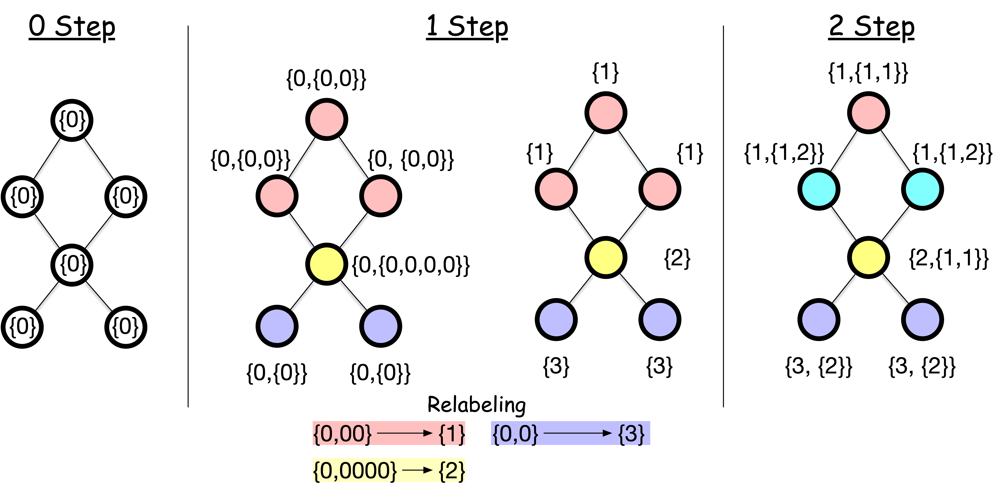

> **The big question of this module.** An image filter slides over every pixel in the same way. What do you slide over a network, where no two nodes have the same neighborhood?

Here is the answer in one sentence, before any mathematics: **a layer replaces each node's value with a combination of its neighbors' values, and learns what that combination should be.** Everything below is a variation on that sentence — which combination, computed how, and what goes wrong when you do it too many times.

## A pixel is a node, and a kernel is a rule about neighbors

We can think of a convolution of an image from the perspective of networks.
In the convolution of an image, a pixel is convolved with its *neighbors*. We can regard each pixel as a node, and each node is connected to its neighboring nodes (pixels) that are involved in the convolution. An image is then a very orderly network: a grid in which every node has exactly eight neighbors, always in the same eight positions.

<!-- TODO(anim): morph a 5x5 pixel grid into a graph — pixels lift off into nodes, the 3x3 kernel footprint becomes edges — then perturb it into an irregular network so the reader sees the grid was a special case. -->

Building on this analogy, we can extend the idea of convolution to general graph data.
Each node has a pixel value(s) (e.g., feature vector), which is convolved with the values of its neighbors in the graph.
This is the key idea of graph convolutional networks.
But, there is a key difference: while the number of neighbors for an image is homogeneous, the number of neighbors for a node in a graph can be heterogeneous. Each pixel has the same number of neighbors (except for the boundary pixels), but nodes in a graph can have very different numbers of neighbors. A kernel is a *fixed* table of nine weights; a node with three neighbors and a node with three hundred cannot share one.

There is a second difference, less obvious but just as constraining. In an image, "the pixel above" is a well-defined position, and the same kernel weight always applies to it. In a graph, a node's neighbors arrive as an unordered *set*. Nothing tells you which neighbor is "first".

Concretely: draw a triangle and label its corners $1, 2, 3$. Now swap the names of nodes $2$ and $3$. The picture on the page has not changed at all — but the adjacency matrix has, because both its rows and its columns got swapped. Written with a **permutation matrix** ${\bf P}$ (an identity matrix with its rows shuffled, so that ${\bf P}{\bf v}$ reorders the entries of ${\bf v}$), renaming the nodes turns ${\bf A}$ into ${\bf P}{\bf A}{\bf P}^\top$: the ${\bf P}$ on the left reorders the rows, and the ${\bf P}^\top$ on the right reorders the columns to match. Same network, different bookkeeping.

Our answers must not care about the bookkeeping.

::: {.callout-note title="Permutation invariance and equivariance"}
Let ${\bf P}$ be a permutation matrix that relabels nodes. A function $f$ on graphs is:

- **Permutation invariant** if $f({\bf P}{\bf A}{\bf P}^\top, {\bf P}{\bf X}) = f({\bf A}, {\bf X})$. The output does not move at all. This is what we need for **graph-level** predictions — "is this molecule toxic?" cannot depend on the order we happened to list the atoms in.
- **Permutation equivariant** if $f({\bf P}{\bf A}{\bf P}^\top, {\bf P}{\bf X}) = {\bf P} f({\bf A}, {\bf X})$. The output is relabeled the same way as the input. This is what we need for **node-level** predictions — if node 3 becomes node 7, its prediction should move with it.
:::

This is not a technicality; it dictates the architecture. It is why every layer we build below aggregates neighbors with an operation that ignores order — sum, mean, max — and never with anything that depends on which neighbor came "first". It is also why an MLP applied to a flattened adjacency matrix, which would in principle be more expressive, is useless in practice: it has to learn from data that all $N!$ relabelings mean the same thing.

## What "frequency" means when there is no time axis

On the previous page a kernel turned out to be a filter: it kept some waves and discarded others. To reuse that idea we need waves on a network. A network has no time axis and no rows of pixels, so we have to say what "fast" and "slow" mean using nothing but the edges.

Here is the definition that does it. Put one number on each node and ask: **how much do connected nodes disagree?**

Consider a network of $N$ nodes, where each node has a feature variable ${\mathbf x}_i \in \mathbb{R}$. We are interested in:

$$
J = \frac{1}{2}\sum_{i=1}^N\sum_{j=1}^N A_{ij}(x_i - x_j)^2,
$$

where $A_{ij}$ is the adjacency matrix of the graph. The quantity $J$ is *the total variation* of $x$: the sum of the squared disagreement across every edge. (The factor $\frac{1}{2}$ is there because the double sum visits each edge twice.) Small $J$ means connected nodes hold similar values — a **slow, low-frequency** signal. Large $J$ means neighbors disagree sharply — a **fast, high-frequency** signal.

Try it on the smallest interesting network: four nodes in a line, $1 - 2 - 3 - 4$, with three edges. Put three different signals on it and add up the squared disagreements edge by edge.

| signal ${\bf x}$ | edge (1,2) | edge (2,3) | edge (3,4) | $J$ |
|---|---|---|---|---|
| $(1, 1, 1, 1)$ | $0$ | $0$ | $0$ | $\mathbf{0}$ |
| $(1, 1, -1, -1)$ | $0$ | $4$ | $0$ | $\mathbf{4}$ |
| $(1, -1, 1, -1)$ | $4$ | $4$ | $4$ | $\mathbf{12}$ |

The constant signal has no variation at all. The one that splits the line into a left half and a right half changes sign once, across a single edge. The alternating one changes sign at every edge and scores three times as high. That ordering — $0 < 4 < 12$ — is the entire content of "frequency" on a network. No waves needed, just disagreement across edges.

<!-- TODO(anim): the same four-node line with draggable node values, J recomputed live, and the three signals above as presets, so the reader feels J rise as they make neighbors disagree. -->

We can rewrite $J$ as

$$
J = \frac{1}{2}\sum_{i=1}^N\sum_{j=1}^N A_{ij}(x_i - x_j)^2 = {\bf x}^\top {\bf L} {\bf x},
$$

where ${\bf L}$ is the **(unnormalized) Laplacian matrix** of the graph given by

$$
L_{ij} = \begin{cases}
-1 & \text{if } i \text{ and } j \text{ are connected} \\
k_i & \text{if } i = j \\
0 & \text{otherwise}
\end{cases}.
$$

and ${\bf x} = [x_1,x_2,\ldots, x_N]^\top$ is a column vector of feature variables. Equivalently, ${\bf L} = {\bf D} - {\bf A}$, where ${\bf D}$ is the diagonal degree matrix with $D_{ii} = k_i$.

::: {.callout-note title="Notation: two Laplacians"}
We will need **two** Laplacians in this module, and mixing them up breaks every formula that follows. Keep them distinct:

$$
\underbrace{{\bf L} = {\bf D} - {\bf A}}_{\text{unnormalized}}, \qquad \underbrace{{\bf L}_{\text{sym}} = {\bf D}^{-\frac{1}{2}} {\bf L} {\bf D}^{-\frac{1}{2}} = {\bf I} - {\bf D}^{-\frac{1}{2}} {\bf A} {\bf D}^{-\frac{1}{2}}}_{\text{symmetric normalized}}
$$

${\bf L}$ is what appears in the total-variation identity ${\bf x}^\top {\bf L} {\bf x}$ above, because that identity counts raw squared differences across edges. ${\bf L}_{\text{sym}}$ is what the convolution machinery below uses, because its eigenvalues are confined to $[0, 2]$ regardless of the network — which is what lets us rescale them into a fixed range. Both are symmetric and positive semi-definite, and both have smallest eigenvalue $0$ with a constant-like eigenvector.
:::


Multiplying out $(x_i - x_j)^2$ and collecting terms is what turns the edge-by-edge sum into ${\bf x}^\top {\bf L} {\bf x}$; the four lines of algebra are in the [appendix](04-appendix.qmd#total-variation).

### The network's own basis waves

Now the analogy with the Fourier transform pays off. There, a signal was rebuilt from sinusoids. Here, the Laplacian is a symmetric matrix, so it has $N$ eigenvectors ${\mathbf u}_1, \ldots, {\mathbf u}_N$ that form a basis: *any* assignment of numbers to nodes can be written as a combination of them. These eigenvectors are the network's basis waves, and the variation splits along them:

$$
J = \sum_{i=1}^N \lambda_i  ||{\bf x}^\top {\mathbf u}_i||^2 .
$$

Read the two pieces separately.

- $({\bf x}^\top {\mathbf u}_i)$ is a dot product between the signal ${\bf x}$ and the basis wave ${\mathbf u}_i$: how much of that wave the signal contains. It plays exactly the role of a Fourier coefficient.
- $\lambda_i$ is the price tag on that wave. Feed the wave itself in as the signal and the sum collapses to ${\mathbf u}_i^\top {\bf L} {\mathbf u}_i = \lambda_i$: **the eigenvalue of a basis wave is literally its own total variation.**

So the eigenvalues sort the basis waves from smoothest to roughest. The smallest is always $\lambda = 0$, whose eigenvector is constant on each connected component — the flat picture, the wave with no variation, the graph's version of "overall brightness". Large $\lambda$ means neighbors disagree violently. A signal made mostly of small-$\lambda$ waves is smooth across the network; one made of large-$\lambda$ waves is jagged.

That is a frequency domain, built from edges alone.

### Turning the dial: keep the smooth part, or keep the rough part

Once every wave carries a number $\lambda_i$, we can rescale wave $i$ by any function $h(\lambda_i)$ we like before rebuilding the signal. That is a **filter**, exactly as on the previous page, and the choice of $h$ decides what survives:

**Low-pass**, $h_{\text{low}}(\lambda) = \dfrac{1}{1 + \alpha\lambda}$, divides each wave by its own roughness. Smooth waves pass nearly untouched, jagged ones are shrunk, and the output is a smoothed version of the input in which neighbors have been pulled toward each other.

**High-pass**, $h_{\text{high}}(\lambda) = \dfrac{\alpha\lambda}{1 + \alpha\lambda}$, does the reverse: it deletes the constant wave entirely (at $\lambda = 0$ it is exactly $0$) and keeps what varies between neighbors. It is the graph's edge detector.

{#fig-m09-fig-00 width=80% fig-align="center"}

Keep the low-pass curve in mind. When we get to over-smoothing, it will turn out that a stack of GCN layers is this curve applied over and over.


## Stop designing the filter, learn it

Spectral filters give us a principled way to think about "convolution" on irregular graph structures, and turning the dial between smooth and rough brings out different aspects of the data. We now go one step further: instead of choosing $h(\lambda)$ by hand, **let the data choose it**. That single move is what turns a filter into a neural network.

### Bruna's filter: one weight per basis wave

The simplest learnable filter puts a free parameter on each basis wave:

$$
{\bf L}_{\text{learn}} = \sum_{k=1}^K \theta_k {\mathbf u}_k {\mathbf u}_k^\top,
$$

where ${\mathbf u}_k$ are the Laplacian's eigenvectors and $\theta_k$ are learnable. $K$ is how many waves we keep. Compare this with the hand-designed low-pass filter: there, wave $k$ was scaled by the fixed number $1/(1 + \alpha\lambda_k)$; here it is scaled by $\theta_k$, and gradient descent decides what $\theta_k$ should be.

[@bruna2014spectral] added a nonlinearity and made this a layer:

$$
{\bf x}^{(\ell+1)} = h\left( {\bf L}_{\text{learn}} {\bf x}^{(\ell)}\right),
$$

where $h$ is an activation function and ${\bf x}^{(\ell)}$ holds one number per node at layer $\ell$. Real nodes carry a whole feature *vector*, not one number, and the extension — a separate set of $\theta$'s for each pair of input and output feature channels, exactly as a CNN has one kernel per input-output channel pair — is written out in the [appendix](04-appendix.qmd#bruna).

We will call this model **Bruna's spectral GCN** to keep it distinct from the model that everyone means by "GCN", which appears two sections below.

### Two reasons the elegant version is unusable

**It is too expensive.** Getting the ${\mathbf u}_k$ means eigendecomposing the Laplacian: ${\cal O}(N^3)$. On a network of a million nodes that is not slow, it is impossible.

**It is not local.** Every eigenvector is spread over the whole network, so a single ${\bf L}_{\text{learn}}$ can move information from one end of the graph to the other in one layer. That throws away the one property that made a kernel a kernel: it looked at a *neighborhood*. A filter with no notion of "nearby" also has no reason to generalize, since it has to relearn a coefficient for every wave of every graph it ever sees.

Both problems have the same cure: never touch the eigenvectors.

### ChebNet: a filter you can compute without eigenvectors

Here is the observation that unlocks it. If the filter is a **polynomial in the Laplacian**, then applying it needs no eigenvectors at all — only repeated multiplication by ${\bf L}$, which for a sparse network costs one pass over the edges. And a polynomial of degree $K$ reaches exactly $K$ hops: multiplying by ${\bf L}$ once mixes a node with its neighbors, twice with its neighbors' neighbors, and no further. Locality comes free with the degree.

ChebNet [@defferrard2016convolutional] builds that polynomial out of Chebyshev polynomials $T_k$, which are numerically well-behaved:

$$
{\bf x}^{(\ell+1)} = h\left( \sum_{k=0}^{K-1} \theta_k T_k(\tilde{{\bf L}}){\bf x}^{(\ell)}\right), \qquad \tilde{{\bf L}} = \frac{2}{\lambda_{\text{max}}}{\bf L}_{\text{sym}} - {\bf I},
$$

where ${\bf L}_{\text{sym}}$ is the **symmetric normalized** Laplacian from the notation box above and $\tilde{{\bf L}}$ is it, rescaled so its eigenvalues sit in $[-1, 1]$. The $\theta_k$ are the $K$ learnable numbers, and $K$ — typically $2$ or $3$ — is simultaneously the degree of the polynomial and the number of hops one layer can see. The recursion that generates $T_k$ is in the [appendix](04-appendix.qmd#chebnet).

### Kipf and Welling: throw almost all of it away

Kipf and Welling (2017) [@kipf2017semi] asked what happens if you take ChebNet and set $K = 2$ — keep only $T_0$ and $T_1$ — then tie the two remaining parameters together into one. Three lines of algebra (in the [appendix](04-appendix.qmd#kipf-welling)) collapse the whole apparatus to:

$$
g_{\theta} * {\bf x} \approx \theta\left({\bf I}_N + {\bf D}^{-\frac{1}{2}}{\bf A}{\bf D}^{-\frac{1}{2}}\right){\bf x}
$$

Read that in words, because this is the model everyone means by **GCN** and the words are simple: *a node's new value is its own value plus a degree-normalized sum of its neighbors' values, scaled by one learned number.* No eigenvectors, no polynomial, one parameter. It is precisely the sentence at the top of this page.

The filter is crude — a fixed low-pass shape with a single knob — but layers stack, and stacking $\ell$ of them reaches $\ell$ hops.

### Deep GCNs can suffer from vanishing and exploding gradients

GCN models can be deep, and when they are too deep they start suffering from a problem familiar throughout deep learning, *vanishing and exploding gradients*: the gradients of the loss become too small, or too large, to update the model parameters usefully.

The graph convolution has its own version of this. The operator ${\bf I}_N + {\bf D}^{-1/2}{\bf A}{\bf D}^{-1/2}$ has eigenvalues in $[0, 2]$. Applying it once is harmless, but a deep model applies it over and over: a mode with eigenvalue near $0$ is crushed toward nothing, while a mode with eigenvalue near $2$ is amplified as $2^\ell$ over $\ell$ layers. Repeated multiplication therefore drives the signal — and with it the gradient — either to zero or to infinity.

To facilitate the training of deep GCNs, the authors introduce a very simple trick called *renormalization*. The idea is to add self-connections to the graph:

$$
\tilde{A} = A + I_N, \quad \text{and} \quad \tilde{D}_{ii} = \sum_j \tilde{A}_{ij}
$$

And use $\tilde{A}$ and $\tilde{D}$ to form the convolutional filter.

Altogether, this leads to the following layer-wise propagation rule:

$$X^{(\ell+1)} = \sigma(\tilde{D}^{-\frac{1}{2}}\tilde{A}\tilde{D}^{-\frac{1}{2}}X^{(\ell)}W^{(\ell)})$$

where:

- $X^{(\ell)}$ is the matrix of node features at layer $\ell$
- $W^{(\ell)}$ is the layer's trainable weight matrix
- $\sigma$ is a nonlinear activation function (e.g., ReLU)

This one line is the GCN layer as it is implemented in every library, and it is worth pausing on how little it contains: a fixed sparse matrix, a weight matrix, a nonlinearity. Its cost is linear in the number of edges, each layer sees only immediate neighbors, and despite — or because of — that simplicity it routinely beats more elaborate models.

### Deep GCNs can also suffer from over-smoothing

Renormalization fixes the gradients, but it does not fix a second, more conceptual problem with depth: **over-smoothing**.

Look again at what one GCN layer does, ignoring the weights and the nonlinearity. It replaces each node's feature with an average over its closed neighborhood. That is a *low-pass filter* — exactly the $h_{\text{low}}(\lambda)$ we designed at the start of this module. Applying a low-pass filter once removes some high-frequency variation; applying it $\ell$ times removes $\ell$ rounds of it.

In the spectral picture the effect is precise. Write the node signal in the Laplacian eigenbasis. Each layer multiplies the component along ${\bf u}_i$ by a factor that shrinks with the eigenvalue $\lambda_i$. Only the smoothest mode — the one with $\lambda = 0$, which is constant within each connected component — survives untouched. As $\ell \rightarrow \infty$ every other mode is suppressed, and every node in a component converges to the *same* representation.

This is **over-smoothing**: the collapse of node representations toward a single vector as depth increases. Past a few layers nodes become indistinguishable and node classification accuracy *falls*. It is why most GCNs in practice are only 2 or 3 layers deep — an odd fact if you come from computer vision, where more depth reliably helps.

Reach and collapse are not two facts about depth. They are the same fact, seen
from two ends, and one dial produces both. Below is a network of fifteen nodes,
each carrying a single number drawn as a colour. Watch one node average its
neighbours, then take the depth knob yourself and watch the two readouts move in
opposite directions.

```{=html}
<style>
/* --------------------------------------------------------------------------
   The depth dial (m09) — only the rules this one widget needs. The paper, the
   panels, the buttons, the knob and the motion primitives all come from
   assets/anim.css; the sequencer from assets/anim.js. Every colour here is a
   kit token, and the node fills are interpolated between two of them in JS.
   -------------------------------------------------------------------------- */
#gcn-depth .gcn-node {
  stroke: var(--_ink);
  stroke-width: 1.8;
  transition: fill 0.45s ease, opacity 0.35s ease;
}
#gcn-depth .anim-edge { transition: opacity 0.35s ease; }
/* The receptive field: one soft disc behind each node inside the ball. */
#gcn-depth .gcn-halo {
  fill: var(--_accent);
  fill-opacity: 0.3;
  stroke: none;
  transition: opacity 0.35s ease;
}
/* Two rings, and they mean different things: accent for the node whose reach
   we are following, amber for the two nodes still furthest apart — the same
   two colours as the two curves in the last scene. */
#gcn-depth .gcn-ring-reach { fill: none; stroke: var(--_accent); stroke-width: 2.6; }
#gcn-depth .gcn-ring-gap { fill: none; stroke: var(--_amber); stroke-width: 2.4; }
/* A ring drawn straight onto a dark node vanishes, and the fills run the
   whole ramp, so every ring gets a paper collar underneath it. */
#gcn-depth .gcn-ring-back { fill: none; stroke: var(--_paper); stroke-width: 5; }
#gcn-depth .gcn-tok { stroke: var(--_ink); stroke-width: 1.1; }
#gcn-depth .gcn-swatch { stroke: var(--_ink); stroke-width: 0.7; }
#gcn-depth .gcn-dim { opacity: 0.15; }
/* The knob's own position line uses the kit's faint marker: .anim-marker is
   amber, and amber is already spoken for by the falling curve. */
#gcn-depth .gcn-barbg { fill: var(--_rule); }
#gcn-depth .gcn-bar { fill: var(--_amber); transition: width 0.45s ease; }
#gcn-depth .gcn-rule {
  height: 0;
  margin: 0.4rem 0 0.3rem;
  border: 0;
  border-top: 1.6px solid var(--_rule);
}
@media (prefers-reduced-motion: reduce) {
  #gcn-depth .gcn-node,
  #gcn-depth .gcn-halo,
  #gcn-depth .anim-edge,
  #gcn-depth .gcn-bar { transition: none !important; }
}
</style>

<figure class="anim-stage" id="gcn-depth">
  <div class="anim-bar">
    <div class="anim-step" data-anim-step></div>
    <div class="anim-dots" data-anim-dots></div>
    <button class="anim-btn" type="button" data-anim-prev aria-label="Previous step">&#9664;</button>
    <button class="anim-btn" type="button" data-anim-play>&#9208; Pause</button>
    <button class="anim-btn" type="button" data-anim-next aria-label="Next step">&#9654;</button>
    <button class="anim-btn" type="button" data-anim-replay>&#8635; Replay</button>
  </div>

  <div class="anim-grid-2" data-anim-canvas>
    <div data-anim-clear data-gcn-net></div>
    <div data-anim-clear data-gcn-side></div>
  </div>

  <figcaption class="anim-note" data-anim-note></figcaption>
</figure>

<script>
/* One knob, two consequences. Markup above, scenes below, and nothing in
   between: everything a scene calls arrives on `ctx` — see assets/anim.js.
   The kit is loaded after this file, hence the animReady queue. */
(window.animReady = window.animReady || []).push(function () {

  /* ---------------------------------------------------------------- data ---
     Every number below was computed once, offline, and pasted in. Nothing on
     this page runs a graph algorithm or a matrix multiply.

     The network: 15 nodes, 26 edges, drawn with no crossings. Degrees run
     from 2 to 5 and the diameter is 5. Each node carries one number in
     [0, 1], drawn as a colour.

     One layer = the plain average over the closed neighbourhood,
        x_i  <-  ( x_i + sum of x_j over the neighbours j of i ) / (k_i + 1),
     which is the renormalized GCN operator with one D-tilde^-1 in place of
     the two D-tilde^-1/2. Same low-pass, arithmetic you can check in your
     head; the caption under the drawing says which one it is.
     ------------------------------------------------------------------------ */
  const POS = [[167.9,31.7],[193.5,74.6],[141.1,98.5],[178.9,162],[73.8,163.7],[98,117.2],[65.1,37.3],[90.3,73.5],[34.9,137.8],[32.6,181.1],[29.9,62],[139.9,143.2],[112.2,31.6],[199.2,121.3],[117.6,182.2]];
  const EDGE = [[0,1],[0,12],[1,2],[1,13],[2,5],[2,7],[2,11],[2,13],[3,11],[3,13],[3,14],[4,5],[4,8],[4,9],[4,14],[5,7],[5,8],[5,11],[6,7],[6,10],[6,12],[7,10],[7,12],[8,9],[11,13],[11,14]];

  /* VAL[l][i] = node i's number after l layers, l = 0 … 8. Row 0 is the
     input. Read down any column and you are watching that node forget
     itself: every column ends at 0.597, the degree-weighted mean of row 0. */
  const VAL = [
    [0.700,0.900,1.000,0.400,0.400,0.900,0.400,0.400,0.800,0.900,0.200,0.200,0.900,0.700,0.100],
    [0.833,0.825,0.683,0.350,0.620,0.617,0.475,0.633,0.750,0.700,0.333,0.550,0.600,0.640,0.275],
    [0.753,0.745,0.658,0.454,0.592,0.642,0.510,0.557,0.672,0.690,0.481,0.519,0.635,0.610,0.449],
    [0.711,0.691,0.622,0.508,0.609,0.607,0.546,0.581,0.649,0.651,0.516,0.555,0.614,0.597,0.504],
    [0.672,0.655,0.609,0.541,0.604,0.604,0.564,0.581,0.629,0.636,0.547,0.565,0.613,0.595,0.544],
    [0.647,0.633,0.602,0.561,0.603,0.599,0.576,0.586,0.618,0.623,0.564,0.576,0.607,0.593,0.564],
    [0.629,0.619,0.598,0.574,0.601,0.597,0.584,0.589,0.611,0.615,0.576,0.582,0.604,0.593,0.576],
    [0.617,0.610,0.596,0.581,0.600,0.597,0.588,0.591,0.606,0.609,0.583,0.587,0.601,0.593,0.583],
    [0.609,0.604,0.596,0.586,0.599,0.596,0.591,0.593,0.603,0.605,0.587,0.590,0.600,0.593,0.588]
  ];

  /* The widest gap in the network at each depth — max(VAL[l]) - min(VAL[l]) —
     and which two nodes are holding it open. */
  const GAP = [0.900,0.558,0.304,0.208,0.131,0.086,0.056,0.036,0.023];
  const HI = [2,0,0,0,0,0,0,0,0];
  const LO = [14,14,14,14,3,3,3,3,3];

  /* Scene 1's node: 5, degree 5. Its own 0.90 plus 1.00, 0.40, 0.40, 0.80
     and 0.20 makes 3.70, and 3.70 / 6 = 0.617 — which is VAL[1][5]. */
  const HUB = 5, HUB_NB = [2,4,7,8,11], HUB_SUM = 3.70;

  /* Scenes 3 and 5 follow node 9, in the bottom-left corner. DIST[i] is its
     hop distance to node i, so the ball of radius l is {i : DIST[i] <= l},
     and REACH[l] is how big that ball is. Node 9 is never the highest or the
     lowest node, so its accent ring never lands on an amber one. */
  const MARK = 9;
  const DIST = [5,4,3,3,1,2,4,3,1,0,4,3,4,4,2];
  const REACH = [1,3,5,9,14,15,15,15,15];

  const DEPTH = 8;          /* the knob: 0 layers … 8 layers */
  const PARK = 2;           /* where the auto-sweep stops to make its point */
  const px = (l) => 26 + (l / DEPTH) * 186;
  const py = (v) => 96 - v * 76;
  const poly = (a) => a.map((v, i) => px(i) + "," + py(v)).join(" ");
  const REACH_F = REACH.map((r) => r / 15);
  const GAP_F = GAP.map((g) => g / GAP[0]);
  /* Interpolating between the two arrays above, the rising curve overtakes
     the falling one at 2.012 layers — the dot at (72.8, 70.4) below. */

  /* --------------------------------------------------------------- scenes */
  const scenes = [
    {
      label: "One node collects",
      note: "Fifteen nodes, one number each, drawn as a colour. Pick one: it takes its own number together with its five neighbours' numbers and keeps the average. 3.70 shared six ways is 0.62, so a dark node turns middling.",
      async run(ctx) {
        ctx.drawNet();
        await ctx.sleep(2600);

        const c = ctx.card("one node collects");
        ctx.only([HUB].concat(HUB_NB));
        ctx.markGap([HUB]);
        await ctx.sleep(700);

        /* One number to a line, so the column adds up on the page. The label
           appears once: after that it is a bag of numbers, and a bag has no
           first element. */
        [["itself", VAL[0][HUB].toFixed(2)]].concat(
          HUB_NB.map((n, k) => [k === 0 ? "its neighbours" : "", VAL[0][n].toFixed(2)])
        ).forEach((r, i) => {
          const t = ctx.el("div", "anim-tally anim-fade",
            "<span>" + r[0] + "</span><b>" + r[1] + "</b>");
          t.style.animationDelay = ctx.fast() ? "0s" : (i * 0.32) + "s";
          c.appendChild(t);
        });
        c.appendChild(ctx.el("div", "anim-caption",
          "an unordered bag — nothing says which neighbour is first"));
        await ctx.sleep(2400);

        await ctx.flow(HUB_NB.map((n) => [n, HUB]));
        ctx.setVal(HUB, VAL[1][HUB]);
        await ctx.sleep(600);

        c.appendChild(ctx.el("hr", "gcn-rule"));
        [["sum", HUB_SUM.toFixed(2)], ["÷ 6", VAL[1][HUB].toFixed(2)]].forEach((r, i) => {
          const t = ctx.el("div", "anim-tally anim-fade",
            "<span>" + r[0] + "</span><b>" + r[1] + "</b>");
          t.style.animationDelay = ctx.fast() ? "0s" : (i * 0.5) + "s";
          c.appendChild(t);
        });
        const last = ctx.el("div", "anim-caption anim-fade",
          "six, not five: a node's own value is in the sum. That is the +I in &Atilde; = A + I.");
        last.style.animationDelay = ctx.fast() ? "0s" : "1s";
        c.appendChild(last);
        await ctx.sleep(2800);
      }
    },
    {
      label: "All fifteen at once",
      note: "That is one layer: the same averaging at all fifteen nodes at the same instant, every node sending its number down every edge. The picture is already flatter — the widest gap in the network falls from 0.90 to 0.56.",
      async run(ctx) {
        const c = ctx.card("one layer, everywhere");
        ctx.markGap([]);
        ctx.only(null);
        await ctx.sleep(500);

        const both = [];
        EDGE.forEach((e) => { both.push([e[0], e[1]]); both.push([e[1], e[0]]); });
        await ctx.flow(both);
        ctx.paint(1);
        await ctx.sleep(800);

        [["messages sent", "52"], ["nodes updated", "15"],
         ["widest gap", "0.90 &rarr; 0.56"]].forEach((r, i) => {
          const t = ctx.el("div", "anim-tally anim-fade",
            "<span>" + r[0] + "</span><b>" + r[1] + "</b>");
          t.style.animationDelay = ctx.fast() ? "0s" : (i * 0.45) + "s";
          c.appendChild(t);
        });
        c.appendChild(ctx.el("div", "anim-caption",
          "two messages per edge, one each way: 26 edges, 52 messages"));
        await ctx.sleep(2800);
      }
    },
    {
      label: "The good news",
      note: "Back to the raw numbers, and follow the ringed node in the corner. After one layer its value depends on 3 nodes, after two on 5, after three on 9. Depth is reach: stack ℓ layers and a node sees ℓ hops out, and nothing further.",
      async run(ctx) {
        const c = ctx.card("what one node can see");
        ctx.markGap([]);
        ctx.paint(0);
        ctx.markReach(MARK);
        ctx.ball(-1);
        await ctx.sleep(800);

        for (let l = 1; l <= 5; l++) {
          ctx.ball(l);
          ctx.only(DIST.map((d, i) => (d <= l ? i : -1)).filter((i) => i >= 0));
          c.appendChild(ctx.el("div", "anim-tally anim-fade",
            "<span>after " + l + (l === 1 ? " layer" : " layers") + "</span><b>" +
            REACH[l] + " of 15</b>"));
          await ctx.sleep(l < 5 ? 1150 : 500);
        }
        c.appendChild(ctx.el("div", "anim-caption anim-fade",
          "five layers and it has reached everybody — this network is five hops wide"));
        await ctx.sleep(2600);
      }
    },
    {
      label: "The bad news",
      note: "Now keep averaging. Every layer pulls neighbours toward each other, and the two nodes still furthest apart — ringed here — close on one another. By layer 6 the widest gap anywhere in the network is 0.06. The picture is one colour.",
      async run(ctx) {
        const c = ctx.card("keep going");
        ctx.only(null);
        ctx.ball(-1);
        ctx.markReach(-1);
        ctx.paint(0);
        ctx.markGap([HI[0], LO[0]]);

        const big = ctx.el("div", "anim-big", "0");
        c.appendChild(big);
        c.appendChild(ctx.el("div", "anim-caption", "layers"));
        const tal = ctx.el("div", "anim-tally", "<span>widest gap</span><b>0.90</b>");
        c.appendChild(tal);
        const bar = ctx.svgRoot("0 0 200 14");
        bar.innerHTML =
          '<rect class="gcn-barbg" x="0" y="3" width="200" height="8" rx="4"/>' +
          '<rect class="gcn-bar" data-bar x="0" y="3" width="200" height="8" rx="4"/>';
        c.appendChild(bar);
        const val = tal.querySelector("b");
        const fill = bar.querySelector("[data-bar]");

        const put = (l) => {
          ctx.paint(l);
          ctx.markGap([HI[l], LO[l]]);
          big.textContent = String(l);
          val.textContent = GAP[l].toFixed(2);
          fill.setAttribute("width", (200 * GAP[l] / GAP[0]).toFixed(1));
        };

        /* Skipped to, or read with motion off: the end state is the point. */
        if (ctx.fast()) { put(DEPTH); return; }

        await ctx.sleep(900);
        for (let l = 1; l <= 6; l++) { put(l); await ctx.sleep(950); }
        c.appendChild(ctx.el("div", "anim-quote anim-fade",
          "0.90 &rarr; 0.06: the network has forgotten who is who"));
        await ctx.sleep(2400);
        for (let l = 7; l <= DEPTH; l++) { put(l); await ctx.sleep(750); }
        await ctx.sleep(1800);
      }
    },
    {
      label: "Now you turn it",
      note: "One knob, both consequences. Drag it: the rising curve is how much of the network the ringed node can see, the falling curve is how different the two most different nodes still are. They cross at two layers.",
      async run(ctx) {
        const c = ctx.card("now you turn it");
        ctx.only(null);
        ctx.markReach(MARK);

        const track = ctx.el("div", "anim-track");
        const knob = ctx.el("div", "anim-knob");
        track.appendChild(knob);
        c.appendChild(track);

        const read = ctx.el("div", "anim-readout",
          '<span>layers <b data-d>0</b></span>' +
          '<span style="color:var(--_accent)">sees <b data-r>1</b> of 15</span>' +
          '<span style="color:var(--_amber)">widest gap <b data-g>0.90</b></span>');
        c.appendChild(read);

        const svg = ctx.svgRoot("0 0 220 122");
        svg.innerHTML =
          '<line class="anim-axis" x1="26" y1="96" x2="212" y2="96"/>' +
          '<line class="anim-axis" x1="26" y1="14" x2="26" y2="96"/>' +
          '<polyline class="anim-amber-stroke" points="' + poly(GAP_F) + '"/>' +
          '<polyline class="anim-accent-stroke" points="' + poly(REACH_F) + '"/>' +
          '<circle class="anim-amber-fill" cx="72.8" cy="70.4" r="3.6"/>' +
          '<line class="anim-marker anim-marker--faint" data-cursor x1="26" y1="12" x2="26" y2="99"/>' +
          '<text class="anim-label" x="12" y="26">1</text>' +
          '<text class="anim-label" x="12" y="100">0</text>' +
          '<text class="anim-label" x="16" y="115">0 layers</text>' +
          '<text class="anim-label" x="172" y="115">8 layers</text>' +
          '<text class="anim-label anim-accent-fill" x="126" y="42">how far it sees</text>' +
          '<text class="anim-label anim-amber-fill" x="140" y="80">widest gap</text>';
        c.appendChild(svg);
        c.appendChild(ctx.el("div", "anim-caption",
          "both curves are this same 15-node network, each drawn as a fraction " +
          "of its own largest value. The dot is where they cross: 2.0 layers."));

        const verdict = ctx.el("div", "anim-tally anim-fade");
        verdict.style.visibility = "hidden";
        c.appendChild(verdict);

        const outD = read.querySelector("[data-d]");
        const outR = read.querySelector("[data-r]");
        const outG = read.querySelector("[data-g]");
        const cur = svg.querySelector("[data-cursor]");

        /* One knob, and a real one: pointer, touch and arrow keys all land in
           onInput, and grabbing it pauses the sequence so the drawing is
           yours until you let go. */
        const dial = ctx.mountKnob(knob, {
          min: 0, max: DEPTH, step: 1, value: 0,
          label: "Number of GCN layers",
          format: (l) => l + (l === 1 ? " layer" : " layers"),
          onGrab: () => ctx.pause(),
          onInput: (l) => {
            outD.textContent = String(l);
            outR.textContent = String(REACH[l]);
            outG.textContent = GAP[l].toFixed(2);
            cur.setAttribute("x1", px(l));
            cur.setAttribute("x2", px(l));
            ctx.paint(l);
            ctx.ball(l);
            ctx.markGap([HI[l], LO[l]]);
          }
        });
        dial.set(0);

        const say = (t) => { verdict.innerHTML = t; verdict.style.visibility = "visible"; };

        /* Skipping, or reading without motion: land on the crossing, because
           the crossing is the thing this figure is about. */
        if (ctx.fast()) {
          dial.set(PARK);
          say("<span>two layers</span><b>a third seen, a third kept</b>");
          return;
        }

        await ctx.sleep(900);
        for (let l = 1; l <= PARK; l++) { dial.set(l); await ctx.sleep(950); }
        say("<span>two layers</span><b>a third seen, a third kept</b>");
        await ctx.sleep(2800);

        for (let l = PARK + 1; l <= DEPTH; l++) { dial.set(l); await ctx.sleep(650); }
        say("<span>eight layers</span><b>all seen, nothing kept</b>");
        await ctx.sleep(3000);
      }
    }
  ];

  mountScenes(document.getElementById("gcn-depth"), scenes, {
    stepsLabel: "Message-passing steps",

    /* The two things only this animation has: a network that persists across
       all five scenes, and a card on the right that each scene rewrites.
       Built once at mount, handed to every scene on ctx. */
    helpers(ctx) {
      const net = ctx.$("[data-gcn-net]");
      const side = ctx.$("[data-gcn-side]");
      const S = {};

      /* ---- the colour of a number ----------------------------------------
         Low is --_accent-soft, high is --_accent, and both are read off the
         stage rather than written here, so the ramp follows the theme. The
         literals are the same fallbacks assets/anim.css declares, and are
         reached only if a browser hands back something unparseable. */
      const CS = getComputedStyle(ctx.root);
      function rgb(text, fallback) {
        const s = String(text || "").trim();
        let m = /^#([0-9a-f]{6})$/i.exec(s);
        if (m) return [parseInt(m[1].slice(0, 2), 16), parseInt(m[1].slice(2, 4), 16),
                       parseInt(m[1].slice(4, 6), 16)];
        m = /^#([0-9a-f]{3})$/i.exec(s);
        if (m) return m[1].split("").map((h) => parseInt(h + h, 16));
        m = /rgba?\(([^)]+)\)/i.exec(s);
        if (m) return m[1].split(/[,\s/]+/).slice(0, 3).map(Number);
        return fallback;
      }
      const LOW = rgb(CS.getPropertyValue("--_accent-soft"), [240, 233, 251]);
      const HIGH = rgb(CS.getPropertyValue("--_accent"), [89, 49, 150]);
      const hue = (v) => {
        const t = Math.max(0, Math.min(1, v));
        return "rgb(" + LOW.map((c, i) => Math.round(c + (HIGH[i] - c) * t)).join(",") + ")";
      };

      /* ---- the drawing ---------------------------------------------------
         Scene 1 builds it; scenes 2–5 only ever mutate it. Separate <g>s so
         the haloes land under the edges, the messages over them and the rings
         over everything, with no z fiddling. */
      function drawNet() {
        net.textContent = "";
        const svg = ctx.svgRoot("14 12 202 200");
        const g = () => svg.appendChild(ctx.svgEl("g"));
        const gHalo = g(), gEdge = g(), gNode = g(), gTok = g(), gRing = g();
        const slow = !ctx.fast();

        S.halos = POS.map((p) => {
          const c = ctx.svgEl("circle", { cx: p[0], cy: p[1], r: 17, "class": "gcn-halo" });
          c.style.opacity = 0;
          return gHalo.appendChild(c);
        });

        S.edges = EDGE.map((e, i) => {
          const l = ctx.svgEl("line", {
            x1: POS[e[0]][0], y1: POS[e[0]][1], x2: POS[e[1]][0], y2: POS[e[1]][1],
            "class": "anim-edge" + (slow ? " anim-draw" : "")
          });
          if (slow) {
            /* --dash must clear the line's own length or it pops in late
               instead of drawing. */
            const d = Math.hypot(POS[e[0]][0] - POS[e[1]][0], POS[e[0]][1] - POS[e[1]][1]);
            l.style.setProperty("--dash", Math.ceil(d) + 4);
            l.style.animationDelay = (0.5 + i * 0.045) + "s";
          }
          return gEdge.appendChild(l);
        });

        S.nodes = POS.map((p, i) => {
          const c = ctx.svgEl("circle", {
            cx: p[0], cy: p[1], r: 10,
            "class": "gcn-node" + (slow ? " anim-fade" : "")
          });
          c.style.fill = hue(VAL[0][i]);
          if (slow) c.style.animationDelay = (1.7 + i * 0.05) + "s";
          return gNode.appendChild(c);
        });

        /* The legend lives in the same viewBox, so it scales with the drawing
           and cannot drift away from it. */
        for (let i = 0; i <= 10; i++) {
          const r = ctx.svgEl("rect", {
            x: 44 + i * 13, y: 198, width: 13, height: 10, "class": "gcn-swatch"
          });
          r.style.fill = hue(i / 10);
          svg.appendChild(r);
        }
        [[30, "0"], [190, "1"]].forEach((t) => {
          const lab = ctx.svgEl("text", { x: t[0], y: 207, "class": "anim-label" });
          lab.textContent = t[1];
          svg.appendChild(lab);
        });

        S.toks = gTok;
        S.ringBox = gRing;
        net.appendChild(svg);
        net.appendChild(ctx.el("div", "anim-caption",
          "one number per node, drawn as a colour. A layer replaces it with " +
          "the plain average over the closed neighbourhood; GCN weights by " +
          "&radic;degree instead and smooths the same way."));
      }

      /* ---- painting ---- */
      const setVal = (i, v) => { S.nodes[i].style.fill = hue(v); };
      const paint = (l) => { S.nodes.forEach((n, i) => { n.style.fill = hue(VAL[l][i]); }); };

      /* ---- attention: dim everything that is not in `keep` (null = all) --- */
      function only(keep) {
        const on = keep ? new Set(keep) : null;
        S.nodes.forEach((n, i) => { n.classList.toggle("gcn-dim", !!on && !on.has(i)); });
        S.edges.forEach((e, i) => {
          e.classList.toggle("gcn-dim",
            !!on && !(on.has(EDGE[i][0]) && on.has(EDGE[i][1])));
        });
      }

      /* ---- the receptive field: the ball of radius l around MARK ---- */
      function ball(l) {
        S.halos.forEach((h, i) => { h.style.opacity = (l >= 0 && DIST[i] <= l) ? 1 : 0; });
      }

      /* ---- the two kinds of ring, kept apart so setting one does not
             disturb the other ---- */
      function redraw() {
        S.ringBox.textContent = "";
        const put = (i, cls) => {
          S.ringBox.appendChild(ctx.svgEl("circle", {
            cx: POS[i][0], cy: POS[i][1], r: 13.5, "class": "gcn-ring-back"
          }));
          S.ringBox.appendChild(ctx.svgEl("circle", {
            cx: POS[i][0], cy: POS[i][1], r: 13.5, "class": cls
          }));
        };
        if (S.reach != null) put(S.reach, "gcn-ring-reach");
        (S.gap || []).forEach((i) => put(i, "gcn-ring-gap"));
      }
      const markReach = (i) => { S.reach = (i >= 0 ? i : null); redraw(); };
      const markGap = (list) => { S.gap = list || []; redraw(); };

      /* ---- messages: a dot of the sender's colour sliding down the edge --- */
      async function flow(pairs) {
        if (ctx.fast()) return;
        const dots = pairs.map((p) => {
          const t = ctx.svgEl("g", { "class": "anim-glide" });
          const c = ctx.svgEl("circle", { r: 4.5, "class": "gcn-tok" });
          c.style.fill = S.nodes[p[0]].style.fill;
          t.appendChild(c);
          t.style.transform = "translate(" + POS[p[0]][0] + "px," + POS[p[0]][1] + "px)";
          return S.toks.appendChild(t);
        });
        S.toks.getBoundingClientRect();            /* commit before re-arming */
        dots.forEach((t, k) => {
          t.style.transform =
            "translate(" + POS[pairs[k][1]][0] + "px," + POS[pairs[k][1]][1] + "px)";
        });
        await ctx.sleep(720);
        dots.forEach((t) => { t.style.opacity = 0; });
        await ctx.sleep(280);
        S.toks.textContent = "";
      }

      function card(title) {
        side.textContent = "";
        const c = ctx.el("div", "anim-panel anim-pop");
        if (title) c.appendChild(ctx.el("div", "anim-caption", title));
        side.appendChild(c);
        return c;
      }

      /* S is filled by drawNet(), i.e. after helpers() has already run, so
         everything that reaches into it has to be a function — the kit copies
         these onto ctx by value at mount time. */
      return { drawNet, paint, setVal, only, ball, markReach, markGap, flow, card };
    }
  });
});
</script>
```

Note that this is a different failure from vanishing gradients. Vanishing gradients are an *optimization* problem: the model cannot be trained. Over-smoothing is a *representational* problem: even trained perfectly, the model has thrown away what distinguishes one node from another.

Several remedies are used in practice:

- **Skip (residual) connections**: add the previous layer's representation back, ${\bf H}^{(\ell+1)} \leftarrow {\bf H}^{(\ell+1)} + {\bf H}^{(\ell)}$, so a node always retains some of its own earlier signal.
- **Jumping knowledge**: keep the representations from *all* layers and let the model choose among them, instead of using only the last.
- **Dropout and DropEdge**: randomly drop units, or randomly drop edges each epoch, which slows the averaging.
- **Normalization**: PairNorm and related graph-specific normalizations explicitly prevent node representations from collapsing onto each other.
- **Just stay shallow**: often the most effective option.

This is the point at which to go and cause over-smoothing yourself: the [hands-on page](02-coding.qmd) trains a GCN on a real network and asks you to stack it too deep on purpose.

## Every GNN is the same three steps

Before meeting more architectures, it helps to name the pattern they all share. Look again at the GCN layer, ignoring the matrix notation: each node collects its neighbors' representations, combines them into one, and uses that to update itself. Every GNN in this module — and essentially every GNN in the literature — is a choice of how to do those three things.

::: {.callout-note title="Message passing"}
One layer of a GNN updates node $v$ as

$$
{\bf h}_v^{(\ell+1)} = \text{UPDATE}\left( {\bf h}_v^{(\ell)},\; \text{AGGREGATE}\left( \left\{ \text{MESSAGE}\left({\bf h}_v^{(\ell)}, {\bf h}_u^{(\ell)}, {\bf e}_{vu}\right) : u \in {\cal N}(v) \right\} \right) \right)
$$

- **MESSAGE** builds what each neighbor $u$ sends to $v$, optionally using the edge ${\bf e}_{vu}$.
- **AGGREGATE** combines the incoming messages into a single vector. It takes a **multiset** as input and must be order-independent — this is where permutation equivariance is enforced.
- **UPDATE** combines the aggregated message with the node's own current state.
:::

Reading the architectures through this lens:

| | MESSAGE | AGGREGATE | UPDATE |
|---|---|---|---|
| **GCN** | ${\bf h}_u$ scaled by $1/\sqrt{\tilde k_v \tilde k_u}$ | sum | linear map, then $\sigma$ |
| **GraphSAGE** | ${\bf h}_u$, from a *sample* of neighbors | mean / max / LSTM | concatenate with ${\bf h}_v$, linear, normalize |
| **GAT** | ${\bf h}_u$ | attention-weighted sum, weights learned | linear map, then $\sigma$ |
| **GIN** | ${\bf h}_u$ | sum | $(1+\epsilon){\bf h}_v + \text{sum}$, then MLP |

Two consequences follow immediately from this form.

**Depth equals reach.** After $\ell$ layers a node's representation depends on exactly its $\ell$-hop neighborhood, and nothing further. A 2-layer GNN cannot see anything 3 hops away. This is why the receptive field grows with depth — and, given over-smoothing, why the useful range of depths is so narrow. It is the pair of crossing curves you turned the knob on above.

**Features and structure are learned jointly.** A GNN consumes two inputs: the graph ${\bf A}$ and the node features ${\bf X}$. If the features are informative the model can lean on them; if they are uninformative (all-ones, or a one-hot node ID) the model has nothing but topology and degenerates into a structural method. This is worth checking before blaming an architecture: on a network with no meaningful node attributes, a GNN often does no better than the embeddings of Module 8.

## Three ways to change one line of the recipe

The three architectures below are famous, and it is easy to lose that behind the notation. Read them through the table above and each one changes exactly one slot: GraphSAGE changes *which* neighbors send messages, GAT changes *how much* each message counts, and GIN changes *how the messages are added up*.

### GraphSAGE: don't ask all the neighbors

GraphSAGE [@hamilton2017graphsage] introduced a graph convolution that ***generalizes to unseen nodes*** (they called it "inductive"). While previous approaches like ChebNet and GCN operate on the entire graph, GraphSAGE generates embeddings by sampling and aggregating features from a node's neighborhood — two ideas, sampling and aggregation, which we take in turn.

<!-- TODO(anim): a hub with 40 neighbors; press "sample" and watch 5 get picked at random each round, with the running mean of their features shown converging. -->

#### Neighborhood sampling

The key idea is the *neighborhood sampling*. Instead of using all neighbors, GraphSAGE samples a fixed-size set of neighbors for each node. This controls memory complexity, a key limitation of the previous GNNs.

Another key advantage of neighborhood sampling is that it enables GraphSAGE to handle dynamic, growing networks. Consider a citation network where new papers (nodes) are continuously added. Traditional GCNs would need to recompute filters for the entire network with each new addition. In contrast, GraphSAGE can immediately generate embeddings for new nodes by simply sampling their neighbors, without any retraining or recomputation.

#### Aggregation

Another key idea is the *aggregation*. GraphSAGE makes a distinction between self-information and neighborhood information. While previous GNNs treat them equally and aggregate them, GraphSAGE treats them differently. Specifically, GraphSAGE introduces an additional step: it concatenates the self-information and the neighborhood information as the input of the convolution.

$$
Z_v = \text{CONCAT}(X_v, X_{\mathcal{N}(v)})
$$

where $X_v$ is the feature of the node itself and $X_{\mathcal{N}(v)}$ is the aggregation of the features of its neighbors. GraphSAGE introduces different ways to aggregate information from neighbors:

$$X_{\mathcal{N}(v)} = \text{AGGREGATE}_k(\{X_u, \forall u \in \mathcal{N}(v)\})$$

Common aggregation functions include:

- Mean aggregator: $\text{AGGREGATE} = \text{mean}(\{h_u, \forall u \in \mathcal{N}(v)\})$
- Max-pooling: $\text{AGGREGATE} = \max(\{\sigma(W_{\text{pool}}h_u + b), \forall u \in \mathcal{N}(v)\})$
- LSTM aggregator: apply an LSTM to the neighbors in a random order. This one is not order-independent, which breaks permutation invariance; the random ordering is a patch, not a fix.

The concatenated feature $Z_v$ is normalized by the L2 norm.

$$
\hat{Z}_v = \frac{Z_v}{\|Z_v\|_2}
$$

and then fed into the convolution.

$$
X_v^k = \sigma(W^k \hat{Z}_v + b^k)
$$

### GAT: let a neighbor argue for its own importance

GraphSAGE separates a node from its neighborhood. But within the neighborhood, should all neighbors count the same? A GCN says yes — its weights $1/\sqrt{\tilde k_v \tilde k_u}$ depend only on degrees, never on what the neighbor actually says. Graph Attention Networks (GAT) let the model learn which neighbors to listen to.

<!-- TODO(anim): the same node updated twice — once with uniform GCN weights, once with attention weights drawn as edge thickness — so the reader sees one loud neighbor dominate. -->

The core idea is beautifully simple: replace the fixed weights with **attention weights** $\alpha_{ij}$ saying how much node $i$ should attend to node $j$, computed from the node features themselves:

$$
\alpha_{ij} = \frac{\exp(e_{ij})}{\sum_{k \in \mathcal{N}(i)} \exp(e_{ik})}
$$

where $e_{ij}$ is a score for the edge between node $i$ and node $j$. The score is not a stored parameter — it is computed from the two nodes' features by the small network below, and can be negative, which is why the exponential is applied. Dividing by $\sum_{k \in \mathcal{N}(i)} \exp(e_{ik})$ makes the weights over $i$'s neighbors sum to 1.

How to compute $e_{ij}$? One simple choice is to use a neural network with a shared weight matrix $W$ and a LeakyReLU activation function. Specifically:

1. Let's focus on computing $e_{ij}$ for node $i$ and its neighbor $j$.
2. We use a **single** shared weight matrix ${\bf W}$ to transform the features of **both** node $i$ and node $j$. The same ${\bf W}$ is reused in the update step below — there is no second weight matrix.
   $$
   \mathbf{\tilde h}_i  = {\bf W}\mathbf{h}_i, \quad \mathbf{\tilde h}_j  = {\bf W}\mathbf{h}_j
   $$
3. We concatenate the transformed features and apply a LeakyReLU activation function.

$$
e_{ij} = \text{LeakyReLU}\left(\mathbf{a}^T[\mathbf{\tilde h}_i \, \| \, \mathbf{\tilde h}_j]\right) = \text{LeakyReLU}\left(\mathbf{a}^T[{\bf W}\mathbf{h}_i \, \| \, {\bf W}\mathbf{h}_j]\right)
$$

where $\|$ denotes concatenation and $\mathbf{a}$ is a trainable parameter vector that scores the concatenated pair.

Once we have these attention weights, the node update is straightforward - just a weighted sum of neighbor features, using the same ${\bf W}$:

$$\mathbf{h}'_i = \sigma\left(\sum_{j \in \mathcal{N}(i) \cup \{i\}} \alpha_{ij}{\bf W}\mathbf{h}_j\right)$$

To stabilize training, GAT uses $K$ independent attention heads, each with its own ${\bf W}^k$ and $\mathbf{a}^k$. In intermediate layers their outputs are concatenated:

$$\mathbf{h}'_i = \parallel_{k=1}^K \sigma\left(\sum_{j \in \mathcal{N}(i) \cup \{i\}} \alpha_{ij}^k{\bf W}^k\mathbf{h}_j\right)$$

In the **final** layer concatenation no longer makes sense (the output dimension is fixed by the task), so the heads are averaged instead:

$$\mathbf{h}'_i = \sigma\left(\frac{1}{K}\sum_{k=1}^K \sum_{j \in \mathcal{N}(i) \cup \{i\}} \alpha_{ij}^k{\bf W}^k\mathbf{h}_j\right)$$

### GIN: sum instead of average, and never lose a count

The Graph Isomorphism Network was born out of a sharper question than "does it work?": **how much can any message-passing network possibly tell apart?** The answer runs through a 1968 algorithm, the Weisfeiler-Lehman test.

#### The Weisfeiler-Lehman test

Suppose someone hands you two networks and asks whether they are the same network drawn differently — *isomorphic*, in the sense that you can rename the nodes of one and get the other exactly. Nobody knows a fast algorithm for that in general. The **Weisfeiler-Lehman (WL) test** is the cheap, standard substitute, and it works by refining node labels round after round.

{#fig-wl width=95% fig-align="center"}

The algorithm:

1. Give every node the same initial label, say $0$.
2. Each node writes down a *signature*: its own current label, together with the **multiset** of its neighbors' labels (a multiset, not a set, because repeats count). A hash function converts each distinct signature into a fresh label.
3. Repeat for a fixed number of rounds, or until no new labels appear.

Work through the first round on the network in the figure, which has one node at the top, two in the middle, a hub in the center and two at the bottom:

- The top node has two neighbors, so its signature is $(0, \{0,0\})$, hashed to the new label $1$.
- Each middle node also has two neighbors: $(0, \{0,0\})$, so they also become $1$.
- The hub has four neighbors: $(0, \{0,0,0,0\})$, hashed to $2$.
- Each bottom node has one neighbor: $(0, \{0\})$, hashed to $3$.

After one round the labels are just the degrees — that is all a single round of neighbor-counting can possibly know. Round two is where it earns its keep: the top node and the middle nodes both have degree 2, but the top node's neighbors have degrees $(2,2)$ while a middle node's have degrees $(2,4)$, so their signatures differ and they finally split apart. Each round lets a label see one hop further.

<!-- TODO(anim): step the WL rounds forward on two side-by-side networks, recoloring nodes as labels refine, with the label histograms underneath so the reader sees the moment two graphs separate — or fail to. -->

Now the part that is easy to state backwards, so state it carefully. **The test can prove two graphs are different; it can never prove they are the same.** If the two label histograms ever disagree, the graphs are certainly not isomorphic. If they agree at every round, the test has simply failed to find a difference, and the graphs may or may not be isomorphic. The standard counterexample is a pair of non-isomorphic 3-regular graphs on the same number of nodes: every node has degree 3, so every node keeps the same label as every other one forever, and WL sees two identical label histograms for two genuinely different networks.

The same caution applies within a single graph: two nodes ending with the same label are ones the test *could not distinguish*, which is weaker than being structurally interchangeable.

::: {.column-margin}
The test above is the 1-WL test. Higher-order $k$-WL tests color $k$-tuples of nodes rather than single nodes; each step up the hierarchy distinguishes strictly more graphs at a strictly higher cost, and each is the basis of a family of more expressive GNNs.
:::

#### From the test to the layer

GIN [@xu2018how] comes from noticing that the WL test and a GNN layer are the same loop:

- In the WL test, each node collects its neighbors' labels and aggregates them with a *hash function*.
- In GraphSAGE and GAT, each node collects its neighbors' *features* and aggregates them with mean or max.

The difference is that the hash never confuses two different multisets, while mean and max do. Give every node the identical feature $1$: the mean of $\{1,1\}$ and the mean of $\{1,1,1,1\}$ are both $1$, so a node with two neighbors and a node with four become indistinguishable — while WL separates them immediately, because it can still count. A **sum** keeps the count ($2 \ne 4$), which is why GIN sums.

The resulting update rule is:

$$
h_v^{(k+1)} = \text{MLP}^{(k)}\left((1 + \epsilon^{(k)}) \cdot h_v^{(k)} + \sum_{u \in \mathcal{N}(v)} h_u^{(k)}\right)
$$

Here $k$ is the **layer index**, the same $k$ as in $h_v^{(k)}$: $\text{MLP}^{(k)}$ is the multi-layer perceptron belonging to layer $k$ (its own depth is a design choice, usually two), and $\epsilon^{(k)}$ is that layer's fixed or trainable weight on the node's own state. With a sum aggregator and an MLP expressive enough to act like a hash, GIN is provably as discriminative as the 1-WL test — and no message-passing GNN can do better. That upper bound is the reason this architecture matters.

## What comes out the other end: node, edge and graph tasks

So far we have built layers without saying what comes out the other end. Three task levels cover almost everything, and they differ in how node representations are turned into a prediction.

### Node-level tasks: a prediction per node

Attach a classifier to each node's final representation.

**Node classification** predicts a label per node: which topic a paper belongs to, whether an account is fraudulent, what function a protein performs. Training is usually **semi-supervised** — labels exist for a small fraction of nodes, the loss is computed only on those, but message passing lets unlabelled nodes contribute their features and structure anyway. This is a genuine advantage over methods that need labels everywhere.

**Node regression** is the same with a continuous target.

### Edge-level tasks: a prediction per pair

Here the prediction concerns a *pair*, so we combine two node representations into an edge score:

$$
\hat{y}_{uv} = \text{score}({\bf h}_u, {\bf h}_v)
$$

where the score can be a dot product, a distance, or a small MLP on the concatenation.

**Link prediction** asks whether an edge exists or will appear — friend recommendation, drug-target interaction, knowledge graph completion. Note the evaluation subtlety carried over from Module 8: real networks are sparse, so non-edges vastly outnumber edges, and a model predicting "no edge" everywhere scores well on accuracy. Use AUC or precision@k, and sample negatives deliberately.

**Edge classification** predicts the *type* of a relationship rather than its existence.

### Graph-level tasks: one prediction for the whole network

Now the prediction concerns an entire graph — is this molecule soluble, is this program malicious — so we must compress $N$ node vectors into one graph vector. That step is called **readout** or **pooling**, and it must be permutation invariant:

$$
{\bf h}_G = \text{READOUT}\left(\left\{ {\bf h}_v : v \in V \right\}\right)
$$

**Global pooling** is the simple answer: sum, mean, or max over all nodes. Sum keeps size information (a bigger molecule gives a bigger vector); mean discards it and is more robust when graph sizes vary a lot. The choice matters more than it looks.

**Hierarchical pooling** is the more ambitious answer: instead of collapsing everything at once, progressively coarsen the graph, merging clusters of nodes into super-nodes over several rounds, mirroring the pooling layers of a CNN. Methods like DiffPool learn which nodes to merge. This preserves multi-scale structure that global pooling destroys, at a substantial cost in complexity.

## Why you cannot just grab 32 nodes and call it a mini-batch

One practical matter deserves attention because it has no analogue in ordinary deep learning.

With images you build a mini-batch by picking 32 images; they are independent, so this is trivial. Nodes in a graph are *not* independent — computing one node's representation requires its neighbors, whose representations require *their* neighbors. With $\ell$ layers, a single node's prediction depends on its entire $\ell$-hop neighborhood.

**Full-batch training** sidesteps the problem by loading the whole graph and updating all nodes at once. It is exact and simple, and it fails as soon as the graph exceeds memory.

The alternatives all trade exactness for feasibility:

- **Node-wise sampling** (GraphSAGE): sample a fixed number of neighbors per layer, capping the neighborhood explosion. This is the sampling we already met, seen from the training side.
- **Layer-wise sampling**: sample a fixed set of nodes for each layer instead of per node, which avoids the exponential blow-up of independent per-node sampling.
- **Subgraph sampling** (Cluster-GCN, GraphSAINT): partition the graph into subgraphs and treat each as a mini-batch. Cheap and effective, but it deletes the edges between partitions, which biases training.

::: {.column-margin}
This is why the "neighborhood explosion" is such a recurring phrase in the GNN literature. With average degree 10 and 3 layers, one node pulls in roughly 1,000 others. On a graph with hubs of degree 10,000, one unlucky node pulls in the entire network.
:::

## When one hop per layer is not enough: graph transformers

Message passing has a built-in restriction: information moves one hop per layer, so distant nodes communicate only through depth — and depth brings over-smoothing. **Graph Transformers** attack this by letting every node attend to every other node directly, as in the Transformers used for text.

That solves the distance problem and creates two new ones.

**Where did the structure go?** If every node attends to every other, the model no longer knows which nodes are actually connected — we have thrown the graph away. The fix is **positional encodings**: give each node a feature vector describing where it sits in the graph. The standard choices are the leading Laplacian eigenvectors (the spectral embedding of Module 8) or random-walk return probabilities (Module 7). Both give a node a coordinate that reflects the topology, which attention can then use.

**Cost.** All-pairs attention is $O(N^2)$, which is fine for molecules with 50 atoms and hopeless for a social network with millions of nodes. Practical variants restrict attention to a sampled or local subset.

## Four things nobody has solved yet

Four open problems, each an active research area:

- **Scale.** Billion-node graphs strain memory and defeat exact training; sampling introduces bias whose effects are poorly understood.
- **Theory.** We know message passing is bounded by 1-WL, but generalization is largely unexplained: why do 2-layer models with modest capacity work as well as they do?
- **Dynamics.** Most models assume a fixed graph. Real networks add and remove nodes and edges continuously, and temporal GNNs are far less settled than static ones.
- **Robustness, fairness and privacy.** GNN predictions can be flipped by a handful of adversarially added edges. Message passing propagates the majority group's signal into minority nodes, which can encode and amplify bias. And because a node's prediction depends on its neighbors' data, a GNN can leak information about people who never supplied their own.

## Almost none of this was new

It is worth closing by noticing how little of this module was actually new.

- The **GCN layer** is a low-pass filter on the graph Laplacian — the spectral machinery of Module 8, with the filter learned instead of designed.
- **Message passing** is a learned diffusion process. Replace the learnable functions with fixed averaging and you have the random walk of Module 7.
- **Node classification** works because connected nodes tend to share labels — which is homophily, the community structure of Module 5.
- **Neighborhood sampling** is necessary because of hubs, whose existence is the degree heterogeneity of Module 4.
- **Over-smoothing** is a statement about the spectral gap, the same quantity that controls mixing time in Module 7 and bottlenecks in Module 8.

Graph neural networks are not a separate subject bolted onto the end of the course. They are what happens when the structures we spent eight modules measuring become the substrate for learning.

## What you can now do

- Say why an image kernel cannot be copied onto a network, in two ways: neighbors vary in number, and they arrive without an order.
- Compute the total variation $J$ of a signal on a small network by hand, and use it to say which of two signals is the smoother one.
- Explain what a Laplacian eigenvalue *is*: the total variation of its own eigenvector.
- Write down the GCN layer and read it back in English, without matrices.
- Place GCN, GraphSAGE, GAT and GIN in the MESSAGE / AGGREGATE / UPDATE table and say which slot each one changed.
- Diagnose a GNN that gets worse with depth, and tell over-smoothing apart from vanishing gradients.
- State what the WL test can and cannot prove, and why GIN sums rather than averages.

## Where to go next

- [Hands-on: Filter a Network, Then Let It Learn the Filter](02-coding.qmd) — build the low-pass and high-pass filters of this page on a real network, then train a GCN and make it over-smooth on purpose.
- [Exercises and Assignments](03-exercises.qmd) — the worksheet, the Pair Notebook and the group mini-project.
- [Appendix: The Algebra We Set Aside](04-appendix.qmd) — the derivations this page pointed at, plus a from-scratch implementation.
