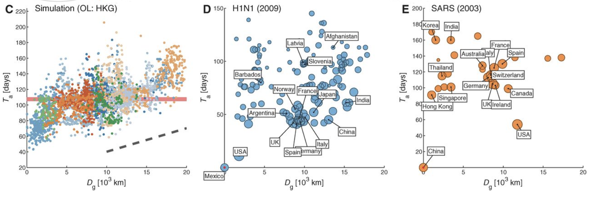
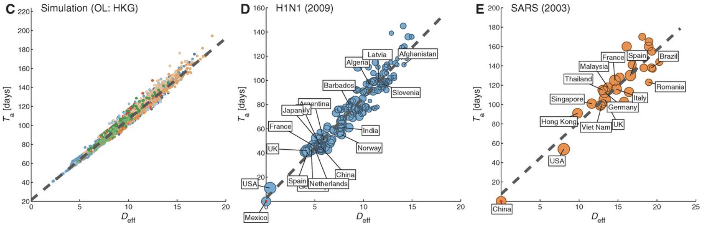
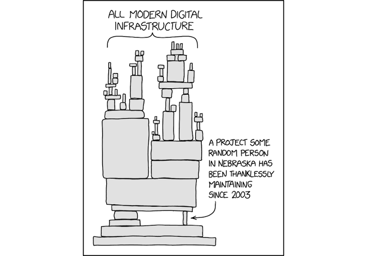
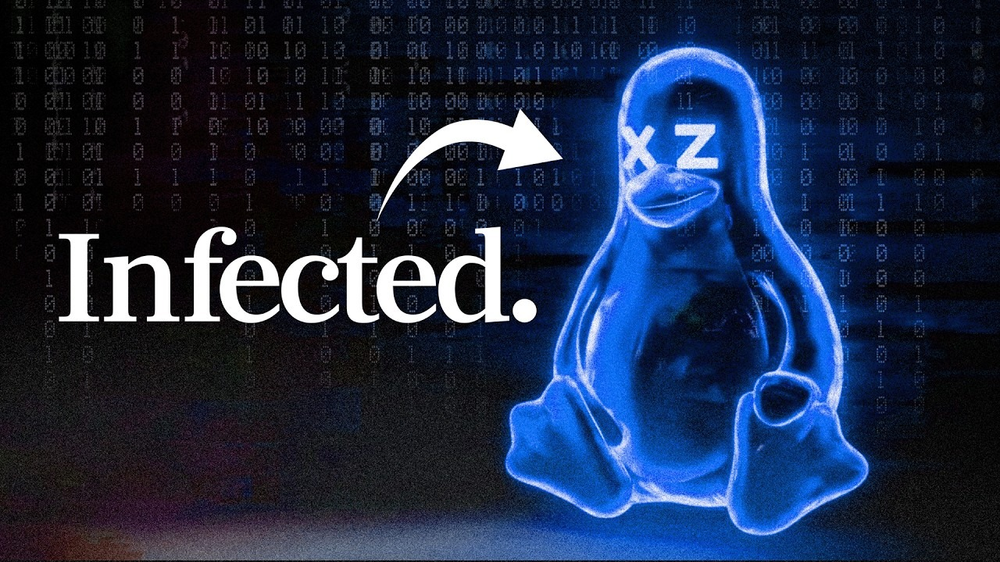
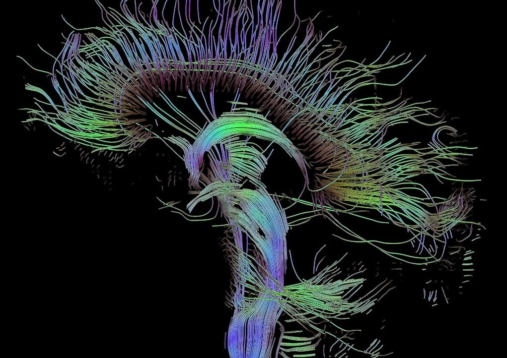
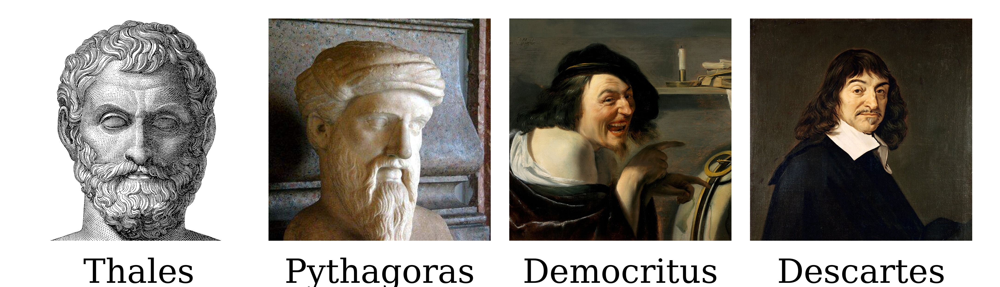
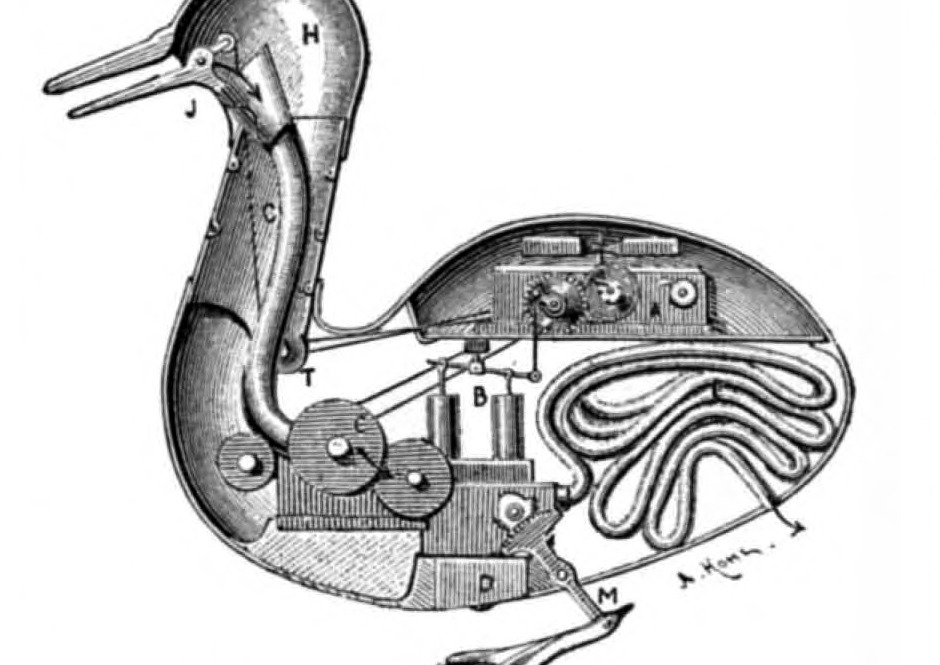
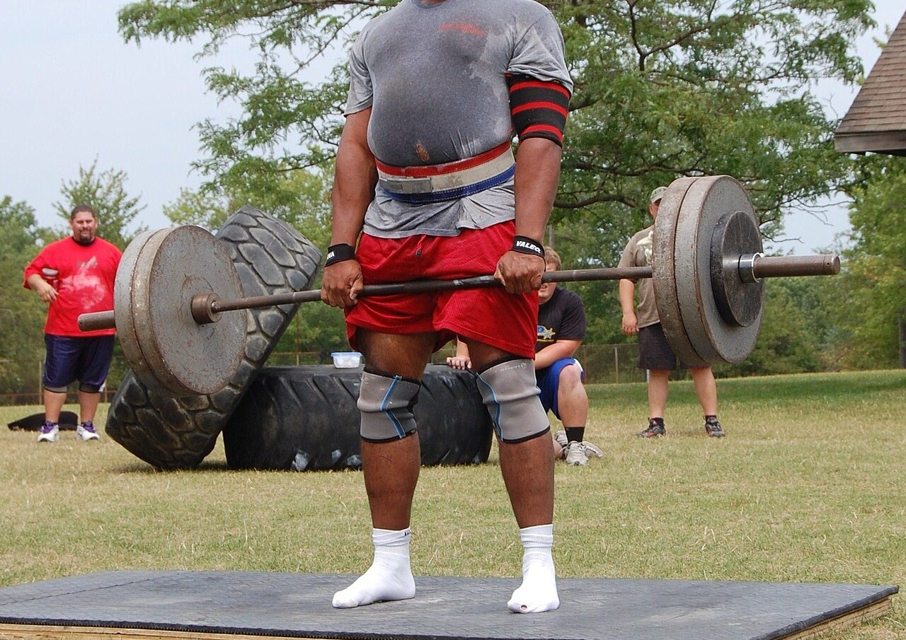

<!-- _class: mid -->

## Before we start

- Microphone on
- Zoom room open
- Recording started
- Sound volume up

---

<!-- _class: lead -->

Advanced Topics in Network Science · Session 01

# Networks

A flu, a bank and the login program on your server fail in the same way, and that is not a coincidence

Sadamori Kojaku · Binghamton University

<!--
Open on the outbreak, not on definitions. The whole first part is one story.
-->

---

## Roadmap

01

Introduction

02

The same story, everywhere

03

What makes a network a network

04

How this course works

---

<!-- _class: mid -->

## Course overview

- Instructor: Sadamori Kojaku, skojaku@binghamton.edu
- Class: Tuesday and Thursday, 9:45–11:15, J01 Engineering
- Office hours: Friday, roughly 13:00–15:00
- Course site: <a href="https://skojaku.github.io/adv-net-sci">skojaku.github.io/adv-net-sci</a>

---

<!-- _class: part -->

  
Part 1: Introduction

  
01 / 04

## April 2009: a new flu leaves Mexico

Nobody has immunity, and every border is a guess about where it goes next.

---

<!-- _class: mid -->

## Where does it surface first?

The 2009 H1N1 pandemic starts in Mexico. Name the first country outside Mexico with a confirmed case, and the second one.

* Neighbours first, then outward in rings?
* The largest countries first?
* Something else?
* *Form a group and discuss. Thirty seconds.*

---

<!-- _class: mid -->

## First the United States. Then Spain.

Spain is nine thousand kilometres from Mexico City. Guatemala shares a border with Mexico, and was reached later.

---

## Kilometres predict nothing

Arrival time against distance in kilometres. One dot per country.

<figcaption>A cloud, not a line, in all three panels (Brockmann and Helbing, Science, 2013).</figcaption>

---

## Flights predict it exactly

The same arrival times, with distance now counted along air routes.

<figcaption>Same three panels, one axis changed, and every country falls on a line.</figcaption>

---

## Drag the ruler yourself

<figure class="anim-stage" id="h1n1-ruler">
  

    

    

    <button class="anim-btn" type="button" data-anim-prev aria-label="Previous step">◀</button>
    <button class="anim-btn" type="button" data-anim-play>⏸ Pause</button>
    <button class="anim-btn" type="button" data-anim-next aria-label="Next step">▶</button>
    <button class="anim-btn" type="button" data-anim-replay>↻ Replay</button>
  

  

    

    

  

  <figcaption class="anim-note" data-anim-note></figcaption>
</figure>

---

<!-- _class: part -->

  
Part 2: The same story, everywhere

  
02 / 04

## Epidemics are not a special case

---

## 15 September 2008

Lehman Brothers files for bankruptcy. One firm, out of thousands.

* Within days, banks stop lending to each other worldwide.
* Why should one failure do that?
* *Form a group and discuss. Thirty seconds.*

---

## Banks are a network

Each dot is a bank; each line is money one bank owes another, due tomorrow morning.

<figcaption>Your bank never lent Lehman a cent, and sees only its own neighbours.</figcaption>

---

## The default walks

Whoever lent to a failed bank is now missing money, and may fail in turn: **cascading default**.

<figcaption>Red has failed. Nobody on the path saw the loss coming from four steps away.</figcaption>

---

## 29 March 2024

A hobby project compresses files. One person maintains it, unpaid, for years.

* How does a backdoor in that project reach the login program of nearly every Linux server on Earth?
* *Form a group and discuss. Thirty seconds.*

<figcaption>xkcd 2347, "Dependency".</figcaption>

---

## What a compression library touches

xz compresses files. Nothing about it is security-critical until you follow what links against it.

<figcaption>Each arrow reads "is built into". Four steps separate a compression library from the program that authenticates every remote login.</figcaption>

---

## Two years, one volunteer

Whoever maintains the first box in that chain controls everything downstream of it.

<figcaption>A new contributor helped for about two years, became a maintainer, and shipped hidden code in version 5.6.0 that reached sshd on Fedora and Debian test builds.</figcaption>

---

## It was caught by half a second

<figcaption>Andres Freund noticed logins to a test machine had slowed, went looking, and found the backdoor before it reached a stable release. Nobody had audited the trust; a stopwatch caught it.</figcaption>

---

## How the backdoor actually worked

A walk through the payload itself, if you want the detail.

<a href="https://www.youtube.com/watch?v=aoag03mSuXQ">youtube.com/watch?v=aoag03mSuXQ</a>

<figcaption>Click the link, or paste the id into YouTube.</figcaption>

---

## Same shape, three worlds

Different material, one question: **who is connected to whom?**

<figcaption>A virus travels the first, a loss the second, a backdoor the third. The reasoning that works on one works on the others.</figcaption>

---

<!-- _class: mid -->

## Your turn: name a network

* Write down three networks you are part of right this minute.
* For each one, write one way it could fail.
* *One minute, on paper.*

---

<!-- _class: mid -->

## Let's collect a few

Two failures, very different reach:

* Your home router dies. You are offline; nobody else notices.
* Your bank's card processor dies. Every shop in town stops taking cards.
* *Which of yours is the router, and which is the processor?*

---

## Ones that are easy to miss

Remove one insect and the plants only it visits go with it.

Which plant here is safest? Which is one extinction away from trouble?

<figcaption>A line means that insect visits that plant.</figcaption>

---

## The network you are using right now

Eighty-six billion neurons. What you are following this sentence with is the wiring between them.

<figcaption>Long-distance fibre tracts of one human brain, reconstructed from diffusion MRI.</figcaption>

---

<!-- _class: mid -->

## Four more, with their failures

- The power grid: one line sags into a tree in Ohio, and 50 million people lose power (2003).
- Your gut: a few hundred bacterial species trading chemicals, and an antibiotic deletes nodes.
- Shipping: one ship wedged in the Suez Canal, and European factories stop (2021).
- Words: which word follows which, which is the only thing a language model ever sees.

---

<!-- _class: part -->

  
Part 3: What makes a network a network

  
03 / 04

## Dots and lines are three centuries old

So what is new, and why does it need its own field?

---

## Isn't this just graph theory?

* Mathematicians have studied dots and lines since Euler.
* Their favourite objects are regular: every node alike, every neighbourhood alike.
* *So what is left for us to do?*

<figcaption>Every node here has the same neighbourhood, so one proof covers all of them.</figcaption>

---

## Real networks are not like that

A handful of nodes carry an enormous share of the links. Most carry very few.

No two neighbourhoods look alike, so one proof no longer covers all of them.

<figcaption>Routed paths across the Internet, drawn by the Opte Project.</figcaption>

---

## For 2500 years, the same move

Water, number, atoms, method: four attempts to reduce the world to something simpler.

<figcaption>Two millennia apart, one shared instinct: cut the world into its simplest parts.</figcaption>

---

## The reductionist bet

* Break the system into parts.
* Understand each part.
* Reassemble, and you understand the whole.

<figcaption>Inside Vaucanson's duck, 1739: an automaton built to prove that digestion is clockwork.</figcaption>

---

## A thought experiment

* You are an alien scientist studying humans.
* You know every neuron and every synapse, exactly.
* *Can you say what this person will dream tonight?*

<figcaption>John von Neumann, who was fond of this kind of question.</figcaption>

---

## Knowing the parts is not knowing the system

* Every neuron, but not the dream.
* Every person, but not the protest.
* Parts never act alone; they act on each other.
* **The relationships are the object of study.**

<figcaption>Same four parts in both rows. Only the lower row can carry anything between them.</figcaption>

---

## Who studied relationships first?

In 1736 Euler was handed a puzzle about a walk through a city, and answered it by throwing the city away, keeping only what was connected to what.

<figcaption>Leonhard Euler, 1707–1783.</figcaption>

---

## Seven bridges, one walk

Königsberg had four landmasses joined by seven bridges.

* Can you cross every bridge exactly once?
* *Two minutes, on paper.*

<figcaption>Four landmasses, seven bridges, and nothing else about the city.</figcaption>

---

<!-- _class: part -->

  
Part 4: How this course works

  
04 / 04

## The rest of this hour is logistics

How the course is built, and why it is built that way.

---

<!-- _class: mid -->

## What you will be able to do

* Analyse real networks at real size.
* Use the concepts the field is built on.
* Apply AI tools to network problems, and check their answers.
* Read a network science paper, and design your own study.

---

## Learning is training

* Nobody gets stronger by watching someone else lift.
* You get stronger by lifting, badly at first.
* Class is the gym: paper, pair programming, code that runs.
* **Train until you can feel a concept**, not just define it.

<figcaption>The part that builds strength is the part that is hard.</figcaption>

---

<!-- _class: mid -->

## Every module opens on paper

* You solve it alone first.
* Then you compare with the person beside you.
* Bring a pen.

<figcaption>No laptop for the first fifteen minutes: the mistake has to be yours before the fix means anything.</figcaption>

---

<!-- _class: mid -->

## Play it before you learn it

* Most modules ship an interactive game.
* Winning it needs the concept you have not been taught yet.
* You learn the concept by learning to win.

<a href="https://skojaku.github.io/adv-net-sci/assets/vis/vaccination-game.html">Open the vaccination game</a>

---

<!-- _class: mid -->

## Weekly quiz

* Every class opens with a short written quiz on last week. Online students submit through Brightspace.
* You work it out on paper, then submit through the course quiz form: the answers go in directly, and you photograph your working into the same form.
* Sign in with your Binghamton account. That is how the answer reaches your name.
* You may retake it, and your best attempt is the one that counts.

---

<!-- _class: mid -->

## Everything is handed in through GitHub

* You need a **GitHub account**, and you need to accept the invitation to the course organization. Until you do, no grade can reach you.
* Each assignment hands you a **private repository** of your own, through **Classroom 50**.
* You clone it, work in it, and **push** it back. Nothing is emailed and nothing is uploaded by hand.
* Two of them, from Module 2 on: one you do alone, one you do in a team.

---

<!-- _class: mid -->

## Pair Notebook: hand in the conversation

* One per module for modules 2 to 6, on your own.
* A module taught as a tutoring session: an **AI tutor** in your terminal, and a **marimo** notebook filling up beside it in your browser.
* Sixty to ninety minutes. Stop anywhere and pick it up later.
* What is read is how you reasoned, not whether your code ran. Needing hints is not penalized.

---

<!-- _class: mid -->

## Group Mini-Project: the same ideas, on real data

Exactly one person accepts the assignment. Everybody else waits to be invited.

* Teams of up to three, in class, for modules 2 to 6.
* One shared repository, **autograded** on every push, and one score for the whole team.
* Three teammates each clicking accept makes three one-person repositories that cannot be merged afterwards.
* Sort out who accepts before anyone clicks.

---

<!-- _class: mid -->

## Set up your machine, once

Twenty minutes, before the second week: <a href="https://skojaku.github.io/adv-net-sci/course/setup.html">skojaku.github.io/adv-net-sci/course/setup.html</a>

* **git** keeps the history of your work, and is what hands it in. On Windows, install **Git for Windows**: it brings Git Bash, a terminal that understands the same commands as a Mac.
* **uv** fetches Python and runs the notebooks, so you never install Python yourself.
* **Node.js** is what your AI tutor runs on.
* Your **course API key** arrives by email in the first week and goes in your shell profile.

---

<!-- _class: mid -->

## Student Lecture

* Thirty-five topics, on the course site: <a href="https://skojaku.github.io/adv-net-sci/course/student-lecture.html">skojaku.github.io/adv-net-sci/course/student-lecture.html</a>
* You claim one, and build a 15 to 20 minute lecture on it.
* An interactive part is required: a worksheet, an exercise the room works through, live coding.
* A talk with no activity does not count, however good the talk is.

---

## Where the grade comes from

One square is one percent.

<figcaption>There are no bonus points this year: the hundred squares on this slide are the whole grade.</figcaption>

---

<!-- _class: mid -->

## Exam

* One final exam covering all topics.
* Multiple choice, take-home.
* Submitted through Brightspace.
* Exam week: **10 to 16 December 2026**.

---

<!-- _class: mid -->

## Final project

* Individual, thirty percent of the grade.
* Anything in network science: a new method, a visualization, a case study, a literature review.
* Proposal **Sun 27 Sep** · presentations **1 and 3 Dec** · paper **Sun 6 Dec**.

---

## From a previous year: a map of research topics

Papers are the nodes; a citation is a link.

Clusters are fields. The interesting papers are the ones sitting on a bridge between two of them.

<figcaption>Each blob is a research community that nobody labelled in advance.</figcaption>

---

## From a previous year: a brain, wired by correlation

Electrodes are the nodes. A link means two signals rise and fall together.

Nothing here is a physical wire; the network is inferred from the recording.

<figcaption>Electrocorticography: electrodes resting directly on the cortex.</figcaption>

---

## From a previous year: where to put the next charger

Chargers are the nodes; a drivable hop is a link.

The question was which single new charger shortens the most journeys.

<figcaption>Tesla superchargers, with the road network as the thing that connects them.</figcaption>

---

<!-- _class: mid -->

## Where everything lives

- Lecture notes: <a href="https://skojaku.github.io/adv-net-sci">skojaku.github.io/adv-net-sci</a>
- Everything else: <a href="https://github.com/skojaku/adv-net-sci/">github.com/skojaku/adv-net-sci</a>

---

<!-- _class: mid -->

## Discord

* Questions about lectures, assignments and setup; announcements; finding teammates.
* Four channels: welcome, network-science, artifacts, random.
* Nothing on Discord is graded. Ask half-formed questions there; that is what it is for.
* The invitation link comes through Brightspace.

---

<!-- _class: mid -->

## Attendance

- Attendance is taken every class.
- Residential students: on paper, in the room.
- Online students: the assignment submission in each module counts as your attendance.

---

<!-- _class: mid -->

## Missing a class

Two things, and you need both:

- Submit the absence form: <a href="https://forms.gle/yhzHoMSaKCRJXdGm7">forms.gle/yhzHoMSaKCRJXdGm7</a>
- Email me as well, ideally the day before.

**An absence that is not on the form is not counted**, however good the reason was.

---

<!-- _class: mid -->

## Policy

- Three credits means 6.5 or more hours of work a week outside class.
- AI tools are allowed for learning; cite them when you use them in an assignment.
- Back up your code; a lost laptop is not an extension.
- Accommodations are available; academic dishonesty is not.

---

<!-- _class: mid -->

## Before you go

Earlier you each wrote down three networks you belong to.

* Which of them would you want to study for the project?
* What would you have to measure before you could say anything about it?
* *Bring one answer to the next class.*

---

<!-- _class: lead -->

# Questions?

Next time: Euler, seven bridges, and the first proof about a network

