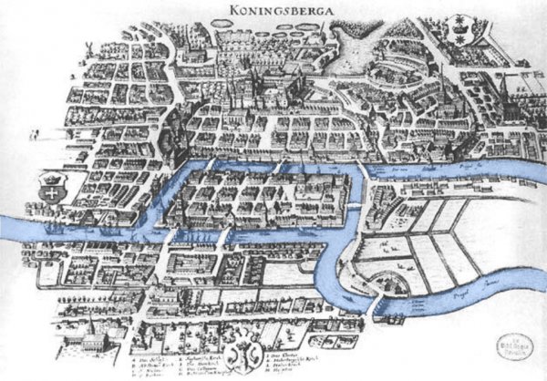

<!-- _class: lead -->

Advanced Topics in Network Science · Module 01

# Seven Bridges

A stroll, a puzzle, and the birth of graph theory

Sadamori Kojaku · Binghamton University

<!--
Open with the story, not the definitions. Königsberg is the hook; abstraction is the point of the whole course.
-->

---

## Roadmap for today

01

The puzzle — seven bridges, one frustrating walk

02

Abstraction — landmasses → nodes, bridges → edges

03

Degree and Euler — parity decides what is possible

04

Vocabulary — walk, trail, path, circuit, cycle

05

Connectivity — components and the giant component

06

Direction — in/out-degree, strong vs. weak

07

Representation — the adjacency matrix, its powers, and sparsity

08

Edge cases — the graphs that break the rules

---

<!-- _class: part -->

Part One01 / 08

## The puzzle

An 18th-century Sunday stroll that mathematics could not ignore

Lecture note — *Königsberg, 1736: seven bridges and a Sunday walk*

---

## The Königsberg bridge problem

18th-century Königsberg (today Kaliningrad). Two islands in the Pregel, linked to the mainland by seven bridges.

Cross each bridge exactly once and return to the start?

<figcaption>the shape you're about to erase</figcaption>

---

## Your turn

Click a bridge to cross it. [Worksheet (Esteban Moro)](http://estebanmoro.org/pdf/netsci_for_kids/the_konisberg_bridges.pdf)

<figure class="anim-stage" id="kb-tracer">
  

    

    

    <button class="anim-btn" type="button" data-anim-prev aria-label="Previous step">◀</button>
    <button class="anim-btn" type="button" data-anim-next aria-label="Next step">▶</button>
    <button class="anim-btn" type="button" data-anim-replay>↻ Replay</button>
  

  

    

    

  

  <figcaption class="anim-note" data-anim-note></figcaption>
</figure>

<!-- Deck-wide, and it must run before the first anim.js: every stage in this
     deck steps by hand. Nothing advances itself while the room is talking. -->

---

<!-- _class: part -->

Part Two02 / 08

## Abstraction

Strip the map until only relationships remain

Lecture note — *Euler throws away the map*, and *What a graph is, formally*

---

## What can you throw away?

Look again — the puzzle survives even if you erase almost everything here.

Does the puzzle depend on bridge length? Island area? River width? Which bank you start from?

<figcaption>what actually matters here?</figcaption>

---

## Euler's approach

Euler answered: keep only what connects to what.

Notice the coastlines already fading in the figure

<figcaption>N, A, B, S now labelled — the cut comes next</figcaption>

---

<!-- _class: mid -->

## Euler's move — each landmass becomes a node

Four landmasses and dots. Only a label remains.

<figcaption>four dots, still no lines between them</figcaption>

---

<!-- _class: mid -->

## Euler's move — each bridge becomes an edge

Every bridge becomes a line joining two dots: a **graph**.

1736: this abstraction founds **graph theory** — substrate for social, transport, brain, Internet analysis.

<figcaption>seven edges in all — two pairs doubled, island A touching five</figcaption>

---

<!-- _class: mid -->

## A graph, written down

$$ G = (V, E) $$

$V$ = **nodes** · $E$ = **edges** (pairs of nodes).

For Königsberg: four landmasses, seven bridges.

<figcaption>the abstracted city</figcaption>

---

## The word for a doubled pair

* **multi-edge**: multiple edges running between the same pair
* **multigraph**: a graph with multi-edges

---

<!-- _class: part -->

Part Three03 / 08

## Degree and Euler’s theorem

Lecture note — *From a walk to a proof: the idea of degree*. The converse we skip: appendix, *Why Euler's conditions are enough*

---

<!-- _class: mid -->

## Degree

The **degree** $k_i$ is the number of edges attached to node $i$.

Count every edge touching the node.

---

<!-- _class: mid -->

## Question 2: roads get spent two at a time

Every dashed line joined an arrival to a departure.

* Even city — every road finds a partner.
* Odd city — one road is left alone.
* The leftover has nowhere to go except the start or the end.

<figcaption>three edges at this node: one pair, one leftover</figcaption>

---

## A graph with such a walk has at most two odd nodes

**Euler's theorem** (half of it): if a walk crosses every edge exactly once, then

$$ \#\{\text{odd nodes}\} = 0 \text{ or } 2 $$

---

## The verdict

Question 3's table, on Euler's map.

* Degrees: 3, 5, 3, 3
* All four odd
* Rule: a cross-every-edge walk allows at most 2 odd
* Impossible.

<figcaption>now labelled — red marks odd degree</figcaption>

---

## Eulerian path

An **Eulerian path** uses every edge once — exists exactly when 0 or 2 nodes are odd, on a connected graph.

“Eulerian path” is the traditional name; strictly it is an Eulerian **trail** — Question 4(c)'s drive repeated a city.

That the condition is also *enough* — such a walk always exists — we use without proving.

<figcaption>two odd nodes</figcaption>

---

## Eulerian circuit

Ending where you began leaves no start and no finish — no node can absorb a leftover edge.

* For an **Eulerian circuit**, every node must be even.
* Königsberg fails either way — four odd nodes is neither 0 nor 2.

<figcaption>cross all six edges, end where you began</figcaption>

---

## Watch the trail get built

Two odd corners, six edges. Step through it, then trace one yourself.

<figure class="anim-stage" id="euler-builder">
  

    

    

    <button class="anim-btn" type="button" data-anim-prev aria-label="Previous step">◀</button>
    <button class="anim-btn" type="button" data-anim-next aria-label="Next step">▶</button>
    <button class="anim-btn" type="button" data-anim-replay>↻ Replay</button>
  

  

    

    

  

  <figcaption class="anim-note" data-anim-note></figcaption>
</figure>

<!--
The deck proves only the easy half; this is the converse doing its work. Beats: 1 two odd corners, in red, and Euler allows two. 2 open on TL and all six go, finishing on the other odd corner — not luck, the spare edge-end at an odd corner can only be a start or a finish. 3 open on BL, an even corner, and you strand at five with TL–BL nowhere near: two odd corners want both ends of the walk and BL took one. 4 lay a second TL–TR, every degree goes even, there is no end left to be, so the trail has to close. 5 hand it over — the part students never believe until they try it is step 3.
-->

---

## Which two bridges would you destroy?

You want to make the walk possible.

*Turn to your neighbor — 30 seconds.*

<figcaption>work from the degrees</figcaption>

---

## A tragic epilogue

World War II. Königsberg is bombed and two bridges are destroyed.

* Five bridges remain. Only two landmasses are left odd.
* The 200-year impossible walk becomes possible — by accident of war.

<figcaption>two odd → now possible</figcaption>

---

<!-- _class: part -->

Part Four04 / 08

## Vocabulary

Name the journeys precisely

Lecture note — *Five Words You Will Use All Semester*, with the route-namer you can click

---

<!-- _class: mid -->

## Walk

A **walk** is any route through the graph. Nodes may repeat. Edges may repeat.

You named three of these in Question 4.

<figcaption>the route: Dorm → Cafe → Gym → Cafe → Lib</figcaption>

---

<!-- _class: mid -->

## Trail

A **trail** is a walk that never uses the same edge twice.

Nodes may still repeat.

<figcaption>the route: Lib → Gym → Dorm → Cafe → Gym</figcaption>

---

## Path

A **path** is a walk that never uses the same node twice — and so never the same edge either.

Every path is a trail; not every trail is a path.

<figcaption>the route: Lib → Cafe → Dorm → Gym</figcaption>

---

<!-- _class: mid -->

## Circuit

A **circuit** is a closed trail — back to the start, no edge repeated.

<figcaption>a node may be revisited; an edge may not</figcaption>

---

<!-- _class: mid -->

## Cycle

A **cycle** is a closed path — back to the start, no node repeated.

<figcaption>nothing repeats (red: the cycle traced)</figcaption>

---

<!-- _class: part -->

Part Five05 / 08

## Connectivity

Euler’s theorem quietly assumed you can get everywhere

Lecture note — *When a network falls apart*: components, the giant component, flood fill

---

## Components

* A graph that is not connected splits into **connected components** — maximal mutually-reachable sets.
* A single isolated node counts too — a component of one.

<figcaption>three components, no edge crosses between them</figcaption>

---

## Run the sweep

Click any unmarked node to sweep from it — the amber ring is the frontier.

<figure class="anim-stage" id="comp-sweep">
  

    

    

    <button class="anim-btn" type="button" data-anim-prev aria-label="Previous step">◀</button>
    <button class="anim-btn" type="button" data-anim-next aria-label="Next step">▶</button>
    <button class="anim-btn" type="button" data-anim-replay>↻ Replay</button>
  

  

    

    

  

  <figcaption class="anim-note" data-anim-note></figcaption>
</figure>

<!--
Beats: 1 twelve nodes, and no way to see how many pieces. 2 rings out of L0, frontier amber, and the number on a node is its distance from the seed. 3 four left, seed again, and R0 alone is still a component — no pair inside it to fail the test. 4 each node entered once and each edge looked at twice, so O(N + M): thirteen edges, not seventy-eight pairs. 5 let two or three students pick the seeds. The payoff is that the order they choose changes the numbers on the nodes and nothing else — the partition is the graph's, not theirs.
-->

---

<!-- _class: mid -->

## A component has 1,000 nodes. Is it giant?

Giant, or not? What do you need to know first?

*Take 30 seconds.*

---

## The giant component

It depends on $N$. The same 1,000 nodes are giant in a network of 1,200 — and negligible in one of ten million.

* A component is **giant** when it holds a finite fraction of all nodes as $N$ grows.
* In practice: extract it and work there. *Whether* one exists is Module 3's question.

<figcaption>83% of the network on the left, 0.01% on the right</figcaption>

---

<!-- _class: part -->

Part Six06 / 08

## Direction

Point every edge one way — degree and connectivity both split in two

Lecture note — *When edges have direction*. The Euler rule for arrows: appendix, *The same rule when edges have direction*

---

<!-- _class: mid -->

## Edges with direction

In a **directed** graph, each edge has an orientation — reachable one way doesn't mean reachable back.

<figcaption>C receives from both A and B; nothing leaves C</figcaption>

---

<!-- _class: mid -->

## In-degree and out-degree

Each node now has two counts: **in-degree**, edges arriving, and **out-degree**, edges leaving.

<figcaption>A→B→C→A — each arrow both leaves and arrives once</figcaption>

---

<!-- _class: mid -->

## Strongly connected

A graph is **strongly connected** when a directed path runs from every node to every other.

<figcaption>A→B→C→A: one loop reaches every node from every node</figcaption>

---

<!-- _class: mid -->

## Weakly connected

Connected once you ignore direction. A weaker requirement — every strongly connected graph is **weakly connected**, but the converse fails.

One-way streets get you out, not necessarily back.

<figcaption>no directed route returns to A</figcaption>

---

## Turn an arrow round

Click a street to turn it round. Six of the 64 orientations survive.

<figure class="anim-stage" id="dir-reach">
  

    

    

    <button class="anim-btn" type="button" data-anim-prev aria-label="Previous step">◀</button>
    <button class="anim-btn" type="button" data-anim-next aria-label="Next step">▶</button>
    <button class="anim-btn" type="button" data-anim-replay>↻ Replay</button>
  

  

    

    

  

  <figcaption class="anim-note" data-anim-note></figcaption>
</figure>

<!--
Strong and weak sat on two figures two slides apart, which makes them look like two graphs. They are one graph and two questions. The number beside a corner is how many of the other four it reaches, so five fours is the verdict and the drawing carries it. Beats: 1 the counts appear, all four. 2 flood from A and from C so the number means something. 3 turn the chord round and nothing moves — that street's direction is free, because it is not on the only cycle through all five corners. 4 turn A–B round as well: both of A's streets now point in, A drops to zero, and one beat with the arrowheads rubbed out shows weak surviving what strong did not. 5 hand it over. Ask for a guess first: six of the 64 work, and in every one of the six each corner sits on a directed cycle. Flipping the chord turns any of them into another, so the room finds them in pairs.
-->

---

<!-- _class: part -->

Part Seven07 / 08

## Representation

How you store a network shapes what you can ask it

Lecture note — *Three ways to write a network down* and *The adjacency matrix, and what its powers count*. CSR: appendix, *Storing a matrix that does not fit*

---

<!-- _class: mid -->

## How would you store a network?

A million nodes. Answer *who are node 7's neighbors?* — a billion times.

How would you lay this out in memory?

*30 seconds with your neighbor.*

---

## Adjacency matrix

$$
A_{ij} =
\begin{cases}
1 & i \sim j \\
0 & \text{otherwise}
\end{cases}
$$

The **adjacency matrix**: an $n \times n$ grid of 0s and 1s. It opens the door to linear algebra, but costs $O(n^2)$ even when nearly all zero.

A pair lights two cells — the matrix is symmetric.

<figcaption>row 1 (red): 1s at columns 0, 2, 3 — node 1's three neighbors</figcaption>

---

## Three representations

Each is good at something the others are not.

* **Edge list** — one pair per edge. Compact, and what a data file looks like; “who are $i$'s neighbours?” costs a scan of everything.
* **Adjacency list** — each node's neighbours, kept together. Traversal is cheap, which is what the component sweep needed.
* **Adjacency matrix** — the grid. Buys linear algebra, at $O(n^2)$ whether or not the edges are there.
* Degree comes off each differently: count a node's appearances, take a list's length, sum a row.

---

## One graph, three structures

Six edges, filed three ways. Watch what each one makes easy.

<figure class="anim-stage" id="rep-three">
  

    

    

    <button class="anim-btn" type="button" data-anim-prev aria-label="Previous step">◀</button>
    <button class="anim-btn" type="button" data-anim-next aria-label="Next step">▶</button>
    <button class="anim-btn" type="button" data-anim-replay>↻ Replay</button>
  

  

    

    

  

  <figcaption class="anim-note" data-anim-note></figcaption>
</figure>

<!--
The graph is the same five nodes as the walk-counting stage and the CSR knob two slides on — say so, it is the whole reason they are one picture. Beats: 1 the graph, and the room's answer to "how would you store this". 2 six pairs, and the cost line is the one to say aloud: a neighbour question scans everything. 3 the same six edges filed twice, once under each endpoint, and the highlight walks down the graph so the rows read as nodes. 4 the thirteen empty cells are the price, and the mirror across the diagonal is one edge lighting two cells. 5 the payoff: node 1 is degree 3 three different-looking ways. Ask which they would pick before you show it.
-->

---

<!-- _class: mid -->

## Multiply $A$ by itself. What does one entry mean?

$$ \mathbf{A}^2 $$

Compute entry $(1,4)$ by hand. What does it count?

*30 seconds — use the five-node graph from the last slide.*

---

<!-- _class: mid -->

## Now predict $A^3$ and $A^4$

Without multiplying it out — what will entries of $\mathbf{A}^3$ and $\mathbf{A}^4$ count?

*30 seconds — extend the pattern.*

---

## $A^k$ counts walks

$$ (\mathbf{A}^k)_{ij} = \#\{\text{walks of length } k \text{ from } i \text{ to } j\} $$

Walks, not paths — repetition is allowed. Later modules reuse this for clustering and centrality.

<figcaption>red route 1–2–4, purple route 1–3–4 — both land in cell (1,4)</figcaption>

---

## Where the count comes from

The two routes, drawn — then the row-times-column that produces the same 2.

<figure class="anim-stage" id="walk-power">
  

    

    

    <button class="anim-btn" type="button" data-anim-prev aria-label="Previous step">◀</button>
    <button class="anim-btn" type="button" data-anim-next aria-label="Next step">▶</button>
    <button class="anim-btn" type="button" data-anim-replay>↻ Replay</button>
  

  

    

    

  

  <figcaption class="anim-note" data-anim-note></figcaption>
</figure>

<!--
Beats: 1 no single edge joins 1 to 4, so the cell is zero. 2 two two-step routes, counted by hand, and squaring the matrix puts that 2 in the cell. 3 the same number as row 1 against column 4 — a term counts only where both factors are 1, which is to say at a real middle node. 4 the one to linger on: entry (1,1) of A squared is three, out and straight back once per neighbour, so the diagonal is the degree — and that is only true because walks may repeat. 5 drag the knob rather than stepping it, the growth is the point. The diagonal of A cubed counts each triangle twice, which is where Module 2's clustering comes from.
-->

---

<!-- _class: mid -->

## A dense matrix for eight billion people — how much memory?

Every human on Earth, a node. Store the full $n \times n$ matrix, dense, one byte per entry.

Guess before you compute — kilobytes? Gigabytes? More?

*30 seconds.*

---

<!-- _class: mid -->

## 64 exabytes

$$ n = 8\times10^{9} \qquad n^2 \times 1\text{ byte} = 6.4\times10^{19}\text{ bytes} \approx 64\text{ EB} $$

More storage than most data centers hold, just to record who is *not* connected.

---

## Store only the nonzeros

Most pairs aren't linked — store only what's there. The **Compressed Sparse Row (CSR)** format keeps three arrays: **indptr** where each row starts, **indices** the column of each nonzero, **data** the values.

<figure class="anim-stage" id="csr-rows">
  

    

    

      
<b>indptr</b>

      
<b>indices</b>

      
<b>data</b>

    

  

  

    

  

  <figcaption class="anim-note" data-csr-out></figcaption>
</figure>

---

## Reading a graph off CSR — and when not to bother

Cover the picture and use only the two arrays:

* Degree of node $i$ is $\texttt{indptr}[i{+}1] - \texttt{indptr}[i]$ — a subtraction, no search.
* Its neighbours are $\texttt{indices}[\texttt{indptr}[i] : \texttt{indptr}[i{+}1]]$ — a slice, already contiguous.
* What it is bad at is **insertion**: one new edge shifts everything after it.
* So **dense beats sparse** on graphs that are small, nearly complete, or changing constantly. CSR pays off on the large, fixed, mostly-empty ones — which is what real networks are.

---

<!-- _class: part -->

Part Eight08 / 08

## Edge cases

The graphs that break the rules

Lecture note — appendix, *Why Euler's conditions are enough*

---

<!-- _class: mid -->

## Does a self-loop add 1 to a node's degree, or 2?

Degree = edges attached to a node. A self-loop is one edge — but touches the node at both ends.

30 seconds: does it count once, or twice?

<figcaption>both ends attach here</figcaption>

---

<!-- _class: mid -->

## Two

Both endpoints attach at the same node, so a self-loop contributes 2 to its degree.

This keeps the parity argument intact — a self-loop adds an even number, so it never changes a node's parity.

<figcaption>1 and 2 mark where the loop leaves and returns</figcaption>

---

<!-- _class: mid -->

## Every node has even degree, and yet there is no Euler circuit. How?

Picture a graph where every node has degree 2 — parity satisfied.

The lab's last task — hold up the map you built.

---

<!-- _class: mid -->

## The graph is in two pieces

Parity alone isn't enough — Euler's theorem also requires **connectivity**. A single walk can't jump between components, however even their degrees.

<figcaption>two squares, each still degree 2 — no edge between them</figcaption>

---

## Back to Königsberg

Run both conditions against the seven bridges:

* **Connected?** Yes.
* 0 or 2 odd-degree? No — all four are odd.
* One failure is enough: no circuit, no path.

<figcaption>both conditions, checked against the same graph</figcaption>

---

## Module 01 review

<figcaption>the seven bridges, one last time</figcaption>

* Abstraction (1736): landmasses → nodes, bridges → edges
* **Euler's theorem:** connected, 0 or 2 odd-degree nodes
* **Direction:** in/out-degree, strong vs. weak
* **Connectivity:** components, the giant component
* Representation: the matrix, its powers, sparsity

---

## Coming up in Module 02

### Small worlds

Almost all eight billion people are a handful of friendships away from each other.

Short paths. High clustering. One rewiring model that delivers both at once.

<figcaption>a few shortcuts (red) change everything</figcaption>

