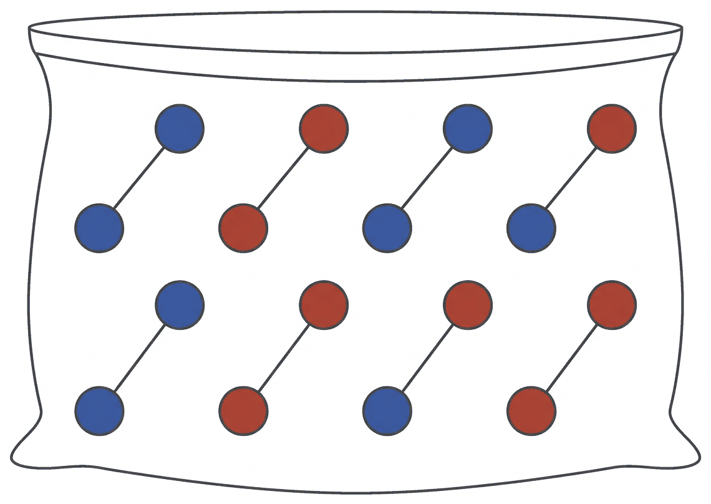
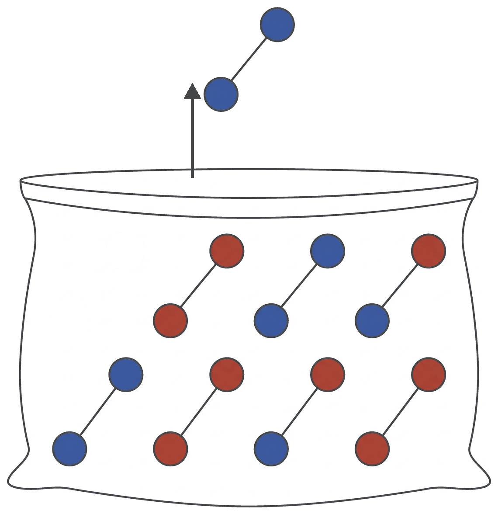
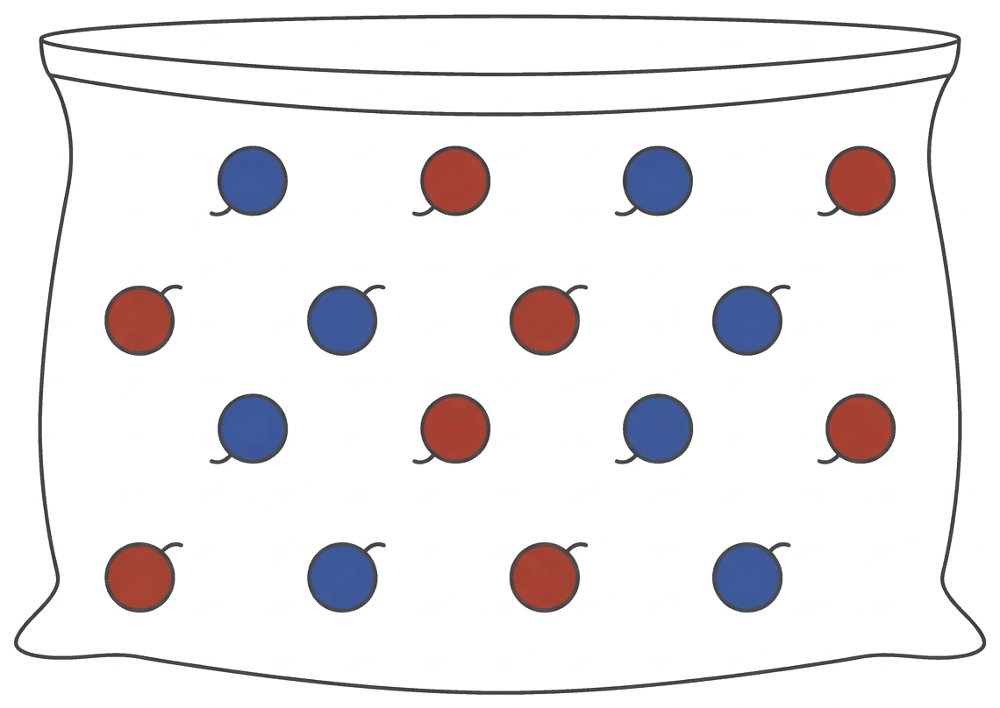

<!-- _class: lead -->

Advanced Topics in Network Science · Module 05

# Community Detection

finding groups in a network

Sadamori Kojaku · Binghamton University

---

<!-- _class: mid -->

## Let's look at a network

<!--
Ask what they see before moving on. Wait for someone to say "groups".
-->

---

## What are these groups?

We call them **communities**. How would we define one?

<!--
Everyone circled the same four groups without a definition. Take one or two attempts at a definition from the room; do not correct them yet.
-->

---

<!-- _class: mid -->

## What is the strongest community?

Draw the most tightly connected group you can think of.

<!--
Thirty seconds on paper. Then ask one student to describe theirs.
-->

---

## A clique: everyone knows everyone

A **clique** is a group where every pair is connected.

We cannot add one more edge inside it.

<figcaption>6 nodes, all 15 pairs connected</figcaption>

---

<!-- _class: mid -->

## Problem solved?

Let's find every clique in the network. Done. Bye!

<!--
Pause and wait for an objection.
-->

---

## Cliques are too strict

Remove one edge, and the group is no longer a clique.

Real groups miss many edges. How can we allow for that?

<figcaption>dashed: the one missing edge</figcaption>

---

<!-- _class: mid -->

## Let's relax the clique in three ways

* **Density**: most pairs are connected
* **Distance**: every pair is a few steps apart
* **Degree**: every member is connected to most of the others

<!--
These are called pseudo-cliques. For degree we take two, the k-plex and the k-core. The lecture note has more (n-clan, n-club, k-truss).
-->

---

## Density: the ρ-dense subgraph

A group of $s$ members is **ρ-dense** if it has at least a fraction ρ of all possible edges.

$$\frac{\text{edges inside}}{s(s-1)/2} \ge \rho$$

<figcaption>5 members, 10 possible edges, 7 present: 0.7-dense</figcaption>

<!--
Goldberg 1984. We report the largest ρ that works.
-->

---

## Example 1: how dense is this group?

Let's find the largest ρ.

---

## Example 1: 0.5-dense

4 members have $4 \times 3 / 2 = 6$ possible edges. 3 are present.

$3/6 = 0.5$

<figcaption>dashed: the 3 missing edges</figcaption>

---

## Example 2: how dense is this group?

Let's find the largest ρ.

---

## Example 2: 0.8-dense

5 members have $5 \times 4 / 2 = 10$ possible edges. 8 are present.

$8/10 = 0.8$

<figcaption>dashed: the 2 missing edges</figcaption>

---

## Distance: the n-clique

A group is an **n-clique** if every pair is at most $n$ steps apart.

<figcaption>red: a farthest pair's 2-step path. A 2-clique.</figcaption>

<!--
Luce 1950. We report the smallest n that works. The path may pass through nodes outside the group; the n-clan and n-club forbid that (lecture note).
-->

---

## Example 1: which n-clique?

Let's find the smallest $n$.

---

## Example 1: a 3-clique

The two ends are 3 steps apart. No pair is farther.

<figcaption>red: the path between the two ends</figcaption>

---

## Example 2: which n-clique?

Let's find the smallest $n$.

---

## Example 2: a 2-clique

Any two outer members are 2 steps apart, through the center.

<figcaption>red: one 2-step path between outer members</figcaption>

---

## Degree: the k-plex

In a **k-plex** of $s$ members, every member is connected to at least $s-k$ of the others.

<figcaption>dashed: missing edges. Each member is connected to at least 3 = 5 − 2 others: a 2-plex.</figcaption>

<!--
Seidman and Foster 1978. A 1-plex is a clique. We report the smallest k that works: k = s minus the smallest number of connections a member has.
-->

---

## Example 1: which k-plex?

Let's find the smallest $k$.

---

## Example 1: a 2-plex

Each member is connected to 2 of the other 3.

$s - k = 2$ with $s = 4$, so $k = 2$.

<figcaption>number: connections inside the group</figcaption>

---

## Example 2: which k-plex?

Let's find the smallest $k$.

---

## Example 2: a 4-plex

Each member is connected to 2 of the other 5.

$s - k = 2$ with $s = 6$, so $k = 4$.

<figcaption>number: connections inside the group</figcaption>

<!--
Same number of connections per member as Example 1, but a bigger group, so a larger k. The k-plex asks for more connections as the group grows.
-->

---

## Degree: the k-core

The **k-core** of a network is the largest group in which every member has at least $k$ neighbors inside the group.

The threshold $k$ does not depend on the group size.

<figcaption>blue: the 3-core. Number: neighbors inside the blue group.</figcaption>

<!--
Seidman 1983. Compare the k-plex: there the requirement s - k rises with the group size s. Here it stays at k.
-->

---

<!-- _class: mid -->

## How do we find the 3-core?

Which nodes belong to the 3-core of this network?

<figcaption>number: degree</figcaption>

<!--
30 seconds. Collect a few answers before the next slide.
-->

---

## Step 1: remove every node with degree below 3

<figcaption>number: degree. Red: degree below 3.</figcaption>

---

## Step 2: update the degrees

Removing a node lowers its neighbors' degrees. One node drops from 3 to 1.

<figcaption>dashed circle: removed. Red: now below 3.</figcaption>

<!--
This node had degree 3 at the start. It looked safe, and it is not in the 3-core. That is why we cannot stop after one pass.
-->

---

## Step 3: repeat until no node is below 3

What is left is the 3-core.

<figcaption>blue: the 3-core. Every member has 3 or more neighbors in it.</figcaption>

---

<!-- _class: mid -->

## The peeling algorithm

To find the k-core:

* Remove every node with degree below $k$
* Update the degrees of their neighbors
* Repeat until no node has degree below $k$

<!--
The order of removal does not change the result: the k-core is unique. The algorithm takes time proportional to the number of edges (Batagelj and Zaversnik 2003), so it runs on networks with billions of edges.
-->

---

## Example 1: find the 2-core

Let's peel this network. Two minutes.

---

## Example 1: the 2-core

The branch goes one node at a time. The node between the square and the triangle stays.

<figcaption>blue: the 2-core. Number: neighbors inside it. Dashed circle: removed.</figcaption>

<!--
Round 1 removes the three nodes of degree 1. The branch node then has degree 1 and goes in round 2. The node on the path between the square and the triangle has degree 2 throughout.
-->

---

## Example 2: find the 3-core

Let's peel this one.

---

## Example 2: the 3-core has two pieces

A k-core does not have to be connected.

<figcaption>blue: the 3-core. Number: neighbors inside it. Dashed circle: removed.</figcaption>

---

## A real network, peeled

The **core number** of a node is the largest $k$ whose k-core contains it.

<figcaption>34 members of a karate club and their 78 friendships. Color: core number (blue 4, red 3, gold 2, gray 1).</figcaption>

<!--
We meet this club properly in Part Two. Counts: core number 4: 10 members, 3: 12, 2: 11, 1: 1. The k-cores are nested: the 4-core sits inside the 3-core, which sits inside the 2-core.
-->

---

<!-- _class: part -->

Part Two02 / 04

## Graph cut

Let's find groups by cutting edges

---

<!-- _class: mid -->

## How would we split this into two groups?

---

## Cut as few edges as we can

**Cut** counts the edges between groups $V_1$ and $V_2$.

$$\text{Cut}(V_1, V_2) = \sum_{i \in V_1} \sum_{j \in V_2} A_{ij}$$

<figcaption>blue, red: the two groups. Thick: the edges we cut.</figcaption>

<!--
A is the adjacency matrix from Module 01: A_ij = 1 if i and j are connected.
-->

---

## It works when the groups are clear

With $K$ groups, Cut counts the edges between different groups. We look for the smallest.

$$\min_{V_1, \dots, V_K} \text{Cut}(V_1, \dots, V_K)$$

<figcaption>thick: the 3 edges we cut. No split into three groups cuts fewer.</figcaption>

---

## Does it always work?

Let's find the smallest cut in this network.

---

## The smallest cut takes one node away

One node against the rest. We don't want this.

<!--
Any node with one edge gives a cut of 1. The minimum cut finds the weakest point of the network, which is rarely a community boundary.
-->

---

## We want balanced groups: ratio cut

$$\text{RatioCut}(V_1, V_2) = \frac{\text{Cut}(V_1, V_2)}{|V_1|\,|V_2|}$$

<figcaption>one node alone: 1/(1 × 8). Balanced (red): 2/(5 × 4). We pick the lower score.</figcaption>

<!--
We minimize. The denominator is largest when the two sides are equal, so the balanced split wins even though it cuts twice as many edges.
-->

---

## Balance by degree: normalized cut

$$\text{NCut}(V_1, V_2) = \frac{\text{Cut}(V_1, V_2)}{\text{vol}(V_1)\,\text{vol}(V_2)}$$

<figcaption>thick: the 2 edges we cut. vol: the sum of degrees in a group. Balanced: 1/112. One node alone: 1/29.</figcaption>

<!--
Shi and Malik 2000. Balancing by volume matters when degrees are uneven: ten hubs and ten leaves are the same size but not the same amount of network. Both ratio cut and normalized cut need K in advance, and finding the best split is NP-hard.
-->

---

## Zachary's karate club

Wayne Zachary recorded friendships in a karate club, 1970 to 1972.

<figcaption>34 members, 78 friendships. The club later split in two.</figcaption>

<!--
A university karate club. The instructor (Mr. Hi) wanted to raise the fees; the administrator (John A.) did not. The club split into two clubs, 17 members each. Zachary 1977, Journal of Anthropological Research 33(4): 452-473.
-->

---

<!-- _class: mid -->

## Game: find the smallest cut

Let's split the club into two groups. Cut as few edges as you can.

[Open the game](https://skojaku.github.io/adv-net-sci/assets/vis/community-detection/index.html?scoreType=graphcut&numCommunities=2&randomness=0.25&dataFile=net_karate.json)

<!--
The page's target is a cut of 1: the one member with a single friend, alone. The next slide shows it. If someone paints everyone one color, the cut is 0 and the page says "even better". Ask whether that is a split: each group needs at least one member.
-->

---

## Karate club: minimum cut

<figcaption>thick: the 1 edge we cut. One member against 33.</figcaption>

<!--
The game's target. Before the next two slides, ask: what will ratio cut and normalized cut do on this network?
-->

---

## Karate club: ratio cut

<figcaption>thick: the 4 edges we cut. Five members against 29.</figcaption>

---

## Karate club: normalized cut

<figcaption>thick: the 10 edges we cut. 17 against 17. Ringed: the 2 of 34 who do not match the real split.</figcaption>

<!--
10 edges cut. Each split is the best found by a random-restart local search (figs_sketch.py); finding the exact optimum is NP-hard.
-->

---

<!-- _class: part -->

Part Three03 / 04

## More than chance

Let's compare a network with a random one

---

<!-- _class: mid -->

## How dense should a community be?

<figcaption>two cliques and two stars</figcaption>

<!--
Ask: is a star a community? Take two answers.
-->

---

<!-- _class: mid -->

## Key idea: more edges inside than chance

We subtract the edges we expect by chance.

$$(\text{edges inside}) - (\text{edges inside by chance}) > 0$$

<!--
The stars on the last slide have density 0.33 or less. Any fixed density threshold is arbitrary; chance gives each network its own threshold.
-->

---

## Every edge is a string with two balls

A ball's color is the group of the node at that end.

Let's put all the strings in a bag. A string with two matching balls is an edge inside a group.

<figcaption>6 of the 8 strings have matching balls</figcaption>

<!--
The game from the lecture note. Pull a string from the bag: matching colors means an edge inside a group. Next we ask how many matches chance alone would give: cut every string, mix the balls, and draw two at random.
-->

---

## Let's watch it: the two bags

<figure class="anim-stage" id="mod-bags">
  

    

    

    <button class="anim-btn" type="button" data-anim-prev aria-label="Previous step">◀</button>
    <button class="anim-btn" type="button" data-anim-next aria-label="Next step">▶</button>
    <button class="anim-btn" type="button" data-anim-replay>↻ Replay</button>
  

  

    

    

  

  <figcaption class="anim-note" data-anim-note></figcaption>
</figure>

<!-- Deck-wide, and it must run before the first anim.js: the stage steps by
     hand, so nothing advances while the room is talking. -->

<!--
The stage from the lecture note, on a 12-node network: strings into the first bag; all twenty drawn, 18 match (0.900); strings cut, each node drops k balls (40); pairs drawn from the second bag (exact chance 0.500); Q is the gap, 0.400; then click nodes to recolor. Painting everything one color gives 1.000 minus 1.000, so Q = 0. One node at a time, watching Q, is Louvain's first step by hand.
-->

---

## Pull one string. Do its balls match?

What is the chance that the two balls on a random string have the same color?

<figcaption>one string, pulled out at random</figcaption>

<!--
Let them count on the picture before moving on.
-->

---

<!-- _class: mid -->

## Same color on one string: 6 of 8

$A_{ij} = 1$ if a string joins $i$ and $j$. $\delta(c_i, c_j) = 1$ if $i$ and $j$ have the same color.

$$P_{\text{string}} = \frac{\text{matching strings}}{m} = \frac{1}{2m}\sum_{i,j} A_{ij}\,\delta(c_i, c_j)$$

The sum visits every string twice, once from each end, so we divide by $2m$. Our bag: $6/8 = 0.75$.

<!--
m is the number of strings, which is the number of edges.
-->

---

## Cut every string and mix the balls

We draw one ball, put it back, and draw again: **sampling with replacement**.

What is the chance the two balls have the same color?

<figcaption>the same 16 balls, no strings</figcaption>

<!--
As in the lecture note. Without putting the first ball back, the chance would be 2 x (8/16)(7/15) = 0.467, and the square in the next slide would not hold.
-->

---

<!-- _class: mid -->

## Same color by chance: 8/16 squared, twice

The chance of drawing color $c$ is the share of balls with color $c$. The first ball goes back, so the second draw has the same chance: we square it, then add over the colors.

$$P_{\text{chance}} = \sum_{c} \left(\frac{\text{balls of color } c}{2m}\right)^2$$

Our bag: $(8/16)^2 + (8/16)^2 = 0.5$.

---

## One ball per edge end

Node $i$ is at the end of $k_i$ strings, so $k_i$ of the $2m$ balls carry its color.

<figcaption>the ringed node has degree 3, so 3 of the 14 balls are its</figcaption>

<!--
So the number of balls of color c is the sum of the degrees of the nodes with color c: the sum over i of k_i times delta(c, c_i).
-->

---

## Chance: the configuration model

Cutting the strings and pairing the ends at random keeps every node's degree. This **null model** is the **configuration model**.

<figcaption>color: group. Right: one random draw. On average, 7.53 of the 15 edges land inside.</figcaption>

<!--
Exact expectation: sum over groups of vol^2 / 4m = (16^2 + 14^2) / 60 = 7.53.

Pairing the ends of cut strings is drawing without replacement. Drawing with replacement, as on the last slides, is what gives k_i k_j / 2m in the formula; for a big bag the two are close.
-->

---

<!-- _class: mid -->

## Modularity is the gap

Same color on a string, minus same color by chance.

Our bag: $Q = 0.75 - 0.5 = 0.25$.

$$Q = \frac{1}{2m}\sum_{i,j} A_{ij}\,\delta(c_i, c_j) \;-\; \sum_{c} \left(\frac{1}{2m}\sum_{i} k_i\,\delta(c, c_i)\right)^2$$

<!--
The second term counts balls of color c as the sum of degrees of the nodes with that color, from the last slide.
-->

---

<!-- _class: mid -->

## Expand the square

We write the square as a sum over pairs $i, j$.

$$\begin{aligned}
\sum_{c} \left(\frac{1}{2m}\sum_{i} k_i\,\delta(c, c_i)\right)^2
&= \frac{1}{(2m)^2}\sum_{i,j} k_i k_j \sum_{c} \delta(c, c_i)\,\delta(c, c_j) \\
&= \frac{1}{2m}\sum_{i,j} \frac{k_i k_j}{2m}\,\delta(c_i, c_j)
\end{aligned}$$

$\sum_c \delta(c, c_i)\,\delta(c, c_j) = \delta(c_i, c_j)$: it is 1 only when $i$ and $j$ have the same color.

---

## Modularity

$$Q = \frac{1}{2m} \sum_{i,j} \left[ A_{ij} - \frac{k_i k_j}{2m} \right] \delta(c_i, c_j)$$

* $A_{ij}$: 1 if $i$ and $j$ are connected, else 0
* $k_i k_j / 2m$: the expected number of edges between $i$ and $j$ by chance, where $k_i$ is the degree of $i$
* $\delta(c_i, c_j)$: 1 if the groups $c_i$ and $c_j$ are the same
* The 9-node network, with $m = 15$ edges: $Q = (13 - 7.53)/15 = 0.36$

<!--
Where k_i k_j / 2m comes from: node i has k_i edge ends. Each lands on one of j's k_j ends with probability k_j / 2m. The sum runs over ordered pairs, so every edge is counted twice; dividing by 2m turns the count into a fraction of the m edges. Q is at most 1; around 0.3 to 0.7 for real networks with clear groups.
-->

---

## Louvain: maximize Q, then coarse-grain

**Louvain** repeats two steps until Q stops rising.

<figcaption>color: group. Step 1: move each node to the neighboring group that raises Q most. Step 2: each group becomes one node.</figcaption>

<!--
Blondel et al. 2008. Maximizing Q is NP-hard. After step 2, step 1 runs again on the smaller network. It runs on millions of nodes.
-->

---

## Leiden: every group stays connected

Louvain can leave a group in two pieces. **Leiden** splits it.

<figcaption>color: group. Louvain's red group has no edge between its two halves.</figcaption>

<!--
Traag, Waltman and van Eck 2019. This happens when a node that bridged two halves is moved to another group. Leiden adds a refinement step, and is usually faster too.
-->

---

<!-- _class: mid -->

## Game: maximize modularity

Let's color the club with up to four groups. Get Q as high as you can.

[Open the game](https://skojaku.github.io/adv-net-sci/assets/vis/community-detection/index.html?scoreType=modularity&numCommunities=4&randomness=0.25&dataFile=net_karate.json)

<!--
The page's target is 0.37, a split into two groups. Four groups can reach 0.420, the best known Q for the club.
-->

---

<!-- _class: mid -->

## Game: three more networks

Same game. Get Q as high as you can, then look at the groups you made.

[Open the games](https://skojaku.github.io/adv-net-sci/assets/vis/community-detection/modularity-games.html)

<!--
Game 1: two groups of 5 joined by one edge, four colors. The best coloring uses two colors, Q = 0.452: Q is not told how many groups to make. Splitting one group 3 + 2 drops Q to 0.285. Game 2: two groups of 5 and one of 40. Three groups score Q = 0.1404; merging the two groups of 5 scores 0.1410, the page's target. The page rounds both to 0.14, so the "Congratulations" message is the only sign that the merge wins. Game 3: 40 nodes, 41 edges placed at random. The page's target is 0.40 with two groups; three colors can reach 0.57, above the karate club's 0.42, and Louvain reaches 0.66 with six groups.
-->

---

## A ring of triangles: what groups does Q pick?

<figcaption>each triangle is joined to the next by one edge</figcaption>

---

## Q merges neighbors: the resolution limit

Past $\sqrt{2m}$ triangles, pairs score a higher Q than single triangles.

What Q picks depends on the network's size: the **resolution limit**.

<figcaption>shaded: the higher-Q groups. 4: apart 0.500, pairs 0.375. 10: apart 0.650, pairs 0.675.</figcaption>

<!--
Fortunato and Barthelemy 2007. n triangles give m = 4n edges. Apart: Q = 3/4 - 1/n. Pairs: Q = 7/8 - 2/n. Pairs win when n > 8, which is n > sqrt(2m). Nothing about the two triangles changed; only the size of the rest of the network did.
-->

---

## Similar Q, different groups

Let's compare two splits of the club.

<figcaption>Q = 0.407: four groups</figcaption>

---

## Similar Q, different groups

Many different splits have almost the same Q.

<figcaption>Q = 0.402: three groups. Gray joined red, and one member moved to blue.</figcaption>

<!--
Both splits are local maxima: no single member can move and raise Q. The best known split scores 0.420. Run Louvain with two random seeds and you can get two different answers.
-->

---

<!-- _class: part -->

Part Four04 / 04

## Turn it around

Let's build a network from the groups

---

## Groups first, then edges

In the **stochastic block model** (SBM), nodes $i$ and $j$ connect with probability $p_{c_i c_j}$, where $c_i$ is the group of $i$.

<figcaption>groups, then one probability per pair of groups, then a network. Gold: a high probability.</figcaption>

<!--
Holland, Laskey and Leinhardt 1983. Every other method today reads a network and finds groups. The SBM goes the other way: it writes a network from the groups.
-->

---

## Can we see the groups?

<figcaption>right: who is connected to whom, rows and columns in a random order</figcaption>

<!--
Rows and columns are the ten members; a filled cell is an edge. Ask: can you see two groups in the matrix?
-->

---

## Sort by group, and blocks appear

<figcaption>the same matrix, members sorted by group. Red boxes: edges inside a group.</figcaption>

<!--
Nothing changed but the order. The dense blocks on the diagonal are why it is called a block model.
-->

---

<!-- _class: mid -->

## What if edges between groups are more likely?

Let's set the probability between groups higher than inside. What does the network look like?

---

## Groups can also connect outward

<figcaption>gold: a high probability. With no difference, the SBM is a random network.</figcaption>

<!--
Outside more likely: buyers and sellers, predators and prey. Modularity scores these near zero, and the SBM describes them with the same four numbers.
-->

---

## A community is a shared pattern

Members of a group connect to the rest in the same way. They need not connect to each other.

<figcaption>no edge inside either group</figcaption>

---

## Finding the groups is inference

We choose the grouping under which the observed network is most likely.

<figcaption>axis: log-likelihood of one network under five groupings. Red: the grouping that made it.</figcaption>

<!--
Given a grouping, each block's probability is counting: edges in the block divided by pairs in the block. Choosing the grouping is the hard part; it is as hard as maximizing Q, and the fitting methods are heuristics too. The SBM also lets us compare different numbers of groups with a likelihood instead of a rule of thumb. Details: lecture note and appendix.
-->
